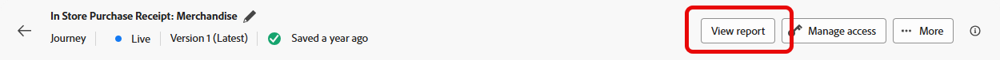
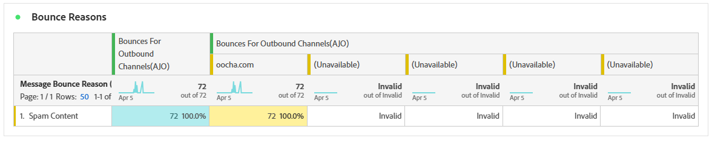

# Rapporto sul percorso e-mail {#journey-global-report}

>[!INFO]
>
>Poiché Apple ha introdotto nuove funzioni di protezione della privacy per la sua app Mail nativa, tra cui Protezione privacy della posta, i mittenti non possono più utilizzare i pixel di tracciamento per raccogliere dati sui profili che hanno abilitato la Protezione della privacy della posta di Apple. Di conseguenza, potrebbe essere influenzata la capacità di Adobe Journey Optimizer di tenere traccia delle aperture delle e-mail utilizzando i pixel di tracciamento.
> [Ulteriori informazioni](https://experienceleaguecommunities.adobe.com/t5/adobe-campaign-classic-blogs/the-impact-of-apple-ios-privacy-changes-on-email-marketing-and/ba-p/699780?profile.language=it) sull&#39;impatto delle modifiche alla privacy di Apple iOS sul marketing via e-mail.
> 
> Per informazioni più precise, consigliamo di concentrarti sui clic e sulle metriche di conversione invece dei tassi di apertura.

>[!BEGINSHADEBOX]

Per accedere al report del percorso di posta elettronica, fai clic sul pulsante **[!UICONTROL Visualizza report]** all&#39;interno del percorso. [Ulteriori informazioni](report-gs-cja.md)

>[!ENDSHADEBOX]

## Tendenza consegne e clic {#delivered-click}

Il grafico **[!UICONTROL Tendenza consegna vs clic]** presenta un&#39;analisi dettagliata del coinvolgimento dei profili con le e-mail, fornendo informazioni utili su come vari domini interagiscono con il contenuto.

+++ Ulteriori informazioni sulle metriche di tendenza Consegne e Clic

* **[!UICONTROL Recapitato]**: numero di e-mail inviate correttamente rispetto al numero totale di e-mail inviate.

* **[!UICONTROL Clic]**: numero di volte in cui è stato fatto clic su un contenuto nelle e-mail.

+++

## Stato consegna {#delivery-status}

Il grafico **[!UICONTROL Stato consegna]** ti consente di visualizzare immediatamente le prestazioni delle e-mail. Tieni traccia di metriche chiave come consegne e mancati recapiti, consentendoti di comprendere rapidamente l’efficienza del percorso e-mail.

+++ Ulteriori informazioni sulle metriche dello stato della consegna

* **[!UICONTROL Recapitato]**: numero di e-mail inviate correttamente rispetto al numero totale di e-mail inviate.

* **[!UICONTROL Mancati recapiti per i canali in uscita]**: totale degli errori accumulati durante il processo di invio e l&#39;elaborazione automatica dei resi in relazione al numero totale di messaggi inviati.

* **[!UICONTROL Errori in uscita]**: numero totale di errori che si sono verificati durante un processo di invio e che ne hanno impedito l&#39;invio ai profili.

* **[!UICONTROL Esclusi]**: numero di profili esclusi da Adobe Journey Optimizer.

+++

## Statistiche di invio {#email-sending-statistics}

La tabella **[!UICONTROL Statistiche di invio]** fornisce una visualizzazione chiara delle prestazioni delle e-mail all&#39;interno dei percorsi. Tiene traccia di metriche chiave come i tassi di consegna e le interazioni, fornendo informazioni utili per ottimizzare la strategia e-mail per una migliore portata e coinvolgimento.

+++ Ulteriori informazioni sull’invio di metriche delle statistiche

* **[!UICONTROL Destinato]**: numero totale di e-mail elaborate durante il processo di invio.

* **[!UICONTROL Invii]**: numero totale di invii per e-mail.

* **[!UICONTROL Recapitato]**: numero di e-mail inviate correttamente, in relazione al numero totale di messaggi inviati.

* **[!UICONTROL Consegne univoche]**: numero di profili che hanno ricevuto almeno un&#39;e-mail.

* **[!UICONTROL Mancati recapiti per i canali in uscita]**: totale degli errori accumulati durante il processo di invio e l&#39;elaborazione automatica dei resi in relazione al numero totale di messaggi inviati.

* **[!UICONTROL Errori in uscita]**: numero totale di errori che si sono verificati durante il processo di invio e che ne hanno impedito l&#39;invio ai profili.

* **[!UICONTROL Esclusioni in uscita]**: numero di profili esclusi da Adobe Journey Optimizer.

+++

## E-mail - Statistiche di tracciamento {#email-tracking}

La tabella **[!UICONTROL E-mail - Statistiche di tracciamento]** offre un account dettagliato dell&#39;attività del profilo relativa alle e-mail incluse nel percorso. Ciò include metriche su aperture, clic e altri indicatori di coinvolgimento rilevanti, che offrono una visualizzazione completa del modo in cui i profili interagiscono con il contenuto dell’e-mail.

+++ Ulteriori informazioni sulle metriche delle statistiche di tracciamento

* **[!UICONTROL Tasso di click-through (CTR)]**: percentuale di utenti che hanno interagito con l&#39;e-mail.

* **[!UICONTROL Percentuale di apertura dei clic]**: numero di volte in cui l&#39;e-mail è stata aperta.

* **[!UICONTROL Clic]**: numero di volte in cui è stato fatto clic su un contenuto nelle e-mail.

* **[!UICONTROL Clic univoci]**: numero di profili che hanno fatto clic su un contenuto in un messaggio e-mail.

* **[!UICONTROL Aperture e-mail]**: il numero di volte in cui le e-mail sono state aperte in una campagna.

* **[!UICONTROL Aperture e-mail univoche]**: numero di profili che hanno aperto le e-mail.

* **[!UICONTROL Reclami spam]**: numero di volte in cui un messaggio è stato dichiarato come spam o posta indesiderata.

* **[!UICONTROL Annullamenti iscrizione]**: numero di clic sul collegamento di annullamento dell&#39;iscrizione.

* **[!UICONTROL Annullamenti iscrizione e-mail univoci]**: numero di profili che hanno annullato l&#39;iscrizione alle e-mail.
+++

## Domini e-mail {#email-domains}

La tabella **[!UICONTROL Domini e-mail]** offre una suddivisione approfondita delle e-mail suddivise per dominio, fornendo informazioni approfondite sulle metriche delle prestazioni dei percorsi e-mail. Questa analisi completa ti consente di comprendere il comportamento di diversi domini in risposta al contenuto delle e-mail.

+++ Ulteriori informazioni sulle metriche dei domini e-mail

* **[!UICONTROL Invii]**: numero totale di invii per e-mail.

* **[!UICONTROL Recapitato]**: numero di e-mail inviate correttamente rispetto al numero totale di e-mail inviate.

* **[!UICONTROL Aperture e-mail]**: il numero di volte in cui le e-mail sono state aperte in un percorso.

* **[!UICONTROL Clic]**: numero di volte in cui è stato fatto clic su un contenuto nelle e-mail.

* **[!UICONTROL Mancati recapiti per i canali in uscita]**: numero totale di errori accumulati durante il processo di invio e l&#39;elaborazione della restituzione automatica in relazione al numero totale di e-mail inviate.

* **[!UICONTROL Errori in uscita]**: numero totale di errori che si sono verificati durante il processo di invio e che ne hanno impedito l&#39;invio ai profili.

* **[!UICONTROL Esclusioni in uscita]**: numero di profili esclusi da Adobe Journey Optimizer.

+++

## Etichette collegamenti tracciati {#track-link-label}

La tabella **[!UICONTROL Etichette di collegamento tracciate]** offre una panoramica completa delle etichette di collegamento all&#39;interno delle e-mail, evidenziando quelle che generano il traffico di visitatori più elevato. Questa funzione ti consente di identificare e assegnare la priorità ai collegamenti più popolari.

+++ Ulteriori informazioni sulle metriche delle etichette dei collegamenti tracciati

* **[!UICONTROL Clic univoci]**: numero di profili che hanno fatto clic su un contenuto in un messaggio e-mail.

* **[!UICONTROL Clic]**: numero di volte in cui è stato fatto clic su un contenuto nelle e-mail.

+++

## URL collegamenti tracciati {#track-link-url}

La tabella **[!UICONTROL URL di collegamento tracciati]** fornisce una panoramica completa degli URL all&#39;interno dell&#39;e-mail che attraggono il traffico più elevato dei visitatori. Questo consente di identificare e assegnare la priorità ai collegamenti più popolari, migliorando la comprensione del coinvolgimento del profilo con contenuti specifici nelle e-mail.

+++ Ulteriori informazioni sulle metriche degli URL di collegamento tracciati

* **[!UICONTROL Clic univoci]**: numero di profili che hanno fatto clic su un contenuto in un messaggio e-mail.

* **[!UICONTROL Clic]**: numero di volte in cui è stato fatto clic su un contenuto nelle e-mail.

+++

## Oggetti e-mail {#email-subject}

La tabella **[!UICONTROL Oggetti e-mail]** presenta una panoramica completa degli oggetti e-mail che hanno attirato il traffico visitatore più elevato. Questa risorsa offre informazioni preziose sulle dinamiche di coinvolgimento del pubblico.

+++ Ulteriori informazioni sulle metriche degli oggetti e-mail

* **[!UICONTROL Recapitato]**: numero di e-mail inviate correttamente rispetto al numero totale di e-mail inviate.

* **[!UICONTROL Consegne univoche]**: numero di profili distinti che hanno ricevuto correttamente almeno un&#39;e-mail, assicurando che i duplicati non vengano conteggiati.
+++

## Motivi di mancato recapito {#email-bounce-reasons}

La tabella **[!UICONTROL Motivi di mancato recapito]** compila i dati disponibili relativi ai messaggi non recapitati, fornendo informazioni dettagliate sui motivi specifici alla base dei mancati recapiti e-mail.

Per ulteriori informazioni sui mancati recapiti, consulta la pagina [Elenco di soppressione](../reports/suppression-list.md).

## Motivi di esclusione {#email-excluded}

La tabella **[!UICONTROL Motivi di esclusione]** presenta una visualizzazione completa dei diversi fattori che hanno determinato l&#39;esclusione dei profili utente dal pubblico di destinazione, causando la mancata ricezione del messaggio.

Per un elenco completo dei motivi di esclusione, consulta [questa pagina](exclusion-list.md).

## Motivi di errore {#email-errors}

La tabella **[!UICONTROL Motivi di errore]** offre visibilità sugli errori specifici che si sono verificati durante il processo di invio, fornendo informazioni utili sulla natura e sulla ricorrenza degli errori.
