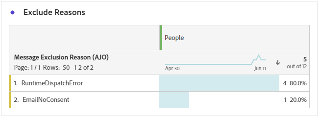

# Rapporto percorso notifiche push {#journey-global-report}

>[!BEGINSHADEBOX]

Puoi accedere al report del percorso di notifiche push facendo clic sul pulsante **[!UICONTROL Visualizza report]** all&#39;interno del percorso. [Ulteriori informazioni](report-gs-cja.md)

>[!ENDSHADEBOX]

## Statistiche di invio {#sending-statistics-push}

La tabella **[!UICONTROL Statistiche di invio]** consente di comprendere le prestazioni delle notifiche push. Include metriche chiave come il tasso di consegna e la dimensione del pubblico, che ti forniscono informazioni preziose sull’efficacia e la portata dei tuoi percorsi.

+++ Ulteriori informazioni sull’invio di metriche delle statistiche

* **[!UICONTROL Persone]**: numero di profili utente qualificati come profili target per i messaggi SMS.

* **[!UICONTROL Target]**: numero totale di notifiche push elaborate durante l&#39;analisi.

* **[!UICONTROL Invii]**: numero totale di invii per la notifica push.

* **[!UICONTROL Recapitato]**: numero di notifiche push inviate correttamente, in relazione al numero totale di notifiche push inviate.

* **[!UICONTROL Mancati recapiti per i canali in uscita]**: totale degli errori accumulati durante il processo di invio ed elaborazione automatica dei resi in relazione al numero totale di notifiche push.

* **[!UICONTROL Errori in uscita]**: numero totale di errori che ne impediscono l&#39;invio ai profili.

* **[!UICONTROL Esclusioni in uscita]**: numero di profili esclusi da Adobe Journey Optimizer.

+++

## Statistiche di tracciamento {#tracking-statistics-push}

La tabella **[!UICONTROL Statistiche di tracciamento]** offre un&#39;istantanea dettagliata dell&#39;attività di profilo associata alle notifiche push, fornendo informazioni essenziali sull&#39;efficacia delle notifiche push e di coinvolgimento.

+++ Ulteriori informazioni sulle metriche delle statistiche di tracciamento

* **[!UICONTROL Tasso di click-through (CTR)]**: percentuale di utenti che hanno interagito con la notifica push.

* **[!UICONTROL Tasso di apertura click-through (CTOR)]**: numero di volte in cui la notifica push è stata aperta.

* **[!UICONTROL Clic]**: numero di volte in cui è stato fatto clic su un contenuto nella notifica push.

* **[!UICONTROL Clic univoci]**: numero di profili che hanno fatto clic su un contenuto nella notifica push.

* **[!UICONTROL Azioni personalizzate push]**: numero di azioni personalizzate eseguite dai profili in risposta alle notifiche push.
+++

## Etichette collegamenti tracciati {#track-link-label-push}

La tabella **[!UICONTROL Etichette di collegamento tracciate]** offre una panoramica completa delle etichette di collegamento all&#39;interno delle notifiche push, evidenziando quelle che generano il traffico di visitatori più elevato. Questa funzione ti consente di identificare e assegnare la priorità ai collegamenti più popolari.

+++ Ulteriori informazioni sulle metriche delle etichette dei collegamenti tracciati

* **[!UICONTROL Clic univoci]**: numero di profili che hanno fatto clic su un contenuto nelle notifiche push.

* **[!UICONTROL Clic]**: numero di volte in cui è stato fatto clic su un contenuto nelle notifiche push.

+++

## URL collegamenti tracciati {#track-link-url-push}

La tabella **[!UICONTROL URL di collegamento tracciati]** fornisce una panoramica completa degli URL all&#39;interno delle notifiche push che attirano il traffico più elevato di visitatori. Questo consente di identificare e assegnare la priorità ai collegamenti più popolari, migliorando la comprensione del coinvolgimento del profilo con contenuti specifici nelle notifiche push.

+++ Ulteriori informazioni sulle metriche degli URL di collegamento tracciati

* **[!UICONTROL Clic univoci]**: numero di profili che hanno fatto clic su un contenuto nelle notifiche push.

* **[!UICONTROL Clic]**: numero di volte in cui è stato fatto clic su un contenuto nelle notifiche push.

+++

## Motivi di mancato recapito {#bounce-reasons-push}

La tabella **[!UICONTROL Motivi di mancato recapito]** fornisce una panoramica completa dei dati relativi alle notifiche push non recapitate, fornendo informazioni utili sulle ragioni specifiche alla base delle istanze di mancato recapito delle notifiche push.

## Motivi di errore {#error-reasons-push}

La tabella **[!UICONTROL Motivi di errore]** consente di identificare gli errori specifici che si sono verificati durante il processo di invio delle notifiche push, semplificando un&#39;analisi approfondita di eventuali problemi riscontrati.

## Motivi di esclusione {#exclude-reasons-push}

La tabella **[!UICONTROL Escludi motivi]** illustra visivamente i diversi fattori che hanno portato all&#39;esclusione dei profili utente dal pubblico di destinazione, impedendo loro di ricevere le notifiche push.

Per un elenco completo dei motivi di esclusione, consulta [questa pagina](exclusion-list.md).
