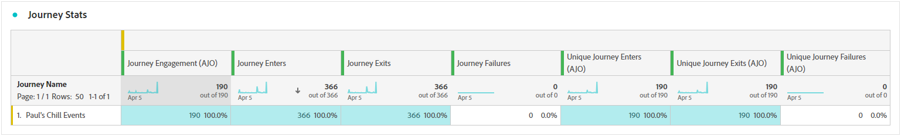
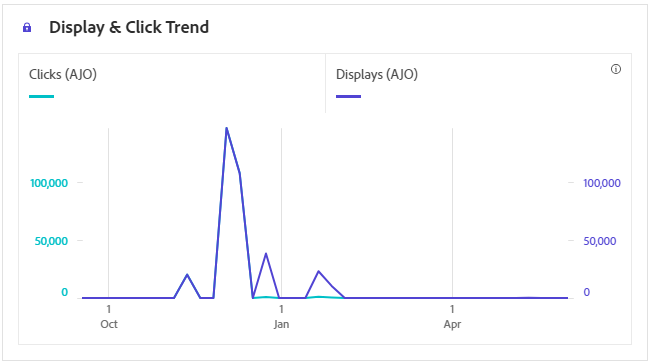

# Rapporto percorso {#journey-global-report}

Il **Rapporto percorso** funge da dashboard completo che fornisce un’analisi delle metriche essenziali associate al percorso. Questo include dettagli quali il conteggio dei profili inseriti e delle istanze di singoli percorsi non riusciti, offrendo una visione completa dell’efficacia e del livello di coinvolgimento del tuo percorso.

**Rapporto percorso** è accessibile direttamente dal percorso con **[!UICONTROL Visualizza rapporto]** pulsante.

Il **[!UICONTROL Rapporto percorso]** La pagina verrà visualizzata con le seguenti schede, a seconda delle attività relative ai messaggi nel percorso:

* [Percorso](#journey-global)
* [E-mail](#email-global)
* [Push](#push-global)
* [SMS](#sms-global)
* [In-app](#in-app-global)
* [Web](#web-cja)
* [Direct mail](#direct-mail-cja)

Per ulteriori informazioni su Workspace di Customer Journey Analytics e su come filtrare e analizzare i dati, consulta [questa pagina](https://experienceleague.adobe.com/en/docs/analytics-platform/using/cja-workspace/home).

## Panoramica del percorso {#journey-global}

Il **[!UICONTROL Percorso]** Il rapporto offre una visualizzazione chiara dei dati di tracciamento più importanti sul percorso.

### KPI PERCORSO {#journey-perfomance}

Il **[!UICONTROL Percorso]** Gli indicatori di prestazioni chiave (KPI, Key Performance Indicators) funzionano come un dashboard completo che fornisce un’analisi delle metriche essenziali associate al percorso. Questo include dettagli quali il conteggio del profilo inserito e delle istanze di singoli percorsi non riusciti, offrendo una visione completa dell’efficacia e del livello di coinvolgimento del percorso.

+++ Ulteriori informazioni sulle metriche dei KPI di Percorso

* **[!UICONTROL Coinvolgimento percorso]**: numero totale di individui che hanno interagito con i messaggi inviati dal percorso

* **[!UICONTROL Entrate percorso]**: numero totale di individui che hanno raggiunto l’evento di ingresso del percorso.

* **[!UICONTROL Uscite dal percorso]**: numero totale di individui che sono usciti dal percorso.

* **[!UICONTROL Errori di percorso]**: numero totale di singoli percorsi non eseguiti correttamente.

+++

### Statistiche percorso {#journey-stats}

Il **[!UICONTROL Statistiche percorso]** La tabella offre un riepilogo dettagliato dei dati fondamentali sui percorsi. Include metriche chiave come il numero di errori e di voci di successo, fornendo informazioni utili sulle prestazioni e sulla portata delle e-mail e dei percorsi.

+++ Ulteriori informazioni sulle metriche delle statistiche di Percorso

* **[!UICONTROL Coinvolgimento percorso]**: numero totale di individui che hanno interagito con i messaggi inviati dal percorso.

* **[!UICONTROL Entrate percorso]**: numero totale di individui che hanno raggiunto l’evento di ingresso del percorso.

* **[!UICONTROL Uscite dal percorso]**: numero totale di individui che sono usciti dal percorso.

* **[!UICONTROL Errori di percorso]**: numero totale di singoli percorsi non eseguiti correttamente.

* **[!UICONTROL Entrate Percorso univoche]**: numero totale di individui che hanno raggiunto l’evento di ingresso del percorso; non vengono prese in considerazione interazioni multiple di un profilo.

* **[!UICONTROL Uscite da Percorso univoche]**: numero totale di individui che sono usciti dal percorso; non vengono prese in considerazione più interazioni di un profilo.

* **[!UICONTROL Errori di Percorso univoci]**: numero totale di singoli percorsi non eseguiti correttamente; non vengono prese in considerazione più interazioni di un profilo.

+++

## Area di lavoro percorso {#journey-canvas}

Il **[!UICONTROL Area di lavoro percorso]** Il widget consente di tracciare visivamente la traiettoria dei profili target durante la navigazione nel percorso.

Migliora la personalizzazione dell’area di lavoro con le seguenti opzioni:

* Aggiungi o rimuovi il tipo di attività desiderato, ad esempio messaggi o condizioni, dal **[!UICONTROL Tipo di nodo]** menu a discesa.
* Regolare **[!UICONTROL Valore percentuale]** per determinare la distribuzione del flusso tra percorsi di percorso diversi.
* Personalizza **[!UICONTROL Impostazioni freccia]** per includere etichette, condizioni o scegliere una visualizzazione pulita.
* Abilita **[!UICONTROL Mostra abbandono]** per visualizzare i profili che sono usciti dal percorso direttamente sull’area di lavoro.

## Prestazione dell’azione {#action-performance}

### Prestazioni nel tempo {#action-overtime}

Il **[!UICONTROL Prestazioni nel tempo]** grafo consente di identificare e analizzare il numero di profili che soddisfano i criteri per essere considerati profili target per le azioni. Questa visualizzazione fornisce informazioni utili sull’efficacia delle strategie e ti aiuta a prendere decisioni basate sui dati per ottimizzare le prestazioni.

### Panoramica delle azioni {#action-overview}

Il **[!UICONTROL Panoramica delle azioni]** La tabella funge da dashboard completo e offre un’analisi delle metriche chiave correlate alle azioni nel percorso. Ciò include dettagli fondamentali come il numero di interazioni e il tasso di click-through

+++ Ulteriori informazioni sulle metriche della panoramica delle azioni

* **[!UICONTROL Persone]**: numero di profili utente idonei come profili target per le azioni.

* **[!UICONTROL Percentuale di clic minimi]**: percentuale di utenti che hanno interagito con l’azione.

* **[!UICONTROL Clic]**: numero di volte in cui hai fatto clic su un contenuto nelle azioni.

* **[!UICONTROL Consegnato]**: numero di azioni inviate correttamente, in relazione al numero totale di azioni inviate.

+++

## Prestazioni degli eventi {#events-performance}

### Prestazioni nel tempo {#event-overtime}

Il **[!UICONTROL Prestazioni nel tempo]** graph ti consente di identificare e analizzare il numero di profili idonei come profili target per i tuoi eventi. Questo potente strumento consente di monitorare tendenze e modelli nel tempo, fornendo informazioni utili per ottimizzare le strategie degli eventi.

### Panoramica dell’evento {#event-overview}

Il **[!UICONTROL Panoramica dell’evento]** La tabella mostra quanti profili soddisfano i criteri dell’evento nel tempo. Questo strumento consente di identificare pattern nei tassi di qualificazione per perfezionare la strategia degli eventi.

+++ Ulteriori informazioni sulle metriche delle statistiche di Percorso

* **[!UICONTROL Persone]**: numero di profili utente qualificati come profili target per i tuoi eventi.

+++

## Dettagli e-mail {#email-global}

Dal report del percorso, il **[!UICONTROL E-mail]** Questa scheda contiene le informazioni principali relative alle e-mail inviate nel percorso.

### Tendenza consegne e clic {#delivered-click}

Il **[!UICONTROL Tendenza consegne e clic]** graph presenta un’analisi dettagliata del coinvolgimento dei profili con le e-mail, fornendo informazioni utili su come vari domini interagiscono con il contenuto.

+++ Ulteriori informazioni sulle metriche di tendenza Consegne e Clic

* **[!UICONTROL Consegnato]**: numero di e-mail inviate correttamente, in relazione al numero totale di e-mail inviate.

* **[!UICONTROL Clic]**: numero di volte in cui hai fatto clic su un contenuto nelle e-mail.

+++

### Stato consegna {#delivery-status}

Il **[!UICONTROL Stato della consegna]** grafico consente di visualizzare subito le prestazioni delle e-mail. Tieni traccia di metriche chiave come consegne e mancati recapiti, consentendoti di comprendere rapidamente l’efficienza del percorso e-mail.

+++ Ulteriori informazioni sulle metriche dello stato della consegna

* **[!UICONTROL Consegnato]**: numero di e-mail inviate correttamente, in relazione al numero totale di e-mail inviate.

* **[!UICONTROL Mancati recapiti per i canali in uscita]**: totale degli errori accumulati durante il processo di invio e l’elaborazione automatica della restituzione in relazione al numero totale di messaggi inviati.

* **[!UICONTROL Errori in uscita]**: numero totale di errori che si sono verificati durante un processo di invio e che ne hanno impedito l’invio ai profili.

* **[!UICONTROL Escluso]**: numero di profili che sono stati esclusi da Adobe Journey Optimizer.

+++

### Statistiche di invio {#email-sending-statistics}

Il **[!UICONTROL Statistiche di invio]** fornisce una chiara visualizzazione delle prestazioni delle e-mail all’interno dei tuoi percorsi. Tiene traccia di metriche chiave come i tassi di consegna e le interazioni, fornendo informazioni utili per ottimizzare la strategia e-mail per una migliore portata e coinvolgimento.

+++ Ulteriori informazioni sull’invio di metriche delle statistiche

* **[!UICONTROL Persone]**: numero di profili utente qualificati come profili target per i messaggi.

* **[!UICONTROL Target]**: numero totale di e-mail elaborate durante il processo di invio.

* **[!UICONTROL Invia]**: numero totale di invii per e-mail.

* **[!UICONTROL Consegnato]**: numero di e-mail inviate correttamente, in relazione al numero totale di messaggi inviati.

* **[!UICONTROL Mancati recapiti]**: totale degli errori accumulati durante il processo di invio e l’elaborazione automatica della restituzione in relazione al numero totale di messaggi inviati.

* **[!UICONTROL Errori in uscita]**: numero totale di errori che si sono verificati durante il processo di invio e che ne hanno impedito l’invio ai profili.

* **[!UICONTROL Esclusioni in uscita]**: numero di profili che sono stati esclusi da Adobe Journey Optimizer.

+++

### E-mail - Statistiche di tracciamento {#email-tracking}

Il **[!UICONTROL E-mail - Statistiche di tracciamento]** la tabella offre un account dettagliato dell’attività del profilo relativa alle e-mail incluse nel percorso. Ciò include metriche su aperture, clic e altri indicatori di coinvolgimento rilevanti, che offrono una visualizzazione completa del modo in cui i profili interagiscono con il contenuto dell’e-mail.

+++ Ulteriori informazioni sulle metriche delle statistiche di tracciamento

* **[!UICONTROL Percentuale di click-through (CTR)]**: percentuale di utenti che hanno interagito con l’e-mail.

* **[!UICONTROL Percentuale di apertura click-through (CTOR)]**: numero di volte in cui l’e-mail è stata aperta.

* **[!UICONTROL Clic]**: numero di volte in cui hai fatto clic su un contenuto nelle e-mail.

* **[!UICONTROL Clic univoci]**: numero di profili che hanno fatto clic su un contenuto in un messaggio e-mail.

* **[!UICONTROL Aperture e-mail]**: numero di volte in cui le e-mail sono state aperte in un percorso.

* **[!UICONTROL Aperture e-mail univoche]**: percentuale di e-mail aperte.

* **[!UICONTROL Reclami spam]**: numero di volte in cui un messaggio è stato dichiarato come spam o posta indesiderata.

* **[!UICONTROL Annulla iscrizione]**: numero di clic sul collegamento di annullamento dell’abbonamento.

+++

### Domini e-mail {#email-domains}

Il **[!UICONTROL Domini e-mail]** La tabella offre una suddivisione dettagliata delle e-mail, suddivise per dominio, con informazioni approfondite sulle metriche delle prestazioni dei percorsi e-mail. Questa analisi completa ti consente di comprendere il comportamento di diversi domini in risposta al contenuto delle e-mail.

+++ Ulteriori informazioni sulle metriche dei domini e-mail

* **[!UICONTROL Invia]**: numero totale di invii per e-mail.

* **[!UICONTROL Consegnato]**: numero di e-mail inviate correttamente, in relazione al numero totale di e-mail inviate.

* **[!UICONTROL Aperture e-mail]**: numero di volte in cui le e-mail sono state aperte in un percorso.

* **[!UICONTROL Clic]**: numero di volte in cui hai fatto clic su un contenuto nelle e-mail.

* **[!UICONTROL Mancati recapiti per i canali in uscita]**: numero totale di errori accumulati durante il processo di invio e l’elaborazione automatica della restituzione in relazione al numero totale di e-mail inviate.

* **[!UICONTROL Errori in uscita]**: numero totale di errori che si sono verificati durante il processo di invio e che ne hanno impedito l’invio ai profili.
+++

### Etichette collegamenti tracciati {#track-link-label}

Il **[!UICONTROL Etichette collegamento tracciato]** La tabella offre una panoramica completa delle etichette dei collegamenti all’interno delle e-mail, evidenziando quelle che generano il traffico di visitatori più elevato. Questa funzione ti consente di identificare e assegnare la priorità ai collegamenti più popolari.

+++ Ulteriori informazioni sulle metriche delle etichette dei collegamenti tracciati

* **[!UICONTROL Clic univoci]**: numero di profili che hanno fatto clic su un contenuto in un messaggio e-mail.

* **[!UICONTROL Clic]**: numero di volte in cui hai fatto clic su un contenuto nelle e-mail.

+++

### URL collegamenti tracciati {#track-link-url}

Il **[!UICONTROL URL di collegamento tracciati]** fornisce una panoramica completa degli URL all’interno dell’e-mail che attraggono il traffico di visitatori più elevato. Questo consente di identificare e assegnare la priorità ai collegamenti più popolari, migliorando la comprensione del coinvolgimento del profilo con contenuti specifici nelle e-mail.

+++ Ulteriori informazioni sulle metriche degli URL di collegamento tracciati

* **[!UICONTROL Clic univoci]**: numero di profili che hanno fatto clic su un contenuto in un messaggio e-mail.

* **[!UICONTROL Clic]**: numero di volte in cui hai fatto clic su un contenuto nelle e-mail.

* **[!UICONTROL Display]**: numero di volte in cui il messaggio è stato aperto.

* **[!UICONTROL Visualizzazioni univoche]**: numero di volte in cui il messaggio è stato aperto; non vengono considerate più interazioni di un profilo.

+++

### Oggetti e-mail {#email-subject}

Il **[!UICONTROL Oggetti e-mail]**  La tabella presenta una panoramica completa degli argomenti e-mail che hanno attirato il traffico di visitatori più elevato. Questa risorsa offre informazioni preziose sulle dinamiche di coinvolgimento del pubblico.

+++ Ulteriori informazioni sulle metriche degli oggetti e-mail

* **[!UICONTROL Persone]**: numero di profili utente qualificati come profili target per le e-mail.

+++

### Motivi di mancato recapito {#email-bounce-reasons}

Il **[!UICONTROL Motivi di mancato recapito]** In questa tabella vengono compilati i dati disponibili relativi ai messaggi non recapitati, fornendo informazioni dettagliate sui motivi specifici alla base dei messaggi non recapitati.

Per ulteriori informazioni sui mancati recapiti, consulta [Elenco di soppressione](../reports/suppression-list.md) pagina.

### Motivi di esclusione {#email-excluded}

Il **[!UICONTROL Motivi di esclusione]** La tabella presenta una panoramica completa dei diversi fattori che hanno determinato l’esclusione dei profili utente dal pubblico di destinazione, causando la mancata ricezione del messaggio.

Fai riferimento a [questa pagina](exclusion-list.md) per l’elenco completo dei motivi di esclusione.

### Motivi di errore {#email-errors}

Il **[!UICONTROL Motivi di errore]** La tabella offre visibilità sugli errori specifici che si sono verificati durante il processo di invio, fornendo informazioni utili sulla natura e sul verificarsi degli errori.

## Scheda notifica push {#push-global}

Dal report del percorso, il **[!UICONTROL Notifica push]** La scheda fornisce informazioni dettagliate sulle informazioni principali relative alle notifiche push inviate nel percorso.

## Notifica push {#push-notification}

### Statistiche di invio {#sending-statistics-push}

Il **[!UICONTROL Statistiche di invio]** Questa tabella consente di comprendere le prestazioni delle notifiche push. Include metriche chiave come il tasso di consegna e la dimensione del pubblico, che ti forniscono informazioni preziose sull’efficacia e la portata dei tuoi percorsi.

+++ Ulteriori informazioni sull’invio di metriche delle statistiche

* **[!UICONTROL Persone]**: numero di profili utente qualificati come profili target per i messaggi SMS.

* **[!UICONTROL Target]**: numero totale di notifiche push elaborate durante l’analisi.

* **[!UICONTROL Invia]**: numero totale di invii per la notifica push.

* **[!UICONTROL Consegnato]**: numero di notifiche push inviate correttamente, in relazione al numero totale di notifiche push inviate.

* **[!UICONTROL Mancati recapiti per i canali in uscita]**: totale degli errori accumulati durante il processo di invio e l’elaborazione automatica della restituzione in relazione al numero totale di notifiche push.

* **[!UICONTROL Errori in uscita]**: numero totale di errori che ne hanno impedito l’invio ai profili.

* **[!UICONTROL Esclusioni in uscita]**: numero di profili che sono stati esclusi da Adobe Journey Optimizer.

+++

### Statistiche di tracciamento {#tracking-statistics-push}

Il **[!UICONTROL Statistiche di tracciamento]** la tabella offre un’istantanea dettagliata dell’attività del profilo associata alle notifiche push, con informazioni essenziali sull’efficacia di tali notifiche.

+++ Ulteriori informazioni sulle metriche delle statistiche di tracciamento

* **[!UICONTROL Percentuale di click-through (CTR)]**: percentuale di utenti che hanno interagito con la notifica push.

* **[!UICONTROL Percentuale di apertura click-through (CTOR)]**: numero di volte in cui la notifica push è stata aperta.

* **[!UICONTROL Clic]**: numero di volte in cui è stato fatto clic su un contenuto nella notifica push.

* **[!UICONTROL Clic univoci]**: numero di profili che hanno fatto clic su un contenuto nella notifica push.

<!--
* **[!UICONTROL Push custom actions]**: 
-->
+++

### Etichette collegamenti tracciati {#track-link-label-push}

Il **[!UICONTROL Etichette collegamento tracciato]** La tabella offre una panoramica completa delle etichette di collegamento all’interno delle notifiche push, evidenziando quelle che generano il traffico di visitatori più elevato. Questa funzione ti consente di identificare e assegnare la priorità ai collegamenti più popolari.

+++ Ulteriori informazioni sulle metriche delle etichette dei collegamenti tracciati

* **[!UICONTROL Clic univoci]**: numero di profili che hanno fatto clic su un contenuto nelle notifiche push.

* **[!UICONTROL Clic]**: numero di volte in cui è stato fatto clic su un contenuto nelle notifiche push.

+++

### URL collegamenti tracciati {#track-link-url-push}

Il **[!UICONTROL URL di collegamento tracciati]** fornisce una panoramica completa degli URL all’interno delle notifiche push che attraggono il traffico di visitatori più elevato. Questo consente di identificare e assegnare la priorità ai collegamenti più popolari, migliorando la comprensione del coinvolgimento del profilo con contenuti specifici nelle notifiche push.

+++ Ulteriori informazioni sulle metriche degli URL di collegamento tracciati

* **[!UICONTROL Clic univoci]**: numero di profili che hanno fatto clic su un contenuto nelle notifiche push.

* **[!UICONTROL Clic]**: numero di volte in cui è stato fatto clic su un contenuto nelle notifiche push.

+++

### Motivi di mancato recapito {#bounce-reasons-push}

Il **[!UICONTROL Motivi di mancato recapito]** La tabella fornisce una panoramica completa dei dati relativi alle notifiche push non recapitate, con informazioni utili sulle ragioni specifiche alla base delle istanze di tali notifiche.

### Motivi di errore {#error-reasons-push}

Il **[!UICONTROL Motivi di errore]** Questa tabella ti consente di identificare gli errori specifici che si sono verificati durante il processo di invio delle notifiche push, semplificando un’analisi approfondita di eventuali problemi riscontrati.

### Motivi di esclusione {#exclude-reasons-push}

Il **[!UICONTROL Escludi motivi]** La tabella mostra visivamente i diversi fattori che hanno portato all’esclusione dei profili utente dal pubblico di destinazione, impedendo loro di ricevere le notifiche push.

Fai riferimento a [questa pagina](exclusion-list.md) per l’elenco completo dei motivi di esclusione.

## SMS {#sms}

### Tendenza consegne e clic {#delivered-click-sms}

Il **[!UICONTROL Tendenza consegne e clic]** graph presenta un’analisi dettagliata del coinvolgimento dei profili con i messaggi SMS, fornendo informazioni utili su come vari domini interagiscono con i contenuti.

+++ Ulteriori informazioni sulle metriche di tendenza Consegne e Clic

* **[!UICONTROL Consegnato]**: numero di messaggi SMS inviati correttamente, in relazione al numero totale di messaggi SMS.

* **[!UICONTROL Clic]**: numero di volte in cui si è fatto clic su un contenuto nei messaggi SMS.

+++

### Stato consegna {#delivery-status-sms}

Il **[!UICONTROL Stato della consegna]** La tabella offre un account dettagliato dell’attività profilo correlata ai messaggi SMS. Ciò include metriche su consegnati, clic e altri indicatori di coinvolgimento rilevanti, che offrono una panoramica completa del modo in cui i profili interagiscono con il contenuto SMS.

+++ Ulteriori informazioni sulle metriche dello stato della consegna

* **[!UICONTROL Consegnato]**: numero di messaggi SMS inviati correttamente, in relazione al numero totale di messaggi SMS.

* **[!UICONTROL Mancati recapiti per i canali in uscita]**: totale degli errori accumulati durante il processo di invio e l’elaborazione automatica della restituzione in relazione al numero totale di messaggi SMS inviati.

* **[!UICONTROL Errori in uscita]**: numero totale di errori che ne hanno impedito l’invio ai profili.

* **[!UICONTROL Esclusioni in uscita]**: numero di profili che sono stati esclusi da Adobe Journey Optimizer.

+++

### Etichette collegamenti tracciati {#track-link-label-sms}

Il **[!UICONTROL Etichette collegamento tracciato]** La tabella offre una panoramica completa delle etichette di collegamento all’interno dei messaggi SMS, evidenziando quelle che generano il traffico di visitatori più elevato. Questa funzione ti consente di identificare e assegnare la priorità ai collegamenti più popolari.

+++ Ulteriori informazioni sulle metriche delle etichette dei collegamenti tracciati

* **[!UICONTROL Clic univoci]**: numero di profili che hanno fatto clic su un contenuto nel messaggio SMS.

* **[!UICONTROL Clic]**: numero di volte in cui si è fatto clic su un contenuto nei messaggi SMS.

+++

### URL collegamenti tracciati {#track-link-url-sms}

Il **[!UICONTROL URL di collegamento tracciati]** fornisce una panoramica completa degli URL all’interno dei messaggi SMS che attraggono il traffico di visitatori più elevato. Questo consente di identificare e assegnare la priorità ai collegamenti più popolari, migliorando la comprensione del coinvolgimento del profilo con contenuti specifici nei messaggi SMS.

+++ Ulteriori informazioni sulle metriche degli URL di collegamento tracciati

* **[!UICONTROL Clic univoci]**: numero di profili che hanno fatto clic su un contenuto nel messaggio SMS.

* **[!UICONTROL Clic]**: numero di volte in cui si è fatto clic su un contenuto nei messaggi SMS.

* **[!UICONTROL Display]**: numero di volte in cui il messaggio è stato aperto.

* **[!UICONTROL Visualizzazioni univoche]**: numero di volte in cui il messaggio è stato aperto; non vengono considerate più interazioni di un profilo.

+++

### Messaggio SMS in entrata {#sms-inbound}

Il **[!UICONTROL Messaggio SMS in entrata]** La tabella presenta una panoramica completa dei messaggi SMS che hanno attirato il traffico più elevato di visitatori. Questa risorsa offre informazioni preziose sulle dinamiche di coinvolgimento del pubblico.

+++ Ulteriori informazioni sulle metriche dei messaggi SMS in entrata

* **[!UICONTROL Persone]**: numero di profili utente qualificati come profili target per i messaggi SMS.

+++

### Tipo di messaggio SMS {#sms-message-type}

Il **[!UICONTROL Tipo di messaggio SMS]** La tabella presenta una panoramica completa del tipo di messaggio SMS che ha attirato il traffico più elevato di visitatori. Questa risorsa offre informazioni preziose sulle dinamiche di coinvolgimento del pubblico.

+++ Ulteriori informazioni sulle metriche del tipo di messaggio SMS

* **[!UICONTROL Persone]**: numero di profili utente qualificati come profili target per i messaggi SMS.

+++

### Provider SMS {#sms-providers}

Il **[!UICONTROL Provider SMS]** La tabella presenta una panoramica completa dei provider SMS che hanno attirato il traffico più elevato di visitatori. Questa risorsa offre informazioni preziose sulle dinamiche di coinvolgimento del pubblico.

+++ Ulteriori informazioni sulle metriche dei provider SMS

* **[!UICONTROL Persone]**: numero di profili utente qualificati come profili target per i messaggi SMS.

+++

### Motivi di mancato recapito {#bounce-reasons-sms}

Il **[!UICONTROL Motivi di mancato recapito]** La tabella fornisce una panoramica completa dei dati relativi ai messaggi SMS non recapitati, fornendo informazioni utili sulle ragioni specifiche alla base delle istanze di messaggi SMS non recapitati.

### Motivi di errore {#error-reasons-sms}

Il **[!UICONTROL Motivi di errore]** Questa tabella ti consente di identificare gli errori specifici che si sono verificati durante il processo di invio dei messaggi SMS, facilitando un’analisi approfondita di eventuali problemi riscontrati.

### Motivi di esclusione {#excluded-reasons-sms}

Il **[!UICONTROL Escludi motivi]** La tabella mostra visivamente i diversi fattori che hanno portato all’esclusione dei profili utente dal pubblico di destinazione, impedendo loro di ricevere i messaggi SMS.

Fai riferimento a [questa pagina](exclusion-list.md) per l’elenco completo dei motivi di esclusione.

## In-app

### Tendenza impression e clic {#impression-click-trend}

Il **[!UICONTROL Tendenza impression e clic]** graph presenta un’analisi dettagliata del coinvolgimento dei profili con i messaggi in-app, fornendo informazioni utili sul modo in cui i profili interagiscono con i contenuti.

+++ Ulteriori informazioni sulle metriche della tendenza Impression &amp; Click

* **[!UICONTROL Clic]**: numero di volte in cui hai fatto clic su un contenuto nei messaggi in-app.

* **[!UICONTROL Display]**: numero di volte in cui il messaggio è stato aperto.

+++

### Clic {#clicks-inapp}

Il **[!UICONTROL Clic]** Il grafico mostra le metriche di clic in-app, illustrando sia il numero totale di clic sul contenuto che il numero di profili univoci che hanno fatto clic sul contenuto.

+++ Ulteriori informazioni sulle metriche Clic

* **[!UICONTROL Clic univoci]**: numero di profili che hanno fatto clic su un contenuto nei messaggi in-app

* **[!UICONTROL Clic]**: numero di volte in cui hai fatto clic su un contenuto nei messaggi in-app.

+++

### Visualizzazione {#display-inapp}

Il **[!UICONTROL Display]** graph consente di comprendere sia la portata complessiva del messaggio che il numero di profili univoci coinvolti.

+++ Ulteriori informazioni sulle metriche di visualizzazione

* **[!UICONTROL Display]**: numero di volte in cui il messaggio è stato aperto.

* **[!UICONTROL Visualizzazioni univoche]**: numero di volte in cui il messaggio è stato aperto; non vengono considerate più interazioni di un profilo.

+++

### Dati di tracciamento {#tracking-data-inapp}

Il **[!UICONTROL Dati di tracciamento]** La tabella offre un’istantanea dettagliata dell’attività del profilo associata ai messaggi in-app, fornendo informazioni essenziali sull’efficacia del coinvolgimento e dei messaggi in-app.

+++ Ulteriori informazioni sul tracciamento delle metriche dei dati

* **[!UICONTROL Persone]**: numero di profili utente idonei come profili di destinazione per i messaggi in-app.

* **[!UICONTROL Percentuale di click-through (CTR)]**: percentuale di utenti che hanno interagito con i messaggi in-app.

* **[!UICONTROL Percentuale di apertura del click-through (CTOR)]**: numero di volte in cui i messaggi in-app sono stati aperti.

* **[!UICONTROL Clic]**: numero di volte in cui hai fatto clic su un contenuto nei messaggi in-app.

* **[!UICONTROL Clic univoci]**: numero di profili che hanno fatto clic su un contenuto nei messaggi in-app.

* **[!UICONTROL Display]**: numero di volte in cui il messaggio è stato aperto.

* **[!UICONTROL Visualizzazioni univoche]**: numero di volte in cui il messaggio è stato aperto; non vengono considerate più interazioni di un profilo.

* **[!UICONTROL Invia]**: numero totale di invii per i messaggi in-app.

<!--
* **[!UICONTROL Inbound triggered]**: 

* **[!UICONTROL Inbound dismisses]**: 
-->
+++

### Etichette collegamenti tracciati {#track-link-label-inapp}

Il **[!UICONTROL Etichette collegamento tracciato]** La tabella offre una panoramica completa delle etichette di collegamento all’interno dei messaggi in-app, evidenziando quelle che generano il traffico di visitatori più elevato. Questa funzione ti consente di identificare e assegnare la priorità ai collegamenti più popolari.

+++ Ulteriori informazioni sulle metriche delle etichette dei collegamenti tracciati

* **[!UICONTROL Clic univoci]**: numero di profili che hanno fatto clic su un contenuto nei messaggi in-app.

* **[!UICONTROL Clic]**: numero di volte in cui hai fatto clic su un contenuto nei messaggi in-app.

* **[!UICONTROL Display]**: numero di volte in cui il messaggio è stato aperto.

* **[!UICONTROL Visualizzazioni univoche]**: numero di volte in cui il messaggio è stato aperto; non vengono considerate più interazioni di un profilo.

+++

### URL collegamenti tracciati {#track-link-url-inapp}

Il **[!UICONTROL URL di collegamento tracciati]** fornisce una panoramica completa degli URL all’interno dei messaggi in-app che attirano il traffico più elevato di visitatori. Questo consente di identificare e assegnare la priorità ai collegamenti più popolari, migliorando la comprensione del coinvolgimento del profilo con contenuti specifici nei messaggi in-app.

+++ Ulteriori informazioni sulle metriche degli URL di collegamento tracciati

* **[!UICONTROL Clic univoci]**: numero di profili che hanno fatto clic su un contenuto nei messaggi in-app

* **[!UICONTROL Clic]**: numero di volte in cui hai fatto clic su un contenuto nei messaggi in-app.

+++

## Web {#web-cja}

### Tendenza impression e clic {#impressions-web}

Il **[!UICONTROL Tendenza impression e clic]** graph presenta un’analisi dettagliata del coinvolgimento dei profili con le pagine web, fornendo informazioni utili sul modo in cui i profili interagiscono con i contenuti.

+++ Ulteriori informazioni sulle metriche della tendenza Impression &amp; Click

* **[!UICONTROL Clic]**: numero di volte in cui è stato fatto clic su un contenuto nelle pagine web.

* **[!UICONTROL Display]**: numero di volte in cui il messaggio è stato aperto.

+++

### Clic {#clicks-web}

Il **[!UICONTROL Clic]** Il grafico mostra le metriche di clic delle pagine web, illustrando sia il numero totale di clic sul contenuto che il numero di profili univoci che hanno fatto clic sul contenuto.

+++ Ulteriori informazioni sulle metriche Clic

* **[!UICONTROL Clic univoci]**: numero di profili che hanno fatto clic su un contenuto nelle pagine web.

* **[!UICONTROL Clic]**: numero di volte in cui è stato fatto clic su un contenuto nelle pagine web.

+++

### Visualizzazioni {#displays-web}

Il **[!UICONTROL Display]** graph consente di comprendere sia la portata complessiva del messaggio che il numero di profili univoci coinvolti.

+++ Ulteriori informazioni sulle metriche di visualizzazione

* **[!UICONTROL Display]**: numero di volte in cui il messaggio è stato aperto.

* **[!UICONTROL Visualizzazioni univoche]**: numero di volte in cui il messaggio è stato aperto; non vengono considerate più interazioni di un profilo.

+++

### Dati di tracciamento {#track-data-web}

Il **[!UICONTROL Dati di tracciamento]** La tabella offre un’istantanea dettagliata dell’attività di profilo associata alle pagine web, fornendo informazioni essenziali sull’efficacia del coinvolgimento e delle pagine web.

+++ Ulteriori informazioni sul tracciamento delle metriche dei dati

* **[!UICONTROL Persone]**: numero di profili utente idonei come profili target per le pagine web.

* **[!UICONTROL Percentuale di click-through (CTR)]**: percentuale di utenti che hanno interagito con le pagine web.

* **[!UICONTROL Clic]**: numero di volte in cui è stato fatto clic su un contenuto nelle pagine web.

* **[!UICONTROL Clic univoci]**: numero di profili che hanno fatto clic su un contenuto nelle pagine web.

* **[!UICONTROL Display]**: numero di volte in cui la pagina Web è stata aperta.

* **[!UICONTROL Visualizzazioni univoche]**: numero di volte in cui la pagina web è stata aperta; non vengono prese in considerazione più interazioni di un profilo.

+++

### Etichette collegamenti tracciati {#track-link-web}

Il **[!UICONTROL Etichette collegamento tracciato]** La tabella offre una panoramica completa delle etichette di collegamento all’interno delle pagine web, evidenziando quelle che generano il traffico più elevato di visitatori. Questa funzione ti consente di identificare e assegnare la priorità ai collegamenti più popolari.

+++ Ulteriori informazioni sulle metriche delle etichette dei collegamenti tracciati

* **[!UICONTROL Clic univoci]**: numero di profili che hanno fatto clic su un contenuto nelle pagine web.

* **[!UICONTROL Clic]**: numero di volte in cui è stato fatto clic su un contenuto nelle pagine web.

* **[!UICONTROL Display]**: numero di volte in cui il messaggio è stato aperto.

* **[!UICONTROL Visualizzazioni univoche]**: numero di volte in cui il messaggio è stato aperto; non vengono considerate più interazioni di un profilo.

+++

### URL collegamenti tracciati {#track-url-web}

Il **[!UICONTROL URL di collegamento tracciati]** fornisce una panoramica completa degli URL all’interno delle pagine web che attirano il traffico più elevato di visitatori. Questo consente di identificare e assegnare la priorità ai collegamenti più popolari, migliorando la comprensione del coinvolgimento del profilo con contenuti specifici nelle pagine web.

+++ Ulteriori informazioni sulle metriche degli URL di collegamento tracciati

* **[!UICONTROL Clic univoci]**: numero di profili che hanno fatto clic su un contenuto nelle pagine web.

* **[!UICONTROL Clic]**: numero di volte in cui è stato fatto clic su un contenuto nelle pagine web.

* **[!UICONTROL Display]**: numero di volte in cui il messaggio è stato aperto.

* **[!UICONTROL Visualizzazioni univoche]**: numero di volte in cui il messaggio è stato aperto; non vengono considerate più interazioni di un profilo.

+++

## Direct mail {#direct-mail-cja}

### Statistiche di invio {#sending-statistics-directmail}

Il **[!UICONTROL Statistiche di invio]** La tabella fornisce informazioni approfondite sulle prestazioni dei percorsi di direct mailing. Puoi visualizzare metriche chiave quali il numero di destinatari target e i pezzi consegnati correttamente, per misurare la portata e l’efficacia delle tue e-mail.

+++ Ulteriori informazioni sull’invio di metriche delle statistiche

* **[!UICONTROL Persone]**: numero di profili utente qualificati come profili target per i messaggi.

* **[!UICONTROL Target]**: numero totale di messaggi di direct mailing elaborati durante il processo di invio.

* **[!UICONTROL Invia]**: numero totale di invii per i messaggi di direct mailing.

* **[!UICONTROL Consegnato]**: numero di messaggi di direct mailing inviati correttamente, in relazione al numero totale di messaggi inviati.

* **[!UICONTROL Errori in uscita]**: numero totale di errori che si sono verificati durante il processo di invio e che ne hanno impedito l’invio ai profili.

* **[!UICONTROL Esclusioni in uscita]**: numero di profili che sono stati esclusi da Adobe Journey Optimizer.

+++

### Stato consegna {#delivery-status-directmail}

Il **[!UICONTROL Stato della consegna]** graph fornisce una visualizzazione completa dei dati relativi ai messaggi di direct mailing inviati nel percorso, offrendo informazioni approfondite su metriche chiave quali consegnati ed errori. Ciò consente un’analisi dettagliata del processo di invio dei messaggi di direct mailing, fornendo informazioni preziose sull’efficienza e le prestazioni dei percorsi.

+++ Ulteriori informazioni sulle metriche dello stato della consegna

* **[!UICONTROL Consegnato]**: numero di messaggi di direct mailing inviati correttamente, in relazione al numero totale di messaggi di direct mailing inviati.

* **[!UICONTROL Errori in uscita]**: numero totale di errori che si sono verificati durante un processo di invio che impediva l’invio dei messaggi di direct mailing ai profili.

* **[!UICONTROL Esclusioni in uscita]**: numero di profili che sono stati esclusi da Adobe Journey Optimizer.

+++

### Motivi di errore {#error-reasons-directmail}

Il **[!UICONTROL Motivi di errore]** Questa tabella ti consente di identificare gli errori specifici che si sono verificati durante il processo di invio dei messaggi di direct mailing, facilitando un’analisi approfondita di eventuali problemi riscontrati.

### Motivi di esclusione {#exclude-reasons-directmail}

Il **[!UICONTROL Escludi motivi]** La tabella mostra visivamente i diversi fattori che hanno portato all’esclusione dei profili utente dal pubblico di destinazione, impedendo loro di ricevere i messaggi di direct mailing.

Fai riferimento a [questa pagina](exclusion-list.md) per l’elenco completo dei motivi di esclusione.
