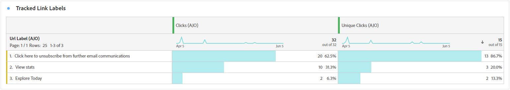
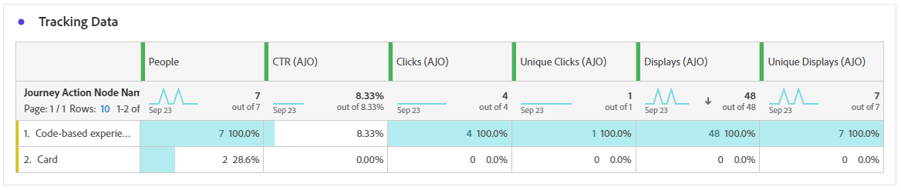

# Rapporto percorso {#journey-global-report}

Il report **Percorso** funziona come un dashboard completo che fornisce un&#39;analisi delle metriche essenziali associate al percorso. Questo include dettagli quali il conteggio dei profili inseriti e delle istanze di singoli percorsi non riusciti, offrendo una visione completa dell’efficacia e del livello di coinvolgimento del tuo percorso.

È possibile accedere al report **Percorso** direttamente dal percorso con il pulsante **[!UICONTROL Visualizza report]**.

La pagina del report **[!UICONTROL Percorso]** verrà visualizzata con le seguenti schede, a seconda delle attività relative ai messaggi nel percorso:

* [Percorso](#journey-global)
* [E-mail](#email-global)
* [Push](#push-global)
* [SMS](#sms-global)
* [In-app](#in-app-global)
* [Web](#web-cja)
* [Direct mail](#direct-mail-cja)
* [Basato su codice](#code-based)
* [Scheda contenuto](#content-card)

Per ulteriori informazioni su Customer Journey Analytics Workspace e su come filtrare e analizzare i dati, fare riferimento a [questa pagina](https://experienceleague.adobe.com/en/docs/analytics-platform/using/cja-workspace/home).

## Panoramica del percorso {#journey-global}

Il report **[!UICONTROL Percorso]** fornisce una visualizzazione chiara dei dati di tracciamento più importanti sul percorso.

### KPI PERCORSO {#journey-perfomance}

Gli indicatori di prestazioni chiave (KPI, Key Performance Indicators) di **[!UICONTROL Percorso]** funzionano come dashboard completo che fornisce un&#39;analisi delle metriche essenziali associate al percorso. Questo include dettagli quali il conteggio del profilo inserito e delle istanze di singoli percorsi non riusciti, offrendo una visione completa dell’efficacia e del livello di coinvolgimento del percorso.

+++ Ulteriori informazioni sulle metriche dei KPI di Percorso

* **[!UICONTROL Coinvolgimento di Percorso]**: numero totale di persone che hanno interagito con i messaggi inviati dal percorso

* **[!UICONTROL Il Percorso entra]**: numero totale di singoli utenti che hanno raggiunto l&#39;evento di ingresso del percorso.

* **[!UICONTROL Uscite dal Percorso]**: numero totale di singoli utenti che sono usciti dal percorso.

* **[!UICONTROL Errori di Percorso]**: numero totale di singoli percorsi non eseguiti correttamente.

+++

### Statistiche percorso {#journey-stats}

La tabella **[!UICONTROL Statistiche Percorso]** offre un riepilogo dettagliato dei dati fondamentali sui percorsi. Include metriche chiave come il numero di errori e di voci di successo, fornendo informazioni utili sulle prestazioni e sulla portata delle e-mail e dei percorsi.

+++ Ulteriori informazioni sulle metriche delle statistiche di Percorso

* **[!UICONTROL Coinvolgimento di Percorso]**: numero totale di persone che hanno interagito con i messaggi inviati dal percorso.

* **[!UICONTROL Il Percorso entra]**: numero totale di singoli utenti che hanno raggiunto l&#39;evento di ingresso del percorso.

* **[!UICONTROL Uscite dal Percorso]**: numero totale di singoli utenti che sono usciti dal percorso.

* **[!UICONTROL Errori di Percorso]**: numero totale di singoli percorsi non eseguiti correttamente.

* **[!UICONTROL Entrate Percorso univoche]**: numero totale di persone che hanno raggiunto l&#39;evento di ingresso del percorso. Non vengono prese in considerazione più interazioni di un profilo.

* **[!UICONTROL Uscite dal Percorso univoche]**: numero totale di singoli utenti che sono usciti dal percorso. Non vengono prese in considerazione più interazioni di un profilo.

* **[!UICONTROL Errori di Percorso univoci]**: numero totale di singoli percorsi non eseguiti correttamente. Non vengono prese in considerazione più interazioni di un profilo.

+++

## Area di lavoro percorso {#journey-canvas}

Il widget **[!UICONTROL Area di lavoro Percorso]** ti consente di tracciare visivamente la traiettoria dei profili di destinazione durante la navigazione nel percorso. [Ulteriori informazioni nella documentazione del Customer Journey Analytics](https://experienceleague.adobe.com/en/docs/analytics-platform/using/cja-workspace/visualizations/journey-canvas/journey-canvas)

Migliora la personalizzazione dell’area di lavoro con le seguenti opzioni:

* Aggiungere o rimuovere il tipo di attività desiderato, ad esempio messaggi o condizioni, dal menu a discesa **[!UICONTROL Tipo di nodo]**.
* Regola il **[!UICONTROL valore percentuale]** per determinare la distribuzione del flusso tra percorsi di percorso diversi.
* Personalizza le **[!UICONTROL impostazioni freccia]** per includere etichette, condizioni o scegli una visualizzazione pulita.
* Abilita l&#39;opzione **[!UICONTROL Mostra abbandono]** per visualizzare i profili che sono usciti dal percorso direttamente nell&#39;area di lavoro.

## Prestazione dell’azione {#action-performance}

### Prestazioni nel tempo {#action-overtime}

Il grafico **[!UICONTROL Prestazioni nel tempo]** ti consente di identificare e analizzare il numero di profili che soddisfano i criteri per essere considerati profili target per le azioni. Questa visualizzazione fornisce informazioni utili sull’efficacia delle strategie e ti aiuta a prendere decisioni basate sui dati per ottimizzare le prestazioni.

### Panoramica delle azioni {#action-overview}

La tabella **[!UICONTROL Panoramica azioni]** funge da dashboard completo e offre un&#39;analisi delle metriche chiave correlate alle azioni nel percorso. Ciò include dettagli fondamentali come il numero di interazioni e il tasso di click-through

+++ Ulteriori informazioni sulle metriche della panoramica delle azioni

* **[!UICONTROL Persone]**: numero di profili utente qualificati come profili target per le azioni.

* **[!UICONTROL Percentuale minima di clic]**: percentuale di utenti che hanno interagito con l&#39;azione.

* **[!UICONTROL Clic]**: numero di volte in cui è stato fatto clic su un contenuto nelle azioni.

* **[!UICONTROL Consegnato]**: numero di azioni inviate correttamente rispetto al numero totale di azioni inviate.

+++

## Prestazioni degli eventi {#events-performance}

### Prestazioni nel tempo {#event-overtime}

Il grafico **[!UICONTROL Prestazioni nel tempo]** ti consente di identificare e analizzare il numero di profili idonei come profili target per i tuoi eventi. Questo potente strumento consente di monitorare tendenze e modelli nel tempo, fornendo informazioni utili per ottimizzare le strategie degli eventi.

### Panoramica dell’evento {#event-overview}

La tabella **[!UICONTROL Panoramica eventi]** mostra quanti profili soddisfano i criteri dell&#39;evento nel tempo. Questo strumento consente di identificare pattern nei tassi di qualificazione per perfezionare la strategia degli eventi.

+++ Ulteriori informazioni sulle metriche delle statistiche di Percorso

* **[!UICONTROL Persone]**: numero di profili utente qualificati come profili target per i tuoi eventi.

+++

## Dettagli e-mail {#email-global}

Dal report del percorso, la scheda **[!UICONTROL E-mail]** fornisce i dettagli delle informazioni principali relative alle e-mail inviate nel percorso.

### Tendenza consegne e clic {#delivered-click}

Il grafico **[!UICONTROL Tendenza consegna vs clic]** presenta un&#39;analisi dettagliata del coinvolgimento dei profili con le e-mail, fornendo informazioni utili su come vari domini interagiscono con il contenuto.

+++ Ulteriori informazioni sulle metriche di tendenza Consegne e Clic

* **[!UICONTROL Recapitato]**: numero di e-mail inviate correttamente rispetto al numero totale di e-mail inviate.

* **[!UICONTROL Clic]**: numero di volte in cui è stato fatto clic su un contenuto nelle e-mail.

+++

### Stato consegna {#delivery-status}

Il grafico **[!UICONTROL Stato consegna]** ti consente di visualizzare immediatamente le prestazioni delle e-mail. Tieni traccia di metriche chiave come consegne e mancati recapiti, consentendoti di comprendere rapidamente l’efficienza del percorso e-mail.

+++ Ulteriori informazioni sulle metriche dello stato della consegna

* **[!UICONTROL Recapitato]**: numero di e-mail inviate correttamente rispetto al numero totale di e-mail inviate.

* **[!UICONTROL Mancati recapiti per i canali in uscita]**: totale degli errori accumulati durante il processo di invio e l&#39;elaborazione automatica dei resi in relazione al numero totale di messaggi inviati.

* **[!UICONTROL Errori in uscita]**: numero totale di errori che si sono verificati durante un processo di invio e che ne hanno impedito l&#39;invio ai profili.

* **[!UICONTROL Esclusi]**: numero di profili esclusi da Adobe Journey Optimizer.

+++

### Statistiche di invio {#email-sending-statistics}

La tabella **[!UICONTROL Statistiche di invio]** fornisce una visualizzazione chiara delle prestazioni delle e-mail all&#39;interno dei percorsi. Tiene traccia di metriche chiave come i tassi di consegna e le interazioni, fornendo informazioni utili per ottimizzare la strategia e-mail per una migliore portata e coinvolgimento.

+++ Ulteriori informazioni sull’invio di metriche delle statistiche

* **[!UICONTROL Persone]**: numero di profili utente qualificati come profili target per i messaggi.

* **[!UICONTROL Destinato]**: numero totale di e-mail elaborate durante il processo di invio.

* **[!UICONTROL Invii]**: numero totale di invii per e-mail.

* **[!UICONTROL Recapitato]**: numero di e-mail inviate correttamente, in relazione al numero totale di messaggi inviati.

* **[!UICONTROL Mancati recapiti]**: totale degli errori accumulati durante il processo di invio e l&#39;elaborazione automatica dei resi in relazione al numero totale di messaggi inviati.

* **[!UICONTROL Errori in uscita]**: numero totale di errori che si sono verificati durante il processo di invio e che ne hanno impedito l&#39;invio ai profili.

* **[!UICONTROL Esclusioni in uscita]**: numero di profili esclusi da Adobe Journey Optimizer.

+++

### E-mail - Statistiche di tracciamento {#email-tracking}

La tabella **[!UICONTROL E-mail - Statistiche di tracciamento]** offre un account dettagliato dell&#39;attività del profilo relativa alle e-mail incluse nel percorso. Ciò include metriche su aperture, clic e altri indicatori di coinvolgimento rilevanti, che offrono una visualizzazione completa del modo in cui i profili interagiscono con il contenuto dell’e-mail.

+++ Ulteriori informazioni sulle metriche delle statistiche di tracciamento

* **[!UICONTROL Tasso di click-through (CTR)]**: percentuale di utenti che hanno interagito con l&#39;e-mail.

* **[!UICONTROL Percentuale di apertura click-through (CTOR)]**: numero di volte in cui l&#39;e-mail è stata aperta.

* **[!UICONTROL Clic]**: numero di volte in cui è stato fatto clic su un contenuto nelle e-mail.

* **[!UICONTROL Clic univoci]**: numero di profili che hanno fatto clic su un contenuto in un messaggio e-mail.

* **[!UICONTROL Aperture e-mail]**: il numero di volte in cui le e-mail sono state aperte in un percorso.

* **[!UICONTROL Aperture e-mail univoche]**: percentuale di messaggi e-mail aperti.

* **[!UICONTROL Reclami spam]**: numero di volte in cui un messaggio è stato dichiarato come spam o posta indesiderata.

* **[!UICONTROL Annullamenti iscrizione]**: numero di clic sul collegamento di annullamento dell&#39;iscrizione.

+++

### Domini e-mail {#email-domains}

La tabella **[!UICONTROL Domini e-mail]** offre una suddivisione approfondita delle e-mail suddivise per dominio, fornendo informazioni approfondite sulle metriche delle prestazioni dei percorsi e-mail. Questa analisi completa ti consente di comprendere il comportamento di diversi domini in risposta al contenuto delle e-mail.

+++ Ulteriori informazioni sulle metriche dei domini e-mail

* **[!UICONTROL Invii]**: numero totale di invii per e-mail.

* **[!UICONTROL Recapitato]**: numero di e-mail inviate correttamente rispetto al numero totale di e-mail inviate.

* **[!UICONTROL Aperture e-mail]**: il numero di volte in cui le e-mail sono state aperte in un percorso.

* **[!UICONTROL Clic]**: numero di volte in cui è stato fatto clic su un contenuto nelle e-mail.

* **[!UICONTROL Mancati recapiti per i canali in uscita]**: numero totale di errori accumulati durante il processo di invio e l&#39;elaborazione della restituzione automatica in relazione al numero totale di e-mail inviate.

* **[!UICONTROL Errori in uscita]**: numero totale di errori che si sono verificati durante il processo di invio e che ne hanno impedito l&#39;invio ai profili.
+++

### Etichette collegamenti tracciati {#track-link-label}

La tabella **[!UICONTROL Etichette di collegamento tracciate]** offre una panoramica completa delle etichette di collegamento all&#39;interno delle e-mail, evidenziando quelle che generano il traffico di visitatori più elevato. Questa funzione ti consente di identificare e assegnare la priorità ai collegamenti più popolari.

+++ Ulteriori informazioni sulle metriche delle etichette dei collegamenti tracciati

* **[!UICONTROL Clic univoci]**: numero di profili che hanno fatto clic su un contenuto in un messaggio e-mail.

* **[!UICONTROL Clic]**: numero di volte in cui è stato fatto clic su un contenuto nelle e-mail.

+++

### URL collegamenti tracciati {#track-link-url}

La tabella **[!UICONTROL URL di collegamento tracciati]** fornisce una panoramica completa degli URL all&#39;interno dell&#39;e-mail che attraggono il traffico più elevato dei visitatori. Questo consente di identificare e assegnare la priorità ai collegamenti più popolari, migliorando la comprensione del coinvolgimento del profilo con contenuti specifici nelle e-mail.

+++ Ulteriori informazioni sulle metriche degli URL di collegamento tracciati

* **[!UICONTROL Clic univoci]**: numero di profili che hanno fatto clic su un contenuto in un messaggio e-mail.

* **[!UICONTROL Clic]**: numero di volte in cui è stato fatto clic su un contenuto nelle e-mail.

* **[!UICONTROL Visualizzazioni]**: numero di volte in cui il messaggio è stato aperto.

* **[!UICONTROL Visualizzazioni univoche]**: il numero di volte in cui il messaggio è stato aperto; non vengono prese in considerazione più interazioni di un profilo.

+++

### Oggetti e-mail {#email-subject}

La tabella **[!UICONTROL Oggetti e-mail]** presenta una panoramica completa degli oggetti e-mail che hanno attirato il traffico visitatore più elevato. Questa risorsa offre informazioni preziose sulle dinamiche di coinvolgimento del pubblico.

+++ Ulteriori informazioni sulle metriche degli oggetti e-mail

* **[!UICONTROL Persone]**: numero di profili utente qualificati come profili target per le e-mail.

+++

### Motivi di mancato recapito {#email-bounce-reasons}

La tabella **[!UICONTROL Motivi di mancato recapito]** compila i dati disponibili relativi ai messaggi non recapitati, fornendo informazioni dettagliate sui motivi specifici alla base dei mancati recapiti e-mail.

Per ulteriori informazioni sui mancati recapiti, consulta la pagina [Elenco di soppressione](../reports/suppression-list.md).

### Motivi di esclusione {#email-excluded}

La tabella **[!UICONTROL Motivi di esclusione]** presenta una visualizzazione completa dei diversi fattori che hanno determinato l&#39;esclusione dei profili utente dal pubblico di destinazione, causando la mancata ricezione del messaggio.

Per un elenco completo dei motivi di esclusione, consulta [questa pagina](exclusion-list.md).

### Motivi di errore {#email-errors}

La tabella **[!UICONTROL Motivi di errore]** offre visibilità sugli errori specifici che si sono verificati durante il processo di invio, fornendo informazioni utili sulla natura e sulla ricorrenza degli errori.

## Scheda notifica push {#push-global}

Dal report del percorso, la scheda **[!UICONTROL Notifica push]** fornisce i dettagli delle informazioni principali relative alle notifiche push inviate nel percorso.

## Notifica push {#push-notification}

### Statistiche di invio {#sending-statistics-push}

La tabella **[!UICONTROL Statistiche di invio]** consente di comprendere le prestazioni delle notifiche push. Include metriche chiave come il tasso di consegna e la dimensione del pubblico, che ti forniscono informazioni preziose sull’efficacia e la portata dei tuoi percorsi.

+++ Ulteriori informazioni sull’invio di metriche delle statistiche

* **[!UICONTROL Persone]**: numero di profili utente qualificati come profili target per i messaggi SMS.

* **[!UICONTROL Target]**: numero totale di notifiche push elaborate durante l&#39;analisi.

* **[!UICONTROL Invii]**: numero totale di invii per la notifica push.

* **[!UICONTROL Recapitato]**: numero di notifiche push inviate correttamente, in relazione al numero totale di notifiche push inviate.

* **[!UICONTROL Mancati recapiti per i canali in uscita]**: totale degli errori accumulati durante il processo di invio ed elaborazione automatica dei resi in relazione al numero totale di notifiche push.

* **[!UICONTROL Errori in uscita]**: numero totale di errori che ne impediscono l&#39;invio ai profili.

* **[!UICONTROL Esclusioni in uscita]**: numero di profili esclusi da Adobe Journey Optimizer.

+++

### Statistiche di tracciamento {#tracking-statistics-push}

La tabella **[!UICONTROL Statistiche di tracciamento]** offre un&#39;istantanea dettagliata dell&#39;attività di profilo associata alle notifiche push, fornendo informazioni essenziali sull&#39;efficacia delle notifiche push e di coinvolgimento.

+++ Ulteriori informazioni sulle metriche delle statistiche di tracciamento

* **[!UICONTROL Tasso di click-through (CTR)]**: percentuale di utenti che hanno interagito con la notifica push.

* **[!UICONTROL Tasso di apertura click-through (CTOR)]**: numero di volte in cui la notifica push è stata aperta.

* **[!UICONTROL Clic]**: numero di volte in cui è stato fatto clic su un contenuto nella notifica push.

* **[!UICONTROL Clic univoci]**: numero di profili che hanno fatto clic su un contenuto nella notifica push.

<!--
* **[!UICONTROL Push custom actions]**: 
-->
+++

### Etichette collegamenti tracciati {#track-link-label-push}

La tabella **[!UICONTROL Etichette di collegamento tracciate]** offre una panoramica completa delle etichette di collegamento all&#39;interno delle notifiche push, evidenziando quelle che generano il traffico di visitatori più elevato. Questa funzione ti consente di identificare e assegnare la priorità ai collegamenti più popolari.

+++ Ulteriori informazioni sulle metriche delle etichette dei collegamenti tracciati

* **[!UICONTROL Clic univoci]**: numero di profili che hanno fatto clic su un contenuto nelle notifiche push.

* **[!UICONTROL Clic]**: numero di volte in cui è stato fatto clic su un contenuto nelle notifiche push.

+++

### URL collegamenti tracciati {#track-link-url-push}

La tabella **[!UICONTROL URL di collegamento tracciati]** fornisce una panoramica completa degli URL all&#39;interno delle notifiche push che attirano il traffico più elevato di visitatori. Questo consente di identificare e assegnare la priorità ai collegamenti più popolari, migliorando la comprensione del coinvolgimento del profilo con contenuti specifici nelle notifiche push.

+++ Ulteriori informazioni sulle metriche degli URL di collegamento tracciati

* **[!UICONTROL Clic univoci]**: numero di profili che hanno fatto clic su un contenuto nelle notifiche push.

* **[!UICONTROL Clic]**: numero di volte in cui è stato fatto clic su un contenuto nelle notifiche push.

+++

### Motivi di mancato recapito {#bounce-reasons-push}

La tabella **[!UICONTROL Motivi di mancato recapito]** fornisce una panoramica completa dei dati relativi alle notifiche push non recapitate, fornendo informazioni utili sulle ragioni specifiche alla base delle istanze di mancato recapito delle notifiche push.

### Motivi di errore {#error-reasons-push}

La tabella **[!UICONTROL Motivi di errore]** consente di identificare gli errori specifici che si sono verificati durante il processo di invio delle notifiche push, semplificando un&#39;analisi approfondita di eventuali problemi riscontrati.

### Motivi di esclusione {#exclude-reasons-push}

La tabella **[!UICONTROL Escludi motivi]** illustra visivamente i diversi fattori che hanno portato all&#39;esclusione dei profili utente dal pubblico di destinazione, impedendo loro di ricevere le notifiche push.

Per un elenco completo dei motivi di esclusione, consulta [questa pagina](exclusion-list.md).

## SMS {#sms}

### Tendenza consegne e clic {#delivered-click-sms}

Il grafico **[!UICONTROL Tendenza tra consegne e clic]** presenta un&#39;analisi dettagliata del coinvolgimento dei profili con i messaggi SMS, fornendo informazioni preziose su come vari domini interagiscono con il contenuto.

+++ Ulteriori informazioni sulle metriche di tendenza Consegne e Clic

* **[!UICONTROL Recapitato]**: numero di messaggi SMS inviati correttamente, in relazione al numero totale di messaggi SMS.

* **[!UICONTROL Clic]**: numero di volte in cui è stato fatto clic su un contenuto nei messaggi SMS.

+++

### Stato consegna {#delivery-status-sms}

La tabella **[!UICONTROL Stato consegna]** offre un account dettagliato dell&#39;attività del profilo correlata ai messaggi SMS. Ciò include metriche su consegnati, clic e altri indicatori di coinvolgimento rilevanti, che offrono una panoramica completa del modo in cui i profili interagiscono con il contenuto SMS.

+++ Ulteriori informazioni sulle metriche dello stato della consegna

* **[!UICONTROL Recapitato]**: numero di messaggi SMS inviati correttamente, in relazione al numero totale di messaggi SMS.

* **[!UICONTROL Mancati recapiti per i canali in uscita]**: totale degli errori accumulati durante il processo di invio e l&#39;elaborazione automatica dei resi in relazione al numero totale di messaggi SMS inviati.

* **[!UICONTROL Errori in uscita]**: numero totale di errori che ne impediscono l&#39;invio ai profili.

* **[!UICONTROL Esclusioni in uscita]**: numero di profili esclusi da Adobe Journey Optimizer.

+++

### Etichette collegamenti tracciati {#track-link-label-sms}

La tabella **[!UICONTROL Etichette di collegamento tracciate]** offre una panoramica completa delle etichette di collegamento all&#39;interno dei messaggi SMS, evidenziando quelle che generano il traffico di visitatori più elevato. Questa funzione ti consente di identificare e assegnare la priorità ai collegamenti più popolari.

+++ Ulteriori informazioni sulle metriche delle etichette dei collegamenti tracciati

* **[!UICONTROL Clic univoci]**: numero di profili che hanno fatto clic su un contenuto nel messaggio SMS.

* **[!UICONTROL Clic]**: numero di volte in cui è stato fatto clic su un contenuto nei messaggi SMS.

+++

### URL collegamenti tracciati {#track-link-url-sms}

La tabella **[!UICONTROL URL di collegamento tracciati]** fornisce una panoramica completa degli URL all&#39;interno dei messaggi SMS che attraggono il traffico più elevato dei visitatori. Questo consente di identificare e assegnare la priorità ai collegamenti più popolari, migliorando la comprensione del coinvolgimento del profilo con contenuti specifici nei messaggi SMS.

+++ Ulteriori informazioni sulle metriche degli URL di collegamento tracciati

* **[!UICONTROL Clic univoci]**: numero di profili che hanno fatto clic su un contenuto nel messaggio SMS.

* **[!UICONTROL Clic]**: numero di volte in cui è stato fatto clic su un contenuto nei messaggi SMS.

* **[!UICONTROL Visualizzazioni]**: numero di volte in cui il messaggio è stato aperto.

* **[!UICONTROL Visualizzazioni univoche]**: il numero di volte in cui il messaggio è stato aperto; non vengono prese in considerazione più interazioni di un profilo.

+++

### Messaggio SMS in entrata {#sms-inbound}

La tabella **[!UICONTROL Messaggio SMS in entrata]** presenta una panoramica completa dei messaggi SMS che hanno attirato il traffico più elevato. Questa risorsa offre informazioni preziose sulle dinamiche di coinvolgimento del pubblico.

+++ Ulteriori informazioni sulle metriche dei messaggi SMS in entrata

* **[!UICONTROL Persone]**: numero di profili utente qualificati come profili target per i messaggi SMS.

+++

### Tipo di messaggio SMS {#sms-message-type}

La tabella **[!UICONTROL Tipo di messaggio SMS]** presenta una panoramica completa del tipo di messaggio SMS che ha attirato il traffico più elevato. Questa risorsa offre informazioni preziose sulle dinamiche di coinvolgimento del pubblico.

+++ Ulteriori informazioni sulle metriche del tipo di messaggio SMS

* **[!UICONTROL Persone]**: numero di profili utente qualificati come profili target per i messaggi SMS.

+++

### Provider SMS {#sms-providers}

La tabella **[!UICONTROL Provider SMS]** presenta una panoramica completa dei provider SMS che hanno attirato il traffico più elevato. Questa risorsa offre informazioni preziose sulle dinamiche di coinvolgimento del pubblico.

+++ Ulteriori informazioni sulle metriche dei provider SMS

* **[!UICONTROL Persone]**: numero di profili utente qualificati come profili target per i messaggi SMS.

+++

### Motivi di mancato recapito {#bounce-reasons-sms}

La tabella **[!UICONTROL Motivi di mancato recapito]** fornisce una panoramica completa dei dati relativi ai messaggi SMS non recapitati, fornendo informazioni utili sulle ragioni specifiche alla base delle istanze di mancato recapito dei messaggi SMS.

### Motivi di errore {#error-reasons-sms}

La tabella **[!UICONTROL Motivi di errore]** consente di identificare gli errori specifici che si sono verificati durante il processo di invio dei messaggi SMS, facilitando un&#39;analisi approfondita di eventuali problemi riscontrati.

### Motivi di esclusione {#excluded-reasons-sms}

La tabella **[!UICONTROL Escludi motivi]** mostra visivamente i diversi fattori che hanno portato all&#39;esclusione dei profili utente dal pubblico di destinazione, impedendo loro di ricevere i messaggi SMS.

Per un elenco completo dei motivi di esclusione, consulta [questa pagina](exclusion-list.md).

## In-app

### Tendenza impression e clic {#impression-click-trend}

Il grafico **[!UICONTROL Tendenza impression e clic]** presenta un&#39;analisi dettagliata del coinvolgimento dei tuoi profili con i messaggi in-app, fornendo informazioni preziose su come i profili interagiscono con i contenuti.

+++ Ulteriori informazioni sulle metriche della tendenza Impression &amp; Click

* **[!UICONTROL Clic]**: numero di volte in cui è stato fatto clic su un contenuto nei messaggi in-app.

* **[!UICONTROL Visualizzazioni]**: numero di volte in cui il messaggio è stato aperto.

+++

### Clic {#clicks-inapp}

Il grafico **[!UICONTROL Clic]** visualizza le metriche di clic in-app, illustrando sia il numero totale di clic sul contenuto che il numero di profili univoci che hanno fatto clic sul contenuto.

+++ Ulteriori informazioni sulle metriche Clic

* **[!UICONTROL Clic univoci]**: numero di profili che hanno fatto clic su un contenuto nei messaggi in-app

* **[!UICONTROL Clic]**: numero di volte in cui è stato fatto clic su un contenuto nei messaggi in-app.

+++

### Visualizzazione {#display-inapp}

Il grafico **[!UICONTROL Displays]** ti aiuta a comprendere sia la portata complessiva del messaggio che il numero di profili univoci coinvolti con esso.

+++ Ulteriori informazioni sulle metriche di visualizzazione

* **[!UICONTROL Visualizzazioni]**: numero di volte in cui il messaggio è stato aperto.

* **[!UICONTROL Visualizzazioni univoche]**: il numero di volte in cui il messaggio è stato aperto; non vengono prese in considerazione più interazioni di un profilo.

+++

### Dati di tracciamento {#tracking-data-inapp}

La tabella **[!UICONTROL Dati di tracciamento]** offre un&#39;istantanea dettagliata dell&#39;attività del profilo associata ai messaggi in-app, fornendo informazioni essenziali sull&#39;efficacia del coinvolgimento e dei messaggi in-app.

+++ Ulteriori informazioni sul tracciamento delle metriche dei dati

* **[!UICONTROL Persone]**: numero di profili utente idonei come profili di destinazione per i messaggi in-app.

* **[!UICONTROL Tasso di click-through (CTR)]**: percentuale di utenti che hanno interagito con i messaggi in-app.

* **[!UICONTROL Percentuale di apertura dei clic]**: numero di volte in cui i messaggi in-app sono stati aperti.

* **[!UICONTROL Clic]**: numero di volte in cui è stato fatto clic su un contenuto nei messaggi in-app.

* **[!UICONTROL Clic univoci]**: numero di profili che hanno fatto clic su un contenuto nei messaggi in-app.

* **[!UICONTROL Visualizzazioni]**: numero di volte in cui il messaggio è stato aperto.

* **[!UICONTROL Visualizzazioni univoche]**: il numero di volte in cui il messaggio è stato aperto; non vengono prese in considerazione più interazioni di un profilo.

* **[!UICONTROL Invii]**: numero totale di invii per i messaggi in-app.

<!--
* **[!UICONTROL Inbound triggered]**: 

* **[!UICONTROL Inbound dismisses]**: 
-->
+++

### Etichette collegamenti tracciati {#track-link-label-inapp}

La tabella **[!UICONTROL Etichette di collegamento tracciate]** offre una panoramica completa delle etichette di collegamento all&#39;interno dei messaggi in-app, evidenziando quelle che generano il traffico di visitatori più elevato. Questa funzione ti consente di identificare e assegnare la priorità ai collegamenti più popolari.

+++ Ulteriori informazioni sulle metriche delle etichette dei collegamenti tracciati

* **[!UICONTROL Clic univoci]**: numero di profili che hanno fatto clic su un contenuto nei messaggi in-app.

* **[!UICONTROL Clic]**: numero di volte in cui è stato fatto clic su un contenuto nei messaggi in-app.

* **[!UICONTROL Visualizzazioni]**: numero di volte in cui il messaggio è stato aperto.

* **[!UICONTROL Visualizzazioni univoche]**: il numero di volte in cui il messaggio è stato aperto; non vengono prese in considerazione più interazioni di un profilo.

+++

### URL collegamenti tracciati {#track-link-url-inapp}

La tabella **[!UICONTROL URL di collegamento tracciati]** fornisce una panoramica completa degli URL all&#39;interno dei messaggi in-app che attraggono il traffico più elevato di visitatori. Questo consente di identificare e assegnare la priorità ai collegamenti più popolari, migliorando la comprensione del coinvolgimento del profilo con contenuti specifici nei messaggi in-app.

+++ Ulteriori informazioni sulle metriche degli URL di collegamento tracciati

* **[!UICONTROL Clic univoci]**: numero di profili che hanno fatto clic su un contenuto nei messaggi in-app

* **[!UICONTROL Clic]**: numero di volte in cui è stato fatto clic su un contenuto nei messaggi in-app.

+++

## Web {#web-cja}

### Tendenza impression e clic {#impressions-web}

Il grafico **[!UICONTROL Tendenza impression e clic]** presenta un&#39;analisi dettagliata del coinvolgimento dei profili con le pagine Web, fornendo informazioni utili sul modo in cui i profili interagiscono con i contenuti.

+++ Ulteriori informazioni sulle metriche della tendenza Impression &amp; Click

* **[!UICONTROL Clic]**: numero di volte in cui è stato fatto clic su un contenuto nelle pagine Web.

* **[!UICONTROL Visualizzazioni]**: numero di volte in cui il messaggio è stato aperto.

+++

### Clic {#clicks-web}

Il grafico **[!UICONTROL Clic]** visualizza le metriche di clic delle pagine Web, illustrando sia il numero totale di clic sul contenuto che il numero di profili univoci che hanno fatto clic sul contenuto.

+++ Ulteriori informazioni sulle metriche Clic

* **[!UICONTROL Clic univoci]**: numero di profili che hanno fatto clic su un contenuto nelle pagine Web.

* **[!UICONTROL Clic]**: numero di volte in cui è stato fatto clic su un contenuto nelle pagine Web.

+++

### Visualizzazioni {#displays-web}

Il grafico **[!UICONTROL Visualizzazioni]** ti aiuta a comprendere sia la portata complessiva dell&#39;esperienza basata su codice che il numero di profili univoci coinvolti.

+++ Ulteriori informazioni sulle metriche di visualizzazione

* **[!UICONTROL Visualizzazioni]**: numero di volte in cui è stata aperta l&#39;esperienza basata su codice.

* **[!UICONTROL Visualizzazioni univoche]**: numero di volte in cui è stata aperta l&#39;esperienza basata su codice, non vengono prese in considerazione più interazioni di un profilo.

+++

### Dati di tracciamento {#track-data-web}

La tabella **[!UICONTROL Dati di tracciamento]** offre un&#39;istantanea dettagliata dell&#39;attività di profilo associata alle pagine Web, fornendo informazioni essenziali sull&#39;efficacia del coinvolgimento e delle pagine Web.

+++ Ulteriori informazioni sul tracciamento delle metriche dei dati

* **[!UICONTROL Persone]**: numero di profili utente qualificati come profili target per le pagine Web.

* **[!UICONTROL Tasso di click-through (CTR)]**: percentuale di utenti che hanno interagito con le pagine Web.

* **[!UICONTROL Clic]**: numero di volte in cui è stato fatto clic su un contenuto nelle pagine Web.

* **[!UICONTROL Clic univoci]**: numero di profili che hanno fatto clic su un contenuto nelle pagine Web.

* **[!UICONTROL Visualizzazioni]**: numero di volte in cui la pagina Web è stata aperta.

* **[!UICONTROL Visualizzazioni univoche]**: numero di volte in cui la pagina Web è stata aperta, non vengono prese in considerazione più interazioni di un profilo.

+++

### Etichette collegamenti tracciati {#track-link-web}

La tabella **[!UICONTROL Etichette di collegamento tracciate]** offre una panoramica completa delle etichette di collegamento all&#39;interno delle pagine Web, evidenziando quelle che generano il traffico di visitatori più elevato. Questa funzione ti consente di identificare e assegnare la priorità ai collegamenti più popolari.

+++ Ulteriori informazioni sulle metriche delle etichette dei collegamenti tracciati

* **[!UICONTROL Clic univoci]**: numero di profili che hanno fatto clic su un contenuto nelle pagine Web.

* **[!UICONTROL Clic]**: numero di volte in cui è stato fatto clic su un contenuto nelle pagine Web.

* **[!UICONTROL Visualizzazioni]**: numero di volte in cui il messaggio è stato aperto.

* **[!UICONTROL Visualizzazioni univoche]**: il numero di volte in cui il messaggio è stato aperto; non vengono prese in considerazione più interazioni di un profilo.

+++

### URL collegamenti tracciati {#track-url-web}

La tabella **[!UICONTROL URL di collegamento tracciati]** fornisce una panoramica completa degli URL all&#39;interno delle pagine Web che attirano il traffico più elevato di visitatori. Questo consente di identificare e assegnare la priorità ai collegamenti più popolari, migliorando la comprensione del coinvolgimento del profilo con contenuti specifici nelle pagine web.

+++ Ulteriori informazioni sulle metriche degli URL di collegamento tracciati

* **[!UICONTROL Clic univoci]**: numero di profili che hanno fatto clic su un contenuto nelle pagine Web.

* **[!UICONTROL Clic]**: numero di volte in cui è stato fatto clic su un contenuto nelle pagine Web.

* **[!UICONTROL Visualizzazioni]**: numero di volte in cui il messaggio è stato aperto.

* **[!UICONTROL Visualizzazioni univoche]**: il numero di volte in cui il messaggio è stato aperto; non vengono prese in considerazione più interazioni di un profilo.

+++

## Direct mail {#direct-mail-cja}

### Statistiche di invio {#sending-statistics-directmail}

La tabella **[!UICONTROL Statistiche di invio]** fornisce informazioni approfondite sulle prestazioni dei percorsi di direct mailing. Puoi visualizzare metriche chiave quali il numero di destinatari target e i pezzi consegnati correttamente, per misurare la portata e l’efficacia delle tue e-mail.

+++ Ulteriori informazioni sull’invio di metriche delle statistiche

* **[!UICONTROL Persone]**: numero di profili utente qualificati come profili target per i messaggi.

* **[!UICONTROL Destinati]**: numero totale di messaggi di direct mailing elaborati durante il processo di invio.

* **[!UICONTROL Invii]**: numero totale di invii per i messaggi di direct mailing.

* **[!UICONTROL Recapitato]**: numero di messaggi di direct mailing inviati correttamente, in relazione al numero totale di messaggi inviati.

* **[!UICONTROL Errori in uscita]**: numero totale di errori che si sono verificati durante il processo di invio e che ne hanno impedito l&#39;invio ai profili.

* **[!UICONTROL Esclusioni in uscita]**: numero di profili esclusi da Adobe Journey Optimizer.

+++

### Stato consegna {#delivery-status-directmail}

Il grafico **[!UICONTROL Stato consegna]** fornisce una visualizzazione completa dei dati relativi ai messaggi di direct mailing inviati nel percorso, offrendo informazioni approfondite sulle metriche chiave, ad esempio consegnati ed errori. Ciò consente un’analisi dettagliata del processo di invio dei messaggi di direct mailing, fornendo informazioni preziose sull’efficienza e le prestazioni dei percorsi.

+++ Ulteriori informazioni sulle metriche dello stato della consegna

* **[!UICONTROL Recapitato]**: numero di messaggi di direct mailing inviati correttamente, in relazione al numero totale di messaggi di direct mailing inviati.

* **[!UICONTROL Errori in uscita]**: numero totale di errori che si sono verificati durante il processo di invio e che impediscono l&#39;invio dei messaggi di direct mailing ai profili.

* **[!UICONTROL Esclusioni in uscita]**: numero di profili esclusi da Adobe Journey Optimizer.

+++

### Motivi di errore {#error-reasons-directmail}

La tabella **[!UICONTROL Motivi di errore]** consente di identificare gli errori specifici che si sono verificati durante il processo di invio dei messaggi di direct mailing, semplificando un&#39;analisi approfondita di eventuali problemi riscontrati.

### Motivi di esclusione {#exclude-reasons-directmail}

La tabella **[!UICONTROL Escludi motivi]** mostra visivamente i diversi fattori che hanno portato all&#39;esclusione dei profili utente dal pubblico di destinazione, impedendo loro di ricevere i messaggi di direct mailing.

Per un elenco completo dei motivi di esclusione, consulta [questa pagina](exclusion-list.md).

## Esperienza basata su codice

### Visualizza e fai clic {#impressions-code}

I grafici **[!UICONTROL Visualizza e fai clic]** presentano un&#39;analisi dettagliata del coinvolgimento dei tuoi profili con le esperienze basate sul codice, fornendo informazioni preziose su come i profili interagiscono con i tuoi contenuti.

+++ Ulteriori informazioni sulle metriche Impression e Clic

* **[!UICONTROL Clic univoci]**: numero di profili che hanno fatto clic su un contenuto nelle esperienze.

* **[!UICONTROL Clic]**: numero di volte in cui è stato fatto clic su un contenuto nelle esperienze.

* **[!UICONTROL Visualizzazioni]**: numero di volte in cui è stata aperta l&#39;esperienza.

* **[!UICONTROL Visualizzazioni univoche]**: il numero di volte in cui l&#39;esperienza è stata aperta; non vengono prese in considerazione più interazioni di un profilo.

+++

### Dati di tracciamento {#track-data-code}

La tabella **[!UICONTROL Dati di tracciamento]** offre un&#39;istantanea dettagliata dell&#39;attività di profilo associata alle esperienze basate su codice, fornendo informazioni essenziali sull&#39;efficacia di coinvolgimento ed esperienze.

+++ Ulteriori informazioni sul tracciamento delle metriche dei dati

* **[!UICONTROL Persone]**: numero di profili utente qualificati come profili target per le esperienze.

* **[!UICONTROL Tasso di click-through (CTR)]**: percentuale di utenti che hanno interagito con le esperienze.

* **[!UICONTROL Clic]**: numero di volte in cui è stato fatto clic su un contenuto nelle esperienze.

* **[!UICONTROL Clic univoci]**: numero di profili che hanno fatto clic su un contenuto nelle esperienze.

* **[!UICONTROL Visualizzazioni]**: numero di volte in cui l&#39;esperienza è stata aperta.

* **[!UICONTROL Visualizzazioni univoche]**: il numero di volte in cui l&#39;esperienza è stata aperta, non vengono prese in considerazione più interazioni di un profilo.

+++

### Etichette collegamenti tracciati {#track-link-code}

La tabella **[!UICONTROL Etichette di collegamento tracciate]** offre una panoramica completa delle etichette di collegamento all&#39;interno delle esperienze basate sul codice, evidenziando quelle che generano il traffico più elevato di visitatori. Questa funzione ti consente di identificare e assegnare la priorità ai collegamenti più popolari.

+++ Ulteriori informazioni sulle metriche delle etichette dei collegamenti tracciati

* **[!UICONTROL Clic univoci]**: numero di profili che hanno fatto clic su un contenuto nelle esperienze basate su codice.

* **[!UICONTROL Clic]**: numero di volte in cui è stato fatto clic su un contenuto nelle esperienze basate su codice.

* **[!UICONTROL Visualizzazioni]**: numero di volte in cui è stata aperta l&#39;esperienza.

* **[!UICONTROL Visualizzazioni univoche]**: il numero di volte in cui l&#39;esperienza è stata aperta; non vengono prese in considerazione più interazioni di un profilo.

+++

## Scheda contenuto {#content-card}

### Visualizza e fai clic {#displays-content-card}

I grafici **[!UICONTROL Visualizzazione e clic]** presentano un&#39;analisi dettagliata del coinvolgimento dei profili con le schede dei contenuti, fornendo informazioni utili su come i profili interagiscono con i contenuti.

+++ Ulteriori informazioni sulle metriche Visualizzazioni e Clic

* **[!UICONTROL Clic univoci]**: numero di profili che hanno fatto clic su un contenuto nelle schede Contenuto.

* **[!UICONTROL Clic]**: numero di volte in cui è stato fatto clic su un contenuto nelle schede Contenuto.

* **[!UICONTROL Visualizzazioni]**: numero di volte in cui la scheda Contenuto è stata aperta.

* **[!UICONTROL Visualizzazioni univoche]**: numero di volte in cui la scheda Contenuto è stata aperta, non vengono prese in considerazione più interazioni di un profilo.

+++

### Dati di tracciamento {#track-data-content}

La tabella **[!UICONTROL Dati di tracciamento]** offre un&#39;istantanea dettagliata dell&#39;attività di profilo associata alle schede Contenuto, fornendo informazioni essenziali sull&#39;efficacia del coinvolgimento e delle esperienze.

+++ Ulteriori informazioni sul tracciamento delle metriche dei dati

* **[!UICONTROL Persone]**: numero di profili utente qualificati come profili target per le schede Contenuto.

* **[!UICONTROL Tasso di click-through (CTR)]**: percentuale di utenti che hanno interagito con le schede Contenuto.

* **[!UICONTROL Clic]**: numero di volte in cui è stato fatto clic su un contenuto nelle schede Contenuto.

* **[!UICONTROL Clic univoci]**: numero di profili che hanno fatto clic su un contenuto nelle schede Contenuto.

* **[!UICONTROL Visualizzazioni]**: numero di volte in cui la scheda Contenuto è stata aperta.

* **[!UICONTROL Visualizzazioni univoche]**: numero di volte in cui la scheda Contenuto è stata aperta, non vengono prese in considerazione più interazioni di un profilo.

+++

### Etichette collegamenti tracciati {#track-link-content}

La tabella **[!UICONTROL Etichette di collegamento tracciate]** offre una panoramica completa delle etichette di collegamento all&#39;interno delle schede Contenuto, evidenziando quelle che generano il traffico di visitatori più elevato. Questa funzione ti consente di identificare e assegnare la priorità ai collegamenti più popolari.

+++ Ulteriori informazioni sulle metriche delle etichette dei collegamenti tracciati

* **[!UICONTROL Clic univoci]**: numero di profili che hanno fatto clic su un contenuto nelle schede Contenuto.

* **[!UICONTROL Clic]**: numero di volte in cui è stato fatto clic su un contenuto nelle schede Contenuto.

* **[!UICONTROL Visualizzazioni]**: numero di volte in cui la scheda Contenuto è stata aperta.

* **[!UICONTROL Visualizzazioni univoche]**: numero di volte in cui la scheda Contenuto è stata aperta, non vengono prese in considerazione più interazioni di un profilo.

+++