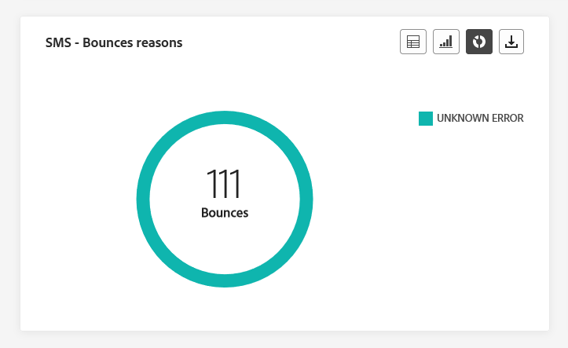

# Rapporto globale dei percorsi {#journey-global-report}

>[!CONTEXTUALHELP]
>id="ajo_journey_global_report"
>title="Rapporto globale dei percorsi"
>abstract="Il rapporto globale dei percorsi consente di misurare l’impatto di un percorso in un periodo di tempo selezionato. Il rapporto è suddiviso in diversi widget che descrivono il successo e gli errori di un percorso. Ogni dashboard di reporting può essere modificata ridimensionando o spostando i widget."

I report globali, accessibili dalla scheda Tutto il tempo, visualizzano gli eventi che si sono verificati almeno due ore fa e coprono gli eventi relativi a un periodo di tempo selezionato. Al confronto, i rapporti live si concentrano sugli eventi che si sono verificati nelle ultime 24 ore, con un intervallo di tempo minimo di due minuti dall’occorrenza dell’evento.

Il rapporto globale del percorso è accessibile direttamente dal percorso con **[!UICONTROL Visualizza rapporto]** pulsante.

Il percorso **[!UICONTROL Rapporto globale]** La pagina verrà visualizzata con le seguenti schede:

* [Percorso](#journey-global)
* [E-mail](#email-global)
* [Push](#push-global)
* [SMS](#sms-global)
* [In-app](#in-app-global)

Il percorso **[!UICONTROL Rapporto globale]** è diviso in diversi widget che descrivono nel dettaglio il successo e gli errori del percorso. Ogni widget può essere ridimensionato ed eliminato, se necessario. Per ulteriori informazioni, consulta questa [sezione](global-report.md#modify-dashboard).

Per un elenco dettagliato di tutte le metriche disponibili in Adobe Journey Optimizer, consulta [questa pagina](global-report.md#list-of-components-global).

## Scheda percorso {#journey-global}

Dal tuo percorso **[!UICONTROL Rapporto globale]**, il **[!UICONTROL Percorso]** fornisce una visualizzazione chiara dei dati di tracciamento più importanti sul percorso.

### Prestazioni percorso {#journey-perfomance}

Il **[!UICONTROL Prestazioni percorso]** Il widget consente di tracciare visivamente la traiettoria dei profili target durante la navigazione nel percorso.

### Statistiche percorso {#journey-statistics}

Il **[!UICONTROL Statistiche percorso]** Gli indicatori di prestazioni chiave (KPI, Key Performance Indicators) funzionano come un dashboard completo che fornisce un’analisi delle metriche essenziali associate al percorso. Questo include dettagli quali il conteggio del profilo inserito e delle istanze di singoli percorsi non riusciti, offrendo una visione completa dell’efficacia e del livello di coinvolgimento del percorso.

+++ Ulteriori informazioni sulle metriche delle statistiche di Percorso

* **[!UICONTROL Profili immessi]**: numero totale di individui che hanno raggiunto l’evento di ingresso del percorso.

* **[!UICONTROL Profili in uscita]**: numero totale di individui che sono usciti dal percorso.

* **[!UICONTROL Singolo percorso non riuscito]**: numero totale di singoli percorsi non eseguiti correttamente.

+++

### Prestazioni azione {#action-performance}

Il **[!UICONTROL Prestazioni azione]** widget rappresenta le azioni di maggior successo che si sono verificate quando **[!UICONTROL Azioni]** sono stati attivati.

### Azioni principali {#top-actions}

Il **[!UICONTROL Azioni principali]** compila i dati essenziali sul tuo **[!UICONTROL Azioni]**. Fornisce informazioni succinte sulla frequenza e sulle prestazioni di ogni azione.

+++ Ulteriori informazioni sulle metriche Azioni principali

* **[!UICONTROL Azioni eseguite correttamente]**: numero totale di **[!UICONTROL Azioni]** eseguito correttamente per un percorso.

* **[!UICONTROL Errore nell’azione]**: numero totale di errori che si sono verificati per **[!UICONTROL Azioni]**.

+++

### Motivi di errore azioni {#action-error}

Il **[!UICONTROL Motivi di errore azione]**  tabella e grafico offrono una panoramica completa degli errori che si sono verificati durante l’esecuzione **[!UICONTROL Azioni]**.

### Eventi per origine {#events-origin}

Il **[!UICONTROL Eventi per origine]** la tabella e i grafici forniscono una prospettiva dettagliata sulla ricezione **[!UICONTROL Eventi]**. Attraverso queste rappresentazioni visive, puoi distinguere con precisione quale **[!UICONTROL Eventi]** sono stati ricevuti in modo efficace, fornendo informazioni preziose sulle prestazioni e sull’impatto dei singoli eventi all’interno del tuo percorso.

### Eventi ricevuti per evento {#events-received}

Il **[!UICONTROL Eventi ricevuti per evento]** grafico consente di identificare e analizzare quali **[!UICONTROL Evento]** all’interno del tuo percorso è stato eseguito in modo efficace, fornendo informazioni preziose sulle prestazioni e sui tassi di successo dei singoli eventi.

### Eventi principali {#top-events}

Il **[!UICONTROL Eventi principali]** compila i dati essenziali sul tuo **[!UICONTROL Eventi]**. Fornisce informazioni succinte sulla frequenza e sulle prestazioni di ciascuno **[!UICONTROL Evento]**.

### Criteri di consenso {#consent-policies}

Il **[!UICONTROL Criteri di consenso]** la tabella e il grafico mostrano il numero di profili esclusi da ciascun criterio all’interno delle azioni personalizzate. Questo fornisce una chiara comprensione dell’impatto di ogni criterio di consenso sulle esclusioni di profilo.

Per ulteriori informazioni sulle azioni personalizzate, consulta [la documentazione dettagliata](../action/about-custom-action-configuration.md).

Tieni presente che affinché questi widget vengano visualizzati nei rapporti Percorsi, dovrai reimpostare le dashboard. A tale scopo, fai clic su **[!UICONTROL Modifica]** allora **[!UICONTROL Reimposta]** nella parte superiore del report.

## Scheda e-mail {#email-global}

Dal tuo percorso **[!UICONTROL Rapporto globale]**, il **[!UICONTROL E-mail]** Questa scheda contiene le informazioni principali relative alle e-mail inviate nel percorso.

### Statistiche di invio e-mail {#email-sending-statistics}

Il **[!UICONTROL Statistiche di invio e-mail]** La tabella fornisce un riepilogo completo dei dati essenziali relativi alle e-mail nei tuoi percorsi. Descrive le metriche chiave, come la dimensione del pubblico target e il numero di e-mail inviate con successo, fornendo informazioni utili sull’efficacia e la portata delle e-mail e dei percorsi.

+++ Ulteriori informazioni sulle metriche delle statistiche di invio di e-mail

* **[!UICONTROL Tempo di esecuzione]**: ora di inizio di ogni esecuzione del percorso in caso di percorsi ricorrenti. Per eseguire il targeting di una o più ricorrenze, selezionatela dal **[!UICONTROL Tempo di esecuzione]** a discesa.

* **[!UICONTROL Target]**: numero di profili target per qualsiasi azione, ad esempio invio di e-mail o SMS.

* **[!UICONTROL Inviato]**: numero totale di e-mail inviate per il percorso.

* **[!UICONTROL Consegnato]**: numero di e-mail inviate correttamente, in relazione al numero totale di e-mail inviate.

* **[!UICONTROL Percentuale di consegna]**: percentuale di e-mail inviate correttamente.

* **[!UICONTROL Mancati recapiti]**: totale degli errori accumulati durante il processo di invio e l’elaborazione automatica della restituzione in relazione al numero totale di e-mail inviate.

* **[!UICONTROL Percentuale non recapitate]**: percentuale di e-mail non recapitate rispetto alle e-mail inviate.

* **[!UICONTROL Errori]**: numero totale di errori che si sono verificati durante il processo di invio e che ne hanno impedito l’invio ai profili.

* **[!UICONTROL Frequenza errori]**: percentuale di errori che si sono verificati durante il processo di invio e che ne hanno impedito l’invio, rispetto alle e-mail inviate.

* **[!UICONTROL Nuovi tentativi]**: numero di e-mail nella coda per i nuovi tentativi.

* **[!UICONTROL Escluso]**: numero di profili che sono stati esclusi da Adobe Journey Optimizer.

+++

### E-mail - Statistiche di tracciamento {#email-tracking}

Il **[!UICONTROL E-mail - Statistiche di tracciamento]** la tabella offre un account dettagliato dell’attività del profilo relativa alle e-mail incluse nel percorso. Ciò include metriche su aperture, clic e altri indicatori di coinvolgimento rilevanti, che offrono una visualizzazione completa del modo in cui i profili interagiscono con il contenuto dell’e-mail.

+++ Ulteriori informazioni su E-mail - Metriche delle statistiche di tracciamento

* **[!UICONTROL Tempo di esecuzione]**: ora di inizio di ogni esecuzione dell’e-mail ricorrente nel percorso. Per eseguire il targeting di una o più e-mail ricorrenti, selezionala dall’opzione **[!UICONTROL Tempo di esecuzione]** a discesa.

* **[!UICONTROL Aperture]**: numero di volte in cui le e-mail sono state aperte in un percorso.

* **[!UICONTROL Aperture univoche]**: percentuale di e-mail aperte.

* **[!UICONTROL Percentuale aperture univoche]**: numero totale di e-mail aperte rispetto al numero di e-mail consegnate.

* **[!UICONTROL Clic]**: numero di volte in cui hai fatto clic su un contenuto nelle e-mail.

* **[!UICONTROL Clic univoci]**: numero di destinatari che hanno fatto clic su un contenuto nelle e-mail.

* **[!UICONTROL Percentuale di click-through]**: percentuale di utenti che hanno interagito con il percorso.

* **[!UICONTROL Annullamenti iscrizione]**: numero di clic sul collegamento di annullamento dell’abbonamento.

* **[!UICONTROL Reclami spam]**: numero di volte in cui le e-mail sono state dichiarate come spam o posta indesiderata.

+++

### E-mail - Prestazioni di invio {#email-performance}

Il **[!UICONTROL E-mail - Prestazioni di invio]** graph fornisce una visualizzazione completa dei dati relativi alle e-mail inviate nel tuo percorso, offrendo informazioni approfondite sulle metriche chiave, quali consegna e mancati recapiti. Ciò consente un’analisi dettagliata del processo di invio delle e-mail, fornendo informazioni preziose sull’efficienza e le prestazioni dei percorsi.

+++ Ulteriori informazioni sull’e-mail - Invio delle metriche delle prestazioni

* **[!UICONTROL Consegnato]**: numero di e-mail inviate correttamente, in relazione al numero totale di e-mail inviate.

* **[!UICONTROL Mancati recapiti]**: totale degli errori accumulati durante il processo di invio e l’elaborazione automatica della restituzione in relazione al numero totale di messaggi inviati.

* **[!UICONTROL Nuovi tentativi]**: numero di e-mail nella coda per i nuovi tentativi.

* **[!UICONTROL Errori]**: numero totale di errori che si sono verificati durante un processo di invio e che ne hanno impedito l’invio ai profili.

+++

### E-mail - Categorie e motivi di mancato recapito {#email-bounce-categories}

Il **[!UICONTROL Motivi di mancato recapito]** e **[!UICONTROL Categorie di mancato recapito]** I widget compilano i dati disponibili relativi ai messaggi non recapitati, fornendo informazioni dettagliate sui motivi e sulle categorie specifici alla base dei messaggi non recapitati.

Per ulteriori informazioni sui mancati recapiti, consulta [Elenco di soppressione](../reports/suppression-list.md) pagina.

+++ Ulteriori informazioni su E-mail - Metriche delle categorie di mancato recapito

* **[!UICONTROL Mancato recapito permanente]**: numero totale di errori permanenti, ad esempio un indirizzo e-mail errato. Ciò comporta un messaggio di errore che indica esplicitamente che l’indirizzo non è valido, ad esempio Utente sconosciuto.

* **[!UICONTROL Mancato recapito non permanente]**: numero totale di errori temporanei, ad esempio una casella in entrata completa.

* **[!UICONTROL Ignorato]**: numero totale di messaggi temporanei, ad esempio Fuori sede, o un errore tecnico, ad esempio se il tipo di mittente è postmaster.

+++

### E-mail - Motivi di errore {#email-errors}

Il **[!UICONTROL Motivi di errore]** grafici e tabelle offrono visibilità sugli errori specifici che si sono verificati durante il processo di invio, fornendo informazioni preziose sulla natura e sul verificarsi degli errori.

### E-mail - Motivi di esclusione {#email-excluded}

Il **[!UICONTROL Motivi di esclusione]** grafici e tabelle presentano una visione completa dei diversi fattori che hanno determinato l’esclusione dei profili utente dal pubblico di destinazione, causando la mancata ricezione del messaggio.

Fai riferimento a [questa pagina](exclusion-list.md) per l’elenco completo dei motivi di esclusione.

### Inviato e consegnato per dominio {#sent-domains}

Il  **[!UICONTROL Inviato e consegnato da domini]** la tabella e il grafico forniscono un raggruppamento dettagliato delle e-mail a livello di dominio, offrendo informazioni complete sulle prestazioni delle e-mail.

+++ Ulteriori informazioni sulle metriche Inviato e Consegnato per domini

* **[!UICONTROL Inviato]**: numero totale di invii per le e-mail.

* **[!UICONTROL Consegnato]**: numero di e-mail inviate correttamente, in relazione al numero totale di e-mail inviate.

+++

### Aperture e clic per dominio {#open-domains}

Il  **[!UICONTROL Apri e fai clic per domini]** un grafico con una tabella mostra un raggruppamento a livello di dominio del coinvolgimento dei profili con la tua e-mail, fornendo informazioni utili su come diversi domini interagiscono con i contenuti.

+++ Ulteriori informazioni sulle metriche Apri e clic per domini

* **[!UICONTROL Aperture]**: numero di volte in cui l’e-mail è stata aperta.

* **[!UICONTROL Clic]**: numero di volte in cui è stato fatto clic su un contenuto in un’e-mail.

+++

### Mancati recapiti ed errori per dominio {#bounces-domains}

Il  **[!UICONTROL Mancati recapiti ed errori per domini]** grafico e tabella offrono un raggruppamento a livello di dominio degli errori specifici riscontrati durante il processo di invio, fornendo un’analisi dettagliata dei problemi che si sono verificati.

+++ Ulteriori informazioni su mancati recapiti ed errori per domini e metriche

* **[!UICONTROL Mancati recapiti]**: totale degli errori accumulati durante il processo di invio e l’elaborazione automatica della restituzione in relazione al numero totale di e-mail inviate.

* **[!UICONTROL Errori]**: numero totale di errori che si sono verificati durante il processo di invio e che ne hanno impedito l’invio ai profili.

+++

### Motivi di mancato recapito per dominio {#bounce-reasons-domains}

Il  **[!UICONTROL Motivi di mancato recapito per dominio]** Il grafico e la tabella forniscono un raggruppamento dei dati a livello di dominio relativi a errori temporanei e permanenti, fornendo informazioni dettagliate sui motivi alla base dei messaggi non recapitati.

### E-mail - URL principale {#email-top}

Il **[!UICONTROL E-Mail - URL principale]** Il grafico e la tabella forniscono una panoramica completa degli URL all’interno dell’e-mail che attraggono il traffico di visitatori più elevato. Questo consente di identificare e assegnare la priorità ai collegamenti più popolari, migliorando la comprensione del coinvolgimento del profilo con contenuti specifici nelle e-mail.

### E-mail - Ottimizzazione {#email-sto}

>[!NOTE]
>
>Il **[!UICONTROL Ottimizzazione del tempo di invio]** e **[!UICONTROL Ottimizzato e non ottimizzato]** I widget sono disponibili solo se per la consegna è attivata l’opzione Ottimizzazione ora di invio. Per ulteriori informazioni sull’ottimizzazione dell’ora di invio, consulta [questa pagina](../building-journeys/journeys-message.md#send-time-optimization).

Il **[!UICONTROL Ottimizzazione del tempo di invio]** e **[!UICONTROL Ottimizzato e non ottimizzato]** i widget descrivono nel dettaglio il successo delle e-mail a seconda del metodo di invio: ottimizzato o normale.

+++ Ulteriori informazioni sull’ottimizzazione dell’ora di invio e sulle metriche ottimizzate e non ottimizzate

* **[!UICONTROL Consegnato]**: numero di messaggi inviati correttamente rispetto al numero totale di messaggi inviati.
* **[!UICONTROL Mancati recapiti]**: totale degli errori accumulati durante il processo di invio e l’elaborazione automatica della restituzione in relazione al numero totale di messaggi inviati.

* **[!UICONTROL Inviato]**: numero totale di e-mail inviate per il percorso.

* **[!UICONTROL Aperture]**: numero di volte in cui le e-mail sono state aperte nel percorso.

* **[!UICONTROL Clic]**: numero di volte in cui hai fatto clic su un contenuto nelle e-mail.

+++

### E-mail - Offerte {#email-offers}

>[!NOTE]
>
>I widget e le metriche delle offerte sono disponibili solo se è stata inserita una decisione in un messaggio e-mail. Per ulteriori informazioni sulla gestione delle decisioni, consulta questa [pagina](../offers/get-started/starting-offer-decisioning.md).

Il **[!UICONTROL Statistica sulle offerte]** e **[!UICONTROL Statistiche dettagliate sulle offerte]** nel tempo, i widget misurano il successo e l’impatto dell’offerta sul pubblico di destinazione. Descrive le informazioni principali relative al messaggio con i KPI.

+++ Ulteriori informazioni su E-mail - Metriche delle offerte

* **[!UICONTROL Offerta inviata]**: numero totale di invii per l’offerta.

* **[!UICONTROL Impression offerta]**: numero di volte in cui l’offerta è stata aperta nelle e-mail.

* **[!UICONTROL Clic sull’offerta]**: numero di volte in cui hai fatto clic su un’offerta nelle e-mail.

* **[!UICONTROL Nome posizionamento]**: nome del posizionamento utilizzato per visualizzare l’offerta. Per ulteriori informazioni sul posizionamento, consulta questa [pagina](../offers/offer-library/creating-placements.md).

* **[!UICONTROL Nome offerta]**: nome dell’offerta aggiunta nelle e-mail. Per ulteriori informazioni sul posizionamento, consulta questa [pagina](../offers/offer-library/creating-personalized-offers.md).

* **[!UICONTROL Offerta inviata]**: numero totale di invii per l’offerta.

* **[!UICONTROL Percentuale di impression offerta]**: percentuale di offerte aperte rispetto al numero di offerte inviate.

* **[!UICONTROL Percentuale di clic dell’offerta]**: percentuale di utenti che hanno interagito con l’offerta.

+++

## Scheda notifica push {#push-global}

Dal tuo percorso **[!UICONTROL Rapporto globale]**, il **[!UICONTROL Notifica push]** La scheda fornisce informazioni dettagliate sulle informazioni principali relative alle notifiche push inviate nel percorso.

### Notifica push - Statistiche di invio {#push-sending-stat}

Il **[!UICONTROL Notifica push - Statistiche di invio]** La tabella fornisce un riepilogo sintetico dei dati essenziali relativi alle notifiche push, incluse metriche chiave quali il numero di messaggi target e il numero di messaggi consegnati correttamente.

+++ Ulteriori informazioni sulla notifica push - Metriche delle statistiche di invio

* **[!UICONTROL Tempo di esecuzione]**: ora di inizio di ogni esecuzione del percorso in caso di percorsi ricorrenti. Per eseguire il targeting di una o più ricorrenze, selezionatela dal **[!UICONTROL Tempo di esecuzione]** a discesa.

* **[!UICONTROL Target]**: numero di profili target per qualsiasi azione, ad esempio invio di e-mail o SMS.

* **[!UICONTROL Inviato]**: numero totale di notifiche push inviate.

* **[!UICONTROL Consegnato]**: numero di notifiche push inviate correttamente, in relazione al numero totale di notifiche push inviate.

* **[!UICONTROL Percentuale di consegna]**: percentuale di notifiche push inviate correttamente.

* **[!UICONTROL Mancati recapiti]**: totale degli errori accumulati durante il processo di invio e l’elaborazione automatica della restituzione in relazione al numero totale di notifiche push inviate.

* **[!UICONTROL Percentuale non recapitate]**: percentuale di notifiche push non recapitate rispetto alle notifiche push inviate.

* **[!UICONTROL Errori]**: numero totale di errori che si sono verificati durante il processo di invio e che ne hanno impedito l’invio ai profili.

* **[!UICONTROL Frequenza errori]**: percentuale di errori che si sono verificati durante il processo di invio e ne hanno impedito l’invio, rispetto alle notifiche push inviate.

* **[!UICONTROL Escluso]**: numero di profili che sono stati esclusi da Adobe Journey Optimizer.

+++

### Notifica push - Statistiche di tracciamento {#push-tracking-stat}

Il **[!UICONTROL Push - Statistiche di tracciamento]** widget offre un’istantanea dettagliata dell’attività del profilo associata alle notifiche push, fornendo informazioni essenziali sull’efficacia delle notifiche push e di coinvolgimento.

+++ Ulteriori informazioni sulla notifica push - Metriche delle statistiche di tracciamento

* **[!UICONTROL Tempo di esecuzione]**: ora di inizio di ogni esecuzione del percorso in caso di percorsi ricorrenti. Per eseguire il targeting di una o più ricorrenze, selezionatela dal **[!UICONTROL Tempo di esecuzione]** a discesa.

* **[!UICONTROL Aperture]**: numero di volte in cui le notifiche push sono state aperte nel percorso.

* **[!UICONTROL Azioni]**: numero totale di azioni sulla notifica push consegnata, ad esempio clic su pulsante o rimozione.

+++

### Notifica push - Riepilogo di invio {#push-summary}

Il **[!UICONTROL Notifica push - Riepilogo di invio]** graph offre una rappresentazione dinamica che mostra un’analisi dell’attività delle notifiche push. Questa rappresentazione grafica fornisce un raggruppamento completo delle notifiche push inviate.

+++ Ulteriori informazioni sulla notifica push - Invio di metriche di riepilogo

* **[!UICONTROL Aperture]**: numero di volte in cui le notifiche push sono state aperte nel percorso.

* **[!UICONTROL Azioni]**: numero totale di azioni sulla notifica push consegnata, ad esempio clic su pulsante o rimozione.

* **[!UICONTROL Mancati recapiti]**: totale degli errori accumulati durante il processo di invio e l’elaborazione automatica della restituzione in relazione al numero totale di notifiche push inviate.

* **[!UICONTROL Consegnato]**: numero di notifiche push inviate correttamente, in relazione al numero totale di notifiche push inviate.

* **[!UICONTROL Errori]**: numero totale di errori che si sono verificati durante il processo di invio e che ne hanno impedito l’invio ai profili.

+++

### Notifica push - Motivi di errore {#push-error-reasons}

Il **[!UICONTROL Motivi di errore]** tabelle e grafici consentono di identificare gli errori specifici che si sono verificati durante il processo di invio delle notifiche push, fornendo informazioni dettagliate su eventuali problemi riscontrati durante il processo.

### Notifica push - Motivi di esclusione {#push-excluded}

Il **[!UICONTROL Motivi di esclusione]** i grafici e le tabelle mostrano i diversi motivi che hanno impedito ai profili utente, esclusi dai profili target, di ricevere le notifiche push.

Fai riferimento a [questa pagina](exclusion-list.md) per l’elenco completo dei motivi di esclusione.

### Notifica push - Raggruppamento per piattaforma {#push-breakdown}

Il **[!UICONTROL Raggruppamento per piattaforma]** grafico e tabella forniscono un’analisi dettagliata del successo delle notifiche push, con informazioni basate sul sistema operativo del profilo. Questo raggruppamento migliora la comprensione delle prestazioni delle notifiche push tra le diverse piattaforme.

### Notifica push - Ottimizzazione {#push-sto}

>[!NOTE]
>
>Il **[!UICONTROL Ottimizzato e non ottimizzato]** e **[!UICONTROL Ottimizzazione del tempo di invio]**  I widget sono disponibili solo se per la consegna è attivata l’opzione Ottimizzazione ora di invio. Per ulteriori informazioni sull’ottimizzazione dell’ora di invio, consulta [questa pagina](../building-journeys/journeys-message.md#send-time-optimization).

Il **[!UICONTROL Ottimizzato e non ottimizzato]** e **[!UICONTROL Ottimizzazione del tempo di invio]**  i widget descrivono nel dettaglio le informazioni principali relative al messaggio, ottimizzate o meno.

+++ Ulteriori informazioni sulla notifica push: metriche di ottimizzazione

* **[!UICONTROL Consegnato]**: numero di messaggi inviati correttamente rispetto al numero totale di messaggi inviati.

* **[!UICONTROL Aperture]**: numero di volte in cui le notifiche push sono state aperte nel percorso.

* **[!UICONTROL Azioni]**: numero totale di azioni sulla notifica push consegnata, ad esempio clic su pulsante o rimozione.

* **[!UICONTROL Consegnato]**: numero di messaggi inviati correttamente rispetto al numero totale di messaggi inviati.

* **[!UICONTROL Mancati recapiti]**: totale degli errori accumulati durante il processo di invio e l’elaborazione automatica della restituzione in relazione al numero totale di messaggi inviati.

+++

## Scheda SMS {#sms-global}

### SMS - Statistiche di invio {#sms-sending-stat}

Il **[!UICONTROL SMS - Statistiche di invio]** La tabella fornisce un riepilogo conciso dei dati essenziali relativi ai messaggi SMS, includendo metriche chiave quali il numero di messaggi target e il numero di messaggi consegnati correttamente.

+++ Ulteriori informazioni sugli SMS - Metriche delle statistiche di invio

* **[!UICONTROL Tempo di esecuzione]**: ora di inizio di ogni esecuzione del percorso in caso di percorsi ricorrenti. Per eseguire il targeting di una o più ricorrenze, selezionatela dal **[!UICONTROL Tempo di esecuzione]** a discesa.

* **[!UICONTROL Target]**: numero di profili utente qualificati come profili target per i messaggi SMS.

* **[!UICONTROL Escluso]**: numero di profili utente, esclusi dai profili target, che non hanno ricevuto i messaggi SMS.

* **[!UICONTROL Inviato]**: numero totale di messaggi SMS inviati per il percorso.

* **[!UICONTROL Mancati recapiti]**: totale degli errori accumulati durante il processo di invio e l’elaborazione automatica della restituzione in relazione al numero totale di messaggi SMS inviati.

* **[!UICONTROL Errori]**: numero totale di errori che si sono verificati durante il processo di invio e che ne hanno impedito l’invio ai profili.

+++

### SMS - Statistiche di tracciamento {#sms-tracking-stat}

Il **[!UICONTROL SMS - Statistiche di tracciamento]** Il widget fornisce una panoramica dettagliata delle informazioni chiave relative al coinvolgimento dei visitatori con gli URL, fornendo informazioni sull’efficacia dei messaggi SMS.

* **[!UICONTROL Tempo di esecuzione]**: ora di inizio di ogni esecuzione dell’SMS ricorrente. Per eseguire il targeting di uno o più SMS ricorrenti, selezionali dall’elenco **[!UICONTROL Tempo di esecuzione]** a discesa.

* **[!UICONTROL Clic]**: numero di volte in cui è stato fatto clic su un contenuto nei messaggi SMS.

### SMS - Prestazioni per data {#sms-performance-date}

Il **[!UICONTROL SMS - Prestazioni per data]** Il widget offre una panoramica dettagliata delle informazioni chiave relative ai messaggi, presentate tramite un grafico, che fornisce informazioni sulle tendenze delle prestazioni in periodi di tempo specifici.

+++ Ulteriori informazioni sugli SMS - Metriche delle prestazioni per data

* **[!UICONTROL Inviato]**: numero totale di messaggi SMS inviati per il percorso

* **[!UICONTROL Mancati recapiti]**: totale degli errori accumulati durante il processo di invio e l’elaborazione automatica della restituzione in relazione al numero totale di messaggi SMS inviati.

* **[!UICONTROL Errori]**: numero totale di errori che si sono verificati durante il processo di invio e che ne hanno impedito l’invio ai profili.

+++

### SMS - Motivi di mancato recapito {#sms-bounce}

Il **[!UICONTROL Motivi di mancato recapito]** I grafici e le tabelle forniscono una panoramica completa dei dati relativi ai messaggi SMS non recapitati, fornendo informazioni utili sulle ragioni specifiche alla base delle istanze di messaggi SMS non recapitati.

### SMS - Motivi di errore {#sms-error}

Il **[!UICONTROL Motivi di errore]** I grafici e le tabelle ti consentono di identificare gli errori specifici che si sono verificati durante il processo di invio dei messaggi SMS, semplificando un’analisi approfondita di eventuali problemi riscontrati.

### SMS - Motivi di esclusione {#sms-excluded}

Il **[!UICONTROL Motivi di esclusione]** I grafici e le tabelle illustrano visivamente i diversi fattori che hanno portato all’esclusione dei profili utente dal pubblico di destinazione, impedendo loro di ricevere i messaggi SMS.

Fai riferimento a [questa pagina](exclusion-list.md) per l’elenco completo dei motivi di esclusione.

### SMS - Clic per collegamenti {#sms-clicks}

Il **[!UICONTROL SMS - Clic per collegamenti]** widget offre informazioni essenziali sul coinvolgimento dei visitatori con gli URL inclusi nei messaggi, fornendo informazioni preziose su quali collegamenti attraggono maggiormente l’interazione.

## Scheda in-app {#in-app-global}

Dal tuo Percorso **[!UICONTROL Rapporto globale]**, il **[!UICONTROL In-app]** Questa scheda contiene le informazioni principali relative ai messaggi in-app inviati nei tuoi percorsi.

### Prestazioni in-app {#inapp-performance}

Il **[!UICONTROL Prestazioni in-app]**  I KPI forniscono informazioni essenziali sul coinvolgimento dei profili con i messaggi in-app, fornendo metriche essenziali per valutare l’efficacia e l’impatto dei messaggi in-app inclusi nel percorso.

+++ Ulteriori informazioni su In-app - Metriche delle prestazioni per data

* **[!UICONTROL Impression univoche]**: numero di utenti univoci a cui è stato visualizzato il messaggio in-app.

* **[!UICONTROL Impression]**: numero totale di messaggi in-app visualizzati a tutti gli utenti.

  >[!NOTE]
  >
  >Per garantire il conteggio di un’impression, l’utente deve soddisfare due criteri:
  >* Qualifica nell’esperienza in-app, ottenuta raggiungendo l’attività in-app specifica nel proprio percorso.
  >* Soddisfa le condizioni specificate nelle regole di attivazione.
  > 
  >A causa del secondo criterio, potrebbero esserci variazioni notevoli tra il numero di profili target e il conteggio di impression univoche.

* **[!UICONTROL Interazione]**: numero di accordi con il messaggio in-app. Ciò include tutte le azioni intraprese dagli utenti, come clic, revoche o qualsiasi altra interazione.
+++

### Riepilogo in-app {#inapp-summary}

Il **[!UICONTROL Riepilogo in-app]** Il grafico illustra la progressione delle impression e delle interazioni in-app nel periodo specificato, fornendo una panoramica completa delle prestazioni dei messaggi in-app.

### Interazioni per tipo {#interactions-type}

Il **[!UICONTROL Interazioni per tipo]** grafici e tabelle forniscono un resoconto dettagliato del modo in cui i profili interagivano con il messaggio in-app, le azioni di tracciamento come clic, licenziamenti o qualsiasi altra forma di coinvolgimento.
