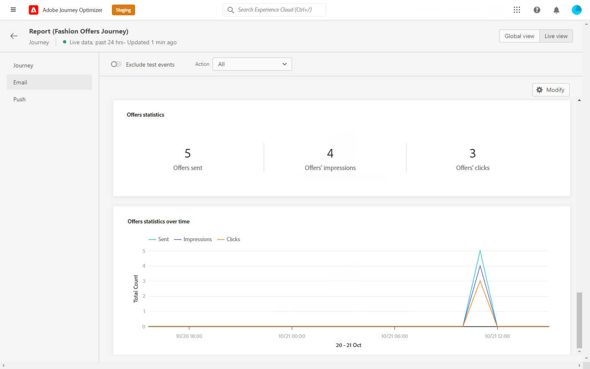

# Rapporto live dei percorsi {#journey-live-report}

È possibile accedere al rapporto percorso live direttamente dal percorso con **[!UICONTROL Live report]** pulsante .

Il percorso **[!UICONTROL Live report]** La pagina verrà visualizzata con le seguenti schede:

* [Percorso](#journey-live)
* [E-mail](#email-live)
* [Push](#push-live)

Il percorso **[!UICONTROL Live report]** è diviso in diversi widget che descrivono il successo e gli errori del tuo percorso. Se necessario, ogni widget può essere ridimensionato ed eliminato. Per ulteriori informazioni, consulta questo [sezione](live-report.md#modify-dashboard).

## scheda percorso {#journey-live}

Dal tuo percorso **[!UICONTROL Live report]**, **[!UICONTROL Journey]** tab ti offre una visualizzazione chiara dei dati di tracciamento più importanti sul tuo percorso.

**[!UICONTROL Journey Performance]** ti consente di visualizzare il percorso dei profili di destinazione passo dopo passo nel percorso.

La **[!UICONTROL Journey Statistics]** widget visualizza i KPI seguenti:

* **[!UICONTROL Entered profiles]**: Numero totale di persone che hanno raggiunto l&#39;evento di ingresso del percorso.

* **[!UICONTROL Exited profiles]**: Numero totale di persone uscite dal percorso.

* **[!UICONTROL Failed individual journeys]**: Numero totale di singoli percorsi che non sono stati eseguiti correttamente.

La **[!UICONTROL Event executed over the last 24 hours]** e **[!UICONTROL Events]** I widget consentono di vedere quale degli eventi è stato eseguito correttamente tramite numero di riepilogo, grafico e tabella.

La **[!UICONTROL Action executed over the last 24 hours]** e **[!UICONTROL Actions executed and errors]** I widget rappresentano l&#39;azione e gli errori più riusciti che si sono verificati quando le azioni sono state attivate. I numeri di grafico, tabella e riepilogo delle azioni contengono i dati disponibili per le azioni, ad esempio:

* **[!UICONTROL Actions executed]**: Numero totale di azioni eseguite correttamente per un percorso.

* **[!UICONTROL Error in actions]**: Numero totale di errori che si sono verificati per le azioni.

<!--

>[!NOTE]
>
>The Offers widgets and metrics are only available if a decision was inserted in an email. For more information on Decision Management, refer to this [page](../offers/get-started/starting-offer-decisioning.md).

The **[!UICONTROL Offers statistic]** and **[!UICONTROL Offers statistics]** over time widgets measure your offer's success and impact on your targeted audience. It detail the main information relative to your message with KPIs:

* **[!UICONTROL Offer sent]**: Total number of sends for the offer.

* **[!UICONTROL Offer impression]**: Number of times the offer was opened in a delivery.

* **[!UICONTROL Offer clicks]**: Number of times an offer was clicked on in a delivery.
-->

## Scheda E-mail {#email-live}

Dal tuo percorso **[!UICONTROL Live report]**, **[!UICONTROL Email]** scheda descrive le informazioni principali relative alle consegne e-mail inviate nel percorso.

Per un rapporto dettagliato su una consegna e-mail specifica, consulta la sezione [Report live e-mail](email-live-report.md) sezione .

La **[!UICONTROL Email Sending Statistics]** widget fornisce informazioni principali relative al messaggio:

* **[!UICONTROL Delivered]**: Numero di messaggi inviati correttamente in relazione al numero totale di messaggi inviati.

* **[!UICONTROL Bounces]**: Totale degli errori cumulati durante la consegna e l’elaborazione automatica della restituzione in relazione al numero totale di messaggi inviati.

* **[!UICONTROL Errors]**: Numero totale di errori che si sono verificati durante una consegna e che ne impediscono l’invio ai profili.

La **[!UICONTROL Sending metrics by Email]** tabella e **[!UICONTROL Email Summary]** il grafico descrive il successo della consegna:

* **[!UICONTROL Sent]**: Numero totale di invii per la consegna.

* **[!UICONTROL Delivered]**: Numero di messaggi inviati correttamente in relazione al numero totale di messaggi inviati.

* **[!UICONTROL Bounces]**: Totale degli errori cumulati durante la consegna e l’elaborazione automatica della restituzione in relazione al numero totale di messaggi inviati.

* **[!UICONTROL Errors]**: Numero totale di errori che si sono verificati durante una consegna e che ne impediscono l’invio ai profili.

* **[!UICONTROL Opens]**: Numero di volte in cui un messaggio è stato aperto in una consegna.

* **[!UICONTROL Clicks]**: Numero di volte in cui è stato fatto clic su un contenuto in una consegna.

* **[!UICONTROL Unsubscribe]**: Numero di clic sul collegamento di annullamento dell’abbonamento.

* **[!UICONTROL Spam complaints]**: Numero di volte in cui un messaggio è stato dichiarato come spam o spazzatura.

La **[!UICONTROL Bounce Reasons]**, **[!UICONTROL Bounce categories]** e **[!UICONTROL Hard and bounce - by Email]** I widget contengono i dati disponibili relativi ai messaggi non recapitati, ad esempio:

* **[!UICONTROL Hard bounce]**: Numero totale di errori permanenti, ad esempio un indirizzo e-mail errato. Ciò comporta un messaggio di errore che indica esplicitamente che l’indirizzo non è valido, ad esempio l’utente sconosciuto.

* **[!UICONTROL Soft bounce]**: Numero totale di errori temporanei, ad esempio una casella in entrata completa.

* **[!UICONTROL Ignored]**: Numero totale di temporanei, ad esempio Fuori sede, o un errore tecnico, ad esempio se il tipo di mittente è postmaster.

La **[!UICONTROL Error Reasons]** grafico e tabella consentono di vedere quale errore si è verificato durante la consegna.

## Scheda push {#push-live}

Dal tuo percorso **[!UICONTROL Live report]**, **[!UICONTROL Push]** la scheda descrive le informazioni principali relative alle consegne push inviate nel percorso.

Per un rapporto dettagliato su una consegna push specifica, consulta la sezione [Report live push](push-live-report.md) sezione .

**[!UICONTROL Push notification sending performance]**, **[!UICONTROL Push notification summary]** e **[!UICONTROL Sending metrics - by Push]** i widget descrivono nel dettaglio le informazioni principali relative al messaggio:

* **[!UICONTROL Sent]**: Numero totale di invii per la consegna.

* **[!UICONTROL Delivered]**: Numero di messaggi inviati correttamente in relazione al numero totale di messaggi inviati.

* **[!UICONTROL Bounces]**: Totale degli errori cumulati durante la consegna e l’elaborazione automatica della restituzione in relazione al numero totale di messaggi inviati.

* **[!UICONTROL Errors]**: Numero totale di errori che si sono verificati durante una consegna e che ne impediscono l’invio ai profili.

* **[!UICONTROL Opens]**: Numero di volte in cui un messaggio è stato aperto in una consegna.

* **[!UICONTROL Actions]**: Numero totale di azioni sulla notifica push consegnata, ad esempio clic su un pulsante o cancellazione.

* **[!UICONTROL Engagements]**: Numero totale di aperture e azioni per questa notifica push, ad esempio se il profilo ha aperto il push o se è stato fatto clic su un pulsante.

La **[!UICONTROL Error Reasons]** grafico e tabella consentono di vedere quale errore si è verificato durante la consegna.

La **[!UICONTROL Tracking by platform]**, **[!UICONTROL Sending by platform]** e **[!UICONTROL Breakdown by platform]** grafici e tabelle descrivono in dettaglio il successo della notifica push in base al sistema operativo.

La **[!UICONTROL Sending statistics - Failed]** widget consente di vedere quanti errori e rimbalzi si sono verificati.
