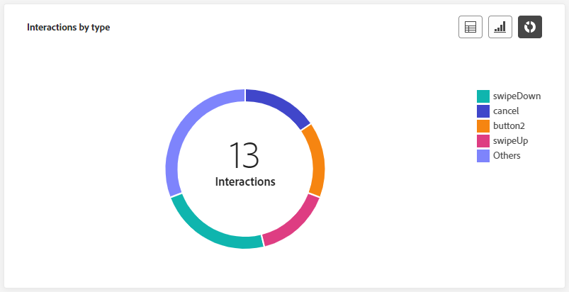

# Rapporto live dei percorsi {#journey-live-report}

>[!CONTEXTUALHELP]
>id="ajo_journey_live_report"
>title="Rapporto live dei percorsi"
>abstract="Il rapporto live dei percorsi consente di misurare e visualizzare in tempo reale l’impatto e le prestazioni dei percorsi solo nelle ultime 24 ore. Il rapporto è suddiviso in diversi widget che descrivono il successo e gli errori di un percorso. Ogni dashboard di reporting può essere modificata ridimensionando o spostando i widget."

I rapporti live, accessibili dalla scheda Ultime 24 ore, visualizzano gli eventi che si sono verificati nelle ultime 24 ore, con un intervallo di tempo minimo di due minuti dall’occorrenza dell’evento. Al confronto, i rapporti globali si concentrano sugli eventi che si sono verificati almeno due ore fa e coprono gli eventi in un periodo di tempo selezionato.

Il report live del percorso è accessibile direttamente dal percorso con **[!UICONTROL Visualizza rapporto]** pulsante.

Il percorso **[!UICONTROL Rapporto live]** La pagina verrà visualizzata con le seguenti schede:

* [Percorso](#journey-live)
* [E-mail](#email-live)
* [Push](#push-live)
* [SMS](#sms-live)
* [In-app](#in-app-live)

Il percorso **[!UICONTROL Rapporto live]** è diviso in diversi widget che descrivono nel dettaglio il successo e gli errori del percorso. Ogni widget può essere ridimensionato ed eliminato, se necessario. Per ulteriori informazioni, consulta questa [sezione](live-report.md#modify-dashboard).

Per un elenco dettagliato di tutte le metriche disponibili in Adobe Journey Optimizer, consulta [questa pagina](live-report.md#list-of-components-live).

## Scheda percorso {#journey-live}

Dal tuo percorso **[!UICONTROL Rapporto live]**, il **[!UICONTROL Percorso]** fornisce una visualizzazione chiara dei dati di tracciamento più importanti sul percorso.

### prestazioni del percorso {#journey-performance}

**[!UICONTROL Prestazioni percorso]** consente di visualizzare il percorso dei profili di destinazione passo dopo passo nel percorso.

### Statistiche del percorso {#journey-statistics}

Il **[!UICONTROL Statistiche percorso]** Gli indicatori di prestazioni chiave (KPI, Key Performance Indicators) funzionano come dashboard completo che fornisce un’analisi delle metriche essenziali associate al percorso nelle ultime 24 ore. Questo include dettagli quali il conteggio dei profili inseriti e delle istanze di singoli percorsi non riusciti, offrendo una visione completa dell’efficacia e del livello di coinvolgimento del tuo percorso.

+++ Ulteriori informazioni sulle metriche delle statistiche del Percorso

* **[!UICONTROL Profili immessi]**: numero totale di individui che hanno raggiunto l’evento di ingresso del percorso.

* **[!UICONTROL Profili in uscita]**: numero totale di individui che sono usciti dal percorso.

* **[!UICONTROL Singoli percorsi con errori]**: numero totale di singoli percorsi non eseguiti correttamente.
+++

### Azione eseguita nelle ultime 24 ore {#action-executed}

Il **[!UICONTROL Azione eseguita nelle ultime 24 ore]** Il widget rappresenta l&#39;azione di maggior successo che si è verificata quando sono state attivate le azioni.

+++ Ulteriori informazioni sull’azione eseguita nelle metriche delle ultime 24 ore

* **[!UICONTROL Azioni eseguite]**: numero totale di azioni eseguite correttamente per un percorso.

* **[!UICONTROL Errore nelle azioni]**: numero totale di errori che si sono verificati per le azioni.

+++

### Azioni eseguite ed errori {#actions-errors}

Il **[!UICONTROL Azioni eseguite ed errori]** Il widget rappresenta l&#39;azione e gli errori più riusciti che si sono verificati quando sono state attivate le azioni.

+++ Ulteriori informazioni sulle azioni eseguite e sulle metriche degli errori

* **[!UICONTROL Azioni eseguite]**: numero totale di azioni eseguite correttamente per un percorso.

* **[!UICONTROL Errore nelle azioni]**: numero totale di errori che si sono verificati per le azioni.

+++

### Motivi di errore azioni {#actions-error-reasons}

Il **[!UICONTROL Motivi di errore azione]** La tabella e il grafico offrono una panoramica completa degli errori che si sono verificati durante l’esecuzione delle azioni nelle ultime 24 ore.

### Tipo di errore per azione {#error-type-actions}

Il **[!UICONTROL Tipo di errore per azione]** La tabella e il grafico offrono una panoramica completa degli errori che si sono verificati per ogni esecuzione delle azioni nelle ultime 24 ore.

### Evento eseguito nelle ultime 24 ore {#event-executed-24hours}

Il **[!UICONTROL Evento eseguito nelle ultime 24 ore]** widget consente di identificare quali eventi sono stati eseguiti correttamente nelle ultime 24 ore.

### Eventi {#events}

Il **[!UICONTROL Eventi]** il widget consente di vedere quale evento è stato eseguito correttamente tramite il numero di riepilogo, il grafico e la tabella.

### Eventi per origine {#events-origin}

Il **[!UICONTROL Eventi per origine]** la tabella e i grafici forniscono una prospettiva dettagliata sulla ricezione riuscita degli eventi nelle ultime 24 ore. Attraverso queste rappresentazioni visive, puoi distinguere con precisione quale dei tuoi eventi è stato effettivamente ricevuto, offrendo informazioni preziose sulle prestazioni e sull’impatto di singoli eventi all’interno del tuo percorso.

## Scheda e-mail {#email-live}

Dal tuo percorso **[!UICONTROL Rapporto live]**, il **[!UICONTROL E-mail]** Questa scheda contiene le informazioni principali relative alle e-mail inviate nel percorso.

### Prestazioni invio e-mail {#email-sending-performance}

Il **[!UICONTROL E-mail - Prestazioni di invio]** graph fornisce una visualizzazione completa dei dati relativi alle e-mail inviate nel tuo percorso, offrendo informazioni approfondite su metriche chiave quali recapitato e mancati recapiti che si sono verificati nelle ultime 24 ore. Ciò consente un’analisi dettagliata del processo di invio delle e-mail, fornendo informazioni preziose sull’efficienza e le prestazioni dei percorsi.

+++ Ulteriori informazioni sull’e-mail - Invio delle metriche delle prestazioni

* **[!UICONTROL Consegnato]**: numero di e-mail inviate correttamente.

* **[!UICONTROL Mancati recapiti]**: totale degli errori accumulati durante il processo di invio e l’elaborazione automatica della restituzione.

* **[!UICONTROL Errori]**: numero totale di errori che si sono verificati durante il processo di invio e che ne hanno impedito l’invio ai profili.

* **[!UICONTROL Nuovi tentativi]**: numero di e-mail nella coda per i nuovi tentativi.

+++

### E-mail - Statistiche {#email-stat}

Il **[!UICONTROL E-mail - Statistiche]** La tabella fornisce un riepilogo completo dei dati essenziali relativi alle e-mail nei tuoi percorsi nelle ultime 24 ore. Descrive le metriche chiave, come la dimensione del pubblico target e il numero di e-mail inviate con successo, fornendo informazioni utili sull’efficacia e la portata delle e-mail e dei percorsi.

+++ Ulteriori informazioni sulle metriche delle statistiche di invio di e-mail

* **[!UICONTROL Target]**: numero totale di messaggi elaborati durante il processo di invio.

* **[!UICONTROL Escluso]**: numero di profili che sono stati esclusi da Adobe Journey Optimizer.

* **[!UICONTROL Inviato]**: numero totale di e-mail inviate.

* **[!UICONTROL Consegnato]**: numero di e-mail inviate correttamente, in relazione al numero totale di messaggi inviati.

* **[!UICONTROL Mancati recapiti]**: totale degli errori accumulati durante il processo di invio e l’elaborazione automatica della restituzione in relazione al numero totale di messaggi inviati.

* **[!UICONTROL Errori]**: numero totale di errori che si sono verificati durante il processo di invio e che ne hanno impedito l’invio ai profili.

* **[!UICONTROL Aperture]**: numero di volte in cui le e-mail sono state aperte.

* **[!UICONTROL Clic]**: numero di volte in cui hai fatto clic su un contenuto nelle e-mail.

* **[!UICONTROL Annulla iscrizione]**: numero di clic sul collegamento di annullamento dell’abbonamento.

* **[!UICONTROL Reclami spam]**: numero di volte in cui un messaggio è stato dichiarato come spam o posta indesiderata.

* **[!UICONTROL Nuovi tentativi]**: numero di e-mail nella coda per i nuovi tentativi.

+++

### E-mail - Prestazioni per data {#email-perf-date}

Il **[!UICONTROL E-mail - Prestazioni per data]** widget offre una panoramica dettagliata delle informazioni chiave relative alle e-mail, presentate tramite un grafico, che fornisce informazioni sulle tendenze delle prestazioni nelle ultime 24 ore.

+++ Ulteriori informazioni su E-mail - Metriche delle prestazioni per data

* **[!UICONTROL Inviato]**: numero totale di e-mail inviate.

* **[!UICONTROL Consegnato]**: numero di e-mail inviate correttamente.

* **[!UICONTROL Mancati recapiti]**: totale degli errori accumulati durante il processo di invio e l’elaborazione automatica della restituzione.

* **[!UICONTROL Errori]**: numero totale di errori che si sono verificati durante il processo di invio e che ne hanno impedito l’invio ai profili.

* **[!UICONTROL Aperture]**: numero di volte in cui le e-mail sono state aperte.

* **[!UICONTROL Clic]**: numero di volte in cui hai fatto clic su un contenuto nelle e-mail.

* **[!UICONTROL Annulla iscrizione]**: numero di clic sul collegamento di annullamento dell’abbonamento.

* **[!UICONTROL Reclami spam]**: numero di volte in cui un messaggio è stato dichiarato come spam o posta indesiderata.

+++

### E-mail - Categorie e motivi di mancato recapito {#email-bounce-categories}

Il **[!UICONTROL Motivi di mancato recapito]** e **[!UICONTROL Categorie di mancato recapito]** i widget compilano i dati disponibili relativi ai messaggi non recapitati, fornendo informazioni dettagliate sui motivi e le categorie specifici alla base dei messaggi non recapitati nelle ultime 24 ore.

Per ulteriori informazioni sui mancati recapiti, consulta [Elenco di soppressione](../reports/suppression-list.md) pagina.

+++ Ulteriori informazioni su E-mail - Categorie di mancato recapito e metriche dei motivi

* **[!UICONTROL Mancato recapito permanente]**: numero totale di errori permanenti, ad esempio un indirizzo e-mail errato. Ciò comporta un messaggio di errore che indica esplicitamente che l’indirizzo non è valido, ad esempio Utente sconosciuto.

* **[!UICONTROL Mancato recapito non permanente]**: numero totale di errori temporanei, ad esempio una casella in entrata completa.

* **[!UICONTROL Ignorato]**: numero totale di messaggi temporanei, ad esempio Fuori sede, o un errore tecnico, ad esempio se il tipo di mittente è postmaster.

+++

### E-mail - Motivi di errore {#email-error-reasons}

Il **[!UICONTROL Motivi di errore]** grafici e tabelle offrono visibilità sugli errori specifici che si sono verificati durante il processo di invio delle ultime 24 ore, fornendo informazioni preziose sulla natura e sul verificarsi degli errori.

### E-mail - Motivi di esclusione {#email-excluded}

Il **[!UICONTROL Motivi di esclusione]** grafici e tabelle presentano una visione completa dei diversi fattori che hanno determinato l’esclusione dei profili utente dal pubblico di destinazione, causando la mancata ricezione del messaggio nelle ultime 24 ore.

Fai riferimento a [questa pagina](exclusion-list.md) per l’elenco completo dei motivi di esclusione.

### E-mail - Dominio destinatario migliore {#email-best-recipient}

Il **[!UICONTROL E-mail - Dominio destinatario migliore]** grafico e tabella offrono una suddivisione dettagliata dei domini utilizzati più di frequente dai profili per aprire le e-mail nelle ultime 24 ore. Questo fornisce informazioni utili sul comportamento del profilo, consentendoti di comprendere le piattaforme preferite.

### E-mail - Offerte {#email-offers}

>[!NOTE]
>
>I widget e le metriche delle offerte sono disponibili solo se è stata inserita una decisione in un messaggio e-mail. Per ulteriori informazioni sulla gestione delle decisioni, consulta questa [pagina](../offers/get-started/starting-offer-decisioning.md).

Il **[!UICONTROL Statistica sulle offerte]** e **[!UICONTROL Statistiche sulle offerte nel tempo]** i widget misurano il successo e l’impatto dell’offerta sul pubblico di destinazione. Descrive le informazioni principali relative al messaggio con i KPI.

+++ Ulteriori informazioni su E-mail - Metriche delle offerte

* **[!UICONTROL Offerta inviata]**: numero totale di invii per l’offerta.

* **[!UICONTROL Impression offerta]**: numero di volte in cui l’offerta è stata aperta nelle e-mail.

* **[!UICONTROL Clic sull’offerta]**: numero di volte in cui hai fatto clic su un’offerta nelle e-mail.

+++

## Scheda notifica push {#push-live}

Dal tuo percorso **[!UICONTROL Rapporto live]**, il **[!UICONTROL Notifica push]** La scheda fornisce informazioni dettagliate sulle informazioni principali relative alla notifica push inviata nel percorso.

### Notifica push - Statistiche {#push-statistics}

**[!UICONTROL Notifica push - Statistiche]** La tabella fornisce un riepilogo sintetico dei dati essenziali relativi alle notifiche push, incluse metriche chiave quali il numero di messaggi target e il numero di messaggi consegnati correttamente nelle ultime 24 ore.

+++ Ulteriori informazioni sulla notifica push: metriche delle statistiche

* **[!UICONTROL Target]**: numero di profili target per qualsiasi azione, ad esempio invio di e-mail o SMS.

* **[!UICONTROL Escluso]**: numero di profili che sono stati esclusi da Adobe Journey Optimizer.

* **[!UICONTROL Inviato]**: numero totale di notifiche push inviate.

* **[!UICONTROL Consegnato]**: numero di notifiche push inviate correttamente.

* **[!UICONTROL Mancati recapiti]**: totale degli errori accumulati durante il processo di invio e l’elaborazione automatica della restituzione.

* **[!UICONTROL Errori]**: numero totale di errori che si sono verificati durante il processo di invio e che ne hanno impedito l’invio ai profili.

* **[!UICONTROL Aperture]**: numero di volte in cui la notifica push è stata aperta.
+++

### Notifica push - Raggruppamento per piattaforma {#push-breakdown}

Il **[!UICONTROL Notifica push - Raggruppamento per piattaforma]** grafico e tabella forniscono un’analisi dettagliata del successo delle notifiche push, con informazioni basate sul sistema operativo del profilo. Questo raggruppamento migliora la comprensione delle prestazioni delle notifiche push tra le diverse piattaforme.

### Notifica push - Riepilogo di invio {#push-sending-summary}

Il **[!UICONTROL Riepilogo notifiche push]** graph offre una rappresentazione dinamica che mostra un’analisi dell’attività delle notifiche push nelle ultime 24 ore. Questa rappresentazione grafica fornisce un raggruppamento completo delle notifiche push inviate.

+++ Ulteriori informazioni sulla notifica push - Invio di metriche di riepilogo

* **[!UICONTROL Inviato]**: numero totale di notifiche push inviate.

* **[!UICONTROL Consegnato]**: numero di notifiche push inviate correttamente.

* **[!UICONTROL Mancati recapiti]**: totale degli errori accumulati durante il processo di invio e l’elaborazione automatica della restituzione.

* **[!UICONTROL Errori]**: numero totale di errori che si sono verificati durante il processo di invio e che ne hanno impedito l’invio ai profili.

* **[!UICONTROL Aperture]**: numero di volte in cui le notifiche push sono state aperte.

* **[!UICONTROL Clic]**: numero di volte in cui è stato fatto clic su un contenuto nelle notifiche push.

+++

### Notifica push - Motivi di errore {#push-error}

Il **[!UICONTROL Motivi di errore]** la tabella e i grafici consentono di identificare gli errori specifici che si sono verificati durante il processo di invio delle notifiche push, fornendo informazioni dettagliate su eventuali problemi riscontrati nelle ultime 24 ore.

### Notifica push - Motivi di esclusione {#push-excluded}

Il **[!UICONTROL Motivi di esclusione]** i grafici e le tabelle mostrano i diversi motivi che hanno impedito ai profili utente, esclusi dai profili target, di ricevere le notifiche push nelle ultime 24 ore.

Fai riferimento a [questa pagina](exclusion-list.md) per l’elenco completo dei motivi di esclusione.

## Scheda SMS {#sms-live}

### SMS - Statistiche {#sms-statistics}

Il **[!UICONTROL SMS - Statistiche]** La tabella fornisce un riepilogo sintetico dei dati essenziali relativi ai messaggi SMS, includendo metriche chiave quali il numero di messaggi target e il numero di messaggi consegnati correttamente nelle ultime 24 ore.

+++ Ulteriori informazioni sugli SMS - Metriche delle statistiche

* **[!UICONTROL Target]**: numero di profili utente qualificati come profili target.

* **[!UICONTROL Escluso]**: numero di profili utente, esclusi dai profili target, che non hanno ricevuto il messaggio.

* **[!UICONTROL Inviato]**: numero totale di messaggi SMS inviati.

* **[!UICONTROL Aperture]**: numero di volte in cui i messaggi SMS sono stati aperti.

* **[!UICONTROL Clic]**: numero di volte in cui si è fatto clic su un contenuto nei messaggi SMS.

* **[!UICONTROL Mancati recapiti]**: totale degli errori accumulati durante il processo di invio del processo di invio e l’elaborazione automatica della restituzione.

* **[!UICONTROL Errori]**: numero totale di errori che si sono verificati durante il processo di invio e che ne hanno impedito l’invio ai profili.

+++

### SMS - Prestazioni per data {#sms-performance}

Il **[!UICONTROL SMS - Prestazioni per data]** widget offre una panoramica dettagliata delle informazioni chiave relative ai messaggi, presentate tramite un grafico, che fornisce informazioni sulle tendenze delle prestazioni nelle ultime 24 ore.

+++ Ulteriori informazioni sugli SMS - Metriche delle prestazioni per data

* **[!UICONTROL Inviato]**: numero totale di messaggi SMS inviati.

* **[!UICONTROL Mancati recapiti]**: totale degli errori accumulati durante il processo di invio e l’elaborazione automatica della restituzione.

* **[!UICONTROL Errori]**: numero totale di errori che si sono verificati durante il processo di invio e che ne hanno impedito l’invio ai profili.

+++

### SMS - Motivi di mancato recapito {#sms-bounces}

Il **[!UICONTROL SMS - Motivi di mancato recapito]** I grafici e le tabelle forniscono una panoramica completa dei dati relativi ai messaggi SMS non recapitati, fornendo informazioni utili sulle ragioni specifiche alla base delle istanze di messaggi SMS non recapitati nelle ultime 24 ore.

### SMS - Motivi di errore {#sms-error}

Il **[!UICONTROL SMS - Motivi di errore]** I grafici e le tabelle ti consentono di identificare gli errori specifici che si sono verificati durante il processo di invio dei messaggi SMS, semplificando un’analisi approfondita di eventuali problemi riscontrati nelle ultime 24 ore.

### SMS - Motivi di esclusione {#sms-excluded}

Il **[!UICONTROL SMS - Motivi di esclusione]** I grafici e le tabelle illustrano visivamente i diversi fattori che hanno portato all’esclusione dei profili utente dal pubblico di destinazione, impedendo loro di ricevere i messaggi SMS.

Fai riferimento a [questa pagina](exclusion-list.md) per l’elenco completo dei motivi di esclusione.

### SMS - Clic per collegamenti {#sms-clicks}

Il **[!UICONTROL SMS - Clic per collegamenti]** widget offre informazioni essenziali sul coinvolgimento dei visitatori con gli URL inclusi nei messaggi, fornendo informazioni preziose su quali collegamenti attraggono il maggior numero di interazioni nelle ultime 24 ore.

## Scheda in-app {#in-app-live}

### Prestazioni in-app {#inapp-performance}

Il **[!UICONTROL Prestazioni in-app]** I KPI forniscono informazioni essenziali sul coinvolgimento dei profili con i messaggi in-app nelle ultime 24 ore, fornendo metriche essenziali per valutare l’efficacia e l’impatto dei messaggi in-app inclusi nel percorso.

+++ Ulteriori informazioni su In-app - Metriche delle prestazioni

* **[!UICONTROL Impression]**: numero totale di messaggi in-app consegnati a tutti gli utenti.

  >[!NOTE]
  >
  >Per garantire il conteggio di un’impression, l’utente deve soddisfare due criteri:
  >* Qualifica nell’esperienza in-app, ottenuta raggiungendo l’attività in-app specifica nel proprio percorso.
  >* Soddisfa le condizioni specificate nelle regole di attivazione.
  > 
  >A causa del secondo criterio, potrebbero esserci variazioni notevoli tra il numero di profili target e il conteggio di impression univoche.

* **[!UICONTROL Interazioni]**: numero totale di engagement con il messaggio in-app. Ciò include tutte le azioni intraprese dagli utenti, come clic, revoche o qualsiasi altra interazione.

+++

### Riepilogo in-app {#inapp-summary}

Il **[!UICONTROL Riepilogo in-app]** Il grafico illustra la progressione delle impression e delle interazioni in-app nelle ultime 24 ore, fornendo una panoramica completa delle prestazioni dei messaggi in-app.

+++ Ulteriori informazioni sulle metriche di riepilogo in-app

* **[!UICONTROL Impression]**: numero totale di messaggi in-app consegnati a tutti gli utenti.

  >[!NOTE]
  >
  >Per garantire il conteggio di un’impression, l’utente deve soddisfare due criteri:
  >* Qualifica nell’esperienza in-app, ottenuta raggiungendo l’attività in-app specifica nel proprio percorso.
  >* Soddisfa le condizioni specificate nelle regole di attivazione.
  > 
  >A causa del secondo criterio, potrebbero esserci variazioni notevoli tra il numero di profili target e il conteggio di impression univoche.

* **[!UICONTROL Interazioni]**: numero totale di engagement con il messaggio in-app. Ciò include tutte le azioni intraprese dagli utenti, come clic, revoche o qualsiasi altra interazione.

+++

### Interazioni per tipo {#interactions-type}

Il **[!UICONTROL Interazioni per tipo]** grafici e tabelle dettagliano il modo in cui gli utenti interagivano con il messaggio in-app tracciando i clic, le eliminazioni o le interazioni.
