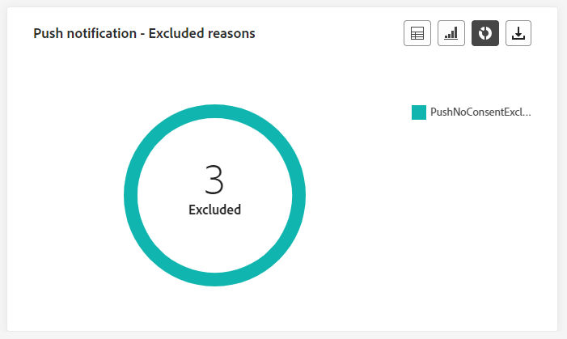
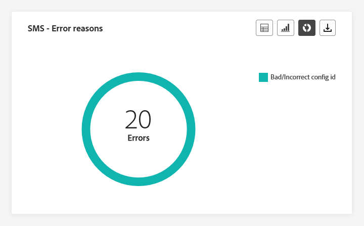

# Rapporto live dei percorsi {#journey-live-report}

>[!CONTEXTUALHELP]
>id="ajo_journey_live_report"
>title="Rapporto live dei percorsi"
>abstract="Il rapporto live dei percorsi consente di misurare e visualizzare in tempo reale l’impatto e le prestazioni dei percorsi solo nelle ultime 24 ore. Il rapporto è suddiviso in diversi widget che descrivono il successo e gli errori di un percorso. Ogni dashboard di reporting può essere modificata ridimensionando o rimuovendo i widget."

I rapporti live, accessibili dalla scheda Ultime 24 ore, visualizzano gli eventi che si sono verificati nelle ultime 24 ore, con un intervallo di tempo minimo di due minuti dall’occorrenza dell’evento. Al confronto, i rapporti di Customer Journey Analytics si concentrano sugli eventi che si sono verificati almeno due ore fa e coprono gli eventi in un periodo di tempo selezionato.

Accedi al report live Percorsi dal menu [!UICONTROL Percorsi] aprendo il menu [!UICONTROL Altre azioni] del tuo percorso e selezionando [!UICONTROL Visualizza report delle ultime 24 ore].

La pagina del percorso **[!UICONTROL Report live]** verrà visualizzata con le seguenti schede:

* [Percorso](#journey-live)
* [E-mail](#email-live)
* [Push](#push-live)
* [SMS](#sms-live)
* [In-app](#in-app-live)

Il percorso **[!UICONTROL Live Report]** è diviso in diversi widget che descrivono il successo e gli errori del percorso. Ogni widget può essere ridimensionato ed eliminato, se necessario. Per ulteriori informazioni, consulta questa [sezione](live-report.md#modify-dashboard).

Per un elenco dettagliato di tutte le metriche disponibili in Adobe Journey Optimizer, consulta [questa pagina](live-report.md#live-report).

## Scheda percorso {#journey-live}

Dal tuo **[!UICONTROL report live]** di percorso, la scheda **[!UICONTROL Percorso]** ti fornisce una visualizzazione chiara dei dati di tracciamento più importanti sul tuo percorso.

### Prestazioni del percorso {#journey-performance}

>[!CONTEXTUALHELP]
>id="ajo_journey_performance_live"
>title="Prestazioni del percorso"
>abstract="Il widget Prestazioni percorso consente di tenere traccia visivamente del percorso dei profili di destinazione durante l’avanzamento nel percorso nelle ultime 24 ore."

**[!UICONTROL Prestazioni Percorso]** ti consente di visualizzare il percorso dei profili target passo dopo passo nel percorso.

Il conteggio dei profili per un nodo viene aggiornato solo dopo che il profilo ha completato il nodo, non al momento dell’immissione. Ad esempio, un profilo su un nodo **Wait** viene conteggiato solo una volta raggiunta la data specificata e usciti dal nodo.

### Statistiche del percorso {#journey-statistics}

>[!CONTEXTUALHELP]
>id="ajo_journey_statistics_live"
>title="Statistiche del percorso"
>abstract="Gli indicatori delle prestazioni chiave (KPI, Key Performance Indicators) delle statistiche del Percorso fungono da dashboard completo e forniscono un’analisi approfondita delle metriche essenziali relative al percorso nelle ultime 24 ore."

Le **[!UICONTROL Statistiche Percorso]** Indicatori prestazioni chiave (KPI, Key Performance Indicators) funzionano come dashboard completo che fornisce un&#39;analisi delle metriche essenziali associate al percorso nelle ultime 24 ore. Questo include dettagli quali il conteggio dei profili inseriti e delle istanze di singoli percorsi non riusciti, offrendo un’insight completa per l’efficacia e il livello di coinvolgimento del tuo percorso.

+++ Ulteriori informazioni sulle metriche delle statistiche del Percorso

* **[!UICONTROL Profili immessi]**: numero totale di singoli utenti che hanno raggiunto l&#39;evento di ingresso del percorso.

* **[!UICONTROL Profili usciti]**: numero totale di persone che sono uscite dal percorso.

* **[!UICONTROL Singoli percorsi non riusciti]**: numero totale di singoli percorsi non eseguiti correttamente.
+++

### Azione eseguita nelle ultime 24 ore {#action-executed}

>[!CONTEXTUALHELP]
>id="ajo_journey_actions_executed_live"
>title="Azione eseguita nelle ultime 24 ore"
>abstract="Il widget Azione eseguita nelle ultime 24 ore fornisce un’istantanea delle prestazioni recenti, mostrando l’efficacia delle azioni eseguite nelle ultime 24 ore."

L&#39;azione **[!UICONTROL eseguita nelle ultime 24 ore]** rappresenta l&#39;azione di maggior successo che si è verificata quando sono state attivate le azioni.

+++ Ulteriori informazioni sull’azione eseguita nelle metriche delle ultime 24 ore

* **[!UICONTROL Azioni eseguite]**: numero totale di azioni eseguite correttamente per un percorso.

* **[!UICONTROL Errore nelle azioni]**: numero totale di errori che si sono verificati per le azioni.

+++

### Azioni eseguite ed errori {#actions-errors}

>[!CONTEXTUALHELP]
>id="ajo_journey_actions_executed__errors_live"
>title="Azioni eseguite ed errori"
>abstract="Il widget Azioni eseguite ed errori mostra le azioni più riuscite ed eventuali errori che si sono verificati durante l’attivazione delle azioni nelle ultime 24 ore. Questo widget offre una panoramica completa sia delle esecuzioni riuscite che degli errori riscontrati, fornendo informazioni preziose sulle recenti prestazioni delle azioni."

Il widget **[!UICONTROL Azioni eseguite ed errori]** rappresenta l&#39;azione e gli errori più riusciti che si sono verificati quando le azioni sono state attivate nelle ultime 24 ore.

+++ Ulteriori informazioni sulle azioni eseguite e sulle metriche degli errori

* **[!UICONTROL Azioni eseguite]**: numero totale di azioni eseguite correttamente per un percorso.

* **[!UICONTROL Errore nelle azioni]**: numero totale di errori che si sono verificati per le azioni.

+++

### Motivi di errore delle azioni {#actions-error-reasons}

>[!CONTEXTUALHELP]
>id="ajo_journey_actions_errors_live"
>title="Motivi di errore delle azioni"
>abstract="La tabella e il grafico Motivi degli errori delle azioni forniscono un riepilogo completo degli errori riscontrati durante l’esecuzione delle azioni, offrendo una panoramica completa dei problemi che possono essersi verificati nelle ultime 24 ore."

La tabella e il grafico **[!UICONTROL Motivi di errore azione]** offrono una panoramica completa degli errori che si sono verificati durante l&#39;esecuzione delle azioni nelle ultime 24 ore.

### Tipo di errore per azione {#error-type-actions}

>[!CONTEXTUALHELP]
>id="ajo_journey_actions_error_type_live"
>title="Tipo di errore per azione"
>abstract="La tabella e il grafico Tipo di errore per azione forniscono una panoramica completa degli errori che si sono verificati durante ogni esecuzione delle azioni nelle ultime 24 ore."

La tabella e il grafico **[!UICONTROL Tipo di errore per azioni]** offrono una panoramica completa degli errori che si sono verificati per ogni esecuzione delle azioni nelle ultime 24 ore.

### Evento eseguito nelle ultime 24 ore {#event-executed-24hours}

>[!CONTEXTUALHELP]
>id="ajo_journey_event_24hours_live"
>title="Evento eseguito nelle ultime 24 ore"
>abstract="Il widget Evento eseguito nelle ultime 24 ore consente di identificare quali eventi sono stati eseguiti correttamente nelle ultime 24 ore. "

Il widget **[!UICONTROL Evento eseguito nelle ultime 24 ore]** consente di identificare quali eventi sono stati eseguiti correttamente nelle ultime 24 ore.

### Eventi {#events}

>[!CONTEXTUALHELP]
>id="ajo_journey_events_live"
>title="Eventi"
>abstract="Il widget Eventi fornisce una vista completa di quali eventi sono stati eseguiti correttamente, offrendo un numero di riepilogo, un grafico e una tabella con informazioni dettagliate sulle ultime 24 ore."

Il widget **[!UICONTROL Eventi]** ti consente di vedere quale evento è stato eseguito correttamente tramite il numero di riepilogo, il grafico e la tabella.

### Eventi per origine {#events-origin}

>[!CONTEXTUALHELP]
>id="ajo_journey_events_origin_live"
>title="Eventi per origine"
>abstract="La tabella e i grafici Eventi per origine offrono una panoramica della ricezione corretta degli eventi nelle ultime 24 ore. Queste rappresentazioni visive consentono di identificare con precisione gli eventi effettivamente ricevuti, fornendo informazioni valide e approfondite sulla prestazione e sull’impatto di ogni evento all’interno del percorso."

La tabella e i grafici **[!UICONTROL Eventi per origine]** forniscono una prospettiva dettagliata sulla ricezione degli eventi nelle ultime 24 ore. Attraverso queste rappresentazioni visive, puoi distinguere con precisione quale dei tuoi eventi è stato effettivamente ricevuto, offrendo informazioni preziose sulle prestazioni e sull’impatto di singoli eventi all’interno del tuo percorso.

## Scheda e-mail {#email-live}

Dal tuo percorso **[!UICONTROL Live Report]**, la scheda **[!UICONTROL E-mail]** fornisce i dettagli delle informazioni principali relative alle e-mail inviate nel tuo percorso.

### E-mail: prestazioni di invio {#email-sending-performance}

>[!CONTEXTUALHELP]
>id="ajo_journey_email_sending_performance_live"
>title="E-mail: prestazioni di invio"
>abstract="Il grafico E-mail - Statistiche di invio riepiloga i dati essenziali relativi all’email, ad esempio e-mail mirate o consegnate nelle ultime 24 ore."

Il grafico **[!UICONTROL E-mail - Prestazioni invio]** fornisce una visualizzazione completa dei dati relativi alle e-mail inviate nel percorso, offrendo informazioni approfondite sulle metriche chiave, quali recapiti e mancati recapiti, che si sono verificati nelle ultime 24 ore. Ciò consente un’analisi dettagliata del processo di invio delle e-mail, fornendo informazioni preziose sull’efficienza e le prestazioni dei percorsi.

+++ Ulteriori informazioni su E-mail - Invio delle metriche delle prestazioni

* **[!UICONTROL Recapitato]**: numero di e-mail inviate correttamente.

* **[!UICONTROL Mancati recapiti]**: totale degli errori accumulati durante il processo di invio e l&#39;elaborazione della restituzione automatica.

* **[!UICONTROL Errori]**: numero totale di errori che si sono verificati durante il processo di invio e che ne hanno impedito l&#39;invio ai profili.

* **[!UICONTROL Nuovi tentativi]**: numero di e-mail in coda per i nuovi tentativi.

+++

### E-mail - Statistiche {#email-stat}

>[!CONTEXTUALHELP]
>id="ajo_journey_email_statistics_live"
>title="E-mail - Statistiche"
>abstract="La tabella E-mail - Statistiche fornisce dati sull’attività del profilo relativi all’email nelle ultime 24 ore."

La tabella **[!UICONTROL E-mail - Statistiche]** fornisce un riepilogo completo dei dati essenziali relativi alle e-mail nei tuoi percorsi nelle ultime 24 ore. Descrive le metriche chiave, come la dimensione del pubblico target e il numero di e-mail inviate con successo, fornendo informazioni utili sull’efficacia e la portata delle e-mail e dei percorsi.

+++ Ulteriori informazioni sulle metriche delle statistiche di invio e-mail

* **[!UICONTROL Destinati]**: numero totale di messaggi elaborati durante il processo di invio.

* **[!UICONTROL Esclusi]**: numero di profili esclusi da Adobe Journey Optimizer.

* **[!UICONTROL Inviato]**: numero totale di e-mail inviate.

* **[!UICONTROL Recapitato]**: numero di e-mail inviate correttamente, in relazione al numero totale di messaggi inviati.

* **[!UICONTROL Mancati recapiti]**: totale degli errori accumulati durante il processo di invio e l&#39;elaborazione automatica dei resi in relazione al numero totale di messaggi inviati.

* **[!UICONTROL Errori]**: numero totale di errori che si sono verificati durante il processo di invio e che ne hanno impedito l&#39;invio ai profili.

* **[!UICONTROL Aperture]**: numero di volte in cui le e-mail sono state aperte.

* **[!UICONTROL Clic]**: numero di volte in cui è stato fatto clic su un contenuto nelle e-mail.

* **[!UICONTROL Annulla iscrizione]**: numero di clic sul collegamento di annullamento dell&#39;iscrizione.

* **[!UICONTROL Reclami spam]**: numero di volte in cui un messaggio è stato dichiarato come spam o posta indesiderata.

* **[!UICONTROL Nuovi tentativi]**: numero di e-mail in coda per i nuovi tentativi.

+++

### E-mail: prestazione per data {#email-perf-date}

>[!CONTEXTUALHELP]
>id="ajo_journey_email_performance_bydate_live"
>title="E-mail: prestazione per data"
>abstract="Il grafico E-mail: prestazione per data presenta i dati completi sulle ultime 24 ore relative alle e-mail inviate, offrendo informazioni approfondite sulle metriche chiave, come consegnati e mancati recapiti, e consentendo un’analisi dettagliata del processo di consegna delle e-mail."

Il widget **[!UICONTROL E-mail - Prestazioni per data]** offre una panoramica dettagliata delle informazioni chiave relative alle e-mail, presentate tramite un grafico, che fornisce informazioni approfondite sulle tendenze delle prestazioni nelle ultime 24 ore.

+++ Ulteriori informazioni su E-mail - Metriche delle prestazioni per data

* **[!UICONTROL Inviato]**: numero totale di e-mail inviate.

* **[!UICONTROL Recapitato]**: numero di e-mail inviate correttamente.

* **[!UICONTROL Mancati recapiti]**: totale degli errori accumulati durante il processo di invio e l&#39;elaborazione della restituzione automatica.

* **[!UICONTROL Errori]**: numero totale di errori che si sono verificati durante il processo di invio e che ne hanno impedito l&#39;invio ai profili.

* **[!UICONTROL Aperture]**: numero di volte in cui le e-mail sono state aperte.

* **[!UICONTROL Clic]**: numero di volte in cui è stato fatto clic su un contenuto nelle e-mail.

* **[!UICONTROL Annulla iscrizione]**: numero di clic sul collegamento di annullamento dell&#39;iscrizione.

* **[!UICONTROL Reclami spam]**: numero di volte in cui un messaggio è stato dichiarato come spam o posta indesiderata.

+++

### E-mail: categorie e motivi di mancato recapito {#email-bounce-categories}

>[!CONTEXTUALHELP]
>id="ajo_journey_email_bounces_live"
>title="E-mail: categorie e motivi di mancato recapito"
>abstract="XX"

I widget **[!UICONTROL Motivi di mancato recapito]** e **[!UICONTROL Categorie di mancato recapito]** compilano i dati disponibili relativi ai messaggi non recapitati, fornendo informazioni dettagliate sui motivi e le categorie specifici dietro le mancate consegne e-mail nelle ultime 24 ore.

Per ulteriori informazioni sui mancati recapiti, consulta la pagina [Elenco di soppressione](../reports/suppression-list.md).

+++ Ulteriori informazioni su E-mail - Categorie di mancato recapito e metriche dei motivi

* **[!UICONTROL Notifica di mancato recapito]**: numero totale di errori permanenti, ad esempio un indirizzo e-mail errato. Ciò comporta un messaggio di errore che indica esplicitamente che l’indirizzo non è valido, ad esempio Utente sconosciuto.

* **[!UICONTROL Mancato recapito non permanente]**: numero totale di errori temporanei, ad esempio una casella in entrata completa.

* **[!UICONTROL Ignorato]**: il numero totale di messaggi temporanei, ad esempio Fuori sede, o un errore tecnico, ad esempio se il tipo di mittente è postmaster.

+++

### E-mail: motivi di errore {#email-error-reasons}

>[!CONTEXTUALHELP]
>id="ajo_journey_email_errors_live"
>title="E-mail: motivi di errore"
>abstract="I grafici e la tabella E-mail - Motivi di errore consentono di individuare gli errori che si sono verificati durante il processo di invio nelle ultime 24 ore."

I grafici e la tabella **[!UICONTROL Motivi di errore]** offrono visibilità sugli errori specifici che si sono verificati durante il processo di invio delle ultime 24 ore, fornendo informazioni utili sulla natura e sulla ricorrenza degli errori.

### E-mail - Motivi di esclusione {#email-excluded}

>[!CONTEXTUALHELP]
>id="ajo_journey_email_excluded_live"
>title="E-mail - Motivi di esclusione"
>abstract="I grafici e la tabella della sezione Motivi di esclusione illustrano i vari fattori a causa dei quali il messaggio non è stato ricevuto dai profili utente che sono stati esclusi dal pubblico target nelle ultime 24 ore."

I grafici e la tabella **[!UICONTROL Motivi di esclusione]** presentano una visualizzazione completa dei diversi fattori che hanno determinato l&#39;esclusione dei profili utente dal pubblico di destinazione, causando la mancata ricezione del messaggio nelle ultime 24 ore.

Per un elenco completo dei motivi di esclusione, consulta [questa pagina](exclusion-list.md).

### E-mail - Dominio destinatario migliore {#email-best-recipient}

>[!CONTEXTUALHELP]
>id="ajo_journey_email_best_recipient_live"
>title="E-mail - Dominio destinatario migliore"
>abstract="Il grafico e la tabella E-mail - Dominio destinatario migliore forniscono un raggruppamento dettagliato dei domini utilizzati più di frequente dai destinatari per aprire l’e-mail, offrendo informazioni utili sul comportamento dei destinatari nelle ultime 24 ore."

Il grafico e la tabella **[!UICONTROL E-mail - Dominio destinatario migliore]** offrono un raggruppamento dettagliato dei domini utilizzati più di frequente dai profili per aprire le e-mail nelle ultime 24 ore. Questo fornisce informazioni utili sul comportamento del profilo, consentendoti di comprendere le piattaforme preferite.

### E-mail: offerte {#email-offers}

>[!CONTEXTUALHELP]
>id="ajo_journey_email_offers_live"
>title="E-mail: offerte"
>abstract="I widget statistici Statistiche offerte e Dettagli offerte forniscono informazioni complete sulle prestazioni delle offerte nelle ultime 24 ore, offrendo un’analisi dettagliata del loro impatto nel tempo e presentando statistiche dettagliate per una comprensione più approfondita."

>[!NOTE]
>
>I widget e le metriche delle offerte sono disponibili solo se è stata inserita una decisione in un messaggio e-mail. Per ulteriori informazioni sulla gestione delle decisioni, consulta questa [pagina](../offers/get-started/starting-offer-decisioning.md).

I widget **[!UICONTROL Statistiche offerte]** e **[!UICONTROL Statistiche offerte nel tempo]** misurano il successo della tua offerta e il suo impatto sul pubblico di destinazione. Descrive le informazioni principali relative al messaggio con i KPI.

+++ Ulteriori informazioni su E-mail - Metriche delle offerte

* **[!UICONTROL Offerta inviata]**: numero totale di invii per l&#39;offerta.

* **[!UICONTROL Offer impression]**: numero di volte in cui l&#39;offerta è stata aperta nelle e-mail.

* **[!UICONTROL Clic su offerta]**: numero di volte in cui è stato fatto clic su un&#39;offerta nelle e-mail.

+++

### E-mail: ottimizzazione {#email-sto}

>[!CONTEXTUALHELP]
>id="ajo_journey_email_optimization_live"
>title="E-mail: ottimizzazione"
>abstract="I widget Ottimizzazione dell’ora di invio e Ottimizzati e non ottimizzati forniscono informazioni dettagliate relative ai messaggi nelle ultime 24 ore, evidenziando se sono stati ottimizzati o meno."

>[!NOTE]
>
>I widget **[!UICONTROL Ottimizzazione dell&#39;ora di invio]** e **[!UICONTROL Ottimizzati rispetto a non ottimizzati]** sono disponibili solo se l&#39;opzione Ottimizzazione dell&#39;ora di invio è attivata per la consegna. Per ulteriori informazioni sull&#39;ottimizzazione dell&#39;ora di invio, consultare [questa pagina](../building-journeys/send-time-optimization.md).

I widget **[!UICONTROL Ottimizzazione dell&#39;ora di invio]** e **[!UICONTROL Ottimizzati rispetto a non ottimizzati]** descrivono in dettaglio il successo delle e-mail a seconda del metodo di invio: ottimizzati o normali.

+++ Scopri come ottimizzare l’ora di invio e le metriche ottimizzate e non ottimizzate

* **[!UICONTROL Consegnato]**: numero di messaggi inviati correttamente rispetto al numero totale di messaggi inviati.
* **[!UICONTROL Mancati recapiti]**: totale degli errori accumulati durante il processo di invio e l&#39;elaborazione automatica dei resi in relazione al numero totale di messaggi inviati.

* **[!UICONTROL Inviato]**: numero totale di e-mail inviate per il percorso.

* **[!UICONTROL Aperture]**: numero di volte in cui le e-mail sono state aperte nel percorso.

* **[!UICONTROL Clic]**: numero di volte in cui è stato fatto clic su un contenuto nelle e-mail.

+++

## Scheda notifica push {#push-live}

Dal tuo percorso **[!UICONTROL Live Report]**, la scheda **[!UICONTROL Push notification]** fornisce dettagli sulle informazioni principali relative alla notifica push inviata nel tuo percorso.

### Notifica push: prestazione di invio {#push-sending-performance}

>[!CONTEXTUALHELP]
>id="ajo_journey_push_sending_performance_live"
>title="Notifica push: prestazione di invio"
>abstract="Il grafico delle prestazioni di invio delle notifiche push riassume i dati essenziali relativi alle notifiche push, come Errori o Messaggi consegnati nelle ultime 24 ore."

Il grafico delle prestazioni di invio delle **[!UICONTROL notifiche push]** offre una panoramica completa dei dati relativi alle notifiche push inviate nelle ultime 24 ore. Fornisce informazioni approfondite su metriche essenziali come consegnate e non consegnate, consentendo un esame dettagliato del processo di invio delle notifiche push.

+++ Ulteriori informazioni sulla notifica push - Invio delle metriche delle prestazioni

* **[!UICONTROL Recapitato]**: numero di messaggi inviati correttamente.

* **[!UICONTROL Mancati recapiti]**: totale degli errori accumulati durante il processo di invio e l&#39;elaborazione della restituzione automatica.

* **[!UICONTROL Errori]**: numero totale di errori che si sono verificati durante il processo di invio e che ne hanno impedito l&#39;invio ai profili.

+++

### Notifica push - Statistiche {#push-statistics}

>[!CONTEXTUALHELP]
>id="ajo_journey_push_statistics_live"
>title="Notifica push - Statistiche"
>abstract="La tabella delle statistiche sulle notifiche push fornisce dati sull’attività del destinatario relativi alla notifica push nelle ultime 24 ore."

**[!UICONTROL Notifica push - La tabella Statistiche]** fornisce un riepilogo conciso dei dati essenziali relativi alle notifiche push, incluse le metriche chiave quali il numero di messaggi di destinazione e il numero di messaggi consegnati correttamente nelle ultime 24 ore.

+++ Ulteriori informazioni sulla notifica push: metriche delle statistiche

* **[!UICONTROL Target]**: numero di profili target per qualsiasi azione, ad esempio l&#39;invio di e-mail o SMS.

* **[!UICONTROL Esclusi]**: numero di profili esclusi da Adobe Journey Optimizer.

* **[!UICONTROL Inviato]**: numero totale di notifiche push inviate.

* **[!UICONTROL Recapitato]**: numero di notifiche push inviate correttamente.

* **[!UICONTROL Mancati recapiti]**: totale degli errori accumulati durante il processo di invio e l&#39;elaborazione della restituzione automatica.

* **[!UICONTROL Errori]**: numero totale di errori che si sono verificati durante il processo di invio e che ne hanno impedito l&#39;invio ai profili.

* **[!UICONTROL Aperture]**: numero di volte in cui la notifica push è stata aperta.
+++

### Notifica push: raggruppamento per piattaforma {#push-breakdown}

>[!CONTEXTUALHELP]
>id="ajo_journey_push_breakdown_live"
>title="Notifica push: raggruppamento per piattaforma"
>abstract="La tabella e i grafici della sezione Raggruppamento per piattaforma forniscono un riepilogo del buon esito delle notifiche push nelle ultime 24 ore, in base al sistema operativo del destinatario."

Il grafico e la tabella **[!UICONTROL Notifica push - Raggruppamento per piattaforma]** forniscono un&#39;analisi dettagliata del successo delle notifiche push, con informazioni basate sul sistema operativo del profilo. Questo raggruppamento migliora la comprensione delle prestazioni delle notifiche push tra le diverse piattaforme.

### Notifica push: riepilogo di invio {#push-sending-summary}

>[!CONTEXTUALHELP]
>id="ajo_journey_push_sending_summary_live"
>title="Notifica push: riepilogo di invio"
>abstract="Il grafico di riepilogo dell’invio delle notifiche push visualizza i dati disponibili per le notifiche push inviate nelle ultime 24 ore."

Il grafico **[!UICONTROL Riepilogo notifiche push]** offre una rappresentazione dinamica, con un&#39;analisi dell&#39;attività delle notifiche push nelle ultime 24 ore. Questa rappresentazione grafica fornisce un raggruppamento completo delle notifiche push inviate.

+++ Ulteriori informazioni sulle notifiche push - Invio di metriche di riepilogo

* **[!UICONTROL Inviato]**: numero totale di notifiche push inviate.

* **[!UICONTROL Recapitato]**: numero di notifiche push inviate correttamente.

* **[!UICONTROL Mancati recapiti]**: totale degli errori accumulati durante il processo di invio e l&#39;elaborazione della restituzione automatica.

* **[!UICONTROL Errori]**: numero totale di errori che si sono verificati durante il processo di invio e che ne hanno impedito l&#39;invio ai profili.

* **[!UICONTROL Aperture]**: numero di volte in cui sono state aperte le notifiche push.

* **[!UICONTROL Clic]**: numero di volte in cui è stato fatto clic su un contenuto nelle notifiche push.

+++

### Notifica push: motivi di errore {#push-error}

>[!CONTEXTUALHELP]
>id="ajo_journey_push_error_reasons_live"
>title="Notifica push: motivi di errore"
>abstract="I grafici e la tabella Motivi di errore consentono di individuare gli errori specifici che si sono verificati nelle ultime 24 ore durante il processo di invio."

La tabella e i grafici **[!UICONTROL Motivi di errore]** consentono di identificare gli errori specifici che si sono verificati durante il processo di invio delle notifiche push, fornendo informazioni dettagliate su eventuali problemi riscontrati nelle ultime 24 ore.

### Notifica push: motivi di esclusione {#push-excluded}

>[!CONTEXTUALHELP]
>id="ajo_journey_push_excluded_reasons_live"
>title="Notifica push: motivi di esclusione"
>abstract="I grafici e la tabella della sezione Motivi di esclusione illustrano i vari fattori a causa dei quali il messaggio non è stato ricevuto dai profili utente che sono stati esclusi dal pubblico target nelle ultime 24 ore."

I grafici e la tabella **[!UICONTROL Motivi di esclusione]** mostrano i diversi motivi che hanno impedito ai profili utente, esclusi dai profili target, di ricevere le notifiche push nelle ultime 24 ore.

Per un elenco completo dei motivi di esclusione, consulta [questa pagina](exclusion-list.md).

## Scheda SMS {#sms-live}

### SMS: statistiche {#sms-statistics}

>[!CONTEXTUALHELP]
>id="ajo_journey_sms_statistics_live"
>title="SMS: statistiche"
>abstract="La tabella Statistiche di invio SMS riepiloga i dati essenziali relativi ai messaggi SMS, ad esempio Target o Messaggi consegnati, delle ultime 24 ore."

La tabella **[!UICONTROL SMS - Statistiche]** fornisce un riepilogo conciso dei dati essenziali relativi ai messaggi SMS, includendo metriche chiave quali il numero di messaggi di destinazione e il numero di messaggi consegnati correttamente nelle ultime 24 ore.

+++ Ulteriori informazioni su SMS - Metriche delle statistiche

* **[!UICONTROL Destinati]**: numero di profili utente qualificati come profili target.

* **[!UICONTROL Escluso]**: numero di profili utente, esclusi dai profili target, che non hanno ricevuto il messaggio.

* **[!UICONTROL Inviato]**: numero totale di messaggi SMS inviati.

* **[!UICONTROL Clic]**: numero di volte in cui è stato fatto clic su un contenuto nei messaggi SMS.

* **[!UICONTROL Rimbalzi]**: totale degli errori accumulati durante il processo di invio del processo di invio e l&#39;elaborazione della restituzione automatica.

* **[!UICONTROL Errori]**: numero totale di errori che si sono verificati durante il processo di invio e che ne hanno impedito l&#39;invio ai profili.

+++

### SMS: prestazione per data {#sms-performance}

>[!CONTEXTUALHELP]
>id="ajo_journey_sms_performance_live"
>title="SMS: prestazione per data"
>abstract="Il widget Prestazioni SMS per data rappresenta graficamente le informazioni chiave delle ultime 24 ore relative ai messaggi."

Il widget **[!UICONTROL SMS - Prestazioni per data]** offre una panoramica dettagliata delle informazioni chiave relative ai messaggi, presentate tramite un grafico, che fornisce informazioni approfondite sulle tendenze delle prestazioni nelle ultime 24 ore.

+++ Ulteriori informazioni sulla funzione SMS - Metriche delle prestazioni per data

* **[!UICONTROL Inviato]**: numero totale di messaggi SMS inviati.

* **[!UICONTROL Mancati recapiti]**: totale degli errori accumulati durante il processo di invio e l&#39;elaborazione della restituzione automatica.

* **[!UICONTROL Errori]**: numero totale di errori che si sono verificati durante il processo di invio e che ne hanno impedito l&#39;invio ai profili.

+++

### SMS: motivi di mancato recapito {#sms-bounces}

>[!CONTEXTUALHELP]
>id="ajo_journey_sms_bounces_live"
>title="SMS: motivi di mancato recapito"
>abstract="I grafici e la tabella della sezione Motivi di mancato recapito contengono i dati disponibili per e ultime 24 ore relativi ai messaggi non recapitati."

I grafici e la tabella **[!UICONTROL SMS - Motivi di mancato recapito]** forniscono una panoramica completa dei dati relativi ai messaggi SMS non recapitati, fornendo informazioni utili sulle ragioni specifiche alla base delle istanze di messaggi SMS non recapitati nelle ultime 24 ore.

### SMS: motivi di errore {#sms-error}

>[!CONTEXTUALHELP]
>id="ajo_journey_sms_error_live"
>title="SMS: motivi di errore"
>abstract="I grafici e la tabella SMS - Motivi di errore consentono di individuare gli errori specifici che si sono verificati nelle ultime 24 ore durante il processo di consegna."

I grafici e la tabella **[!UICONTROL SMS - Motivi di errore]** consentono di identificare gli errori specifici che si sono verificati durante il processo di invio dei messaggi SMS, semplificando un&#39;analisi approfondita di eventuali problemi riscontrati nelle ultime 24 ore.

### SMS: motivi di esclusione {#sms-excluded}

>[!CONTEXTUALHELP]
>id="ajo_journey_sms_excluded_live"
>title="SMS: motivi di esclusione"
>abstract="I grafici e la tabella della sezione Motivi di esclusione illustrano i vari fattori a causa dei quali il messaggio non è stato ricevuto dai profili utente che sono stati esclusi dal pubblico target nelle ultime 24 ore."

I grafici e la tabella **[!UICONTROL SMS - Motivi di esclusione]** illustrano visivamente i diversi fattori che hanno portato all&#39;esclusione dei profili utente dal pubblico di destinazione, impedendo loro di ricevere i messaggi SMS.

Per un elenco completo dei motivi di esclusione, consulta [questa pagina](exclusion-list.md).

<!--
### SMS - Clicks by links {#sms-clicks}

The **[!UICONTROL SMS - Clicks by links]** widget offers essential insights into your visitors' engagement with the URLs included in your messages, providing valuable information about which links attract the most interaction within the last 24 hours.
-->

## Scheda in-app {#in-app-live}

### Prestazione in-app {#inapp-performance}

>[!CONTEXTUALHELP]
>id="ajo_journey_inapp_performance_live"
>title="Prestazione in-app"
>abstract="I KPI della sezione Prestazioni in-app forniscono informazioni essenziali sul coinvolgimento dei visitatori con i messaggi in-app delle ultime 24 ore."

I KPI **[!UICONTROL prestazioni in-app]** forniscono informazioni essenziali sul coinvolgimento dei profili con i messaggi in-app nelle ultime 24 ore, fornendo metriche essenziali per valutare l&#39;efficacia e l&#39;impatto dei messaggi in-app inclusi nel percorso.

+++ Ulteriori informazioni su In-app - Metriche delle prestazioni

* **[!UICONTROL Impression]**: numero totale di messaggi in-app recapitati a tutti gli utenti.

  >[!NOTE]
  >
  >Per garantire il conteggio di un’impression, l’utente deve soddisfare due criteri:
  >* Qualifica nell’esperienza in-app, ottenuta raggiungendo l’attività in-app specifica nel proprio percorso.
  >* Soddisfa le condizioni specificate nelle regole di attivazione.
  > 
  >A causa del secondo criterio, potrebbero esserci variazioni notevoli tra il numero di profili target e il conteggio di impression univoche.

* **[!UICONTROL Interazioni]**: numero totale di engagement con il messaggio in-app. Ciò include tutte le azioni intraprese dagli utenti, come clic, revoche o qualsiasi altra interazione.

+++

### Riepilogo in-app {#inapp-summary}

>[!CONTEXTUALHELP]
>id="ajo_journey_inapp_summary_live"
>title="Riepilogo in-app"
>abstract="Il grafico della sezione Riepilogo in-app illustra la progressione delle impression e delle interazioni in-app nelle ultime 24 ore."

Il grafico **[!UICONTROL Riepilogo in-app]** illustra la progressione delle impression e delle interazioni in-app nelle ultime 24 ore, fornendo una panoramica completa delle prestazioni dei messaggi in-app.

+++ Ulteriori informazioni sulle metriche di riepilogo in-app

* **[!UICONTROL Impression]**: numero totale di messaggi in-app recapitati a tutti gli utenti.

  >[!NOTE]
  >
  >Per garantire il conteggio di un’impression, l’utente deve soddisfare due criteri:
  >* Qualifica nell’esperienza in-app, ottenuta raggiungendo l’attività in-app specifica nel proprio percorso.
  >* Soddisfa le condizioni specificate nelle regole di attivazione.
  > 
  >A causa del secondo criterio, potrebbero esserci variazioni notevoli tra il numero di profili target e il conteggio di impression univoche.

* **[!UICONTROL Interazioni]**: numero totale di engagement con il messaggio in-app. Ciò include tutte le azioni intraprese dagli utenti, come clic, revoche o qualsiasi altra interazione.

+++

### Interazioni per tipo {#interactions-type}

>[!CONTEXTUALHELP]
>id="ajo_journey_inapp_interactions_live"
>title="Interazioni per tipo"
>abstract="I grafici e le tabelle della sezione Interazioni per tipo descrivono nel dettaglio il modo in cui gli utenti hanno interagito con il messaggio in-app, tracciando eventuali clic, annullamenti o interazioni delle ultime 24 ore."

Le **[!UICONTROL interazioni per tipo]** grafici e tabelle descrivono in dettaglio il modo in cui gli utenti hanno interagito con il messaggio in-app tracciando eventuali clic, eliminazioni o interazioni.
