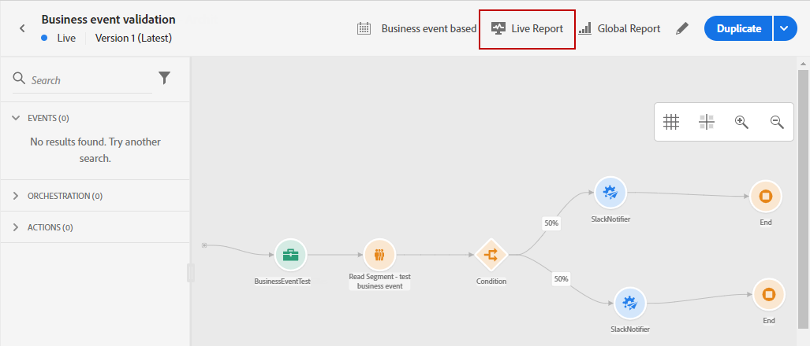
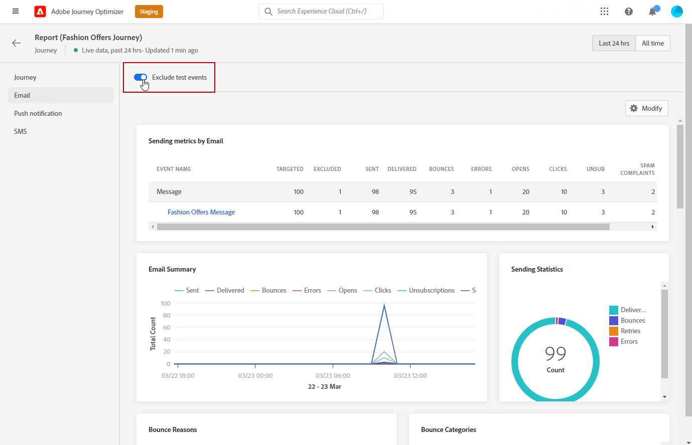
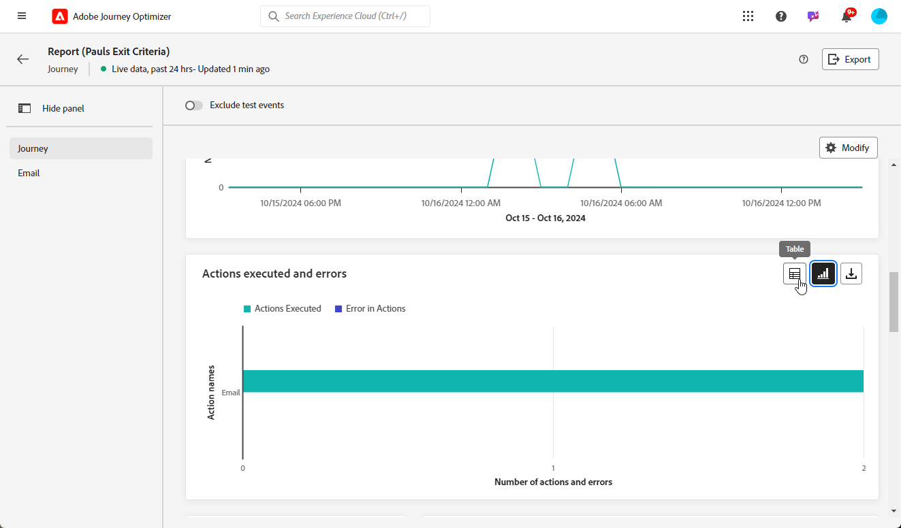

# Introduzione ai rapporti live {#live-report}

>[!BEGINSHADEBOX]

**In questa pagina:** Inizia a usare il rapporto Adobe Journey Optimizer Live per visualizzare in tempo reale le prestazioni del percorso e della campagna, personalizzare i widget del dashboard ed esportare i tuoi rapporti.

>[!ENDSHADEBOX]

Utilizza il **[!UICONTROL rapporto live]** per misurare e visualizzare in tempo reale l&#39;impatto e le prestazioni dei tuoi percorsi e dei tuoi messaggi in una dashboard incorporata. I dati sono disponibili nel **[!UICONTROL Report live]** non appena la consegna viene inviata o il percorso viene eseguito dalla scheda **[!UICONTROL Ultime 24 ore]**.

* Se desideri eseguire il targeting di un percorso nel contesto di un percorso, dal menu **[!UICONTROL Percorsi]**, accedi al menu **[!UICONTROL Altre azioni]** del tuo percorso e fai clic sul pulsante **[!UICONTROL Visualizza report delle ultime 24 ore]**.

  

* Se desideri eseguire il targeting di una campagna, dal menu **[!UICONTROL Campagne]**, accedi alla campagna e fai clic sul pulsante **[!UICONTROL Rapporti]**, quindi **[!UICONTROL Visualizza il report delle ultime 24 ore]**.

  

Per un elenco dettagliato di tutte le metriche disponibili in Adobe Journey Optimizer, consulta [questa pagina](#list-of-components-live).

## Personalizza dashboard {#modify-dashboard}

Ogni dashboard di reporting può essere modificata ridimensionando o rimuovendo i widget. La modifica dei widget ha effetto solo sul dashboard dell&#39;utente corrente. Gli altri utenti visualizzeranno le proprie dashboard o quelle impostate per impostazione predefinita.

1. Dal menu a discesa **[!UICONTROL Azioni]**, scegli se desideri creare rapporti su una particolare azione dei tuoi percorsi.

1. Scegliere se si desidera escludere gli eventi di test dai rapporti con la barra di attivazione. Per ulteriori informazioni sugli eventi di test, fare riferimento a [questa pagina](../building-journeys/testing-the-journey.md).

   L&#39;opzione **[!UICONTROL Escludi eventi di test]** è disponibile solo per i report di Percorso.

   

1. Per ridimensionare o rimuovere i widget, fare clic su **[!UICONTROL Modifica]**.

   

1. Regolate le dimensioni dei widget trascinandone l&#39;angolo inferiore destro.

   

1. Fare clic su **[!UICONTROL Rimuovi]** per rimuovere i widget non necessari.

   

1. Una volta che sei soddisfatto dell&#39;ordine di visualizzazione e delle dimensioni dei widget, fai clic su **[!UICONTROL Salva]**.

1. Per personalizzare la modalità di visualizzazione dei dati, puoi passare da diverse opzioni di visualizzazione, ad esempio grafici, tabelle e grafici ad anello.

   

Il dashboard è ora salvato. Le diverse modifiche verranno riapplicate per un utilizzo successivo dei rapporti live. Se necessario, utilizzare l&#39;opzione **[!UICONTROL Reimposta]** per ripristinare l&#39;ordine dei widget e dei widget predefiniti.

## Esportazione dei rapporti {#export-reports}

Puoi esportare facilmente i diversi rapporti in formato PDF o CSV, per condividerli o stamparli.

>[!BEGINTABS]

>[!TAB Esporta il report come file PDF]

1. Dal report, fai clic su **[!UICONTROL Esporta]** e seleziona **[!UICONTROL File PDF]**.

   

1. Nella finestra Stampa configurare il documento in base alle esigenze. Le opzioni possono variare a seconda del browser in uso.

1. Scegliere se stampare o salvare il report come PDF.

1. Individuare la cartella in cui si desidera salvare il file, rinominarlo, se necessario, e fare clic su Salva.

Il report è ora disponibile per la visualizzazione o la condivisione in un file pdf.

>[!TAB Esporta il report come file CSV]

1. Dal tuo report, fai clic su **[!UICONTROL Esporta]** e seleziona **[!UICONTROL File CSV]** per generare un file CSV a livello di report complessivo.

   

1. Puoi anche scegliere di esportare i dati da un widget specifico. Fai clic su **[!UICONTROL Scarica file CSV]** accanto al widget selezionato.

   

1. Il file viene scaricato automaticamente e si trova nei file locali.

   Se hai generato il file a livello di report, contiene informazioni dettagliate per ciascun widget, inclusi il titolo e i dati.

   Se hai generato il file a livello di widget, fornisce specificamente i dati per il widget selezionato.

>[!ENDTABS]
