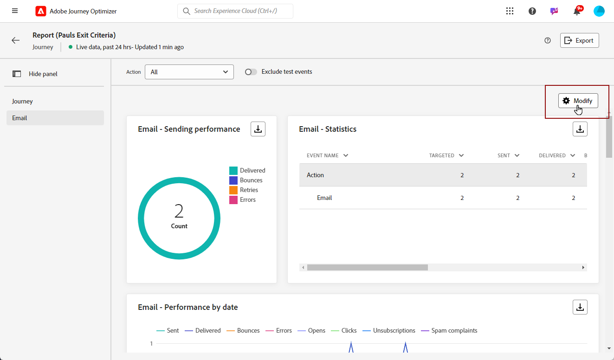

# Introduzione ai rapporti live {#live-report}

Utilizza il **[!UICONTROL Rapporto live]** per misurare e visualizzare in tempo reale l’impatto e le prestazioni dei percorsi e dei messaggi in una dashboard incorporata.
I dati sono disponibili nel **[!UICONTROL Rapporto live]** non appena la consegna viene inviata o il percorso viene eseguito dal **[!UICONTROL Ultime 24 ore]** scheda.

* Se si desidera eseguire il targeting di un percorso nel contesto di un percorso, dal **[!UICONTROL Percorsi]** , accedere al percorso e fare clic sul pulsante **[!UICONTROL Visualizza rapporto]** pulsante.

  

* Se desideri eseguire il targeting di una campagna, da **[!UICONTROL Campagne]** , accedi alla tua campagna e fai clic sul pulsante **[!UICONTROL Rapporti]** pulsante.

  

* Se si desidera passare dalla modalità **[!UICONTROL Rapporto globale]** al **[!UICONTROL Rapporto live]** per la consegna, fai clic su **[!UICONTROL Ultime 24 ore]** dal selettore di tabulazione.

  

Per un elenco dettagliato di tutte le metriche disponibili in Adobe Journey Optimizer, consulta [questa pagina](#list-of-components-live).

## Personalizza dashboard {#modify-dashboard}

Ogni dashboard di reporting può essere modificato ridimensionando o rimuovendo i widget. La modifica dei widget ha effetto solo sul dashboard dell&#39;utente corrente. Gli altri utenti visualizzeranno le proprie dashboard o quelle impostate per impostazione predefinita.

1. Dalla sezione **[!UICONTROL Azioni]** a discesa, scegli se desideri creare rapporti su una particolare azione dei tuoi percorsi.

1. Scegliere se si desidera escludere gli eventi di test dai rapporti con la barra di attivazione. Per ulteriori informazioni sugli eventi di test, consulta [questa pagina](../building-journeys/testing-the-journey.md).

   Tieni presente che **[!UICONTROL Escludere gli eventi di test]** L&#39;opzione è disponibile solo per i rapporti di Percorso.

   

1. Per ridimensionare o rimuovere i widget, fare clic su **[!UICONTROL Modifica]**.

   

1. Regolate le dimensioni dei widget trascinandone l&#39;angolo inferiore destro.

   

1. Clic **[!UICONTROL Rimuovi]** per rimuovere i widget non necessari.

   

1. Quando si è soddisfatti dell&#39;ordine di visualizzazione e delle dimensioni dei widget, fare clic su **[!UICONTROL Salva]**.

1. Per personalizzare la modalità di visualizzazione dei dati, puoi passare da diverse opzioni di visualizzazione, ad esempio grafici, tabelle e grafici ad anello.

   

Il dashboard è ora salvato. Le diverse modifiche verranno riapplicate per un utilizzo successivo dei rapporti live. Se necessario, utilizza **[!UICONTROL Reimposta]** per ripristinare l&#39;ordine dei widget e dei widget predefiniti.

## Esportazione dei rapporti {#export-reports}

Puoi esportare facilmente i diversi rapporti in formato PDF o CSV, per condividerli o stamparli.

>[!BEGINTABS]

>[!TAB Esportare il report come file PDF]

1. Dal report, fai clic su **[!UICONTROL Esporta]** e seleziona **[!UICONTROL file PDF]**.

   

1. Nella finestra Stampa configurare il documento in base alle esigenze. Le opzioni possono variare a seconda del browser in uso.

1. Scegliere se stampare o salvare il report come PDF.

1. Individuare la cartella in cui si desidera salvare il file, rinominarlo, se necessario, e fare clic su Salva.

Il report è ora disponibile per la visualizzazione o la condivisione in un file pdf.

>[!TAB Esportare il rapporto come file CSV]

1. Dal report, fai clic su **[!UICONTROL Esporta]** e seleziona **[!UICONTROL File CSV]** per generare un file CSV a livello di report complessivo.

   

1. Puoi anche scegliere di esportare i dati da un widget specifico. Clic **[!UICONTROL Esporta dati widget in CSV]** accanto al widget selezionato.

   

1. Il file viene scaricato automaticamente e si trova nei file locali.

   Se hai generato il file a livello di report, contiene informazioni dettagliate per ciascun widget, inclusi il titolo e i dati.

   Se hai generato il file a livello di widget, fornisce specificamente i dati per il widget selezionato.

>[!ENDTABS]
