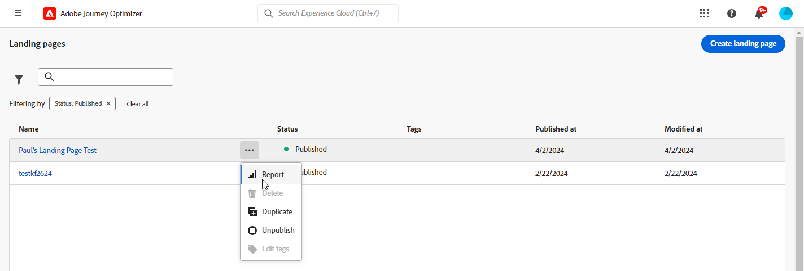
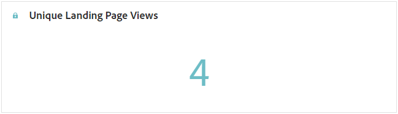

# Rapporto pagina di destinazione {#lp-report-global-cja}

Il rapporto **Pagina di destinazione** offre informazioni utili sul comportamento degli utenti, sui pattern di coinvolgimento, sui tassi di conversione e su altre metriche chiave, consentendoti di prendere decisioni informate e ottimizzare le prestazioni della pagina di destinazione in modo efficace.

Per accedere ai tuoi report, seleziona **[!UICONTROL Report]** dal menu avanzato della pagina di destinazione selezionata.

Per ulteriori informazioni sull&#39;area di lavoro di Customer Journey Analytics e su come filtrare e analizzare i dati, vedere [questa pagina](https://experienceleague.adobe.com/en/docs/analytics-platform/using/cja-workspace/home).

## Tasso di conversione pagina di destinazione {#lp-conversion}

Il KPI **[!UICONTROL Tasso di conversione pagina di destinazione]** consente di valutare l&#39;efficacia della pagina di destinazione in base al numero di visite e interazioni.

* **[!UICONTROL Tasso di conversione pagina di destinazione]**: numero di persone che hanno interagito con la pagina di destinazione, ad esempio hanno effettuato l&#39;abbonamento a un modulo, in relazione al numero totale di visite.

## Percentuale di mancato recapito della pagina di destinazione {#lp-bounce-rate}

Il KPI **[!UICONTROL Percentuale non recapitate]** per la pagina di destinazione fornisce informazioni sui profili che hanno visualizzato la pagina di destinazione senza interagire o fare clic su alcun elemento.

* **[!UICONTROL Percentuale non recapitate nella pagina di destinazione]**: numero di persone che non hanno interagito con la pagina di destinazione e non hanno completato l&#39;azione di iscrizione, in relazione al numero totale di visite.

## Visualizzazioni della pagina di destinazione {#lp-views}

L&#39;indicatore KPI **[!UICONTROL Visualizzazioni pagina di destinazione]** consente di visualizzare l&#39;impatto della pagina di destinazione.

* **[!UICONTROL Visualizzazioni pagina di destinazione]**: numero totale di visite alla pagina di destinazione provenienti da percorsi e origini esterne, incluse più visite di un profilo.

## Visualizzazioni pagina di destinazione univoche {#lp-unique-views}

Il KPI **[!UICONTROL Visualizzazioni pagina di destinazione univoche]** consente di misurare l&#39;impatto della pagina di destinazione escludendo più visualizzazioni dallo stesso profilo.

* **[!UICONTROL Visualizzazioni pagina di destinazione univoche]**: non vengono prese in considerazione le persone che hanno visitato la pagina di destinazione, le visite multiple di un profilo.

## Prestazioni pagina di destinazione nel tempo {#lp-performance-overtime}

Il grafico **[!UICONTROL Prestazioni della pagina di destinazione nel tempo]** misura il successo delle pagine di destinazione e l&#39;impatto sul pubblico di destinazione.

* **[!UICONTROL Visualizzazioni pagina di destinazione]**: numero totale di visite alla pagina di destinazione provenienti da percorsi e origini esterne, incluse più visite di un profilo.

* **[!UICONTROL Conversione pagina di destinazione]**: numero di persone che hanno interagito con la pagina di destinazione, ad esempio hanno effettuato l&#39;abbonamento a un modulo, in relazione al numero totale di visite.

## Prestazioni pagina di destinazione {#lp-performance}

La tabella delle prestazioni della **[!UICONTROL pagina di destinazione]** funge da dashboard completo e offre una suddivisione dettagliata delle metriche chiave correlate alla pagina di destinazione.

* **[!UICONTROL Tasso di conversione pagina di destinazione]**: numero di persone che hanno interagito con la pagina di destinazione, ad esempio hanno effettuato l&#39;abbonamento a un modulo, in relazione al numero totale di visite.

* **[!UICONTROL Percentuale non recapitate nella pagina di destinazione]**: numero di persone che non hanno interagito con la pagina di destinazione e non hanno completato l&#39;azione di iscrizione, in relazione al numero totale di visite.

* **[!UICONTROL Visualizzazioni pagina di destinazione univoche]**: non vengono prese in considerazione le persone che hanno visitato la pagina di destinazione, le visite multiple di un profilo.

* **[!UICONTROL Conversione pagina di destinazione univoca]**: il numero di persone che hanno interagito con la pagina di destinazione e le interazioni multiple di un profilo non vengono prese in considerazione.

* **[!UICONTROL Visualizzazioni pagina di destinazione]**: numero totale di visite alla pagina di destinazione provenienti da percorsi e origini esterne, incluse più visite di un profilo.

* **[!UICONTROL Conversione pagina di destinazione]**: numero di persone che hanno interagito con la pagina di destinazione, ad esempio hanno effettuato l&#39;abbonamento a un modulo.

## Percorsi {#lp-journeys}

La tabella **[!UICONTROL Percorso]** fornisce una panoramica completa, specificando la frequenza delle visite alla pagina di destinazione nel contesto del percorso di un utente. Questa rappresentazione approfondita offre dati preziosi sulle interazioni degli utenti, consentendoti di comprendere in che modo i visitatori navigano nel sito e interagiscono con i contenuti.

* **[!UICONTROL Visualizzazioni pagina di destinazione]**: numero totale di visite alla pagina di destinazione provenienti da percorsi e origini esterne, incluse più visite di un profilo.

* **[!UICONTROL Conversione pagina di destinazione]**: numero di persone che hanno interagito con la pagina di destinazione, ad esempio hanno effettuato l&#39;abbonamento a un modulo.

## Campagne {#lp-campaigns}

La tabella **[!UICONTROL Campagne]** fornisce informazioni approfondite sul numero di visite indirizzate alla pagina di destinazione in seguito a campagne specifiche, offrendo una panoramica completa dell&#39;efficacia della campagna e del coinvolgimento con il contenuto della pagina di destinazione.

* **[!UICONTROL Visualizzazioni pagina di destinazione]**: numero totale di visite alla pagina di destinazione provenienti da percorsi e origini esterne, incluse più visite di un profilo.

* **[!UICONTROL Conversione pagina di destinazione]**: numero di persone che hanno interagito con la pagina di destinazione, ad esempio hanno effettuato l&#39;abbonamento a un modulo.

## Canale {#lp-channels}

La tabella **[!UICONTROL Canale]** mostra il numero di visite alla pagina di destinazione suddivise per canale.

* **[!UICONTROL Visualizzazioni pagina di destinazione]**: numero totale di visite alla pagina di destinazione provenienti da percorsi e origini esterne, incluse più visite di un profilo.

* **[!UICONTROL Conversione pagina di destinazione]**: numero di persone che hanno interagito con la pagina di destinazione, ad esempio hanno effettuato l&#39;abbonamento a un modulo.

## Collegamenti più cliccati {#lp-top-clicked}

La tabella **[!UICONTROL Collegamenti selezionati principali]** fornisce informazioni su come i visitatori interagiscono con la consegna, evidenziando quali collegamenti ricevono il maggior coinvolgimento e l&#39;attenzione del pubblico.

* **[!UICONTROL Clic su pagina di destinazione]**: numero di volte in cui è stato fatto clic su un contenuto nella pagina di destinazione.
