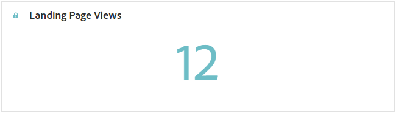

# Rapporto pagina di destinazione {#lp-report-global-cja}

Il **Pagina di destinazione** Il rapporto offre informazioni utili sul comportamento degli utenti, sui pattern di coinvolgimento, sui tassi di conversione e altre metriche chiave, consentendoti di prendere decisioni informate e ottimizzare in modo efficace le prestazioni della pagina di destinazione.

Per accedere ai rapporti, seleziona **[!UICONTROL Report]** dal menu avanzato della pagina di destinazione selezionata.

Per ulteriori informazioni sull’area di lavoro di Customer Journey Analytics e su come filtrare e analizzare i dati, consulta [questa pagina](https://experienceleague.adobe.com/en/docs/analytics-platform/using/cja-workspace/home).

## Tasso di conversione pagina di destinazione {#lp-conversion}

Il **[!UICONTROL Tasso di conversione pagina di destinazione]** KPI consente di valutare l’efficacia della pagina di destinazione in base al numero di visite e interazioni.

* **[!UICONTROL Tasso di conversione pagina di destinazione]**: numero di persone che hanno interagito con la pagina di destinazione, ad esempio che si sono abbonate a un modulo, in relazione al numero totale di visite.

## Percentuale di mancato recapito della pagina di destinazione {#lp-bounce-rate}

Il **[!UICONTROL Percentuale di mancato recapito della pagina di destinazione]** KPI fornisce informazioni sui profili che hanno visualizzato la pagina di destinazione senza interagire o fare clic su alcun elemento.

* **[!UICONTROL Percentuale di mancato recapito della pagina di destinazione]**: numero di persone che non hanno interagito con la pagina di destinazione e non hanno completato l’azione di iscrizione, in relazione al numero totale di visite.

## Visualizzazioni della pagina di destinazione {#lp-views}

Il **[!UICONTROL Visualizzazioni della pagina di destinazione]** KPI ti consente di visualizzare l’impatto della pagina di destinazione.

* **[!UICONTROL Visualizzazioni della pagina di destinazione]**: numero totale di visite alla pagina di destinazione provenienti da percorsi e origini esterne, incluse visite multiple di un profilo.

## Visualizzazioni pagina di destinazione univoche {#lp-unique-views}

Il **[!UICONTROL Visualizzazioni pagina di destinazione univoche]** KPI consente di misurare l’impatto della pagina di destinazione escludendo più viste dallo stesso profilo.

* **[!UICONTROL Visualizzazioni pagina di destinazione univoche]**: numero di persone che hanno visitato la pagina di destinazione, non vengono prese in considerazione visite multiple di un profilo.

## Prestazioni della pagina di destinazione nel tempo {#lp-performance-overtime}

Il **[!UICONTROL Prestazioni della pagina di destinazione nel tempo]** il grafico misura il successo delle pagine di destinazione e l’impatto sul pubblico di destinazione.

* **[!UICONTROL Visualizzazioni della pagina di destinazione]**: numero totale di visite alla pagina di destinazione provenienti da percorsi e origini esterne, incluse visite multiple di un profilo.

* **[!UICONTROL Tasso di conversione pagina di destinazione]**: numero di persone che hanno interagito con la pagina di destinazione, ad esempio che si sono abbonate a un modulo, in relazione al numero totale di visite.

## Prestazioni della pagina di destinazione {#lp-performance}

Il **[!UICONTROL Prestazioni della pagina di destinazione]** La tabella funge da dashboard completo e offre una suddivisione dettagliata delle metriche chiave correlate alla pagina di destinazione.

* **[!UICONTROL Tasso di conversione pagina di destinazione]**: numero di persone che hanno interagito con la pagina di destinazione, ad esempio che si sono abbonate a un modulo, in relazione al numero totale di visite.

* **[!UICONTROL Percentuale di mancato recapito della pagina di destinazione]**: numero di persone che non hanno interagito con la pagina di destinazione e non hanno completato l’azione di iscrizione, in relazione al numero totale di visite.

* **[!UICONTROL Visualizzazioni pagina di destinazione univoche]**: numero di persone che hanno visitato la pagina di destinazione, non vengono prese in considerazione visite multiple di un profilo.

* **[!UICONTROL Tasso di conversione pagina di destinazione univoca]**: numero di persone che hanno interagito con la pagina di destinazione e interazioni multiple di un profilo non vengono prese in considerazione.

* **[!UICONTROL Visualizzazioni della pagina di destinazione]**: numero totale di visite alla pagina di destinazione provenienti da percorsi e origini esterne, incluse visite multiple di un profilo.

* **[!UICONTROL Conversione pagina di destinazione]**: numero di persone che hanno interagito con la pagina di destinazione, ad esempio si sono abbonate a un modulo.

## Percorsi {#lp-journeys}

Il **[!UICONTROL Percorso]** La tabella fornisce una panoramica completa, che descrive la frequenza delle visite alla pagina di destinazione nel contesto del percorso di un utente. Questa rappresentazione approfondita offre dati preziosi sulle interazioni degli utenti, consentendoti di comprendere in che modo i visitatori navigano nel sito e interagiscono con i contenuti.

* **[!UICONTROL Visualizzazioni della pagina di destinazione]**: numero totale di visite alla pagina di destinazione provenienti da percorsi e origini esterne, incluse visite multiple di un profilo.

* **[!UICONTROL Conversione pagina di destinazione]**: numero di persone che hanno interagito con la pagina di destinazione, ad esempio si sono abbonate a un modulo.

## Campagne {#lp-campaigns}

Il **[!UICONTROL Campagne]** la tabella fornisce informazioni sul numero di visite indirizzate alla pagina di destinazione in seguito a campagne specifiche, offrendo una panoramica completa dell’efficacia della campagna e del coinvolgimento con il contenuto della pagina di destinazione.

* **[!UICONTROL Visualizzazioni della pagina di destinazione]**: numero totale di visite alla pagina di destinazione provenienti da percorsi e origini esterne, incluse visite multiple di un profilo.

* **[!UICONTROL Conversione pagina di destinazione]**: numero di persone che hanno interagito con la pagina di destinazione, ad esempio si sono abbonate a un modulo.

## Channel {#lp-channels}

Il **[!UICONTROL Canale]** Nella tabella viene visualizzato il numero di visite alla pagina di destinazione suddivise per canale.

* **[!UICONTROL Visualizzazioni della pagina di destinazione]**: numero totale di visite alla pagina di destinazione provenienti da percorsi e origini esterne, incluse visite multiple di un profilo.

* **[!UICONTROL Conversione pagina di destinazione]**: numero di persone che hanno interagito con la pagina di destinazione, ad esempio si sono abbonate a un modulo.

## Collegamenti più cliccati {#lp-top-clicked}

Il **[!UICONTROL Collegamenti selezionati in alto]** la tabella fornisce informazioni su come i visitatori interagiscono con la consegna, evidenziando quali collegamenti ricevono il maggior coinvolgimento e attenzione dal pubblico.

* **[!UICONTROL Clic sulla pagina di destinazione]**: numero di volte in cui è stato fatto clic su un contenuto nella pagina di destinazione.

