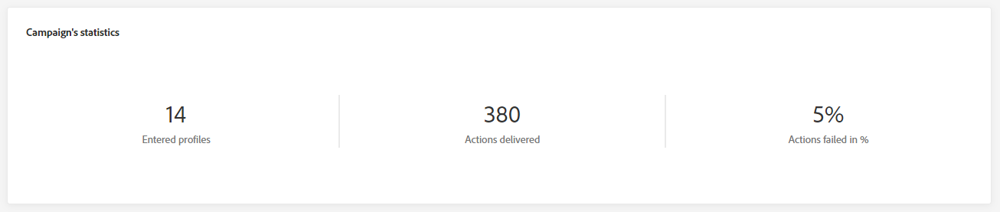

# Rapporto globale della campagna {#objective-report}

Il report globale della campagna è accessibile direttamente dalla campagna con il pulsante **[!UICONTROL Visualizza report]**.

Il **[!UICONTROL report globale]** della campagna è suddiviso in diversi widget che descrivono il successo e gli errori della campagna. Ogni widget può essere ridimensionato ed eliminato, se necessario. Per ulteriori informazioni, fare riferimento a <!--[section](../reports/global-report.md#modify-dashboard)-->.

Per un elenco dettagliato di tutte le metriche disponibili in Adobe Journey Optimizer, fare riferimento a <!--[this page](global-report.md#list-of-components-global.md)-->

## Scheda Campagna {#campaign-global-objectives}

### Consegna {#delivery-global-objectives}

<!--

-->

Il widget Statistiche **[!UICONTROL della]** campagna descrive le informazioni principali relative alla campagna:

* **[!UICONTROL Profili immessi]**: numero di profili che hanno avviato il percorso.

* **[!UICONTROL Azioni consegnate]**: numero totale di volte in cui un&#39;azione nel percorso è stata consegnata.

* **[!UICONTROL Azioni non riuscite in %]**: numero totale di volte in cui un&#39;azione non è riuscita nel percorso rispetto al numero totale di volte in cui un&#39;azione è stata consegnata.

### Relazione sugli obiettivi {#objective-global}

>[!AVAILABILITY]
>
>La funzionalità **Report obiettivi** è attualmente disponibile solo per un set di organizzazioni (disponibilità limitata). Per ulteriori informazioni, contatta il tuo rappresentante Adobe.

La scheda **[!UICONTROL Obiettivi]** ti consente di ottimizzare i rapporti delle consegne eseguendo il targeting di una metrica specifica.

Gli **[!UICONTROL obiettivi]** elencati sono collegati a **[!UICONTROL Set di dati]** che definiscono una connessione a un sistema per il recupero di informazioni aggiuntive. È disponibile un elenco di **[!UICONTROL Obiettivi]** incorporati, ma puoi aggiungerne di nuovi aggiungendo un **[!UICONTROL Set di dati]**. Per la procedura dettagliata, consulta questa [sezione](../reports/reporting-configuration.md).

Dopo aver selezionato gli obiettivi per i quali desideri eseguire il targeting, i due widget **[!UICONTROL Panoramica delle prestazioni]** e **[!UICONTROL Obiettivo campagna]** forniranno un riepilogo dettagliato delle prestazioni della consegna.

Con il widget **[!UICONTROL Obiettivo campagna]**, puoi anche scegliere di confrontare l&#39;obiettivo principale con un&#39;altra metrica.

### Rapporto sulla sperimentazione {#experimentation-global-objectives}

<!--

-->

La scheda **[!UICONTROL Sperimentazione]** fornisce informazioni chiave sulle prestazioni di ogni variante e identifica quella che ha avuto maggior successo.

La definizione dell&#39;esecutore migliore potrebbe richiedere un po&#39; di tempo, verrà rappresentata da questa icona .

+++Ulteriori informazioni sulle diverse metriche e widget disponibili per il rapporto Sperimentazione.

Il widget **[!UICONTROL Risultato esperimento]** descrive le prestazioni di ogni variante. Puoi modificare la linea di base selezionando uno dei trattamenti dal menu a discesa **[!UICONTROL Baseline]**. Il miglior trattamento sarà rappresentato da un’icona a forma di stella.

La tabella presenta le metriche seguenti:

* **[!UICONTROL Incremento rispetto al basale]**: misura del miglioramento percentuale del tasso di conversione di un determinato trattamento rispetto al basale.

* **[!UICONTROL Affidabilità]**: prova che un determinato trattamento è uguale al trattamento basale. [Ulteriori informazioni](../content-management/experiment-calculations.md#understand-confidence)

* **[!UICONTROL Clic in uscita univoci]**: numero totale di clic tra i canali in uscita.

* **[!UICONTROL Profili]**: numero di profili target per questo trattamento.

* **[!UICONTROL Clic/profili in uscita univoci]**: valore totale della metrica di successo, precedentemente selezionata durante la creazione degli esperimenti, diviso per il numero di profili.

Il grafico **[!UICONTROL Intervallo di affidabilità]** misura l&#39;incertezza sul miglioramento. Descrive la differenza percentuale nelle prestazioni tra la linea di base e il trattamento dalle prestazioni migliori. [Ulteriori informazioni](../content-management/experiment-calculations.md#confidence-intervals).
+++

Per informazioni approfondite su questi risultati e su come interpretarli, consulta [questa pagina](../content-management/get-started-experiment.md#interpret-results).
