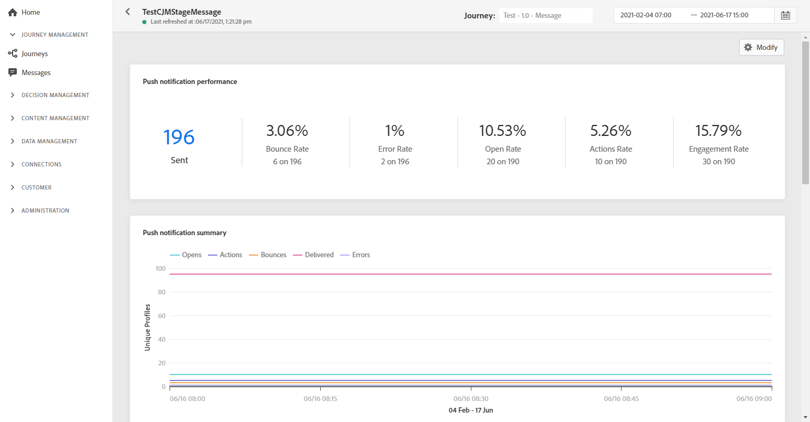

# Rapporto globale delle notifiche push {#push-global-report}

La spinta **[!UICONTROL Global report]** esegue solo il targeting di una consegna push specifica.

Da **[!UICONTROL Executions]** della scheda **[!UICONTROL Messages]** menu, seleziona **[!UICONTROL Global view]** dal menu avanzato della consegna selezionata, seleziona **[!UICONTROL Global report]**.

La spinta **[!UICONTROL Global report]** è suddiviso in diversi widget che descrivono in dettaglio il successo e gli errori della consegna. Se necessario, ogni widget può essere ridimensionato ed eliminato. Per ulteriori informazioni su questo consulta [sezione](global-report.md#modify-dashboard).

La **[!UICONTROL Push notification performance]** widget fornisce informazioni principali relative alle notifiche push con KPI:

* **[!UICONTROL Sent]**: Numero totale di invii per la consegna.

* **[!UICONTROL Bounce Rate]**: Percentuale di notifiche push rimbalzate rispetto alle notifiche push inviate.

* **[!UICONTROL Error Rate]**: Percentuale di errori che si sono verificati durante una consegna che ne impedisce l’invio rispetto alle notifiche push inviate.

* **[!UICONTROL Actions Rate]**: Percentuale di azioni sulla notifica push consegnata, ad esempio clic su un pulsante o eliminazione.

* **[!UICONTROL Engagement Rate]**: Percentuale di aperture e azioni per questa notifica push, ad esempio se il profilo ha aperto il push o se è stato fatto clic su un pulsante.

La **[!UICONTROL Push notification summary]** Il grafico contiene i dati disponibili per le notifiche push inviate, ad esempio:

* **[!UICONTROL Opens]**: Numero di volte in cui un messaggio è stato aperto in una consegna.

* **[!UICONTROL Actions]**: Numero totale di azioni sulla notifica push consegnata, ad esempio clic su un pulsante o cancellazione.

* **[!UICONTROL Bounces]**: Totale degli errori cumulati durante la consegna e l’elaborazione automatica della restituzione in relazione al numero totale di messaggi inviati.

* **[!UICONTROL Delivered]**: Numero di messaggi inviati correttamente in relazione al numero totale di messaggi inviati.

* **[!UICONTROL Errors]**: Numero totale di errori che si sono verificati durante una consegna e che ne impediscono l’invio ai profili.

La **[!UICONTROL Error Reasons]** grafico e tabella consentono di vedere quale errore si è verificato durante la consegna.

La **[!UICONTROL Tracking by platform]**, **[!UICONTROL Sending by platform]** e **[!UICONTROL Breakdown by platform]** grafici e tabelle descrivono il successo della notifica push in base al sistema operativo del destinatario.
