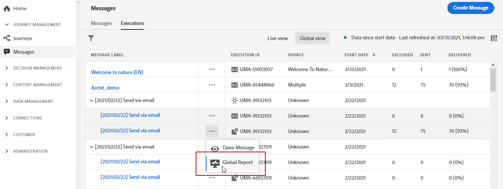

# Rapporto globale delle notifiche push {#push-global-report}

**[!UICONTROL Global report]**

**[!UICONTROL Executions]****[!UICONTROL Messages]****[!UICONTROL Global view]****[!UICONTROL Global report]**

**[!UICONTROL Global report]** Each widget can be resized and deleted if needed. 

**[!UICONTROL Push notification performance]**

* **[!UICONTROL Sent]**

* **[!UICONTROL Bounce Rate]**

* **[!UICONTROL Error Rate]**

* **[!UICONTROL Actions Rate]**

* **[!UICONTROL Engagement Rate]**

**[!UICONTROL Push notification summary]**

* **[!UICONTROL Opens]**

* **[!UICONTROL Actions]**

* **[!UICONTROL Bounces]**

* **[!UICONTROL Delivered]**

* **[!UICONTROL Errors]**

**[!UICONTROL Error Reasons]**

**[!UICONTROL Tracking by platform]****[!UICONTROL Sending by platform]****[!UICONTROL Breakdown by platform]**
