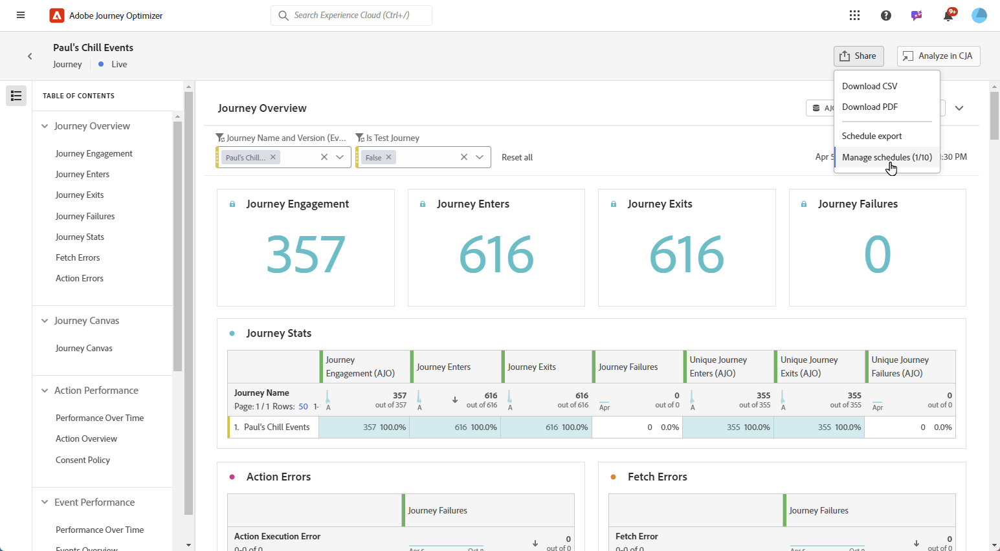
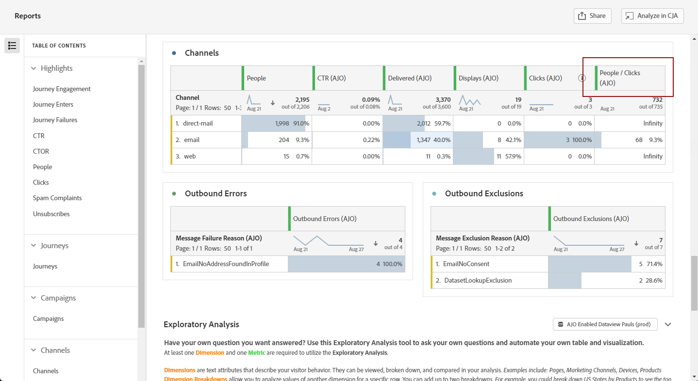

# Gestire i rapporti {#channel-cja-manage}

## Analizza nel Customer Journey Analytics {#analyze}

Migliora la tua esperienza di analisi dei dati con la licenza di **[!DNL Customer Journey Analytics]** sfruttando la funzionalità **[!UICONTROL Analizza in CJA]** disponibile in tutti i report.

Questa potente opzione ti reindirizza direttamente al tuo ambiente **[!DNL Customer Journey Analytics]**, consentendoti di personalizzare estesamente i tuoi report. Puoi arricchire i tuoi widget con metriche di Customer Journey Analytics specializzate, portando le tue informazioni a un livello completamente nuovo.

[Ulteriori informazioni sull&#39;interfaccia di Customer Journey Analytics.](https://experienceleague.adobe.com/en/docs/analytics-platform/using/cja-overview/cja-getting-started)

## Definire il periodo del rapporto {#report-period}

Quando accedi a un rapporto, puoi applicare un filtro per periodo di tempo, posizionato nell’angolo in alto a destra del rapporto.

Per impostazione predefinita, il periodo di filtro per una campagna o un percorso è impostato sulle relative date di inizio e fine. Se non è presente una data di fine, per impostazione predefinita il filtro utilizzerà la data corrente.

Per modificare il filtro, puoi selezionare una data e una durata di inizio personalizzate oppure scegliere tra opzioni predefinite, ad esempio l’ultima settimana o due mesi fa.

Il rapporto viene aggiornato automaticamente una volta applicato o modificato il filtro.

## Esportazione dei rapporti {#export-reports}

Puoi esportare facilmente i diversi rapporti in formato PDF o CSV, per condividerli o stamparli. I passaggi per esportare i rapporti sono descritti nelle schede seguenti.

>[!BEGINTABS]

>[!TAB Esporta il report come file CSV]

1. Dal tuo report, fai clic su **[!UICONTROL Condividi]** e seleziona **[!UICONTROL Scarica CSV]** per generare un file CSV a livello di report complessivo.

   

1. Il file viene scaricato automaticamente e si trova nei file locali.

   Se hai generato il file a livello di report, contiene informazioni dettagliate per ciascun widget, inclusi il titolo e i dati.

>[!TAB Esporta il report come file PDF]

1. Dal tuo report, fai clic su **[!UICONTROL Condividi]** e seleziona **[!UICONTROL Scarica PDF]**.

   

1. Dopo aver richiesto il download, fare clic su **[!UICONTROL Scarica]**.

   

1. Il file si aprirà automaticamente nel browser.

Il report è ora disponibile per la visualizzazione, il download o la condivisione in un file PDF.

>[!ENDTABS]

<!--
## Schedule exports {#schedule-export}

The **Schedule export** lets you automate the delivery of up to 10 reports at weekly, monthly or yearly intervals. You can also easily manage your scheduled reports, with options to update, edit, cancel, or delete any of your scheduled exports.

1. From your report, click **[!UICONTROL Share]** and select **[!UICONTROL Schedule export]**.

   

1. Choose your **[!UICONTROL File type]** between CSV and PDF.

1. If needed, you can add a **[!UICONTROL Description]** to your export.

1. Enter the name of the recipients who will receive this automated delivery.

   

1. Choose the **[!UICONTROL Frequency]**.

1. Based on the selected frequency, provide the relevant scheduling details, such as:

   * Start and end dates
   
   * Interval (e.g., every few weeks)

   * Specific day of the week
   
   * Week within the month

   * Day within the month
   
   * Month of the year

1. Click **[!UICONTROL Send on schedule]**.

1. To edit previously created scheduled export, click **[!UICONTROL Share]** and select **[!UICONTROL Manage schedules]**.

   

1. From the list of scheduled exports, choose the one you want to update and make the necessary changes.

1. To delete a scheduled report, select one from the managed schedules list and click **[!UICONTROL Delete]**.

   
-->

## Creare una metrica semplice {#create-simple-metric}

Puoi creare metriche calcolate personalizzate direttamente all’interno dei rapporti. Puoi generare informazioni più personalizzate e analizzare meglio i dati combinando due metriche esistenti in modo che soddisfino le tue esigenze di reporting specifiche.

1. Per prima cosa, accedi al rapporto in cui desideri aggiungere una nuova metrica.

1. Nella tabella all&#39;interno del report, selezionare le metriche desiderate tenendo premuto il tasto `Shift` o `CTRL/CMD` mentre si fa clic su di esse. Quindi, fare clic con il pulsante destro del mouse e selezionare **[!UICONTROL Crea metrica da selezione]**.

   Se selezioni più di due metriche, nel generatore di metriche verranno utilizzate solo le prime due.

   

1. Dal generatore di metriche calcolate, assegna un nome alla nuova metrica digitando nel campo **[!UICONTROL Titolo]**. Puoi anche aggiungere una **[!UICONTROL Descrizione]**.

   >[!NOTE]
   >
   >Se possiedi un Customer Journey Analytics, puoi personalizzare ulteriormente le metriche con opzioni aggiuntive. [Ulteriori informazioni](https://experienceleague.adobe.com/en/docs/analytics-platform/using/cja-components/cja-calcmetrics/cm-workflow/cm-build-metrics#areas-of-the-calculated-metrics-builder)

1. Scegli le **[!UICONTROL Cifre decimali]** appropriate e seleziona un **[!UICONTROL Formato]** (Decimale, Ora, Percentuale o Valuta) in base alla modalità di visualizzazione della metrica.

1. Selezionare l&#39;operatore, ad esempio addizione, sottrazione, moltiplicazione o divisione, che determinerà la modalità di calcolo della metrica.

   

1. Se necessario, puoi riordinare i componenti.

1. Quando sei soddisfatto delle tue impostazioni, fai clic su **[!UICONTROL Applica]** per finalizzare la nuova metrica.

1. La nuova metrica verrà visualizzata accanto alle metriche originali nel rapporto.

   

La metrica appena creata verrà inclusa quando esporti il rapporto come PDF o CSV. Tuttavia, verrà rimosso dal report una volta chiuso.

## Esplorare i dati con l’analisi esplorativa {#exploratory}

Utilizza lo strumento di analisi esplorativa per creare facilmente tabelle e visualizzazioni dai **[!UICONTROL Dimension]** e dalle **[!UICONTROL metriche]** selezionati. Questo strumento semplifica l&#39;esplorazione dei dati, consentendo di personalizzare e analizzare le informazioni in modo semplice e automatico. Ulteriori informazioni sono disponibili in [questa documentazione](https://experienceleague.adobe.com/en/docs/analytics/analyze/analysis-workspace/panels/quickinsight).

1. Per iniziare, accedi al rapporto in cui desideri utilizzare l’analisi esplorativa.

1. Seleziona il menu Analisi esplorativa dal menu della barra a sinistra.

   

1. Crea una query scegliendo un **[!UICONTROL Dimension]** e una **[!UICONTROL Metrica]** utilizzando i menu a discesa. Se necessario, puoi anche selezionare un **[!UICONTROL segmento]**.

   

1. Definisci l’intervallo di date per l’analisi in modo da specificare il periodo su cui desideri concentrarti. Per impostazione predefinita, l’intervallo di date viene impostato su quello utilizzato nel pannello del rapporto.

1. Utilizza le opzioni **[!UICONTROL Aggiungi suddivisione]** o **[!UICONTROL Aggiungi metrica]** per includere dimensioni aggiuntive, consentendo un raggruppamento dei dati più dettagliato.

   Puoi aggiungere fino a tre **[!UICONTROL Dimension]**, **[!UICONTROL Metriche]** e **[!UICONTROL Segmenti]**.

Ora puoi analizzare i dati utilizzando gli strumenti di tabella e visualizzazione personalizzati.

<!--## Create a down-funnel metric {#down-funnel}

1. Create a new journey or open an existing one. [Learn more on journey creation](../building-journeys/journey-gs.md)

1. On the canvas editor, select the option to "add a metric".

c. In the metric selector, choose whichever conversion metric seems appropriate and publish your journey

d. Open the report for the journey that you added the metric to and ensure that the metric has been added to the table alongside all the other pre-configured metrics.
-->

## Creare un pubblico dai dati di reporting {#create-audience}

>[!IMPORTANT]
>
>Ogni organizzazione è limitata a pubblicare 25 tipi di pubblico. Inoltre, gli utenti possono pubblicare fino a 5 tipi di pubblico all’ora e 20 al giorno.
> I tipi di pubblico una tantum hanno una durata di 48 ore. Pertanto, se entro tale arco temporale vengono pubblicati 25 tipi di pubblico, è possibile pubblicare tali tipi di pubblico solo una volta trascorso il periodo di 48 ore.

Ora puoi selezionare dati specifici all’interno della tabella e creare direttamente un pubblico da queste selezioni, semplificando e semplificando il processo di creazione del pubblico.

1. Per prima cosa, accedi alla tabella del rapporto contenente i dati da trasformare in un pubblico.

1. Fare clic con il pulsante destro del mouse sulla cella desiderata e selezionare **[!UICONTROL Crea pubblico]**.

   In alternativa, puoi avviare la creazione di un pubblico dal widget **[!UICONTROL area di lavoro Percorsi]** selezionando un nodo e facendo clic con il pulsante destro del mouse su di esso.

1. Nella finestra **[!UICONTROL Crea pubblico]**, immetti un **[!UICONTROL Nome]** e imposta un **[!UICONTROL Intervallo di date occasionale]** per il pubblico che intendi pubblicare.

   >[!NOTE]
   >
   >Se possiedi un Customer Journey Analytics, puoi personalizzare ulteriormente le metriche con opzioni aggiuntive. [Ulteriori informazioni](https://experienceleague.adobe.com/en/docs/analytics-platform/using/cja-components/audiences/publish)

   

1. Fai clic sul pulsante **[!UICONTROL Crea]** per finalizzare la creazione del pubblico. Tieni presente che il completamento di questo processo potrebbe richiedere del tempo.

Ora puoi continuare a utilizzare il pubblico appena creato con un Percorso o una campagna.

