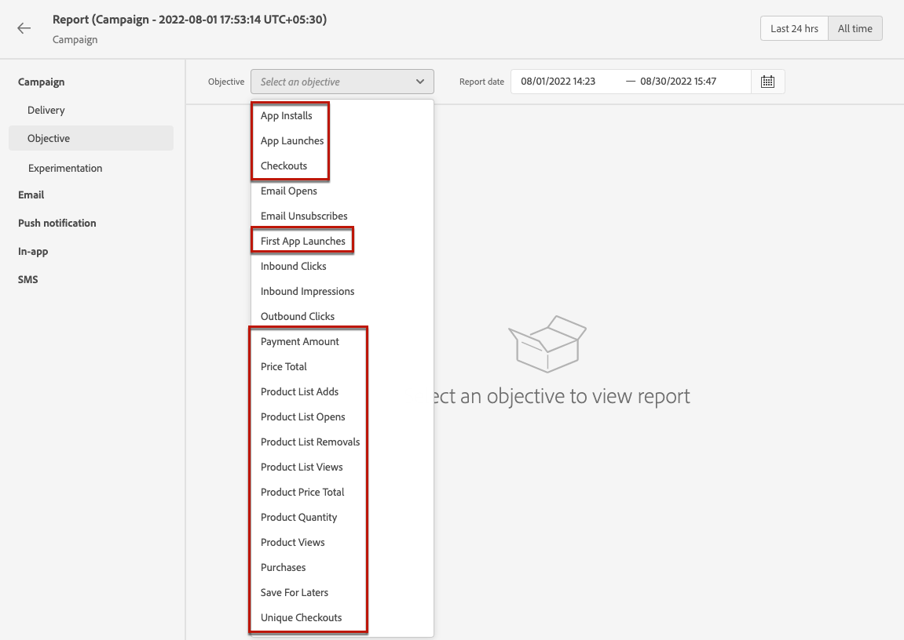

# Prerequisiti per il reporting e la sperimentazione {#reporting-configuration}

>[!CONTEXTUALHELP]
>id="ajo_admin_reporting_config"
>title="Imposta set di dati per il reporting"
>abstract="La configurazione del reporting consente di recuperare metriche aggiuntive che verranno utilizzate nei rapporti della campagna. Deve essere eseguito da un utente tecnico."

>[!CONTEXTUALHELP]
>id="ajo_admin_reporting_dataset"
>title="Selezionare un set di dati"
>abstract="Puoi selezionare solo un set di dati di tipo evento, che deve contenere almeno uno dei gruppi di campi supportati: dettagli applicazione, dettagli e-commerce, dettagli web."

>[!NOTE]
>
>La configurazione del reporting deve essere eseguita da un utente tecnico.

La configurazione dell’origine dati consente di definire una connessione a un sistema per recuperare informazioni aggiuntive, le quali verranno utilizzate nei rapporti.

Per questa configurazione, devi aggiungere uno o più set di dati contenenti gli elementi aggiuntivi che desideri utilizzare per i rapporti. Per farlo, segui la procedura [indicata di seguito](#add-datasets).

Tieni presente che per i canali web, basati su codice e in-app, devi assicurarti che anche il [set di dati](../data/get-started-datasets.md) configurato per la raccolta dati sia aggiunto a questa configurazione di reporting. In caso contrario, i dati web e in-app non verranno visualizzati nei rapporti dell’esperimento sui contenuti.

## Prerequisiti

Prima di poter aggiungere un set di dati alla configurazione di reporting, devi crearlo. Scopri come fare nella [documentazione di Adobe Experience Platform](https://experienceleague.adobe.com/docs/experience-platform/catalog/datasets/user-guide.html?lang=it#create){target="_blank"}.

* Puoi aggiungere solo set di dati di tipo evento.

* Questi set di dati devono includere il `Experience Event - Proposition Interactions` [gruppo di campi](https://experienceleague.adobe.com/docs/experience-platform/xdm/tutorials/create-schema-ui.html?lang=it#field-group){target="_blank"}.

* Questi set di dati possono contenere anche uno dei seguenti [gruppi di campi](https://experienceleague.adobe.com/docs/experience-platform/xdm/tutorials/create-schema-ui.html?lang=it#field-group){target="_blank"}: `Application Details`, `Commerce Details`, `Web Details`.

  >[!NOTE]
  >
  >Possono essere inclusi anche altri gruppi di campi, ma solo i gruppi di campi di cui sopra sono attualmente supportati nella generazione rapporti di Journey Optimizer.

  Ad esempio, se desideri conoscere l&#39;impatto di una campagna e-mail sui dati di commerce, ad esempio acquisti o ordini, devi creare un set di dati evento esperienza con il gruppo di campi `Commerce Details`.

  Allo stesso modo, se desideri creare rapporti sulle interazioni mobili, devi creare un set di dati evento esperienza con il gruppo di campi `Application Details`.

  <!--The metrics corresponding to each field group are listed [here](#objective-list).-->

* Puoi aggiungere questi gruppi di campi a uno o più schemi che verranno utilizzati in uno o più set di dati.

>[!NOTE]
>
>Ulteriori informazioni sugli schemi e sui gruppi di campi XDM nella [documentazione di panoramica del sistema XDM](https://experienceleague.adobe.com/docs/experience-platform/xdm/home.html?lang=it){target="_blank"}.

<!--
## Objectives corresponding to each field group {#objective-list}

The table below shows which metrics will be added to the **[!UICONTROL Objectives]** tab of your campaign reports for each field group.

| Field group | Objectives |
|--- |--- |
| Commerce Details | Price Total Payment Amount (Unique) Checkouts (Unique) Product List Adds (Unique) Product List Opens (Unique) Product List Removal (Unique) Product List Views (Unique) Product Views (Unique) Purchases (Unique) Save For Laters Product Price Total Product Quantity |
| Application Details | (Unique) App Launches First App Launches (Unique) App Installs (Unique) App Upgrades |
| Web Details | (Unique) Page Views |
-->

## Aggiungere set di dati {#add-datasets}

>[!NOTE]
>
>I nuovi set di dati creati saranno disponibili solo nei rapporti di Customer Journey Analytics.

1. Dal menu **[!UICONTROL Amministrazione]**, seleziona **[!UICONTROL Configurazioni]**. Nella sezione **[!UICONTROL Reporting]**, fai clic su **[!UICONTROL Gestisci]**.

   

   Viene visualizzato l’elenco dei set di dati già aggiunti.

1. Dalla scheda **[!UICONTROL Set di dati]**, fai clic su **[!UICONTROL Aggiungi set di dati]**.

   

   >[!NOTE]
   >
   >Se si seleziona la scheda **[!UICONTROL Set di dati di sistema]**, verranno visualizzati solo i set di dati creati dal sistema. Non potrai aggiungere altri set di dati.

1. Dall&#39;elenco a discesa **[!UICONTROL Set di dati]**, selezionare il set di dati che si desidera utilizzare per i report.

   >[!CAUTION]
   >
   >È possibile selezionare solo un set di dati di tipo evento, che deve contenere almeno uno dei [gruppi di campi](https://experienceleague.adobe.com/docs/experience-platform/xdm/tutorials/create-schema-ui.html?lang=it#field-group){target="_blank"} supportati: **Dettagli applicazione**, **Dettagli Commerce**, **Dettagli Web**. Se selezioni un set di dati che non corrisponde a tali criteri, non potrai salvare le modifiche.

   

   Ulteriori informazioni sui set di dati sono disponibili nella [documentazione di Adobe Experience Platform](https://experienceleague.adobe.com/docs/experience-platform/catalog/datasets/overview.html?lang=it){target="_blank"}.

1. Dall&#39;elenco a discesa **[!UICONTROL ID profilo]**, seleziona l&#39;attributo del campo del set di dati che verrà utilizzato per identificare ogni profilo nei rapporti.

   

   >[!NOTE]
   >
   >Vengono visualizzati solo gli ID disponibili per i rapporti.

1. L&#39;opzione **[!UICONTROL Usa spazio dei nomi ID primario]** è attivata per impostazione predefinita. Se l&#39;**[!UICONTROL ID profilo]** selezionato è **[!UICONTROL Mappa identità]**, è possibile disabilitare questa opzione e scegliere un altro spazio dei nomi dall&#39;elenco a discesa visualizzato.

   

   Ulteriori informazioni sugli spazi dei nomi sono disponibili nella [documentazione di Adobe Experience Platform](https://experienceleague.adobe.com/docs/experience-platform/identity/namespaces.html?lang=it){target="_blank"}.

1. Salva le modifiche per aggiungere il set di dati selezionato all’elenco di configurazione del reporting.

   >[!CAUTION]
   >
   >Se hai selezionato un set di dati che non è di tipo evento, non potrai procedere.

<!--
When building your campaign reports, you can now see the metrics corresponding to the field groups used in the datasets you added. Go to the **[!UICONTROL Objectives]** tab and select the metrics of your choice to better fine-tune your reports. [Learn more](content-experiment.md#objectives-global)

>[!NOTE]
>
>If you add several datasets, all data from all datasets will be available for reporting.

## How-to video {#video}

Understand how to configure Experience Platform reporting data sources.

>[!VIDEO]()
-->
