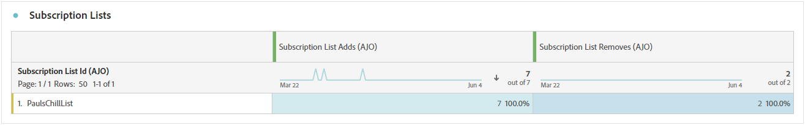
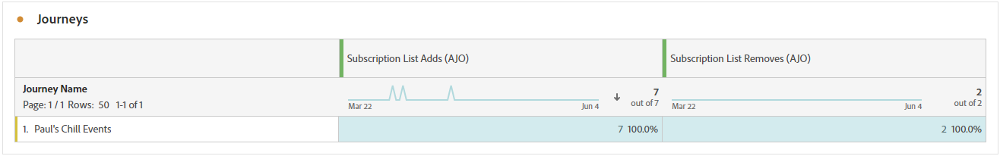

# Rapporto abbonamento {#subscription-report-global-cja}

Il **report abbonamenti** offre informazioni essenziali sugli abbonamenti e sugli annullamenti di abbonamenti dei profili associati a elenchi specifici, consentendoti di comprendere l&#39;efficacia delle diverse campagne e iniziative di abbonamento nel promuovere il coinvolgimento e le conversioni.

Per accedere ai tuoi report, fai clic sull&#39;icona **[!UICONTROL Report]** dell&#39;elenco di iscrizioni selezionato nel menu avanzato.

Per ulteriori informazioni sull&#39;area di lavoro di Customer Journey Analytics e su come filtrare e analizzare i dati, vedere [questa pagina](https://experienceleague.adobe.com/en/docs/analytics-platform/using/cja-workspace/home).

## Aggiunte all’elenco delle iscrizioni

L&#39;indicatore KPI **[!UICONTROL Aggiunte all&#39;elenco di sottoscrizioni]** fornisce una panoramica completa del numero totale di sottoscrizioni acquisite durante il periodo specificato. Questa metrica evidenzia la crescita e l’acquisizione di nuovi abbonati, offrendo informazioni utili sull’efficacia delle campagne o delle iniziative di abbonamento.

## L’elenco delle iscrizioni rimuove

L&#39;indicatore KPI **[!UICONTROL Rimuove l&#39;abbonamento]** fornisce un raggruppamento del numero totale di annullamenti di abbonamenti che si sono verificati durante il periodo specificato. Questa metrica offre informazioni preziose sul disimpegno degli abbonati.

## Crescita degli abbonamenti nel tempo

Il grafico **[!UICONTROL Crescita degli abbonamenti nel tempo]** mostra visivamente la progressione degli abbonamenti nel periodo specificato, fornendo una chiara comprensione dell&#39;evoluzione della base di abbonati.

* **[!UICONTROL Aggiunte all&#39;elenco iscrizioni]**: numero totale di iscrizioni per il periodo in questione.

* **[!UICONTROL L&#39;elenco iscrizioni rimuove]**: numero totale di annullamenti di abbonamenti per il periodo in questione.

* **[!UICONTROL Crescita dell&#39;elenco iscrizioni]**: velocità di crescita dell&#39;elenco iscrizioni in un periodo di tempo specifico.

## Elenchi di abbonamenti

La tabella **[!UICONTROL Elenchi di abbonamenti]** fornisce informazioni essenziali sulle sottoscrizioni e sugli annullamenti di abbonamenti dei profili associati a determinati elenchi di abbonamenti. Queste informazioni ti aiutano a comprendere l’efficacia delle diverse liste di abbonamento nel guidare il coinvolgimento e le conversioni.

* **[!UICONTROL Aggiunte all&#39;elenco iscrizioni]**: numero totale di iscrizioni per il periodo in questione.

* **[!UICONTROL L&#39;elenco iscrizioni rimuove]**: numero totale di annullamenti di abbonamenti per il periodo in questione.

## Percorsi

La tabella **[!UICONTROL Percorso]** offre una visualizzazione completa, con dettagli complessi degli abbonamenti dei visitatori come parte del percorso di utenti.

* **[!UICONTROL Aggiunte all&#39;elenco iscrizioni]**: numero totale di iscrizioni per il periodo in questione.

* **[!UICONTROL L&#39;elenco iscrizioni rimuove]**: numero totale di annullamenti di abbonamenti per il periodo in questione.

## Campagne

La tabella **[!UICONTROL Campagne]** offre informazioni utili sugli abbonamenti e sugli annullamenti di abbonamenti dei profili attivati da campagne specifiche. Questa visualizzazione completa ti consente di misurare l’efficacia delle campagne e monitorare il coinvolgimento con il contenuto della pagina di destinazione in modo efficace.

* **[!UICONTROL Aggiunte all&#39;elenco iscrizioni]**: numero totale di iscrizioni per il periodo in questione.

* **[!UICONTROL L&#39;elenco iscrizioni rimuove]**: numero totale di annullamenti di abbonamenti per il periodo in questione.

## Canale

Nella tabella **[!UICONTROL Canale]** viene visualizzato il numero di profili sottoscrizioni e annullamenti di abbonamenti suddivisi per canale.

* **[!UICONTROL Aggiunte all&#39;elenco iscrizioni]**: numero totale di iscrizioni per il periodo in questione.

* **[!UICONTROL L&#39;elenco iscrizioni rimuove]**: numero totale di annullamenti di abbonamenti per il periodo in questione.
