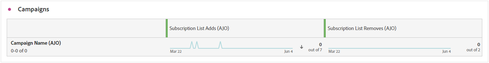

# Rapporto iscrizione {#subscription-report-global-cja}

Il **Rapporto abbonamento** offre informazioni essenziali sugli abbonamenti e i ritiri dei profili associati a elenchi specifici, utili per comprendere l’efficacia delle diverse campagne e iniziative di abbonamento nel promuovere il coinvolgimento e le conversioni.

Per accedere ai rapporti, fai clic su **[!UICONTROL Report]** dell&#39;elenco di iscrizioni selezionato dal menu avanzato.

Per ulteriori informazioni sull’area di lavoro di Customer Journey Analytics e su come filtrare e analizzare i dati, consulta [questa pagina](https://experienceleague.adobe.com/en/docs/analytics-platform/using/cja-workspace/home).

## Aggiunte all’elenco delle iscrizioni

Il **[!UICONTROL Aggiunte all’elenco delle iscrizioni]** KPI fornisce una panoramica completa del numero totale di sottoscrizioni acquisite durante il periodo specificato. Questa metrica evidenzia la crescita e l’acquisizione di nuovi abbonati, offrendo informazioni utili sull’efficacia delle campagne o delle iniziative di abbonamento.

## L’elenco delle iscrizioni rimuove

Il **[!UICONTROL L’elenco delle iscrizioni rimuove]** L&#39;indicatore KPI fornisce un raggruppamento del numero totale di annullamenti di abbonamenti che si sono verificati durante il periodo specificato. Questa metrica offre informazioni preziose sul disimpegno degli abbonati.

## Crescita degli abbonamenti nel tempo

Il **[!UICONTROL Crescita degli abbonamenti nel tempo]** graph illustra visivamente la progressione degli abbonamenti nel periodo specificato, fornendo una chiara comprensione dell’evoluzione della base di abbonati.

* **[!UICONTROL Aggiunte all’elenco delle iscrizioni]**: numero totale di abbonamenti per il periodo in questione.

* **[!UICONTROL L’elenco delle iscrizioni rimuove]**: numero totale di annullamenti di abbonamenti per il periodo in questione.

* **[!UICONTROL Crescita elenco iscrizioni]**: frequenza con cui l’elenco degli abbonati cresce in un determinato periodo di tempo.

## Elenchi di abbonamenti

Il **[!UICONTROL Elenchi di abbonamento]** Questa tabella fornisce informazioni essenziali sugli abbonamenti e sugli annullamenti di abbonamenti dei profili associati a determinati elenchi di abbonamenti. Queste informazioni ti aiutano a comprendere l’efficacia delle diverse liste di abbonamento nel guidare il coinvolgimento e le conversioni.

* **[!UICONTROL Aggiunte all’elenco delle iscrizioni]**: numero totale di abbonamenti per il periodo in questione.

* **[!UICONTROL L’elenco delle iscrizioni rimuove]**: numero totale di annullamenti di abbonamenti per il periodo in questione.

## Percorsi

Il **[!UICONTROL Percorso]** La tabella offre una vista completa, presentando dettagli complessi degli abbonamenti dei visitatori come parte del loro percorso di utenti.

* **[!UICONTROL Aggiunte all’elenco delle iscrizioni]**: numero totale di abbonamenti per il periodo in questione.

* **[!UICONTROL L’elenco delle iscrizioni rimuove]**: numero totale di annullamenti di abbonamenti per il periodo in questione.

## Campagne

Il **[!UICONTROL Campagne]** la tabella offre informazioni utili sugli abbonamenti e i loro annullamenti attivati da campagne specifiche. Questa visualizzazione completa ti consente di misurare l’efficacia delle campagne e monitorare il coinvolgimento con il contenuto della pagina di destinazione in modo efficace.

* **[!UICONTROL Aggiunte all’elenco delle iscrizioni]**: numero totale di abbonamenti per il periodo in questione.

* **[!UICONTROL L’elenco delle iscrizioni rimuove]**: numero totale di annullamenti di abbonamenti per il periodo in questione.

## Channel

Il **[!UICONTROL Canale]** Questa tabella mostra il numero di profili, sottoscrizioni e annullamenti di abbonamenti, suddivisi per canale.

* **[!UICONTROL Aggiunte all’elenco delle iscrizioni]**: numero totale di abbonamenti per il periodo in questione.

* **[!UICONTROL L’elenco delle iscrizioni rimuove]**: numero totale di annullamenti di abbonamenti per il periodo in questione.
