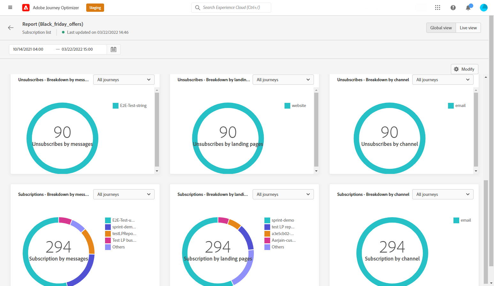

# Rapporto globale delle iscrizioni {#subscription-report-global}

>[!CONTEXTUALHELP]
>id="ajo_subscription_global_report"
>title="Rapporto globale delle iscrizioni"
>abstract="Il rapporto globale delle iscrizioni consente di misurare e visualizzare l’attività degli utenti iscritti in un periodo di tempo selezionato. Il rapporto è suddiviso in diversi widget che descrivono le iscrizioni e gli annullamenti delle iscrizioni. Ogni dashboard di reporting può essere modificata ridimensionando o spostando i widget."

I report globali, accessibili dalla scheda Tutto il tempo, visualizzano gli eventi che si sono verificati almeno due ore fa e coprono gli eventi relativi a un periodo di tempo selezionato. Al confronto, i rapporti live si concentrano sugli eventi che si sono verificati nelle ultime 24 ore, con un intervallo di tempo minimo di due minuti dall’occorrenza dell’evento.

Per accedere ai rapporti, fai clic su **[!UICONTROL Report]** dell&#39;elenco di iscrizioni selezionato.

La sottoscrizione **[!UICONTROL Rapporto globale]** è diviso in diversi widget che descrivono nel dettaglio gli abbonamenti e i loro annullamenti. Ogni widget può essere ridimensionato ed eliminato, se necessario. Per ulteriori informazioni, consulta questa [sezione](global-report.md).

Il **[!UICONTROL Prestazioni abbonamento]** KPI e **[!UICONTROL Iscrizioni per percorso]**/**[!UICONTROL Annulla iscrizione per percorso]** le tabelle descrivono le informazioni principali relative al coinvolgimento dei visitatori con la pagina di destinazione. Le tabelle e i KPI contengono i dati disponibili relativi alla pagina di destinazione, ad esempio:

* **[!UICONTROL Abbonamenti]**: numero totale di abbonamenti per il periodo in questione.

* **[!UICONTROL Annulla iscrizione]**: numero totale di annullamenti di abbonamenti per il periodo in questione.

Il **[!UICONTROL Prestazioni abbonamento]** Il grafico mostra l’evoluzione degli abbonamenti per il periodo in questione.

Il **Iscrizioni - Raggruppamento** e **Annullamenti iscrizione - Raggruppamento** rappresenta il numero totale di persone che hanno effettuato o annullato l’abbonamento nel periodo di tempo selezionato, a seconda dei messaggi, delle pagine di destinazione e dei canali.
