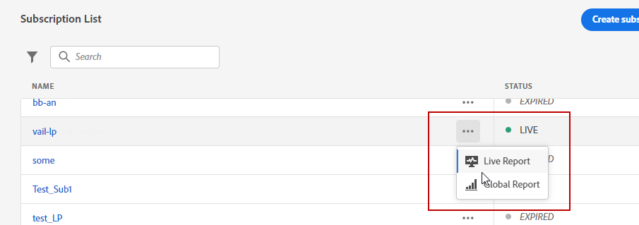

# Rapporto live abbonamento {#subscription-report-live}

L’abbonamento **[!UICONTROL Live report]** visualizza i dettagli sull’attività degli abbonati solo nelle ultime 24 ore. Per misurare gli abbonamenti in un periodo di tempo selezionato, consulta [Rapporto globale sottoscrizione](subscription-report-global.md).

Per accedere ai rapporti, seleziona **[!UICONTROL Live report]** dal menu avanzato dell’elenco di sottoscrizioni selezionato.

L’abbonamento **[!UICONTROL Live report]** è suddiviso in diversi widget che descrivono in dettaglio i tuoi abbonamenti e annullamenti degli abbonamenti. Se necessario, ogni widget può essere ridimensionato ed eliminato. Per ulteriori informazioni su questo consulta [sezione](live-report.md).

La **[!UICONTROL Subscription performance]** KPI e **[!UICONTROL Subscriptions by journey]**/**[!UICONTROL Unsubscribes by journey]** Le tabelle descrivono nel dettaglio le informazioni principali relative al coinvolgimento dei visitatori con la pagina di destinazione. Le tabelle e i KPI contengono i dati disponibili relativi alla pagina di destinazione, ad esempio:

* **[!UICONTROL Subscribes]**: Numero totale di abbonamenti nelle ultime 24 ore.

* **[!UICONTROL Unsubscribes]**: Numero totale di annullamenti di abbonamenti nelle ultime 24 ore.

La **[!UICONTROL Subscription performance]** Il grafico mostra l’evoluzione degli abbonamenti nelle ultime 24 ore.

La **Abbonamenti - Suddivisione** e **Annulla sottoscrizioni - Suddivisione** i grafici rappresentano il numero totale di persone che hanno effettuato o annullato l’abbonamento nelle ultime 24 ore a seconda dei messaggi, delle pagine di destinazione e dei canali.
