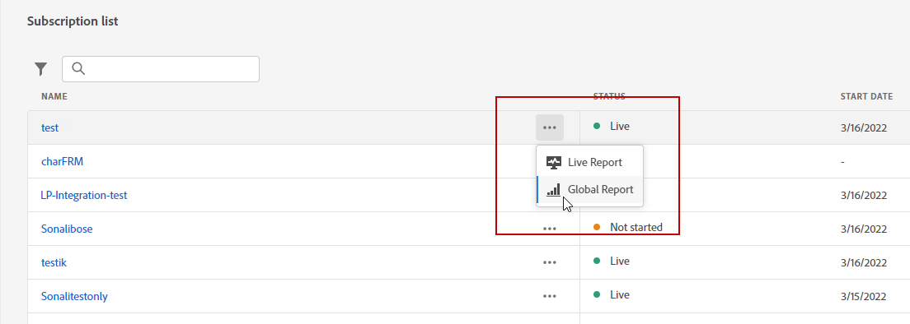

# Rapporto live delle iscrizioni {#subscription-report-live}

>[!BEGINSHADEBOX]

**In questa pagina:** scopri come utilizzare il report live degli abbonamenti per monitorare gli abbonamenti e i loro annullamenti in tempo reale nelle ultime 24 ore.

>[!ENDSHADEBOX]

>[!CONTEXTUALHELP]
>id="ajo_subscription_live_report"
>title="Rapporto live delle iscrizioni"
>abstract="Il rapporto live delle iscrizioni consente di misurare e visualizzare in tempo reale l’attività degli utenti iscritti solo nelle ultime 24 ore. Il rapporto è suddiviso in diversi widget che descrivono le iscrizioni e gli annullamenti delle iscrizioni. Ogni dashboard di reporting può essere modificata ridimensionando o rimuovendo i widget."

I rapporti live, accessibili dalla scheda Ultime 24 ore, visualizzano gli eventi che si sono verificati nelle ultime 24 ore, con un intervallo di tempo minimo di due minuti dall’occorrenza dell’evento. Al confronto, i rapporti di Customer Journey Analytics si concentrano sugli eventi che si sono verificati almeno due ore fa e coprono gli eventi in un periodo di tempo selezionato.

Per accedere ai tuoi report, fai clic sull&#39;icona **[!UICONTROL Report]** dell&#39;elenco di iscrizioni selezionato.

L&#39;abbonamento **[!UICONTROL Live Report]** è suddiviso in diversi widget che descrivono gli abbonamenti e i loro annullamenti. Ogni widget può essere ridimensionato ed eliminato, se necessario. Per ulteriori informazioni, consulta questa [sezione](live-report.md).

Le tabelle dei KPI **[!UICONTROL Prestazioni abbonamento]** e **[!UICONTROL Abbonamenti per percorso]**/**[!UICONTROL Annullamenti abbonamenti per percorso]** contengono informazioni dettagliate sulle informazioni principali relative al coinvolgimento dei visitatori con la pagina di destinazione. Le tabelle e i KPI contengono i dati disponibili relativi alla pagina di destinazione, ad esempio:

* **[!UICONTROL Abbonamenti]**: numero totale di abbonamenti nelle ultime 24 ore.

* **[!UICONTROL Annullamenti abbonamenti]**: numero totale di annullamenti di abbonamenti nelle ultime 24 ore.

Il grafico **[!UICONTROL Prestazioni abbonamento]** mostra l&#39;evoluzione degli abbonamenti nelle ultime 24 ore.

I grafici **Abbonamenti - Raggruppamento** e **Annullamenti abbonamenti - Raggruppamento** rappresentano il numero totale di persone che hanno effettuato o annullato l&#39;abbonamento nelle ultime 24 ore, a seconda dei messaggi, delle pagine di destinazione e dei canali.
