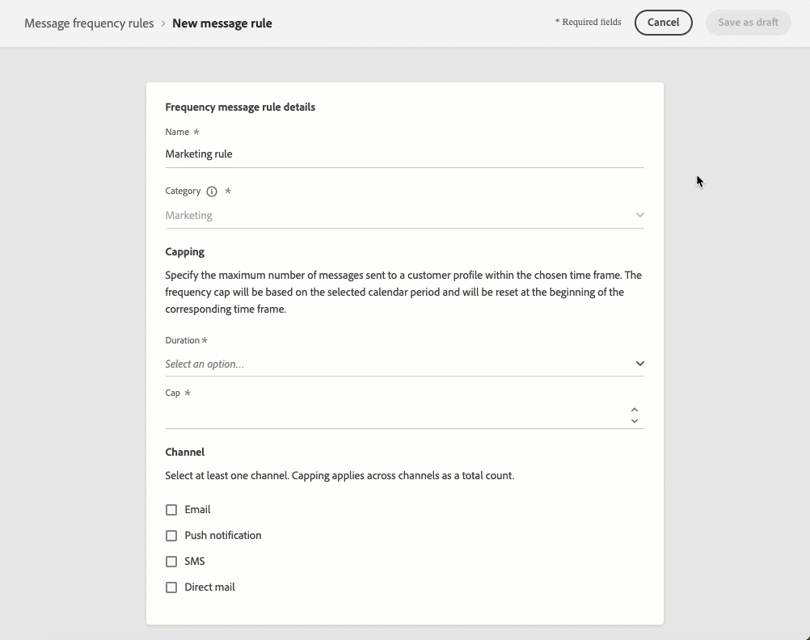

# Note preliminari sulla versione {#e-release-notes}

[!DNL Adobe Journey Optimizer] offre continuamente nuove funzioni, miglioramenti alle funzioni esistenti e correzioni di bug. Nell’ultima settimana di ogni mese, tutte le modifiche vengono consolidate nelle [note sulla versione](release-notes.md).

Le note preliminari sulla versione riportate di seguito sono soggette a modifiche senza preavviso fino alla data di disponibilità della versione. I collegamenti, le schermate e la documentazione aggiornata vengono pubblicati nelle [note sulla versione](release-notes.md), alla data di rilascio.

## Note preliminari sulla versione di febbraio 2024 {#e-2024}

**Data di rilascio**: 21-22 febbraio 2024

### Nuove funzionalità{#e-features}

Questa versione include le nuove funzionalità elencate di seguito.

<table>
<thead>
<tr>
<th><strong>Messaggistica Web in-app</strong> </th>
</tr>
</thead>
<tbody>
<tr>
<td>

Ora puoi utilizzare la nuova funzionalità di messaggistica Web in-app per visualizzare contenuti personalizzati direttamente sui siti web tramite messaggi di sovrapposizione modale. Questa funzione consente di interagire in modo efficace con i visitatori web, migliorando l’interazione, la fidelizzazione e i tassi di conversione degli utenti.  

</tr>
</tbody>
</table>

<table>
<thead>
<tr>
<th><strong>Regole di frequenza per SMS e direct mailing</strong> </th>
</tr>
</thead>
<tbody>
<tr>
<td>

Ora puoi creare regole di frequenza per i canali SMS e Direct Mail. Le regole di frequenza escludono automaticamente i profili sollecitati eccessivamente dai messaggi e dalle azioni quando viene raggiunto il limite di frequenza.   

</tr>
</tbody>
</table>

### Miglioramenti {#e-improvements}

Questa versione include i miglioramenti elencati di seguito.

**Tipi di pubblico**

* **Elenchi seed** - Le varianti sono ora supportate quando si utilizza **elenchi seed**. Come ogni profilo del pubblico di destinazione, gli indirizzi di seed ricevono una copia di tutte le varianti dello stesso messaggio (come i diversi trattamenti di un esperimento di contenuto).

Precedentemente disponibili come versione beta, i seguenti miglioramenti sono ora disponibili per tutti gli utenti:

* Ora puoi eseguire il targeting **tipi di pubblico creati tramite la composizione del pubblico** e sfruttano gli attributi di arricchimento nei Percorsi. [Ulteriori informazioni](../building-journeys/read-audience.md)

* Ora puoi eseguire il targeting **pubblico caricato da un file CSV** in percorsi e campagne. [Ulteriori informazioni](../audience/about-audiences.md#segments-in-journey-optimizer)

  >[!AVAILABILITY]
  >
  >* L’utilizzo di tipi di pubblico e attributi dalla composizione del pubblico e dal caricamento personalizzato (file CSV) non è attualmente disponibile per l’utilizzo con Healthcare Shield o Privacy and Security Shield.
  >* Tieni presente che il caricamento del pubblico da un file CSV verrà introdotto gradualmente nel corso di alcuni giorni dopo la versione iniziale. Alcuni utenti avranno accesso immediato, altri potrebbero notare un ritardo prima che questo diventi disponibile nei loro account.

**Percorsi**

* **Filtrare i percorsi** - È ora possibile utilizzare **date personalizzate per filtrare i percorsi** magazzino, oltre ai filtri di data predefiniti esistenti. Questo consente di perfezionare l’elenco visualizzando i percorsi creati o pubblicati in una data specifica, all’interno di un mese specifico, durante un anno intero o entro intervalli di tempo specifici.
* **Azioni personalizzate** - È ora possibile aggiornare **content-type** intestazione. Questo nuovo **content-type** deve fare riferimento al contenuto JSON.
* **Configurazione** : l’attributo identityMap in stepEvents ora è precompilato. L’identità primaria è definita come &quot;primary = true&quot;.
* **Interfaccia utente** - La barra superiore, nelle schermate di percorso, è stata riorganizzata per offrire un’esperienza migliore. Tra i diversi aggiornamenti, l’icona &quot;matita&quot; che consente di accedere alle proprietà del percorso è ora visualizzata a sinistra della barra superiore, accanto al nome del percorso.

**Canale SMS**

* **Parole chiave di consenso/rinuncia** - Durante la configurazione del canale SMS, ora puoi personalizzare la **Parole chiave di consenso e rinuncia** in base alle tue preferenze. Journey Optimizer attiva la risposta in base a queste parole chiave specificate.

**Campagne**

* **Campagne attivate da API** : è stato migliorato il codice cURL generato dopo l’attivazione di una campagna attivata da API. Ora include tutte le variabili di personalizzazione (profilo e contesto) utilizzate nel messaggio.

**Gestione delle decisioni**

* **Regole di limitazione** - È ora possibile aggiungere **più regole di limite** per un&#39;offerta. Ciò ti consente di aumentare il livello di controllo sulla modalità di invio delle offerte.

**Modelli di contenuto**

* **Miniatura** - A **visualizzazione miniature** è ora disponibile per modelli di contenuto e frammenti per migliorare l’accesso visivo.

  >[!AVAILABILITY]
  >
  >Questa funzionalità viene rilasciata in Disponibilità limitata (LA) per un piccolo gruppo di clienti.

* **Modelli multicanale** - I modelli di contenuto sono ora disponibili per **tutti i canali**, ad eccezione del Web. Per E-mail, ora puoi selezionare il tipo (HTML o Contenuto).
