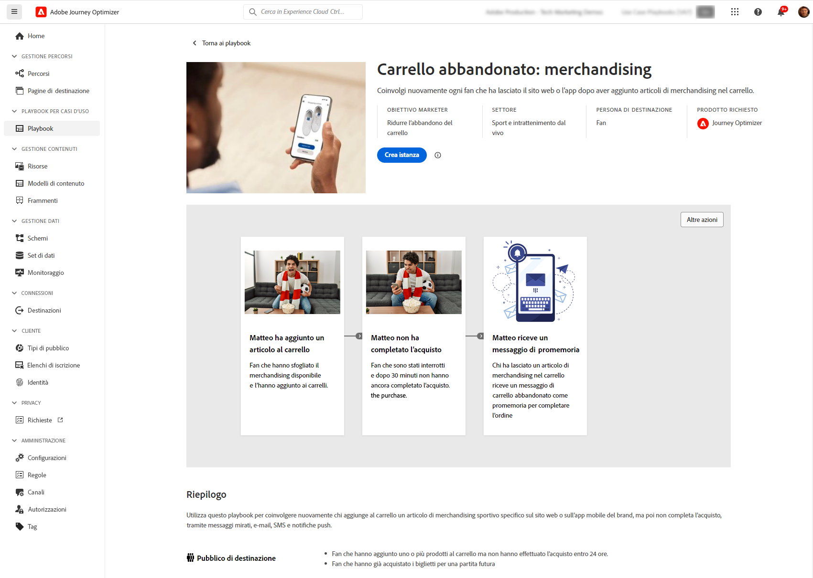

# Note preliminari sulla versione {#e-release-notes}

[!DNL Adobe Journey Optimizer] offre continuamente nuove funzioni, miglioramenti alle funzioni esistenti e correzioni di bug. Nell’ultima settimana di ogni mese, tutte le modifiche vengono consolidate nelle [note sulla versione](release-notes.md).

Le note preliminari sulla versione riportate di seguito sono soggette a modifiche senza preavviso fino alla data di disponibilità della versione. I collegamenti, le schermate e la documentazione aggiornata vengono pubblicati nelle [note sulla versione](release-notes.md), alla data di rilascio.

## Note preliminari sulla versione di gennaio 2024 {#oct-jan-2024}

**Data di rilascio**: 30-31 gennaio 2024

### Nuove funzionalità{#jan-2024-features}

Questa versione include le nuove funzionalità elencate di seguito.

<table>
<thead>
<tr>
<th><strong>Aggiornamenti del recapito messaggi</strong> </th>
</tr>
</thead>
<tbody>
<tr>
<td>

Journey Optimizer ora supporta la tecnologia di autenticazione DMARC.

A partire dal 1° febbraio 2024, Google e Yahoo! ti verrà richiesto di disporre di un record DMARC per qualsiasi dominio utilizzato per inviare loro e-mail. Assicurati di aver impostato il record DMARC per tutti i sottodomini che hai delegato o a cui stai delegando l’Adobe in Journey Optimizer.

Per ulteriori informazioni, consulta la <a href="../configuration/dmarc-record-update.md">documentazione dettagliata</a>.

</tr>
</tbody>
</table>

<table>
<thead>
<tr>
<th><strong>Playbook di casi d’uso</strong> </th>
</tr>
</thead>
<tbody>
<tr>
<td>

Sfrutta un catalogo di playbook di casi d’uso specifici per il settore in Real-Time CDP e Journey Optimizer per risolvere casi d’uso comuni che è possibile eseguire utilizzando Adobe Experience Platform e Adobe Percorsi Optimizer.

Dopo aver scelto il playbook più adatto alle tue esigenze, puoi abilitarlo per generare le risorse necessarie per supportare il caso d’uso, ad esempio percorsi, messaggi, schemi o segmenti, e personalizzarli nel tuo schema per velocizzare il time-to-value.

<!--
For more information, refer to the <a href="../start/">detailed documentation</a>.
-->
</tr>
</tbody>
</table>

### Miglioramenti {#jan-2024-improvements}

Questa versione include i miglioramenti elencati di seguito.

**Reporting**

* **Nuovi widget di suddivisione basati su dominio** - Sono stati aggiunti nuovi widget per migliorare i rapporti Campagna e Percorso. Il **Motivi di mancato recapito per dominio**, **Inviato e consegnato da domini**, **Aperture e clic per dominio** e **Mancato recapito ed errori per dominio** i widget forniscono una suddivisione dettagliata a livello di dominio per le metriche chiave di consegna e tracciamento delle e-mail.

**Canale SMS**

* **Doppio consenso** - Il flusso di lavoro Double Opt-In per SMS garantisce che gli utenti acconsentano esplicitamente alla ricezione di messaggi quando la richiesta viene avviata dal proprio dispositivo. Gli utenti avviano il processo di consenso inviando un messaggio SMS in entrata. Una volta confermato il loro consenso, viene inviato un messaggio di follow-up con la richiesta di verifica finale. Se un profilo utente non esiste, viene creato dopo la conferma.

  Tieni presente che questo si applica solo ai provider SMS Sinch e Infobip.

**Percorsi**

* **Durata eventi di reazione** : la durata massima che puoi definire nel **Eventi di reazione** è ora di 29 giorni invece di 30.

* **Filtri per data** - È ora possibile utilizzare date personalizzate per filtrare l’inventario dei percorsi, oltre ai filtri di data predefiniti esistenti. Questo consente di perfezionare l’elenco visualizzando percorsi pubblicati in una data specifica, all’interno di un mese specifico, durante un anno intero o entro intervalli di tempo specifici.

* **Read audience**  : l’attività Read Audience ora si basa sul set di dati snapshot del profilo per i segmenti batch, che viene generato solo una volta al giorno dopo l’esecuzione del processo batch giornaliero pianificato.

**Regole di frequenza**

* **Limite di frequenza settimanale e giornaliero** - È ora possibile specificare il numero massimo di messaggi inviati a un profilo cliente in una settimana o in un giorno, oltre al mese. Il limite di frequenza si basa sul periodo di calendario selezionato e viene reimpostato all’inizio dell’intervallo di tempo corrispondente.

**Gestione delle decisioni**

* **Limitazione di frequenza su Edge** - Il contatore dei limiti di frequenza ora è aggiornato e disponibile in una decisione API Edge Decisioning in meno di 3 secondi.