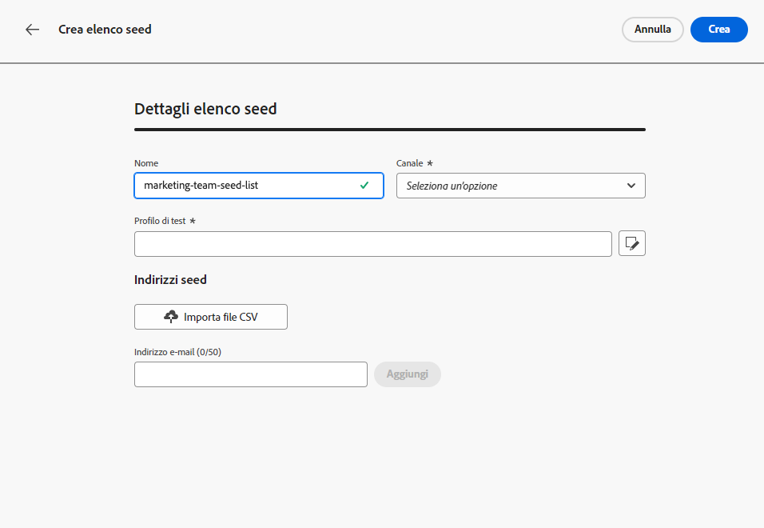

# Note preliminari sulla versione {#e-release-notes}

[!DNL Adobe Journey Optimizer] offre continuamente nuove funzioni, miglioramenti alle funzioni esistenti e correzioni di bug. Nell’ultima settimana di ogni mese, tutte le modifiche vengono consolidate nelle [note sulla versione](release-notes.md).

Le note preliminari sulla versione riportate di seguito sono soggette a modifiche senza preavviso fino alla data di disponibilità della versione. I collegamenti, le schermate e la documentazione aggiornata vengono pubblicati nelle [note sulla versione](release-notes.md), alla data di rilascio.

## Note preliminari sulla versione di agosto 2023 {#aug-rn-2023}

**Data di rilascio**: 23-24 agosto 2023

### Nuove funzionalità{#aug-2023-features}

Questa versione include le nuove funzionalità elencate di seguito.

<table>
<thead>
<tr>
<th><strong>Inviare messaggi in-app nei percorsi</strong> </th>
</tr>
</thead>
<tbody>
<tr>
<td>

Ora puoi inviare messaggi in-app personalizzati agli utenti della tua app in un percorso. Utilizza Journey Optimizer per progettare notifiche e personalizzare il layout, la visualizzazione, il testo e i pulsanti del messaggio per creare un’esperienza semplice.

Per ulteriori informazioni, consulta la <a href="../in-app/get-started-in-app.md">documentazione dettagliata</a>.

</tr>
</tbody>
</table>

<table>
<thead>
<tr>
<th><strong>Convalidare le e-mail con elenchi di seed</strong> </th>
</tr>
</thead>
<tbody>
<tr>
<td>

Ora puoi creare e gestire gli elenchi di seed in Journey Optimizer. Un elenco di seed è costituito da indirizzi e-mail di test a cui invii un’e-mail prima di inviarla al pubblico effettivo. Utilizza questa funzionalità per monitorare le copie e-mail inviate e verificare che tutti i formati di visualizzazione, gli URL, le immagini e i collegamenti siano corretti.

<!--p>For more information, refer to the <a href="../audience/get-started-audience-orchestration.md">detailed documentation</a>.</p-->
</td>
</tr>
</tbody>
</table>

<table>
<thead>
<tr>
<th><strong>Generare testo e immagini con l'Assistente contenuto</strong> </th>
</tr>
</thead>
<tbody>
<tr>
<td>

Dopo aver creato e personalizzato il messaggio, porta il contenuto al livello successivo con l’Assistente contenuti. Ora puoi utilizzare l’Assistente contenuto per ottimizzare l’impatto del messaggio sperimentando diversi titoli principali e immagini. Ogni variante viene gestita come un trattamento univoco, per misurare e confrontare quale titolo genera effettivamente più clic.

Questa funzionalità è attualmente disponibile come versione beta privata.

<!--p>For more information, refer to the <a href="../start/search-filter-categorize.md#tags">detailed documentation</a>.</p-->
</td>
</tr>
</tbody>
</table>

### Miglioramenti {#aug-2023-improvements}

Questa versione include i miglioramenti elencati di seguito.

**API**

È ora disponibile una nuova API per creare e gestire Frammenti di contenuto. [Ulteriori informazioni](https://developer.adobe.com/journey-optimizer-apis/references/content-templates/#tag/Content-fragment-API){target="_blank"}.

**Canale e-mail**

* Una nuova opzione è disponibile nelle impostazioni della superficie e-mail per includere gli indirizzi e-mail soppressi a causa di un reclamo spam nei tipi di pubblico dei messaggi transazionali. Anche se hanno contrassegnato i messaggi di marketing come spam, questi profili possono quindi ricevere messaggi transazionali, come reimpostazione della password o istruzioni dell’account. Questa opzione è disabilitata per impostazione predefinita.

**Percorsi**

* Ora puoi sfruttare le risposte alle chiamate API nelle azioni personalizzate e orchestrare il percorso in base a tali risposte. Questa funzione è attualmente disponibile come versione beta privata.
* È stato introdotto un nuovo tipo di avviso di sistema. Ora puoi ricevere una notifica quando un’azione personalizzata non viene completata.
* Durante la duplicazione di un percorso, è ora possibile definire il nome della copia del percorso.

**Direct mail**

* Supporta Azure Blob come destinazione di routing.
* Supporto `&` come separatore personalizzato.