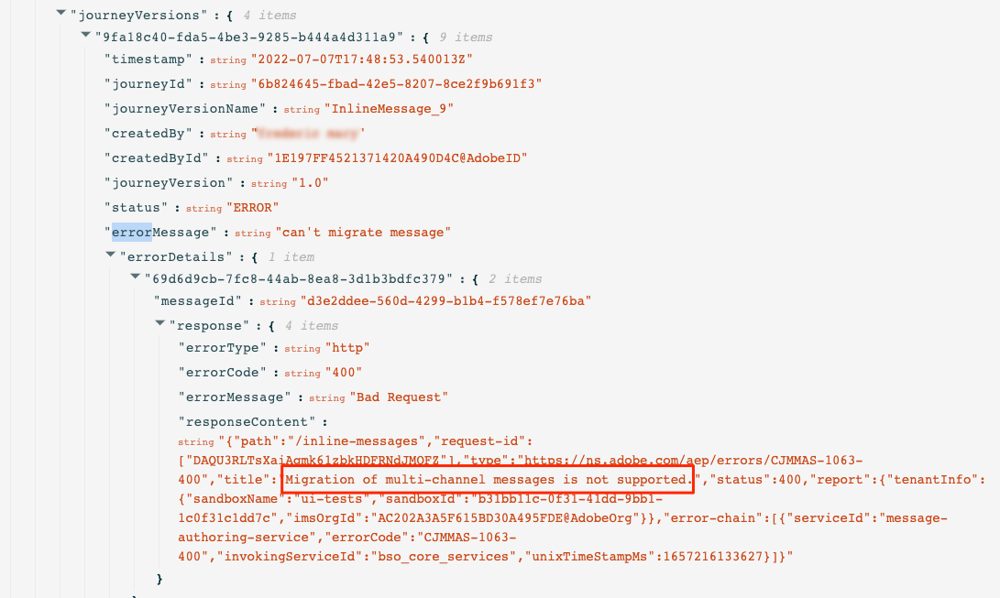

# Passaggi per la migrazione dell’authoring in linea{#migration-steps}

Il nuovo processo di creazione dei messaggi in Adobe Journey Optimizer è descritto in questo [page](../rn/inline-messages.md). Verrà eseguita automaticamente una conversione automatica dei percorsi. Detto questo, avremo bisogno del vostro aiuto con alcuni passi.

>[!VIDEO](https://video.tv.adobe.com/v/344699)

Ecco le fasi principali e le fasi:

**[Prima della migrazione](../rn/inline-messages-steps.md#migration-step-1)**

1. Sulle sandbox non di produzione, arresta tutti i percorsi live e chiusi. [Ulteriori informazioni](../rn/inline-messages-steps.md#migration-step-1-1)
1. Sulla sandbox di produzione, arresta tutti i percorsi live ad-hoc senza profilo ancora in. [Ulteriori informazioni](../rn/inline-messages-steps.md#migration-step-1-2)

**[Dopo la prima iterazione](../rn/inline-messages-steps.md#migration-step-2)**

1. Controlla eventuali errori nei percorsi live migrati. [Ulteriori informazioni](../rn/inline-messages-steps.md#migration-step-2-1)
1. Elenca tutte le nuove versioni create dalla migrazione. [Ulteriori informazioni](../rn/inline-messages-steps.md#migration-step-2-2)
1. Testali e pubblicali uno per uno. [Ulteriori informazioni](../rn/inline-messages-steps.md#migration-step-2-3)
1. Elenca tutte le versioni live. [Ulteriori informazioni](../rn/inline-messages-steps.md#migration-step-2-4)
1. Osserva gli errori durante la migrazione della versione bozza. [Ulteriori informazioni](../rn/inline-messages-steps.md#migration-step-2-5)

**[Dopo la seconda iterazione](../rn/inline-messages-steps.md#migration-step-3)**

1. Controlla entrambe le fasi di migrazione. [Ulteriori informazioni](../rn/inline-messages-steps.md#migration-step-3-1)
1. Arresta le versioni precedenti. [Ulteriori informazioni](../rn/inline-messages-steps.md#migration-step-3-2)

**[Prima della terza e dell’ultima iterazione](../rn/inline-messages-steps.md#migration-step-4)**

Convalida che tutto sia stato migrato prima della deprecazione.

  

## Prima della migrazione (25 luglio){#migration-step-1}

### 1. Interrompi tutti i percorsi live e chiusi{#migration-step-1-1}

On **sandbox non di produzione** Fermate tutti i percorsi in diretta e chiusi. Questo consentirà al processo di migrazione automatizzata di migrare tutti i percorsi da queste sandbox senza alcuna azione da parte tua. Dopo la migrazione, potrai duplicare le versioni del percorso interrotto e utilizzarle.

### 2. Interrompi tutti i percorsi ad hoc live senza profilo ancora in{#migration-step-1-2}

Sulla **sandbox di produzione**, interrompi tutti i percorsi ad hoc live che non contengono più profili.

+++Come trovare questi percorsi?

Per trovare questi percorsi, passa alla **Percorsi** e filtra l’elenco in &quot;Status = Live&quot; e &quot;Type = Read segment&quot;. Puoi anche ordinare in ordine cronologico dalla prima alla più recente data &quot;Pubblicato&quot;.

Aprile dall&#39;alto verso il basso.

* Verifica che il percorso abbia un messaggio.
* Verifica che non siano percorsi ricorrenti. Non sono ad hoc. Molto probabilmente volete tenerli in vita. Ad esempio, questo è un percorso ricorrente (non ad hoc):

   

* Se in tali percorsi sono stati utilizzati listener di eventi o di attesa, i profili potrebbero trovarsi ancora all’interno. Osserva la data di esecuzione del percorso e aggiungi tutte le ore/giorni definite nelle attese o negli ascoltatori di eventi per determinare la data effettiva in cui nessun profilo viene lasciato all’interno. Se quella data è passata, puoi interrompere il percorso. In caso contrario, questo percorso verrà spostato automaticamente allo stato &quot;Completato&quot; 30 giorni dopo la data di esecuzione del percorso.

+++

**Note importanti**

* Evita di chiudere percorsi prima della data di migrazione (25 luglio). Sapendo che lo script di migrazione non migrerà percorsi live o chiusi, limitare il numero di percorsi chiusi nella sandbox di produzione limiterà il numero di azioni manuali necessarie dopo la migrazione.

* Se disponi di percorsi live che non sono la versione più recente, ovvero hai creato un’altra versione di percorso in bozza, pubblicala o eliminala.

* Se hai dei messaggi che non vengono utilizzati nei percorsi e che desideri mantenere, salvali come modelli. Potrai comunque accedervi fino a quando non diventerà obsoleto.

## Dopo la prima iterazione della migrazione (25 luglio){#migration-step-2}

La migrazione viene eseguita in due fasi: la fase automatizzata (notturna, tra il 25 luglio e il 26 luglio) e la fase manuale (a partire dal 26 luglio) che richiede interventi.

Per la fase automatizzata, consulta [page](../rn/inline-messages.md#process).

Per la fase manuale, ecco le azioni da eseguire sul **sandbox di produzione**:

<!--
_On non-production sandboxes:_

**1. Check the migration status report for any error**

Click the **Check status** button in the top banner and check that there has been no error during the automatic migration and that there is nothing left to migrate. 

Look for the "ERROR" status. 

* If there is no error, you are good to go.
* If there are errors, look for the error by searching "errorMessage". The following error is expected as migration of multi-channel messages is not supported: "Migration of multi-channel messages is not supported". You will have to rebuild this journey.

    

_On the production sandbox:_

-->

### 1. Controlla eventuali errori sui Percorsi live migrati{#migration-step-2-1}

Controlla eventuali errori nei percorsi live migrati automaticamente nel rapporto sullo stato.

Cerca &quot;ERROR_NEW_VERSION_CREATION&quot;:

* Se non si verifica alcun errore, significa che tutte le versioni live del percorso che richiedono la migrazione sono state elaborate e che è stata creata automaticamente una nuova versione di bozza migrata.

* Se viene visualizzato un errore, è possibile cercare &quot;errorMessage&quot; e controllare il messaggio di errore nei log. La migrazione dei messaggi multicanale non viene eseguita. Dovrai creare un altro percorso.

* Per altri errori, contatta il tuo CSM o un rappresentante di Adobe per ricevere assistenza.

### 2. Elenca tutte le nuove versioni create dalla migrazione{#migration-step-2-2}

Sono contrassegnati come [MIGRAZIONE] nell’etichetta del percorso e la data di creazione viene aggiornata.

### 3. Test e pubblicazione uno per uno{#migration-step-2-3}

Assicurati che il percorso debba ancora essere eseguito in produzione. Se la [preparazione prima della migrazione](../rn/inline-messages-steps.md#migration-step-1) non è stato eseguito correttamente. È possibile che sia stata creata una nuova versione per un percorso a scatto che non è più necessario.

Verifica la versione bozza del percorso che ora contiene azioni del canale in linea.

Pubblica la nuova versione del percorso. La versione precedente verrà spostata nello stato &quot;Chiuso&quot;.

### 4. Elenca tutte le versioni live{#migration-step-2-4}

Devono essere tutti contrassegnati come più recenti. in caso contrario, cerca la versione più recente, eseguine il test e pubblicala.

### 5. Osserva gli errori nella migrazione della versione di bozza{#migration-step-2-5}

Fai clic sul pulsante **Stato del controllo** nel banner superiore e verifica che non vi sia stato alcun errore durante la migrazione automatica e che non sia rimasto nulla da migrare. Qualsiasi percorso di errore (con messaggi) verrà dichiarato obsoleto dopo il 5 settembre (su tutte le sandbox).

Cercare lo stato &quot;ERROR&quot;.

* Se non c&#39;è nessun errore, è bene andare.

* Se ci sono errori, cerca l&#39;errore ricercando &quot;errorMessage&quot;. È previsto il seguente errore perché la migrazione dei messaggi multicanale non è supportata: &quot;La migrazione dei messaggi multicanale non è supportata&quot;. Dovrai ricostruire questo percorso.

## Dopo la seconda iterazione (1 agosto){#migration-step-3}

La seconda iterazione verrà eseguita di notte tra il 1° agosto e il 2 agosto.

<!--
_On non-production sandboxes:_

**1. Check at the status report**

Click the **Check status** button in the top banner and check that all journeys have been migrated and there's nothing left to migrate. If there is an error or something left to migrate, please reach out to your CSM or Adobe representative for guidance.

-->

Se tutti i passaggi precedenti sono stati eseguiti in tempo, tutti i percorsi sono stati migrati, ad eccezione di quelli chiusi e di quelli con errori. Di seguito sono riportati i passaggi da seguire per **sandbox di produzione**:

### 1. Controllare entrambe le fasi di migrazione{#migration-step-3-1}

Se non ci sono errori, non dovresti avere percorsi in &quot;allowstatus&quot;, in &quot;toMigrate&quot; e &quot;createNewVersion&quot;. Nell&#39;esempio seguente, sono presenti un &quot;ERROR&quot; e un &quot;ERROR_NEW_VERSION_CREATION&quot;.

### 2. Arresta le versioni precedenti{#migration-step-3-2}

Se non hai pubblicato versioni di percorso più recenti (consulta questo [sezione](../rn/inline-messages-steps.md#migration-step-2-3)) nel tempo che significa prima dell’iterazione 2 (1 agosto), quindi pubblica la versione più recente e **interrompi la versione precedente o la perderai** e i relativi rapporti.

## Prima della terza e ultima iterazione (5 settembre){#migration-step-4}

Tra il 1° agosto e il 5 settembre, dovrai verificare che sia stata effettuata la migrazione di tutto e che non siano rimasti percorsi che utilizzano ancora i messaggi, altrimenti saranno dichiarati obsoleti il 5 settembre.

