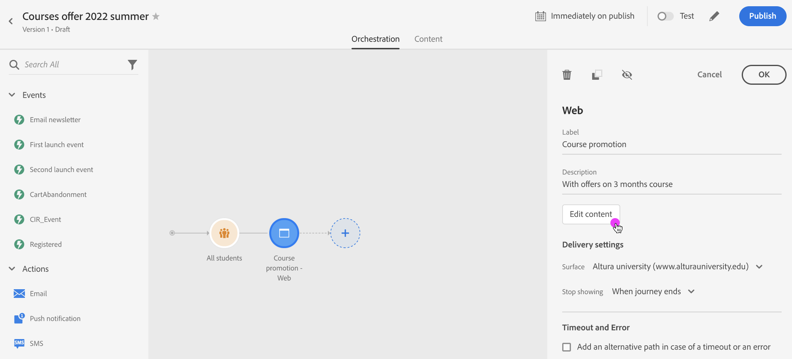

# Migrazione all’authoring in linea di percorso{#inline-authoring}

>[!CONTEXTUALHELP]
>id="ajo_messages_migration_before"
>title="Ulteriori informazioni sul nuovo messaggio di authoring in linea"
>abstract="A partire dalla versione di Journey Optimizer del 22 luglio, i messaggi vengono creati direttamente da un Percorso. I messaggi esistenti vengono automaticamente migrati al nuovo modello. Dopo la migrazione saranno necessarie ulteriori azioni."

>[!CONTEXTUALHELP]
>id="ajo_messages_migration_during"
>title="Scopri cosa sta succedendo"
>abstract="A partire dalla versione di Journey Optimizer del 22 luglio, i messaggi vengono creati direttamente da un Percorso. Migrazione dell&#39;ambiente in corso. Dopo la migrazione saranno necessarie ulteriori azioni."

>[!CONTEXTUALHELP]
>id="ajo_messages_migration_after"
>title="Scopri come eseguire la migrazione dei messaggi"
>abstract="A partire dalla versione di Journey Optimizer del 22 luglio, i messaggi vengono creati direttamente da un Percorso. I messaggi esistenti sono stati ora migrati al nuovo modello. In qualità di professionista del percorso, ora sono necessarie ulteriori azioni."

>[!CONTEXTUALHELP]
>id="ajo_messages_depecrated_inventory"
>title="Scopri come eseguire la migrazione dei messaggi"
>abstract="A partire dal 25 luglio 2022, il menu Messaggi scompare e i messaggi vengono creati direttamente da un Percorso. Per riutilizzare i messaggi legacy nei percorsi, è necessario salvarli come modelli."
>additional-url="https://experienceleague.adobe.com/docs/journey-optimizer/using/design/email-templates.html#save-as-template" text="Salvare i messaggi come modelli"

Adobe Journey Optimizer sta rilasciando una nuova funzione che migliora il modo in cui i professionisti creano esperienze per canali Journey Optimizer consegnati come e-mail, push, SMS. Questa funzione richiede una migrazione dei Percorsi esistenti che utilizzano i messaggi.

In qualità di professionista del percorso, ora puoi creare e creare i messaggi direttamente da un Percorso.

Le principali modifiche nell’interfaccia utente sono:

* L&#39;azione percorso è 1:1 con il messaggio
* Il componente Messaggio nella barra a sinistra di Journey Optimizer non è più disponibile. I messaggi vengono creati come azioni.
* Non esiste una libreria di messaggi separata: il percorso ora centralizza tutti i componenti

