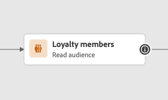

# Progettazione Percorsi migliorata {#new-canvas}

Journey Optimizer ora offre **modello di percorso semplificato** che mira a migliorare i processi interni. Anche se questo nuovo modello rappresenta un miglioramento di back-end, il nostro team ha colto l’opportunità per aggiungere funzionalità visibili e vantaggiose per gli utenti di Journey Optimizer:

* A **area di lavoro percorso riprogettata** progettato per un’esperienza di interfaccia utente moderna
* A **reportistica live** Interfaccia utente direttamente disponibile nell’area di lavoro del percorso

>[!NOTE]
>
>Tieni presente che il rollout di questa funzione sarà progressivo. Potresti non vedere le modifiche immediatamente.

## Aggiornamenti sul modello di percorso

Il nuovo modello di percorso coesisterà con quello esistente, il che significa che ci saranno percorsi che utilizzano **due modelli diversi**:

* Il modello legacy
* Il nuovo modello

Tutti i percorsi del modello legacy rimarranno al suo interno. Potrai comunque modificarli, testarli o pubblicarli. Vi rimarrà anche qualsiasi nuova versione creata da un percorso sul modello legacy. Ci sono **nessuna modifica funzionale** intorno a quei percorsi.

Come vedi nella schermata seguente, i nodi sono a forma di arrotondamento, che è la vecchia interfaccia utente per i percorsi del modello legacy.

Tuttavia, quando **crea un nuovo percorso** o **duplicare un elemento esistente**, sarà sul nuovo modello. I percorsi del modello precedente continueranno a essere supportati fino a quando la maggior parte dei clienti non sarà trasferita a quello nuovo.

Esiste un limite al nuovo modello di percorso che **impossibile copiare e incollare le attività dal modello legacy a quello nuovo e viceversa**. Se desideri eseguire questa operazione, ti consigliamo di duplicare il percorso legacy per passare al nuovo modello e quindi copiare le attività.

Nella schermata seguente puoi vedere l’interfaccia utente riprogettata per l’area di lavoro del percorso (disponibile solo con il nuovo modello):

**A partire da questo momento tutte le nuove funzioni aggiunte al designer del percorso (incluso il reporting in tempo reale) saranno disponibili solo per i percorsi del nuovo modello.**

## Progettazione dell’area di lavoro del percorso migliorata

Con il nuovo modello di percorso, verrà introdotto un nuovo **Interfaccia utente area di lavoro percorso**, che si inserisce perfettamente nell’ecosistema delle soluzioni e delle app Adobe Experience Cloud, offrendo un’esperienza utente intuitiva ed efficiente. Tutti i percorsi del nuovo modello saranno su quel nuovo design.

Le attività saranno ora rappresentate da caselle quadrate con le seguenti funzionalità:

* La prima riga che rappresenta il tipo di attività e che spesso viene sovrascritta da informazioni più contestuali (in Read Audiences, contiene il nome del pubblico selezionato) o da un’etichetta personalizzata, se ne definisci una.
* La seconda riga rappresenta sempre il tipo di attività.

Questa nuova interfaccia utente migliora la leggibilità dell’area di lavoro del percorso fornendo **etichette e tipi di attività più chiari**.

Consente inoltre al team di prodotto di aggiungere più informazioni sull’area di lavoro con un numero inferiore di clic. Un esempio di &quot;ulteriori informazioni&quot; potrebbe essere l’inclusione di rapporti live nell’area di lavoro del percorso, in cui puoi visualizzare i profili che entrano ed escono dalle attività a causa di errori.

## Generazione di rapporti live nell’area di lavoro del percorso

Oltre al design migliorato dell’area di lavoro del percorso, stiamo introducendo la possibilità di vedere **metriche di reporting delle ultime 24 ore** (chiamato &quot;reporting live&quot;) direttamente nell’area di lavoro del percorso.

Con ogni percorso live sul nuovo modello, potrai vedere, **su ogni attività**, il numero di profili che sono entrati in tale attività e il numero di persone che sono uscite a causa di un errore:

<!--`
With every live journey on the new model, you will be able to see two types of "last 24 hours" reporting information:

* On a **new insert**, you will see:
    * The number of profiles that have been exported for audience-triggered journeys. You will see the number of profiles available in the last export job alongside the time when that export has been made.
    * The number of profiles who exited the journey
    * The percentage of errors
    
* **On each activity**, you will see the number of profiles who entered that activity and the number who exited because of an error:
    
-->

L’interfaccia utente viene aggiornata automaticamente ogni minuto.

<!--
Please note that you may see differences between the number of exported profiles and the number of profiles flowing through the journey. The exported profiles count only provides information about the last export job being made while the number of profiles entering an activity only contains profiles who did it in the last 24 hours. This can especially be visible on recurring daily journeys as there could be a data overlap between two days.
-->
