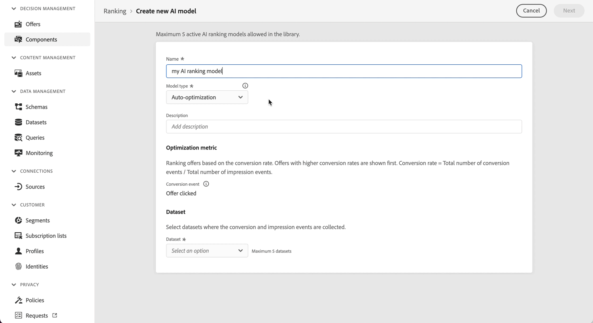

# Note sulle versioni 2022 {#release-notes-2022}

In questa pagina sono elencate tutte le funzioni e i miglioramenti di [!DNL Journey Optimizer] rilasciati nel 2022.

## Versione di luglio 2022 {#july-2022-release}

### Nuove funzionalità

<table>
<thead>
<tr>
<th><strong>Nuovo flusso di messaggistica in linea</strong> </th>
</tr>
</thead>
<tbody>
<tr>
<td>

Journey Optimizer fornisce un nuovo flusso per la creazione dei messaggi nei Percorsi. La messaggistica in linea consente agli utenti di risparmiare tempo e semplifica il processo del flusso di lavoro per creare e inviare un’e-mail, una notifica push o un SMS in Journey Optimizer. Rimuovendo i messaggi come passaggio separato e rendendoli modificabili in linea nell’ambito di un’azione nell’area di lavoro del Percorso, si riducono i clic e le schermate necessari per progettare e modificare i contenuti.

Per ulteriori informazioni, consulta la <a href="../messages/get-started-content.md">documentazione dettagliata</a>.

</td>
</tr>
</tbody>
</table>

<table>
<thead>
<tr>
<th><strong>Controllo degli accessi basato su attributi (disponibilità limitata)</strong> </th>
</tr>
</thead>
<tbody>
<tr>
<td>

È ora possibile identificare i campi dello schema con etichette che definiscono gli ambiti di utilizzo organizzativi o dei dati. Gli amministratori possono utilizzare l’interfaccia Autorizzazioni per definire i criteri di accesso che coprono i campi dello schema XDM per controllare l’accesso consentito a utenti o gruppi di utenti (utenti interni, esterni o di terze parti) e gestire l’accesso a tipi specifici di dati (ad esempio Dati personali sensibili/SPD).

Il controllo degli accessi basato su attributi è attualmente limitato ad alcuni utenti e verrà esteso a tutti gli ambienti con una versione futura.

Per ulteriori informazioni, consulta la <a href="../administration/attribute-based-access.md">documentazione dettagliata</a>.

</td>
</tr>
</tbody>
</table>

<table>
<thead>
<tr>
<th><strong>Processi decisionali in batch</strong> </th>
</tr>
</thead>
<tbody>
<tr>
<td>

È ora possibile eseguire processi decisionali in batch direttamente dall’interfaccia utente; non è quindi più necessario ricorrere a uno sviluppatore per eseguire processi API in batch, riducendo il tempo necessario per il marketing. Questa nuova interfaccia consente di creare nuovi processi e gestire quelli correnti o passati.

Per ulteriori informazioni, consulta la <a href="../offers/batch-delivery.md">documentazione dettagliata.

</td>
</tr>
</tbody>
</table>

<table>
<thead>
<tr>
<th><strong>Utilizza automaticamente l’offerta più performante nelle decisioni (disponibilità limitata)</strong> </th>
</tr>
</thead>
<tbody>
<tr>
<td>

Nella gestione delle decisioni, ora puoi utilizzare sistemi di modelli di ottimizzazione personalizzati. Questo nuovo tipo di modello consente di ottimizzare e personalizzare le offerte in base a segmenti e prestazioni.

L’utilizzo di modelli di ottimizzazione personalizzati basati su IA è attualmente limitato ad alcuni utenti e verrà esteso a tutti gli ambienti con una versione futura.

Per ulteriori informazioni, consulta la <a href="../offers/ranking/personalized-optimization-model.md">documentazione dettagliata</a>.

</td>
</tr>
</tbody>
</table>

### Miglioramenti

**Percorsi**

* **Terminazione di un percorso** - Nell&#39;area di lavoro del percorso, il **Fine** l’attività è stata rimossa dalla palette. I tag finali vengono ora aggiunti per impostazione predefinita alla fine di ciascun percorso e non possono essere rimossi. Questo miglioramento consente una migliore generazione di rapporti su dove un cliente ha abbandonato il percorso, senza che sia necessaria alcuna azione da parte del professionista del percorso. Fai riferimento a [documentazione](../building-journeys/journey-end.md) e [video sulle funzioni](https://video.tv.adobe.com/v/345376){target=&quot;_blank&quot;}.

* La **Fuso orario del profilo** l’opzione è ora deselezionata per impostazione predefinita nelle proprietà del percorso. [Ulteriori informazioni](../building-journeys/timezone-management.md#timezone-from-profiles)

**Messaggi**

* I predefiniti per messaggi sono ora **superfici di canale**. [Ulteriori informazioni](../configuration/channel-surfaces.md)

**Amministrazione**

* **Modifica record PTR**: ora, quando si aggiorna un record PTR, il tempo di elaborazione richiederà solo un massimo di 3 ore. [Ulteriori informazioni](../configuration/ptr-records.md#processing)

* **Interfaccia utente per l’elenco Consentiti**: è ora possibile utilizzare l’interfaccia utente di Journey Optimizer per aggiungere nuovi indirizzi e-mail o domini all’elenco Consentiti. [Ulteriori informazioni](../configuration/allow-list.md)

* **Aggiornamento della logica per l’elenco Consentiti**: ora la logica dell’elenco Consentiti si applica non appena la funzione è abilitata, anche se l’elenco è vuoto. [Ulteriori informazioni](../configuration/allow-list.md#logic)

* **Parametri di tracciamento URL** - È ora possibile utilizzare l’editor espressioni per configurare i parametri di tracciamento URL nelle superfici dell’e-mail (ad es. predefiniti). [Ulteriori informazioni](../configuration/email-settings.md#url-tracking)

**Offer Decisioning**

* **Dimensione del pubblico**: ora durante la creazione di una regola decisionale, durante la selezione di un segmento o di una regola per impostare un’idoneità per l’offerta o quando aggiungi un segmento o una regola a un ambito decisionale, nell’interfaccia utente viene visualizzato un nuovo componente per la stima delle dimensioni del pubblico.

## Versione di giugno 2022 {#june-2022-release}

### Nuove funzionalità

<table>
<thead>
<tr>
<th><strong>Inviare SMS agli utenti (disponibilità limitata)</strong> </th>
</tr>
</thead>
<tbody>
<tr>
<td>

Ora puoi creare, personalizzare e inviare SMS in Journey Optimizer tramite un’integrazione con <b>Sinch</b> o <b>Twilio</b>.

<!--img src="assets/do-not-localize/SMS.gif"/-->

Il canale SMS è attualmente disponibile solo per un set di organizzazioni (disponibilità limitata). Per ulteriori informazioni, contatta il tuo rappresentante Adobe.

Per informazioni su come creare e inviare un SMS, consulta la <a href="../messages/create-sms.md">documentazione dettagliata</a>.

</td>
</tr>
</tbody>
</table>

<table>
<thead>
<tr>
<th><strong>L’integrazione con Adobe Stock consente di trovare più rapidamente immagini di forte impatto</strong> </th>
</tr>
</thead>
<tbody>
<tr>
<td>

Il plug-in per l’integrazione di Adobe Stock e Adobe Journey Optimizer Email Designer offre ai clienti un modo semplice di cercare le immagini da utilizzare nella creazione dei messaggi, acquistarne la licenza e salvarle.   La nuova opzione <b>Trova foto Stock simili</b> consente inoltre di individuare foto Stock simili alle tue immagini per contenuto, colore e composizione. 

<!--img src="assets/do-not-localize/stock-rn.gif"/-->

Per ulteriori informazioni, consulta la <a href="../design/stock.md">documentazione dettagliata</a>.

</td>
</tr>
</tbody>
</table>

<table>
<thead>
<tr>
<th><strong>Utilizza E-mail Ccn in tutte le e-mail</strong> </th>
</tr>
</thead>
<tbody>
<tr>
<td>

Ora è possibile utilizzare la funzionalità E-mail Ccn (copia carbone nascosta) per memorizzare le e-mail inviate da Adobe Journey Optimizer. Se abiliti questa opzione nei tuoi predefiniti e-mail, ogni e-mail verrà inviata anche come copiata nascosta all’indirizzo in Ccn.

<!--img src="assets/do-not-localize/bcc-rn.gif"/-->

Per ulteriori informazioni, consulta la <a href="../configuration/bcc-email.md">documentazione dettagliata</a>.

</td>
</tr>
</tbody>
</table>

<!--<table>
<thead>
<tr>
<th><strong>Automatically use the best performing offer in your decisions</strong> </th>
</tr>
</thead>
<tbody>
<tr>
<td>

You can now use personalized optimization model systems in Decision Management. This new type of model allows you to optimize and personalize offers based on segments and offer performance.

The use of personalized optimization AI models is currently restricted to selected users, and will be deployed to all environments in a future release.

For more information, refer to the <a href="../offers/ranking/personalized-optimization-model.md">detailed documentation</a>.

</td>
</tr>
</tbody>
</table>-->

<table>
<thead>
<tr>
<th><strong>Copiare oggetti da una sandbox a un’altra</strong> </th>
</tr>
</thead>
<tbody>
<tr>
<td>

Ora puoi ricreare le esperienze da una sandbox Journey Optimizer a un’altra, ad esempio da una sandbox non di produzione a una di produzione. Questa nuova funzionalità consente di copiare da un ambiente all’altro un intero percorso, compresi tutti gli oggetti da cui dipende la sua esecuzione corretta. Oltre ai percorsi, puoi anche copiare altri componenti quali offerte, messaggi, schemi, set di dati, origini dati, eventi e azioni.

Per ulteriori informazioni, consulta la <a href="../building-journeys/copy-to-sandbox.md">documentazione dettagliata</a>.
</td>
</tr>
</tbody>
</table>

### Miglioramenti

**Gestione delle decisioni**

* **Supporto di file HTML e JSON**: ora è possibile trascinare file HTML e JSON esterni dalla libreria di risorse Adobe Experience Cloud nel contenuto della rappresentazione dell’offerta. [Ulteriori informazioni](../offers/offer-library/add-representations.md#html-json)

**E-mail**

* **Salva come modello**: ora è possibile salvare un contenuto e-mail come modello e riutilizzarlo per creare altri messaggi. [Ulteriori informazioni](../design/email-templates.md)

**Amministrazione**

* **Parametri URL di tracciamento anteprima**: quando configuri un predefinito di messaggio, se definisci i parametri di tracciamento URL ora viene visualizzata un’anteprima dinamica dell’URL di tracciamento risultante. [Ulteriori informazioni](../configuration/email-settings.md#url-tracking)

* **Modifica del predefinito per messaggi**: ora al momento dell’aggiornamento di un predefinito per messaggi, il tempo di elaborazione può richiedere solo fino a 3 ore. [Ulteriori informazioni](../configuration/channel-surfaces.md#edit-channel-surface)

* **Modifica del pool IP**: ora quando si aggiorna un pool IP il tempo di elaborazione può richiedere solo fino a 3 ore. [Ulteriori informazioni](../configuration/ip-pools.md#edit-ip-pool)

## Versione di maggio 2022 {#may-2022-release}

### Nuove funzionalità

<table>
<thead>
<tr>
<th><strong>Regole di frequenza dei messaggi </strong> </th>
</tr>
</thead>
<tbody>
<tr>
<td>

Ora puoi impostare regole di business cross-channel che escluderanno automaticamente i profili sollecitati eccessivamente da messaggi e azioni.

<!--img src="assets/do-not-localize/frequency-rn.gif"/-->

Per ulteriori informazioni, consulta la <a href="../configuration/frequency-rules.md">documentazione dettagliata</a>.

</td>
</tr>
</tbody>
</table>

<table>
<thead>
<tr>
<th><strong>Gestione delle decisioni: modello di ottimizzazione automatica basato su classificazione IA</strong> </th>
</tr>
</thead>
<tbody>
<tr>
<td>

Nella gestione delle decisioni, ora è possibile utilizzare sistemi formati su modelli. Questa nuova funzionalità classifica le offerte da visualizzare per un determinato profilo.

<!--img src="assets/do-not-localize/optimization.gif"/-->

Per ulteriori informazioni, consulta la <a href="../offers/offer-activities/configure-offer-selection.md#use-ranking-strategy">documentazione dettagliata</a>.

</td>
</tr>
</tbody>
</table>

<!--table>
<thead>
<tr>
<th><strong>Attribute-based Access Control (ABAC)</strong> </th>
</tr>
</thead>
<tbody>
<tr>
<td>

Permission management in Journey Optimizer has been extended to data access. You can now manage data access for specific teams or groups of users (i.e. internal, external, 3rd parties) ​and manage access to specific types of data (i.e. Sensitive Personal Data/SPD).

This capability is available for a limited set of customers.

For more information, refer to the <a href="../landing-pages/create-lp.md">detailed documentation</a>.

</td>
</tr>
</tbody>
</table-->

<table>
<thead>
<tr>
<th><strong>Registri di audit di Journey Optimizer</strong> </th>
</tr>
</thead>
<tbody>
<tr>
<td>

Ora è possibile monitorare le azioni eseguite dagli utenti sulle risorse di Adobe Journey Optimizer.

<!--img src="assets/do-not-localize/audit-rn.gif"/-->

Per ulteriori informazioni, consulta la <a href="../privacy/audit-logs.md">documentazione dettagliata</a>.

</td>
</tr>
</tbody>
</table>

### Miglioramenti

**Personalizzazione**

* **Nuova funzione helper per nascondere i caratteri**: la funzione helper `mask` consente di sostituire una parte di stringa con caratteri “X”. [Ulteriori informazioni](../personalization/functions/string.md#mask)

**Pagine di destinazione**

* **Pagine di destinazione senza modulo**: ora è possibile creare e pubblicare una pagina di destinazione che non contiene un modulo e che non richiede alcuna azione da parte dei visitatori.
* **Modelli di pagina di destinazione**: ora è possibile salvare una pagina di destinazione come modello e riutilizzarla durante la creazione di altre pagine di destinazione. [Ulteriori informazioni](../landing-pages/lp-templates.md)
* **Torna alla pagina principale**: ora è possibile aggiungere un collegamento alla pagina principale da qualsiasi pagina secondaria all’interno della stessa pagina di destinazione.
* **Supporto JavaScript personalizzato**: ora è possibile aggiungere JavaScript personalizzato al contenuto della pagina di destinazione per applicare uno stile avanzato o aggiungere comportamenti personalizzati alle pagine di destinazione.	[Ulteriori informazioni](../landing-pages/lp-custom-js.md)

**Percorsi**

* **Leggi segmento**: i percorsi Leggi segmento una tantum ora passano allo stato Finito 30 giorni dopo l’esecuzione del percorso. Per i segmenti con Leggi segmento pianificati, devono invece trascorrere 30 giorni dall’esecuzione dell’ultima occorrenza. [Ulteriori informazioni](../building-journeys/read-segment.md)
* **Editor espressioni**: è stata aggiunta la funzione [limit](../building-journeys/functions/functionlimit.md) per consentire di limitare il numero di elementi di un elenco. La funzione [sort](../building-journeys/functions/functionsort.md) consente ora di ordinare un oggetto elenco. È stato aggiunto anche il supporto di listObject alle funzioni [disctinct](../building-journeys/functions/functiondistinct.md) e [distinctWithNull](../building-journeys/functions/functiondistinctwithnull.md).

**Amministrazione**

* **Aggiornamento della dashboard di utilizzo della licenza**: la dashboard Utilizzo licenze disponibile nell’interfaccia utente di [!DNL Adobe Journey Optimizer] ora riflette il valore preciso per la media **Concessa in licenza** del profilo. Osserverai un calo nella rappresentazione di questa metrica, che indica che il limite di licenza è ora correttamente segnalato. [Ulteriori informazioni](../segment/license-usage.md)

## Versione di aprile 2022 {#april-2022-release}

### Miglioramenti

**Pagine di destinazione**

* **Nuova opzione per le caselle di controllo di consenso/rinuncia** - È ora possibile inserire una singola casella di controllo di consenso/rinuncia nelle pagine di destinazione di iscrizione. Gli utenti devono selezionare la casella di controllo per il consenso (opt-in) e deselezionarla per la rinuncia (opt-out). [Ulteriori informazioni](../landing-pages/design-lp.md#define-lp-specific-content)

* **Campi delle pagine di destinazione precompilati** - È ora possibile consentire agli utenti di precompilare i campi della pagina di destinazione con le informazioni del profilo. [Ulteriori informazioni](../landing-pages/create-lp.md#configure-primary-page)

**Gestione delle decisioni**

* **API Decisioning in Edge** - L’API Edge Decisioning può distribuire ed eseguire il rendering di offerte personalizzate gestite in Offer Decisioning. Puoi creare le offerte e altri oggetti correlati utilizzando l’interfaccia utente (UI) o le API di Offer Decisioning. [Ulteriori informazioni](../offers/api-reference/offer-delivery-api/edge-decisioning-api.md)

**Amministrazione**

* **Durata invio PTR** - Le modifiche PTR ora diventano effettive dopo alcune ore. [Ulteriori informazioni](../configuration/ptr-records.md#processing)

**Progettazione e-mail**

* Per progettare il contenuto delle e-mail in Journey Optimizer sono ora disponibili **20 nuovi modelli e-mail**.

**Interfaccia utente**

* **Aiuto contestuale nell’interfaccia utente di Journey Optimizer** - Sono stati aggiunti collegamenti di aiuto contestuali verso diverse pagine della documentazione di Journey Optimizer. Quando disponibile, fai clic sull’icona “i” per visualizzare una breve descrizione della funzionalità corrente e accedere ai relativi articoli.

**Integrazione con Adobe Campaign Standard**

In qualità di cliente Adobe Campaign Standard, ora puoi inviare e-mail, notifiche push e SMS utilizzando Journey Optimizer. Utilizza le nuove azioni integrate per sfruttare le funzionalità di messaggistica transazionale di Campaign Standard in Journey Optimizer.  [Ulteriori informazioni](../action/acs-action.md)

<!--
### Fixes

* Fixed an issue which caused tracking reports not to be available as the `JourneyActionId` was not properly populated. PLATIR-19854, CJM-26006
* Fixed an error on business events which could block the journey publication. CJM-25931
* Fixed an issue which could prevent images in Email Designer templates from being displayed. PLATIR-18176, CJM-25008
-->

## Versione di marzo 2022 {#march-2022-release}

### Miglioramenti

**Percorsi**

* Per evitare di includere campi non necessari nello schema di profilo unificato, lo schema Evento delle fasi del percorso non è più abilitato per i profili per impostazione predefinita. Se necessario, puoi attivarlo. [Ulteriori informazioni](../reports/sharing-overview.md)
* I nuovi eventi delle fasi relativi ai processi di esportazione vengono ora inviati da Journey Optimizer a Adobe Experience Platform. Nella documentazione sono stati aggiunti esempi di query. [Ulteriori informazioni](../reports/query-examples.md)

**Gestione delle decisioni**

* Ora puoi specificare se il limite di offerte viene applicato a tutti gli utenti o a un profilo specifico, e a tutti i posizionamenti o a singoli posizionamenti. [Ulteriori informazioni](../offers/offer-library/add-constraints.md#capping)
* L’API Batch Decisioning consente alle organizzazioni di utilizzare la funzionalità Offer Decisioning decisioning per tutti i profili in un dato segmento in una chiamata. Il contenuto dell’offerta per ogni profilo del segmento viene inserito in un set di dati AEP dove è disponibile per flussi di lavoro batch personalizzati. [Ulteriori informazioni](../offers/api-reference/offer-delivery-api/batch-decisioning-api.md)

**Amministrazione**

* Ora puoi abilitare/disabilitare il collegamento di annullamento dell’iscrizione nella/dalla intestazione delle e-mail a livello di predefinito del messaggio e impostare un URL di annullamento dell’iscrizione personalizzato a livello di messaggio. [Ulteriori informazioni](../configuration/channel-surfaces.md#list-unsubscribe)
* L’elenco Consentiti ora può essere abilitato e disabilitato tramite l’interfaccia [!DNL Journey Optimizer] sulle sandbox di produzione e di non produzione. [Ulteriori informazioni](../configuration/allow-list.md#enable-allow-list)

**Personalizzazione**

* Ora puoi salvare più di 40 espressioni di personalizzazione nella libreria. [Ulteriori informazioni](../personalization/personalization-library.md)

## Versione di febbraio 2022 {#feb-2022-release}

### Nuove funzionalità

<table>
<thead>
<tr>
<th><strong>Pagine di destinazione di iscrizione</strong> </th>
</tr>
</thead>
<tbody>
<tr>
<td>

È ora possibile creare e progettare pagine di destinazione in Journey Optimizer e indirizzare gli utenti a moduli online in cui possono acconsentire o rinunciare alla ricezione delle comunicazioni o iscriversi a un servizio specifico, ad esempio una newsletter.

Per ulteriori informazioni, consulta la <a href="../landing-pages/create-lp.md">documentazione dettagliata</a> e alcuni <a href="../landing-pages/lp-use-cases.md">esempi di casi d’uso</a>.

</td>
</tr>
</tbody>
</table>

<table>
<thead>
<tr>
<th><strong>Nuova libreria di espressioni di personalizzazione</strong> </th>
</tr>
</thead>
<tbody>
<tr>
<td>

Journey Optimizer fornisce ora una libreria in cui è possibile accedere a espressioni di personalizzazione predefinite. Queste espressioni sono configurate dagli utenti amministratore.

Per ulteriori informazioni, consulta la <a href="../personalization/personalization-library.md">documentazione dettagliata</a>.

</td>
</tr>
</tbody>
</table>

<!--table>
<thead>
<tr>
<th><strong>API Developer Site and Suppression API</strong> </th>
</tr>
</thead>
<tbody>
<tr>
<td>

Journey Optimizer provide RESTful APIs that allow you to programmatically perform key operations in your applications.
Developer SDK for Journey Optimizer is now available with the Suppression API (beta).

With this API, you can control your outgoing messages using suppression and allow lists.
The suppression list helps you with honoring the ISPs’ feedback to preserve sending IP reputation. The allow list helps you ensure that you send only to those email addresses which are in the allowed list, and typically to ensure that you don't send mails to customers from your development sandbox.

See <a href="https://developer.adobe.com/journey-optimizer-apis/">Adobe Journey Optimizer APIs</a>.

</td>
</tr>
</tbody>
</table-->

<table>
<thead>
<tr>
<th><strong>Trasmettere le informazioni per tenere traccia dei messaggi con i parametri di tracciamento UTM</strong> </th>
</tr>
</thead>
<tbody>
<tr>
<td>

Nel contenuto del messaggio di Journey Optimizer, ora puoi aggiungere parametri UTM ai collegamenti: possono fornire dati aggiuntivi su quel collegamento e aiutarti a identificare dove e perché una persona ha fatto clic sul collegamento.

Per ulteriori informazioni, consulta la <a href="../configuration/channel-surfaces.md#configure-email-settings">documentazione dettagliata</a>.</p-->
</td>
</tr>
</tbody>
</table>

### Miglioramenti

**Percorsi**

* Per ottimizzare le prestazioni, tutti i percorsi in modalità di test che non sono stati attivati per una settimana torneranno allo stato Bozza. [Ulteriori informazioni](../building-journeys/testing-the-journey.md#important_notes)
* L’integrazione tra Journey Optimizer e Adobe Campaign Classic è stata ottimizzata per migliorarne le prestazioni. La configurazione predefinita del limite è stata modificata in 4000 chiamate/5 minuti.	[Ulteriori informazioni](../action/acc-action.md#important-notes)

**Generazione rapporti**

* È ora possibile filtrare le consegne in base al loro stato:
   * Dall’elenco Esecuzione messaggi, ora puoi escludere le bozze dall’elenco delle consegne.
   * Dai rapporti Live/Global puoi scegliere di escludere gli eventi di test.

* Ora puoi accedere ai rapporti relativi ai dati di ottimizzazione del tempo di invio: il numero di persone che hanno ricevuto messaggi immediatamente e il numero di persone a cui il messaggio è stato inviato con un&#39;ottimizzazione di 1 ora, 2 ore ecc.

<!--* Offer Decisioning reports are now available in Journey Optimizer. You can access the following metrics: Offers sent - Offers' impression rate - Offers' click rate - Breakdown report on Offers' sent.-->

**Gestione delle decisioni**

* Le classificazioni e la classificazione IA sono ora raggruppate in un’unica scheda.

## Versione di gennaio 2022 {#january-2022-release}

### Nuove funzionalità

<table>
<thead>
<tr>
<th><strong>Percorsi: ottimizzare l’incremento graduale dell’IP con le condizioni per un limite dei profili</strong> </th>
</tr>
</thead>
<tbody>
<tr>
<td>

Durante la configurazione di un’attività <strong>Condizione</strong> in un percorso, ora puoi definire un limite di profili. Questo nuovo tipo di condizione consente di impostare un numero massimo di profili per un percorso. Una volta raggiunto tale limite, i profili partecipanti seguono un percorso alternativo. Questo consente di incrementare gradualmente il volume delle consegne (incremento graduale dell’IP). Ad esempio, puoi incrementare gradualmente le consegne per un dominio suddividendo l’esecuzione su più giorni: invia 1000 messaggi il primo giorno, 2000 il secondo giorno e così via.

Per ulteriori informazioni, consulta la <a href="../building-journeys/condition-activity.md#profile_cap">documentazione dettagliata</a> e alcuni <a href="../building-journeys/ramp-up-deliveries-uc.md">esempi di casi d’uso</a>.

</td>
</tr>
</tbody>
</table>

<table>
<thead>
<tr>
<th><strong>Percorsi: miglioramento delle attività Leggi segmento</strong> </th>
</tr>
</thead>
<tbody>
<tr>
<td>

Alle attività <strong>Leggi segmento</strong> ricorrenti è stata aggiunta l’opzione <strong>Lettura incrementale</strong>. Questa opzione consente di indirizzare solo i singoli utenti che sono entrati a far parte del segmento dopo l’ultima esecuzione del percorso. La prima esecuzione indirizza sempre tutti i membri del segmento.

Per ulteriori informazioni, consulta la <a href="../building-journeys/read-segment.md#configuring-segment-trigger-activity">documentazione dettagliata</a>.
</td>
</tr>
</tbody>
</table>

### Miglioramenti

**Percorsi**

* Ora è possibile collegare gli eventi dei passaggi di Journey Optimizer ad altri set di dati in [Adobe Customer Journey Analytics](https://experienceleague.adobe.com/docs/analytics-platform/using/cja-overview/cja-overview.html?lang=it). Il campo **profileID** nello schema integrato Evento passaggio percorso è ora definito come campo di identità. [Ulteriori informazioni](../reports/sharing-overview.md#integration-cja)

**offer decisioning**

* Quando aggiorni un’offerta, un’offerta di fallback, una raccolta di offerte o una decisione di offerta a cui viene fatto riferimento direttamente o indirettamente in un messaggio pubblicato, gli aggiornamenti vengono ora rispecchiati automaticamente nel messaggio corrispondente, senza doverlo ripubblicare. [Ulteriori informazioni](../offers/offers-e2e.md#insert-decision-in-email)

* Quando si effettua una simulazione per capire quali offerte verranno consegnate per un determinato profilo di test, ora è possibile modificare le impostazioni predefinite della simulazione e visualizzare il codice corrispondente alle simulazioni, utile per la risoluzione dei problemi. [Ulteriori informazioni](../offers/offer-activities/simulation.md#define-simulation-settings)

**Amministrazione**

* Gli amministratori ora possono modificare i record PTR con un sottodominio configurato tramite CNAME. [Ulteriori informazioni](../configuration/ptr-records.md#edit-ptr-subdomains-cname)

**Personalizzazione**

* **Aggiungi ai preferiti**: per rendere più efficienti le attività di personalizzazione, è stato introdotto il concetto di salvataggio dei preferiti. L’aggiunta di attributi diversi al menu dei preferiti consente di accedere rapidamente agli elementi utilizzati con maggiore frequenza. [Ulteriori informazioni](../personalization/personalize.md#fav)
