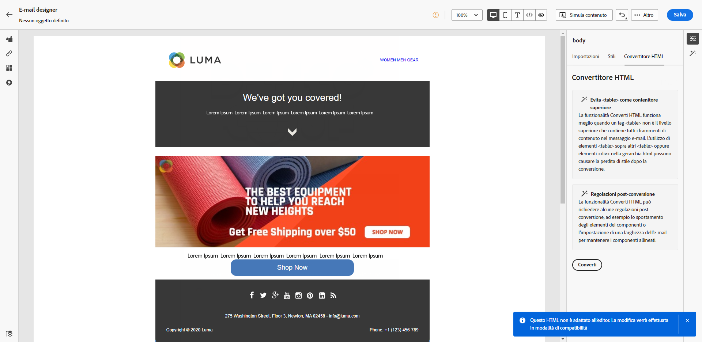

# Note sulla versione 2023 {#release-notes-2023}

In questa pagina sono elencate tutte le funzioni e i miglioramenti di [!DNL Journey Optimizer] rilasciati nel 2023.

## Versione di ottobre 2023 {#oct-rn-2023}

### Nuove funzionalità{#oct-2023-features}

Questa versione include le nuove funzionalità elencate di seguito.

<table>
<thead>
<tr>
<th><strong>Strumenti sandbox</strong> </th>
</tr>
</thead>
<tbody>
<tr>
<td>

Gli strumenti sandbox consentono di copiare oggetti in più sandbox sfruttando le funzioni di esportazione e importazione dei pacchetti. Un pacchetto può essere costituito da uno o più oggetti. Tutti gli oggetti inclusi in un pacchetto devono appartenere alla stessa sandbox.

<!--img src="../data/assets/dataset-export-setup.png"-->

Per ulteriori informazioni, consulta la <a href="../building-journeys/copy-to-sandbox.md">documentazione dettagliata</a>.

</td>
</tr>
</tbody>
</table>

<table>
<thead>
<tr>
<th><strong>MMS (Multimedia Message Service) negli SMS</strong> </th>
</tr>
</thead>
<tbody>
<tr>
<td>

Con il canale SMS, ora è possibile migliorare le comunicazioni inviando messaggi MMS (Multimedia Message Service), che consentono la condivisione di immagini, GIF o video con la clientela. Questa funzione è attualmente disponibile solo con Sinch.

Per ulteriori informazioni, consulta la <a href="../sms/create-sms.md#mms-content">documentazione dettagliata</a>.

</tr>
</tbody>
</table>

### Miglioramenti {#oct-2023-improvements}

Questa versione include i miglioramenti elencati di seguito.

**Tipi di pubblico**

* Ora puoi eseguire il targeting di tipi di pubblico caricati da un file CSV in percorsi e campagne. [Ulteriori informazioni](../audience/about-audiences.md#segments-in-journey-optimizer)
* Ora puoi eseguire il targeting dei tipi di pubblico creati tramite la composizione del pubblico e sfruttare gli attributi di arricchimento nei percorsi. [Ulteriori informazioni](../building-journeys/read-audience.md)

>[!AVAILABILITY]
>
>Queste funzionalità sono attualmente disponibili come versione beta.

<!--
**Spam scoring for emails**

* When simulating an email content, a new option enables you to check how your content performs against inboxes spam filtering. This feature is currently proposed to a set of customers only (Limited Availability), and available for the Email channel.-->

**Campagne**

<!--* You can now stop a live one-time campaign, make modifications and resume it again. This improvement is available in Beta.-->
* Quando si verifica un errore in una delle campagne, ora viene visualizzata un’icona di avviso nell’elenco delle campagne insieme allo stato della campagna. [Ulteriori informazioni](../campaigns/manage-campaigns.md#statuses)

**Percorsi**

* La durata massima che puoi definire in qualsiasi tempo di attesa è ora di 29 giorni anziché di 30. Questo miglioramento è stato introdotto per evitare che le durate di attesa superino la durata del percorso di 30 giorni. Ciò si applica:

   * al campo **Quantità di tempo** nell’[attività di attesa](../building-journeys/wait-activity.md)
   * al **Periodo di attesa per reingresso** nelle [Proprietà del percorso](../building-journeys/journey-properties.md#entrance)
   * il campo **Attendi** nella definizione di timeout delle [attività evento](../building-journeys/general-events.md#events-specific-time).

<!--
**Consent in channel configuration**

* You can now select a marketing action at the channel configuration level. When used in a surface, all consent policies associated with that marketing action are leveraged in order to respect the preferences of your customers.-->

**Gestione delle decisioni**

* Sono state aggiornate diverse etichette relative al limite delle offerte nell’interfaccia di gestione delle decisioni. [Ulteriori informazioni](../offers/offer-library/add-constraints.md#capping)

## Versione di settembre 2023 {#sept-rn-2023}

### Nuove funzionalità{#sept-2023-features}

Questa versione include le nuove funzionalità elencate di seguito.

<table>
<thead>
<tr>
<th><strong>Attributi calcolati</strong> </th>
</tr>
</thead>
<tbody>
<tr>
<td>

Gli attributi calcolati consentono di riepilogare facilmente i dati evento negli attributi del profilo tramite un’interfaccia intuitiva e migliorano la segmentazione, la personalizzazione e l’attivazione basate sul comportamento. Con questa funzione, puoi creare attributi calcolati in autonomia, gestirli e utilizzarli nella segmentazione, nelle destinazioni del profilo cliente in tempo reale o in Journey Optimizer.  
Inoltre, gli attributi calcolati semplificano i flussi di lavoro per percorsi e segmentazione per aiutarti a fornire esperienze rilevanti in modo semplice e diretto. Per ulteriori informazioni, consulta la <a href="../audience/computed-attributes.md">documentazione dettagliata</a>.

</tr>
</tbody>
</table>

<table>
<thead>
<tr>
<th><strong>Rapporti consolidati sui canali</strong> </th>
</tr>
</thead>
<tbody>
<tr>
<td>

La funzione Rapporto dei canali offre ad analisti ed esperti di marketing una panoramica completa delle metriche di traffico e coinvolgimento a livello di canale.

Per accedere al menu <b>Rapporto</b>, è necessario disporre dell’autorizzazione <b>Visualizza rapporti sui canali</b>.

Per ulteriori informazioni, consulta la <a href="../reports/channel-report-cja.md">documentazione dettagliata</a>.

</tr>
</tbody>
</table>

<table>
<thead>
<tr>
<th><strong>Destinazioni di esportazione dei set di dati (GA)</strong> </th>
</tr>
</thead>
<tbody>
<tr>
<td>

L’esportazione dei set di dati di Journey Optimizer nelle destinazioni di archiviazione cloud è ora disponibile a livello generale. Ora, per esportare il contenuto dei set di dati, è possibile stabilire una connessione in tempo reale con posizioni di archiviazione cloud.

Per ulteriori informazioni, consulta la <a href="../data/export-datasets.md">documentazione dettagliata</a>.

</td>
</tr>
</tbody>
</table>

<table>
<thead>
<tr>
<th><strong>Archiviazione per sandbox delle credenziali per app mobili</strong> </th>
</tr>
</thead>
<tbody>
<tr>
<td>

Questa nuova funzione consente di gestire e associare facilmente le credenziali push a una sandbox dedicata in Superfici app.

Per ulteriori informazioni, consulta la <a href="../in-app/inapp-configuration.md#channel-prerequisites">documentazione dettagliata</a>.

</tr>
</tbody>
</table>

### Miglioramenti {#sept-2023-improvements}

Questa versione include i miglioramenti elencati di seguito.

**Gestione delle decisioni**

* Sono ora disponibili nuove API per la creazione e la gestione di oggetti di gestione delle decisioni. Queste API forniscono prestazioni migliori e una esperienza utente ottimizzata. Le API legacy saranno supportate fino al 27/03/2024. [Ulteriori informazioni](../offers/api-reference/getting-started.md)

**Personalizzazione**

* Oltre ai frammenti visivi, ora è possibile creare, salvare e riutilizzare frammenti di espressione dall’interfaccia di Journey Optimizer tramite l’editor di espressioni. I frammenti di espressione sostituiscono le espressioni salvate in precedenza. [Ulteriori informazioni](../personalization/use-expression-fragments.md)

**Avvisi**

* È stato introdotto un nuovo tipo di avviso di sistema. Ora puoi ricevere una notifica quando un’attività **Leggi pubblico** non viene completata. [Ulteriori informazioni](../reports/alerts.md).

**Canale web**

* Le applicazioni a pagina singola (SPA) possono ora essere create nell’editor visivo web, che consente di selezionare le viste specifiche a cui applicare le modifiche alla pagina web. Una vista può essere definita come un intero sito o un gruppo di elementi visivi su un sito, ad esempio la pagina Home, l’intero sito dei prodotti o il frame delle preferenze di consegna su tutte le pagine di pagamento. Per definire le viste nell’implementazione di Adobe Experience Platform Web SDK è necessaria una configurazione una tantum da parte di uno sviluppatore; le persone addette al marketing potranno quindi creare ed eseguire campagne web di Adobe Journey Optimizer su applicazioni a pagina singola. [Ulteriori informazioni](../web/web-spa.md)

* Quando modifichi una pagina utilizzando il designer web, ora puoi aggiungere nuove modifiche al contenuto direttamente dal riquadro Modifiche, senza dover selezionare un componente e modificarlo dall’interfaccia del designer. [Ulteriori informazioni](../web/manage-web-modifications.md#add-modifications)

* Durante la configurazione dei sottodomini web, ora puoi aggiungere un tuo sottodominio, oltre a utilizzare un sottodominio già delegato ad Adobe. [Ulteriori informazioni](../web/web-delegated-subdomains.md#web-configure-new-subdomain)

**Percorsi**

* Durante la duplicazione di un percorso, è ora possibile definire il nome della copia del percorso. [Ulteriori informazioni](../building-journeys/journey-gs.md#duplicate-a-journey)

* Il supporto delle risposte alle azioni personalizzate è ora disponibile al pubblico. Questa funzionalità consente di sfruttare le risposte alle chiamate API nelle azioni personalizzate e gestire il percorso in base a tali risposte. Inoltre, è stato aggiunto un [nuovo guardrail di limitazione](../start/guardrails.md#custom-actions-g) per limitare automaticamente le chiamate di azioni personalizzate. [Ulteriori informazioni](../action/action-response.md)
<!--
* The maximum duration that you can define in the Wait activity is now 29 days instead of 30.
-->

**Canale e-mail**

* Una nuova opzione nella configurazione della superficie e-mail consente di scegliere di inviare messaggi transazionali ai profili anche se i loro indirizzi e-mail si trovano nell’elenco di soppressione di Adobe [!DNL Journey Optimizer]. [Ulteriori informazioni](../email/email-settings.md#send-to-suppressed-email-addresses)

**Canale SMS**

* Due nuovi campi, **Messaggio di consenso** e **Messaggio di aiuto**, sono stati aggiunti alla schermata di configurazione API, per consentire agli utenti di personalizzare le risposte in base a parole chiave in entrata. Tieni presente che questo è disponibile solo per il provider SMS Sinch. [Ulteriori informazioni](../sms/sms-configuration.md)

* La rinuncia agli SMS non viene più gestita a livello di canale. Ora è a livello di numero: se alcuni profili rinunciano da un determinato numero o codice breve, puoi comunque inviare loro messaggi da altri numeri che utilizzi per inviare messaggi SMS. Una nuova opzione consente di selezionare il **Numero di rinuncia** da utilizzare per una determinata superficie. [Ulteriori informazioni](../sms/sms-configuration.md)

**Canale direct mail**

* Ora è possibile crittografare i file destinati ai provider di direct mail quando vengono trasferiti su un server. A questo scopo, nella schermata di configurazione dell’indirizzamento dei file, nuovo campo consente di copiare e incollare la chiave di crittografia. [Ulteriori informazioni](../direct-mail/direct-mail-configuration.md)

**Reporting**

* Ora è possibile esportare i rapporti di Journey Optimizer come file CSV. Per ulteriori informazioni, consulta la [documentazione dettagliata](../reports/report-gs-cja.md).

**Assets**

* Una nuova opzione per Assets consente di scegliere l’archivio delle risorse in Journey Optimizer. Puoi optare per un archivio Assets Essentials o per un archivio Assets as a Cloud Service, a condizione che tu disponga di una licenza per questa soluzione. [Ulteriori informazioni](../integrations/assets.md)

<!--**Decision management**

Enhancements have been made to the audience picker in journeys or campaigns, with the addition of new columns displaying the origin and update frequency of audiences.    -->

## Versione di agosto 2023 {#aug-rn-2023}

### Nuove funzionalità{#aug-2023-features}

Questa versione include le nuove funzionalità elencate di seguito.

<table>
<thead>
<tr>
<th><strong>Inviare messaggi in-app nei percorsi</strong> </th>
</tr>
</thead>
<tbody>
<tr>
<td>

Ora puoi inviare messaggi in-app personalizzati agli utenti dell’app all’interno di un percorso. Utilizza Journey Optimizer per progettare notifiche e personalizzare il layout, la visualizzazione, il testo e i pulsanti del messaggio per creare un’esperienza semplice.

Per ulteriori informazioni, consulta la <a href="../in-app/create-in-app.md">documentazione dettagliata</a>.

</tr>
</tbody>
</table>

<table>
<thead>
<tr>
<th><strong>Convalidare le e-mail con elenchi seed</strong> </th>
</tr>
</thead>
<tbody>
<tr>
<td>

Ora in Journey Optimizer puoi creare e gestire gli elenchi seed. Un elenco seed è costituito da indirizzi interni che possono essere aggiunti al pubblico effettivo e ricevere lo stesso messaggio dei profili di destinazione al momento dell’esecuzione della consegna. Utilizza questa funzionalità per monitorare le comunicazioni inviate e verificare che tutti i formati di visualizzazione, gli URL, le immagini e i collegamenti siano corretti.

Per ulteriori informazioni, consulta la <a href="../configuration/seed-lists.md">documentazione dettagliata</a>.

</td>
</tr>
</tbody>
</table>

<!--table>
<thead>
<tr>
<th><strong>Generate text and images with the Content assistant</strong> </th>
</tr>
</thead>
<tbody>
<tr>
<td>

Once you have created and personalized your message, take your content to the next level with the Content assistant. You can now use the Content assistant to optimize your message's impact by experimenting with different main titles, and images. Each variant is managed as a unique Treatment, to measure and compare which title effectively generates more clicks.

This capability is currently available as a private beta.

For more information, refer to the <a href="../start/search-filter-categorize.md#tags">detailed documentation</a>.

</td>
</tr>
</tbody>
</table-->

### Miglioramenti {#aug-2023-improvements}

Questa versione include i miglioramenti elencati di seguito.

<!--
**APIs**

A new API to create and manage Content Fragments is now available. [Learn more](https://developer.adobe.com/journey-optimizer-apis/references/content-templates/#tag/Content-fragment-API){target="_blank"}.-->

<!--**Email channel**

A new option is available in the email surface settings to include email addresses suppressed due to spam complaint in your transactional messages audiences. Even if they marked marketing messages as spam, these profiles can then receive transactional messages, such as password reset or account statements. This option is disabled by default.-->

**Percorsi**

* Ora puoi sfruttare le risposte alle chiamate API nelle azioni personalizzate e orchestrare il percorso in base a tali risposte. Questa funzione è attualmente disponibile solo come versione beta. [Ulteriori informazioni](../action/action-response.md).
* È stato introdotto un nuovo tipo di avviso di sistema. Ora puoi ricevere una notifica quando un’azione personalizzata non viene completata. [Ulteriori informazioni](../reports/alerts.md).
  <!--* When duplicating a journey, you can now define the name of the journey copy.-->

**Direct mail**

* È ora possibile selezionare Azure come tipo di server nella configurazione di indirizzamento file. [Ulteriori informazioni](../direct-mail/direct-mail-configuration.md#file-routing-configuration)
* La E commerciale è ora disponibile come campo separatore di colonna nelle impostazioni di superficie di direct mail. [Ulteriori informazioni](../direct-mail/direct-mail-configuration.md#direct-mail-surface)

## Versione di luglio 2023 {#july-rn-2023}

### Nuove funzionalità{#july-2023-features}

<table>
<thead>
<tr>
<th><strong>Composizione del pubblico</strong> </th>
</tr>
</thead>
<tbody>
<tr>
<td>

Ora puoi creare flussi di lavoro di composizione per combinare i tipi di pubblico di Adobe Experience Platform esistenti in un’area di lavoro visiva e sfruttare varie attività (divisione, arricchimento...) per creare nuovi tipi di pubblico. I tipi di pubblico appena creati vengono salvati nuovamente in Adobe Experience Platform insieme ai tipi di pubblico esistenti e possono essere utilizzati nelle campagne Journey Optimizer per il targeting dei clienti.

Per ulteriori informazioni, consulta la <a href="../audience/get-started-audience-orchestration.md">documentazione dettagliata</a>.

La composizione del pubblico è completamente integrata con il nuovo menu "Tipi di pubblico" di Adobe Experience Platform, che funge da portale centralizzato per i tipi di pubblico. Ora puoi utilizzare una pagina Sfoglia che include una nuova dashboard con tendenze di segmenti e sovrapposizioni, per trovare nuove informazioni ed esplorare gli strumenti organizzativi per cartelle e tag. In questa esperienza sono incorporati controlli di governance per l’etichettatura standardizzata del pubblico e funzionalità di gestione del ciclo di vita del pubblico, al fine di gestire i flussi di lavoro di attivazione. Con questa nuova esperienza di gestione, ora puoi gestire in modo semplice e sicuro i tipi di pubblico da un’unica posizione. Per ulteriori informazioni, consulta la <a href="https://experienceleague.adobe.com/docs/experience-platform/segmentation/ui/overview.html?lang=it" target="_blank">documentazione di Adobe Experience Platform</a>.

</td>
</tr>
</tbody>
</table>

<table>
<thead>
<tr>
<th><strong>Canale direct mail</strong> </th>
</tr>
</thead>
<tbody>
<tr>
<td>

È ora possibile aggiungere messaggi direct mail alle campagne. Direct mail è un canale offline che consente di personalizzare e generare i file necessari ai provider di direct mailing per inviare e-mail ai clienti.

Quando prepari una consegna di direct mail, Journey Optimizer genera un file contenente tutti i profili target e i dati di contatto scelti (ad esempio l’indirizzo postale). Potrai quindi inviare questo file al provider di direct mailing, che si occuperà dell’invio effettivo.

Per il momento, il canale direct mailing non è disponibile per le organizzazioni che hanno acquistato l’offerta aggiuntiva Adobe Healthcare Shield.

Per ulteriori informazioni, consulta la <a href="../direct-mail/get-started-direct-mail.md">documentazione dettagliata</a>.

</tr>
</tbody>
</table>

<table>
<thead>
<tr>
<th><strong>Convertire il contenuto HTML per E-mail designer</strong> </th>
</tr>
</thead>
<tbody>
<tr>
<td>

Ora puoi importare e convertire qualsiasi contenuto HTML nell’editor e-mail di Journey Optimizer. I blocchi di contenuto vengono identificati automaticamente e sono disponibili in E-mail designer: utilizzane le potenti funzionalità di progettazione per aggiornarli e personalizzarli.

Per ulteriori informazioni, consulta la <a href="../email/existing-content.md">documentazione dettagliata</a>.

</td>
</tr>
</tbody>
</table>

<table>
<thead>
<tr>
<th><strong>Utilizzare i tag in Journey Optimizer</strong> </th>
</tr>
</thead>
<tbody>
<tr>
<td>

Oltre a campagne e percorsi, ora puoi assegnare i tag unificati di Adobe Experience Platform a pagine di destinazione, modelli di contenuto, frammenti ed elenchi di iscrizione. Questo ne agevola la classificazione e migliora la ricerca e la navigazione in tutti gli elenchi. 

Per ulteriori informazioni, consulta la <a href="../start/search-filter-categorize.md#tags">documentazione dettagliata</a>.

</td>
</tr>
</tbody>
</table>

<table>
<thead>
<tr>
<th><strong>API per modelli di contenuto</strong> </th>
</tr>
</thead>
<tbody>
<tr>
<td>

Ora puoi creare e gestire modelli di contenuto Adobe Journey Optimizer utilizzando API dedicate, fornendo un’integrazione diretta con il sistema di contenuti esistente.

Per ulteriori informazioni, consulta la <a href="https://developer.adobe.com/journey-optimizer-apis/references/content/">documentazione dettagliata</a>.

</td>
</tr>
</tbody>
</table>

### Miglioramenti {#july-2023-improvements}

Questa versione include i miglioramenti elencati di seguito.

**Campagne**

Gli eventi contestuali relativi alle campagne sono ora disponibili all’uso nel menu “Attributi contestuali” dell’editor di personalizzazione.

**Tipi di pubblico**

Sono stati apportati miglioramenti al selettore del pubblico in percorsi o campagne, con l’aggiunta di nuove colonne che mostrano l’origine e la frequenza di aggiornamento dei tipi di pubblico. Con il rilascio del portale di composizione del pubblico, nel sistema e nella documentazione di Adobe Experience Platform e Adobe Journey Optimizer è stato aggiornato l’utilizzo di “pubblico” e “segmenti”.

* Pubblico: un set di persone, account, famiglie o altre entità che hanno in comune caratteristiche e/o comportamenti specifici.
* Definizione di segmento: in Adobe Experience Platform, le regole utilizzate per descrivere le caratteristiche o il comportamento chiave di un pubblico di destinazione. Questo termine era precedentemente noto semplicemente come “segmento”.

Di conseguenza, in Adobe Journey Optimizer e nell’interfaccia di Adobe Experience Platform, il termine “Segmenti” è stato sostituito da “Tipi di pubblico” per riflettere questo nuovo percorso di creazione e gestione del pubblico.

**API**

Il metodo JWT per generare token di accesso per l’autenticazione API Adobe Journey Optimizer è stato dichiarato obsoleto. Tutte le nuove integrazioni devono essere create utilizzando il metodo di autenticazione server-to-server OAuth. Adobe consiglia inoltre di migrare le integrazioni esistenti al metodo OAuth. [Ulteriori informazioni](https://developer.adobe.com/journey-optimizer-apis/references/authentication/){target="_blank"}.

**Altre modifiche**

L’esportazione di set di dati Journey Optimizer in destinazioni di archiviazione cloud è ora disponibile per tutti i clienti come Beta pubblica. Ora, per esportare il contenuto dei set di dati, è possibile stabilire una connessione in tempo reale con posizioni di archiviazione cloud. [Ulteriori informazioni](../data/export-datasets.md)

## Versione di giugno 2023 {#june-rn-2023}

<table>
<thead>
<tr>
<th><strong>Campagne attivate da API per casi d’uso di marketing</strong> </th>
</tr>
</thead>
<tbody>
<tr>
<td>

Ora puoi utilizzare le API per attivare campagne di marketing in Adobe Journey Optimizer da un sistema esterno.

Fino a questa versione, la funzionalità delle campagne attivate da API copriva varie esigenze di messaggistica operativa e transazionale, come le reimpostazioni di password o i token OTP, ma non poteva essere utilizzata per creare campagne di marketing. I canali disponibili per le campagne attivate da API sono: e-mail, SMS e messaggi push.

Per ulteriori informazioni, consulta la <a href="../campaigns/api-triggered-campaigns.md">documentazione dettagliata</a>.
</td>
</tr>
</tbody>
</table>

<!--
### Improvements {#june-2023-improvements}

**Audiences**

Enhancements have been made to the audience picker in journeys or campaigns, with the addition of new columns displaying the origin and update frequency of audiences.

**Journeys**

You can now leverage API call responses in custom actions and orchestrate your journey based on these responses.
-->

<!--
## June 2023 early release notes {#june-rn-2023}

Information below is subject to change without prior notice until the release availability date. Updated documentation will be published at the release date, and direct links will be added on this page.

**Audiences**

Enhancements have been made to the audience picker in journeys or campaigns, with the addition of new columns displaying the origin and update frequency of audiences.    

**Journeys**

* You can now leverage API call responses in custom actions and orchestrate your journey based on these responses.     

* A new type of system alert has been introduced. You can now get notified when a custom action fails.
-->

## Versione di maggio 2023 {#may-rn-2023}

### Nuove funzionalità{#may-2023-features}

<table>
<thead>
<tr>
<th><strong>Sperimentazione sui contenuti nelle campagne</strong> </th>
</tr>
</thead>
<tbody>
<tr>
<td>

Adobe Journey Optimizer ora supporta gli esperimenti nelle campagne. Gli esperimenti sono test randomizzati: nel contesto dei test online significa che esponi alcuni utenti selezionati in modo casuale a una determinata variante di un messaggio e un altro gruppo di utenti selezionato in modo casuale a un’altra variante o trattamento. Dopo l’esposizione, puoi quindi misurare le metriche del risultato che ti interessano, ad esempio apertura di e-mail, iscrizioni o acquisti.

Per ulteriori informazioni, consulta la <a href="../content-management/content-experiment.md">documentazione dettagliata</a>.

</td>
</tr>
</tbody>
</table>

<!--
<table>
<thead>
<tr>
<th><strong>Objective reporting and performance measurement in campaigns</strong> </th>
</tr>
</thead>
<tbody>
<tr>
<td>

You can now measure the performance of your campaigns across inbound and outbound through dedicated reports. Adobe Journey Optimizer reports can retrieve additional metrics to use in the Objectives tab of your campaign reports.

For more information, refer to the <a href="../reports/campaign-global-report-cja.md">detailed documentation</a>.

</td>
</tr>
</tbody>
</table>
-->

<table>
<thead>
<tr>
<th><strong>Crea e utilizza frammenti nel contenuto dell’e-mail</strong> </th>
</tr>
</thead>
<tbody>
<tr>
<td>

Ora puoi creare, utilizzare e gestire frammenti per assemblare rapidamente e-mail e modelli di contenuto. Un frammento è un componente riutilizzabile predefinito a cui è possibile fare riferimento in più e-mail tra campagne e percorsi di Journey Optimizer per un processo di progettazione migliorato e accelerato.

Per ulteriori informazioni, consulta la <a href="../content-management/fragments.md">documentazione dettagliata</a>.

</td>
</tr>
</tbody>
</table>

<table>
<thead>
<tr>
<th><strong>Utilizzare i tag nelle campagne (Beta)</strong> </th>
</tr>
</thead>
<tbody>
<tr>
<td>

È ora possibile assegnare tag unificati Adobe Experience Platform alle campagne. Questo consente di classificarle facilmente e migliorare la ricerca dall’elenco delle campagne. Ricorda che la funzione Tag unificati è attualmente in versione beta.

Per ulteriori informazioni, consulta la <a href="../start/search-filter-categorize.md#tags">documentazione dettagliata</a>.

</td>
</tr>
</tbody>
</table>

<table>
<thead>
<tr>
<th><strong>Modello di classificazione IA per l’ottimizzazione personalizzata (disponibilità generale)</strong> </th>
</tr>
</thead>
<tbody>
<tr>
<td>

I modelli di classificazione IA per l’ottimizzazione personalizzata sono ora disponibili in Gestione decisioni. Questo nuovo tipo di modello consente di ottimizzare e personalizzare le offerte in base alle loro prestazioni e ai tipi di pubblico.

Per ulteriori informazioni, consulta la <a href="../offers/ranking/personalized-optimization-model.md">documentazione dettagliata</a>.

</td>
</tr>
</tbody>
</table>

### Miglioramenti {#may-2023-improvements}

**Tipi di pubblico**

* In preparazione alla disponibilità generale della funzione Audience Portal, Adobe Experience Platform sta aggiornando l’utilizzo di “tipi di pubblico” e “segmenti” all’interno del sistema e della documentazione.

   * Pubblico: un set di persone, account, famiglie o altre entità che hanno in comune caratteristiche e/o comportamenti specifici.
   * Definizione di segmento: in Adobe Experience Platform, le regole utilizzate per descrivere le caratteristiche o il comportamento chiave di un pubblico di destinazione. Questo termine era precedentemente noto semplicemente come “segmento”.

  Di conseguenza, in Adobe Journey Optimizer e nell’interfaccia utente di Adobe Experience Platform, vedrai che “Segmenti” è stato sostituito da “Tipi di pubblico” per riflettere questo nuovo percorso di creazione e gestione del pubblico.

  Le traduzioni del termine inglese “audience” (pubblico) quando si fa riferimento a un gruppo di profili target per la ricezione di un messaggio sono state armonizzate in tutti i prodotti Digital Experience per alcune lingue:

   * Tedesco: Zielgruppe
   * Portoghese brasiliano: público-alvo
   * Spagnolo: público destinatario

<!--* Enhancements have been made to the audience picker in journeys or campaigns, with the addition of new columns displaying the origin and update frequency of audiences.-->

**Canale SMS**

* Infobip è stato aggiunto come provider disponibile per le configurazioni dei canali SMS. [Maggiori informazioni](../sms/sms-configuration.md)
* Twilio: la configurazione delle credenziali API ora include la possibilità di aggiungere l’identificatore SID del servizio di messaggistica per un’integrazione perfetta con l’account Twilio. [Maggiori informazioni](../sms/sms-configuration.md)

**Canale in-app**

* Sono state aggiunte nuove regole di attivazione dei messaggi per Adobe Places Service. [Maggiori informazioni](../in-app/inapp-configuration.md)
* Sono state aggiunte nuove funzionalità di Adobe Experience Platform Assurance per acquisire eventi del dispositivo da aggiungere come regole di attivazione.

<!--
**Journeys**

* You can now leverage API call responses in custom actions and orchestrate your journey based on these responses.
-->

**Campagne**

* È ora possibile duplicare una campagna dalla schermata di inventario utilizzando il menu Azioni con i tre puntini. [Maggiori informazioni](../campaigns/manage-campaigns.md#duplicate)
* Ora puoi eliminare le modifiche apportate alle bozze in una campagna live.
* I passaggi per attivare una campagna sono stati semplificati. [Maggiori informazioni](../campaigns/manage-campaigns.md)

**Gestione delle decisioni**

* Ora puoi modificare la quota limite se l’offerta è in stato **[!UICONTROL Bozza]** e non è mai stata pubblicata prima con la quota limite abilitata. [Maggiori informazioni](../offers/offer-library/add-constraints.md#frequency-capping)

**Personalizzazione**

* Ora è possibile selezionare e inserire riferimenti alle risorse direttamente dall’Editor personalizzazione quando si lavora su contenuti HTML.

### Correzioni{#may-2023-fixes}

* Messaggi in-app: è stato risolto un problema che causava un conflitto tra la pianificazione delle campagne e le impostazioni di frequenza dei messaggi.

## Versione di aprile 2023 {#apr-rn-2023}

<!--Information below is subject to change without prior notice until the release availability date. Updated documentation will be published at the release date, and direct links will be added on this page.

**Release date**: April 27, 2023-->

### Nuove funzionalità{#apr-2023-features}

<table>
<thead>
<tr>
<th><strong>Canale web (disponibilità generale)</strong> </th>
</tr>
</thead>
<tbody>
<tr>
<td>

Adobe Journey Optimizer sta espandendo le funzionalità cross-channel aggiungendo il supporto per il canale Web. Ora puoi creare, modificare e visualizzare in anteprima le esperienze web come con qualsiasi altro canale, tramite un’interfaccia visiva intelligente e intuitiva per personalizzare l’esperienza degli utenti finali. Al momento, in Journey Optimizer puoi creare solo esperienze web nelle campagne.

Per ulteriori informazioni, consulta la <a href="../web/get-started-web.md">documentazione dettagliata</a>.

</tr>
</tbody>
</table>

<table>
<thead>
<tr>
<th><strong>Flusso di lavoro di avvio rapido per l’onboarding mobile (Beta)</strong> </th>
</tr>
</thead>
<tbody>
<tr>
<td>

È ora disponibile il nuovo flusso di lavoro di avvio rapido per l’onboarding mobile. Utilizza questa nuova funzione del prodotto per configurare rapidamente l’SDK Mobile e iniziare a raccogliere e convalidare i dati degli eventi mobili e a inviare notifiche push ai dispositivi mobili con Adobe Journey Optimizer. Questa funzionalità è accessibile come Beta pubblica tramite la pagina Home di raccolta dati.

Per ulteriori informazioni, consulta la <a href="../push/mobile-onboarding-wf.md">documentazione dettagliata</a>.

</td>
</tr>
</tbody>
</table>

<table>
<thead>
<tr>
<th><strong>Nuova dashboard Percorso (Beta)</strong> </th>
</tr>
</thead>
<tbody>
<tr>
<td>

 La dashboard Percorso è ora suddivisa in due schede:

<ul><li>Utilizza la scheda <strong>Panoramica</strong> per accedere a una nuova dashboard in cui vengono visualizzate le metriche chiave relative ai percorsi.</li>
<li>Utilizza la scheda <strong>Sfoglia</strong> per accedere all’elenco di tutti i percorsi.</li></ul>

Questa funzionalità è accessibile in tutti i percorsi come versione Beta pubblica.

Per ulteriori informazioni, consulta la <a href="../building-journeys/journey-gs.md#journey-access">documentazione dettagliata</a>.

</td>
</tr>
</tbody>
</table>

### Miglioramenti {#april-2023-improvements}

**Percorsi**

* L’area di lavoro del percorso ora mostra l’ID attività sulle attività di messaggistica e sui tag finali. Questo migliora la generazione di rapporti e il retargeting.
* È stato migliorato il layout del riquadro di configurazione, che ora mostra azioni, origini dati, eventi e percorsi.
* Nuovi approfondimenti sul numero di nodi nell’area di lavoro con garanzie per favorire la crescita: mantenere la facilità di lettura dei percorsi, controllo qualità e risoluzione dei problemi con un numero massimo di nodi per percorso a 50. [Ulteriori informazioni](../start/guardrails.md#journeys-guardrails-journeys)
* Quando si aggiunge un’azione [E-mail](../email/create-email.md), [SMS](../sms/create-sms.md) o [Push](../push/create-push.md) in un percorso, la superficie viene ora precompilata, per impostazione predefinita, con l’ultima superficie utilizzata per quel canale, nel percorso corrente.
* È ora possibile definire parametri di query statici o dinamici nelle azioni personalizzate. [Ulteriori informazioni](../action/about-custom-action-configuration.md#url-configuration)

**Generazione rapporti**

* È ora possibile esportare i rapporti di Journey Optimizer come PDF. [Ulteriori informazioni](../reports/report-gs-cja.md)

**Content Designer**

* Il Content Designer di Adobe Journey Optimizer è stato aggiornato e l’accesso a stili e componenti di progettazione è ora più semplice. Questa nuova versione offre una migliore esperienza utente e include prestazioni più elevate, compatibilità parziale in modalità scura e il supporto di nuovi standard di accessibilità.

## Versione di marzo 2023 {#mar-2023}

### Nuove funzionalità{#mar-2023-features}

<table>
<thead>
<tr>
<th><strong>Canale in-app (disponibilità generale)</strong> </th>
</tr>
</thead>
<tbody>
<tr>
<td>

Ora puoi inviare messaggi in-app personalizzati agli utenti dell’app all’interno di una campagna. Utilizza Journey Optimizer per progettare notifiche e personalizzare il layout, la visualizzazione, il testo e i pulsanti del messaggio per creare un’esperienza semplice.

Per ulteriori informazioni, consulta la <a href="../../rp_landing_pages/in-app-landing-page.md">documentazione dettagliata</a>.

</tr>
</tbody>
</table>

<table>
<thead>
<tr>
<th><strong>Tracciamento dei clic SMS</strong> </th>
</tr>
</thead>
<tbody>
<tr>
<td>

Con il tracciamento dei clic SMS, puoi monitorare le prestazioni degli URL abbreviati, identificare chi vi ha fatto clic e utilizzare questi dati per effettuare il retargeting di tali clienti con le campagne successive.

Per ulteriori informazioni, consulta la <a href="../sms/create-sms.md#sms-content">documentazione dettagliata</a>.

</td>
</tr>
</tbody>
</table>

<table>
<thead>
<tr>
<th><strong>Utilizzare i tag nei percorsi (Beta)</strong> </th>
</tr>
</thead>
<tbody>
<tr>
<td>

In qualità di utente business di Journey Optimizer, adesso puoi organizzare gli oggetti aziendali utilizzando i tag. I tag rappresentano un modo rapido e semplice di classificare gli oggetti per migliorare la ricerca. Questa funzione è attualmente in versione beta e disponibile solo nei Percorsi.

Per ulteriori informazioni, consulta la <a href="../start/search-filter-categorize.md#tags">documentazione dettagliata</a>.

</td>
</tr>
</tbody>
</table>

### Miglioramenti {#mar-2023-improvements}

**Percorsi**

* La nuova **API di limitazione** consente di impostare un limite al numero di eventi inviati al secondo, evitando picchi di traffico eccessivi sui sistemi esterni o sulle API. Al raggiungimento del limite impostato, tutte le chiamate API successive vengono messe in coda ed elaborate il prima possibile, nell’ordine in cui sono state ricevute. Questa funzione supporta una sola configurazione di limitazione per tutte le sandbox. [Ulteriori informazioni](../configuration/external-systems.md)
* L’area di lavoro del percorso è stata ottimizzata per un’esperienza utente più semplice e migliorata. Alla fine di ogni percorso nell’area di lavoro, i segnaposto vuoti sono stati rimossi. Ora puoi semplicemente aggiungere le attività trascinandole alla fine di un percorso.
* Nell’area di lavoro del percorso, l’etichetta del tag **Fine** non viene più impostata automaticamente con il nome dell’attività precedente. Se necessario, gli utenti possono aggiungere manualmente un’etichetta personalizzata.
* Il timeout predefinito e la durata dell’errore nelle proprietà del percorso sono stati modificati da 5 a 30 secondi. [Ulteriori informazioni](../configuration/external-systems.md#timeout)
* Il tasso di limitazione predefinito nelle attività di Leggi pubblico è stato modificato da 20.000 a 5.000 messaggi al secondo. [Ulteriori informazioni](../building-journeys/read-audience.md#configuring-segment-trigger-activity)
* È stato aggiunto un guardrail alla modalità di test per ascoltare solo gli eventi inviati tramite l’interfaccia. Gli eventi inviati tramite uno strumento esterno non vengono presi in considerazione. [Ulteriori informazioni](../building-journeys/testing-the-journey.md)

<!-- 
* When adding an Email, SMS or Push action in a journey, the surface is now pre-filled, by default, with the last used surface for that channel.
* A new type of system alert has been introduced. You can now get notified when a custom action fails. [Learn more](../reports/alerts.md)
* Timeout and error management has been improved in journeys. Timeout and error paths are now always added on the canvas. A new toolbar button is available to show/hide these paths. [Learn more](../building-journeys/journey-gs.md#timeout_and_error)
* The Journey dashboard is now split in two tabs:
    * Use the **Overview** tab to access a new dashboard which displays key metrics related to your journeys.
    * Use the **Browse** tab to access list of all journeys.
-->

**Gestione delle decisioni**

* Per evitare potenziale confusione con il recente rilascio della funzione dei tag in Adobe Experience Platform, i tag di Gestione delle decisioni sono stati rinominati in “Qualificatori di raccolta”.

  Tieni presente che anche se il termine “tag” non viene più utilizzato nell’interfaccia utente di Gestione delle decisioni, lo è ancora nei servizi back-end come API e set di dati.

* Ora puoi reimpostare il contatore del limite di offerta su base giornaliera, settimanale o mensile. [Ulteriori informazioni](../offers/offer-library/add-constraints.md#capping)

* Puoi anche scegliere quale evento di Adobe Experience Platform deve essere considerato come limite di offer decisioning. [Ulteriori informazioni](../offers/offer-library/add-constraints.md#capping)

* Nella schermata di creazione dei posizionamenti sono stati aggiunti ulteriori parametri. Questi consentono di controllare se un’offerta può essere duplicata in più posizionamenti e di specificare se il contenuto e i metadati dell’offerta devono essere inclusi nella risposta API. [Ulteriori informazioni](../offers/offer-library/creating-placements.md)

**Personalizzazione**

* Ora puoi includere nell’Editor espressioni il testo di fallback predefinito per gli attributi di profilo basati su stringhe. Questi valori verranno visualizzati se gli attributi selezionati non restituiscono alcun risultato. [Ulteriori informazioni](../personalization/personalization-build-expressions.md#add)

**Generazione rapporti**

* La funzionalità dei widget di reporting è stata migliorata con la possibilità di personalizzare la visualizzazione dei dati da parte degli utenti. Con questo miglioramento, gli utenti possono ora scegliere tra più opzioni di visualizzazione, tra cui grafico, tabella e grafici ad anello.

  Per poter accedere ai widget più recenti, è necessario reimpostare le diverse dashboard di reporting. Per ulteriori informazioni sulla personalizzazione delle dashboard, consulta la [documentazione dettagliata](../reports/report-gs-cja.md).

## Versione di febbraio 2023 {#feb-2023}

### Nuove funzionalità{#feb-2023-features}

<table>
<thead>
<tr>
<th><strong>Canale in-app (Beta)</strong> </th>
</tr>
</thead>
<tbody>
<tr>
<td>

Ora puoi inviare messaggi in-app personalizzati agli utenti dell’app all’interno di una campagna. Utilizza Journey Optimizer per progettare notifiche e personalizzare il layout, la visualizzazione, il testo e i pulsanti del messaggio per creare un’esperienza semplice.

<strong>Attenzione</strong>: al momento questa funzione è disponibile nella versione beta e solo per utenti beta. Per partecipare al programma beta, contatta l’Assistenza clienti Adobe.

Per ulteriori informazioni, consulta la <a href="../../rp_landing_pages/in-app-landing-page.md">documentazione dettagliata</a>.

</td>
</tr>
</tbody>
</table>

<table>
<thead>
<tr>
<th><strong>Esportare i set di dati Journey Optimizer verso destinazioni di archiviazione cloud (Beta)</strong> </th>
</tr>
</thead>
<tbody>
<tr>
<td>

È ora possibile stabilire una connessione in tempo reale con le posizioni di archiviazione cloud per esportare il contenuto dei set di dati. Le destinazioni disponibili sono: archiviazione cloud Amazon S3, BLOB di Azure, Azure Data Lake Gen 2, area di destinazione dei dati, archiviazione cloud Google, SFTP.

<strong>Attenzione</strong>: questa funzione è attualmente in versione beta ed è disponibile per tutti gli utenti di Adobe Journey Optimizer. Collabora con il tuo rappresentante Adobe per accedere alle destinazioni se non hai già accesso.

Per ulteriori informazioni, consulta la <a href="../data/export-datasets.md">documentazione dettagliata</a>.

</td>
</tr>
</tbody>
</table>

<!--

<table>
<thead>
<tr>
<th><strong>Performance Measurement in campaigns</strong> </th>
</tr>
</thead>
<tbody>
<tr>
<td>

You can now measure the performance of your campaigns across inbound and outbound through dedicated reports. Adobe Journey Optimizer reports can retrieve additional metrics to use in the <strong>Objective</strong> tab of your campaign reports. 

For more information, refer to the <a href="../privacy/data-hygiene.md">detailed documentation</a>.

</td>
</tr>
</tbody>
</table>

+++ Learn more about Performance Measurement

The **[!UICONTROL Objective]** tab of your Campaign report allows you to better fine-tune your deliveries' reports by targeting one specific metric. With this feature, you can effectively track and analyze your campaign's performance and make informed decisions to improve your results.

The **[!UICONTROL Objectives]** listed are linked to **[!UICONTROL Datasets]** that define a connection to a system in order to retrieve additional information. A list of pre-configured **[!UICONTROL Objectives]** is available, but you can also customize your report by adding new **[!UICONTROL Datasets]** and defining your own objectives. 

By selecting the desired Objectives, the **[!UICONTROL Performance overview]** and **[!UICONTROL Campaign objective]** widgets provide a comprehensive and insightful summary of your delivery performance, allowing you to closely monitor and evaluate the success of your campaign.

With the **[!UICONTROL Campaign objective]** widget, you can also choose to compare your primary objective against another performance metric.

Note that each widget can be resized and deleted as needed.
+++

<table>
<thead>
<tr>
<th><strong>Use Tags in your Journeys</strong> </th>
</tr>
</thead>
<tbody>
<tr>
<td>

As a Journey Optimizer practitioner, you can now organize your business objects using tags. Tags are a quick and easy way of classifying objects to improve search. Tags are currently only available for Journeys.

</td>
</tr>
</tbody>
</table>

-->

### Miglioramenti {#feb-2023-improvements}

**Percorsi**

* Il campo **Periodo di attesa per reingresso** è stato aggiunto alle proprietà del percorso. Questo campo ti consente di definire il tempo di attesa prima di consentire a un profilo di accedere nuovamente al percorso in percorsi unitari (a partire da un evento o da una qualificazione del pubblico). In questo modo si evita che i percorsi vengano attivati erroneamente più volte per lo stesso evento. Per impostazione predefinita, il campo è impostato su 5 minuti. [Ulteriori informazioni](../building-journeys/journey-properties.md#entrance)

* Sono stati apportati miglioramenti per le **date di inizio e di fine percorso**. Se non hai specificato una data di inizio, ora viene aggiunta automaticamente al momento della pubblicazione. Per i percorsi **Leggi pubblico**, ora puoi aggiungere una data di fine. Questo consente ai profili di uscire automaticamente quando viene raggiunta la data. [Ulteriori informazioni](../building-journeys/journey-gs.md#dates)

<!--

* The Journey canvas has been enhanced for a simpler and improved user experience. At the end of each path in the canvas, the empty placeholders have been removed. You can now simply add your activities by dragging them anywhere between nodes. [Learn more](../building-journeys/using-the-journey-designer.md)

* Timeout and error management has been improved in journeys. Timeout and error paths are now always added on the canvas. A new toolbar button is available to show/hide these paths. [Learn more](../building-journeys/journey-gs.md#timeout_and_error)

* A new type of system alert has been introduced. You can now get notified when a custom action fails. [Learn more](../reports/alerts.md)

* The Journey dashboard is now split in two tabs:
    * Use the **Overview** tab to access a new dashboard which displays key metrics related to your journeys.
    * Use the **Browse** tab to access list of all journeys.
-->

**Amministrazione**

* **Elenco Consentiti**: è ora possibile scaricare l’elenco Consentiti come file .csv. [Ulteriori informazioni](../configuration/allow-list.md#download-allowed-list)

* **Superficie e-mail**: è stato aggiunto un controllo aggiuntivo alle impostazioni dell’area e-mail. Se il record MX per il sottodominio utilizzato in **Risposta all’indirizzo (e-mail)** o **Indirizzo e-mail Ccn** non è configurato correttamente, non è più possibile creare la superficie e-mail. È necessario configurarla o utilizzarne un’altra [Ulteriori informazioni](../email/email-settings.md#reply-to-email)

* **Superficie e-mail**: nella sezione **Parametri di tracciamento URL** delle impostazioni della superficie dell’e-mail, il limite per ogni campo **Valore** è stato aggiornato da 255 caratteri a 5 KB per la compatibilità con il tracciamento di Adobe Analytics. [Ulteriori informazioni](../email/email-settings.md#url-tracking)

**Gestione delle decisioni**

* **Posizionamenti**: nella schermata di creazione dei posizionamenti sono stati aggiunti ulteriori parametri. Questi consentono di controllare se un’offerta può essere duplicata in più posizionamenti e di specificare se il contenuto e i metadati dell’offerta devono essere inclusi nella risposta API. [Ulteriori informazioni](../offers/offer-library/creating-placements.md)

* **Personalizzazione URL**: quando aggiungi URL come contenuto alle rappresentazioni delle offerte, ora puoi personalizzare tali URL utilizzando l’editor espressioni. [Ulteriori informazioni](../offers/offer-library/add-representations.md)

## Versione di gennaio 2023 {#jan-2023-release}

### Nuove funzionalità{#jan-2023-features}

<table>
<thead>
<tr>
<th><strong>Igiene dei dati</strong> </th>
</tr>
</thead>
<tbody>
<tr>
<td>

Adobe Experience Platform offre una suite di funzionalità di igiene dei dati che ti consentono di gestire i dati archiviati tramite l’eliminazione programmatica di record e set di dati del consumatore. Questa funzionalità è ora disponibile per Adobe Journey Optimizer. 

Puoi gestire gli archivi dati per garantire che le informazioni vengano utilizzate come previsto, che vengano aggiornate quando è necessario correggere dati non corretti e che vengano eliminate quando i criteri organizzativi lo ritengono necessario.

<strong>Attenzione</strong>: le funzionalità di igiene dei dati sono attualmente disponibili solo per le organizzazioni che hanno acquistato le offerte aggiuntive <strong>Healthcare Shield</strong> e <strong>Privacy and Security Shield</strong>.

Per ulteriori informazioni, consulta la <a href="../privacy/data-hygiene.md">documentazione dettagliata</a>.
</td>
</tr>
</tbody>
</table>

<table>
<thead>
<tr>
<th><strong>Modelli di contenuto e-mail</strong> </th>
</tr>
</thead>
<tbody>
<tr>
<td>

È ora possibile creare modelli di contenuto autonomi da sfruttare tra percorsi e campagne per riutilizzarli rapidamente.
 

Scopri come creare, modificare e utilizzare modelli di contenuto in <a href="https://experienceleague.adobe.com/docs/journey-optimizer-learn/tutorials/email-channel/content-templates.html?lang=it">questo video</a>. Per ulteriori informazioni, consulta la <a href="../content-management/content-templates.md">documentazione dettagliata</a>.

</td>
</tr>
</tbody>
</table>

### Miglioramenti {#jan-2023-improvements}

**Percorsi**

* Quando si aggiunge una sezione **Qualificazione del pubblico** o **Leggi pubblico** in un percorso, lo spazio dei nomi viene ora precompilato, per impostazione predefinita, con l’ultimo spazio dei nomi utilizzato. Fai riferimento alle sezioni [Qualificazione del pubblico](../building-journeys/audience-qualification-events.md#about-segment-qualification) e [Leggi pubblico](../building-journeys/read-audience.md#configuring-segment-trigger-activity).

* Nell’area di lavoro del percorso, nella barra degli strumenti è disponibile un nuovo pulsante che consente di scaricare una schermata del percorso.

**E-mail Designer**

* Ora puoi esportare il contenuto delle e-mail dal menu **Esporta HTML**. I file esportati sono disponibili in un file di archivio (.ZIP).

**Amministrazione**

* Una nuova sottosezione fornisce consigli sulla creazione dell’indirizzo **Rispondi a (e-mail)** per garantire una corretta gestione delle risposte. [Ulteriori informazioni](../email/email-settings.md#reply-to-email)

* Durante la creazione o la modifica dei **Pool IP**, i record PTR associati vengono ora visualizzati nell’elenco IP e, al passaggio del puntatore, sugli indirizzi IP selezionati. [Ulteriori informazioni](../configuration/ip-pools.md#create-ip-pool)

* Dopo aver selezionato un pool IP in una configurazione dei canali, le informazioni del record PTR sono ora visibili quando si passa il puntatore sugli indirizzi IP. [Ulteriori informazioni](../email/email-settings.md#subdomains-and-ip-pools)

* È stata aggiornata l’interfaccia utente per la modifica dei [Record PTR](../configuration/ptr-records.md#edit-ptr-record) e dei [campi esecuzione](../configuration/primary-email-addresses.md).

* È stata migliorata l’interfaccia utente per la creazione e la modifica dei sottodomini. [Ulteriori informazioni](../configuration/delegate-subdomain.md)

* La schermata Elenco di soppressione dei **Caricamenti recenti** è stata aggiornata. [Ulteriori informazioni](../configuration/manage-suppression-list.md#recent-uploads)

**Campagne**

* Una richiesta cURL di esempio che consente l’esecuzione di campagne attivate da API viene ora generata automaticamente e resa disponibile nella schermata della campagna. [Ulteriori informazioni](../campaigns/api-triggered-campaigns.md)

**Personalizzazione**

* Sono disponibili nuove funzioni assistenza: formatCurrency, charCodeAt, stringToDate, toString, formatNumber e toHexString. Inoltre, la funzione toDateTimeOnly ora accetta tipi di campi stringa, data, long e int. [Ulteriori informazioni](../personalization/functions/functions.md)
