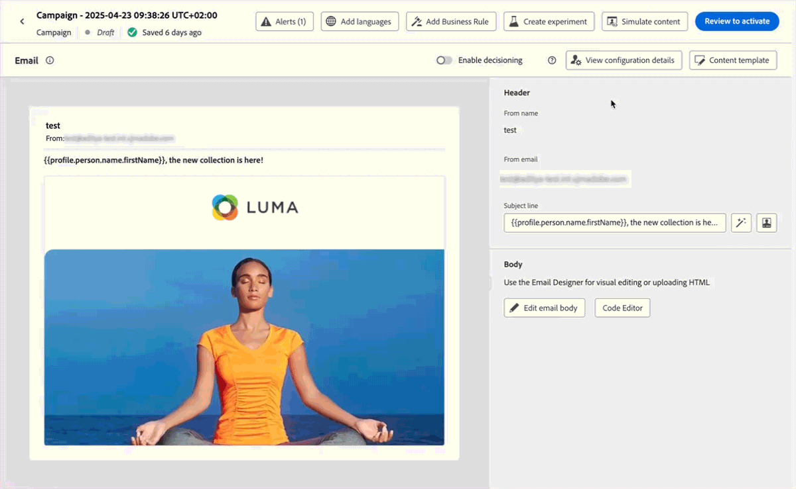
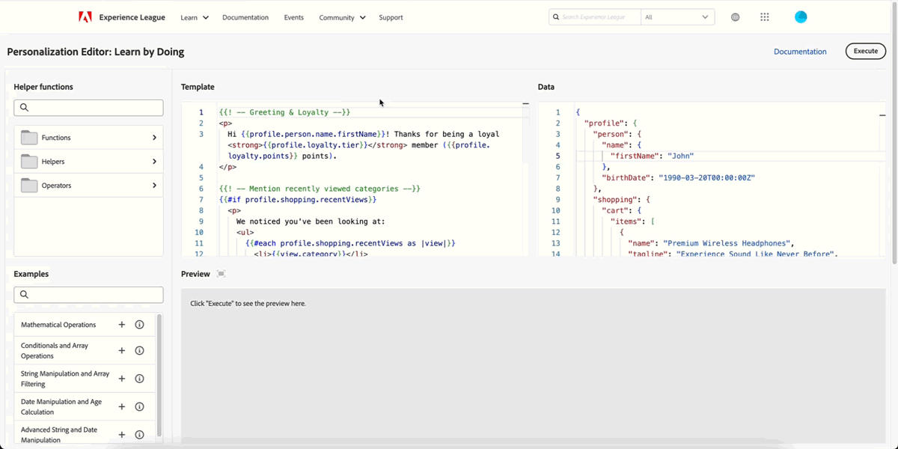
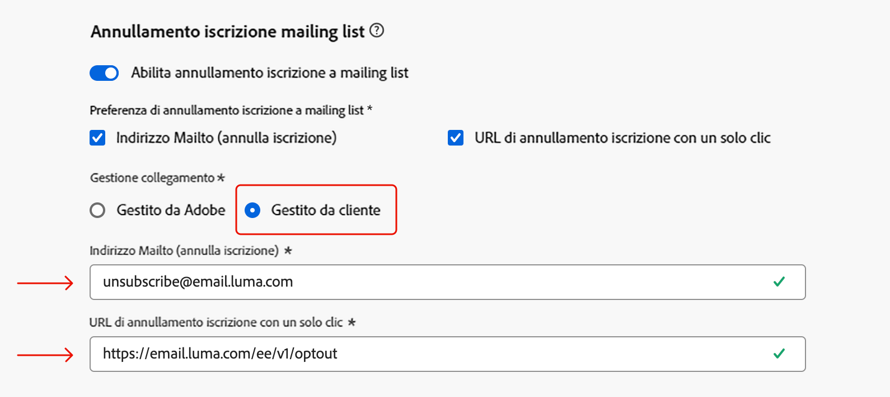

# Note sulle versioni 2025 {#release-notes-2025}

In questa pagina sono elencate tutte le funzioni e i miglioramenti di [!DNL Journey Optimizer] rilasciati nel 2025.

## Note sulla versione di settembre 2025 {#25-9-rn}

**Data di rilascio**: 23-24 settembre 2025

### Nuove funzionalità {#sept-25-9-features}

<table>
<thead>
<tr>
<th><strong>Journey Optimizer Experimentation Accelerator</strong> </th>
</tr>
</thead>
<tbody>
<tr>
<td>

Journey Optimizer Experimentation Accelerator è un prodotto di intelligenza artificiale progettato migliorare ulteriormente la sperimentazione. Creato per gli utenti di Adobe Journey Optimizer e Adobe Target, unifica la gestione degli esperimenti, fornisce informazioni e opportunità basate sull’intelligenza artificiale e introduce un nuovo agente di sperimentazione.

Potrai scoprire:

<ul>
<li><strong>Inventario unificato degli esperimenti:</strong> visualizza, filtra e gestisci rapidamente tutti gli esperimenti da Adobe Journey Optimizer e Adobe Target in un’unica area di lavoro centrale.</li>
<li><strong>Insight e opportunità sull’esperimento IA:</strong> supera la semplice lettura dei dati con insight e consigli basati sull’intelligenza artificiale generativa. Ciascun esperimento ora evidenzia opportunità utilizzabili, corredate da motivazioni a supporto, in modo che i team possano decidere con maggiore sicurezza cosa testare successivamente.</li>
<li><strong>Supporto Multi-Armed Bandit (MAB) in Journey Optimizer:</strong> massimizza l’impatto riducendo il traffico sprecato con esperimenti Multi-Armed Bandit. Invece di suddividere i tipi di pubblico in modo uniforme, il MAB assegna automaticamente più visitatori alle varianti con le prestazioni migliori in tempo reale, in modo da poter fornire esperienze di maggior valore a una clientela più elevata e continuando ad apprendere al tempo stesso che cosa funziona.</li></ul>

Per ulteriori informazioni, consulta la <a href="https://experienceleague.adobe.com/en/docs/experimentation-accelerator/using/overview">documentazione dettagliata</a>

Data di disponibilità: 3 ottobre 2025

</td>
</tr>
</tbody>
</table>

<table>
<thead>
<tr>
<th><strong>L’Agente Journey è ora disponibile.</strong> </th>
</tr>
</thead>
<tbody>
<tr>
<td>

Basato su <a href="https://experienceleague.adobe.com/it/docs/experience-cloud-ai/experience-cloud-ai/agents/agent-orchestrator" target="_blank">Adobe Experience Platform Agent Orchestrator</a>, l’Agente Journey è disponibile in Journey Optimizer. Consente di analizzare i percorsi attraverso un’interfaccia in linguaggio naturale. L’agente rileverà i conflitti di pubblico o di pianificazione e gli abbandoni del profilo in un percorso per aiutarti a risolverli. Presto, potrai creare percorsi con supporto agentico.

Per ulteriori informazioni, consulta la <a href="https://experienceleague.adobe.com/it/docs/experience-cloud-ai/experience-cloud-ai/agents/ajo-agent-analyze" target="_blank">documentazione dettagliata</a>

Data di disponibilità: 24 settembre 2025

</td>
</tr>
</tbody>
</table>

<table>
<thead>
<tr>
<th><strong>Modalità scura in E-mail designer</strong> </th>
</tr>
</thead>
<tbody>
<tr>
<td>

E-mail designer di Journey Optimizer ora offre la possibilità di passare alla visualizzazione in modalità scura, in cui è possibile definire anche impostazioni personalizzate specifiche da mostrare solo per i destinatari che leggono le e-mail in modalità scura.

Si noti quanto segue:

<ul>
<li>Il rendering finale in modalità scura può variare e dipende dal client e-mail del destinatario.</li>
<li>Non tutti i client e-mail supportano la modalità scura personalizzata. Inoltre, alcuni client e-mail applicano soltanto la propria modalità scura predefinita per tutte le e-mail ricevute. In entrambi i casi, non è possibile eseguire il rendering delle impostazioni personalizzate definite in E-mail designer.</li>
</ul>

Per ulteriori informazioni, consulta la <a href="../email/dark-mode.md">documentazione dettagliata</a>

 
Data di disponibilità: 16 settembre 2025

</td>
</tr>
</tbody>
</table>

<table>
<thead>
<tr>
<th><strong>Ottimizzazione del percorso</strong> </th>
</tr>
</thead>
<tbody>
<tr>
<td>

Utilizza la nuova funzione Ottimizza nodo per eseguire il targeting di tipi di pubblico specifici oppure esegui test A/B per determinare il percorso migliore per soddisfare i KPI incentrati sull’azienda.

Questo strumento consente di testare e variare e di personalizzare le comunicazioni, la sequenza e la tempistica per raggiungere al meglio la clientela.

Questa funzionalità è in disponibilità limitata. Per ottenere l’accesso, contatta il rappresentante Adobe.

Per ulteriori informazioni, consulta la <a href="../building-journeys/optimize.md">documentazione dettagliata</a>

Data di disponibilità: 4 settembre 2025

</td>
</tr>
</tbody>
</table>

<table>
<thead>
<tr>
<th><strong>Metodo di delega personalizzato per sottodomini</strong> </th>
</tr>
</thead>
<tbody>
<tr>
<td>

Oltre alla delega completa e al metodo CNAME, ora è disponibile un nuovo metodo di configurazione del sottodominio: il metodo di delega personalizzata consente di controllare e gestire completamente tutti gli aspetti del DNS necessari per la consegna, il rendering e il tracciamento dei messaggi.

Questa funzionalità è in disponibilità limitata. Per ottenere l’accesso, contatta il rappresentante Adobe.

Per ulteriori informazioni, consulta la <a href="../configuration/delegate-custom-subdomain.md">documentazione dettagliata</a>

Data di disponibilità: 4 settembre 2025

</td>
</tr>
</tbody>
</table>

<table>
<thead>
<tr>
<th><strong>Utilizza i dati di Adobe Experience Platform per la personalizzazione e la funzione Decisioni</strong> </th>
</tr>
</thead>
<tbody>
<tr>
<td>

Precedentemente rilasciata in versione Beta pubblica, questa funzionalità è ora disponibile per tutti gli ambienti. Con questa versione, sono stati introdotti i seguenti miglioramenti:

<ul><li>Supporto per la personalizzazione della ricerca di set di dati nei canali in entrata.</li>
<li>È ora possibile utilizzare la funzione helper “datasetLookup” nei frammenti di espressione. Per il momento, questa funzionalità è disponibile per una parte limitata della clientela. Per potervi accedere, contatta il tuo rappresentante Adobe.</li>
<li>Un’opzione nell’interfaccia per la gestione del set di dati ora consente di abilitare i set di dati basati su record per la personalizzazione della ricerca, senza dover eseguire una chiamata API.</li>
<li>Il monitoraggio è stato migliorato per tenere traccia dello stato di acquisizione dei dati e sapere quando i set di dati sono pronti per la ricerca.</li>
<li>Le linee guida e i guardrail di utilizzo sono stati aggiornati per garantire prestazioni e affidabilità ottimali.</li>
<li>Ora è possibile sfruttare i set di dati di Adobe Experience Platform nelle regole di limitazione della funzione Decisioni.</li></ul>

Per ulteriori informazioni, consulta la <a href="../data/lookup-aep-data.md">documentazione dettagliata</a>

Data di disponibilità: 1 settembre 2025

</td>
</tr>
</tbody>
</table>

### Miglioramenti {#sept-25-9-improvements}

* **Supporto webhook per campagne attivate da API**\
  Le campagne attivate da API ora supportano i webhook. Configura un URL del webhook per ricevere aggiornamenti di stato in tempo reale per ogni messaggio, migliorando l’osservabilità e abilitando un monitoraggio e un’automazione semplici. [Ulteriori informazioni](../configuration/feedback-webhooks.md)

  Data di disponibilità: 29 settembre 2025

* **Supporto mTLS per il canale SMS**
Durante la configurazione di un provider SMS personalizzato, ora puoi abilitare l’autenticazione TLS reciproca (mTLS), che richiede sia al client che al server di confermare reciprocamente la propria identità prima che venga stabilita una connessione sicura. [Ulteriori informazioni](../sms/sms-configuration-custom.md) - Data di disponibilità: 23 settembre 2025

* **Schemi basati su modelli**\
  Gli schemi basati su modelli possono ora essere utilizzati per supportare le esigenze di modellazione relazionale nelle campagne orchestrate. [Ulteriori informazioni](../orchestrated/gs-schemas.md) - Data di disponibilità: 23 settembre 2025

* **Supporto per la ricerca di set di dati in percorsi**\
  Una nuova attività nei percorsi, **Ricerca set di dati**, consente di recuperare dinamicamente i dati dai set di dati dei record di Adobe Experience Platform durante il runtime. Sfruttando questa funzionalità, puoi accedere ai dati che potrebbero non trovarsi nel profilo o nel payload dell’evento, garantendo che le interazioni della clientela siano pertinenti e tempestive. [Ulteriori informazioni](../building-journeys/dataset-lookup.md) - Data di disponibilità: 23 settembre 2025

  Questa attività è disponibile solo per un set di organizzazioni (disponibilità limitata). Per potervi accedere, contatta il tuo rappresentante Adobe.

* **Supporto del reindirizzamento nelle azioni personalizzate del percorso**\
  I reindirizzamenti (302) sono ora supportati nelle azioni personalizzate del percorso. - Data di disponibilità: 23 settembre 2025

* **Avvisi di monitoraggio della configurazione dei canali**: nel caso si verifichi un errore di configurazione dei canali e-mail utilizzando il tipo di delega dei sottodomini personalizzato, ora è possibile iscriversi per ricevere avvisi di sistema, tramite e-mail o nel centro notifiche di Journey Optimizer. [Ulteriori informazioni](../reports/alerts.md#alert-channel-config-failure) - Data di disponibilità: 23 settembre 2025

* **Richieste di annullamento dell’iscrizione con un solo clic**: sono stati introdotti miglioramenti che rafforzano ulteriormente la gestione delle richieste di annullamento dell’iscrizione con un solo clic configurate in Gestito da Adobe, garantendo un’elaborazione affidabile e coerente. - Data di disponibilità: 23 settembre 2025

* **I parametri del corpo JSON nidificati sono ora supportati nell’autenticazione personalizzata**\
  Durante la configurazione dell’autenticazione personalizzata per un’azione personalizzata, sono ora supportati gli oggetti JSON nidificati (ad esempio, oggetti secondari all’interno di `bodyParams`). [Ulteriori informazioni](../datasource/external-data-sources.md#custom-authentication-mode) - Data di disponibilità: 18 settembre 2025

* **Ripristina quota limite oraria**: ora è possibile applicare una limitazione su base oraria per i set di regole del canale. Precedentemente disponibile in disponibilità limitata, questa funzionalità è ora disponibile per tutti gli ambienti e consente di scegliere 1 ora (in precedenza 3 ore). [Ulteriori informazioni](../conflict-prioritization/channel-capping.md) - Data di disponibilità: 17 settembre 2025

* **Simulazione delle varianti di contenuto per tutti i canali in entrata**\
  Precedentemente disponibile solo per i canali di notifica e-mail, SMS e push, la simulazione delle varianti di contenuto ora si applica anche a tutti i canali in entrata. [Ulteriori informazioni](../test-approve/simulate-sample-input.md) - Data di disponibilità: 17 settembre 2025

* **Espressioni per le regole di limitazione della funzione Decisioni**: è ora possibile creare espressioni personalizzate per definire la soglia di una regola di limitazione per un elemento decisionale. [Ulteriori informazioni](../experience-decisioning/items.md#capping) - Data di disponibilità: 16 settembre 2025

* **Supporto di domini dinamici**: Journey Optimizer ora supporta la personalizzazione dell’URL completa/di base per i domini predefiniti accettati da Adobe. [Ulteriori informazioni](../personalization/personalization-build-expressions.md#where) - Data di disponibilità: 12 settembre 2025

  Questa funzionalità è in disponibilità limitata per una parte della clientela.

* **Webhook**: in questa versione sono stati introdotti i seguenti miglioramenti per i webhook durante la configurazione di un provider SMS personalizzato:

   * Ora puoi definire lo scopo del webhook, in entrata o di feedback, a seconda del tipo di dati che desideri acquisire. [Ulteriori informazioni](../sms/sms-configuration-custom.md#webhook) - Data di disponibilità: 23 settembre 2025

   * La configurazione delle parole chiave è ora più semplice grazie a un’interfaccia migliore. [Ulteriori informazioni](../sms/sms-configuration-custom.md#webhook) - Data di disponibilità: 23 settembre 2025

* **SMS**

   * Durante la configurazione di un provider SMS personalizzato, è ora possibile definire una parola chiave **predefinita** da utilizzare quando un SMS in arrivo contiene una parola chiave non riconosciuta. Puoi anche creare parole chiave **personalizzate** per azioni specifiche. [Ulteriori informazioni](../sms/sms-configuration-custom.md) - Data di disponibilità: 23 settembre 2025

   * È ora possibile accedere alle risposte di parole chiave in entrata non definite inviate tramite un messaggio SMS, inclusi refusi, parole o frasi non esplicitamente definite nella configurazione. Vengono archiviate nel set di dati **Evento esperienza di tracciamento email di AJO**, in **InboundMessage** per 13 mesi. Disponibile solo con Sinch, Infobip e provider SMS personalizzati. Data di disponibilità: 23 settembre 2025

## Note sulla versione di agosto 2025 {#25-8-rn}

**Data di rilascio**: 19 agosto 2025

### Nuove funzionalità {#Aug-25-8-features}

Di seguito sono descritte le nuove funzionalità incluse in questa versione.

<table>
<thead>
<tr>
<th><strong>Mettere in pausa e riprendere i percorsi</strong> </th>
</tr>
</thead>
<tbody>
<tr>
<td>

È ora possibile mettere in pausa e riprendere i percorsi. Questa funzionalità offre ai professionisti del percorso maggiore controllo e flessibilità, consentendo di sospendere temporaneamente i percorsi live senza compromettere l’esperienza cliente. Quando il percorso è in pausa, le comunicazioni non vengono inviate e i profili rimangono in stato di sospensione fino a quando il percorso non viene ripreso.

È possibile mettere in pausa e riprendere un singolo percorso, oppure eseguire operazioni di pausa e di ripresa in blocco su un gruppo di percorsi.

Inoltre, puoi applicare ai percorsi in pausa i criteri di uscita basati sugli attributi del profilo (precedentemente denominati "filtri globali") per escludere i profili in base ai loro attributi.

Precedentemente rilasciata in disponibilità limitata, questa funzionalità è ora disponibile per tutti gli ambienti (disponibilità generale).

Per ulteriori informazioni, consulta la <a href="../building-journeys/journey-pause.md">documentazione dettagliata</a>

</td>
</tr>
</tbody>
</table>

<table>
<thead>
<tr>
<th><strong>Vista calendario</strong> </th>
</tr>
</thead>
<tbody>
<tr>
<td>

Negli elenchi dei percorsi e delle campagne è ora disponibile una vista calendario. Consente di visualizzare tutte le attivazioni dei percorsi e delle campagne nei rispettivi elenchi.

Precedentemente rilasciata in versione a disponibilità limitata, questa funzione è ora disponibile per tutti gli ambienti. Con questa versione in disponibilità generale, la funzione include:

<ul>
<li>Miglioramenti della progettazione per la navigazione tra date.</li>
<li>Possibilità di visualizzare le campagne di bozza se hai impostato una data di inizio e una data di fine</li>
<li>Nuova impostazione per nascondere e visualizzare gli elementi del calendario in esecuzione per molto tempo.</li>
</ul>

Per ulteriori informazioni, consulta la <a href="../building-journeys/journey-ui.md#calendar">documentazione dettagliata</a>

</td>
</tr>
</tbody>
</table>

<!--table>
<thead>
<tr>
<th><strong>Use Adobe Experience Platform data for personalization</strong> </th>
</tr>
</thead>
<tbody>
<tr>
<td>

Leverage data from [!DNL Adobe Experience Platform] in the personalization editor to personalize your content and decision attributes. In particular, this allows you to extend the definition of your attributes to additional data in datasets for bulk updates that change periodically without having to manually update the attributes one at a time.

With this release, the following enhancements have been introduced:

<ul>
<li>Support of inbound channels,</li>
<li>The "datasetLookup" helper function can now be used within expression and visual fragments to personalize content using data from Adobe Experience Platform datasets,</li>
<li>An option in the dataset now allows you to enable datasets for lookup personalization, without having to perform an API call.</li>
</ul>

This capability is available in Limited Availability. Contact your Adobe representative to gain access.

For more information, refer to the <a href="../personalization/aep-data-perso.md">detailed documentation</a>

</td>
</tr>
</tbody>
</table-->

<!--table>
<thead>
<tr>
<th><strong>Use Decisioning in email channel</strong> </th>
</tr>
</thead>
<tbody>
<tr>
<td>

You can now add Decision policies into email journeys and campaigns. Decision policies are containers for your offers that leverage the Decisioning engine to dynamically return the best content to deliver for each audience member.

Previously released in Limited Availability, this capability is now available to all environments (General Availability).

<For more information, refer to the <a href="../FILE.md">detailed documentation</a>

</td>
</tr>
</tbody>
</table-->

<table>
<thead>
<tr>
<th><strong>Attività di azione nei percorsi</strong> </th>
</tr>
</thead>
<tbody>
<tr>
<td>

Journey Optimizer supporta una nuova attività Azione generica che consente di configurare sia azioni singole che gruppi di azioni multiple in uscita, semplificandone la configurazione nell’area di lavoro del percorso. In particolare, questa nuova funzione consente:

<ul>
<li>Una configurazione semplificata dell’azione nativa nell’area di lavoro del percorso.</li>
<li>La capacità di creare gruppi di azioni in entrata con più azioni.</li>
<li>La possibilità di aggiungere l’ottimizzazione a qualsiasi azione del canale incorporata.</li>
<li>La possibilità di aggiungere sia opzioni di sperimentazione che opzioni multilingue a qualsiasi azione.</li>
</ul>

Questa funzionalità è in disponibilità limitata. Per ottenere l’accesso, contatta il rappresentante Adobe.

Per ulteriori informazioni, consulta la <a href="../building-journeys/journey-action.md">documentazione dettagliata</a>

</td>
</tr>
</tbody>
</table>

<table>
<thead>
<tr>
<th><strong>Allegati PDF alle e-mail</strong> </th>
</tr>
</thead>
<tbody>
<tr>
<td>

Ora è possibile allegare un file PDF statico a un messaggio e-mail inviato con Journey Optimizer.

<ul>
<li>Puoi inviare fino a 6 messaggi con un allegato PDF per profilo all’anno.</li>
<li>La dimensione massima del file consentita per ciascun allegato è di 5 MB.</li>
<li>Per ulteriori dimensioni o volumi, è possibile acquistare un componente aggiuntivo per il pacchetto di allegati. Per ulteriori informazioni, contatta il tuo rappresentante Adobe.</li>
</ul>

Questa funzionalità è in disponibilità limitata. Per ottenere l’accesso, contatta il rappresentante Adobe.

Per ulteriori informazioni, consulta la <a href="../email/pdf-attachments.md">documentazione dettagliata</a>

</td>
</tr>
</tbody>
</table>

<!--
<table>
<thead>
<tr>
<th><strong>Landing page custom forms</strong> </th>
</tr>
</thead>
<tbody>
<tr>
<td>

With [!DNL Journey Optimizer], you can now capture profile attributes though your landing pages.

Create, design and manage custom forms tailored to your needs based on a specific dataset. You can then leverage these forms in landing pages to add the profile attributes of your choice into the dataset defined for each form.

This capability is currently in beta version and only available to beta customers. To join the beta program, contact your Adobe representative.

For more information, refer to the <a href="../FILE.md">detailed documentation</a>

</td>
</tr>
</tbody>
</table>
-->

<table>
<thead>
<tr>
<th><strong>Ottimizzazione nelle campagne</strong> </th>
</tr>
</thead>
<tbody>
<tr>
<td>

Journey Optimizer ora offre gli strumenti necessari per fornire al pubblico contenuti personalizzati e ottimizzati, consentendoti di eseguire esperimenti sui contenuti, creare targeting basato su regole e utilizzare combinazioni avanzate di entrambi per ottimizzare l’efficacia delle campagne.

Con l'ottimizzazione è possibile:

<ul>
<li>Testare più varianti di contenuto per identificare la messaggistica più efficace.</li>
<li>Distribuire contenuti personalizzati in base agli attributi utente e ai dati contestuali.</li>
<li>Combinare targeting e sperimentazione per strategie avanzate.</li>
<li>Escludere gli utenti che non corrispondono ai criteri della variante.</li>
<li>Includere meccanismi di fallback per mantenere vivo il coinvolgimento dell’utente.</li>
</ul>

Una volta che la campagna o il percorso sono attivi, i profili vengono valutati in base ai criteri definiti e vengono consegnati con l’esperienza o il contenuto appropriato in base ai criteri di corrispondenza.

Precedentemente rilasciata l’8 agosto solo nelle campagne, questa funzione è ora disponibile anche nei percorsi a partire dal 22 agosto.

Per ulteriori informazioni, consulta la <a href="../campaigns/campaigns-message-optimization.md">documentazione dettagliata</a>

</td>
</tr>
</tbody>
</table>

### Miglioramenti {#Aug-25-8-improv}

Di seguito sono elencati i miglioramenti inclusi in questa versione.

* **Amministrazione**

   * **Avvisi di monitoraggio della configurazione dei canali**: ora puoi abbonarti per ricevere avvisi di sistema, tramite e-mail o nel centro notifiche di Journey Optimizer, quando <!--a channel configuration failure happens or if -->manca un record DNS. [Ulteriori informazioni](../reports/alerts.md#alert-dns-record-missing)

* **Assistente IA**

   * **Generazione di contenuti in più lingue**: il contenuto può essere generato in diverse lingue, tra cui francese, spagnolo, tedesco, italiano, giapponese, svedese, olandese e norvegese. [Ulteriori informazioni](../content-management/generative-uc.md#languages)

     Data di disponibilità: 25 agosto

* **Campagne**

   * **Controllo della frequenza nelle campagne in uscita**: ora puoi abilitare il controllo della frequenza per le campagne in uscita (e-mail, SMS, notifiche push), consentendo di evitare il sovraccarico sui sistemi a valle, come le pagine di destinazione o le piattaforme di assistenza clienti. [Ulteriori informazioni](../campaigns/campaign-schedule.md#rate-control)

   * **Pianificazione delle campagne di azione**: le pianificazioni giornaliere, settimanali e mensili della campagna sono state aggiornate per fornire un controllo più dettagliato sulle pianificazioni ricorrenti:

      * **Ricorrenza settimanale**: ora è possibile scegliere di ripetere la campagna ogni settimana o ogni due settimane e selezionare il giorno o i giorni della settimana in cui deve essere eseguita.

      * **Ricorrenza mensile**: ora è possibile scegliere di ripetere la campagna ogni mese o a mesi alterni e selezionare il giorno del mese in cui deve essere eseguita.

      * **Pianificazioni giornaliere, settimanali o mensili**: ora è possibile specificare se la pianificazione ricorrente deve terminare in una data specifica o dopo un determinato numero di occorrenze.

   * **Campagne programmate per azioni transazionali**: le campagne programmate per azioni transazionali sono ora disponibili per l’invio di comunicazioni transazionali batch e basate sul pubblico tramite canali e-mail, SMS e push.

* **Canale: schede contenuto**

   * **Modelli layout per schede di contenuto**: il canale della scheda di contenuto ora fornisce layout di messaggi OOTB che semplificano l’esperienza di authoring. Questa versione include i modelli layout Immagine piccola, Immagine grande e Solo immagine. [Ulteriori informazioni](../content-card/design-content-card.md)

* **Canale - Push**

   * **Data di scadenza notifica push**: ora è possibile specificare una data di scadenza per ogni notifica push, impedendo l’invio di messaggi urgenti (come quelli delle offerte del Black Friday) dopo una determinata data, evitando quindi di fornire esperienze scadenti alla clientela.

* **Canale - SMS**

   * **Rinuncia parziale**: se abilitata, l’opzione **Rinuncia parziale** rileva i messaggi in entrata più simili alle parole chiave di rinuncia definite (ad esempio, “CANCIL”) e invia automaticamente una risposta di conferma per verificare l’intenzione dell’utente di annullare l’iscrizione. Se l’utente conferma tramite il prompt definito, l’iscrizione viene annullata. [Ulteriori informazioni](../sms/sms-configuration-sinch.md)

     >[!NOTE]
     >
     >**Rinuncia parziale** è disponibile solo con Sinch e Infobip.

   * **Verifica connessione SMS**: ora puoi testare e verificare facilmente le credenziali API SMS all’interno di Adobe Journey Optimizer inviando un messaggio di esempio a un dispositivo designato. [Ulteriori informazioni](../sms/sms-configuration-sinch.md)

* **Configurazione**

   * **Supporto di attributi personalizzati con URL di annullamento dell’iscrizione con un solo clic**: con Journey Optimizer, se il consenso è gestito al fuori di Adobe, è possibile impostare un endpoint personalizzato esterno definendo un collegamento per l’annullamento dell’iscrizione con un solo clic nella configurazione dell’e-mail. Quando i destinatari fanno clic sul collegamento di annullamento dell’iscrizione, Journey Optimizer aggiunge alcuni parametri predefiniti specifici del profilo all’evento di aggiornamento del consenso.

     Per personalizzare ulteriormente il collegamento di annullamento dell’iscrizione con un solo clic, ora è possibile definire gli attributi personalizzati che verranno aggiunti all’evento di consenso. [Ulteriori informazioni](../email/list-unsubscribe.md#custom-attributes)

* **Set di dati**

   * **Archivio oggetti delle decisioni per le esperienze - Elementi dell’offerta personalizzati**: il set di dati di esportazione incorporato ora acquisisce tutti gli attributi dell’offerta e lo stato del ciclo di vita, consentendo la personalizzazione e il reporting completi. [Ulteriori informazioni](../data/export-datasets.md)

   * È stata introdotta il controllo della versione tramite il campo `etag` per migliorare la coerenza e tenere traccia delle modifiche per offrire elementi in modo più affidabile.

* **Funzione Decisioni**

   * **Allega frammenti agli elementi decisionali**: Journey Optimizer ora consente di allegare agli elementi decisionali frammenti che possono essere utilizzati nelle campagne di esperienza basata su codice tramite i criteri di decisione. Questa funzionalità è in disponibilità limitata per una parte della clientela. [Ulteriori informazioni](../experience-decisioning/create-decision.md#fragments)

* **Percorsi**

   * **Operazioni del percorso in blocco**: dall’elenco dei tuoi percorsi, ora puoi selezionare più elementi. Una volta selezionati, puoi sospendere o riprendere fino a 10 percorsi alla volta.

   * **Supporto di reindirizzamento (302) nelle azioni personalizzate**: le azioni personalizzate possono ora gestire i reindirizzamenti HTTP 302 in base a una richiesta. Questo consente ai percorsi di integrarsi con le API che reindirizzano le richieste a URL localizzati o specifici di un’area geografica. I reindirizzamenti vengono seguiti automaticamente, garantendo che il contenuto corretto venga distribuito senza configurazioni aggiuntive.

   * **Più azioni in entrata nei percorsi**: per semplificare l’orchestrazione del percorso, ora puoi definire più azioni in entrata in un singolo percorso. Precedentemente disponibile nelle campagne, questa funzionalità consente di distribuire contemporaneamente verso posizioni diverse più esperienze basate su codice, messaggi in-app, schede di contenuto o azioni web, ciascuna con un contenuto specifico. [Ulteriori informazioni](../building-journeys/journey-action.md#multi-action)

## Orchestrazione della campagna

**Data di disponibilità**: 4 agosto 2025

Journey Optimizer ora include l’ **orchestrazione della campagna**, una nuova funzionalità appositamente creata per le campagne batch avviate dal brand. Questa versione introduce un’area di lavoro di orchestrazione della campagna e una modellazione dati migliorata, per consentire ai marketer di pianificare, eseguire il targeting e distribuire campagne cross-channel personalizzate.

>[!IMPORTANT]
>
>Per accedere all’orchestrazione della campagna, la licenza deve includere il pacchetto **Journey Optimizer - Campagne e Percorsi** o **Journey Optimizer - Campagne**. Contatta il tuo rappresentante Adobe per confermare la licenza e aggiornare, se necessario.

Include [Schemi relazionali e set di dati](#oc-relational) e [Area di lavoro della campagna](#oc-canvas). Insieme, queste due innovazioni sbloccano un nuovo standard per l’orchestrazione di campagne batch in Journey Optimizer. Le funzionalità principali sono elencate di seguito.

### Funzionalità principali {#oc-capabilities}

* **Flussi di lavoro con più passaggi**

  Promuovi sofisticate campagne batch multicanale con la nuova area di lavoro appositamente creata per l’orchestrazione delle campagne.

* **Tipi di pubblico on-demand**

  Segmentazione dei tipi di pubblico on-demand per l’attivazione immediata.

* **Segmentazione di più entità**

  Crea tipi di pubblico utilizzando il contesto aziendale (dimensioni non basate sulle persone) come prodotti, negozi, rinnovi, prenotazioni e altro ancora.

* **Visibilità pre-invio**

  Rivedi, perfeziona e ottimizza i tipi di pubblico e le campagne prima del lancio e durante l’esecuzione delle campagne

### Area di lavoro della campagna {#oc-canvas}

Una nuova interfaccia di orchestrazione visiva creata appositamente per le campagne batch. Questa area di lavoro consente:

* la pianificazione visiva dei flussi di campagne multicanale in più passaggi

* il supporto per tipi di pubblico on-demand creati da query relazionali

* la divisione avanzata del pubblico, attese e logica condizionale

* i conteggi precisi pre-invio dopo l’applicazione di regole di business e filtri

### Schemi relazionali e set di dati {#oc-relational}

Adobe Journey Optimizer ora supporta entità relazionali (ad esempio prodotti, negozi, prenotazioni, contratti) collegate ai profili basati sulle persone. Questo permette la segmentazione e la personalizzazione tra strutture di dati multidimensionali, consentendo casi d’uso come:

* Un messaggio per prenotazione, abbonamento o contratto

* La segmentazione basata su attributi di entità correlati (ad esempio, categoria di prodotto o ubicazione del negozio)

* Una migliore indirizzabilità (ad esempio, l’invio a tutti i contatti noti associati a un’entità)

### Perché è importante

Questa versione offre ai marketer il controllo completo sul marketing in batch avviato dal brand e basato sul pubblico, combinando una modellazione flessibile dei dati con un’esperienza di orchestrazione creata appositamente. È progettata specificamente per l’orchestrazione di campagne in batch da percorsi in tempo reale, offrendo al contempo personalizzazione e scalabilità avanzate.

### Ulteriori informazioni

Per ulteriori informazioni, consulta la [documentazione sull’orchestrazione della campagna](../orchestrated/gs-orchestrated-campaigns.md).

## Note sulla versione di luglio 2025 {#25-7-rn}

**Data di rilascio**: 29 luglio 2025

### Nuove funzionalità {#features-25-7}

Di seguito sono descritte le nuove funzionalità incluse in questa versione.

#### Funzioni

<table>
<thead>
<tr>
<th><strong>Brand</strong> </th>
</tr>
</thead>
<tbody>
<tr>
<td>

Ora puoi creare e personalizzare i brand per definire chiaramente la tua identità visiva e verbale nelle comunicazioni. Con il punteggio di allineamento al brand, puoi ricevere feedback in tempo reale su come il contenuto riflette il tono, lo stile e le linee guida del tuo brand, affinché ogni messaggio inviato sia sempre allineato al brand.

Precedentemente rilasciata in versione Beta, questa funzionalità è ora disponibile per tutti gli ambienti (disponibilità generale).

Per ulteriori informazioni, consulta la <a href="../content-management/brands.md">documentazione dettagliata</a>.

</td>
</tr>
</tbody>
</table>

<table>
<thead>
<tr>
<th><strong>Utilizzare la funzione Decisioni nel canale e-mail</strong> </th>
</tr>
</thead>
<tbody>
<tr>
<td>

Ora puoi aggiungere i criteri di decisione in percorsi e campagne e-mail. I criteri di decisione sono contenitori per le offerte che sfruttano il motore di Decisione per restituire in modo dinamico il contenuto migliore da consegnare per ogni membro del pubblico.

Questa funzionalità è in disponibilità limitata. Per ottenere l’accesso, contatta il rappresentante Adobe.

Per ulteriori informazioni, consulta la <a href="../experience-decisioning/create-decision.md">documentazione dettagliata</a>

</td>
</tr>
</tbody>
</table>

<table>
<thead>
<tr>
<th><strong>Canale LINE</strong> </th>
</tr>
</thead>
<tbody>
<tr>
<td>

Adobe Journey Optimizer ha ampliato le sue funzionalità cross-channel per includere il supporto per il canale LINE. Questo miglioramento consente di creare, modificare e visualizzare in anteprima le esperienze LINE, permettendo interazioni più personalizzate e coinvolgenti. Con LINE, puoi connetterti con più clientela, inviare contenuti rilevanti e migliorare il coinvolgimento.

In precedenza solo su richiesta, il canale LINE è ora disponibile per tutti gli utenti (disponibilità generale).

Per ulteriori informazioni, consulta la <a href="../../rp_landing_pages/line-landing-page.md">documentazione dettagliata</a>.
</td>
</tr>
</tbody>
</table>

<table>
<thead>
<tr>
<th><strong>Esecuzione di prova del percorso</strong> </th>
</tr>
</thead>
<tbody>
<tr>
<td>

La prova del percorso è una modalità speciale di pubblicazione di un percorso in Adobe Journey Optimizer che consente ai professionisti del percorso di poterne effettuare un test, utilizzando dati di produzione reali e senza la necessità di contattare la clientela reale o aggiornare le informazioni di profilo. Questa funzione aiuta i professionisti del percorso ad acquisire maggiore sicurezza rispetto alla progettazione di un percorso e al targeting del pubblico, prima della pubblicazione effettiva.

Precedentemente rilasciata in disponibilità limitata, questa funzionalità è ora disponibile per tutti gli ambienti (disponibilità generale).

Per ulteriori informazioni, consulta la <a href="../building-journeys/journey-dry-run.md">documentazione dettagliata</a>

</td>
</tr>
</tbody>
</table>

<table>
<thead>
<tr>
<th><strong>ID supplementare per i percorsi</strong> </th>
</tr>
</thead>
<tbody>
<tr>
<td>

Ora puoi attivare i percorsi utilizzando un ID profilo insieme a un altro identificatore, ad esempio un ID ordine, un ID abbonamento o un ID prescrizione, affinché un profilo possa nello stesso percorso più volte allo stesso tempo. Questo consente scenari come la gestione di più ordini o abbonamenti in parallelo, con ogni istanza che segue il proprio iter lungo il percorso.

Precedentemente rilasciato in disponibilità limitata, l’utilizzo di ID supplementari nei percorsi è ora disponibile per tutti gli ambienti. Con questa versione con disponibilità generale, la funzione ora include il supporto per i percorsi Leggi pubblico.

Per ulteriori informazioni, consulta la <a href="../building-journeys/supplemental-identifier.md">documentazione dettagliata</a>

</td>
</tr>
</tbody>
</table>

### Avvisi all’interno del prodotto

Ora puoi iscriverti agli **avvisi e-mail e nel prodotto** in merito al rilascio di nuove versioni di Journey Optimizer.

Per iscriverti:

* Passa a **Preferenze di Adobe Experience Cloud**
* In **Notifiche**, individua **Nuove versioni di Journey Optimizer**
* Abilitare le notifiche in-app ed e-mail

{width="70%" align="left"}

### Modifica nelle condizioni di percorso {#ee-change@}

A partire dall’8 luglio, nelle nuove organizzazioni della clientela, la creazione di espressioni basate sugli eventi esperienza non è più supportata nell’editor di espressioni utilizzato nelle condizioni del percorso. Di conseguenza, gli eventi esperienza nell’[origine dati di Experience Platform](../datasource/adobe-experience-platform-data-source.md) non possono essere utilizzati per la creazione di espressioni. Si fa riferimento ad approcci alternativi e best practice per la creazione di espressioni/logiche con eventi esperienza [qui](../building-journeys/exp-event-lookup.md).

Il modo in cui viene effettuato l’accesso ai dati dell’evento di contesto del percorso nei percorsi unitari rimane invariato. Negli editor di espressioni e di personalizzazione, gli utenti possono continuare ad accedere ai dati trasmessi con l’evento del percorso iniziale.

Per ulteriori informazioni, consulta [queste Domande frequenti](../building-journeys/exp-event-lookup.md#faq-ee).

### Miglioramenti {#25-7-improv}

Di seguito sono elencati i miglioramenti inclusi in questa versione.

* **Campagne**

   * **Più azioni in entrata nelle campagne**: per semplificare l’orchestrazione della campagna, è ora possibile definire più azioni in entrata in una singola campagna. Questa funzionalità consente di distribuire più esperienze basate su codice, messaggi in-app, schede di contenuto o azioni web in posizioni diverse contemporaneamente, ogni azione contenente un contenuto specifico.
     [Ulteriori informazioni](../campaigns/campaign-action.md#multi-action)

   * **Riorganizzazione inventario della campagna**: le campagne pianificate e attivate da API sono ora suddivise in schede separate nell’inventario delle campagne per facilitarne la navigazione e la gestione.

[Maggiori informazioni](../campaigns/manage-campaigns.md)

* **Gestione dati**
   * **Aggiornamento dei set di dati del sistema di gestione delle decisioni**: le offerte personalizzate e di fallback eliminate ora sono contrassegnate come archiviate nei set di dati “decision_object_repository_personalized_offers” e “decision_object_repository_fallback_offers”. I record esistenti nel set di dati non vengono modificati.

[Maggiori informazioni](../offers/export-catalog/access-dataset.md)

* **Percorsi**
   * **Miglioramenti degli strumenti sandbox per i percorsi**: durante la copia dei percorsi in più sandbox utilizzando le funzionalità di esportazione e importazione del pacchetto, sono ora disponibili anche le seguenti funzionalità:
      * La selezione di un evento esistente nella destinazione
      * La copia su un evento indipendentemente da un percorso
      * Rilevamento delle relazioni tra gruppi di campi e origini dati, relativo collegamento alla destinazione, se esistenti, creazione delle relazioni in caso contrario.

[Maggiori informazioni](../configuration/copy-objects-to-sandbox.md)

* **Canale - In app**
   * **Coppie chiave/valore in-app**: con i messaggi in-app, puoi definire coppie chiave-valore per includere variabili personalizzate nel payload del messaggio. Queste coppie chiave-valore ti consentono di trasmettere dati aggiuntivi in base alla configurazione e al caso d’uso specifici. [Ulteriori informazioni](../in-app/design-in-app.md)

* **Canale - Scheda contenuto**

   * **Esclusione di una campagna basata su regole**: durante la modifica di regole di consegna aggiuntive, l’opzione Regole di consegna precedente è stata sostituita con tre tipi di regole distinti per verificare meglio la tempistica e la visibilità dei messaggi:
      * Mostra messaggio se: condizioni che determinano quando viene visualizzata la scheda di contenuto.
      * Ignora messaggio se: condizioni che nascondono temporaneamente la scheda di contenuto. Può apparire nuovamente se vengono soddisfatte di nuovo le condizioni di visualizzazione.
      * Escludi messaggio se: condizioni che impediscono definitivamente la visualizzazione della scheda di contenuto.

[Maggiori informazioni](../content-card/design-content-card.md)

* **Funzione Decisioni**
   * **API per strumenti di migrazione**: il team Journey Optimizer sta attualmente lavorando sulle API per strumenti di migrazione per eseguire la migrazione delle entità di gestione delle decisioni nella funzione Decisioni. Questo strumento consente una migrazione semplice tra sandbox con risoluzione delle dipendenze e funzionalità di rollback. Se ti interessa, contatta il tuo rappresentante Adobe.

* **Personalizzazione**
   * All’editor di personalizzazione è stata aggiunta una nuova funzione helper “SHA256”. Questa funzione viene utilizzata per calcolare e restituire l’hash sha256 di una stringa.

[Maggiori informazioni](../personalization/functions/string.md#sha256)

## Note sulla versione di giugno 2025 {#25-6-rn}

**Data di rilascio**: 18 giugno 2025

### Nuove funzionalità {#25-06-features}

Di seguito sono descritte le nuove funzionalità incluse in questa versione.

<table>
<thead>
<tr>
<th><strong>Set di dati di Adobe Experience Platform nella funzione Decisioni (Beta)</strong> </th>
</tr>
</thead>
<tbody>
<tr>
<td>

Precedentemente disponibili per la personalizzazione, i set di dati di Adobe Experience Platform ora possono essere sfruttati per la funzione decisioni. Questo consente di estendere la definizione degli attributi di decisione ai dati aggiuntivi nei set di dati per aggiornamenti in blocco che vengono modificati periodicamente senza dover aggiornare manualmente gli attributi uno alla volta. Ad esempio disponibilità, tempi di attesa e così via.

Questa funzionalità è disponibile per tutta la clientela come versione Beta pubblica. Se desideri accedervi, contatta il rappresentante del tuo account.

Per ulteriori informazioni, consulta la <a href="../experience-decisioning/aep-data-exd.md">documentazione dettagliata</a>.

Data di disponibilità: 20 giugno 2025

</td>
</tr>
</tbody>
</table>

<table>
<thead>
<tr>
<th><strong>Messaggistica RCS</strong> </th>
</tr>
</thead>
<tbody>
<tr>
<td>

Ora puoi configurare, personalizzare e distribuire messaggi RCS (Rich Communication Services) tramite un provider di terze parti, integrando una soluzione personalizzata di un provider SMS.

Per ulteriori informazioni, consulta la <a href="../sms/sms-configuration-custom.md">documentazione dettagliata</a>.

</td>
</tr>
</tbody>
</table>

<table>
<thead>
<tr>
<th><strong>Campi modulo nei contenuti di esperienze basate su codice</strong> </th>
</tr>
</thead>
<tbody>
<tr>
<td>

Ora è possibile definire campi modificabili specifici nei modelli di contenuto JSON o HTML, consentendo agli utenti non tecnici di modificare facilmente il contenuto di una visualizzazione modulo, nell’authoring del canale dell’esperienza basato su codice, senza il bisogno di manipolare alcun codice. Inoltre, durante la definizione dei modelli di contenuto dell’esperienza basati su codice, è ora possibile inserire criteri di decisione nel modello, aumentando la riutilizzabilità e la facilità d’uso.

Per ulteriori informazioni, consulta la <a href="../code-based/code-based-form-fields.md">documentazione dettagliata</a>.

</td>
</tr>
</tbody>
</table>

<!--
<table>
<thead>
<tr>
<th><strong>Custom delegation method for subdomains</strong> </th>
</tr>
</thead>
<tbody>
<tr>
<td>

In addition to the full delegation and the CNAME method, a new subdomain configuration method is now available: the Custom delegation method, which enables you to fully own controlling and maintaining all aspects of DNS that are required for delivering, rendering and tracking messages.

</td>
</tr>
</tbody>
</table>
-->

<table>
<thead>
<tr>
<th><strong>Attività di decisione sul contenuto nei percorsi</strong> </th>
</tr>
</thead>
<tbody>
<tr>
<td>

Ora è possibile includere e utilizzare offerte personalizzate all’interno dei percorsi e delle attività relative tramite un’attività dedicata di decisione sul contenuto nell’area di lavoro del percorso, comprese condizioni e azioni personalizzate.

Questa funzionalità è disponibile solo per un set di organizzazioni (disponibilità limitata) e verrà introdotta a livello globale in una versione futura.

Per ulteriori informazioni, consulta la <a href="../building-journeys/content-decision.md">documentazione dettagliata</a>.

</td>
</tr>
</tbody>
</table>

<table>
<thead>
<tr>
<th><strong>Prova del percorso</strong> </th>
</tr>
</thead>
<tbody>
<tr>
<td>

La prova del percorso è una modalità speciale di pubblicazione di un percorso in Adobe Journey Optimizer che consente ai professionisti del percorso di poterne effettuare un test, utilizzando dati di produzione reali e senza la necessità di contattare la clientela reale o aggiornare le informazioni di profilo. Questa funzione aiuta i professionisti del percorso ad acquisire maggiore sicurezza rispetto alla progettazione di un percorso e al targeting del pubblico, prima della pubblicazione effettiva.

Questa funzionalità è disponibile solo per un set di organizzazioni (disponibilità limitata) e verrà introdotta a livello globale in una versione futura.

Per ulteriori informazioni, consulta la <a href="../building-journeys/journey-dry-run.md">documentazione dettagliata</a>.

</td>
</tr>
</tbody>
</table>

<table>
<thead>
<tr>
<th><strong>Mettere in pausa e riprendere i percorsi</strong> </th>
</tr>
</thead>
<tbody>
<tr>
<td>

È ora possibile mettere in pausa e riprendere i percorsi. Questa funzionalità offre ai professionisti del percorso maggiore controllo e flessibilità, consentendo di sospendere temporaneamente i percorsi live senza compromettere l’esperienza cliente. Quando il percorso è in pausa, le comunicazioni non vengono inviate e i profili rimangono in stato di sospensione fino a quando il percorso non viene ripreso.

È possibile mettere in pausa e riprendere un singolo percorso, oppure eseguire operazioni di pausa e di ripresa in blocco su un gruppo di percorsi.

Inoltre, è possibile applicare filtri globali ai percorsi in pausa per escludere i profili in base ai rispettivi attributi.

Questa funzionalità è disponibile solo per un set di organizzazioni (disponibilità limitata) e verrà introdotta a livello globale in una versione futura.

Per ulteriori informazioni, consulta la <a href="../building-journeys/journey-pause.md">documentazione dettagliata</a>.

</td>
</tr>
</tbody>
</table>

<table>
<thead>
<tr>
<th><strong>Scalare il vincitore della sperimentazione</strong> </th>
</tr>
</thead>
<tbody>
<tr>
<td>

Per “scalare il vincitore della sperimentazione” si intende presentare automaticamente o manualmente la variante vincente di un esperimento a tutto il pubblico. Questa funzione assicura che, una volta identificata la variante dalle prestazioni migliori, sia possibile massimizzarne la portata e l’efficacia senza una costante supervisione manuale.

Per ulteriori informazioni, consulta la <a href="../content-management/content-experiment.md">documentazione dettagliata</a>.

Data di disponibilità: 2 giugno 2025
</td>
</tr>
</tbody>
</table>

<table>
<thead>
<tr>
<th><strong>Conflitti e assegnazione delle priorità</strong> </th>
</tr>
</thead>
<tbody>
<tr>
<td>

In Journey Optimizer, è essenziale gestire il volume e la tempistica delle campagne e dei percorsi per evitare di sopraffare la clientela con troppe interazioni. Journey Optimizer offre ora diversi strumenti per la gestione dei conflitti e l’assegnazione delle priorità. In precedenza disponibili solo per le organizzazioni con accesso alle funzionalità rilasciate con disponibilità limitata (LA), questi sono ora disponibili per tutti (GA, disponibilità generale).

Precedentemente rilasciata in versione a disponibilità limitata, questa funzionalità è ora disponibile per tutti gli ambienti. Con questa versione con disponibilità generale sono stati introdotti i seguenti miglioramenti:

<ul>
<li>Supporto esteso: gli strumenti per la gestione dei conflitti ora supportano sia i percorsi unitari che i percorsi di qualificazione di un pubblico, oltre ai percorsi Leggi pubblico.</li>
<li>Risoluzione dei problemi migliorata: nel servizio query sono ora disponibili due nuovi campi evento del passaggio che consentono di analizzare il motivo per cui un profilo è stato rifiutato da un percorso o da una campagna.</li>
<li>Rapporti migliorati: i rapporti ora indicano la regola specifica che ha determinato l’esclusione di un profilo da un percorso o da una campagna, fornendo maggiore trasparenza e informazioni actionable.</li></ul>

Per ulteriori informazioni, consulta la <a href="../conflict-prioritization/gs-conflict-prioritization.md">documentazione dettagliata</a>.

Data di disponibilità: 3 giugno 2025

</td>
</tr>
</tbody>
</table>

### Miglioramenti {#25-06-improv}

Di seguito sono elencati i miglioramenti inclusi in questa versione.

* **Set di regole del canale**

   * **Intervallo di durata personalizzato** per la limitazione: nella schermata di configurazione dei set di regole del canale è ora disponibile il nuovo campo **Ogni**, che consente di applicare regole di quota limite su più giorni, settimane o mesi, a seconda della durata specificata.

   * **Ripristina quota limite oraria**: ora è possibile applicare una limitazione su base oraria per i set di regole del canale. Questa funzionalità è disponibile solo per un set di organizzazioni (disponibilità limitata). Contatta l’assistenza clienti per richiederne l’abilitazione.

   * **Durata giornaliera**: precedentemente disponibile in Disponibilità limitata, la quota limite “Giornaliera” nei set di regole del canale è ora disponibile per tutta la clientela.

  Per ulteriori informazioni, consulta la [documentazione dettagliata](../conflict-prioritization/channel-capping.md).

* **Esperienze basate su codice**

   * L’aggiunta di un criterio di decisione è ora disponibile nei modelli di contenuto di esperienza basata su codice, dove può essere utilizzato per sfruttare le offerte nei campi di modulo modificabili. [Ulteriori informazioni](../code-based/code-based-form-fields.md)

   * Dal percorso dell’esperienza basata su codice o dalla schermata di modifica della campagna, ora è possibile aggiungere direttamente un criterio di decisione senza aprire l’editor di personalizzazione. [Ulteriori informazioni](../code-based/create-code-based.md#edit-code)

* **Supporto CSS personalizzato in E-mail Designer**

  Journey Optimizer ora consente di aggiungere CSS personalizzato al contenuto delle e-mail direttamente all’interno di E-mail designer. [Ulteriori informazioni](../email/custom-css.md)

* **Nuova navigazione con schede per le campagne**

  Un nuovo pattern di navigazione consente un accesso più rapido all’authoring dei contenuti e supporta un’ulteriore espansione delle impostazioni nelle campagne. [Ulteriori informazioni](../campaigns/create-campaign.md)

* **Funzione Decisioni**

   * **Copia sandbox e funzione Decisioni** (data di disponibilità: 3 giugno 2025): è ora possibile copiare gli oggetti della funzione Decisioni tra sandbox, semplificando i flussi di lavoro di test e distribuzione. [Ulteriori informazioni](../configuration/copy-objects-to-sandbox.md#decisioning)

   * **Supporto dell’attributo degli elementi decisionali per le regole di decisione** (data di disponibilità: 4 giugno 2025): è ora possibile sfruttare gli attributi degli elementi decisionali per creare regole di decisione. [Ulteriori informazioni](../experience-decisioning/rules.md#create)

* **Aggiornamento API per l’esecuzione messaggi interattivi** - Data di disponibilità: 6 giugno 2025

  L’API per l’esecuzione dei messaggi interattivi ora consente di eliminare la pianificazione per l’esecuzione delle campagne successive. [Ulteriori informazioni](https://developer.adobe.com/journey-optimizer-apis/references/messaging/){target="_blank"}

## Note sulla versione di maggio 2025 {#25-5-rn}

<!--**Release date**: May 20-21, 2025-->

### Nuove funzionalità {#25-05-features}

Di seguito sono descritte le nuove funzionalità incluse in questa versione.

<table>
<thead>
<tr>
<th><strong>Vista calendario per l’inventario delle campagne e dei percorsi</strong> </th>
</tr>
</thead>
<tbody>
<tr>
<td>

Negli elenchi dei percorsi e delle campagne è ora disponibile una vista calendario. Consente di visualizzare tutte le attivazioni dei percorsi e delle campagne nei rispettivi elenchi.

Questa funzione è attualmente disponibile solo per un set di organizzazioni (disponibilità limitata). Per richiedere l’accesso, utilizza <a href="https://forms.cloud.microsoft/r/FC49afuJVi" target="_blank">questo modulo</a>.

Per ulteriori informazioni, consulta le seguenti sezioni: <a href="../building-journeys/journey-ui.md">Sfogliare e filtrare i percorsi</a>, <a href="../campaigns/manage-campaigns.md">Accedere alle campagne</a>.

Data di disponibilità: 28 maggio 2025

</td>
</tr>
</tbody>
</table>

<table>
<thead>
<tr>
<th><strong>Integrazione dei frammenti di contenuto di Adobe Experience Manager</strong> </th>
</tr>
</thead>
<tbody>
<tr>
<td>

Con l’integrazione di Adobe Experience Manager e Adobe Journey Optimizer, ora puoi utilizzare i frammenti di contenuto di Adobe Experience Manager all’interno dei contenuti Journey Optimizer. Questa connessione semplifica l’accesso e l’utilizzo dei contenuti AEM direttamente in Journey Optimizer.

Precedentemente disponibile per un set limitato di organizzazioni (versione LA, disponibilità limitata), questa funzionalità è ora disponibile in versione GA (disponibilità generale) con i seguenti miglioramenti: ora puoi definire segnaposto e mappare valori di personalizzazione all’interno della firma dei frammenti utilizzando la modalità Editor.

<ul>
<!--li>Create offers by directly selecting an AEM Content Fragment.</li>
<li>Define placeholders and map personalization values within the fragment signature using the Editor mode.</li-->
</ul>
 

Per ulteriori informazioni, consulta la <a href="../integrations/aem-fragments.md">documentazione dettagliata</a>.

Data di disponibilità: 23 maggio 2025

</td>
</tr>
</tbody>
</table>

<table>
<thead>
<tr>
<th><strong>Integrazione di Adobe Experience Manager Dynamic Media</strong> </th>
</tr>
</thead>
<tbody>
<tr>
<td>

Le risorse Dynamic Media sono ora direttamente disponibili e accessibili in Journey Optimizer. Questa integrazione consente di:

<ul>
<li>Gestire in maniera centralizzata le risorse con aggiornamenti in tempo reale</li>
<li>Modificare all’istante le impostazioni delle risorse, ad esempio larghezza e altezza</li>
<li>Personalizzare i modelli Dynamic Media aggiornando i contenuti e aggiungendo campi di personalizzazione</li>
</ul>
 

Precedentemente rilasciata in disponibilità limitata, questa funzionalità è ora disponibile per tutti gli ambienti (disponibilità generale).

Per ulteriori informazioni, consulta la <a href="../integrations/aem-dynamic.md">documentazione dettagliata</a>.

Data di disponibilità: 23 maggio 2025

</td>
</tr>
</tbody>
</table>

<table>
<thead>
<tr>
<th><strong>ID supplementare per percorsi attivati da eventi</strong> </th>
</tr>
</thead>
<tbody>
<tr>
<td>

Ora puoi attivare i percorsi utilizzando un ID profilo insieme a un altro identificatore, ad esempio un ID ordine, un ID abbonamento o un ID prescrizione, affinché un profilo possa nello stesso percorso più volte allo stesso tempo. Questo consente scenari come la gestione di più ordini o abbonamenti in parallelo, con ogni istanza che segue il proprio iter lungo il percorso.

Per ulteriori informazioni, consulta la <a href="../building-journeys/supplemental-identifier.md">documentazione dettagliata</a>.

Questa funzionalità è disponibile solo per un set di organizzazioni (LA, disponibilità limitata). Per potervi accedere, contatta il tuo rappresentante Adobe.

Data di disponibilità: 23 maggio 2025

</td>
</tr>
</tbody>
</table>

<table>
<thead>
<tr>
<th><strong>Simulare varianti di contenuto</strong> </th>
</tr>
</thead>
<tbody>
<tr>
<td>
<!--p>Previously available in beta, content variations simulation is now generally available (GA). It allows you to preview different variations of your content using sample input data uploaded from a CSV or JSON file or added manually. All the attributes used in your content for personalization are automatically detected by the system and can be used for your tests to create multiple variants.</p-->

Precedentemente rilasciata in versione a disponibilità limitata, questa funzionalità è ora disponibile per tutti gli ambienti. Con la versione in disponibilità generale, la funzione ora include il supporto per contenuti multilingue ed esperimenti sui contenuti, consentendo di testare le varianti per diverse lingue e trattamenti. Inoltre, ora supporta gli attributi contestuali (oltre agli attributi di profilo), consentendo test di contenuto ancora più dinamici e situazionali.

Per ulteriori informazioni, consulta la <a href="../test-approve/simulate-sample-input.md">documentazione dettagliata</a>.

Data di disponibilità: 23 maggio 2025

</td>
</tr>
</tbody>
</table>

<table>
<thead>
<tr>
<th><strong>Sincronizzare la pianificazione Leggi pubblico con il processo di segmentazione in batch</strong> </th>
</tr>
</thead>
<tbody>
<tr>
<td>

Ora puoi attivare esecuzioni giornaliere di un percorso dopo il completamento della segmentazione in batch. Questa opzione è ora disponibile nei percorsi con pianificazione giornaliera per tutta la clientela. L’opzione consente di definire un intervallo di tempo massimo di 6 ore per l’attesa dei dati del pubblico dai processi di segmentazione in batch, in modo che i percorsi vengano eseguiti con i dati più aggiornati o che vengano ignorati se non sono pronti.

Precedentemente rilasciata in disponibilità limitata, questa funzionalità è ora disponibile per tutti gli ambienti (disponibilità generale).

Per ulteriori informazioni, consulta la <a href="../building-journeys/read-audience.md#schedule">documentazione dettagliata</a>.

Data di disponibilità: 20 maggio 2025

</td>
</tr>
</tbody>
</table>

<table>
<thead>
<tr>
<th><strong>Provider SMS personalizzato</strong> </th>
</tr>
</thead>
<tbody>
<tr>
<td>

Journey Optimizer ora consente di configurare altri provider SMS oltre alle opzioni predefinite: Sinch, Infobip e Twilio. Con la configurazione del provider SMS personalizzato, puoi integrare direttamente provider di terze parti, sfruttare la personalizzazione avanzata del payload per la messaggistica dinamica e gestire le preferenze di consenso (consenso/rinuncia) per garantire la conformità.

Per ulteriori informazioni, consulta la <a href="../sms/sms-configuration-custom.md">documentazione dettagliata</a>.

Precedentemente rilasciata in disponibilità limitata, questa funzionalità è ora disponibile per tutti gli ambienti (disponibilità generale).

Data di disponibilità: 20 maggio 2025

</td>
</td>
</tr>
</tbody>
</table>

<table>
<thead>
<tr>
<th><strong>Temi in E-mail designer</strong> </th>
</tr>
</thead>
<tbody>
<tr>
<td>

Ora puoi applicare rapidamente temi preapprovati per garantire la coerenza del brand in tutte le e-mail, velocizzare il processo di creazione delle campagne e creare e-mail di alta qualità in modo indipendente, riducendo al contempo la dipendenza dai team di design.

Questa funzionalità è disponibile attualmente in versione beta e solo per la clientela beta. Per partecipare al programma Beta, contatta il tuo rappresentante Adobe.

Per ulteriori informazioni, consulta la <a href="../email/apply-email-themes.md">documentazione dettagliata</a>.

Data di disponibilità: 14 maggio 2025

</td>
</tr>
</tbody>
</table>

<table>
<thead>
<tr>
<th><strong>Decisioning: nuovo generatore di formule basato sull’IA</strong> </th>
</tr>
</thead>
<tbody>
<tr>
<td>

Ora puoi creare formule di classificazione di decisioning specifiche definendo e combinando i criteri da una nuova interfaccia migliorata. Invece di usare soltanto una priorità di offerta statica, tramite un’interfaccia guidata puoi definire formule di classificazione personalizzate combinando punteggi di modelli IA, priorità di offerta, attributi di profilo, attributi di offerta e segnali contestuali.

Per ulteriori informazioni, consulta la <a href="../experience-decisioning/ranking/ranking-formulas.md">documentazione dettagliata</a>.

Data di disponibilità: 14 maggio 2025

</td>
</tr>
</tbody>
</table>

### Miglioramenti {#25-05-improv}

Di seguito sono elencati i miglioramenti inclusi in questa versione.

* **Nuovi oggetti campagna supportati per la copia sandbox** - Data di disponibilità: 15 maggio 2025

  Quando si copiano le campagne in più sandbox utilizzando le funzionalità di esportazione e importazione dei pacchetti, ora vengono copiate anche le seguenti dipendenze: configurazioni dei canali, varianti e impostazioni di esperimenti, criteri ed elementi decisionali. [Ulteriori informazioni](../configuration/copy-objects-to-sandbox.md)

* **Cartelle per pagine di destinazione** - Data di disponibilità: 9 maggio 2025

  Per gestire facilmente le pagine di destinazione, ora puoi utilizzare le cartelle per organizzarle in modo più efficace in una gerarchia strutturata. [Ulteriori informazioni](../landing-pages/manage-lp.md)

* **Direct mail: supporto per chiave SSH per connessioni SFTP** - Data di disponibilità: 5 maggio 2025

  Nella configurazione di indirizzamento dei file Direct Mail, oltre all’opzione SFTP esistente con tipo di autenticazione tramite password, ora puoi esportare il file direct mail in un server SFTP con autenticazione tramite chiave SSH. [Ulteriori informazioni](../direct-mail/direct-mail-configuration.md)

* **Attivazione della modalità Pillole per la personalizzazione** - Data di disponibilità: 5 maggio 2025

  All’editor di personalizzazione è stato aggiunto un nuovo pulsante “Pillole”. Quando è abilitato, gli attributi contestuali e di profilo vengono visualizzati come pillole, migliorando la leggibilità del codice. [Ulteriori informazioni](../personalization/personalization-build-expressions.md#options)

  >[!AVAILABILITY]
  >
  >Questa funzionalità verrà implementata gradualmente in tutti gli ambienti nei prossimi 30 giorni.

* **Supporto di “Reindirizza a URL” nel canale web** - Data di disponibilità: 20 maggio 2025

  Il canale web in Journey Optimizer ora consente di reindirizzare i visitatori a un altro URL esistente anziché creare una nuova variante nell’editor visivo. Questa funzionalità può essere utilizzata per eseguire esperimenti confrontando due pagine completamente diverse, anziché modificare solo alcuni elementi all’interno di una pagina. [Ulteriori informazioni](../web/create-web.md#web-redirect-to-url)

* **Cartelle per modelli e frammenti** - Data di disponibilità: 20 maggio 2025

  Le cartelle consentono di organizzare gli oggetti in modo più semplice ed efficace in una gerarchia strutturata. Precedentemente disponibili per alcune organizzazioni (disponibilità limitata), le cartelle sono ora disponibili per tutti gli utenti (disponibilità generale) per gestire i modelli di contenuto e i frammenti. Per ulteriori informazioni, consulta le sezioni [Modelli di contenuto](../content-management/access-content-templates.md#folders) e [Frammenti](../content-management/manage-fragments.md#folders).

* **Tracciamento dei clic nei modelli e-mail** - Data di disponibilità: 20 maggio 2025

  Il tracciamento dei clic sugli elementi `<area>` nelle mappe immagine nel contenuto dell’e-mail è ora supportato in modo nativo in [!DNL Journey Optimizer]. In questo modo, le aree della mappa immagine riceveranno gli stessi wrapper di tracciamento, dati di tracciamento e parametri aggiunti, al pari dei collegamenti ipertestuali standard. [Ulteriori informazioni sul tracciamento dei messaggi](../email/message-tracking.md#manage-tracking)

<!--
* **Decisioning - Leverage Adobe Experience Platform datasets** 
  
  Journey Optimizer now allows you to leverage Adobe Experience Platform datasets in the following Decisioning objects: eligibility rules, ranking formulas, and capping rules.-->

* **Barra a destra nell’elenco delle campagne** - Data di disponibilità: 20 maggio 2025

  Nell’elenco delle campagne, quando si seleziona una campagna ora viene aperto un riquadro che ne visualizza i dettagli.

<!--* **Form fields in code-based experience content**

  In content templates, you can now define specific JSON or HTML fields which enable non-technical users to easily edit content in code-based experiences without the need to manipulate code.-->

<!--* **Subdomains - 'Custom delegation' method**  
  In addition to the full delegation and the CNAME method, a new subdomain configuration method is now available: the Custom delegation method, which enables you to fully own controlling and maintaining all aspects of DNS that are required for delivering, rendering, and tracking messages.
  -->

## Note sulla versione di aprile 2025 {#25-4-rn}

**Data di rilascio**: 29-30 aprile 2025

### Nuove funzionalità {#25-04-features}

Di seguito sono elencate le nuove funzionalità incluse in questa versione.

<table>
<thead>
<tr>
<th><strong>Editor di personalizzazione: imparare con la pratica</strong> </th>
</tr>
</thead>
<tbody>
<tr>
<td>

È ora disponibile un playground di personalizzazione, in cui puoi sperimentare espressioni di personalizzazione. Consente di esplorare modelli e payload di esempio per iniziare e provare le tue espressioni di personalizzazione.

Per ulteriori informazioni, consulta la <a href="../personalization/personalize.md#playground">documentazione dettagliata</a>.

Data di disponibilità: 24 aprile 2025

</td>
</tr>
</tbody>
</table>

<!--table>
<thead>
<tr>
<th><strong>Adobe Experience Manager as a Cloud Service integration</strong> </th>
</tr>
</thead>
<tbody>
<tr>
<td>

The integration between Adobe Journey Optimizer and Adobe Experience Manager as a Cloud Service is now released in General Availability (GA). This integration enables seamless content sourcing and management for personalized customer journeys.

For more information, refer to the <a href="../integrations/aem-templates.md">detailed documentation</a>.

</td>
</tr>
</tbody>
</table-->

<!--<table>
<thead>
<tr>
<th><strong>Simulate content variations (General Availability)</strong> </th>
</tr>
</thead>
<tbody>
<tr>
<td>

Previously available in beta, content variations simulation is now generally available (GA). It allows you to preview different variations of your content using sample input data uploaded from a CSV or JSON file or added manually. All the attributes used in your content for personalization are automatically detected by the system and can be used for your tests to create multiple variants.

With the General Availability release, the feature now includes support for multilingual content and content experiments, enabling you to test variations across different languages and treatments. Additionally, it now supports contextual attributes (in addition to profile attributes), allowing for even more dynamic and situational content testing.

</td>
</tr>
</tbody>
</table>-->

<table>
<thead>
<tr>
<th><strong>Canale LINE</strong> </th>
</tr>
</thead>
<tbody>
<tr>
<td>

Adobe Journey Optimizer ha ampliato le sue funzionalità cross-channel per includere il supporto per il canale LINE. Questo miglioramento consente di creare, modificare e visualizzare in anteprima le esperienze LINE, permettendo interazioni più personalizzate e coinvolgenti. Con LINE, puoi connetterti con più clientela, inviare contenuti rilevanti e migliorare il coinvolgimento.

Su richiesta, è abilitato il canale LINE per la clientela di Adobe Journey Optimizer. Contatta l’Assistenza clienti di Adobe o il tuo rappresentante Adobe per attivare la funzione per la tua organizzazione.

Per ulteriori informazioni, consulta la <a href="../../rp_landing_pages/line-landing-page.md">documentazione dettagliata</a>.
</td>
</tr>
</tbody>
</table>

<!--table>
<thead>
<tr>
<th><strong>Custom SMS provider (General Availability)</strong> </th>
</tr>
</thead>
<tbody>
<tr>
<td>

Adobe Journey Optimizer now supports custom SMS providers, allowing you to integrate your preferred SMS services for enhanced communication flexibility.

For more information, refer to the <a href="../sms/sms-configuration-custom.md">detailed documentation</a>.
</td>
</tr>
</tbody>
</table-->

<table>
<thead>
<tr>
<th><strong>Metriche di percorso</strong> </th>
</tr>
</thead>
<tbody>
<tr>
<td>

Le metriche di percorso sono ora disponibili e consentono di misurare l’impatto delle attività sulle metriche più importanti per l’azienda e di fornire informazioni più chiare sulle prestazioni.

 

Per ulteriori informazioni, consulta la <a href="../building-journeys/success-metrics.md">documentazione dettagliata</a>.

Data di disponibilità: 9 aprile 2025

</td>
</tr>
</tbody>
</table>

<!--<table>
<thead>
<tr>
<th><strong>Calendar view for campaign and journey inventory (Limited Availability)</strong> </th>
</tr>
</thead>
<tbody>
<tr>
<td>

A new calendar view is now available for campaigns and journey activations. This feature provides a visual representation of scheduled activities, allowing you to view and manage your campaigns and journeys more effectively. Selecting a calendar item opens a right rail with detailed information. This feature is currently in Limited Availability.

</td>
</tr>
</tbody>
</table>-->

<table>
<thead>
<tr>
<th><strong>Integrazione di Adobe Express (disponibilità limitata)</strong> </th>
</tr>
</thead>
<tbody>
<tr>
<td>

Adobe Journey Optimizer ora si integra con Adobe Express, consentendo di collegare facilmente le risorse creative con l’orchestrazione dei percorsi. Questa integrazione semplifica il processo di progettazione e distribuzione di contenuti personalizzati nelle campagne. 

Questa integrazione attualmente non può essere utilizzata con Healthcare Shield o Privacy and Security Shield.

Per ulteriori informazioni, consulta la <a href="../integrations/express.md">documentazione dettagliata</a>.

</td>
</tr>
</tbody>
</table>

<table>
<thead>
<tr>
<th><strong>Attivazione del percorso giornaliero eseguito dopo il completamento della segmentazione in batch (disponibilità limitata)</strong> </th>
</tr>
</thead>
<tbody>
<tr>
<td>

Per i percorsi pianificati giornalmente, una nuova opzione consente di definire un intervallo di tempo massimo di 6 ore per l’attesa dei dati del pubblico dai processi di segmentazione in batch, in modo che i percorsi vengano eseguiti con i dati più aggiornati o vengano ignorati se non sono pronti. L’opzione Attivazione dopo la valutazione del pubblico in batch è disponibile solo per un set di organizzazioni (disponibilità limitata). Per potervi accedere, contatta il tuo rappresentante Adobe.

Per ulteriori informazioni, consulta la <a href="../building-journeys/read-audience.md#schedule">documentazione dettagliata</a>.

</td>
</tr>
</tbody>
</table>

<!--table>
<thead>
<tr>
<th><strong>Themes in the Email Designer (Beta)</strong> </th>
</tr>
</thead>
<tbody>
<tr>
<td>

You can now quickly apply pre-approved styling themes to your email content to ensure brand consistency across all emails, speed up your campaign creation process and independently produce hight-quality emails while reducing dependency on design teams.

This capability is currently in beta version and only available to beta customers. To join the beta program, contact your Adobe representative.

For more information, refer to the <a href="../content-management/brands-score.md">detailed documentation</a>.

Availability date: May 5, 2025

</td>
</tr>
</tbody>
</table-->

<table>
<thead>
<tr>
<th><strong>Punteggio di allineamento al brand (Beta)</strong> </th>
</tr>
</thead>
<tbody>
<tr>
<td>

La funzione di Punteggio di allineamento al brand offre un feedback chiaro direttamente nella finestra di E-mail designer, consentendoti di capire se il contenuto è allineato al tono, allo stile e alle linee guida del brand. Questa funzione è disponibile in versione Beta.

Per ulteriori informazioni, consulta la <a href="../content-management/brands-score.md">documentazione dettagliata</a>.

</td>
</tr>
</tbody>
</table>

<!--
<table>
<thead>
<tr>
<th><strong>Decisioning - New AI formula builder</strong> </th>
</tr>
</thead>
<tbody>
<tr>
<td>

You can now create specific Decisioning ranking formulas by defining and combining criteria from a new improved interface. Ranking formulas allow you to define rules that will determine which decision items should be presented first, rather than taking into account the priority scores.

For more information, refer to the <a href="../content-management/brands-score.md">detailed documentation</a>.

Availability date: May 5, 2025

</td>
</tr>
</tbody>
</table>
-->

### Miglioramenti {#25-04-improv}

**API per l’anteprima delle campagne**

Sono disponibili nuove API per l’anteprima delle campagne, oltre alle funzionalità di invio di bozze esistenti. [Ulteriori informazioni](https://developer.adobe.com/journey-optimizer-apis/references/simulations/#operation/createCampaignPreview){target="_blank"}.

**Strumenti sandbox**

* **Strumenti sandbox per azioni personalizzate**

  Le azioni personalizzate sono ora incluse nell’elenco degli oggetti di Adobe Journey Optimizer che possono essere copiati utilizzando la funzione strumenti sandbox, semplificando il test e la distribuzione. [Ulteriori informazioni](../configuration/copy-objects-to-sandbox.md)

* **Strumenti sandbox per la campagna** - Data di disponibilità: 3 aprile 2025

  Ora puoi copiare campagne in più sandbox utilizzando le funzionalità di esportazione e importazione dei pacchetti. Le campagne vengono copiate insieme a tutti gli elementi relativi al profilo, al pubblico, allo schema, ai messaggi in linea e agli oggetti dipendenti. Alcuni elementi non vengono copiati, ad esempio elementi decisionali, etichette di utilizzo dei dati e impostazioni della lingua. [Ulteriori informazioni](../configuration/copy-objects-to-sandbox.md#custom-actions)

**Personalizzazione**

* **Nuovo attributo contestuale**

  È ora disponibile un nuovo attributo contestuale, **ID profilo messaggio**, da selezionare dall’editor di personalizzazione. Si tratta di un attributo orientato al messaggio che identifica in modo univoco ogni messaggio inviato a ciascun profilo target in una consegna. Questo identificatore univoco può essere utilizzato, ad esempio, come parametro di tracciamento URL per distinguere ogni collegamento aperto o cliccato dai destinatari.

* **Attributi compilati nel riquadro degli attributi** - Data di disponibilità: 2 aprile 2025

  Il riquadro degli attributi nell’editor di personalizzazione ora mostra solo gli attributi compilati per impostazione predefinita. Per visualizzare tutti gli attributi, utilizza il pulsante Impostazioni per disattivare l’opzione **[!UICONTROL Mostra solo attributi compilati]**. [Ulteriori informazioni](../personalization/personalization-build-expressions.md)

**Canale e-mail**

* **Tracciamento URL personalizzato** - Data di disponibilità: 30 aprile 2025

  Per una maggiore flessibilità e un maggiore controllo sulle impostazioni e-mail, ora puoi personalizzare tutti i parametri di tracciamento URL contemporaneamente a livello di configurazione dei canali e-mail, invece di farlo in E-mail designer per ogni collegamento nel contenuto. [Ulteriori informazioni](../email/surface-personalization.md#personalize-url-tracking)

* **E-mail designer** - Data di disponibilità: 1 aprile 2025

  Per migliorare l’accessibilità in Journey Optimizer, sono ora disponibili due nuovi campi nell’E-mail designer: corrispondono all’elemento `<title>` e all’attributo `lang` nell’elemento `<html>` del contenuto dell’e-mail. Puoi definire queste impostazioni oltre che nel campo **[!UICONTROL Preintestazione]**, nella sezione **[!UICONTROL Corpo]** dell’e-mail. [Ulteriori informazioni](../email/email-metadata.md)

**Usare i playbook sui casi d’uso**

* **Creazione e condivisione di playbook (Private Beta)**: ora puoi creare, gestire e condividere i playbook personalizzati per i casi d’uso. Questa funzionalità è attualmente disponibile in versione Private Beta solo per alcune organizzazioni. Per potervi accedere, contatta il tuo rappresentante Adobe. [Ulteriori informazioni](../start/playbooks.md)

**Navigazione**

* **Gestione dei contenuti** - Data di disponibilità: 2 aprile 2025

  Per gestire facilmente i frammenti e i modelli di contenuto, ora puoi utilizzare le cartelle per organizzarli in modo più efficace in una gerarchia strutturata. Ulteriori informazioni sono disponibili nelle sezioni [Modelli di contenuto](../content-management/access-content-templates.md#folders) e [Frammenti](../content-management/manage-fragments.md#folders).

  >[!AVAILABILITY]
  >
  >Questo miglioramento è disponibile solo per alcune organizzazioni (disponibilità limitata).

<!--- **Folders for content templates and fragments** - Availability date: May 5, 2025

  Previously available for a set of organizations (LA), folders are now available to all users (GA) to manage their content templates and fragments. Folders let you organize your content templates and fragments more easily and effectively into a structured hierarchy.

<!--- **Right rail in campaigns list**  

  A right rail has been added to the campaigns list, providing detailed information when a campaign is selected.-->

<!--**Playbooks**

- **Create your own playbooks (Beta)**
  
  You can now create your own playbooks in Adobe Journey Optimizer, enabling greater customization and flexibility in journey planning.-->

## Note sulla versione di marzo 2025 {#25-3-rn}

### Nuove funzionalità {#25-03-features}

Di seguito sono descritte le nuove funzionalità incluse in questa versione.

<!--table>
<thead>
<tr>
<th><strong>Integration with Adobe Express (Limited Availability)</strong> </th>
</tr>
</thead>
<tbody>
<tr>
<td>

The Adobe Express integration in Adobe Journey Optimizer lets you use Adobe Express's editing tools directly during content creation, enabling you to resize, remove backgrounds, crop, and convert assets to JPEG or PNG.

Adobe Express integration in Adobe Journey Optimizer is currently only available for a set of organizations (Limited Availability). It cannot be deployed for use with Healthcare Shield or Privacy and Security Shield.

For more information, refer to the <a href="../integrations/express.md">detailed documentation</a>.

 

</td>
</tr>
</tbody>
</table-->

<!--table>
<thead>
<tr>
<th><strong>Journey metrics</strong> </th>
</tr>
</thead>
<tbody>
<tr>
<td>

Journey metrics are now available, allowing you to measure the impact of your activities across the key metrics of your business and to provide clearer insights into your performance.

For more information, refer to the <a href="../building-journeys/success-metrics.md">detailed documentation</a>.

</td>
</tr>
</tbody>
</table-->

<!-- table>
<thead>
<tr>
<th><strong>Calendar view for journeys (Limited Availability)</strong> </th>
</tr>
</thead>
<tbody>
<tr>
<td>

A calendar view is now available in Journey Optimizer to visualize all journeys activations. From this view, you can browse your journeys and check details and properties.

This change is only available for a set of organizations (Limited Availability). To gain access, contact your Adobe representative.

For more information, refer to the <a href="../conflict-prioritization/rule-sets.md">detailed documentation</a>.

</td>
</tr>
</tbody>
</table-->

<table>
<thead>
<tr>
<th><strong>Integrazione con Dynamic Media (disponibilità limitata)</strong> </th>
</tr>
</thead>
<tbody>
<tr>
<td>

Le risorse Dynamic Media sono ora direttamente disponibili e accessibili in Journey Optimizer. Questa integrazione consente di:
<ul>
<li>Gestire in maniera centralizzata le risorse con aggiornamenti in tempo reale</li>
<li>Modificare istantaneamente le impostazioni delle risorse, ad esempio larghezza e altezza</li>
<li>Personalizzare i modelli Dynamic Media aggiornando i contenuti e aggiungendo campi di personalizzazione</li>
</ul>

Questa integrazione è disponibile solo per alcune organizzazioni (disponibilità limitata). Per potervi accedere, contatta il tuo rappresentante Adobe.

Per ulteriori informazioni, consulta la <a href="../integrations/aem-dynamic.md">documentazione dettagliata</a>.

</td>
</tr>
</tbody>
</table>

<table>
<thead>
<tr>
<th><strong>Integrazione con Adobe GenStudio (disponibilità limitata)</strong> </th>
</tr>
</thead>
<tbody>
<tr>
<td>

Per migliorare l’efficienza del marketing e mantenere la coerenza del brand, ora puoi integrare facilmente le esperienze GenStudio for Performance Marketing con Journey Optimizer. Questo consente di sfruttare la creazione del contenuto basata sull’intelligenza artificiale di GenStudio insieme alle funzionalità avanzate di orchestrazione di Journey Optimizer.

L’utilizzo dell’integrazione GenStudio in Journey Optimizer non è attualmente disponibile con Healthcare Shield o Privacy and Security Shield (disponibilità limitata).

Per ulteriori informazioni, consulta la <a href="../integrations/genstudio.md">documentazione dettagliata</a>.

</td>
</tr>
</tbody>
</table>

<table>
<thead>
<tr>
<th><strong>Valutazione flessibile del pubblico (disponibilità generale)</strong> </th>
</tr>
</thead>
<tbody>
<tr>
<td>

Precedentemente disponibile per alcune organizzazioni (disponibilità limitata, LA), la valutazione flessibile del pubblico è ora disponibile per tutti gli utenti (disponibilità generale, GA). Questa funzione consente di eseguire un processo di segmentazione su richiesta per i tipi di pubblico selezionati, per disporre sempre dei dati del pubblico più aggiornati prima di eseguirne il targeting in percorsi e campagne Journey Optimizer.

Per ulteriori informazioni, consulta la <a href="../audience/creating-a-segment-definition.md#flexible">documentazione dettagliata</a>.

</tr>
</tbody>
</table>
</table>

<!--table>
<thead>
<tr>
<th><strong>LINE channel (Limited Availability)</strong> </th>
</tr>
</thead>
<tbody>
<tr>
<td>

Adobe Journey Optimizer has expanded its cross-channel capabilities to include support for the LINE channel. This enhancement allows you to create, edit, and preview LINE experiences enabling more personalized and engaging interactions. With LINE, you can connect with more customers, send relevant content, and improve your engagement.

This capability is only available for a set of organizations (Limited Availability). To gain access, contact your Adobe representative.

For more information, refer to the <a href="../conflict-prioritization/rule-sets.md">detailed documentation</a>.

</td>
</tr>
</tbody>
</table-->

### Miglioramenti {#25-03-improv}

**Editor di personalizzazione** (data di disponibilità: 12 marzo)

L’editor di personalizzazione di Journey Optimizer è stato aggiornato con nuove funzionalità:

* **Progettazione dell’editor di codice aggiornata**: un’interfaccia più pulita e moderna per migliorare l’usabilità e la concentrazione.
* **Cerca e sostituisci**: una funzionalità aggiunta per trovare e sostituire rapidamente i contenuti all’interno dell’editor.
* **Supporto Annulla e Ripristina**: consente di ripristinare o riapplicare facilmente le modifiche.
* **Dimensione del font personalizzabile** : consente di regolare la dimensione del font dell’editor per una migliore leggibilità.
* **Convalida JSON in linea**: fornisce la convalida lato client in tempo reale per il contenuto JSON per accelerare il rilevamento degli errori.
* **Completamento automatico per attributi di profilo e di contesto**: offre suggerimenti avanzati per semplificare la creazione di contenuti.
* **Evidenziazione della sintassi migliorata**: migliora la leggibilità rendendo la struttura del codice visivamente più distinta.

Per ulteriori informazioni, consulta la [documentazione dettagliata](../personalization/personalization-build-expressions.md).

**Approvazioni**

Quando si definiscono le condizioni per un criterio di approvazione, ora è possibile filtrare in base a Tag e/o Categoria oggetto.

Per ulteriori informazioni, consulta la [documentazione dettagliata](../test-approve/approval-policies.md).

**Configurazione**

* Ora è possibile assegnare tag unificati Adobe Experience Platform alle configurazioni del canale. Questo ti consente di classificarli facilmente e di migliorare la ricerca e la navigazione in tutti gli elenchi. [Ulteriori informazioni](../configuration/channel-surfaces.md#channel-config-tags)

* Quando imposti o modifichi un sottodominio e-mail in Journey Optimizer, ora puoi scegliere di gestire autonomamente il record DMARC associato, se disponibile sul dominio principale. [Ulteriori informazioni](../configuration/dmarc-record.md#set-up-dmarc)

**Regole di business**

Ora è possibile utilizzare una quota limite giornaliera in percorsi e campagne con segmentazione in batch. Per garantire la precisione delle regole di quota limite giornaliera, assicurati di scegliere lo spazio dei nomi con la priorità più elevata durante la creazione di una campagna o di un percorso. Ulteriori informazioni sulla priorità dello spazio dei nomi sono disponibili nella [guida di Platform Identity Service](https://experienceleague.adobe.com/it/docs/experience-platform/identity/features/identity-graph-linking-rules/namespace-priority){target="_blank"}

Come promemoria, la quota limite giornaliera nei set di regole è disponibile solo per alcune organizzazioni (disponibilità limitata). Per potervi accedere, contatta il tuo rappresentante Adobe.

Per ulteriori informazioni sulle regole di business, consulta la [documentazione dettagliata](../conflict-prioritization/rule-sets.md).

**Modelli di contenuto**

I modelli di contenuto di tipo HTML ora sono obsoleti. È comunque possibile utilizzare i modelli di contenuto HTML esistenti creati in precedenza in [!DNL Journey Optimizer]. [Ulteriori informazioni sui modelli di contenuto](../content-management/content-templates.md)

<!--**Deliverability**

You can now choose to have your emails relayed to your SMTP servers instead of being sent directly from Journey Optimizer to ISPs. This allows you to route final email deliveries through your own Mail Transfer Agents and IPs, or to perform final validations on the emails before sending them to your recipients. The SMTP relay capacity is available on demand - contact your Adobe representative.-->

## Note sulla versione di febbraio 2025 {#25-02-rn}

**Data di rilascio**: 18-19 febbraio 2025

### Nuove funzionalità {#25-02-features}

Di seguito sono descritte le nuove funzionalità incluse in questa versione.

<table>
<thead>
<tr>
<th><strong>Creare e gestire le regole di business</strong> </th>
</tr>
</thead>
<tbody>
<tr>
<td>

È ora possibile creare regole di business utilizzando i set di regole. I set di regole sono gruppi di regole che ti aiutano a limitare i messaggi inviati all’interno di campagne e azioni di un percorso per i diversi canali e a controllare l’ingresso dei profili nei percorsi.

<ul><li>Crea set di regole di canale per limitare il numero di messaggi inviati su uno o più canali. Applicali alle campagne o alle azioni dei percorsi per applicare le regole definite nel set di regole. Il set di regole del canale consente di applicare regole di limitazione in base ai tipi di comunicazione. Ad esempio, puoi impostare un set di regole per limitare i “messaggi promozionali” e un altro per le “newsletter”. Applica il set di regole appropriato alla campagna o all’azione di un percorso in base al tipo di comunicazione da inviare.</li>
<li> Crea set di regole per i percorsi, per controllare l’ingresso dei profili nei percorsi. Limita la frequenza con cui un profilo può effettuare l’ingresso in un percorso in un determinato periodo o il numero di percorsi in cui può essere registrato simultaneamente. Applicali a livello di percorso per garantire una corretta gestione degli ingressi.</li></ul>

Precedentemente disponibili per alcune organizzazioni (LA), le regole di business ora sono disponibili per tutti gli utenti (GA). Le regole di business del dominio di percorso continuano a essere disponibili solo per alcune organizzazioni limitate (LA).

Per ulteriori informazioni, consulta la <a href="../conflict-prioritization/rule-sets.md">documentazione dettagliata</a>.

</td>
</tr>
</tbody>
</table>

<table>
<thead>
<tr>
<th><strong>Generare pagine di destinazione con l’Assistente IA</strong> </th>
</tr>
</thead>
<tbody>
<tr>
<td>

Ora puoi usare l’Assistente IA per creare contenuti coinvolgenti per le pagine di destinazione, tra cui progettazioni di pagine intere, testo personalizzato e immagini personalizzate.

Per ulteriori informazioni, consulta la <a href="../content-management/generative-lp.md">documentazione dettagliata</a>.

</td>
</tr>
</tbody>
</table>

<table>
<thead>
<tr>
<th><strong>Brand con l’Assistente IA (Beta)</strong> </th>
</tr>
</thead>
<tbody>
<tr>
<td>

Ora puoi impostare i tuoi brand per definirne l’identità visiva e verbale. 

Questa funzionalità viene rilasciata come versione beta privata a un set limitato di clienti. Sarà disponibile progressivamente per tutta la clientela nelle prossime versioni.

Per ulteriori informazioni, consulta la <a href="../content-management/brands.md">documentazione dettagliata</a>.

</td>
</tr>
</tbody>
</table>

<table>
<thead>
<tr>
<th><strong>Risolvere i problemi relativi alle azioni personalizzate</strong> </th>
</tr>
</thead>
<tbody>
<tr>
<td>

Ora puoi convalidare una configurazione di azione personalizzata effettuando chiamate API reali direttamente da Adobe Journey Optimizer. Questa nuova funzionalità consente di risolvere i problemi relativi alle azioni personalizzate prima o dopo l’utilizzo in un percorso. 

Per ulteriori informazioni, consulta la <a href="../action/troubleshoot-custom-action.md">documentazione dettagliata</a>.

<!--p> This capability is only available for a set of organizations (Limited Availability). To gain access, contact your Adobe representative.</p-->
</td>
</tr>
</tbody>
</table>

<table>
<thead>
<tr>
<th><strong>Valutazione flessibile del pubblico (LA, disponibilità limitata)</strong> </th>
</tr>
</thead>
<tbody>
<tr>
<td>

La valutazione flessibile del pubblico consente di eseguire un processo di segmentazione su richiesta per i tipi di pubblico selezionati, per disporre sempre dei dati del pubblico più aggiornati prima di eseguirne il targeting in percorsi e campagne Journey Optimizer.

Per ulteriori informazioni, consulta la <a href="../audience/creating-a-segment-definition.md#flexible">documentazione dettagliata</a>.

Questa funzionalità è disponibile solo per un set di organizzazioni (LA, disponibilità limitata). Per potervi accedere, contatta il tuo rappresentante Adobe.

Data di disponibilità: 28 gennaio 2025

</tr>
</tbody>
</table>
</table>

### Miglioramenti {#25-02-improvements}

I miglioramenti riportati di seguito sono inclusi nell’aggiornamento di febbraio.

* **Impostazione time-to-live (TTL) del set di dati**: a partire da questo mese, verrà introdotto un guardrail time-to-live (TTL) nei set di dati di Journey Optimizer generati dal sistema in nuove sandbox e nuove organizzazioni come segue:

   * 90 giorni per i dati nell’archivio dei profili
   * 13 mesi per i dati nel data lake

  In una fase successiva, questa modifica verrà implementata nelle sandbox della clientela esistente.

  Ulteriori informazioni su questo aggiornamento sono disponibili nelle [Domande frequenti dedicate](../data/datasets-ttl.md#frequently-asked-questions).

<!--* **Playbooks** - You can now create and publish your own Use Case Playbooks in Journey Optimizer.-->

* **Direct mail**: un nuovo tipo di server, Data Landing Zone, è ora supportato per il routing dei file nella configurazione del canale direct mail. [Ulteriori informazioni](../direct-mail/direct-mail-configuration.md#file-routing-configuration)

* **SMS**: è ora possibile gestire la consegna di messaggi SMS da endpoint multiregionali sovrascrivendo gli URL di consegna, feedback, in entrata e callback. Per supportare questa funzione, è stato aggiunto il nuovo campo URL di sostituzione alla configurazione delle credenziali API. Questa modifica è disponibile solo con il provider Sinch. [Ulteriori informazioni](../sms/sms-configuration-sinch.md)

* **Personalizzazione** (data di disponibilità: 29 gennaio 2025): nuove funzioni helper data/ora sono disponibili per l’utilizzo nell’editor di personalizzazione. [Ulteriori informazioni](../personalization/functions/dates.md)

<!--
* The personalization editor has been enhanced with new capabilities such as Auto-complete, Search, and filtering options. You can also show or hide deprecated attributes.-->

* **Configurazione e-mail**: se gestisci il consenso al di fuori di Adobe, ora puoi impostare un indirizzo e-mail personalizzato per l’annullamento dell’iscrizione e un URL personalizzato per l’annullamento dell’iscrizione con un solo clic, come parte delle impostazioni di configurazione del canale e-mail.[Ulteriori informazioni](../email/list-unsubscribe.md#custom-managed)

  {width="80%"}

* **Decisioni** (data di disponibilità: 28 gennaio 2025): la funzione Decisioni ora supporta i tipi di dati Oggetto durante la modifica dello schema del catalogo elementi. [Ulteriori informazioni](../experience-decisioning/catalogs.md)
