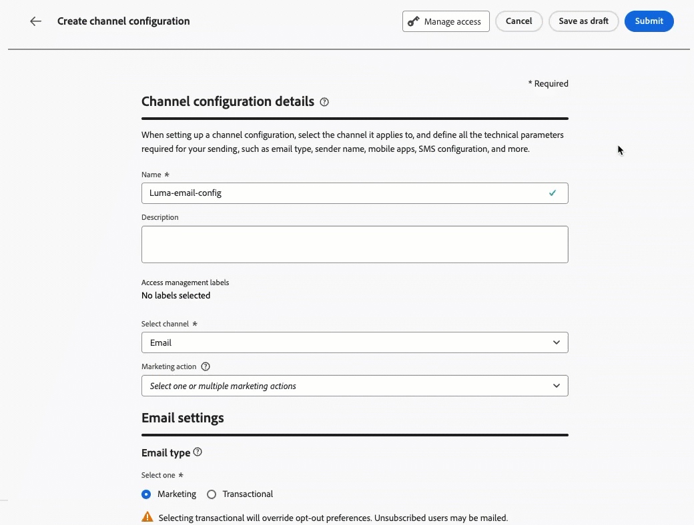
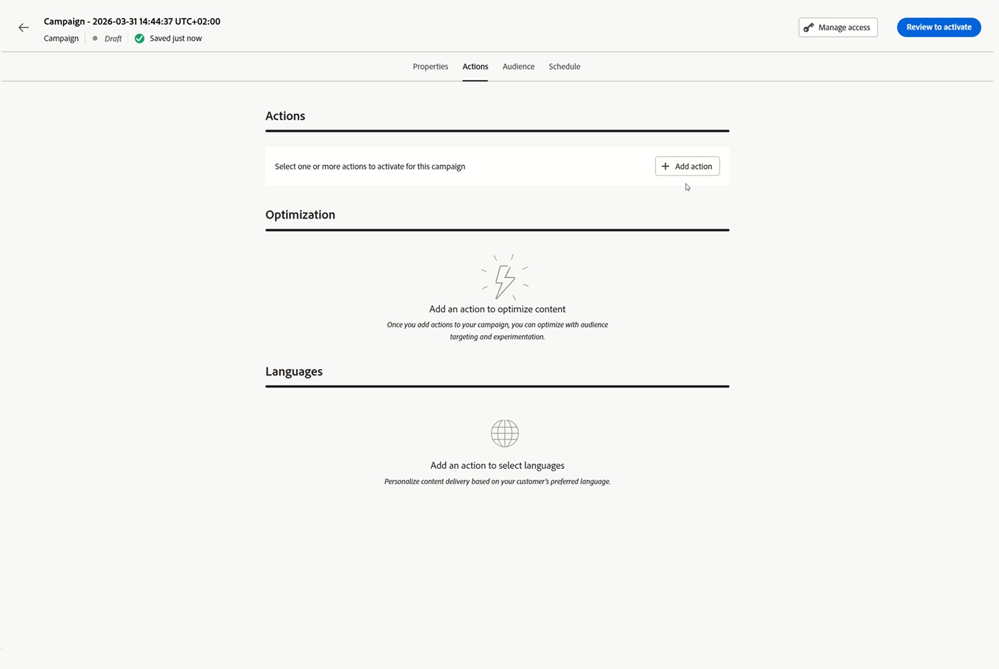

# Note sulla versione 2026 {#release-notes-2026}

In questa pagina sono elencati tutti i miglioramenti e le funzioni di [!DNL Journey Optimizer] rilasciati nel 2026.

## Note sulla versione di aprile 2026 {#april-26-rn}

**Data di rilascio**: 28-29 aprile 2026

### Nuove funzionalità {#april-26-features}

Le seguenti funzionalità sono state rilasciate ad aprile 2026.

<table>
<thead>
<tr>
<th><strong>Attività di query incrementali nelle campagne orchestrate</strong> </th>
</tr>
</thead>
<tbody>
<tr>
<td>

Le <strong>campagne orchestrate</strong> ora supportano un’attività di <strong>query incrementale</strong> che esegue il targeting solo dei profili o degli eventi nuovi risultati idonei dall’ultima esecuzione.

In questo modo le campagne ricorrenti si concentrano sui nuovi tipi di pubblico (nuove iscrizioni, nuovi membri fidelizzati qualificati e segmenti simili), riducendo al contempo i carichi di lavoro per le query ed evitando invii ridondanti nel tempo.

Per ulteriori informazioni, consulta la <a href="../orchestrated/activities/incremental-query.md#incremental-query-configuration">documentazione dettagliata</a>.

Data di disponibilità: 30 aprile 2026

</td>
</tr>
</tbody>
</table>

<table>
<thead>
<tr>
<th><strong>Parametri del mittente nell’intestazione e-mail</strong> </th>
</tr>
</thead>
<tbody>
<tr>
<td>

Con Journey Optimizer, ora puoi inviare e-mail in cui l’entità trasmittente (Mittente) è diversa dall’entità di authoring (Da). I client e-mail che supportano questa impostazione in genere la visualizzano come “Mittente per conto di Da” o mostrano un indicatore “via”. Compila i campi facoltativi <strong>Intestazioni mittente</strong> nelle impostazioni del canale e-mail per configurare questa funzionalità.

Per ulteriori informazioni, consulta la <a href="../email/header-parameters.md#sender-header">documentazione dettagliata</a>.

</td>
</tr>
</tbody>
</table>

<table>
<thead>
<tr>
<th><strong>Campo CC nelle impostazioni del canale e-mail</strong> </th>
</tr>
</thead>
<tbody>
<tr>
<td>

Ora puoi configurare un campo Cc (copia conoscenza) facoltativo nelle impostazioni del canale e-mail. A differenza del campo Ccn, i destinatari Cc sono visibili al destinatario principale, consentendo una comunicazione trasparente e una maggiore chiarezza riguardo alla proprietà.

Ciò consente di includere automaticamente in copia gli stakeholder corretti su ciascun messaggio, ad esempio un responsabile delle relazioni o il proprietario dell’account, garantendo al contempo che il cliente sappia chi contattare per il follow-up.

Il campo Cc supporta la personalizzazione, pertanto una singola configurazione può indirizzare dinamicamente le copie in base ai dati del profilo, rendendola scalabile per diversi casi d’uso senza necessità di ulteriori configurazioni.

Per ulteriori informazioni, consulta la <a href="../configuration/cc-email-field.md">documentazione dettagliata</a>.

</td>
</tr>
</tbody>
</table>

<table>
<thead>
<tr>
<th><strong>Copiare campagne orchestrate tra sandbox</strong> </th>
</tr>
</thead>
<tbody>
<tr>
<td>

Gli strumenti sandbox ora supportano l’inserimento in pacchetti e la copia di campagne orchestrate da una sandbox all’altra. Questo elimina la necessità di ricreare manualmente le campagne in ogni ambiente. Quando una campagna viene inserita in un pacchetto, i suoi oggetti principali dipendenti, come i criteri di unione e i messaggi, vengono inclusi automaticamente, in modo che la campagna importata sia pronta per la configurazione e la convalida. Per proteggere gli ambienti di produzione, tutte le campagne importate vengono inserite in stato di bozza nella sandbox di destinazione, consentendo ai team di effettuare un passaggio di revisione e approvazione prima che venga pubblicata qualsiasi campagna.

Per ulteriori informazioni, consulta la <a href="../configuration/copy-objects-to-sandbox.md">documentazione dettagliata</a>.

</td>
</tr>
</tbody>
</table>

<table>
<thead>
<tr>
<th><strong>Integrazione dell’Agente IA per Journey Optimizer tramite MCP</strong> </th>
</tr>
</thead>
<tbody>
<tr>
<td>

Adobe Journey Optimizer offre ora un <strong>server MCP (Model Context Protocol)</strong> che rende disponibili le campagne, la configurazione dei canali e le operazioni di sandbox direttamente all’interno di qualsiasi applicazione compatibile con MCP. Con questa integrazione, utenti tipo diversi possono collaborare sugli stessi dati di orchestrazione. Anziché scrivere query per l’API REST di Adobe Journey Optimizer o navigare tra diverse schermate dell’interfaccia utente, puoi descrivere l’intento in modo conversazionale e lasciare che l’LLM richiami gli strumenti MCP appropriati. Questa funzionalità è attualmente disponibile su Claude Web e Desktop.

Questa funzionalità è disponibile per tutta la clientela della versione Beta pubblica.

Per ulteriori informazioni, consulta la <a href="../integrations/ajo-mcp.md">documentazione dettagliata</a>.

</td>
</tr>
</tbody>
</table>

<table>
<thead>
<tr>
<th><strong>Arbitrato percorso: modelli IA</strong> </th>
</tr>
</thead>
<tbody>
<tr>
<td>

Ora puoi utilizzare i <strong>modelli di IA</strong> nelle formule di ranking per aumentare automaticamente i punteggi di priorità dei percorsi in base agli attributi del profilo cliente e ai fattori contestuali, garantendo che i clienti entrino nei percorsi più rilevanti.

Questa funzionalità è disponibile solo per un set di organizzazioni (LA, disponibilità limitata). Per potervi accedere, contatta il tuo rappresentante Adobe.

Per ulteriori informazioni, consulta la <a href="../conflict-prioritization/journey-ai-models.md">documentazione dettagliata</a>.

</td>
</tr>
</tbody>
</table>

<table>
<thead>
<tr>
<th><strong>Integrazione Adobe Express</strong> </th>
</tr>
</thead>
<tbody>
<tr>
<td>

L’<b>integrazione di Adobe Express</b> in Adobe Journey Optimizer ti consente di utilizzare gli strumenti di modifica di Adobe Express direttamente durante la creazione dei contenuti, permettendoti di ridimensionare, rimuovere gli sfondi, ritagliare e convertire le risorse in formato JPEG o PNG.

Precedentemente rilasciata in disponibilità limitata, questa funzionalità è ora disponibile per tutti gli ambienti (disponibilità generale).

Per ulteriori informazioni, consulta la <a href="../integrations/express.md">documentazione dettagliata</a>.

Data di disponibilità: 23 aprile 2026

</td>
</tr>
</tbody>
</table>

<table>
<thead>
<tr>
<th><strong>Ottimizzare le e-mail per le caselle in entrata IA</strong> </th>
</tr>
</thead>
<tbody>
<tr>
<td>

Adobe Journey Optimizer ora include una nuova funzionalità che garantisce che le e-mail siano strutturate in modo ottimale per le caselle in entrata basate sull’IA, come Apple Intelligence e Google Gemini in Gmail.

Poiché gli assistenti IA controllano sempre di più il modo in cui i destinatari leggono e agiscono sulle e-mail, questa funzione consente di generare e creare contenuti con prestazioni ottimali per tutte le attività di IA a valle, tra cui riepilogo, smistamento, definizione delle priorità ed estrazione intento.

Per ulteriori informazioni, consulta <a href="../email/llm-email-optimizer.md">Ottimizzare le e-mail per le caselle in entrata IA</a>.

Data di disponibilità: 17 aprile 2026

</td>
</tr>
</tbody>
</table>

<table>
<thead>
<tr>
<th><strong>Assistente IA per le espressioni di personalizzazione</strong> </th>
</tr>
</thead>
<tbody>
<tr>
<td>

[!DNL Adobe Journey Optimizer] ora include l’<strong>Assistente IA</strong> direttamente nell’editor di personalizzazione ed E-mail designer che converte i prompt in linguaggio naturale in espressioni di personalizzazione e logica condizionale valide, senza che sia necessaria alcuna competenza tecnica della sintassi. Descrivi la personalizzazione che desideri ottenere e l’IA genererà un codice pronto all’uso che potrai applicare immediatamente o perfezionare tramite prompt di follow-up.

L’Assistente funziona anche al contrario. Seleziona un’espressione esistente e chiedi di spiegarne la logica, di identificare i problemi o suggerire miglioramenti. Questo lo rende utile non solo per la creazione di nuove espressioni, ma anche per la revisione e il debug di quelle esistenti all’interno del team.

Per ulteriori informazioni, consulta <a href="../content-management/generative-personalization-expressions.md">Assistente IA per le espressioni di personalizzazione</a>.

Data di disponibilità: 13 aprile 2026

</td>
</tr>
</tbody>
</table>

<table>
<thead>
<tr>
<th><strong>Sperimentazione del percorso</strong> </th>
</tr>
</thead>
<tbody>
<tr>
<td>

Utilizza il nuovo nodo <strong>Ottimizza</strong> per eseguire test A/B o esperimenti multi-armed bandit per determinare il percorso migliore e soddisfare i KPI incentrati sull’azienda. Questo strumento consente di testare, variare e personalizzare le comunicazioni, la sequenza e la tempistica per raggiungere al meglio la clientela.

Precedentemente rilasciata in disponibilità limitata, questa funzionalità è ora disponibile per tutti gli ambienti (disponibilità generale).

Come parte della disponibilità generale, questa versione introduce la selezione del <strong>tipo di esperimento</strong> (A/B o multi-armed bandit) e <strong>Scala il vincitore</strong> per percorsi unitari.

Per ulteriori informazioni, consulta la <a href="../building-journeys/path-experimentation.md">documentazione dettagliata</a>.

Data di disponibilità: 7 aprile 2026

</td>
</tr>
</tbody>
</table>

<table>
<thead>
<tr>
<th><strong>Casella in entrata</strong> </th>
</tr>
</thead>
<tbody>
<tr>
<td>

<strong>Casella in entrata</strong> è una funzionalità per dispositivi mobili, disponibile con schede contenuto, che consente alla clientela di creare una posizione centralizzata all’interno della propria app o sito web per visualizzare i messaggi inviati ai propri utenti. Questo estende la durata delle comunicazioni di marketing, garantendo che i messaggi rimangano accessibili anche dopo essere stati chiusi.

Per ulteriori informazioni, consulta la <a href="../inbox/inbox-gs.md">documentazione dettagliata</a>.

Data di disponibilità: 7 aprile 2026

</td>
</tr>
</tbody>
</table>

<table>
<thead>
<tr>
<th><strong>Supporto per la funzione Decisioni nel canale e-mail</strong> </th>
</tr>
</thead>
<tbody>
<tr>
<td>

Ora puoi utilizzare la funzione <strong>Decisioni</strong> per personalizzare e ottimizzare il contenuto dei messaggi e-mail. Sfrutta i punteggi di priorità, le formule o i modelli IA per mostrare a ciascun destinatario le offerte e i contenuti più pertinenti.

Precedentemente rilasciata in disponibilità limitata, questa funzionalità è ora disponibile per tutti gli ambienti (disponibilità generale). Con la versione in disponibilità generale, sono ora supportate le pagine mirror.

Per ulteriori informazioni, consulta la <a href="../experience-decisioning/create-decision-policy.md">documentazione dettagliata</a>.

Data di disponibilità: 6 aprile 2026

</td>
</tr>
</tbody>
</table>

### Miglioramenti {#april-26-improv}

Ad aprile 2026 sono stati rilasciati anche i seguenti miglioramenti.

#### IA

<!--
* **Brand alignment score in Campaign dashboard** - You can now assess your brand alignment score directly within your Campaign dashboard to ensure content stays on-brand. This allows you to verify guidelines at a glance without having to open the content designer.
-->

* **Miglioramento dell’Assistente prompt**: l’Assistente prompt potenzia la generazione di contenuti IA analizzando i prompt degli utenti in tempo reale e identificando eventuali lacune in termini di chiarezza, completezza e contesto. Suggerisce riformulazioni migliorate e fornisce indicazioni fruibili per arricchire i prompt con dettagli chiave come pubblico, tono e intento. Inoltre, la funzione pone domande di chiarimento mirate, al fine di aiutare gli utenti a perfezionare i propri input prima della generazione. Ciò si traduce in output più precisi e di alta qualità, con meno iterazioni. [Ulteriori informazioni](../content-management/ai-assistant-prompting-guide.md#prompt-assistant)

  Data di disponibilità: 5 maggio 2026

#### Push

* **Personalizzare ID app nelle impostazioni dei canali**: nelle impostazioni di configurazione dei canali push, ora puoi personalizzare il campo **ID app** in modo che ogni destinatario possa ricevere una notifica push dal brand appropriato in base alle informazioni del proprio profilo. [Ulteriori informazioni](../push/push-configuration.md#app-id-personalization)

#### Funzione Decisioni

* **API del flusso di lavoro di migrazione della funzione Decisioni**: il contratto API per la creazione di analisi delle dipendenze e flussi di lavoro di migrazione è stato aggiornato: passa **`request-level`** come **parametro di query** nell’URL della richiesta (`sandbox`, `offer` o `decision`). Il livello della richiesta non deve più essere inviato nel corpo JSON. [Ulteriori informazioni](../experience-decisioning/decisioning-migration-api.md)

  Data di disponibilità: 6 maggio 2026

* **Allegare frammenti agli elementi decisionali**: Journey Optimizer offre ora la possibilità di allegare frammenti agli elementi decisionali, che possono essere utilizzati nelle campagne e-mail e con esperienze basate su codice tramite i criteri di decisione. [Ulteriori informazioni](../experience-decisioning/fragments-decision-policies.md)

  Precedentemente rilasciata in disponibilità limitata, questa funzionalità è ora disponibile per tutti gli ambienti (disponibilità generale).

* **I frammenti temporaneamente non disponibili vengono ignorati**: se un frammento non è temporaneamente disponibile su Edge durante l’utilizzo di frammenti negli elementi decisionali, questo viene ignorato, e il percorso o la campagna procedono con il rendering, anziché generare un errore. [Ulteriori informazioni](../experience-decisioning/fragments-decision-policies.md#temporary-unavailable-fragments)

  Data di disponibilità: 14 aprile 2026

#### Integrazioni Adobe Experience Manager

* **Supporto delle varianti dei frammenti di contenuto di Adobe Experience Manager**: puoi selezionare le **varianti dei frammenti di contenuto** (ad esempio varianti di lingua o canale) durante l’inserimento dei frammenti di contenuto di Adobe Experience Manager, con una gestione migliorata per gli scenari locali e multilingue.[Ulteriori informazioni](../integrations/aem-fragments.md#aem-variations)

  Precedentemente rilasciata in disponibilità limitata, questa funzionalità è ora disponibile per tutti gli ambienti (disponibilità generale).

* **Contesto dei frammenti di contenuto di Adobe Experience Manager durante l’authoring**: la selezione dei frammenti di contenuto rimane attiva mentre ti sposti tra i campi di testo e i blocchi di contenuto; in questo modo puoi aggiungere altri campi del frammento senza dover ogni volta fare clic su **Apri advisor contenuti di AEM**. [Ulteriori informazioni](../integrations/aem-fragments.md)

  Precedentemente rilasciata in disponibilità limitata, questa funzionalità è ora disponibile per tutti gli ambienti (disponibilità generale).

#### Progettazione delle e-mail

* **Editor HTML avanzato per contenuti e-mail**: la modalità HTML avanzata consente di modificare l’origine HTML dei contenuti nell’E-mail designer, aggiungere espressioni avanzate (ad esempio le condizioni) nell’origine e passare dalla vista HTML a quella Desktop senza perdere le modifiche apportate.

  Precedentemente disponibile solo per i modelli di contenuto e-mail, questa funzionalità è ora implementata per i contenuti **e-mail** di E-mail designer (ad esempio, e-mail create in percorsi e campagne), oltre che per i modelli di contenuto e-mail. Attualmente è in disponibilità limitata; per ottenere l’accesso, contatta il rappresentante Adobe. [Ulteriori informazioni](../email/email-expert-mode.md)

  Data di disponibilità: 9 aprile 2026

#### Percorsi

* **Dimensione corrente del payload del percorso visibile nelle proprietà del percorso**: il pannello delle proprietà del percorso mostra ora la dimensione corrente del payload del percorso rispetto al limite configurato, ad esempio *1,5 MB (su 4 MB)*.Questo indicatore di sola lettura ti aiuta a monitorare la complessità del percorso prima della pubblicazione e a evitare errori causati dal superamento del limite della dimensione del payload. [Ulteriori informazioni](../building-journeys/journey-properties.md#journey-payload-size)

  Data di disponibilità: 30 aprile 2026

#### Ottimizzazione percorso

* **Tipo di esperimento**: ora puoi scegliere tra esperimento A/B (suddivisione fissa all’inizio) o multi-armed bandit (suddivisione automatica con aggiornamenti settimanali del peso) durante la configurazione di un esperimento di percorso. [Ulteriori informazioni](../building-journeys/path-experimentation.md)

  Data di disponibilità: 7 aprile 2026

* **Sperimentazione del percorso: scalare il vincitore**: ora puoi distribuire automaticamente o manualmente il percorso vincente di un esperimento all’intero pubblico. Una volta determinato il vincitore, puoi amplificarne la portata e l’efficacia senza il bisogno di monitorare costantemente l’esperimento. [Ulteriori informazioni](../building-journeys/path-experimentation.md#scale-winner)

  Questa funzionalità è disponibile solo nei percorsi unitari (qualifiche attivate da eventi e pubblico). Non è disponibile per percorsi Leggi pubblico.

  Data di disponibilità: 7 aprile 2026

* **Condizioni**: l’attività [Ottimizza](../building-journeys/optimize.md) è il nuovo strumento per la creazione di percorsi condizionali nei percorsi. Sostituisce l’attività **Condizione** precedente, che è stata rimossa dall’interfaccia utente. L’intera logica condizionale viene mantenuta e viene ora gestita tramite le condizioni dell’attività **Ottimizza**. [Ulteriori informazioni](../building-journeys/conditions.md)

  Precedentemente rilasciata in disponibilità limitata, questa funzionalità è ora disponibile per tutti gli ambienti (disponibilità generale).

  Data di disponibilità: 7 aprile 2026

#### Campagne orchestrate

* **Variabili globali nelle campagne orchestrate**: le campagne orchestrate ora supportano variabili globali che possono essere definite una volta e riutilizzate in tutte le attività di un flusso di lavoro, semplificando la configurazione e garantendo la coerenza in valori dinamici, espressioni e personalizzazione dei contenuti. [Ulteriori informazioni](../orchestrated/global-variables.md)
* **Miglioramenti di Data Modeler**: gli schemi relazionali orchestrati ora supportano chiavi composite che si estendono su più campi. Il caricamento di uno schema da un file DDL include anche le enumerazioni e il caricamento da un file DDL o Excel crea automaticamente relazioni composite tra le tabelle. Nella vista delle relazioni tra entità, i collegamenti compositi ora visualizzano l’intero set di coppie di campi tra le tabelle dopo il caricamento di un file. [Ulteriori informazioni](../orchestrated/gs-schemas.md)

## Note sulla versione di marzo 2026 {#march-26-rn}

Le sezioni [Nuove funzionalità](#march-26-features) e [Miglioramenti](#march-26-improv) riguardano le funzionalità già disponibili. <!--The [Coming soon](#coming-soon) section lists features and improvements scheduled for release later in March.-->

<!--
**The pre-release notes below are subject to change without prior notice until the release availability date**. Links, screens and updated documentation are published in the release notes, at the release date.

See also [Adobe Experience Platform pre-release notes](https://experienceleague.adobe.com/en/docs/experience-platform/release-notes/pre-release-notes){target="_blank"}.
-->

**Data di rilascio**: 24-25 marzo 2026

### Nuove funzionalità {#march-26-features}

<table>
<thead>
<tr>
<th><strong>Crittografia dei parametri URL</strong> </th>
</tr>
</thead>
<tbody>
<tr>
<td>

I parametri URL presenti nei collegamenti di tracciamento e nelle pagine di destinazione aggiunti ai messaggi e-mail ora possono essere crittografati, offrendo un ulteriore livello di sicurezza per i dati sensibili dei parametri.

<ul>
<li>Registra e gestisci le chiavi di crittografia nel registro <strong>Amministrazione</strong> dedicato.</li>
<li>Utilizza la nuova funzione helper “Crittografa” nelle espressioni per crittografare dati sensibili negli URL per i parametri di query che desideri proteggere durante il rendering.</li>
</ul>

Questa funzionalità è disponibile solo per un set di organizzazioni (LA, disponibilità limitata). Per potervi accedere, contatta il tuo rappresentante Adobe.

Per ulteriori informazioni, consulta la <a href="../personalization/url-parameter-encryption.md">documentazione dettagliata</a>.

Data di disponibilità: 31 marzo 2026

</td>
</tr>
</tbody>
</table>

<table>
<thead>
<tr>
<th><strong>Convertire immagini in modelli di contenuto e-mail</strong> </th>
</tr>
</thead>
<tbody>
<tr>
<td>

Ora puoi convertire le immagini in modelli di contenuto e-mail direttamente in Journey Optimizer. Utilizza l’analisi basata sull’IA per generare automaticamente modelli HTML strutturati dai riferimenti visivi, riducendo in modo significativo i tempi di progettazione delle e-mail.

Precedentemente rilasciata in disponibilità limitata, questa funzionalità è ora disponibile per tutti gli ambienti (disponibilità generale).

Per ulteriori informazioni, consulta la <a href="../content-management/image-to-html.md">documentazione dettagliata</a>.

Data di disponibilità: 31 marzo 2026

</td>
</tr>
</tbody>
</table>

<table>
<thead>
<tr>
<th><strong>Moduli personalizzati della pagina di destinazione</strong> </th>
</tr>
</thead>
<tbody>
<tr>
<td>

Con [!DNL Journey Optimizer] ora puoi acquisire gli attributi di profilo tramite le pagine di destinazione.

Crea, progetta e gestisci moduli personalizzati adatti alle tue esigenze sulla base di un set di dati specifico. Puoi quindi sfruttare questi moduli nelle pagine di destinazione per aggiungere gli attributi di profilo desiderati nel set di dati definito per ciascun modulo.

Precedentemente rilasciata in disponibilità limitata per la clientela statunitense e australiana, questa funzionalità è ora disponibile per tutti gli ambienti (disponibilità generale).

Per ulteriori informazioni, consulta la <a href="../landing-pages/lp-forms.md">documentazione dettagliata</a>.

Data di disponibilità: 26 marzo 2026.

</td>
</tr>
</tbody>
</table>

<table>
<thead>
<tr>
<th><strong>Attività Test nelle campagne orchestrate</strong> </th>
</tr>
</thead>
<tbody>
<tr>
<td>

Una nuova attività <strong>Test</strong> è ora disponibile nelle campagne orchestrate. Questa attività indirizza l’esecuzione del flusso di lavoro a rami diversi in base a condizioni definite, consentendo di convalidare le configurazioni e la logica della campagna prima di attivare le consegne live.

Per ulteriori informazioni, consulta la <a href="../orchestrated/activities/test.md">documentazione dettagliata</a>.

</td>
</tr>
</tbody>
</table>

<table>
<thead>
<tr>
<th><strong>Supporto per la ricerca di set di dati nei percorsi</strong> </th>
</tr>
</thead>
<tbody>
<tr>
<td>

Una nuova attività <strong>Ricerca set di dati</strong> nei percorsi consente di recuperare in modo dinamico i dati dai set di dati dei record di Adobe Experience Platform in fase di esecuzione, consentendo l’accesso a informazioni che non fanno parte del payload del profilo o dell’evento, in modo che le interazioni del cliente rimangano pertinenti e tempestive.

Precedentemente rilasciata in disponibilità limitata a un set limitato di organizzazioni, l’attività Ricerca in set di dati nei percorsi è ora disponibile per tutti i clienti autorizzati alla [ricerca set di dati](../data/lookup-aep-data.md), pur rimanendo in disponibilità limitata.

Per ulteriori informazioni, consulta la <a href="../building-journeys/dataset-lookup.md">documentazione dettagliata</a>.

</td>
</tr>
</tbody>
</table>

<table>
<thead>
<tr>
<th><strong>L’attività Azione sostituisce le attività di percorso specifiche per il canale</strong> </th>
</tr>
</thead>
<tbody>
<tr>
<td>

In seguito alla disponibilità generale dell’attività <strong>Azione</strong> nel febbraio 2026, le attività legacy del canale nativo (e-mail, push, SMS, in-app, web, esperienza basata su codice e scheda contenuto) nell’area di lavoro del percorso sono ora obsolete.

Ora devi utilizzare la singola attività Azione per configurare tutte le azioni del canale, sostituendo la necessità di nodi specifici del canale separati.

I percorsi esistenti che utilizzano attività di canale legacy continuano a funzionare senza la necessità di apportare modifiche o migrazione.

Per ulteriori informazioni, consulta la <a href="../building-journeys/journey-action.md">documentazione dettagliata</a>.

</td>
</tr>
</tbody>
</table>

<table>
<thead>
<tr>
<th><strong>Editor HTML avanzato per modelli e-mail</strong> </th>
</tr>
</thead>
<tbody>
<tr>
<td>

La modalità HTML avanzata per i modelli di contenuti e-mail consente di modificare l’origine HTML del contenuto in E-mail designer, aggiungere espressioni avanzate (ad esempio condizioni) nell’origine e passare dalla vista HTML a quella desktop senza perdere le modifiche.

Questa funzionalità è disponibile solo nei modelli di contenuti per il canale e-mail. Attualmente è in disponibilità limitata; per ottenere l’accesso, contatta il rappresentante Adobe.

Per ulteriori informazioni, consulta la <a href="../email/email-expert-mode.md">documentazione dettagliata</a>.

Data di disponibilità: 10 marzo 2026

</td>
</tr>
</tbody>
</table>

<table>
<thead>
<tr>
<th><strong>Integrazione di modelli Firefly personalizzati e modelli di generazione di immagini di terze parti</strong> </th>
</tr>
</thead>
<tbody>
<tr>
<td>

Abilita un’integrazione fluida dei modelli Firefly standard e personalizzati, insieme a modelli di immagine di terze parti approvati, per offrire maggiore flessibilità, controllo e allineamento del brand durante la generazione delle immagini.

Scegli il modello giusto per le tue esigenze:

<ul><li> <strong>Modello Adobe</strong> (con tecnologia Firefly Image Model 4) per la generazione immediata di immagini senza configurazione aggiuntiva</li><li> <strong>Modello partner</strong> (basato su Gemini 2.5 Flash) per funzionalità specializzate</li><li><strong>Modelli personalizzati</strong> (modelli specifici del brand addestrati sulle proprie risorse) per una generazione in linea con il brand e che aderisce in modo preciso all’identità, allo stile e alle linee guida visive.</li></ul>

Per ulteriori informazioni, consulta la <a href="../content-management/generative-models.md">documentazione dettagliata</a>.

Data di disponibilità: 2 marzo 2026

</td>
</tr>
</tbody>
</table>

<table>
<thead>
<tr>
<th><strong>Attività live per iOS</strong> </th>
</tr>
</thead>
<tbody>
<tr>
<td>

Offri esperienze in tempo reale direttamente nella schermata di blocco e nella Dynamic Island dei tuoi clienti con <strong>iOS Live Activity</strong> in Adobe Journey Optimizer. Fornisci aggiornamenti live, dal tracciamento degli ordini e dello stato dei voli ai conti alla rovescia per gli eventi, fino ai risultati sportivi live e all’avanzamento dello stato delle consegne, senza che gli utenti debbano aprire l’app. Mantieni il pubblico informato e coinvolto al momento giusto, ovunque si trovi.

Precedentemente rilasciata in versione Beta, questa funzionalità è ora disponibile per tutti gli ambienti (disponibilità generale).

Per ulteriori informazioni, consulta la <a href="../mobile-live/get-started-mobile-live.md">documentazione dettagliata</a>.

Data di disponibilità: 3 marzo 2026

</td>
</tr>
</tbody>
</table>

<table>
<thead>
<tr>
<th><strong>Agente Journey: creazione di contenuti del canale</strong> </th>
</tr>
</thead>
<tbody>
<tr>
<td>

Basato su <strong>Adobe Experience Platform Agent Orchestrator</strong>, l’<strong>Agente Journey</strong> è ora disponibile in Journey Optimizer e consente di analizzare i percorsi attraverso un’interfaccia in linguaggio naturale. Ora è possibile anche generare e gestire contenuti specifici per il canale direttamente in Agente Journey, creando contenuti per canali (ad esempio e-mail e push), applicando e visualizzando in anteprima i modelli, perfezionando tono e stile mediante semplici prompt, e aprendo i contenuti nel <strong>designer di contenuti</strong> per modificarli direttamente nel loro contesto.

Questa funzionalità è disponibile solo per un set di organizzazioni (LA, disponibilità limitata). Per potervi accedere, contatta il tuo rappresentante Adobe.

Per ulteriori informazioni, consulta la <a href="https://experienceleague.adobe.com/docs/experience-cloud-ai/experience-cloud-ai/agents/ajo-agent.html?lang=it" target="_blank">documentazione dettagliata</a>.

Data di disponibilità: 4 marzo 2026

</td>
</tr>
</tbody>
</table>

<table>
<thead>
<tr>
<th><strong>Monitoraggio dei modelli IA</strong> </th>
</tr>
</thead>
<tbody>
<tr>
<td>

Journey Optimizer ora consente di monitorare lo stato di integrità, di addestramento e le prestazioni dei modelli di IA per la funzione Decisioni. Questo consente di verificare l’efficacia dell’addestramento, risolvere eventuali errori e comprendere l’impatto sui risultati, al fine di selezionare le offerte migliori per ciascun cliente utilizzando l’IA. Questa funzionalità è disponibile solo per la funzione <strong>Decisioni</strong> (non per i modelli di gestione delle decisioni legacy).

Questa funzionalità è attualmente disponibile solo per i modelli di <strong>ottimizzazione personalizzata</strong> (non per l’ottimizzazione automatica).

Per ulteriori informazioni, consulta la <a href="../experience-decisioning/ranking/ai-model-observability.md">documentazione dettagliata</a>.

Data di disponibilità: 9 marzo 2026

</td>
</tr>
</tbody>
</table>

<table>
<thead>
<tr>
<th><strong>Attivare campagne orchestrate utilizzando un segnale</strong> </th>
</tr>
</thead>
<tbody>
<tr>
<td>

È ora possibile attivare le campagne orchestrate tramite un <strong>segnale API</strong>. Per impostare questa funzione, configura la campagna di destinazione come <strong>Attivata da un segnale</strong>, pubblicala e attivala tramite una chiamata API. Tutti i parametri inclusi nella chiamata API sono disponibili come variabili all’interno della campagna in esecuzione. Tieni presente che le campagne orchestrate attivate dal segnale rimangono campagne <strong>batch</strong> e sono diverse dalle campagne attivate tramite API.

Per ulteriori informazioni, consulta la <a href="../orchestrated/trigger-orchestrated-campaign.md">documentazione dettagliata</a>.

</td>
</tr>
</tbody>
</table>

<table>
<thead>
<tr>
<th><strong>Categoria transazionale nelle campagne orchestrate</strong> </th>
</tr>
</thead>
<tbody>
<tr>
<td>

Nelle campagne orchestrate, ora puoi impostare un’attività di canale nella categoria <strong>Transazionale</strong>. Questo applica le configurazioni dei canali transazionali a tale attività ed è utile quando le regole di business non devono essere applicate o quando non è richiesto il consenso del cliente.

Per ulteriori informazioni, consulta la <a href="../orchestrated/activities/channels.md#add">documentazione dettagliata</a>.

Questa funzionalità verrà gradualmente introdotta in tutte le aree geografiche nei prossimi giorni.

</td>
</tr>
</tbody>
</table>

### Miglioramenti {#march-26-improv}

Di seguito sono elencati i miglioramenti inclusi in questa versione.

#### Personalizzazione

* **Personalizzazione URL completa/di base**: puoi personalizzare gli URL di destinazione utilizzando gli attributi del profilo (ad esempio, per il dominio o il percorso). Per abilitare questa funzionalità, fornisci ad Adobe l’elenco dei domini accettati. [Ulteriori informazioni](../personalization/personalization-build-expressions.md#where)

  Precedentemente rilasciata in disponibilità limitata per l’utilizzo nei percorsi, questa funzionalità è ora disponibile in tutti gli ambienti (disponibilità generale).

  Data di disponibilità: 1 aprile 2026

#### Generazione di rapporti

* **Ottimizzazione dell’ora di invio: posizione dei controlli aggiornata e nuovo rapporto di incremento**: i controlli di ottimizzazione dell’ora di invio (STO) sono stati spostati nel menu di configurazione delle azioni. Inoltre, è ora disponibile un nuovo rapporto di incremento nei rapporti dei percorsi per misurare l’impatto dell’STO sulle metriche delle prestazioni delle campagne. [Ulteriori informazioni](../reports/channel-report-cja.md#optimization-models)

  Data di disponibilità: 27 marzo 2026

<!--
* **Exclude bot clicks for email and SMS reporting** - Email and SMS reporting now automatically filters out bot clicks from click metrics, providing more accurate engagement data and preventing automated traffic from inflating your performance figures.

#### Email Designer

* **Email Designer displayed in Unified Shell** - The Email Designer is now displayed within the Unified Shell experience, providing a consistent navigation and header experience that aligns with other Adobe applications.

* **Text mode support in fragments** - To support text-based email workflows, you can now create and manage text versions of your visual fragments for optimal use in the plain text version of emails that include that fragment.

  **Caution:** When using a fragment that was created before the current release, the fragment text version may be incorrectly rendered—both in the Email Designer and in the final email delivered to your recipients. For best results with older fragments, edit, save and republish each fragment.
-->

#### Configurazione

<!--* **Folders for journeys and campaigns** - You can now organize your journeys and campaigns into folders, enabling structured navigation and easier management for teams working with large volumes of content. This capability is only available for a set of organizations (Limited Availability). To gain access, contact your Adobe representative.-->

* **Rinnovo dei certificati di dominio AJO non riuscito**: ora puoi iscriverti per ricevere avvisi di sistema, tramite e-mail o nel centro notifiche di Journey Optimizer, quando un certificato di dominio utilizzato per la recapitabilità delle e-mail è vicino alla scadenza o è già scaduto. [Ulteriori informazioni](../reports/alerts.md#alert-certificates-renewal-unsuccessful)

  Data di disponibilità: 26 marzo 2026

* **Ridenominazione del set di dati relativo agli eventi di feedback dei destinatari secondari AJO**: il set di dati `AJO Email BCC Feedback Event` è stato rinominato in `AJO Secondary Recipient Feedback Event`. L’impatto varia a seconda della situazione:

   * **Utenti esistenti**: viene aggiornato solo il nome visualizzato. Il nome della tabella sottostante rimane invariato.
   * **Nuovi utenti e sandbox**: sia il nome visualizzato che quello della tabella riflettono il nuovo nome.
   * **Utenti esistenti con nuove sandbox**: sia il nome visualizzato che quello della tabella vengono aggiornati con il nuovo nome.

  >[!NOTE]
  >
  >I nuovi set di dati mostrano immediatamente il nuovo nome. Per i nomi dei set di dati precedenti, la retrocompilazione e la riconciliazione procedono gradualmente e il completamento potrebbe richiedere diverse settimane.

  Data di disponibilità: 2 marzo 2026

#### Percorsi

* **Azione Aggiorna profilo: supporto per più attributi di profilo**: l’attività dell’azione **Aggiorna profilo** ora supporta l’aggiornamento di un massimo di cinque attributi di profilo in un singolo nodo. In precedenza, ogni azione poteva aggiornare un solo attributo alla volta, rendendo necessario l’utilizzo di più nodi per aggiornare diversi attributi. Utilizza il nuovo pulsante **Aggiorna un altro campo** per aggiungere altre coppie di campo/valore, riducendo la complessità dell’area di lavoro e migliorando le prestazioni. [Ulteriori informazioni](../building-journeys/update-profiles.md)

* **Invio in scaglioni dei messaggi in uscita nei percorsi**: ora puoi pianificare la consegna di messaggi provenienti da percorsi Journey Optimizer in batch controllati nel tempo. [Ulteriori informazioni](../building-journeys/send-using-waves.md)

  Precedentemente rilasciata in disponibilità limitata per l’utilizzo nei percorsi, questa funzionalità è ora disponibile in tutti gli ambienti (disponibilità generale).

  Data di disponibilità: 16 marzo 2026

* **Dettagli relativi alla pausa e alla ripresa nei dettagli tecnici dei percorsi**: i **dettagli tecnici** dei percorsi ora includono informazioni aggiuntive sulla pausa e sulla ripresa: la data e ora dell’ultima pausa e ripresa, il nome visualizzato e l’identificativo interno dell’utente che ha eseguito ogni azione, nonché un set completo di impostazioni relative a un percorso in pausa, come il comportamento, la durata massima e lo stato di ripresa automatica della pausa. [Ulteriori informazioni](../building-journeys/journey-properties.md)

  Data di disponibilità: 2 marzo 2026

#### Funzione Decisioni

* **Migrazione della funzione Decisioni -Attributi di offerta e di contesto**: la mappatura delle entità dell’API di migrazione elenca ora gli **attributi dell’offerta** (`migratedofferattributes` nello schema dell’elemento dell’offerta personalizzata) e gli **attributi di contesto** (`migratedcontextattributes` nello schema del set di dati di migrazione). [Ulteriori informazioni](../experience-decisioning/decisioning-migration-api.md#entity-mapping)

  Data di disponibilità: 31 marzo 2026

<!--
## Coming soon {#coming-soon}

The features and improvements below are planned for release later in March/early April. Release dates and scope are **subject to change without prior notice**.

WAITING RELEASE DATE CONFIRMATION * **Target dimension simplification in Orchestrated Campaigns** - The active targeting dimension is now shown on the workflow canvas, so you can see which dimension is used by a channel activity. The multi-entity segmentation flow is simpler as you no longer need a separate "Change dimension" activity. Moreover, you can now choose explicitly whether messages are sent at the profile level or at a secondary dimension level.

WAITING RELEASE DATE CONFIRMATION
* **Target dimension simplification in Orchestrated Campaigns** - The active targeting dimension is now shown on the workflow canvas, so you can see which dimension is used by a channel activity. The multi-entity segmentation flow is simpler as you no longer need a separate "Change dimension" activity. Moreover, you can now choose explicitly whether messages are sent at the profile level or at a secondary dimension level.
-->

## Note sulla versione di febbraio 2026 {#feb-26-01-rn}

### Nuove funzionalità {#feb-26-01-features}

<table>
<thead>
<tr>
<th><strong>Arbitrato del percorso</strong> </th>
</tr>
</thead>
<tbody>
<tr>
<td>

Ora puoi utilizzare le <strong>formule di ranking</strong> per aumentare automaticamente i punteggi di priorità dei percorsi in base agli attributi del profilo cliente e ai fattori contestuali, garantendo che i clienti entrino nei percorsi più rilevanti.

Questa funzionalità è disponibile solo per un set di organizzazioni (LA, disponibilità limitata). Per potervi accedere, contatta il tuo rappresentante Adobe.

Per ulteriori informazioni, consulta la <a href="../conflict-prioritization/journey-ranking-formulas.md">documentazione dettagliata</a>.

Data di disponibilità: 24 febbraio 2026

</td>
</tr>
</tbody>
</table>

<table>
<thead>
<tr>
<th><strong>Attività di azione nei percorsi</strong> </th>
</tr>
</thead>
<tbody>
<tr>
<td>

Journey Optimizer supporta una nuova <strong>attività Azione</strong> generica che consente di configurare sia azioni singole sia gruppi di azioni multiple in uscita, semplificandone la configurazione nell’area di lavoro del percorso.In particolare, questa nuova funzione consente:

<ul>
<li>una configurazione semplificata dell’azione nativa nell’area di lavoro del percorso;</li>
<li>la capacità di creare gruppi di azioni in entrata con più azioni;</li>
<li>la possibilità di aggiungere l’ottimizzazione a qualsiasi azione del canale incorporata;</li>
<li>la possibilità di aggiungere sia opzioni di sperimentazione sia opzioni multilingue a qualsiasi azione.</li>
</ul>

Precedentemente rilasciata in disponibilità limitata, questa funzionalità è ora disponibile per tutti gli ambienti (disponibilità generale).

Per ulteriori informazioni, consulta la <a href="../building-journeys/journey-action.md">documentazione dettagliata</a>.

Data di disponibilità: 20 febbraio 2026

<strong>Nota:</strong> tutti i canali nativi sono ora accessibili tramite l’attività del percorso di azioni. Le attività dei canali nativi legacy diventeranno obsolete con la versione di marzo. I percorsi esistenti che includono azioni legacy continueranno a funzionare così come sono; non è richiesta alcuna migrazione.

</td>
</tr>
</tbody>
</table>

<table>
<thead>
<tr>
<th><strong>Invio in scaglioni dei messaggi in uscita</strong> </th>
</tr>
</thead>
<tbody>
<tr>
<td>

Ora puoi pianificare la consegna di messaggi provenienti da campagne o percorsi di Journey Optimizer in batch controllati nel tempo.

L’invio in scaglioni offre i seguenti vantaggi:

<ul>
<li>Migliore recapitabilità: distribuisci gli invii nel tempo per contribuire a mantenere una solida reputazione del mittente e ridurre il rischio di essere segnalati come spam.</li>
<li>Controllo del carico: evita di sovraccaricare i sistemi a valle (ad esempio call center e pagine di destinazione) limitando il numero di messaggi che vengono inviati contemporaneamente.</li>
<li>Casi d’uso complessi e sensibili al fattore tempo: adatti a tipi di pubblico di grandi dimensioni o quando è necessario controllare la tempistica (ad esempio capacità del call center, incrementi graduali oppure offerte con limite di tempo).</li>
</ul>

In <strong>campagne</strong>, questa funzionalità è disponibile per tutti gli ambienti (disponibilità generale). Per ulteriori informazioni, consulta la <a href="../campaigns/send-using-waves.md">documentazione dettagliata</a>.

In <strong>percorsi</strong>, questa funzionalità è disponibile solo per un set di organizzazioni (disponibilità limitata). Per ottenere l’accesso, contatta il tuo rappresentante Adobe. Per ulteriori informazioni, consulta la <a href="../building-journeys/send-using-waves.md">documentazione dettagliata</a>.

Data di disponibilità: 19 febbraio 2026

</td>
</tr>
</tbody>
</table>

<table>
<thead>
<tr>
<th><strong>Eseguire la migrazione dei sottodomini alla delega personalizzata</strong> </th>
</tr>
</thead>
<tbody>
<tr>
<td>

Utilizzando la modalità di delega CNAME, ora puoi eseguire la migrazione dei sottodomini alla delega personalizzata direttamente dall’interfaccia, in modo da soddisfare criteri di sicurezza più severi in linea con le linee guida della tua azienda senza ricreare le configurazioni del canale.

Questa funzionalità è disponibile solo per un set di organizzazioni (LA, disponibilità limitata). Per potervi accedere, contatta il tuo rappresentante Adobe.

Per ulteriori informazioni, consulta la <a href="../configuration/custom-subdomain-migration.md">documentazione dettagliata</a>.

Data di disponibilità: 19 febbraio 2026

</td>
</tr>
</tbody>
</table>

<table>
<thead>
<tr>
<th><strong>Canale di notifiche web push</strong> </th>
</tr>
</thead>
<tbody>
<tr>
<td>

Adobe Journey Optimizer ora supporta le <strong>notifiche web push</strong>, estendendo il canale push oltre i dispositivi mobili. Puoi inviare facilmente le notifiche ai <strong>browser di dispositivi mobili e desktop</strong>, per raggiungere la clientela direttamente sui dispositivi senza richiedere un’app. Questo miglioramento consente di coinvolgere gli utenti con messaggi tempestivi e personalizzati in tempo reale, sfruttando gli stessi flussi di lavoro di authoring e le stesse funzionalità di targeting già disponibili per le notifiche push per dispositivi mobili.

Precedentemente rilasciata nella versione Beta, questa funzionalità sarà disponibile per tutti gli ambienti (disponibilità generale).

Per ulteriori informazioni, consulta la <a href="../push/push-configuration-web.md">documentazione dettagliata</a>.

Data di disponibilità: 13 febbraio 2026

</td>
</tr>
</tbody>
</table>

<table>
<thead>
<tr>
<th><strong>Attività di decisione sui contenuti</strong> </th>
</tr>
</thead>
<tbody>
<tr>
<td>

Una nuova <strong>attività di decisione sui contenuto</strong> è ora disponibile nell’area di lavoro del percorso per integrare le offerte personalizzate direttamente nei percorsi cliente.Questa attività consente di consegnare contenuti basati su decisioni e di fare riferimento a tali offerte in tutto il percorso: nelle condizioni per la creazione di diramazioni basate sull’idoneità, nelle azioni personalizzate per trasmettere i dati delle offerte a sistemi esterni, nonché in altre attività per la creazione di esperienze cliente completamente personalizzate.

Precedentemente rilasciata in disponibilità limitata, questa funzionalità è ora disponibile per tutti gli ambienti (disponibilità generale).

Per ulteriori informazioni, consulta la <a href="../building-journeys/content-decision.md">documentazione dettagliata</a>.

Data di disponibilità: 10 febbraio 2026

</td>
</tr>
</tbody>
</table>

<table>
<thead>
<tr>
<th><strong>API per strumenti di migrazione self-service</strong> </th>
</tr>
</thead>
<tbody>
<tr>
<td>

Le API per strumenti di migrazione sono ora disponibili per eseguire la migrazione in modo programmatico delle entità di <strong>gestione delle decisioni</strong> nella funzione <strong>Decisioning</strong>, con:

<ul>
<li>Ambiti di migrazione flessibili (a livello di sandbox, offerta o decisione)</li>
<li>Automazione di analisi e convalida delle dipendenze</li>
<li>Supporto del rollback per le migrazioni completate</li>
<li>Rapporti dettagliati sulla migrazione con mappature degli oggetti</li>
</ul>

Per ulteriori informazioni, consulta la <a href="../experience-decisioning/decisioning-migration-api.md">documentazione dettagliata</a>.

Data di disponibilità: 3 febbraio 2026

</td>
</tr>
</tbody>
</table>

<table>
<thead>
<tr>
<th><strong>Monitoraggio delle azioni personalizzate</strong> </th>
</tr>
</thead>
<tbody>
<tr>
<td>

Ottieni insight approfonditi sullo stato e sulle prestazioni degli endpoint di azioni personalizzate con una nuova dashboard di monitoraggio e dati evento arricchiti dei passaggi dei percorsi.Tieni traccia correttamente di chiamate, errori, velocità effettiva, tempi di risposta e tempi di attesa delle code per comprendere rapidamente quando, dove e perché si verificano anomalie.

Precedentemente rilasciata in disponibilità limitata, questa funzionalità è ora disponibile per tutti gli ambienti (disponibilità generale).

Per ulteriori informazioni, consulta la <a href="../action/reporting.md">documentazione dettagliata</a>.

Data di disponibilità: 3 febbraio 2026

</td>
</tr>
</tbody>
</table>

<table>
<thead>
<tr>
<th><strong>Supporto per la funzione Decisioni nel canale SMS</strong> </th>
</tr>
</thead>
<tbody>
<tr>
<td>

Ora puoi personalizzare e ottimizzare il contenuto dei messaggi SMS con la funzione Decisioni. Utilizzando punteggi di priorità, formule o modelli di IA, puoi così presentare a ogni cliente i contenuti più adatti.

Per ulteriori informazioni, consulta la <a href="../experience-decisioning/create-decision.md">documentazione dettagliata</a>.

Data di disponibilità: 2 febbraio 2026

</td>
</tr>
</tbody>
</table>

### Miglioramenti {#feb-26-01-improv}

Di seguito sono elencati i miglioramenti inclusi in questa versione.

#### Configurazione

* **Utilizzo degli eventi esperienza nelle espressioni del percorso**: a partire dal 1° aprile 2026, l’utilizzo degli attributi degli eventi esperienza nelle espressioni del percorso non sarà più supportato per le organizzazioni che non hanno utilizzato questa funzionalità negli ultimi 90 giorni. Questa funzionalità non è più disponibile per le nuove organizzazioni della clientela dall’8 luglio 2025. Per alternative, consulta [Ricerca eventi esperienza nei percorsi](../building-journeys/exp-event-lookup.md).

#### Gestione dei contenuti

<!--
* **Update brands with new color tab** - Brand guidelines help ensure your brand is presented consistently across all touchpoints. The new <strong>Colors</strong> section defines the standards for your brand's color system, outlining how colors are selected, organized, and applied across experiences. It ensures consistent use of primary, secondary, accent, and neutral colors to support a cohesive, accessible, and recognizable brand identity. [Read more](../content-management/brands.md)
-->

* **Utilizzo dei temi per convertire le immagini in modelli e-mail**: quando converti un’immagine in un modello e-mail in Journey Optimizer, ora puoi utilizzare un tema come input in modo che l’HTML generato segua i parametri del tuo brand. Lo stile, ad esempio il colore di sfondo, il colore dei pulsanti, i caratteri, l’interlinea, i margini e la spaziatura, viene applicato automaticamente, riducendo il lavoro di progettazione manuale e distribuendo un modello pronto per l’uso con modifiche minime.[Ulteriori informazioni](../content-management/image-to-html.md)

  Data di disponibilità: 17 febbraio 2026.

<!--* **Text mode for fragments** - You can now create and manage text versions of your fragments, supporting workflows that rely on plain text content and providing the same flexibility as in email content. [Read more](../content-management/create-fragments.md)-->

#### E-mail designer

* **Rientro testo**: ora è possibile applicare un rientro a sinistra personalizzabile in corrispondenza della prima riga dei paragrafi nei componenti di testo direttamente dal pannello delle proprietà. <!--The new **Indentation** control lets you define indentation in pixels or percentage via a numeric input or slider, with live preview on the canvas. -->In questo modo si migliora la leggibilità dei contenuti lunghi, ad esempio editoriali e articoli. [Ulteriori informazioni](../email/get-started-email-style.md)

  Data di disponibilità: 18 febbraio 2026.

#### Funzione Decisioni

* **Supporto in entrata di Edge per l’utilizzo dei dati di Adobe Experience Platform nella funzione Decisioni**. L’utilizzo dei dati di Adobe Experience Platform nella funzione Decisioni ora supporta casi d’uso in entrata di Edge, oltre alle azioni e-mail e personalizzate nei percorsi. [Ulteriori informazioni](../experience-decisioning/aep-data-exd.md)

  Questa funzionalità è disponibile solo per un set di organizzazioni (LA, disponibilità limitata). Per potervi accedere, contatta il tuo rappresentante Adobe.

* **Anteprima della funzione Decisioni nel canale di esperienza basata su codice**: ora è possibile visualizzare in anteprima gli elementi decisionali durante la configurazione della funzione Decisioni con il canale di esperienza basata su codice. L’anteprima è disponibile direttamente nell’interfaccia di authoring prima della pubblicazione. [Ulteriori informazioni](../code-based/test-code-based.md#preview-code-based)

  Data di disponibilità: 18 febbraio 2026

<!--
THIS WAS FINALLY NOT RELEASED IN FEBRUARY

* **Attach fragments to decision items** - Journey Optimizer now provides the ability to attach fragments to decision items which can be leveraged in code-based experience campaigns through decision policies. [Read more](../experience-decisioning/fragments-decision-policies.md)

  Previously released in Limited Availability, this capability is now available to all environments (General Availability).

  Availability date: February 12, 2026.
-->

#### Personalizzazione

* **Helper per i metadati esecuzione**: la funzione helper `executionMetadata` è ora disponibile per tutta la clientela di Journey Optimizer. Utilizzarla per aggiungere in modo dinamico informazioni contestuali a qualsiasi azione nativa e per acquisirle in un set di dati per l’esportazione in sistemi esterni. [Ulteriori informazioni](../personalization/functions/helpers.md#execution-metadata)

  Precedentemente rilasciata in disponibilità limitata, questa funzionalità è ora disponibile per tutti gli ambienti (disponibilità generale).

  Data di disponibilità: 20 febbraio 2026.

#### SMS

* **Webhook SMS**: i webhook sono ora supportati per tutti i provider SMS.Puoi configurare ogni webhook in base allo scopo previsto: webhook in entrata per acquisire i messaggi in arrivo e webhook di feedback per ricevere conferme di consegna, aggiornamenti dello stato e altri eventi relativi ai messaggi. [Ulteriori informazioni](../mobile/mobile-webhook.md)

  Data di disponibilità: 2 febbraio 2026.

## Note sulla versione di gennaio 2026 {#jan-26-rn}

<!--**Release date**: January 27-28, 2026-->

### Nuove funzionalità {#jan-26-01-features}

<table>
<thead>
<tr>
<th><strong>Supporto per la funzione Decisioni nel canale push</strong> </th>
</tr>
</thead>
<tbody>
<tr>
<td>

Ora puoi personalizzare e ottimizzare il contenuto delle <strong>notifiche push</strong> con la funzione <strong>Decisioni</strong>. Utilizzando punteggi di priorità, formule o modelli di IA, puoi così presentare a ogni cliente i contenuti più adatti.

Decisioni per le esperienze con notifiche push richiede una versione specifica di Mobile SDK. Prima di implementare questa funzione, controlla le <a href="https://developer.adobe.com/client-sdks/home/release-notes" target="_blank">note sulla versione</a> per identificare la versione richiesta e assicurarti di aver effettuato l’aggiornamento appropriato. Puoi anche visualizzare tutte le versioni di SDK disponibili per la tua piattaforma in <a href="https://developer.adobe.com/client-sdks/home/current-sdk-versions" target="_blank">questa sezione</a>.

Per ulteriori informazioni, consulta la <a href="../experience-decisioning/create-decision.md">documentazione dettagliata</a>.

Data di disponibilità: 30 gennaio 2026

</td>
</tr>
</tbody>
</table>

<table>
<thead>
<tr>
<th><strong>Canale direct mail nei percorsi</strong> </th>
</tr>
</thead>
<tbody>
<tr>
<td>

Precedentemente limitato alle campagne, il canale <strong>direct mail</strong> è ora disponibile nell’area di lavoro dei percorsi e consente di incorporare direct mail nei percorsi. Direct mail può ora essere utilizzato sia in <strong>batch che in scenari di percorso 1:1</strong>, con il supporto per la configurazione dell’estrazione dei file e le impostazioni di frequenza temporale.

Precedentemente rilasciata in disponibilità limitata, questa funzionalità è ora disponibile per tutti gli ambienti (disponibilità generale).

Per ulteriori informazioni, consulta la <a href="../direct-mail/get-started-direct-mail.md">documentazione dettagliata</a>.

Data di disponibilità: venerdì 29 gennaio 2026

</td>
</tr>
</tbody>
</table>

<table>
<thead>
<tr>
<th><strong>Ore di silenzio (esclusioni basate sul tempo)</strong> </th>
</tr>
</thead>
<tbody>
<tr>
<td>

Le <strong>ore di silenzio</strong> consentono di definire esclusioni basate sul tempo per i canali E-mail, SMS, Push e WhatsApp. Garantiscono che non vengano inviati messaggi in specifici periodi di tempo, aiutandoti a rispettare le preferenze dei clienti e i requisiti di conformità. Puoi applicare ore di silenzio tramite <strong>set di regole</strong>, che possono essere assegnate a singole azioni in campagne o percorsi per un controllo preciso.

Precedentemente rilasciata in disponibilità limitata, questa funzione è ora disponibile per tutti gli ambienti. Con questo rilascio in disponibilità generale, la funzione ora consente di mettere in coda un’azione di una campagna fino al termine delle ore di silenzio, nonché di visualizzare in anteprima la regola Ore di silenzio attivata.

Per ulteriori informazioni, consulta la <a href="../conflict-prioritization/quiet-hours.md">documentazione dettagliata</a>.

Data di disponibilità: venerdì 29 gennaio 2026

</td>
</tr>
</tbody>
</table>

<table>
<thead>
<tr>
<th><strong>Esportazione dei messaggi</strong> </th>
</tr>
</thead>
<tbody>
<tr>
<td>

È ora disponibile una nuova funzionalità di <strong>esportazione dei messaggi</strong> per i canali e-mail e SMS. Questa funzione consente di esportare automaticamente il contenuto dei messaggi inviati in un set di dati Experience Platform dedicato, per le seguenti esigenze:

<ul>
<li>Soddisfare i requisiti di conformità alle normative (ad esempio HIPAA)</li>
<li>Archiviare i messaggi per richieste legali e di assistenza clienti</li>
<li>Mantenere copie dei contenuti personalizzati inviati a singoli utenti</li>
</ul>

I record vengono conservati nel set di dati di esportazione dei messaggi di AJO per 7 giorni di calendario dall’acquisizione. Durante questo periodo di conservazione, puoi esportarli nel tuo archivio tramite le destinazioni di Experience Platform. La funzione è abilitata a livello di configurazione dei canali e ti permette di <strong>definire in modo granulare</strong> quali messaggi esportare.

Questa funzionalità è disponibile solo per i canali e-mail e SMS, per le organizzazioni che hanno acquistato il componente aggiuntivo per l’esportazione dei messaggi. Per ulteriori informazioni, contatta il tuo rappresentante Adobe.

Per ulteriori informazioni, consulta la <a href="../configuration/message-export.md#message-export">documentazione dettagliata</a>.

Data di disponibilità: 28 gennaio 2026

</td>
</tr>
</tbody>
</table>

<table>
<thead>
<tr>
<th><strong>Canale direct mail nelle campagne orchestrate</strong> </th>
</tr>
</thead>
<tbody>
<tr>
<td>

Il canale direct mail è ora disponibile nelle campagne orchestrate. L’<strong>attività Direct mail</strong> facilita l’invio con direct mail all’interno della campagna orchestrata, per messaggi singoli o ricorrenti. Consente di automatizzare il processo di generazione del <strong>file di estrazione</strong> richiesto dai provider di servizi di direct mail. Puoi combinare le attività del canale nell’area di lavoro della campagna orchestrata per creare campagne cross-channel in grado di attivare azioni basate sui dati e sul comportamento della clientela.

Per ulteriori informazioni, consulta la <a href="../orchestrated/activities/channels.md#channel">documentazione dettagliata</a>.

Data di disponibilità: 28 gennaio 2026

</td>
</tr>
</tbody>
</table>

<table>
<thead>
<tr>
<th><strong>Agente Journey - Crea un percorso</strong> </th>
</tr>
</thead>
<tbody>
<tr>
<td>

L’agente Journey ora offre funzionalità di creazione che consentono agli utenti di Journey Optimizer di creare e configurare percorsi di marketing tramite un’interfaccia basata su <strong>linguaggio naturale</strong>. Con queste nuove competenze, i professionisti possono creare rapidamente percorsi semplicemente descrivendone i requisiti tramite <strong>prompt conversazionali</strong>. Questa innovazione semplifica il processo di creazione del percorso e consente ai marketer di concentrarsi sulla strategia anziché sulla configurazione tecnica.

Per ulteriori informazioni, consulta la <a href="../start/ai-features.md#journey-agent">documentazione dettagliata</a>.

Data di disponibilità: 12 gennaio 2026

</td>
</tr>
</tbody>
</table>

<table>
<thead>
<tr>
<th><strong>API di recupero di campagne con azioni</strong> </th>
</tr>
</thead>
<tbody>
<tr>
<td>

È ora disponibile una nuova API di Journey Optimizer che consente di recuperare e ispezionare in modo programmatico i <strong>dati relativi alla campagna</strong>, ad esempio dettagli, versioni e configurazioni.

Per ulteriori informazioni, consulta la <a href="https://developer.adobe.com/journey-optimizer-apis/references/campaigns-retrieve" target="_blank">documentazione dettagliata</a>.

Data di disponibilità: 24 novembre 2025

</td>
</tr>
</tbody>
</table>

<table>
<thead>
<tr>
<th><strong>Temi di E-mail designer</strong> </th>
</tr>
</thead>
<tbody>
<tr>
<td>

Ora puoi applicare rapidamente <strong>temi preapprovati</strong> per garantire la <strong>coerenza del brand</strong> in tutte le e-mail, velocizzare il processo di creazione delle campagne e produrre e-mail di alta qualità in modo indipendente, riducendo al contempo la dipendenza dai team di progettazione grafica.

Precedentemente rilasciata nella versione Beta, questa funzionalità è ora disponibile per un set di organizzazioni (disponibilità limitata). Per potervi accedere, contatta il tuo rappresentante Adobe.

Per ulteriori informazioni, consulta la <a href="../email/apply-email-themes.md">documentazione dettagliata</a>.

Data di disponibilità: 5 novembre 2025

</td>
</tr>
</tbody>
</table>

### Miglioramenti {#jan-26-01-improv}

#### IA

* **Controlli di qualità dei contenuti con l’Assistente IA**: oltre all’allineamento al brand, ora puoi valutare la <strong>qualità dei contenuti</strong> complessiva per individuare potenziali problemi di <strong>leggibilità</strong>, coesione ed efficacia, indipendentemente dalle linee guida del brand. Questi controlli automatizzati consentono di individuare messaggi poco chiari, toni incoerenti o lacune strutturali. [Ulteriori informazioni](../content-management/brands-score.md#validate-quality).

  [Guarda il video su questa funzione](https://video.tv.adobe.com/v/3470544/?learn=on).

#### Percorsi

* **Combinare azioni con messaggi native e di Adobe Campaign**: Journey Optimizer ora consente di combinare, nello stesso percorso, azioni con messaggii di <strong>Adobe Campaign v7/v8</strong> con le <strong>azioni di canale native</strong> . [Ulteriori informazioni](../building-journeys/using-adobe-campaign-v7-v8.md)

  Data di disponibilità: mercoledì 27 gennaio 2026.

* **Payload di risposta in caso di errore per azioni personalizzate**: ora puoi facoltativamente definire un <strong>payload di risposta in caso di errore</strong> per le azioni personalizzate. Se una chiamata non riesce, il payload di errore viene esposto nel contesto del percorso (sotto il nodo errorResponse dell’azione) ed è disponibile nel <strong>ramo timeout/errore</strong>, insieme a `jo_status_code`, per un migliore supporto della logica di fallback e del debug. [Ulteriori informazioni](../action/about-custom-action-configuration.md#define-the-message-parameters)

  Data di disponibilità: mercoledì 27 gennaio 2026.

* **Convalida della dimensione del payload Journey nei percorsi**: Journey Optimizer ora convalida la <strong>dimensione del payload</strong> per garantire prestazioni e stabilità del sistema ottimali. Durante la creazione o la pubblicazione di percorsi, vengono visualizzati messaggi chiari di <strong>avvertenze ed errori</strong> se la dimensione del payload si avvicina o supera i limiti consigliati, con istruzioni da mettere subito in pratica per ottimizzare la configurazione dei percorsi. Questa convalida proattiva consente di individuare per tempo potenziali problemi e di mantenere ottimali le prestazioni del percorso. [Ulteriori informazioni](../start/guardrails.md#journey-payload-size)

  Data di disponibilità: mercoledì 27 gennaio 2026.

* **Avvisi sui percorsi**: sono disponibili nuovi <strong>avvisi preconfigurati</strong> per i percorsi.
   * <strong>Tasso di profili rimossi superato</strong>: il rapporto tra i profili rimossi e i profili in ingresso negli ultimi 5 minuti ha superato la soglia consentita.
   * <strong>Tasso di errore nelle azioni personalizzate superato</strong>: il rapporto tra gli errori nelle azioni personalizzate e le chiamate HTTP riuscite negli ultimi 5 minuti ha superato la soglia consentita.
   * <strong>Tasso di profili con errori superato</strong>: il rapporto tra profili con errori e profili in ingresso negli ultimi 5 minuti ha superato la soglia la consentita.

  Per ulteriori informazioni, consulta la [documentazione dettagliata](../reports/alerts.md).

  Data di disponibilità: 14 ottobre 2025.

#### Campagne orchestrate

* **Ereditarietà delle etichette di utilizzo dati per i tipi di pubblico**: le etichette applicate in Adobe Experience Platform ora vengono riportate in automatico quando un <strong>pubblico</strong> viene salvato in campagne orchestrate, in modo da ridurre l’assegnazione manuale dei <strong>tag DULE</strong>. [Ulteriori informazioni](../orchestrated/activities/save-audience.md)

* **Filtri preimpostati con parametri**: puoi ora creare <strong>filtri preimpostati</strong> con <strong>parametri</strong> nelle campagne orchestrate per regole riutilizzabili e modificabili. [Ulteriori informazioni](../orchestrated/predefined-filters.md)

* **Selezionare gli attributi e copiare i valori di distribuzione**: ora puoi <strong>selezionare o copiare i valori</strong> direttamente dalla vista <strong>Distribuzione dei valori</strong> nelle campagne orchestrate. [Ulteriori informazioni](../orchestrated/build-query.md)

* **Conferma del messaggio prima dell’invio**: ora è abilitato per impostazione predefinita un <strong>passaggio di conferma</strong> prima dell’invio di campagne orchestrate, per ridurre il rischio di invio accidentale. [Ulteriori informazioni](../orchestrated/activities/channels.md#confirm-message-sending)

* **Filtri di retargeting preimpostati**: per agevolare il retargeting per diversi casi d’uso di campagne orchestrate, questa versione introduce nuovi <strong>filtri di feedback sulla campagna</strong>. Questi filtri consentono di rivolgersi direttamente a un pubblico in base al <strong>coinvolgimento nei messaggi</strong> (ad esempio: inviato, solo aperto, aperto o cliccato, oppure aperto e cliccato) e di selezionare la campagna specifica o in transizione di cui desideri eseguire il retargeting. [Ulteriori informazioni](../orchestrated/retarget.md)

* **Supporto per il controllo della frequenza**: le campagne orchestrate ora supportano il <strong>controllo della frequenza</strong> per regolare la cadenza delle consegne e rispettare eventuali <strong>vincoli di volumi</strong>. [Ulteriori informazioni](../orchestrated/activities/channels.md#rate-control)

* **Pulsante di riavvio**: le campagne orchestrate ora includono un <strong>pulsante di riavvio</strong> per <strong>riavviare rapidamente le esecuzioni</strong>, se necessario, prima di pubblicare la campagna. [Ulteriori informazioni](../orchestrated/start-monitor-campaigns.md)

* **Supporto per metadati generati dall’utente**: la <strong>funzione helper executionMetadata</strong>, ora disponibile nell’editor di personalizzazione per le campagne orchestrate, consente di allegare informazioni contestuali a qualsiasi azione nativa e di memorizzarle in un set di dati per l’esportazione in sistemi esterni. [Ulteriori informazioni](../personalization/functions/helpers.md#execution-metadata)

  Data di disponibilità: mercoledì 27 gennaio 2026.

* **Ripristino dello stato di bozza delle campagne live**: ora puoi ripristinare lo stato di bozza delle campagne orchestrate live quando si verificano errori di esecuzione o quando devi modificare le campagne pianificate prima che inizino l’esecuzione. Questa opzione è disponibile fino all’invio del primo messaggio. [Ulteriori informazioni](../orchestrated/start-monitor-campaigns.md#back-to-draft)

#### Campagne

* **Pianificare le campagne utilizzando il fuso orario del profilo**: nella pianificazione delle campagne, ora puoi specificare che la consegna dei messaggi avvenga secondo il <strong>fuso orario</strong> di ciascun profilo. [Ulteriori informazioni](../campaigns/campaign-schedule.md)

  **Nota**: questo miglioramento è disponibile solo per alcune organizzazioni (disponibilità limitata).

  Data di disponibilità: mercoledì 27 gennaio 2026.

#### Autorizzazioni

* **Impedire l’autoapprovazione per percorsi e campagne**: durante la creazione o l’impostazione dei <strong>criteri di approvazione</strong>, grazie a una nuova opzione puoi impedire a chi crea un percorso o una campagna di <strong>approvare i propri oggetti</strong>. [Ulteriori informazioni](../test-approve/approval-policies.md)

  Data di disponibilità: mercoledì 27 gennaio 2026.
