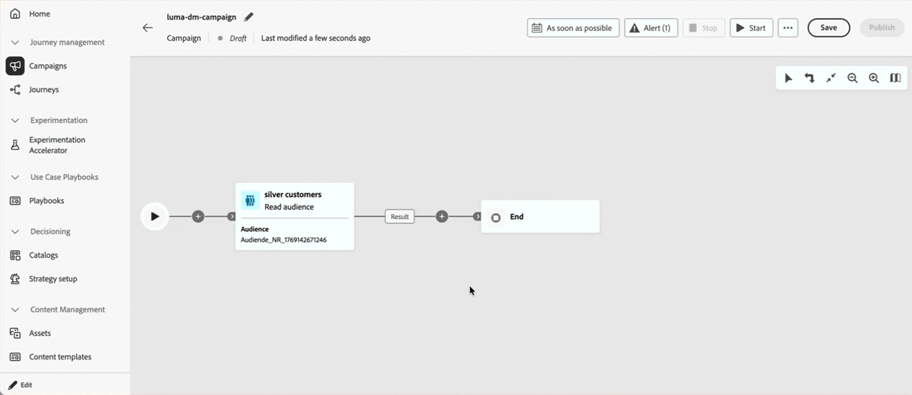

# Note sulla versione {#release-notes}

>[!CONTEXTUALHELP]
>id="ajo_homepage_card1"
>title="Novità"
>abstract="**Adobe Journey Optimizer** offre continuamente nuove funzioni, miglioramenti a quelle esistenti e correzioni di bug. Nelle presenti note sulla versione, tutte le modifiche sono consolidate durante l’ultima settimana di ogni mese."

[!DNL Adobe Journey Optimizer] segue un modello di distribuzione continua, che consente ad Adobe di fornire nuove funzioni, miglioramenti e correzioni su base continuativa. Questo approccio consente un rollout scalabile e graduale delle funzionalità per garantire prestazioni e stabilità in tutti gli ambienti.

A causa di questo modello, le note sulla versione vengono aggiornate tra le versioni mensili. Per informazioni dettagliate sul ciclo di rilascio e sulle fasi di disponibilità, consulta [Ciclo di rilascio di Journey Optimizer](releases.md).

[!DNL Adobe Journey Optimizer] è stato sviluppato in modalità nativa su [!DNL Adobe Experience Platform] e ne eredita le innovazioni e i miglioramenti più recenti. Ulteriori informazioni su queste modifiche sono disponibili nelle [Note sulla versione di Adobe Experience Platform](https://experienceleague.adobe.com/docs/experience-platform/release-notes/latest.html?lang=it){target="_blank"}.

## Note sulla versione di gennaio 2026 {#latest-rn}

**Data di rilascio**: 27-28 gennaio 2026

Le sezioni [Funzionalità](#jan-26-01-features) e [Miglioramenti](#jan-26-01-improv) riguardano le funzionalità già disponibili, mentre [Prossimamente](#jan-26-01-coming-soon) elenca gli elementi pianificati per una data di disponibilità successiva.

<!-- **The pre-release notes below are subject to change without prior notice until the release availability date**. Links, screens and updated documentation are published in the release notes, at the release date. 

See also [Adobe Experience Platform Pre-release notes](https://experienceleague.adobe.com/it/docs/experience-platform/release-notes/pre-release-notes){target="_blank"}.-->

### Nuove funzionalità {#jan-26-01-features}

<table>
<thead>
<tr>
<th><strong>Canale notifiche push web</strong> </th>
</tr>
</thead>
<tbody>
<tr>
<td>

Adobe Journey Optimizer ora supporta <strong>notifiche Web push</strong>, espandendo il canale push oltre i dispositivi mobili. Puoi inviare notifiche a <strong>browser mobili e desktop</strong>, per raggiungere i clienti direttamente sui loro dispositivi senza richiedere un'app. Questo miglioramento consente di coinvolgere gli utenti con messaggi tempestivi e personalizzati in tempo reale, sfruttando gli stessi flussi di lavoro di authoring e le stesse funzionalità di targeting già disponibili per le notifiche push dei dispositivi mobili.

Precedentemente rilasciata in versione Beta, questa funzionalità è ora disponibile per tutti gli ambienti (disponibilità generale).

Per ulteriori informazioni, consulta la <a href="../push/push-configuration-web.md">documentazione dettagliata</a>.

</td>
</tr>
</tbody>
</table>

<table>
<thead>
<tr>
<th><strong>Canale direct mailing in campagne orchestrate</strong> </th>
</tr>
</thead>
<tbody>
<tr>
<td>

Il canale direct mailing è ora disponibile nelle campagne orchestrate. L'<strong>attività Direct Mail</strong> facilita l'invio di direct mailing all'interno della campagna orchestrata, sia per messaggi occasionali che ricorrenti. Consente di automatizzare il processo di generazione del <strong>file di estrazione</strong> richiesto dai provider di direct mailing. È possibile combinare le attività del canale nell’area di lavoro della campagna orchestrata per creare campagne cross-channel in grado di attivare azioni basate sui dati e sul comportamento della clientela.

Per ulteriori informazioni, consulta la <a href="../orchestrated/activities/channels.md#channel">documentazione dettagliata</a>.

</td>
</tr>
</tbody>
</table>

<table>
<thead>
<tr>
<th><strong>Journey Agent - Creazione di un Percorso</strong> </th>
</tr>
</thead>
<tbody>
<tr>
<td>

Journey Agent ora offre funzionalità di creazione che consentono agli utenti di Journey Optimizer di creare e configurare percorsi di marketing tramite un'interfaccia <strong>in linguaggio naturale</strong>. Con queste nuove competenze, i professionisti possono creare rapidamente percorsi semplicemente descrivendo i loro requisiti in <strong>messaggi di conversazione</strong>. Questa innovazione semplifica il processo di creazione del percorso, consentendo agli addetti al marketing di concentrarsi sulla strategia anziché sulla configurazione tecnica.

Per ulteriori informazioni, consulta la <a href="../start/ai-features.md#journey-agent">documentazione dettagliata</a>.

Data di disponibilità: martedì 12 gennaio 2026

</td>
</tr>
</tbody>
</table>

<table>
<thead>
<tr>
<th><strong>API di recupero di Campaign</strong> </th>
</tr>
</thead>
<tbody>
<tr>
<td>

È ora disponibile una nuova API di Journey Optimizer che consente di recuperare e ispezionare a livello di programmazione <strong>dati relativi alla campagna</strong> quali dettagli, versioni e configurazioni.

Per ulteriori informazioni, consulta la <a href="https://developer.adobe.com/journey-optimizer-apis/references/campaigns-retrieve/" target="_blank">documentazione dettagliata</a>.

Data di disponibilità: martedì 24 novembre 2025

</td>
</tr>
</tbody>
</table>

<table>
<thead>
<tr>
<th><strong>Inviare e-mail ai temi Designer</strong> </th>
</tr>
</thead>
<tbody>
<tr>
<td>

Ora puoi applicare rapidamente <strong>temi approvati in precedenza</strong> per garantire la <strong>coerenza del brand</strong> in tutte le e-mail, velocizzare il processo di creazione della campagna e produrre in modo indipendente e-mail di alta qualità, riducendo al contempo la dipendenza dai team di progettazione.

Precedentemente rilasciata nella versione Beta, questa funzionalità è ora disponibile per un set di organizzazioni (disponibilità limitata). Per potervi accedere, contatta il tuo rappresentante Adobe.

Per ulteriori informazioni, consulta la <a href="../email/apply-email-themes.md">documentazione dettagliata</a>.

Data di disponibilità: giovedì 5 novembre 2025

</td>
</tr>
</tbody>
</table>

### Miglioramenti {#jan-26-01-improv}

#### AI

* **Controlli di qualità dei contenuti dell&#39;Assistente AI** - Oltre all&#39;allineamento del brand, ora puoi valutare la <strong>qualità dei contenuti</strong> complessiva per individuare potenziali problemi con <strong>leggibilità</strong>, coesione ed efficacia, indipendentemente dalle linee guida del brand. Questi controlli automatizzati consentono di identificare messaggi non chiari, toni incoerenti o lacune strutturali. [Ulteriori informazioni](../content-management/brands-score.md#validate-quality). [Scopri questa funzione nel video](https://video.tv.adobe.com/v/3470544/?learn=on).

#### Experience Decisioning

* **Allega frammenti agli elementi decisionali** - Journey Optimizer ora consente di allegare <strong>frammenti</strong> a <strong>elementi decisionali</strong> che possono essere utilizzati nelle campagne di esperienza basate su codice tramite i criteri decisionali. [Ulteriori informazioni](../experience-decisioning/items.md)

  **Nota**: rilasciato in precedenza in Disponibilità limitata, questo miglioramento è ora disponibile per tutti gli ambienti (Disponibilità generale).

#### Percorsi

* **Combina azioni messaggio native e Adobe Campaign** - Journey Optimizer ora consente di combinare <strong>azioni messaggio Adobe Campaign v7/v8</strong> con <strong>azioni canale native</strong> nello stesso percorso. [Ulteriori informazioni](../building-journeys/using-adobe-campaign-v7-v8.md)

* **Payload risposta errore azione personalizzata** - È ora possibile definire un payload <strong>risposta errore</strong> facoltativo per le azioni personalizzate. Quando una chiamata non riesce, il payload dell&#39;errore viene esposto nel contesto del percorso (sotto il nodo errorResponse dell&#39;azione) ed è disponibile nel ramo <strong>timeout/errore</strong>, insieme a `jo_status_code`, per supportare una logica di fallback e un debug più completi. [Ulteriori informazioni](../action/action-response.md)

* Convalida delle dimensioni del payload di **Percorso in percorsi** - Journey Optimizer ora convalida le <strong>dimensioni del payload</strong> per garantire prestazioni e stabilità ottimali del sistema. Durante la creazione o la pubblicazione di percorsi, se le dimensioni del payload si avvicinano o superano i limiti consigliati, riceverai <strong>avvisi ed errori</strong> chiari insieme a indicazioni utili per ottimizzare la configurazione del percorso. Questa convalida proattiva consente di identificare tempestivamente i potenziali problemi e di mantenere le prestazioni del percorso. [Ulteriori informazioni](../start/guardrails.md#journey-payload-size)

* **Avvisi di Percorso** - Nuovi <strong>avvisi preconfigurati</strong> sono disponibili per percorsi.
   * <strong>Frequenza eliminazioni profilo superata</strong> - Rapporto tra eliminazioni profilo e profili immessi negli ultimi 5 minuti ha superato la soglia
   * <strong>Frequenza errori azione personalizzata superata</strong> - Rapporto tra errori azione personalizzata e chiamate HTTP riuscite negli ultimi 5 minuti ha superato la soglia
   * <strong>Frequenza errori profilo superata</strong> - Rapporto tra profili in errore e profili immessi negli ultimi 5 minuti ha superato la soglia

  Per ulteriori informazioni, consulta la [documentazione dettagliata](../reports/alerts.md).

  Data di disponibilità: 14 ottobre 2025.

#### Campagne orchestrate

* **Ereditarietà delle etichette di utilizzo dati per i tipi di pubblico** - Le etichette applicate in Adobe Experience Platform ora vengono riportate automaticamente al salvataggio di <strong>tipi di pubblico</strong> nelle campagne orchestrate, riducendo l&#39;assegnazione manuale di tag <strong>DULE</strong>. [Ulteriori informazioni](../orchestrated/activities/save-audience.md)

* **Filtri predefiniti con parametri** - È ora possibile creare <strong>filtri predefiniti</strong> con <strong>parametri</strong> in campagne orchestrate per regole riutilizzabili e modificabili. [Ulteriori informazioni](../orchestrated/predefined-filters.md)

* **Selezionare gli attributi e copiare i valori di distribuzione** - È ora possibile <strong>selezionare o copiare i valori</strong> direttamente dalla visualizzazione <strong>distribuzione dei valori</strong> nelle campagne orchestrate. [Ulteriori informazioni](../orchestrated/build-query.md)

* **Conferma del messaggio prima dell&#39;invio** - Un <strong>passaggio di conferma</strong> è ora abilitato per impostazione predefinita prima dell&#39;invio di campagne orchestrate per ridurre gli invii accidentali. [Ulteriori informazioni](../orchestrated/activities/channels.md#confirm-message-sending)

* **Filtri di retargeting predefiniti** - Per supportare il retargeting più semplice per i casi di utilizzo di campagne orchestrate, questa versione introduce nuovi <strong>filtri di feedback campagna</strong>. Questi filtri ti consentono di indirizzare direttamente i tipi di pubblico in base al <strong>coinvolgimento con messaggi</strong>, ad esempio inviato, aperto, aperto o su cui è stato fatto clic oppure aperto e su cui è stato fatto clic, e selezionare la campagna specifica o in transizione di cui desideri eseguire il retargeting. [Ulteriori informazioni](../orchestrated/retarget.md)

* **Supporto per il controllo dei tassi** - Le campagne orchestrate ora supportano il <strong>controllo dei tassi</strong> per aiutarti a pianificare le consegne e allinearsi ai <strong>vincoli di volume</strong>. [Ulteriori informazioni](../orchestrated/activities/channels.md#rate-control)

* **Pulsante di riavvio** - Le campagne orchestrate ora includono un <strong>pulsante di riavvio</strong> che consente di <strong>riavviare rapidamente le esecuzioni</strong> quando necessario prima di pubblicare la campagna. [Ulteriori informazioni](../orchestrated/start-monitor-campaigns.md)

* **Supporto metadati generato dall&#39;utente**. La funzione <strong>helper executionMetadata</strong> è ora disponibile nell&#39;editor di personalizzazione per le campagne orchestrate, consentendo di allegare informazioni contestuali a qualsiasi azione nativa e di memorizzarle in un set di dati per l&#39;esportazione in sistemi esterni. [Ulteriori informazioni](../personalization/functions/helpers.md#execution-metadata)

#### Campagne

* **Pianifica campagna utilizzando il fuso orario del profilo** - La pianificazione delle campagne può ora utilizzare il <strong>fuso orario</strong> di ciascun profilo per recapitare i messaggi all&#39;ora locale prevista. [Ulteriori informazioni](../campaigns/campaign-schedule.md)

  **Nota**: questo miglioramento sarà disponibile solo per un set di organizzazioni (disponibilità limitata).

#### Autorizzazioni

* **Impedisci l&#39;autoapprovazione per percorsi e campagne** - È stata aggiunta un&#39;opzione durante la creazione o l&#39;impostazione di <strong>Criteri di approvazione</strong> per impedire ai creatori di percorsi o campagne di <strong>approvare i propri oggetti</strong>. [Ulteriori informazioni](../test-approve/approval-policies.md)

## Disponibile a breve {#jan-26-01-coming-soon}

Nei prossimi giorni, saranno rilasciati i seguenti miglioramenti e funzionalità. **Le informazioni sono soggette a modifiche**. I collegamenti, le schermate e la documentazione aggiornati verranno condivisi una volta che tali aggiornamenti saranno disponibili in produzione.

### Funzioni

<table>
<thead>
<tr>
<th><strong>Canale direct mailing in percorsi</strong> </th>
</tr>
</thead>
<tbody>
<tr>
<td>

Precedentemente limitato alle campagne, il canale <strong>Direct Mail</strong> è ora disponibile nell'area di lavoro del percorso e consente di incorporare Direct Mail nei percorsi. La direct mailing può ora essere utilizzata in <strong>scenari di percorso batch e 1:1</strong>, con il supporto per la configurazione dell'estrazione dei file e le impostazioni di frequenza basate sul tempo.

Precedentemente rilasciata in Disponibilità limitata, questa funzionalità sarà disponibile per tutti gli ambienti (Disponibilità generale).

Data di disponibilità: giovedì 28 gennaio 2026

</td>
</tr>
</tbody>
</table>

<table>
<thead>
<tr>
<th><strong>Ore non interattive (esclusioni basate sul tempo)</strong> </th>
</tr>
</thead>
<tbody>
<tr>
<td>

<strong>Ore tranquille</strong> ti consente di definire esclusioni basate sul tempo per i canali E-mail, SMS, Push e WhatsApp. Assicura che non vengano inviati messaggi in specifici periodi di tempo, aiutandoti a rispettare le preferenze dei clienti e i requisiti di conformità. Puoi applicare le ore non interattive tramite <strong>set di regole</strong>, che possono essere assegnate a singole azioni in campagne o percorsi per un controllo preciso.

Precedentemente rilasciata in Disponibilità limitata, questa funzione è ora disponibile per tutti gli ambienti. Con questa versione con disponibilità generale, la funzione ora include la possibilità per il cliente di mettere in coda un’azione della campagna fino al completamento delle Ore non interattive e la possibilità di visualizzare in anteprima la regola delle Ore non interattive.

Data di disponibilità: giovedì 28 gennaio 2026

</td>
</tr>
</tbody>
</table>

<table>
<thead>
<tr>
<th><strong>API per strumenti di migrazione self-service</strong> </th>
</tr>
</thead>
<tbody>
<tr>
<td>

<strong>Le API per strumenti di migrazione</strong> sono ora disponibili per migrare a livello di programmazione le entità di gestione delle decisioni in Decisioning, con:

<ul>
<li>Ambiti di migrazione flessibili (livello sandbox, offerta o decisione)</li>
<li>Analisi e convalida delle dipendenze automatizzate</li>
<li>Supporto del rollback per le migrazioni completate</li>
<li>Rapporti dettagliati sulla migrazione con mappature oggetto</li>
</ul>

Data di disponibilità: giovedì 28 gennaio 2026

</td>
</tr>
</tbody>
</table>

<table>
<thead>
<tr>
<th><strong>Monitoraggio delle azioni personalizzato</strong> </th>
</tr>
</thead>
<tbody>
<tr>
<td>

Approfondisci insight sullo stato e sulle prestazioni dei tuoi <strong>endpoint di azione personalizzati</strong> con un nuovo dashboard di monitoraggio e dati arricchiti dell'evento del passaggio di percorso. Tieni traccia di chiamate, errori, velocità effettiva, tempi di risposta e tempi di attesa delle code per capire rapidamente quando, dove e perché si verificano anomalie.

Precedentemente rilasciata in disponibilità limitata, questa funzionalità è ora disponibile per tutti gli ambienti (disponibilità generale).

Data di disponibilità: giovedì 28 gennaio 2026

</td>
</tr>
</tbody>
</table>

<table>
<thead>
<tr>
<th><strong>Esportazione messaggio</strong> </th>
</tr>
</thead>
<tbody>
<tr>
<td>

È ora disponibile una nuova funzionalità <strong>Esportazione messaggi</strong> per i canali e-mail e SMS. Questa funzione consente di esportare automaticamente il contenuto dei messaggi inviati in un set di dati Experience Platform dedicato, consentendoti di:

<ul>
<li>Soddisfare i requisiti di conformità alle normative (ad esempio HIPAA)</li>
<li>Archiviare i messaggi per richieste di rimborso legali e richieste di assistenza clienti</li>
<li>Mantieni copie dei contenuti personalizzati inviati a singoli utenti</li>
</ul>

I record vengono conservati nel set di dati di esportazione dei messaggi di AJO per 7 giorni di calendario dall’acquisizione. Durante questo periodo di conservazione, puoi esportare i dati nel tuo archivio tramite le destinazioni Experience Platform. La funzionalità è abilitata a livello di configurazione del canale, fornendo <strong>il controllo granulare</strong> su cui vengono esportati i messaggi.

Questa funzionalità è disponibile solo per il canale e-mail e SMS, per le organizzazioni che hanno acquistato l’offerta del componente aggiuntivo Esportazione messaggi. Per ulteriori informazioni, contatta il tuo rappresentante Adobe.

Data di disponibilità: sabato 30 gennaio 2026

</td>
</tr>
</tbody>
</table>

<table>
<thead>
<tr>
<th><strong>Generazione di contenuti in Journey Agent</strong> </th>
</tr>
</thead>
<tbody>
<tr>
<td>

Con tecnologia Adobe Experience Platform Agent Orchestrator, <strong>Journey Agent</strong> è disponibile in Journey Optimizer e consente di analizzare i percorsi tramite un'interfaccia in linguaggio naturale. Ora puoi anche <strong>generare e gestire i contenuti</strong> direttamente in Journey Agent, creando contenuti per canali quali e-mail e push, applicando e visualizzando in anteprima i modelli, perfezionando il tono e lo stile tramite le richieste e aprendo i contenuti in Content Designer per la modifica nel contesto.

Data di disponibilità: martedì 2 febbraio 2026

</td>
</tr>
</tbody>
</table>

<table>
<thead>
<tr>
<th><strong>Supporto per le decisioni nei canali push e SMS</strong> </th>
</tr>
</thead>
<tbody>
<tr>
<td>

Ora puoi personalizzare e ottimizzare il contenuto dei <strong>messaggi push e SMS</strong> con <strong>decisioning</strong>. Utilizza Punteggi di priorità, Formule o Modelli di intelligenza artificiale per mostrare ai clienti il contenuto migliore.

Data di disponibilità: mercoledì 3 febbraio 2026

</td>
</tr>
</tbody>
</table>

<table>
<thead>
<tr>
<th><strong>Attività di decisione sui contenuti</strong> </th>
</tr>
</thead>
<tbody>
<tr>
<td>

Una nuova <strong>attività Content Decision</strong> è ora disponibile nell'area di lavoro del percorso per l'integrazione di <strong>offerte personalizzate</strong> direttamente nei percorsi di clienti. Questa attività ti consente di fornire contenuti basati su decisioni e di fare riferimento a tali offerte in tutto il tuo percorso, in condizioni per la creazione di diramazioni basate sull’idoneità, in azioni personalizzate per il passaggio dei dati delle offerte a sistemi esterni e in altre attività per la creazione di esperienze cliente completamente personalizzate.

Questa funzionalità sarà disponibile per tutti gli ambienti (disponibilità generale).

Data di disponibilità: mercoledì 3 febbraio 2026

</td>
</tr>
</tbody>
</table>

### Miglioramenti

* **Webhook SMS** - <strong>Webhook</strong> ora supportati in tutti i provider SMS. Puoi configurare ogni webhook in base allo scopo previsto, ai webhook in entrata per acquisire i messaggi in arrivo e ai webhook di feedback per ricevere le conferme di consegna, gli aggiornamenti di stato e altri eventi relativi ai messaggi.

  Data di disponibilità: 28 gennaio 2026.
