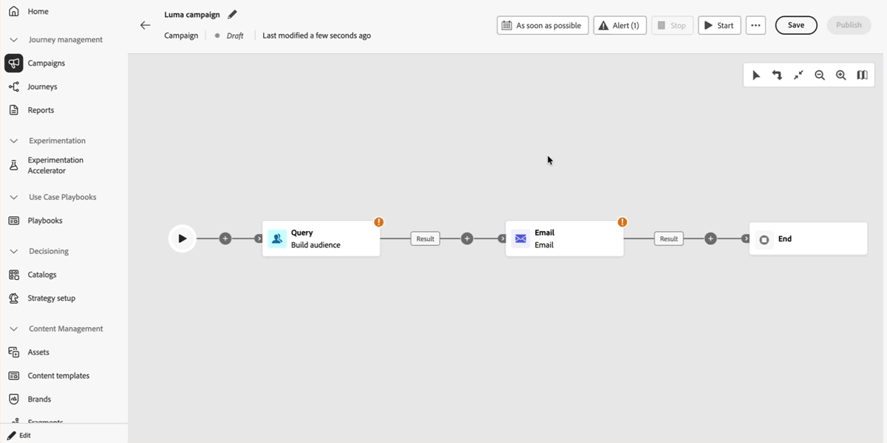
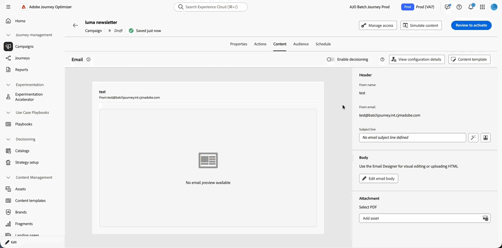

# Note sulla versione {#release-notes}

>[!CONTEXTUALHELP]
>id="ajo_homepage_card1"
>title="Novità"
>abstract="**Adobe Journey Optimizer** offre continuamente nuove funzionalità, miglioramenti alle funzionalità esistenti e correzioni di bug. Nelle presenti note sulla versione, tutte le modifiche sono consolidate durante l’ultima settimana di ogni mese."

[!DNL Adobe Journey Optimizer] segue un modello di distribuzione continua, che consente ad Adobe di fornire nuove funzionalità, miglioramenti e correzioni su base continuativa. Questo approccio consente un rollout scalabile e graduale delle funzionalità per garantire prestazioni e stabilità in tutti gli ambienti.

A causa di questo modello, le note sulla versione vengono aggiornate prima del successivo rilascio mensile. Per informazioni dettagliate sul ciclo di rilascio e sulle fasi di disponibilità, consulta [Ciclo di rilascio di Journey Optimizer](releases.md).

[!DNL Adobe Journey Optimizer] è stato sviluppato in modalità nativa su [!DNL Adobe Experience Platform] e ne eredita le innovazioni e i miglioramenti più recenti. Ulteriori informazioni su queste modifiche sono disponibili nelle [Note sulla versione di Adobe Experience Platform](https://experienceleague.adobe.com/docs/experience-platform/release-notes/latest.html?lang=it){target="_blank"}.

## Note sulla versione di marzo 2026 {#march-26-rn}

Le sezioni [Nuove funzionalità](#march-26-features) e [Miglioramenti](#march-26-improv) riguardano le funzionalità già disponibili. Nella sezione [In arrivo](#coming-soon) sono elencate le funzionalità e i miglioramenti pianificati per il rilascio più avanti nel mese di marzo.

<!--
**The pre-release notes below are subject to change without prior notice until the release availability date**. Links, screens and updated documentation are published in the release notes, at the release date.

See also [Adobe Experience Platform pre-release notes](https://experienceleague.adobe.com/en/docs/experience-platform/release-notes/pre-release-notes){target="_blank"}.-->

**Data di rilascio**: 24-25 marzo 2026

### Nuove funzionalità {#march-26-features}

<table>
<thead>
<tr>
<th><strong>Moduli personalizzati della pagina di destinazione</strong> </th>
</tr>
</thead>
<tbody>
<tr>
<td>

Con [!DNL Journey Optimizer] puoi acquisire gli attributi del profilo tramite le pagine di destinazione.

Crea, progetta e gestisci moduli personalizzati adatti alle tue esigenze sulla base di un set di dati specifico. Puoi quindi sfruttare questi moduli nelle pagine di destinazione per aggiungere gli attributi di profilo desiderati nel set di dati definito per ciascun modulo.

Precedentemente rilasciata in Disponibilità limitata per i clienti negli Stati Uniti e in Australia, questa funzionalità è ora disponibile per tutti gli ambienti (Disponibilità generale).

Per ulteriori informazioni, consulta la <a href="../landing-pages/lp-forms.md">documentazione dettagliata</a>.

Data di disponibilità: 26 marzo 2026.

</td>
</tr>
</tbody>
</table>

<table>
<thead>
<tr>
<th><strong>Attività di test nelle campagne orchestrate</strong> </th>
</tr>
</thead>
<tbody>
<tr>
<td>

Una nuova attività <strong>Test</strong> è ora disponibile nelle campagne orchestrate. Questa attività indirizza l’esecuzione del flusso di lavoro a rami diversi in base a condizioni definite, consentendo di convalidare la logica e le configurazioni della campagna prima di attivare le consegne live.

Per ulteriori informazioni, consulta la <a href="../orchestrated/activities/test.md">documentazione dettagliata</a>.

</td>
</tr>
</tbody>
</table>

<table>
<thead>
<tr>
<th><strong>Supporto della ricerca di set di dati in percorsi</strong> </th>
</tr>
</thead>
<tbody>
<tr>
<td>

Una nuova attività <strong>Ricerca set di dati</strong> in percorsi consente di recuperare dinamicamente i dati dai set di dati dei record di Adobe Experience Platform in fase di esecuzione, consentendo l'accesso a informazioni che non fanno parte del payload del profilo o dell'evento, in modo che le interazioni dei clienti rimangano pertinenti e tempestive.

Precedentemente rilasciata in Disponibilità limitata a un set limitato di organizzazioni, l’attività di ricerca del set di dati in percorsi è ora disponibile per tutti i clienti autorizzati a [ricerca set di dati](../data/lookup-aep-data.md), pur rimanendo in Disponibilità limitata.

Per ulteriori informazioni, consulta la <a href="../building-journeys/dataset-lookup.md">documentazione dettagliata</a>.

</td>
</tr>
</tbody>
</table>

<table>
<thead>
<tr>
<th><strong>L’attività Azione sostituisce le attività di percorso specifiche per il canale</strong> </th>
</tr>
</thead>
<tbody>
<tr>
<td>

In seguito alla disponibilità generale dell'attività <strong>Azione</strong> nel febbraio 2026, le attività legacy del canale nativo (e-mail, push, SMS, in-app, web, esperienza basata su codice e scheda contenuto) nell'area di lavoro del percorso sono ora obsolete.

Ora puoi utilizzare una singola <strong>attività Azione</strong> per configurare tutte le azioni del canale, sostituendo la necessità di nodi specifici del canale separati.

I percorsi esistenti che utilizzano attività di canale legacy continuano a funzionare senza la necessità di apportare modifiche o migrazioni.

Per ulteriori informazioni, consulta la <a href="../building-journeys/journey-action.md">documentazione dettagliata</a>.

</td>
</tr>
</tbody>
</table>

<table>
<thead>
<tr>
<th><strong>Editor HTML avanzato per modelli e-mail</strong> </th>
</tr>
</thead>
<tbody>
<tr>
<td>

La modalità HTML avanzata per i modelli di contenuto e-mail consente di modificare l’origine HTML del contenuto nel Designer e-mail, aggiungere espressioni avanzate (come condizioni) nell’origine e passare dalla vista HTML a quella desktop senza perdere le modifiche.

Questa funzionalità è disponibile solo nei modelli di contenuto per il canale e-mail. Attualmente è in disponibilità limitata; per ottenere l’accesso, contatta il rappresentante Adobe.

Per ulteriori informazioni, consulta la <a href="../content-management/email-template-expert-mode.md">documentazione dettagliata</a>.

Data di disponibilità: mercoledì 10 marzo 2026

</td>
</tr>
</tbody>
</table>

<table>
<thead>
<tr>
<th><strong>Integrazione di modelli Firefly personalizzati e modelli di generazione di immagini di terze parti</strong> </th>
</tr>
</thead>
<tbody>
<tr>
<td>

Integrazione perfetta di modelli Firefly standard e personalizzati, insieme a modelli di immagini di terze parti approvati, per fornire maggiore flessibilità, controllo e allineamento del brand durante la generazione delle immagini.

Scegli il modello giusto per le tue esigenze:

<ul><li> <strong>Adobe model</strong> (con tecnologia Firefly Image Model 4) per la generazione immediata di immagini senza installazione aggiuntiva</li><li> <strong>Modello partner</strong> (con tecnologia Gemini 2.5 Flash) per funzionalità specializzate</li><li><strong>Modelli personalizzati</strong> (modelli specifici del brand addestrati sulle tue risorse) per la generazione di prodotti sul brand che sono allineati con precisione alla tua identità del brand, allo stile e alle linee guida visive.</li></ul>

Per ulteriori informazioni, consulta la <a href="../content-management/generative-models.md">documentazione dettagliata</a>.

Data di disponibilità: martedì 2 marzo 2026

</td>
</tr>
</tbody>
</table>

<table>
<thead>
<tr>
<th><strong>Attività live per iOS</strong> </th>
</tr>
</thead>
<tbody>
<tr>
<td>

Porta le esperienze in tempo reale direttamente su Blocca Screens e Dynamic Island dei tuoi clienti con <strong>iOS Live Activity</strong> in Adobe Journey Optimizer. Consegna aggiornamenti live, dal tracciamento degli ordini e dello stato dei voli, ai conteggi degli eventi, ai punteggi live e all’avanzamento della consegna, senza richiedere agli utenti di aprire l’app. Tieni il pubblico informato e coinvolto al momento giusto, proprio dove si trova.

Precedentemente rilasciata in versione beta, questa funzionalità è ora disponibile per tutti gli ambienti (disponibilità generale).

Per ulteriori informazioni, consulta la <a href="../mobile-live/get-started-mobile-live.md">documentazione dettagliata</a>.

Data di disponibilità: mercoledì 3 marzo 2026

</td>
</tr>
</tbody>
</table>

<table>
<thead>
<tr>
<th><strong>Journey Agent: creazione di contenuti del canale</strong> </th>
</tr>
</thead>
<tbody>
<tr>
<td>

Con tecnologia <strong>Adobe Experience Platform Agent Orchestrator</strong>, <strong>Journey Agent</strong> è disponibile in Journey Optimizer e consente di analizzare i percorsi tramite un'interfaccia in linguaggio naturale. È inoltre possibile generare e gestire contenuti specifici per il canale direttamente in Journey Agent, creando contenuti per canali quali e-mail e push, applicando e visualizzando in anteprima modelli, perfezionando tono e stile tramite prompt e aprendo contenuti in <strong>Content Designer</strong> per la modifica nel contesto.

Questa funzionalità è disponibile solo per un set di organizzazioni (LA, disponibilità limitata). Per potervi accedere, contatta il tuo rappresentante Adobe.

Per ulteriori informazioni, consulta la <a href="https://experienceleague.adobe.com/docs/experience-cloud-ai/experience-cloud-ai/agents/ajo-agent.html" target="_blank">documentazione dettagliata</a>.

Data di disponibilità: giovedì 4 marzo 2026

</td>
</tr>
</tbody>
</table>

<table>
<thead>
<tr>
<th><strong>Monitoraggio del modello di IA</strong> </th>
</tr>
</thead>
<tbody>
<tr>
<td>

Journey Optimizer ora consente di monitorare lo stato, lo stato di formazione e le prestazioni dei modelli di IA per il decisioning. Questo consente di verificare il successo della formazione, risolvere eventuali problemi e comprendere l’impatto sui risultati, al fine di selezionare le offerte migliori per ogni cliente che utilizza l’intelligenza artificiale. Questa funzionalità è disponibile solo per <strong>Decisioning</strong> (non per i modelli di gestione delle decisioni legacy).

Questa funzionalità è attualmente disponibile solo per i modelli di <strong>ottimizzazione personalizzata</strong> (non ottimizzazione automatica).

Per ulteriori informazioni, consulta la <a href="../experience-decisioning/ranking/ai-model-observability.md">documentazione dettagliata</a>.

Data di disponibilità: martedì 9 marzo 2026

</td>
</tr>
</tbody>
</table>

<table>
<thead>
<tr>
<th><strong>Attivare campagne orchestrate utilizzando un segnale</strong> </th>
</tr>
</thead>
<tbody>
<tr>
<td>

È ora possibile attivare le campagne orchestrate tramite un <strong>segnale API</strong>. Per configurare questa impostazione, configura la campagna di destinazione come <strong>Attivata da un segnale</strong>, pubblicala e attivala tramite una chiamata API. Tutti i parametri inclusi nella chiamata API sono disponibili come variabili all’interno della campagna in esecuzione. Tieni presente che le campagne orchestrate attivate dal segnale rimangono <strong>campagne batch</strong> e sono diverse dalle campagne attivate dall'API.

Per ulteriori informazioni, consulta la <a href="../orchestrated/trigger-orchestrated-campaign.md">documentazione dettagliata</a>.

</td>
</tr>
</tbody>
</table>

<table>
<thead>
<tr>
<th><strong>Categoria transazionale nelle campagne orchestrate</strong> </th>
</tr>
</thead>
<tbody>
<tr>
<td>

Nelle campagne orchestrate, ora puoi impostare un'attività del canale sulla categoria <strong>Transazionale</strong>. Questo applica configurazioni del canale transazionale a tale attività ed è utile quando le regole aziendali non devono essere applicate o quando non è richiesto il consenso dei clienti.

Per ulteriori informazioni, consulta la <a href="../orchestrated/activities/channels.md#add">documentazione dettagliata</a>.

Nei prossimi giorni questa funzionalità verrà gradualmente implementata in tutte le aree geografiche.

</td>
</tr>
</tbody>
</table>

### Miglioramenti {#march-26-improv}

Di seguito sono elencati i miglioramenti inclusi in questa versione.

#### Generazione dei rapporti

* **Ottimizzazione dell&#39;ora di invio: la posizione dei controlli aggiornata e il nuovo rapporto di incremento** - I controlli di ottimizzazione dell&#39;ora di invio (STO) sono stati spostati nel menu di configurazione Azione. Inoltre, è ora disponibile un nuovo rapporto lift nei rapporti Percorsi per misurare l’impatto dell’STO sulle metriche delle prestazioni della campagna. [Ulteriori informazioni](../reports/channel-report-cja.md#optimization-models)

  Data di disponibilità: sabato 27 marzo 2026

<!--

* **Exclude bot clicks for email and SMS reporting** - Email and SMS reporting now automatically filters out bot clicks from click metrics, providing more accurate engagement data and preventing automated traffic from inflating your performance figures.

#### Email Designer

* **Email Designer displayed in Unified Shell** - The Email Designer is now displayed within the Unified Shell experience, providing a consistent navigation and header experience that aligns with other Adobe applications.

* **Text mode support in fragments** - To support text-based email workflows, you can now create and manage text versions of your visual fragments for optimal use in the plain text version of emails that include that fragment.

  **Caution:** When using a fragment that was created before the current release, the fragment text version may be incorrectly rendered—both in the Email Designer and in the final email delivered to your recipients. For best results with older fragments, edit, save and republish each fragment.-->
<!--
#### Decisioning

* **Optional fragments in decision items** - When using fragments in decision items, you can now make a fragment optional so that if it is temporarily unavailable on Edge, it is skipped and the journey or campaign continues rendering instead of failing.
-->

#### Configurazione

<!--* **Folders for journeys and campaigns** - You can now organize your journeys and campaigns into folders, enabling structured navigation and easier management for teams working with large volumes of content. This capability is only available for a set of organizations (Limited Availability). To gain access, contact your Adobe representative.-->

* **Rinnovo dei certificati di dominio AJO non riuscito** - È ora possibile abbonarsi per ricevere gli avvisi di sistema, tramite e-mail o nel centro notifiche Journey Optimizer, quando un certificato di dominio utilizzato per il recapito messaggi e-mail sta per scadere o è già scaduto. [Ulteriori informazioni](../reports/alerts.md#alert-certificates-renewal-unsuccessful)

  Data di disponibilità: venerdì 26 marzo 2026

* **AJO Secondary Recipient Feedback Event Rename** - Il set di dati `AJO Email BCC Feedback Event` è stato rinominato in `AJO Secondary Recipient Feedback Event`. L’impatto varia a seconda della situazione:

   * **Utenti esistenti**: viene aggiornato solo il nome visualizzato. Il nome della tabella sottostante rimane invariato.
   * **Nuovi utenti e sandbox**: sia il nome visualizzato che il nome della tabella riflettono il nuovo nome.
   * **Utenti esistenti con nuove sandbox**: il nome visualizzato e il nome della tabella vengono aggiornati al nuovo nome.

  Data di disponibilità: martedì 2 marzo 2026

#### Percorsi

* **Azione Aggiorna profilo: supporto per più attributi di profilo** - L&#39;attività dell&#39;azione **Aggiorna profilo** ora supporta l&#39;aggiornamento di un massimo di cinque attributi di profilo in un singolo nodo. In precedenza, ogni azione poteva aggiornare un solo attributo alla volta, richiedendo a più nodi di aggiornare diversi attributi. Utilizza il nuovo pulsante **Aggiorna un altro campo** per aggiungere altre coppie campo/valore, riducendo la complessità dell&#39;area di lavoro e migliorando le prestazioni. [Ulteriori informazioni](../building-journeys/update-profiles.md)

* **Invio ondata di messaggi in uscita in percorsi** - È ora possibile pianificare i messaggi provenienti da percorsi Journey Optimizer da recapitare in batch controllati nel tempo. [Ulteriori informazioni](../building-journeys/send-using-waves.md)

  Precedentemente rilasciata in Disponibilità limitata per l’utilizzo in percorsi, questa funzionalità è ora disponibile per tutti gli ambienti (Disponibilità generale).

  Data di disponibilità: martedì 16 marzo 2026

* **Sospendi e riprendi dettagli nei dettagli tecnici del percorso** - I **dettagli tecnici** del percorso ora includono ulteriori informazioni sulla pausa e sulla ripresa: la data e l&#39;ora dell&#39;ultima pausa e della ripresa, il nome visualizzato e l&#39;identificatore interno dell&#39;utente che ha eseguito ogni azione e un set completo di impostazioni di percorso in pausa come il comportamento della pausa, la durata massima della pausa e lo stato di ripresa automatica. [Ulteriori informazioni](../building-journeys/journey-properties.md)

  Data di disponibilità: martedì 2 marzo 2026

## Disponibile a breve {#coming-soon}

Le funzioni e i miglioramenti riportati di seguito verranno rilasciati più avanti in marzo/inizio aprile. Le date di rilascio e l&#39;ambito sono **soggetti a modifiche senza preavviso**.

### Funzionalità

<table>
<thead>
<tr>
<th><strong>Conversione di immagini in modelli di contenuto e-mail</strong> </th>
</tr>
</thead>
<tbody>
<tr>
<td>

Ora è possibile convertire le immagini in modelli di contenuto e-mail direttamente in Journey Optimizer. Utilizza l’analisi basata sull’intelligenza artificiale per generare automaticamente modelli HTML strutturati dai riferimenti visivi, riducendo in modo significativo i tempi di progettazione delle e-mail.

Precedentemente rilasciata in Disponibilità limitata, questa funzionalità è ora disponibile per tutti gli ambienti (Disponibilità generale). <a href="../content-management/image-to-html.md">Ulteriori informazioni</a>

Data di disponibilità: mercoledì 31 marzo 2026

</td>
</tr>
</tbody>
</table>

<table>
<thead>
<tr>
<th><strong>Crittografia dei parametri URL</strong> </th>
</tr>
</thead>
<tbody>
<tr>
<td>

I parametri URL nei collegamenti di tracciamento e nelle pagine di destinazione ora possono essere crittografati, fornendo un ulteriore livello di sicurezza per i dati sensibili dei parametri.

<ul>
<li>Registra e gestisci le chiavi di crittografia in un registro <strong>Amministrazione</strong> dedicato.</li>
<li>Utilizza il nuovo helper per la crittografia nelle espressioni per crittografare i dati sensibili nei collegamenti di tracciamento e negli URL delle pagine di destinazione per i parametri di query che desideri proteggere al momento del rendering.</li>
</ul>

Questa funzionalità è disponibile solo per un set di organizzazioni (LA, disponibilità limitata). Per potervi accedere, contatta il tuo rappresentante Adobe.

Data di disponibilità: mercoledì 31 marzo 2026

</td>
</tr>
</tbody>
</table>

<table>
<thead>
<tr>
<th><strong>Casella in entrata</strong> </th>
</tr>
</thead>
<tbody>
<tr>
<td>

<strong>Posta in arrivo</strong> è una funzionalità mobile disponibile con schede contenuto che consente ai clienti di creare una posizione centralizzata all'interno dell'app o del sito Web per visualizzare i messaggi inviati agli utenti. Questo estende la durata delle comunicazioni di marketing garantendo che i messaggi rimangano accessibili anche dopo essere stati chiusi.

Data di disponibilità: giovedì 1 aprile 2026

</td>
</tr>
</tbody>
</table>

<table>
<thead>
<tr>
<th><strong>Ottimizzazione del percorso</strong> </th>
</tr>
</thead>
<tbody>
<tr>
<td>

Utilizza il nuovo nodo Optimize per rivolgerti a tipi di pubblico specifici oppure esegui test A/B per determinare il percorso migliore per soddisfare i KPI incentrati sull’azienda.
Questo strumento consente di testare e variare e di personalizzare le comunicazioni, la sequenza e la tempistica per raggiungere al meglio la clientela.

Precedentemente rilasciata in Disponibilità limitata, questa funzionalità è ora disponibile per tutti gli ambienti (Disponibilità generale). <a href="../building-journeys/optimize.md">Ulteriori informazioni</a>

Come parte della disponibilità generale, questa versione introduce la selezione del <strong>tipo di esperimento</strong> (A/B o slot machine) e <strong>Scala il vincitore</strong> per percorsi unitari.

Data di disponibilità: sabato 3 aprile 2026

</td>
</tr>
</tbody>
</table>

<table>
<thead>
<tr>
<th><strong>Supporto per le decisioni nel canale e-mail</strong> </th>
</tr>
</thead>
<tbody>
<tr>
<td>

È ora possibile utilizzare <strong>Decisioning</strong> per personalizzare e ottimizzare il contenuto dei messaggi di posta elettronica. Sfrutta punteggi di priorità, formule o modelli di IA per visualizzare le offerte e i contenuti più rilevanti per ogni destinatario.

Precedentemente rilasciata in Disponibilità limitata, questa funzionalità è ora disponibile per tutti gli ambienti (Disponibilità generale). Con questa versione di disponibilità generale, sono ora supportate le pagine mirror.

<!--
For more information, refer to the <a href="../experience-decisioning/create-decision-policy.md">detailed documentation</a>.
-->

Data di disponibilità: sabato 3 aprile 2026

</td>
</tr>
</tbody>
</table>

<!--
WAITING RELEASE DATE CONFIRMATION
* **Target dimension simplification in Orchestrated Campaigns** - The active targeting dimension is now shown on the workflow canvas, so you can see which dimension is used by a channel activity. The multi-entity segmentation flow is simpler as you no longer need a separate "Change dimension" activity. Moreover, you can now choose explicitly whether messages are sent at the profile level or at a secondary dimension level.

<--
TO ADD when Path optimization is GA:

* **Experiment type** - You can now choose between A/B experiment (fixed split at the start) or Multi-armed bandit (automatic split with weekly weight updates) when configuring a path experiment.

* **Path experimentation: Scale the Winner** - You can now automatically or manually roll out the winning path of an experiment to your full audience. Once a winner is determined, you can amplify its reach and effectiveness without constantly monitoring the experiment.
This capability is available only in unitary journeys (event-triggered and Audience qualifications). It is not available for Read audience journeys.

-->
