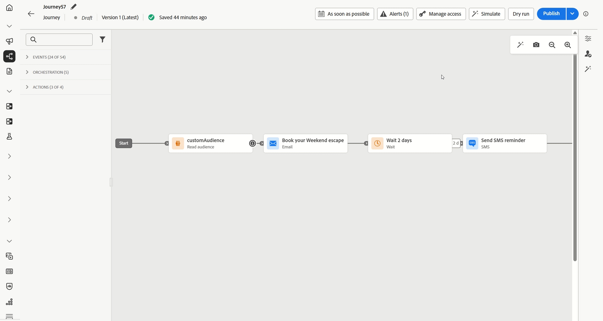
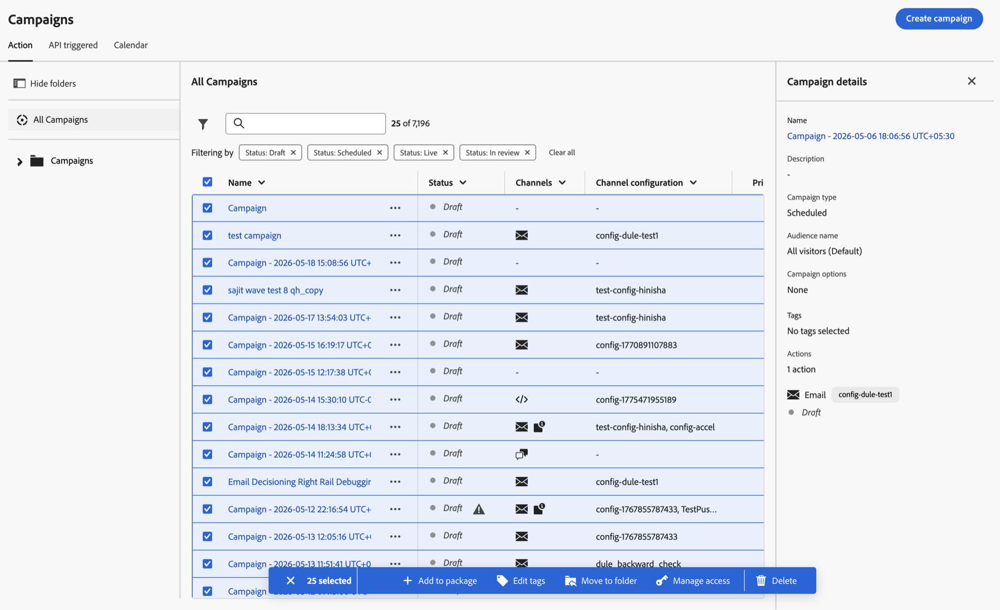

# Note sulla versione {#release-notes}

>[!CONTEXTUALHELP]
>id="ajo_homepage_card1"
>title="Novità"
>abstract="**Adobe Journey Optimizer** offre in modo continuo nuove funzionalità, miglioramenti a quelle esistenti e correzioni di bug. Nelle presenti note sulla versione, tutte le modifiche sono consolidate durante l’ultima settimana di ogni mese."

[!DNL Adobe Journey Optimizer] segue un modello di distribuzione continua, che consente ad Adobe di fornire nuove funzionalità, miglioramenti e correzioni su base regolare. Questo approccio consente un rollout scalabile e graduale delle funzionalità per garantire prestazioni e stabilità in tutti gli ambienti. A causa di questo modello, le note sulla versione vengono aggiornate prima del successivo rilascio mensile. Per informazioni dettagliate sul ciclo di rilascio e sulle fasi di disponibilità, consulta [Ciclo di rilascio di Journey Optimizer](releases.md).

[!DNL Adobe Journey Optimizer] è stato sviluppato in modalità nativa su [!DNL Adobe Experience Platform] e ne eredita le innovazioni e i miglioramenti più recenti. Ulteriori informazioni su queste modifiche sono disponibili nelle [Note sulla versione di Adobe Experience Platform](https://experienceleague.adobe.com/docs/experience-platform/release-notes/latest.html?lang=it){target="_blank"}.

>[!NOTE]
>
>Le funzionalità elencate in queste note sulla versione includono una **Data di disponibilità** che indica quando ogni modifica diventa accessibile nell&#39;ambiente. Le voci nelle **In arrivo** previsioni sono previste nei prossimi giorni o settimane. Le informazioni contenute in queste sezioni sono soggette a modifiche.

## Aggiornamenti di giugno 2026 {#june-26-updates}

<table>
<thead>
<tr>
<th><strong>Simulazione percorso (disponibilità generale)</strong> </th>
</tr>
</thead>
<tbody>
<tr>
<td>

Ora puoi impostare il percorso su Simulazione. Questa modalità ti consente di convalidare la logica utilizzando utenti simulati. Si tratta di profili temporanei creati appositamente per la simulazione, che consentono di eseguire liberamente i test senza dover gestire profili di test persistenti in Adobe Experience Platform. 

Precedentemente rilasciata in Disponibilità limitata, la simulazione del Percorso è ora disponibile per tutti gli ambienti. Con questa versione di disponibilità generale, ora puoi utilizzare Journey Agent per generare utenti ed eventi simulati direttamente nel menu Simulazione.

Per ulteriori informazioni, consulta la <a href="../building-journeys/simulate-journey-gs.md">documentazione dettagliata</a>.

Data di disponibilità: 9 giugno 2026

</td>
</tr>
</tbody>
</table>

<table>
<thead>
<tr>
<th><strong>Ottimizzazione del percorso del percorso - Targeting (disponibilità generale)</strong> </th>
</tr>
</thead>
<tbody>
<tr>
<td>

L'attività <strong>Ottimizza</strong> ora supporta <strong>Regole di targeting</strong> che consentono di definire criteri specifici che i clienti devono soddisfare per qualificarsi per un particolare percorso di percorso, in base a segmenti di pubblico o attributi di profilo.

A differenza della sperimentazione, in cui i clienti vengono assegnati in modo casuale ai percorsi, il targeting utilizza una logica deterministica per garantire che il pubblico o il profilo cliente appropriato venga indirizzato al percorso previsto.

Precedentemente rilasciata in disponibilità limitata, questa funzionalità è ora disponibile per tutti gli ambienti (disponibilità generale).

Per ulteriori informazioni, consulta la <a href="../building-journeys/path-targeting.md">documentazione dettagliata</a>.

Data di disponibilità: 8 giugno 2026

</td>
</tr>
</tbody>
</table>

<table>
<thead>
<tr>
<th><strong>Frammenti di percorso (disponibilità generale)</strong> </th>
</tr>
</thead>
<tbody>
<tr>
<td>

È ora possibile creare <strong>frammenti di Percorso</strong> in Adobe Journey Optimizer. I frammenti di percorso sono set riutilizzabili di nodi di percorso che è possibile compilare una volta e rilasciare in qualsiasi percorso della sandbox. Che si tratti di un controllo di idoneità, di una logica di indirizzamento dei canali preferita o di una sequenza di benvenuto, i frammenti consentono ai team di spostarsi più rapidamente e rimanere coerenti, senza dover ogni volta ricostruire la stessa logica da zero.

Una volta creati, i frammenti vengono memorizzati in un <strong>Inventario frammenti</strong> dedicato e possono essere inseriti in qualsiasi percorso utilizzando l'attività <strong>Frammenti Percorso</strong>.

Precedentemente disponibile in Disponibilità limitata, questa funzionalità è ora generalmente disponibile per tutti i clienti. I frammenti di percorso supportano anche <strong>Strumenti sandbox</strong>, che consentono di creare pacchetti ed esportare frammenti tra sandbox diverse.

Per ulteriori informazioni, consulta la <a href="../building-journeys/journey-fragments.md">documentazione dettagliata</a>.

Data di disponibilità: 9 giugno 2026

</td>
</tr>
</tbody>
</table>

<table>
<thead>
<tr>
<th><strong>Simula varianti di contenuto: generazione di varianti di esperienza e IA aggiornate</strong> </th>
</tr>
</thead>
<tbody>
<tr>
<td>

Sono ora disponibili due aggiornamenti per il flusso di lavoro <strong>Simula contenuto</strong>:

<ul>
<li><strong>Nuovo percorso predefinito</strong>. Facendo clic su <strong>Simula contenuto</strong>, ora viene aperta l'esperienza <strong>Simula varianti di contenuto</strong> per impostazione predefinita. Da una singola schermata, puoi aggiungere input di esempio manualmente o da un file CSV/JSON, riutilizzare gli utenti simulati, visualizzare in anteprima il rendering e inviare bozze. Per visualizzare l'anteprima con i profili di test di Adobe Experience Platform, inviare bozze con i dati del profilo di test o controllare il rendering della casella in entrata e i rapporti di posta indesiderata, fai clic su <strong>Simula contenuto</strong>, quindi seleziona <strong>Simula contenuto (profili AEP)</strong> dal menu a discesa.</li>
<li><strong>Varianti di contenuto generate dall'intelligenza artificiale</strong>: nell'esperienza <strong>Simula varianti di contenuto</strong>, fai clic su <strong>Genera</strong> per utilizzare l'intelligenza artificiale per creare automaticamente varianti di contenuto. Il sistema analizza il messaggio, rileva i campi di personalizzazione e i rami condizionali e inserisce valori realistici in modo da poter convalidare il rendering senza creare manualmente ogni variante.</li>
</ul>

Per ulteriori informazioni, consulta la <a href="../test-approve/simulate-sample-input.md">documentazione dettagliata</a>.

Data di disponibilità: 9 giugno 2026

</td>
</tr>
</tbody>
</table>

<table>
<thead>
<tr>
<th><strong>Supporto per le decisioni nel canale Direct Mail</strong> </th>
</tr>
</thead>
<tbody>
<tr>
<td>

Ora puoi aggiungere i criteri di decisione ai percorsi e alle campagne di Direct Mail. I criteri di decisione sono contenitori per le offerte che sfruttano il motore di decisione per restituire in modo dinamico il contenuto migliore per ogni membro del pubblico. Direct Mail decisioning supporta anche casi di utilizzo di decisioni in batch, consentendo di esportare gli elementi di offerta corrispondenti per ogni profilo in un determinato pubblico Adobe Experience Platform. 

Per ulteriori informazioni, consulta la <a href="../experience-decisioning/use-decision-policy.md">documentazione dettagliata</a>.

Data di disponibilità: 3 giugno 2026

</td>
</tr>
</tbody>
</table>

<table>
<thead>
<tr>
<th><strong>Assistente AI per espressioni di Percorso (Beta pubblico)</strong> </th>
</tr>
</thead>
<tbody>
<tr>
<td>

L’Assistente IA ora funziona nell’editor di espressioni avanzate di percorso per convertire i prompt in linguaggio naturale in espressioni e logiche condizionali valide. Descrivi l’espressione che desideri creare e l’Assistente AI genera codice pronto all’uso che puoi applicare immediatamente o perfezionare tramite prompt di follow-up.

Questa funzionalità è disponibile per tutti i clienti come Beta pubblico.

Per ulteriori informazioni, consulta la <a href="../building-journeys/expression/expression-agent.md">documentazione dettagliata</a>.

Data di disponibilità: 3 giugno 2026
 
</td>
</tr>
</tbody>
</table>

* [!BADGE Importante]{type=Informative} **Il set di dati dell&#39;evento di feedback dei messaggi di AJO passa all&#39;acquisizione in batch** - Il **set di dati dell&#39;evento di feedback dei messaggi di AJO** sta passando dall&#39;acquisizione in streaming all&#39;acquisizione in batch. Di conseguenza, per questo set di dati è prevista una latenza massima di 2 ore. Se hai creato rapporti in Customer Journey Analytics o eseguito query utilizzando questo set di dati, tenere conto di questa latenza aumentata in futuro. [Ulteriori informazioni](../data/datasets-query-examples.md#message-feedback-event-dataset)

  Data di disponibilità: 10 giugno 2026

* **Interruzione automatica per percorsi di pubblico lettura non ricorrenti** - I **percorsi di pubblico lettura** non ricorrenti passano ora automaticamente allo stato **Interrotto** una volta terminato l&#39;ultimo profilo attivo. In precedenza, questi percorsi rimanevano **Live** fino alla scadenza del timeout globale di 91 giorni, anche quando non vi scorrevano più profili. Con questo miglioramento, lo stato del percorso riflette lo stato di esecuzione effettivo non appena viene completato, mantenendo accurato l’inventario del percorso senza interventi manuali.

  Si noti che questo comportamento non si applica ai percorsi che includono nodi che causano periodi di attesa, ad esempio nodi di attesa, nodi di reazione o transizioni attivate da eventi. Questi percorsi rimangono soggetti al timeout globale standard di 91 giorni. [Ulteriori informazioni](../building-journeys/end-journey.md#auto-stop-non-recurring)

  Data di disponibilità: 9 giugno 2026

* **Autenticazione personalizzata basata su certificato nelle azioni personalizzate**. Le azioni personalizzate ora supportano l&#39;autenticazione personalizzata basata su certificato. Aggiungendo `subType: "certificateCredential"` a una configurazione di autorizzazione personalizzata, Journey Optimizer utilizza il certificato gestito di Adobe per firmare un&#39;asserzione client JWT e scambiarla per un token di accesso, senza richiedere segreto client. Progettato per le API aziendali che applicano la verifica dell’identità basata su certificato, come Microsoft Entra ID. [Ulteriori informazioni](../datasource/external-data-sources.md#certificate-credential)

  Data di disponibilità: 4 giugno 2026

* **Avvisi del cliente per eventi del ciclo di vita della campagna** - I nuovi avvisi di sistema ora ti segnalano gli eventi chiave del ciclo di vita per le campagne attivate da API e da Azione. Iscriviti a livello di sandbox. [Ulteriori informazioni](../reports/alerts.md)

  Data di disponibilità: 1 giugno 2026

* **Crittografia dei parametri URL** - È ora possibile crittografare i parametri URL nei collegamenti alle pagine di destinazione e di tracciamento aggiunti ai messaggi e-mail. Questo fornisce un ulteriore livello di sicurezza per i dati dei parametri sensibili. Precedentemente rilasciata in disponibilità limitata, questa funzionalità è ora disponibile per tutti gli ambienti (disponibilità generale). [Ulteriori informazioni](../personalization/url-parameter-encryption.md)

  Data di disponibilità: 1 giugno 2026

* **Nuove autorizzazioni per il Registro di sistema delle chiavi** - Sono ora necessarie due nuove autorizzazioni per accedere e gestire le chiavi necessarie per la crittografia dei parametri URL: **Gestisci Registro chiavi** e **Visualizza Registro chiavi**. [Ulteriori informazioni](../administration/high-low-permissions.md#administration-permissions)

  Data di disponibilità: 1 giugno 2026

* **Supporto di identificatori supplementari per tipi di pubblico esterni** - Gli identificatori supplementari nei percorsi sono ora supportati per i tipi di pubblico esterni, inclusi i tipi di pubblico importati da un file CSV e i tipi di pubblico creati con Federated Audience Composition. Puoi designare qualsiasi attributo di identità non di identità o di identità non di persona dal pubblico come ID supplementare; non è richiesta alcuna etichettatura schema. [Ulteriori informazioni](../building-journeys/supplemental-identifier.md)

  Data di disponibilità: 11 giugno 2026

<!--
+++ Coming soon — **Information below is subject to change.**

* **Override the default execution field in campaigns** - Previously available at the journey level, you can now override the default execution field set globally for your Email, SMS and WhatsApp deliveries in the campaign parameters.

  Availability date: Early June, 2026

+++
-->

## Note sulla versione di maggio 2026 {#may-26-rn}

### Percorsi {#may-26-journeys}

In questa versione sono state aggiunte le seguenti funzionalità e miglioramenti ai percorsi. Ulteriori modifiche sono previste nei prossimi giorni o settimane.

<table>
<thead>
<tr>
<th><strong>Frammenti di percorso (disponibilità limitata)</strong> </th>
</tr>
</thead>
<tbody>
<tr>
<td>

È ora possibile creare <strong>frammenti di Percorso</strong> in Adobe Journey Optimizer. I frammenti di percorso sono set riutilizzabili di nodi di percorso che è possibile compilare una volta e rilasciare in qualsiasi percorso della sandbox. Che si tratti di un controllo di idoneità, di una logica di indirizzamento dei canali preferita o di una sequenza di benvenuto, i frammenti consentono ai team di spostarsi più rapidamente e rimanere coerenti, senza dover ogni volta ricostruire la stessa logica da zero.

Una volta creati, i frammenti vengono memorizzati in un <strong>Inventario frammenti</strong> dedicato e possono essere inseriti in qualsiasi percorso utilizzando l'attività <strong>Frammenti Percorso</strong>.

<!--

-->

Questa funzionalità è disponibile solo per un set di organizzazioni (LA, disponibilità limitata). Per potervi accedere, contatta il tuo rappresentante Adobe.

Per ulteriori informazioni, consulta la <a href="../building-journeys/journey-fragments.md">documentazione dettagliata</a>.

Data di disponibilità: 13 maggio 2026

</td>
</tr>
</tbody>
</table>

<table>
<thead>
<tr>
<th><strong>Simulazione percorso (disponibilità limitata)</strong> </th>
</tr>
</thead>
<tbody>
<tr>
<td>

Ora puoi impostare un percorso su <strong>Simulazione</strong>. Questa modalità consente di convalidare una logica utilizzando gli <strong>utenti simulati</strong>. Si tratta di profili temporanei creati appositamente per la simulazione, che consentono di eseguire liberamente i test senza dover gestire profili di test persistenti in Adobe Experience Platform.

Questa funzionalità è disponibile per tutta la clientela come disponibilità limitata con funzionalità essenziali.

Per ulteriori informazioni, consulta la <a href="../building-journeys/simulate-journey.md">documentazione dettagliata</a>.

Data di disponibilità: 5 maggio 2026

</td>
</tr>
</tbody>
</table>

<!--
<table>
<thead>
<tr>
<th><strong>Journey path optimization – Targeting (General Availability)</strong> </th>
</tr>
</thead>
<tbody>
<tr>
<td>

Use the new <strong>Optimize</strong> node to target specific audiences to determine the best path to meet your business-centric KPIs.

This tool allows you to develop more effective marketing campaigns that are more likely to resonate at the 1:1 level, improve marketing personalization efforts for customers and enhance critical customer engagement KPIs, such as conversions and revenue.

Previously available in Limited Availability, this capability is now available to all environments.

Availability date: June 1, 2026

</td>
</tr>
</tbody>
</table>

<table>
<thead>
<tr>
<th><strong>Journey Arbitration – ranking formulas (General Availability)</strong> </th>
</tr>
</thead>
<tbody>
<tr>
<td>

You can now use formulas to automatically boost journey priority scores based on customer profile attributes and contextual factors, ensuring customers enter the most relevant journeys.

Previously available in Limited Availability, this capability is now available to all environments.

Availability date: June 1, 2026

</td>
</tr>
</tbody>
</table>
-->

### Campagne orchestrate {#may-26-oc}

In questa versione sono state aggiunte alle campagne orchestrate le funzionalità e i miglioramenti seguenti. Ulteriori modifiche sono previste nei prossimi giorni o settimane.

<table>
<thead>
<tr>
<th><strong>Campagne orchestrate concatenate</strong> </th>
</tr>
</thead>
<tbody>
<tr>
<td>

È ora possibile collegare le campagne orchestrate attivando una campagna orchestrata direttamente dall'<strong>attività finale</strong> di un'altra campagna orchestrata.

Questo consente di suddividere una logica di orchestrazione complessa in flussi più piccoli e riutilizzabili che possono essere chiamati da più campagne principali anziché ricostruiti ogni volta. Il payload passato in fase di runtime è disponibile per la segmentazione e la personalizzazione nella campagna a valle, in modo che ogni campagna collegata possa comportarsi in base al contesto ricevuto.

Per ulteriori informazioni, consulta la <a href="../orchestrated/trigger-orchestrated-campaign.md#signal-end">documentazione dettagliata</a>.

Data di disponibilità: 20 maggio 2026

</td>
</tr>
</tbody>
</table>

* **Aggiungi collegamenti nell&#39;attività di arricchimento** - La funzionalità Aggiungi collegamento è ora disponibile nell&#39;attività di arricchimento per le campagne orchestrate. Ciò consente di creare una relazione diretta tra i dati della tabella di lavoro e le tabelle di database esistenti.

  Data di disponibilità: 20 maggio 2026

<!--
+++ Coming soon — **Information below is subject to change.**

The following orchestrated campaign capability is expected in the upcoming days or weeks.

<table>
<thead>
<tr>
<th><strong>File-based targeting for orchestrated campaigns (Limited Availability)</strong> </th>
</tr>
</thead>
<tbody>
<tr>
<td>

Orchestrated campaigns now support loading a CSV or TXT file directly into the campaign canvas as the targeting audience, without first ingesting the file into Adobe Experience Platform. The file data is consumed at execution time and is not persisted as an Adobe Experience Platform dataset. During file setup, you can define column mappings, data types, NULL handling, and per-column error policies. This supports ad-hoc sends or partner list campaigns where building a full ingestion pipeline is not practical.

This capability is only available for a set of organizations (Limited Availability). To gain access, contact your Adobe representative.

Availability date: June 1, 2026

</td>
</tr>
</tbody>
</table>

* **Loop-based personalization for relational data** - The personalization editor now supports a Loop block that iterates over relational collections, such as orders, accounts, or bookings, and renders one content block per record inside a single email or SMS. Collections are configured through the data picker using personalization tokens, with no expression writing required.

  Availability date: Early June, 2026

* **Personalize email sender details per recipient and campaign** - Orchestrated campaigns now support personalization of email header fields, including From name, From address, and Reply-To, using profile attributes or relational data. This allows sender details to reflect the relevant advisor, location, or branch for each recipient, rather than routing all sends through a single corporate address.

  Header values can be set at the channel level and overridden per campaign using contextual data for more precise control.

  Availability date: Early June, 2026

+++
-->

### Funzione Decisioni {#may-26-decisioning}

In questa versione sono state aggiunte le seguenti funzionalità e miglioramenti a Decisioning. Ulteriori modifiche sono previste nei prossimi giorni o settimane.

<table>
<thead>
<tr>
<th><strong>Regole di decisione e ottimizzazione IA della formula di classificazione</strong> </th>
</tr>
</thead>
<tbody>
<tr>
<td>

[!DNL Adobe Journey Optimizer] ora utilizza l’intelligenza artificiale per rilevare le regole di decisioning e le formule di classificazione che possono essere semplificate. Nell’inventario, un indicatore rosso viene visualizzato su qualsiasi regola per la quale l’IA ha identificato un’opportunità di ottimizzazione. Facendo clic sull’indicatore, l’espressione originale viene visualizzata insieme alla versione suggerita dall’intelligenza artificiale. Da lì, puoi scaricare un file per rivedere il modo in cui i profili simulati vengono valutati da ogni versione e confermare che si comportano in modo identico, quindi sostituire l’espressione con quella ottimizzata.

Per ulteriori informazioni, consulta la <a href="../start/ai-features.md#decisioning-optimization">documentazione dettagliata</a>.

Data di disponibilità: 5 maggio 2026

</td>
</tr>
</tbody>
</table>

* **Frammenti di contenuto Adobe Experience Manager in Decisioning** - È ora possibile mappare i frammenti di contenuto Adobe Experience Manager agli elementi decisionali in Decisioning e sfruttarli all’interno dei criteri decisionali per fornire il frammento giusto al cliente giusto al momento giusto. [Ulteriori informazioni](../integrations/aem-fragments.md#aem-decisioning)

  Questa funzionalità è disponibile solo per un set di organizzazioni (LA, disponibilità limitata). Per potervi accedere, contatta il tuo rappresentante Adobe.

  Data di disponibilità: 20 maggio 2026

* **Dettagli dei criteri di decisione dal riepilogo della campagna** - Dalla pagina di riepilogo della campagna, ora puoi rivedere la struttura completa di ciascun criterio di decisione, incluse le strategie di selezione, gli elementi di decisione e le offerte di fallback, senza duplicare o modificare la campagna. Puoi anche copiare un riepilogo JSON negli Appunti per la risoluzione dei problemi con il supporto Adobe o il tuo team di progettazione. [Ulteriori informazioni](../experience-decisioning/use-decision-policy.md#decision-policy-summary)

  Data di disponibilità: 20 maggio 2026

* **API del flusso di lavoro di migrazione Decisioning** - Il contratto API per la creazione di flussi di lavoro di analisi delle dipendenze e migrazione è stato aggiornato: passa **`request-level`** come **parametro query** nell&#39;URL della richiesta (`sandbox`, `offer` o `decision`). Il livello di richiesta non deve più essere inviato nel corpo del codice JSON. [Ulteriori informazioni](../experience-decisioning/decisioning-migration-api.md)

  Data di disponibilità: 6 maggio 2026

### Canale e-mail {#may-26-email}

In questa versione sono state aggiunte le seguenti funzionalità e miglioramenti al canale e-mail. Ulteriori modifiche sono previste nei prossimi giorni o settimane.

<table>
<thead>
<tr>
<th><strong>Collegamenti profondi in E-mail Designer</strong> </th>
</tr>
</thead>
<tbody>
<tr>
<td>

È ora possibile aggiungere collegamenti profondi al contenuto delle e-mail tramite un’opzione dedicata nel Designer e-mail. Ciò garantisce che gli utenti vengano indirizzati direttamente verso i contenuti in-app corretti, anziché essere reindirizzati ai browser o agli app store, preservando il contesto e il coinvolgimento.

Sebbene l’opzione Deeplink sia disponibile per tutti i clienti, i collegamenti profondi funzionano solo se sono stati completati i passaggi di configurazione e implementazione dell’app mobile richiesti.

Per ulteriori informazioni, consulta la <a href="../email/deeplinks.md">documentazione dettagliata</a>.

Data di disponibilità: 12 maggio 2026

</td>
</tr>
</tbody>
</table>

* **Limita l&#39;interruzione dell&#39;ereditarietà nei frammenti** - Durante la creazione o la modifica di un frammento, ora puoi scegliere se modificarlo quando viene utilizzato nelle e-mail. Il blocco di un frammento ne garantisce la sincronizzazione ovunque appaia, impedendo modifiche locali che potrebbero violare gli standard del marchio o i requisiti di conformità. Questa impostazione può essere aggiornata in un secondo momento e può essere applicata a utilizzi futuri. [Ulteriori informazioni](../content-management/create-fragments.md#lock-visual-fragment)

  Data di disponibilità: 21 maggio 2026

### Messaggistica mobile (SMS, MMS e RCS) {#may-26-mobile}

In questa versione sono state aggiunte le seguenti funzionalità e miglioramenti alla messaggistica mobile.

<table>
<thead>
<tr>
<th><strong>Nuovo canale di messaggi mobile e messaggistica RCS avanzata</strong> </th>
</tr>
</thead>
<tbody>
<tr>
<td>

SMS, MMS e RCS ora sono unificati in un'unica azione <strong>Mobile Message</strong> in Adobe Journey Optimizer, semplificando la gestione di tutti i tipi di messaggi mobili da un'unica posizione. Come parte di questo aggiornamento, ora è possibile creare messaggi RCS per rich media, incluse immagini, caroselli e azioni suggerite, direttamente in Journey Optimizer tramite una nuova esperienza di authoring nativa.

Per ulteriori informazioni, consulta la <a href="../mobile/get-started-mobile.md">documentazione dettagliata</a>.

Data di disponibilità: 20 maggio 2026

</td>
</tr>
</tbody>
</table>

* **Conteggio caratteri**: in Adobe Journey Optimizer ora puoi utilizzare il Conteggio caratteri per monitorare la lunghezza dei messaggi SMS in tempo reale. Consente di visualizzare quando un messaggio verrà suddiviso in più segmenti per gestire meglio la formattazione ed evitare aumenti imprevisti nei costi di invio. [Ulteriori informazioni](../mobile/create-mobile-message.md)

* **SMS in entrata verso un set di dati personalizzato**: nelle **credenziali API SMS**, indirizza gli **SMS in entrata** verso un **set di dati dell’evento esperienza personalizzato e abilitato per i profili** selezionato, anziché solo verso il set di dati di tracciamento predefinito. [Ulteriori informazioni](../mobile/mobile-webhook.md)

* **Miglioramento dell’interfaccia del webhook**: durante la configurazione dei webhook SMS, l’interfaccia utente include ora una guida di configurazione integrata con esempi pratici, che semplifica l’allineamento dei payload dei provider e la risoluzione dei problemi senza bisogno di uscire dal flusso di configurazione. [Ulteriori informazioni](../mobile/mobile-webhook.md)

* **Collegamenti profondi nel contenuto SMS** - È ora possibile aggiungere collegamenti profondi al contenuto SMS utilizzando la funzione helper URL. In questo modo i destinatari vengono indirizzati direttamente al contenuto in-app desiderato, senza essere indirizzati tramite un browser web o un app store, purché siano stati completati i passaggi di configurazione e implementazione dell’app mobile richiesti. [Ulteriori informazioni](../email/deeplinks.md)

### Canale WhatsApp {#may-26-whatsapp}

In questa versione sono stati aggiunti i seguenti miglioramenti al canale WhatsApp.

* **Supporto e monitoraggio dei pulsanti WhatsApp** - I modelli WhatsApp ora supportano **Risposta rapida**, **Call to action - URL** e **Call to action - telefono**, **Copia codice** non supportati. Journey Optimizer invia i pulsanti supportati e tiene traccia delle interazioni insieme al reporting degli altri canali.

* **Dati contestuali del canale WhatsApp** - Journey Optimizer ora acquisisce dati di interazione aggiuntivi restituiti dal canale WhatsApp e li memorizza nel **Set di dati AJO EmailTrackingExperienceEvent** nel gruppo di campi `whatsAppChannelContext`. [Ulteriori informazioni](../whatsapp/send-whatsapp.md#whatsapp-channel-context)

  +++ I seguenti campi vengono acquisiti e possono essere utilizzati per creare tipi di pubblico e analizzare il coinvolgimento WhatsApp

   * **`messageType`** - Tipo di messaggio WhatsApp (ad esempio `templateBased`, `response`)
   * **`inboundMessage`** - Contenuto risposta in entrata (ad esempio `stop`, `start`, `subscribe`)
   * **`inboundNumber`** - ID mittente in cui è stato ricevuto il messaggio in entrata
   * **`channelType`** - Categoria canale (`Utility`, `Marketing` o `Promotional`)
   * **`profileNumber`** - Numero di telefono da cui è stato ricevuto il messaggio in entrata
   * **`origTimestamp`** - Timestamp originale da Meta / WhatsApp
   * **`status`** - Stato della consegna, inclusi feedback del provider standardizzato (`sent`, `delivered`, `bounce`, `error`, `delay`, `duplicate`, `denylist`, `exclude` o `unknown`) e messaggio di stato del provider non elaborato
   * **`reactionEvent`** - Contenuto della risposta dell&#39;utente: emoji per le reazioni o testo del messaggio per le risposte a un messaggio specifico
   * **`reactionMessageID`** - ID del messaggio originale a cui viene inviata la risposta
   * **`reactionActionName`** - Tipo di azione di risposta (`react`, `unreact` o `reply`)
   * **`interactiveSelectedTitle`** - Titolo selezionato dall&#39;utente da un messaggio interattivo WhatsApp
   * **`interactiveType`** - Tipo di messaggio interattivo (`list reply`, `button reply` o `button`)
   * **`interactiveSelectedDescription`** - Descrizione dell&#39;opzione interattiva WhatsApp selezionata
   * **`interactiveSelectedID`** - ID dell&#39;opzione selezionata da WhatsApp

  +++

### Contenuti e integrazioni {#may-26-content}

In questa versione sono state aggiunte le seguenti funzionalità e miglioramenti per la gestione dei contenuti e le integrazioni.

<table>
<thead>
<tr>
<th><strong>Selettore Contenuto verificato</strong> </th>
</tr>
</thead>
<tbody>
<tr>
<td>

Journey Optimizer ora utilizza il selettore <strong>Contenuto verificato</strong>, una finestra modale unificata per la selezione sia di Experience Manager Assets che di frammenti di contenuto. Il nuovo selettore include:

<ul>
<li><strong>Esplorazione, ricerca e filtro di </strong> in tutte le risorse e i frammenti.</li>
<li><strong>Ricerca semantica AI</strong>: descrive ciò di cui hai bisogno in linguaggio semplice, ad esempio "caffè in montagna", per far emergere risorse contestualmente rilevanti in base al significato e al contenuto, non solo corrispondenze testuali. Sono supportate anche le query multilingue.</li>
<li><strong>Caricamento breve</strong>: carica un documento di marketing per rendere automaticamente visibili le risorse che sono allineate al contesto della campagna in base al contenuto e ai requisiti.</li>
<li><strong>Rappresentazioni Dynamic Media</strong>: seleziona e applica le rappresentazioni immagine per le risorse dinamiche senza uscire dal selettore.</li>
</ul>

Per ulteriori informazioni, consulta la <a href="../integrations/aem-content-advisor.md">documentazione dettagliata</a>.

Data di disponibilità: 19 maggio 2026

</td>
</tr>
</tbody>
</table>

<table>
<thead>
<tr>
<th><strong>Integrazioni</strong> </th>
</tr>
</thead>
<tbody>
<tr>
<td>

La funzione <b>Integrazioni</b> consente di connettere origini dati di terze parti direttamente ad Adobe Journey Optimizer. Semplificando il modo in cui estrai i dati esterni e i <b>contenuti componibili</b>, questa funzione rende più facile consegnare messaggi personalizzati e dinamici su tutti i canali.

Precedentemente rilasciata in versione Beta, questa funzionalità è ora disponibile per tutti gli ambienti (disponibilità generale).

Per ulteriori informazioni, consulta la <a href="../integrations/integrations.md">documentazione dettagliata</a>.

Data di disponibilità: 4 maggio 2026

</td>
</tr>
</tbody>
</table>

* **Accesso all&#39;archivio tra più organizzazioni nel selettore Assets** - È ora possibile selezionare facilmente le risorse dagli archivi tra più organizzazioni direttamente nel selettore risorse di Adobe Experience Manager.

<!--
+++ Coming soon — **Information below is subject to change.**

* **Message Feedback Event Dataset moving to batch ingestion** - The `AJO Message Feedback Event Dataset` is transitioning from streaming to batch ingestion mode. This change ensures that data ingestion does not exceed streaming ingestion limits. If you use this dataset in Customer Journey Analytics reports or run queries against it, expect an increase in data latency of up to 2 hours going forward.

  Availability date: June 1, 2026

+++
-->

### Miglioramenti a livello di usabilità {#may-26-usability}

A maggio 2026 sono stati rilasciati anche i seguenti miglioramenti a livello di usabilità.

#### Elenchi

* **Azioni in blocco** - È ora possibile selezionare più elementi contemporaneamente negli elenchi **Campagne**, **Frammenti** e **Modelli** ed eseguire operazioni in blocco da una singola barra delle azioni, tra cui l&#39;aggiunta di elementi a un pacchetto, lo spostamento in una cartella, la modifica di tag, la gestione dell&#39;accesso e l&#39;archiviazione o l&#39;eliminazione. [Ulteriori informazioni](../start/search-filter-categorize.md#bulk-actions)

  

* **Ordinamento e ridimensionamento colonne** - Gli elenchi **Campagne**, **Frammenti** e **Modelli** supportano ora l&#39;ordinamento facendo clic su un&#39;intestazione di colonna. Nella vista cartelle Campagne, è inoltre disponibile l&#39;ordinamento e il filtro in base a **[!UICONTROL Priorità]** e **[!UICONTROL Configurazione canale]**. Le larghezze delle colonne negli elenchi **Frammenti** e **Modelli** possono essere ridimensionate. Trascinare il bordo della colonna per adattarlo ai dati a cui si è interessati. [Ulteriori informazioni](../start/search-filter-categorize.md#filter-lists)

#### Authoring dei contenuti

* **Modifica dell&#39;attributo di profilo in linea** - La modifica dell&#39;attributo di profilo in linea in E-mail Designer è stata rilasciata inizialmente in aprile. Come parte della versione di maggio, questa funzionalità è stata scollegata dall’Assistente all’intelligenza artificiale ed estesa all’editor di canali push. [Ulteriori informazioni](../personalization/personalize.md#inline-personalization)

  

* **Descrizione comando URL collegamento nell&#39;editor canale push** - Se un URL in un collegamento o campo multimediale è troppo lungo da visualizzare, accanto al campo è sempre visibile un&#39;icona di descrizione comando. Passare il puntatore del mouse su di esso per visualizzare l&#39;URL completo. [Ulteriori informazioni](../push/design-push.md#on-click-behavior)

  

<!--
#### Simulation & Preview

* **Redesigned preview experience** - The content preview screen has been redesigned with a side-by-side layout that lets you compare how your content renders across multiple profiles at a glance, enabling quicker and more confident reviews before sending. [Learn more](../test-approve/simulate-sample-input.md#preview)

  
-->

<!--
+++ Coming soon — **Information below is subject to change.**

* **Folders for journeys and campaigns** - You can now organize your journeys and campaigns into folders to improve navigation and management in the interface.

  Availability date: Early June, 2026

+++
-->

