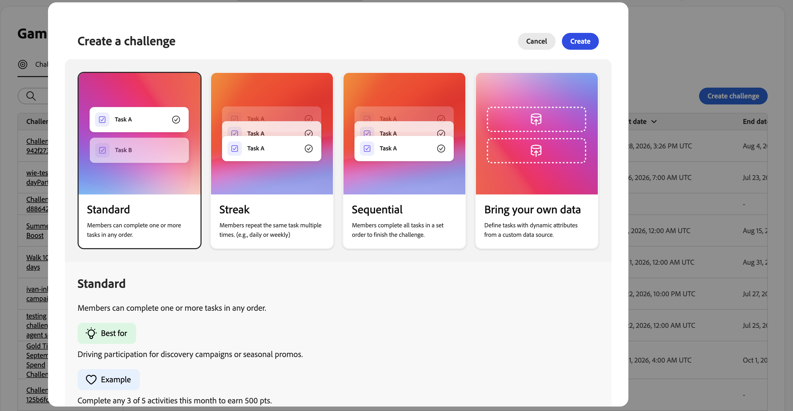

# Note sulla versione {#release-notes}

>[!CONTEXTUALHELP]
>id="ajo_homepage_card1"
>title="Novità"
>abstract="**Adobe Journey Optimizer** offre in modo continuo nuove funzionalità, miglioramenti a quelle esistenti e correzioni di bug. Nelle presenti note sulla versione, tutte le modifiche sono consolidate durante l’ultima settimana di ogni mese."

[!DNL Adobe Journey Optimizer] segue un modello di distribuzione continua, che consente ad Adobe di fornire nuove funzionalità, miglioramenti e correzioni su base regolare. Questo approccio consente un rollout scalabile e graduale delle funzionalità per garantire prestazioni e stabilità in tutti gli ambienti. A causa di questo modello, le note sulla versione vengono aggiornate prima del successivo rilascio mensile. Per informazioni dettagliate sul ciclo di rilascio e sulle fasi di disponibilità, consulta [Ciclo di rilascio di Journey Optimizer](releases.md).

[!DNL Adobe Journey Optimizer] è stato sviluppato in modalità nativa su [!DNL Adobe Experience Platform] e ne eredita le innovazioni e i miglioramenti più recenti. Ulteriori informazioni su queste modifiche sono disponibili nelle [Note sulla versione di Adobe Experience Platform](https://experienceleague.adobe.com/docs/experience-platform/release-notes/latest.html?lang=it){target="_blank"}.

>[!NOTE]
>
>Le funzionalità elencate in queste note sulla versione includono una **Data di disponibilità** che indica quando ciascuna modifica diventa accessibile nel tuo ambiente. Le voci nei pannelli a soffietto **Disponibile a breve** sono previste nei prossimi giorni o settimane. Le informazioni in queste sezioni sono soggette a modifiche.

## Note sulla versione del 26 luglio {#july-26-updates}

### Sfide di fedeltà {#july-26-loyalty}

In questa versione, Journey Optimizer introduce la nuova funzionalità Sfide per la fedeltà.

<table>
<thead>
<tr>
<th><strong>Sfide di fedeltà</strong> </th>
</tr>
</thead>
<tbody>
<tr>
<td>

Le sfide relative alla fedeltà trasformano le iniziative di fidelizzazione in esperienze coinvolgenti e gamified che motivano i clienti a intraprendere azioni preziose, come effettuare acquisti, scrivere recensioni o qualsiasi comportamento desiderato.

Gli amministratori possono utilizzare il menu di amministrazione Fedeltà per collegare Journey Optimizer al tuo ecosistema di fidelizzazione, incluse le API di assegnazione dei premi, le definizioni degli eventi, l’inventario dei prodotti, le esclusioni e le impostazioni di identità. Gli addetti al marketing possono quindi progettare sfide standard, in streaming o sequenziali, definire attività e premi, distribuire schede di contenuti e messaggi di branding e monitorare le prestazioni con dashboard di reporting basate sull’intelligenza artificiale. Journey Optimizer genera i percorsi che orchestrano ogni sfida in background, in modo che i team possano concentrarsi sulla customer experience e sugli obiettivi aziendali.

La fidelizzazione introduce anche competenze professionali che consentono ai team di eseguire in modo più efficiente le operazioni principali, tra cui la creazione di sfide, l’impostazione di proprietà problematiche, la gestione del pubblico e della relativa configurazione, e la revisione delle informazioni per monitorare la partecipazione alle sfide e le prestazioni dei premi.

Questa funzionalità è disponibile solo per le organizzazioni con licenza per Journey Optimizer Loyalty. Per potervi accedere, contatta il tuo rappresentante Adobe.

Per ulteriori informazioni, consulta la <a href="../loyalty-challenges/get-started.md">documentazione dettagliata</a>.

 Data di disponibilità: 28 luglio 2026

</td>
</tr>
</tbody>
</table>

### Canali {#july-26-channels}

In questa versione sono state introdotte le funzionalità e i miglioramenti seguenti.

<table>
<thead>
<tr>
<th><strong>Ottimizzazione dei canali</strong> </th>
</tr>
</thead>
<tbody>
<tr>
<td>

Ora puoi configurare un percorso o un’azione della campagna in modo da includere più canali in uscita (e-mail, push, SMS) e consentire a Journey Optimizer di distribuire automaticamente attraverso il canale migliore per ogni cliente. Sono disponibili tre modalità di ottimizzazione:

<ul>
<li>Classificazione manuale: specifica l’ordine del canale preferito.</li>
<li>Preferenza del cliente: utilizza il canale preferito del cliente dal suo profilo (attributo Consensi e preferenze del modello di dati esperienza).</li>
<li>Classificazione basata su modello di intelligenza artificiale: utilizza i punteggi di propensione di apprendimento automatico per dedurre il canale più efficace per cliente.</li>
</ul>

Quando il canale di livello più alto non è disponibile (non è prescelto, con limiti di frequenza o non è configurato), il sistema torna al canale successivo disponibile.

Questa funzionalità è disponibile solo per un set di organizzazioni (LA, disponibilità limitata). Per potervi accedere, contatta il tuo rappresentante Adobe.

Per ulteriori informazioni, consulta la <a href="../building-journeys/channel-optimization.md">documentazione dettagliata</a>.

Data di disponibilità: 22 luglio 2026

</td>
</tr>
</tbody>
</table>

+++ Disponibile a breve

<table>
<thead>
<tr>
<th><strong>Canale in uscita personalizzato</strong> </th>
</tr>
</thead>
<tbody>
<tr>
<td>

Journey Optimizer introduce ora i canali personalizzati, una nuova funzionalità che consente agli amministratori di portare qualsiasi canale di messaggistica in uscita basato su HTTP, come WeChat, Kakao Talk, Messenger o un provider proprietario, direttamente in Journey Optimizer tramite un Channel Builder senza codice.

Una volta configurati, i canali personalizzati sono disponibili tra campagne, percorsi e campagne orchestrate, con le stesse funzionalità complete dei canali nativi: personalizzazione con editor di espressioni, sperimentazione dei contenuti, anteprima e bozza, reporting preconfigurato e applicazione del consenso e della governance.

Questo risolve un vuoto precedentemente affrontato dalle azioni personalizzate, limitate solo ai percorsi e prive di funzionalità di canale dedicate.

I canali in uscita personalizzati sono attualmente disponibili come Disponibilità limitata. Per potervi accedere, contatta il tuo rappresentante Adobe.

<!-- GIF placeholder: to be added -->
<!-- Documentation link: TBD -->
</td>
</tr>
</tbody>
</table>

* **Canale WhatsApp: supporto modelli di flusso WhatsApp** - È ora possibile inviare modelli di flusso WhatsApp in Adobe Journey Optimizer per fornire esperienze interattive multischermo come sondaggi e acquisizione di lead. Le risposte vengono acquisite al momento dell’invio e memorizzate come payload JSON non elaborati nel nuovo set di dati evento di tracciamento del canale di Journey Optimizer.

* **Integrazioni provider personalizzato migliorate - Dispositivi mobili** - Le integrazioni provider personalizzato offrono ora maggiore flessibilità con messaggi chiave e aggiornamenti di intestazione:

  * Personalizzazione intestazione: ora puoi modificare il valore predefinito dell’intestazione Content-Type e aggiungere fino a 10 parametri di intestazione personalizzati.

  * Supporto del payload SMS: è stato aggiunto il supporto per le funzioni helper di Adobe Journey Optimizer all’interno del payload SMS, incluso encode64.

+++

### Progettazione e-mail {#july-26-email}

In questa versione sono state aggiunte le seguenti funzionalità e miglioramenti alla progettazione delle e-mail.

<table>
<thead>
<tr>
<th><strong>Moduli in E-mail designer</strong> </th>
</tr>
</thead>
<tbody>
<tr>
<td>

E-mail designer ora include una libreria di moduli di layout pronti all’uso, ad esempio intestazioni, schede di prodotto, blocchi di informazioni e piè di pagina, che puoi trascinare direttamente nell’area di lavoro dell’e-mail.

Ogni modulo è preconfigurato con proprietà modificabili (immagine, titolo, testo, pulsante, collegamenti) e può essere completamente personalizzato tramite l’interfaccia WYSIWYG, velocizzando la creazione delle e-mail senza richiedere di creare strutture da zero.

Per ulteriori informazioni, consulta la <a href="../email/email-modules.md">documentazione dettagliata</a>.

Data di disponibilità: 29 luglio 2026

</td>
</tr>
</tbody>
</table>

<table>
<thead>
<tr>
<th><strong>Verifica del contenuto in E-mail Designer (disponibilità generale)</strong> </th>
</tr>
</thead>
<tbody>
<tr>
<td>

Journey Optimizer ora include la convalida tecnica automatizzata direttamente in E-mail designer, che consente di individuare i problemi di HTML e CSS prima dell’invio.

I controlli coprono gli elementi non supportati, ad esempio i tag <code>&lt;script&gt;</code> e <code>&lt;base&gt;</code>, i div vuoti che possono compromettere il layout in Microsoft Outlook, i tag HTML meta refresh e le soglie di dimensioni CSS o HTML che causano errori di rendering in Gmail.

I risultati vengono visualizzati come errori, avvertenze o avvisi informativi direttamente nel pannello di authoring, con dettagli contestuali e correzioni con un solo clic, se disponibili, in modo che i problemi possano essere risolti senza uscire dall’editor.

Precedentemente disponibile in disponibilità limitata, questa funzionalità è ora disponibile per tutta la clientela.

Per ulteriori informazioni, consulta la <a href="../email/content-check.md">documentazione dettagliata</a>.

Data di disponibilità: 16 luglio 2026

</td>
</tr>
</tbody>
</table>

* Supporto di **Frammenti di espressione in`<head>`**. I frammenti di espressione possono ora essere utilizzati in `<head>` modelli di e-mail. Questo consente di centralizzare lo stile o qualsiasi codice personalizzato in un singolo frammento e riutilizzarlo in più modelli. Quando un frammento viene aggiornato e ripubblicato, tutte le e-mail create da modelli che vi fanno riferimento ereditano automaticamente il codice più recente, eliminando la necessità di aggiornare manualmente ogni e-mail singolarmente. [Ulteriori informazioni](../personalization/use-expression-fragments.md)

  Data di disponibilità: 29 luglio 2026

### Percorsi {#july-26-journeys}

In questa versione sono stati aggiunti i seguenti miglioramenti ai percorsi e le seguenti funzioni.
<table>
<thead>
<tr>
<th><strong>Nuova interfaccia utente</strong> </th>
</tr>
</thead>
<tbody>
<tr>
<td>

È stata introdotta una <b>nuova interfaccia utente</b> per l'area di lavoro di percorso, che offre prestazioni migliori per i percorsi di grandi dimensioni, layout automatico per una migliore leggibilità e un'esperienza di authoring guidata.

Per passare alla nuova interfaccia utente, fai clic sul pulsante <b>Nuova esperienza</b>. Questa impostazione viene salvata a livello di percorso, pertanto per impostazione predefinita il percorso viene riaperto nella nuova esperienza. Per ripristinare, fai clic su <b>Esperienza precedente</b>. <a href="../building-journeys/using-the-journey-designer.md#canvas-capabilities">Ulteriori informazioni</a>.

 Data di disponibilità: 16 luglio 2026

</td>
</tr>
</tbody>
</table>

* [!BADGE Obsolescenza]{type=Negative} **I tipi di pubblico in batch non sono più supportati nei nodi di qualificazione del pubblico e nei criteri di uscita**. A partire da settembre 2026, Journey Optimizer bloccherà la pubblicazione per qualsiasi percorso utilizzando un pubblico in batch in un nodo di qualificazione del pubblico o nei criteri di uscita. Nell’area di lavoro del percorso è già presente un avviso di convalida.  I percorsi live esistenti non vengono interessati. I percorsi nuovi, in bozza e duplicati che includono questa configurazione devono essere aggiornati prima di settembre 2026. Utilizza un pubblico in streaming nel nodo Qualificazione del pubblico o passa a un’attività Read Audience. Per i criteri di uscita, utilizza un pubblico in streaming. [Scopri come eseguire la migrazione dei percorsi](../building-journeys/aq-batch-audiences-migration.md)

* **Tipi di pubblico esterni nella simulazione del Percorso** - La simulazione del Percorso ora supporta i tipi di pubblico esterni. Quando simuli percorsi che eseguono il targeting di tipi di pubblico CSV o Federated Audience Composition, puoi simulare gli attributi di arricchimento di tali tipi di pubblico direttamente tramite il modulo di interfaccia utente o un’importazione JSON. L’interfaccia utente mostra in modo dinamico solo gli attributi di arricchimento specifici utilizzati nella logica di percorso, consentendo la convalida precisa dei rami decisionali e delle regole di personalizzazione prima della pubblicazione. [Ulteriori informazioni](../building-journeys/simulate-journey.md)

  Data di disponibilità: 29 luglio 2026

### Campagne orchestrate {#july-26-oc}

In questa versione sono state aggiunte alle campagne orchestrate le funzioni e i miglioramenti seguenti.

<table>
<thead>
<tr>
<th><strong>Targeting basato su file nelle campagne orchestrate</strong> </th>
</tr>
</thead>
<tbody>
<tr>
<td>

Le campagne orchestrate ora supportano il caricamento di un <strong>file CSV o TXT</strong> direttamente nell'area di lavoro della campagna come pubblico di destinazione, senza prima acquisire il file in Adobe Experience Platform. I dati del file vengono utilizzati in fase di esecuzione e non vengono mantenuti come set di dati di Adobe Experience Platform. Durante l’impostazione del file, puoi definire le mappature di colonna, i tipi di dati, la gestione dei valori NULL e i criteri di errore per colonna. Le righe che non superano la convalida vengono rifiutate e registrate prima dell’esecuzione della campagna, mantenendo il pubblico pulito senza la pre-elaborazione manuale. Questa funzione è particolarmente adatta per campagne di invio ad hoc o di elenco di partner in cui non è pratico creare una pipeline di acquisizione completa.

Per ulteriori informazioni, consulta la <a href="../orchestrated/activities/load-file.md">documentazione dettagliata</a>.

 Data di disponibilità: 6 luglio 2026

</td>
</tr>
</tbody>
</table>

+++ Disponibile a breve

* **Autorizzazione per la visualizzazione delle transizioni di una campagna orchestrata** - Aggiunta nuova autorizzazione **Visualizza transizioni campagna orchestrate** per sostituire l&#39;opzione legacy **Visualizza file in campagne orchestrate**. Questa modifica ti consente di nascondere i risultati dell’anteprima nelle transizioni della campagna per supportare la conformità con le informazioni che consentono l’identificazione personale.

+++

### Funzione Decisioni {#decisioning}

* **Creazione di regole di decisioning dall&#39;espressione in linguaggio naturale** - È ora possibile descrivere la regola di decisioning che si desidera creare in linguaggio semplice e consentire all&#39;intelligenza artificiale di generarla automaticamente. Questa funzionalità è disponibile per i clienti che hanno accesso alle funzionalità di Adobe AI.

  Questa funzionalità è disponibile per le organizzazioni con accesso alle funzionalità di Adobe AI. È disponibile solo per un insieme di organizzazioni (disponibilità limitata). Per potervi accedere, contatta il tuo rappresentante Adobe.

  Data di disponibilità: 29 luglio 2026

  [Ulteriori informazioni](../experience-decisioning/rules.md#build-rule-with-ai)

* **Attributi personalizzati dinamici degli elementi di decisione** - Gli attributi personalizzati degli elementi di decisione possono ora essere personalizzati al momento della consegna utilizzando dati di profilo, contestuali e di pubblico. Questo elimina la necessità di mantenere offerte duplicate per varianti di contenuto minori, consentendo ai marketer di gestire meno elementi decisionali e più flessibili. [Ulteriori informazioni](../experience-decisioning/items.md#attributes)

  Data di disponibilità: 27 luglio 2026

* **Simulazione di regole di decisione e formule di classificazione** - È ora possibile simulare le regole di decisione e le formule di classificazione direttamente dall&#39;editor di regole o formule. Aggiungi varianti di test manuali o generale utilizzando l’intelligenza artificiale, quindi esegui l’espressione in base ai tuoi dati di test per convalidare l’idoneità e rivedere i risultati classificati, il tutto prima di distribuire in produzione. La generazione di varianti è disponibile per i clienti con accesso alle funzionalità di Adobe AI.

  Questa funzionalità è disponibile solo per un set di organizzazioni (LA, disponibilità limitata). Per potervi accedere, contatta il tuo rappresentante Adobe.

  Data di disponibilità: 29 luglio 2026

  [Ulteriori informazioni sulla simulazione delle regole](../experience-decisioning/rules.md) | [Ulteriori informazioni sulla simulazione delle formule di classificazione](../experience-decisioning/ranking/ranking-formulas.md)

### Gestione dei contenuti {#july-26-content}

In questa versione sono state aggiunte le seguenti funzionalità e miglioramenti alla gestione dei contenuti.

* **Scelte rapide per l&#39;avvio nell&#39;inventario dei frammenti** - È ora possibile accedere rapidamente alle azioni comuni dall&#39;elenco dei frammenti utilizzando il pulsante **[!UICONTROL Altre azioni]**. Le scelte rapide disponibili includono la modifica del frammento, l’apertura dei relativi dettagli e l’eliminazione della versione bozza. [Ulteriori informazioni](../content-management/manage-fragments.md#quick-launch-fragments)

  

* **Scelte rapide per l&#39;avvio nell&#39;inventario dei modelli** - Il pulsante **[!UICONTROL Altre azioni]** nell&#39;elenco dei modelli di contenuto consente ora di accedere rapidamente alle azioni più comuni: modifica dei dettagli dei modelli, simulazione del contenuto ed eliminazione di un modello. Per i modelli e-mail, con collegamenti aggiuntivi puoi modificare l’oggetto e il corpo dell’e-mail, visualizzare o inviare una bozza, eseguire un rapporto sulla posta indesiderata ed eseguire il rendering dell’e-mail. [Ulteriori informazioni](../content-management/access-content-templates.md#quick-launch-templates)

  

* **Nuove funzioni di supporto nelle espressioni di personalizzazione** - Nuove funzioni di supporto sono ora disponibili nelle espressioni di personalizzazione:

  * `appendQueryParams`: aggiunge un parametro di query a un URL o lo sostituisce se la chiave esiste già.
  * `dateBetween`: controlla se una data rientra in un intervallo di date di inizio e fine (incluso).
  * `equalsAnyIgnoreCase`: restituisce true quando una stringa corrisponde a qualsiasi valore specificato, ignorando la distinzione tra maiuscole e minuscole.
  * `getUrlFragment`: estrae la parte frammento di un URL (la parte dopo #).
  * `join`: concatena gli elementi array in una singola stringa utilizzando un separatore.
  * `decode64`: decodifica una stringa con codifica Base64. Se l&#39;input non è un valore Base64 valido, la stringa di input originale viene restituita invariata.
  * `parseJson`: analizza una stringa JSON in una variabile strutturata utilizzabile nel modello.
  * `valueAtPath`: assegna un valore da un percorso dati a una variabile modello, con indicizzazione facoltativa per estrarre un elemento specifico da array o raccolte.
  * `abort`: interrompe la consegna del messaggio quando viene raggiunto durante il rendering.

  Anche la funzione `concat` è stata migliorata e ora supporta due o più argomenti.

  Inoltre, sono ora disponibili le seguenti funzioni di migrazione dei modelli per facilitare la migrazione dei modelli esistenti a Journey Optimizer:

  * `ampCompare`: confronta due valori utilizzando l&#39;operatore di confronto specificato.
  * `ampSubstr`: restituisce una porzione di una stringa tra gli indici iniziale e finale specificati.
  * `compareTo`: confronta due stringhe lessicograficamente.

  [Ulteriori informazioni sulle funzioni di assistenza](../personalization/functions/functions.md)

  Data di disponibilità: 28 luglio 2026

+++ Disponibile a breve

* **Origine immagini flessibile per la generazione di contenuti AI** - La generazione di contenuti in Journey Optimizer ora genera immagini approvate dal marchio direttamente da Adobe Experience Manager Assets Essentials e versioni successive. Il bilanciamento è controllato da tre modalità: Assets (Digital Asset Management, di origine predefinita), Balanced (Digital Asset Management-first, AI riempie i vuoti) e Creative (AI-first). In questo modo ogni elemento visivo sarà accurato, conforme al marchio e pronto per la produzione per percorsi e campagne.

* **Miglioramenti multilingue** - Le impostazioni della lingua possono ora essere duplicate da un&#39;impostazione attiva esistente, pertanto non è più necessario ricreare completamente una configurazione per apportare modifiche. È inoltre possibile copiare una condizione da una lingua a un&#39;altra durante la creazione di Impostazioni lingua, semplificando la configurazione di siti con molte lingue.

* **&quot;Assistente IA&quot; rinominato in &quot;Genera contenuto&quot;** - L&#39;Assistente IA è stato rinominato in &quot;Genera contenuto&quot; in Adobe Journey Optimizer. Questo aggiornamento è limitato alla denominazione e alla terminologia; non sono state introdotte modifiche funzionali. Le etichette di navigazione, i pulsanti, i menu e le finestre di dialogo per la generazione di contenuti, la generazione di immagini, le espressioni di personalizzazione e la sperimentazione di contenuti sono stati rinominati da &quot;Assistente IA&quot; a &quot;Genera contenuto&quot;.

+++

### Contenuti e integrazioni {#july-26-integration}

In questa versione sono stati apportati i seguenti miglioramenti alla gestione dei contenuti e alle integrazioni.

* **Nuovi strumenti del server AJO MCP** - Il server MCP [!DNL Adobe Journey Optimizer] espone ora cinque ulteriori **strumenti di configurazione del canale** di sola lettura, consentendo di eseguire query sulle configurazioni del canale, sulle risorse di supporto e sulle azioni di marketing direttamente dall&#39;assistente AI. È ora possibile utilizzare **Elenca configurazioni canale** (su tutti i canali AJO), **Ottieni configurazione canale**, **Elenca risorse configurazione**, **Ottieni risorsa configurazione** e **Elenca azioni marketing**. [Ulteriori informazioni](../integrations/ajo-mcp.md#mcp-tools)

  Data di disponibilità: 9 luglio 2026

### Generazione di rapporti {#july-26-reporting}

In questa versione sono disponibili i seguenti miglioramenti per la generazione di rapporti.

* **Nuove metriche di clic stimate per il reporting delle e-mail** - Per fornire una visualizzazione più accurata del coinvolgimento reale dei clienti, sono ora disponibili nuove metriche stimate per Percorsi, campagne e rapporti live sui canali.

  * CTR stimato (tasso di click-through): calcolato come numero stimato di clic rispetto al numero totale di messaggi consegnati.

  * CTOR stimato (click-to-open rate): calcolato come clic stimati rispetto al numero totale di aperture stimate.

    Data di disponibilità: 29 luglio 2026

### Amministrazione {#july-26-administration}

In questa versione sono stati aggiunti i seguenti miglioramenti per l’amministrazione e la gestione dei dati.

* **Guardrail TTL (Time-to-live) del set di dati: sandbox esistenti**. Il guardrail TTL (time-to-live) per i set di dati generati dal sistema Journey Optimizer (90 giorni nell&#39;archivio profili, 13 mesi nel data lake) verrà applicato a **sandbox e organizzazioni clienti esistenti** a partire dal **1 ottobre 2026**. [Ulteriori informazioni](../data/datasets-ttl.md#ttl-guardrail)

+++Disponibile a breve

<table>
<thead>
<tr>
<th><strong>Inserisce nell'elenco Consentiti IP Firewall applicazione Web in corso</strong> </th>
</tr>
</thead>
<tbody>
<tr>
<td>

Adobe Journey Optimizer ora supporta la inserisce nell'elenco Consentiti delle pagine di destinazione tramite IP di Firewall applicazione Web, consentendo alle organizzazioni di applicare che tutte le richieste in ingresso vengano instradate esclusivamente tramite l’infrastruttura Firewall applicazione Web configurata. Con questo miglioramento, i clienti possono configurare Journey Optimizer per rifiutare qualsiasi richiesta diretta che aggiri il livello di firewall dell’applicazione web, garantendo che i criteri di sicurezza definiti in strumenti come Imperva vengano applicati in modo coerente.

Questa funzionalità rafforza la postura di sicurezza per le aziende con requisiti di accesso alla rete rigorosi, offrendo loro il pieno controllo del flusso di traffico verso le pagine di destinazione ospitate da Journey Optimizer.

<!-- Documentation link: TBD -->
</td>
</tr>
</tbody>
</table>

* **Gestione dei domini per la personalizzazione URL completa/di base** - È ora possibile creare e gestire i domini approvati per la personalizzazione URL completa e di base direttamente dalle impostazioni di amministrazione in Adobe Journey Optimizer, senza dover contattare il supporto Adobe. <!--[Learn more](../email/url-personalization.md#personalize-complete-base-url)-->

+++

### Campagne {#campaigns}

+++ Disponibile a breve

<table>
<thead>
<tr>
<th><strong>Allegati PDF personalizzati in e-mail attivate da API</strong> </th>
</tr>
</thead>
<tbody>
<tr>
<td>

Journey Optimizer ora supporta l’associazione di fino a cinque PDF specifici per destinatario per e-mail nelle campagne attivate da API. I file PDF vengono recuperati in modo sicuro dall’archiviazione di Azure o AWS e allegati al momento dell’invio, con la posizione di ciascun file passata direttamente nel payload API. Questo consente ai sistemi di generazione dei documenti esistenti a monte di rimanere operativi, con la gestione della distribuzione da parte di Journey Optimizer.

I casi d’uso supportati includono fatture, estratti conto, biglietti, contratti, etichette di spedizione e documenti simili che variano a seconda del destinatario. Gli allegati PDF personalizzati sono disponibili solo nelle campagne attivate da API e non sono supportati nei percorsi o in altri tipi di campagne (azione, orchestrato).

Volumi e dimensioni di allegati più grandi sono supportati tramite il componente aggiuntivo per allegati di PDF; per informazioni, contatta il rappresentante Adobe.

<!-- Documentation link: TBD -->
</td>
</tr>
</tbody>
</table>

* **Cartelle per campagne** - È ora possibile organizzare le campagne in cartelle per migliorare la navigazione e la gestione nell&#39;interfaccia. Questa funzionalità è disponibile solo per campagne attivate da API e azioni.

* **Componente aggiuntivo di prestazioni per la velocità effettiva nelle campagne attivate da API - Push** - È disponibile una nuova modalità di messaggistica transazionale ad alta velocità nelle campagne attivate da API. Questa modalità è progettata per la messaggistica transazionale in tempo reale su larga scala e supporta fino a 5.000 transazioni al secondo con maggiore disponibilità. Precedentemente disponibile solo per il canale e-mail, questa funzionalità è ora disponibile anche per il canale push, per le organizzazioni che hanno acquistato il componente aggiuntivo Messaggistica transazionale ad alta velocità di Adobe. Per ulteriori informazioni, contatta il rappresentante Adobe. <!-- Documentation link: TBD -->

+++

### Miglioramenti dell’usabilità {#july-26-usability}

+++Disponibile a breve

* **Nuova esperienza di simulazione del contenuto per il test del contenuto** - Il flusso di lavoro **Simula contenuto** introduce un&#39;esperienza riprogettata: tutte le varianti ora vengono riprodotte insieme in un&#39;unica griglia scorrevole (layout affiancati, sovrapposti o a capo), sostituendo la visualizzazione una variante alla volta. Una singola barra delle azioni inferiore consolida la navigazione tra le varianti di test, lo zoom, la commutazione del riquadro di visualizzazione (desktop/mobile), la commutazione delle impostazioni locali, l’aggiunta di input di esempio, la generazione di varianti con IA, il prelievo e il salvataggio di utenti simulati e l’importazione o l’esportazione di varianti. Rimuovendo la barra a sinistra e comprimendo i livelli di intestazione aggiuntivi, le anteprime avranno molto più spazio. L&#39;opzione **Passa all&#39;esperienza classica** nella barra delle azioni inferiore consente di ripristinare l&#39;esperienza precedente in qualsiasi momento.

+++
