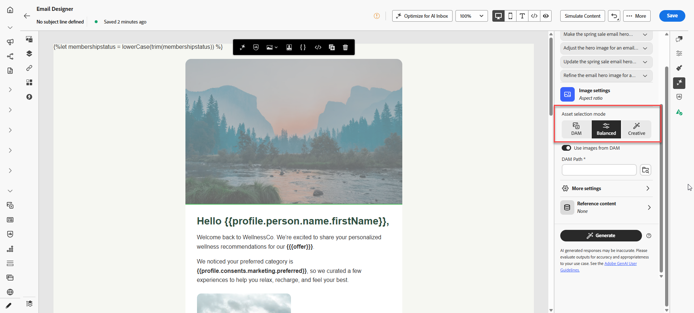

# Note sulla versione {#release-notes}

>[!CONTEXTUALHELP]
>id="ajo_homepage_card1"
>title="Novità"
>abstract="**Adobe Journey Optimizer** offre in modo continuo nuove funzionalità, miglioramenti a quelle esistenti e correzioni di bug. Nelle presenti note sulla versione, tutte le modifiche sono consolidate durante l’ultima settimana di ogni mese."

[!DNL Adobe Journey Optimizer] segue un modello di distribuzione continua, che consente ad Adobe di fornire nuove funzionalità, miglioramenti e correzioni su base regolare. Questo approccio consente un rollout scalabile e graduale delle funzionalità per garantire prestazioni e stabilità in tutti gli ambienti. A causa di questo modello, le note sulla versione vengono aggiornate prima del successivo rilascio mensile. Per informazioni dettagliate sul ciclo di rilascio e sulle fasi di disponibilità, consulta [Ciclo di rilascio di Journey Optimizer](releases.md).

[!DNL Adobe Journey Optimizer] è stato sviluppato in modalità nativa su [!DNL Adobe Experience Platform] e ne eredita le innovazioni e i miglioramenti più recenti. Ulteriori informazioni su queste modifiche sono disponibili nelle [Note sulla versione di Adobe Experience Platform](https://experienceleague.adobe.com/docs/experience-platform/release-notes/latest.html?lang=it){target="_blank"}.

>[!NOTE]
>
>Le funzionalità elencate in queste note sulla versione includono una **Data di disponibilità** che indica quando ciascuna modifica diventa accessibile nel tuo ambiente. Le voci nei pannelli a soffietto **Disponibile a breve** sono previste nei prossimi giorni o settimane. Le informazioni in queste sezioni sono soggette a modifiche.

## Aggiornamenti di settembre 2026 {#sep-26-updates}

### Percorsi {#sep-26-journeys}

<table>
<thead>
<tr>
<th><strong>Blocco a livello di percorso (disponibilità limitata)</strong> </th>
</tr>
</thead>
<tbody>
<tr>
<td>

È ora possibile configurare un gruppo di sospensione per i percorsi direttamente dalle proprietà del percorso. Un blocco è una percentuale configurabile del pubblico di destinazione che viene escluso dall’accesso al percorso e non riceve alcuna comunicazione. Confrontando i profili di sospensione con i profili attivi nella generazione rapporti di Customer Journey Analytics, puoi misurare l’incremento incrementale (il vero impatto) fornito dal percorso.

Questa funzionalità è disponibile solo per un set di organizzazioni (LA, disponibilità limitata). Per potervi accedere, contatta il tuo rappresentante Adobe. Per informazioni dettagliate sul ciclo di rilascio e sulle fasi di disponibilità, consulta <a href="releases.md">Ciclo di rilascio di Journey Optimizer</a>.

Per ulteriori informazioni, consulta la <a href="../building-journeys/journey-properties.md#performance-management">documentazione dettagliata</a>.

Data di disponibilità: 1 settembre 2026

</td>
</tr>
</tbody>
</table>

<table>
<thead>
<tr>
<th><strong>Generare espressioni con IA nei percorsi</strong> </th>
</tr>
</thead>
<tbody>
<tr>
<td>

L’editor di espressioni avanzate di percorso ora integra la generazione di espressioni basate sull’intelligenza artificiale: descrivi l’espressione da creare in linguaggio naturale e l’editor genera codice pronto all’uso che puoi applicare immediatamente o perfezionare tramite prompt di follow-up.

Precedentemente rilasciata in disponibilità limitata, questa funzionalità è ora disponibile per tutti gli ambienti (disponibilità generale).

Per ulteriori informazioni, consulta la <a href="../building-journeys/expression/generate-expression.md">documentazione dettagliata</a>.

Data di disponibilità: 1 settembre 2026

</td>
</tr>
</tbody>
</table>

* **Nuova funzione dateDiff nell&#39;editor espressioni di percorso**. L&#39;editor espressioni di percorso include ora la funzione `dateDiff`, che calcola la differenza tra due date in un numero di giorni. Questa funzione è utile per una logica basata sul tempo, ad esempio per creare scadenze, calcolare la durata del ciclo di vita del cliente o creare timer di conto alla rovescia in condizioni di percorso.  [Ulteriori informazioni](../building-journeys/functions/date-functions.md#dateDiff)

  Data di disponibilità: 1 settembre 2026

### Campagne {#sep-26-campaigns}

+++ Disponibile a breve: **le informazioni riportate di seguito sono soggette a modifiche.**

<table>
<thead>
<tr>
<th><strong>Simulazione dell’esperienza in entrata nelle campagne d’azione</strong> </th>
</tr>
</thead>
<tbody>
<tr>
<td>

Ora puoi simulare le azioni del canale in entrata nelle campagne d’azione prima di andare "live". Utilizza la modalità di simulazione per verificare la configurazione con utenti simulati e visualizzare in anteprima l’esperienza di cui è stato eseguito il rendering, inclusi un URL generato e un codice QR, in modo da poter convalidare regole, decisioni e rendering end-to-end dei contenuti.

Questa funzionalità è attualmente disponibile in versione beta privata per un set limitato di organizzazioni. Per ulteriori informazioni, contatta il rappresentante Adobe.

Data di disponibilità: 4 settembre 2026

</td>
</tr>
</tbody>
</table>

* **Cartelle per le campagne d&#39;azione** - È ora possibile organizzare le campagne d&#39;azione in cartelle per migliorare la navigazione e la gestione nell&#39;interfaccia.

* **Riprogettazione del flusso di authoring di Action Campaign** - Il flusso di authoring di Adobe Journey Optimizer Action Campaign è stato riprogettato per offrire un&#39;esperienza utente decisamente più intuitiva, efficiente e fluida.

* **Sostituisci i campi di esecuzione predefiniti nelle campagne Azione**. Precedentemente disponibili a livello di percorso, ora puoi sovrascrivere i campi di esecuzione predefiniti configurati a livello globale per le consegne e-mail, SMS e WhatsApp nei parametri della campagna Azione.

+++

## Note sulla versione di agosto 2026 {#aug-26-updates}

### Gestione dei contenuti

In questa versione sono state introdotte le seguenti funzionalità e miglioramenti per la gestione dei contenuti.

<table>
<thead>
<tr>
<th><strong>Origine immagine flessibile per la generazione di contenuti AI</strong> </th>
</tr>
</thead>
<tbody>
<tr>
<td>

La generazione di contenuti in Journey Optimizer ora origina le immagini approvate dal marchio direttamente da Adobe Experience Manager Assets Essentials e versioni successive. Il bilanciamento è controllato da tre modalità: Bilanciato (gestione delle risorse digitali in primo luogo, AI riempie i vuoti, impostazione predefinita), Assets (gestione delle risorse digitali originata) e Creative (AI).

Per ulteriori informazioni, consulta la <a href="../content-management/generative-uc.md#image-mode">documentazione dettagliata</a>.

 Data di disponibilità: 5 agosto 2026

</td>
</tr>
</tbody>
</table>

* **Avviso dimensione variante di contenuto** - In Journey Optimizer viene ora visualizzato un avviso di limite soft quando una variante di contenuto supera la soglia di dimensione consigliata: 1200 KB per modelli e messaggi, 700 KB per frammenti e 1000 KB per pagine di destinazione. Salvataggio e pubblicazione non bloccati. [Ulteriori informazioni](../start/guardrails.md#content-authoring)

  Data di disponibilità: 25 agosto 2026

* **Limiti di conteggio frammenti nel contenuto** - Journey Optimizer ora convalida il numero di frammenti univoci utilizzati all&#39;interno di una parte di contenuto: fino a 60 per variante e fino a 120 per tutte le varianti di un singolo messaggio. Gli avvisi vengono visualizzati al 75% di ogni limite; la pubblicazione viene bloccata una volta raggiunto il limite rigido. [Ulteriori informazioni](../start/guardrails.md#fragments-guardrails)

  Data di disponibilità: 25 agosto 2026

### Percorsi {#aug-26-journeys}

* **Date di inizio e di fine nell&#39;intestazione del percorso** - Quando le date di inizio e/o di fine sono configurate in un percorso, ora vengono visualizzate nell&#39;intestazione del percorso accanto al badge di stato. L’etichetta visualizzata si adatta a seconda che ogni data sia imminente o già passata. [Ulteriori informazioni](../building-journeys/journey-properties.md#dates)

  Data di disponibilità: 20 agosto 2026

* **Nuove funzioni elenco nell&#39;editor di espressioni avanzate** - Nell&#39;editor di espressioni avanzate sono disponibili due nuove funzioni: `mergeLists` combina due elenchi, con o senza deduplicazione, e `differenceLists` restituisce gli elementi di un elenco che non sono presenti in un altro. [Ulteriori informazioni](../building-journeys/functions/list-functions.md)

  Data di disponibilità: 13 agosto 2026

* **Ottimizzazione dell&#39;ora di invio nell&#39;attività Attendi** - Ottimizzazione dell&#39;ora di invio è ora disponibile nell&#39;attività Attendi, consentendo all&#39;IA di Adobe di determinare il tempo ottimale per continuare a qualsiasi attività a valle. [Ulteriori informazioni](../building-journeys/wait-activity.md#sto-wait)

  Data di disponibilità: 13 agosto 2026

### Campagne {#aug-26-campaigns}

In questa versione sono state introdotte le seguenti funzionalità e miglioramenti per Campaigns.

<table>
<thead>
<tr>
<th><strong>Allegati PDF personalizzati in e-mail attivate da API</strong> </th>
</tr>
</thead>
<tbody>
<tr>
<td>

Journey Optimizer ora supporta fino a <b>cinque allegati PDF</b> totali per e-mail nelle campagne attivate da API, inclusi PDF statici e specifici dei destinatari. I file PDF specifici del destinatario vengono recuperati in modo sicuro dalla Data Landing Zone e allegati al momento dell’invio, con la posizione di ciascun file passata direttamente nel payload API. Questo consente ai sistemi di generazione dei documenti esistenti a monte di rimanere operativi, con la gestione della distribuzione da parte di Journey Optimizer.

I casi d’uso supportati includono fatture, estratti conto, biglietti, contratti, etichette di spedizione e documenti simili che variano a seconda del destinatario. Gli allegati personalizzati di PDF sono disponibili solo per campagne e-mail transazionali attivate da API e non sono supportati in percorsi o campagne orchestrate.

Volumi e dimensioni di allegati più grandi sono supportati tramite il componente aggiuntivo per allegati di PDF; per informazioni, contatta il rappresentante Adobe.

Per ulteriori informazioni, consulta la <a href="../email/pdf-attachments.md#personalized-attachments">documentazione dettagliata</a>.

Data di disponibilità: 12 agosto 2026

</td>
</tr>
</tbody>
</table>

* **Abbonamenti agli avvisi sul ciclo di vita per campagna** - È ora possibile abbonarsi agli avvisi sul ciclo di vita della campagna supportati per una singola campagna, oltre all&#39;abbonamento esistente a livello di sandbox. Questo consente di monitorare singole campagne ad alta priorità senza ricevere lo stesso avviso per ogni campagna nella sandbox. [Ulteriori informazioni](../reports/alerts.md#subscribe-alerts)

  Data di disponibilità: 13 agosto 2026

### Campagne orchestrate {#august-26-oc}

In questa versione sono state introdotte le funzionalità e i miglioramenti seguenti per le campagne orchestrate.

<table>
<thead>
<tr>
<th><strong>Supporto per le ore non interattive</strong> </th>
</tr>
</thead>
<tbody>
<tr>
<td>

Ora puoi applicare le Ore non interattive. Le Ore tranquille ti consentono di definire esclusioni basate sul tempo per impedire l’invio di messaggi durante periodi specifici, aiutandoti a rispettare le preferenze dei clienti e i requisiti di conformità in tutti i casi di utilizzo dell’orchestrazione delle campagne.

Per ulteriori informazioni, consulta la <a href="../conflict-prioritization/quiet-hours.md">documentazione dettagliata</a>.

Data di disponibilità: 18 agosto 2026

</td>
</tr>
</tbody>
</table>

<table>
<thead>
<tr>
<th><strong>Inviare utilizzando gli scaglioni</strong> </th>
</tr>
</thead>
<tbody>
<tr>
<td>

Ora puoi pianificare i messaggi in uscita da consegnare in batch controllati nel tempo. Ideale per campagne di grandi volumi o che richiedono molto tempo, l’invio di ondate supporta anche una migliore recapito messaggi e contribuisce a mantenere una solida reputazione del mittente riducendo il rischio di essere segnalati come spam. 

Per ulteriori informazioni, consulta la <a href="../delivery/send-using-waves.md">documentazione dettagliata</a>.

Data di disponibilità: 18 agosto 2026

</td>
</tr>
</tbody>
</table>

<table>
<thead>
<tr>
<th><strong>Supporto del canale LINE (disponibilità limitata)</strong> </th>
</tr>
</thead>
<tbody>
<tr>
<td>

Ora puoi aggiungere azioni LINE alle campagne orchestrate. Questa nuova attività ti consente di creare e distribuire contenuti altamente personalizzati, tra cui testo, adesivi, immagini, video, dati sulla posizione e messaggi Flex avanzati, per coinvolgere i tuoi clienti in modo semplice sulla piattaforma LINE. Questa funzionalità è disponibile solo per un set di organizzazioni (LA, disponibilità limitata). Per potervi accedere, contatta il tuo rappresentante Adobe.

Per ulteriori informazioni, consulta la <a href="../orchestrated/activities/channels.md">documentazione dettagliata</a>.

Data di disponibilità: 12 agosto 2026

</td>
</tr>
</tbody>
</table>

* **Possibilità di gestire le dimensioni di destinazione del profilo** - È ora possibile eliminare un Dimension di destinazione del profilo o modificare e scambiare lo spazio dei nomi delle identità configurato, fornendo un maggiore controllo e flessibilità sulle impostazioni dei dati. [Ulteriori informazioni](../orchestrated/target-dimension.md)

  Data di disponibilità: 18 agosto 2026

<!-- * **New public APIs** - New API specifications are now available. These APIs allow you to programmatically create, manage, and trigger orchestrated campaigns, enabling deeper integration with external systems and automation pipelines. Documentation link: TBD -->

* **Personalizzazione dei dettagli del mittente e-mail per destinatario e campagna (disponibilità limitata)** - Le campagne orchestrate ora supportano la personalizzazione dei campi dell&#39;intestazione e-mail, inclusi Nome mittente, Prefisso e-mail Da, Nome destinatario risposta e E-mail di risposta, nonché l&#39;indirizzo di esecuzione, utilizzando gli attributi del profilo o i dati relazionali. Questo consente ai dettagli del mittente di riflettere l’esperto, la posizione o la filiale relativa a ciascun destinatario, anziché instradare tutti gli invii tramite un unico indirizzo aziendale. I valori dell’intestazione possono essere impostati a livello di canale e sostituiti per campagna utilizzando dati contestuali per un controllo più preciso. [Ulteriori informazioni](../orchestrated/activities/channels.md#configuration)

  Questa funzionalità è disponibile solo per un set di organizzazioni (LA, disponibilità limitata).

  Data di disponibilità: 18 agosto 2026

* **Semplificazione della dimensione di destinazione** - La dimensione di targeting attiva viene ora visualizzata nell&#39;area di lavoro del flusso di lavoro, per consentirti di vedere quale dimensione viene utilizzata da un&#39;attività di canale. Il flusso di segmentazione tra più entità è più semplice in quanto non è più necessaria un’attività &quot;Modifica dimensione&quot; separata. Inoltre, ora puoi scegliere esplicitamente se i messaggi vengono inviati a livello di profilo o a un livello di dimensione secondario. [Ulteriori informazioni](../orchestrated/activities/channels.md#add)

  Data di disponibilità: 18 agosto 2026

### Fedeltà {#aug-26-loyalty}

<table>
<thead>
<tr>
<th><strong>Abilità di Approfondimenti fedeltà</strong> </th>
</tr>
</thead>
<tbody>
<tr>
<td>

Journey Optimizer presenta <strong>Loyalty Insights</strong>, una nuova abilità di CX Coworker per porre domande sulle prestazioni delle sfide e altri dati del programma fedeltà acquisiti nei gruppi di campi Fedeltà in Adobe Experience Platform.

Per ulteriori informazioni, consulta la <a href="../start/ajo-coworker-skills.md#loyalty-skills">documentazione dettagliata</a>.

Data di disponibilità: 31 agosto 2026

</td>
</tr>
</tbody>
</table>

### Canali {#august-26-channels}

* **Metadati di esecuzione attività live (executionMetadata)** - Le campagne di attività live (transazionali e di marketing) attivate da API ora supportano un campo executionMetadata facoltativo su ogni destinatario. Questo consente di allegare a un’esecuzione dati chiave/valore personalizzati, come un ID ordine, un livello fedeltà o un codice di regione. [Ulteriori informazioni](../mobile-live/create-mobile-live.md#metadata)

  Data di disponibilità: 19 agosto 2026

* **Componente aggiuntivo Prestazioni per velocità effettiva - Push** - È disponibile una nuova modalità di messaggistica transazionale a velocità effettiva elevata nelle campagne attivate dall&#39;API. Questa modalità è progettata per la messaggistica transazionale in tempo reale su larga scala e supporta fino a 5.000 transazioni al secondo con maggiore disponibilità. Precedentemente disponibile solo per il canale e-mail, questa funzionalità è ora disponibile anche per il canale push, per le organizzazioni che hanno acquistato il componente aggiuntivo Messaggistica transazionale ad alta velocità di Adobe. Per ulteriori informazioni, contatta il tuo rappresentante Adobe. [Ulteriori informazioni](../campaigns/api-triggered-high-throughput.md)

  Data di disponibilità: 11 agosto 2026

### Configurazione {#august-26-configuration}

* **Supporto multi-SAN nella generazione CSR per la configurazione del sottodominio personalizzato** - Durante la configurazione o la migrazione di un sottodominio personalizzato tramite il metodo di delega personalizzata, la richiesta di firma del certificato (CSR, Certificate Signing Request) viene ora generata automaticamente con `data.{subdomain}` e `cdn.{subdomain}` come nomi alternativi soggetti (SAN, Subject Alternative Names). In precedenza, la CSR generata includeva solo `data.{subdomain}`, richiedendo l&#39;aggiunta manuale di `cdn.{subdomain}` prima dell&#39;invio all&#39;autorità di certificazione. [Ulteriori informazioni](../configuration/custom-subdomain-migration.md#send-csr-to-ca)

  Data di disponibilità: 20 agosto 2026

### Funzione Decisioni {#decisioning-august}

* **Limitazione di frequenza a livello di posizionamento in Decisioning** - Le regole di limitazione di frequenza in Decisioning possono ora essere definite in base ai singoli posizionamenti, fornendo un controllo più preciso sulla frequenza con cui un&#39;offerta viene visualizzata in una determinata superficie. Sono disponibili due modalità: **limite specifico per il posizionamento**, che definisce un limite applicabile solo quando l&#39;offerta viene visualizzata in un posizionamento selezionato, e **limite per il posizionamento**, che applica un limite in modo indipendente in ogni posizionamento in cui viene visualizzata l&#39;offerta, in modo che ogni posizionamento mantenga il proprio contatore di limiti. Tieni presente che il limite relativo al posizionamento non si applica alle offerte con limite massimo basate su regole basate sui dati di Adobe Experience Platform. [Ulteriori informazioni](../experience-decisioning/items.md#capping)

  Data di disponibilità: 24 agosto 2026

* **Pagine mirror nei frammenti visivi** - È ora possibile inserire pagine mirror in un frammento visivo. Gli attributi Decisioning vengono visualizzati correttamente sul collegamento della pagina speculare, anche quando il frammento viene utilizzato in una campagna e-mail che sfrutta Decisioning. Per poter visualizzare gli attributi decisionali, prima di pubblicare il frammento è necessario aggiungere la pagina speculare al frammento visivo. [Ulteriori informazioni](../email/message-tracking.md#decisioning-mirror-page)

  Data di disponibilità: 11 agosto 2026

### Miglioramenti dell’usabilità {#august-26-usability}

* **Selezione multipla nella nuova area di lavoro del percorso** - La nuova esperienza dell&#39;area di lavoro del percorso introduce una selezione semplificata a più nodi: tieni premuto Maiusc e trascina per selezionare più nodi contemporaneamente, anziché selezionarli singolarmente. Questo consente di eseguire in modo efficiente su più nodi azioni in blocco, come copiare, eliminare o salvare come frammento di percorso. [Ulteriori informazioni](../building-journeys/using-the-journey-designer.md#canvas-capabilities)

  Data di disponibilità: 17 agosto 2026

* **Operazioni di massa nell&#39;inventario dei percorsi** - È ora possibile eseguire nuove azioni di massa direttamente dall&#39;elenco dell&#39;inventario dei percorsi, rendendo più rapida la gestione di più percorsi contemporaneamente. Seleziona diversi percorsi e applica una delle seguenti nuove azioni in un singolo passaggio: **aggiungi al pacchetto**, **elimina**, **sposta nella cartella**, **modifica tag** o **gestisci accesso**. Questo riduce la necessità di ripetere la stessa azione un percorso alla volta, semplificando la gestione dei percorsi per i team che lavorano con un numero elevato di percorsi. [Ulteriori informazioni](../building-journeys/journey-ui.md)

  Data di disponibilità: 12 agosto 2026

* **Nuova esperienza di simulazione del contenuto per il test del contenuto** - Il flusso di lavoro **Simula contenuto** introduce un&#39;esperienza riprogettata: tutte le varianti ora vengono riprodotte insieme in un&#39;unica griglia scorrevole (layout affiancati, sovrapposti o a capo), sostituendo la visualizzazione una variante alla volta. Una singola barra delle azioni inferiore consolida la navigazione tra le varianti di test, lo zoom, la commutazione del riquadro di visualizzazione (desktop/mobile), la commutazione delle impostazioni locali, l’aggiunta di input di esempio, la generazione di varianti con IA, il prelievo e il salvataggio di utenti simulati e l’importazione o l’esportazione di varianti. Rimuovendo la barra a sinistra e comprimendo i livelli di intestazione aggiuntivi, le anteprime avranno molto più spazio. L&#39;opzione **Passa all&#39;esperienza classica** nella barra delle azioni inferiore consente di ripristinare l&#39;esperienza precedente in qualsiasi momento. [Ulteriori informazioni](../test-approve/simulate-content-variations.md)

  Data di disponibilità: 11 agosto 2026

