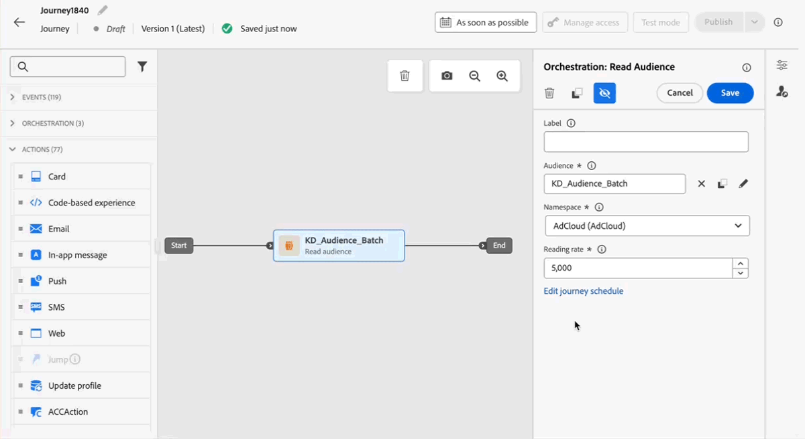

# Note sulla versione {#release-notes}

>[!CONTEXTUALHELP]
>id="ajo_homepage_card1"
>title="Novità"
>abstract="**Adobe Journey Optimizer** offre continuamente nuove funzioni, miglioramenti a quelle esistenti e correzioni di bug. Nelle presenti note sulla versione, tutte le modifiche sono consolidate durante l’ultima settimana di ogni mese."

[!DNL Adobe Journey Optimizer] offre continuamente nuove funzioni, miglioramenti alle funzioni esistenti e correzioni di bug. Nelle presenti note sulla versione, tutte le modifiche sono consolidate durante l’ultima settimana di ogni mese. [!DNL Adobe Journey Optimizer] è stato sviluppato in modalità nativa su [!DNL Adobe Experience Platform] e ne eredita le innovazioni e i miglioramenti più recenti. Ulteriori informazioni su queste modifiche sono disponibili nelle [Note sulla versione di Adobe Experience Platform](https://experienceleague.adobe.com/docs/experience-platform/release-notes/latest.html?lang=it){target="_blank"}.

## Aggiornamenti di giugno 2025 {#25-6-rn}

<table>
<thead>
<tr>
<th><strong>Scalare il vincitore della sperimentazione</strong> </th>
</tr>
</thead>
<tbody>
<tr>
<td>

Scalabilità del vincitore della sperimentazione consente di distribuire automaticamente o manualmente la variante vincente di un esperimento al pubblico completo. Questa funzione assicura che, una volta identificata la variante dalle prestazioni migliori, sia possibile massimizzarne la portata e l’efficacia senza una costante supervisione manuale.

Per ulteriori informazioni, consulta la <a href="../content-management/content-experiment.md">documentazione dettagliata</a>.

Data di disponibilità: 2 giugno 2025
</td>
</tr>
</tbody>
</table>

&lt;<table>
<thead>
<tr>
<th><strong>Conflitti e assegnazione delle priorità</strong> </th>
</tr>
</thead>
<tbody>
<tr>
<td>

In Journey Optimizer, è essenziale gestire il volume e la tempistica delle campagne e dei percorsi per evitare di sopraffare la clientela con troppe interazioni. Journey Optimizer offre ora diversi strumenti per la gestione dei conflitti e l’assegnazione delle priorità. In precedenza disponibili solo per le organizzazioni con accesso alle funzionalità rilasciate con disponibilità limitata (LA), questi sono ora disponibili per tutti (GA, disponibilità generale).

Precedentemente rilasciata in versione a disponibilità limitata, questa funzionalità è ora disponibile per tutti gli ambienti. Con questa versione con disponibilità generale sono stati introdotti i seguenti miglioramenti:

<ul>
<li>Supporto esteso: gli strumenti per la gestione dei conflitti ora supportano sia i percorsi unitari che i percorsi di qualificazione di un pubblico, oltre ai percorsi Leggi pubblico.</li>
<li>Risoluzione dei problemi migliorata: nel servizio query sono ora disponibili due nuovi campi evento del passaggio che consentono di analizzare il motivo per cui un profilo è stato rifiutato da un percorso o da una campagna.</li>
<li>Rapporti migliorati: i rapporti ora indicano la regola specifica che ha determinato l’esclusione di un profilo da un percorso o da una campagna, fornendo maggiore trasparenza e informazioni actionable.</li></ul>

Per ulteriori informazioni, consulta la <a href="../conflict-prioritization/gs-conflict-prioritization.md">documentazione dettagliata</a>.

Data di disponibilità: 3 giugno 2025

</td>
</tr>
</tbody>
</table>

## Note sulla versione di maggio 2025 {#25-5-rn}

<!--**Release date**: May 20-21, 2025-->

### Nuove funzionalità {#25-05-features}

Di seguito sono descritte le nuove funzionalità incluse in questa versione.

<table>
<thead>
<tr>
<th><strong>Vista calendario per l’inventario delle campagne e dei percorsi</strong> </th>
</tr>
</thead>
<tbody>
<tr>
<td>

Negli elenchi dei percorsi e delle campagne è ora disponibile una vista calendario. Consente di visualizzare tutte le attivazioni dei percorsi e delle campagne nei rispettivi elenchi.

Questa modifica è attualmente disponibile solo per un set di organizzazioni (disponibilità limitata). Per richiedere l'accesso, usa <a href="https://forms.cloud.microsoft/r/FC49afuJVi" target="_blank">questo modulo</a>.

Per ulteriori informazioni, consulta le seguenti sezioni: <a href="../building-journeys/journey-ui.md">Sfoglia e filtra i tuoi percorsi</a>, <a href="../campaigns/modify-stop-campaign.md">Accedi alle campagne</a>.

Data di disponibilità: giovedì 28 maggio 2025

</td>
</tr>
</tbody>
</table>

<table>
<thead>
<tr>
<th><strong>Integrazione dei frammenti di contenuto di Adobe Experience Manager</strong> </th>
</tr>
</thead>
<tbody>
<tr>
<td>

Con l’integrazione di Adobe Experience Manager e Adobe Journey Optimizer, ora puoi utilizzare i frammenti di contenuto di Adobe Experience Manager all’interno dei contenuti Journey Optimizer. Questa connessione semplifica l’accesso e l’utilizzo dei contenuti AEM direttamente in Journey Optimizer.

Precedentemente disponibile per un set limitato di organizzazioni (LA), questa funzionalità è ora disponibile in versione GA con i seguenti miglioramenti: ora puoi definire segnaposto e mappare valori di personalizzazione all’interno della firma del frammento utilizzando la modalità Editor.

<ul>
<!--li>Create offers by directly selecting an AEM Content Fragment.</li>
<li>Define placeholders and map personalization values within the fragment signature using the Editor mode.</li-->
</ul>
 

Per ulteriori informazioni, consulta la <a href="../integrations/aem-fragments.md">documentazione dettagliata</a>.

Data di disponibilità: 23 maggio 2025

</td>
</tr>
</tbody>
</table>

<table>
<thead>
<tr>
<th><strong>Integrazione di Adobe Experience Manager Dynamic Media</strong> </th>
</tr>
</thead>
<tbody>
<tr>
<td>

Le risorse Dynamic Media sono ora direttamente disponibili e accessibili in Journey Optimizer. Questa integrazione consente di:

<ul>
<li>Gestire in maniera centralizzata le risorse con aggiornamenti in tempo reale</li>
<li>Modificare all’istante le impostazioni delle risorse, ad esempio larghezza e altezza</li>
<li>Personalizzare i modelli Dynamic Media aggiornando i contenuti e aggiungendo campi di personalizzazione</li>
</ul>
 

Precedentemente rilasciata in versione a disponibilità limitata, questa funzionalità è ora disponibile per tutti gli ambienti (disponibilità generale).

Per ulteriori informazioni, consulta la <a href="../integrations/aem-dynamic.md">documentazione dettagliata</a>.

Data di disponibilità: 23 maggio 2025

</td>
</tr>
</tbody>
</table>

<table>
<thead>
<tr>
<th><strong>ID supplementare per percorsi attivati da eventi</strong> </th>
</tr>
</thead>
<tbody>
<tr>
<td>

Ora puoi attivare i percorsi utilizzando un ID profilo insieme a un altro identificatore, ad esempio un ID ordine, un ID abbonamento o un ID prescrizione, affinché un profilo possa nello stesso percorso più volte allo stesso tempo. Questo consente scenari come la gestione di più ordini o abbonamenti in parallelo, con ogni istanza che segue il proprio iter lungo il percorso.

Per ulteriori informazioni, consulta la <a href="../building-journeys/supplemental-identifier.md">documentazione dettagliata</a>.

Questa funzionalità è disponibile solo per un set di organizzazioni (LA, disponibilità limitata). Per potervi accedere, contatta il tuo rappresentante Adobe.

Data di disponibilità: 23 maggio 2025

</td>
</tr>
</tbody>
</table>

<table>
<thead>
<tr>
<th><strong>Simulare varianti di contenuto</strong> </th>
</tr>
</thead>
<tbody>
<tr>
<td>
<!--p>Previously available in beta, content variations simulation is now generally available (GA). It allows you to preview different variations of your content using sample input data uploaded from a CSV or JSON file or added manually. All the attributes used in your content for personalization are automatically detected by the system and can be used for your tests to create multiple variants.</p-->

Precedentemente rilasciata in versione a disponibilità limitata, questa funzionalità è ora disponibile per tutti gli ambienti. Con la versione in disponibilità generale, la funzione ora include il supporto per contenuti multilingue ed esperimenti sui contenuti, consentendo di testare le varianti per diverse lingue e trattamenti. Inoltre, ora supporta gli attributi contestuali (oltre agli attributi di profilo), consentendo test di contenuto ancora più dinamici e situazionali.

Per ulteriori informazioni, consulta la <a href="../test-approve/simulate-sample-input.md">documentazione dettagliata</a>.

Data di disponibilità: 23 maggio 2025

</td>
</tr>
</tbody>
</table>

<table>
<thead>
<tr>
<th><strong>Sincronizzare la pianificazione Leggi pubblico con il processo di segmentazione in batch</strong> </th>
</tr>
</thead>
<tbody>
<tr>
<td>

Ora puoi attivare esecuzioni giornaliere di un percorso dopo il completamento della segmentazione in batch. Questa opzione è ora disponibile nei percorsi con pianificazione giornaliera per tutta la clientela. L’opzione consente di definire un intervallo di tempo massimo di 6 ore per l’attesa dei dati del pubblico dai processi di segmentazione in batch, in modo che i percorsi vengano eseguiti con i dati più aggiornati o che vengano ignorati se non sono pronti.

Precedentemente rilasciata in versione a disponibilità limitata, questa funzionalità è ora disponibile per tutti gli ambienti (disponibilità generale).

Per ulteriori informazioni, consulta la <a href="../building-journeys/read-audience.md#schedule">documentazione dettagliata</a>.

Data di disponibilità: mercoledì 20 maggio 2025

</td>
</tr>
</tbody>
</table>

<table>
<thead>
<tr>
<th><strong>Provider SMS personalizzato</strong> </th>
</tr>
</thead>
<tbody>
<tr>
<td>

Journey Optimizer ora consente di configurare altri provider SMS oltre alle opzioni predefinite: Sinch, Infobip e Twilio. Con la configurazione del provider SMS personalizzato, puoi integrare direttamente provider di terze parti, sfruttare la personalizzazione avanzata del payload per la messaggistica dinamica e gestire le preferenze di consenso (consenso/rinuncia) per garantire la conformità.

Per ulteriori informazioni, consulta la <a href="../sms/sms-configuration-custom.md">documentazione dettagliata</a>.

Precedentemente rilasciata in versione a disponibilità limitata, questa funzionalità è ora disponibile per tutti gli ambienti (disponibilità generale).

Data di disponibilità: mercoledì 20 maggio 2025

</td>
</td>
</tr>
</tbody>
</table>

<table>
<thead>
<tr>
<th><strong>Temi in E-mail designer</strong> </th>
</tr>
</thead>
<tbody>
<tr>
<td>

Ora puoi applicare rapidamente temi preapprovati per garantire la coerenza del brand in tutte le e-mail, velocizzare il processo di creazione delle campagne e creare e-mail di alta qualità in modo indipendente, riducendo al contempo la dipendenza dai team di design.

Questa funzionalità è disponibile attualmente in versione beta e solo per la clientela beta. Per partecipare al programma Beta, contatta il tuo rappresentante Adobe.

Per ulteriori informazioni, consulta la <a href="../email/apply-email-themes.md">documentazione dettagliata</a>.

Data di disponibilità: 14 maggio 2025

</td>
</tr>
</tbody>
</table>

<table>
<thead>
<tr>
<th><strong>Decisioning: nuovo generatore di formule basato sull’IA</strong> </th>
</tr>
</thead>
<tbody>
<tr>
<td>

Ora puoi creare formule di classificazione di decisioning specifiche definendo e combinando i criteri da una nuova interfaccia migliorata. Invece di usare soltanto una priorità di offerta statica, tramite un’interfaccia guidata puoi definire formule di classificazione personalizzate combinando punteggi di modelli IA, priorità di offerta, attributi di profilo, attributi di offerta e segnali contestuali.

Per ulteriori informazioni, consulta la <a href="../experience-decisioning/exd-ranking-formulas.md">documentazione dettagliata</a>.

Data di disponibilità: 14 maggio 2025

</td>
</tr>
</tbody>
</table>

### Miglioramenti {#25-05-improv}

Di seguito sono elencati i miglioramenti inclusi in questa versione.

* **Supporto di nuovi oggetti Campaign per la copia sandbox** - Data di disponibilità: 15 maggio 2025

  Quando si copiano le campagne in più sandbox utilizzando le funzionalità di esportazione e importazione dei pacchetti, ora vengono copiate anche le seguenti dipendenze: configurazioni dei canali, varianti e impostazioni di esperimenti, criteri ed elementi decisionali. [Ulteriori informazioni](../configuration/copy-objects-to-sandbox.md)

  <!--* **Decisioning** - Availability date: May 16, 2025

    Decisioning objects can now be copied between sandboxes, streamlining testing and deployment workflows. [Read more](../configuration/copy-objects-to-sandbox.md#decisioning)-->

* **Cartelle per pagine di destinazione** - Data di disponibilità: 9 maggio 2025

  Per gestire facilmente le pagine di destinazione, ora puoi utilizzare le cartelle per organizzarle in modo più efficace in una gerarchia strutturata. [Ulteriori informazioni](../landing-pages/manage-lp.md)

* **Direct mail: supporto per chiave SSH per connessioni SFTP** - Data di disponibilità: 5 maggio 2025

  Nella configurazione di indirizzamento dei file Direct Mail, oltre all’opzione SFTP esistente con tipo di autenticazione tramite password, ora puoi esportare il file direct mail in un server SFTP con autenticazione tramite chiave SSH. [Ulteriori informazioni](../direct-mail/direct-mail-configuration.md)

* **Attivazione della modalità Pillole per la personalizzazione** - Data di disponibilità: 5 maggio 2025

  All’editor di personalizzazione è stato aggiunto un nuovo pulsante “Pillole”. Quando è abilitato, gli attributi contestuali e di profilo vengono visualizzati come pillole, migliorando la leggibilità del codice. [Ulteriori informazioni](../personalization/personalization-build-expressions.md#options)

  >[!AVAILABILITY]
  >
  >Questa funzionalità verrà implementata gradualmente in tutti gli ambienti nei prossimi 30 giorni.

* Supporto di &quot;Reindirizzamento all&#39;URL&quot; di **nel canale Web** - Data di disponibilità: 20 maggio 2025

  Il canale web in Journey Optimizer ora consente di reindirizzare i visitatori a un altro URL esistente anziché creare una nuova variante nell’editor visivo. Questa funzionalità può essere utilizzata per eseguire esperimenti confrontando due pagine completamente diverse, anziché modificare solo alcuni elementi all’interno di una pagina. [Ulteriori informazioni](../web/create-web.md#web-redirect-to-url)

* **Cartelle per modelli e frammenti** - Data di disponibilità: 20 maggio 2025

  Le cartelle consentono di organizzare gli oggetti in modo più semplice ed efficace in una gerarchia strutturata. Precedentemente disponibili per alcune organizzazioni (disponibilità limitata), le cartelle sono ora disponibili per tutti gli utenti (disponibilità generale) per gestire i modelli di contenuto e i frammenti. Per ulteriori informazioni, consulta le sezioni [Modelli di contenuto](../content-management/access-content-templates.md#folders) e [Frammenti](../content-management/manage-fragments.md#folders).

* **Tracciamento dei clic nei modelli e-mail** - Data di disponibilità: 20 maggio 2025

  Il tracciamento dei clic sugli elementi `<area>` nelle mappe immagine nel contenuto dell’e-mail è ora supportato in modo nativo in [!DNL Journey Optimizer]. In questo modo, le aree della mappa immagine riceveranno gli stessi wrapper di tracciamento, dati di tracciamento e parametri aggiunti, al pari dei collegamenti ipertestuali standard. [Ulteriori informazioni sul tracciamento dei messaggi](../email/message-tracking.md#manage-tracking)

<!--
* **Decisioning - Leverage Adobe Experience Platform datasets** 
  
  Journey Optimizer now allows you to leverage Adobe Experience Platform datasets in the following Decisioning objects: eligibility rules, ranking formulas, and capping rules.-->

* **Barra a destra nell&#39;elenco delle campagne** - Data di disponibilità: 20 maggio 2025

  Nell’elenco delle campagne, quando si seleziona una campagna ora viene aperto un riquadro che ne visualizza i dettagli.

<!--* **Form fields in code-based experience content**

  In content templates, you can now define specific JSON or HTML fields which enable non-technical users to easily edit content in code-based experiences without the need to manipulate code.

* **Decision item attribute support for decisioning rules**
  
  You can now leverage decision item attributes to create decisioning rules.

* **Subdomains - 'Custom delegation' method**  
  In addition to the full delegation and the CNAME method, a new subdomain configuration method is now available: the Custom delegation method, which enables you to fully own controlling and maintaining all aspects of DNS that are required for delivering, rendering, and tracking messages.
  -->

