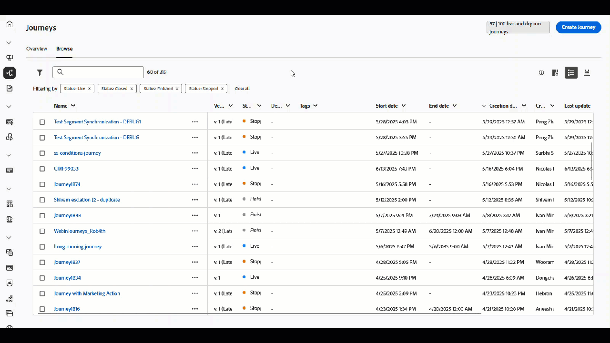

# Note sulla versione {#release-notes}

>[!CONTEXTUALHELP]
>id="ajo_homepage_card1"
>title="Novità"
>abstract="**Adobe Journey Optimizer** offre continuamente nuove funzioni, miglioramenti a quelle esistenti e correzioni di bug. Nelle presenti note sulla versione, tutte le modifiche sono consolidate durante l’ultima settimana di ogni mese."

[!DNL Adobe Journey Optimizer] offre continuamente nuove funzioni, miglioramenti alle funzioni esistenti e correzioni di bug. Nelle presenti note sulla versione, tutte le modifiche sono consolidate durante l’ultima settimana di ogni mese. [!DNL Adobe Journey Optimizer] è stato sviluppato in modalità nativa su [!DNL Adobe Experience Platform] e ne eredita le innovazioni e i miglioramenti più recenti. Ulteriori informazioni su queste modifiche sono disponibili nelle [Note sulla versione di Adobe Experience Platform](https://experienceleague.adobe.com/docs/experience-platform/release-notes/latest.html?lang=it){target="_blank"}.

## Note preliminari sulla versione di maggio 2025 {#25-5-rn}

**Le note preliminari sulla versione riportate di seguito sono soggette a modifica senza preavviso fino alla data di disponibilità della versione**. I collegamenti, le schermate e la documentazione aggiornata sono pubblicati alla data di rilascio.

**Data di rilascio**: 20-21 maggio 2025

### Nuove funzionalità {#25-05-features}

Di seguito sono descritte le nuove funzionalità incluse in questa versione.

<table>
<thead>
<tr>
<th><strong>Temi nel Designer e-mail</strong> </th>
</tr>
</thead>
<tbody>
<tr>
<td>

Ora puoi applicare rapidamente i temi approvati in precedenza per garantire la coerenza del brand in tutte le e-mail, velocizzare il processo di creazione delle campagne e produrre in modo indipendente e-mail di alta qualità, riducendo al contempo la dipendenza dai team di progettazione.

Questa funzionalità è disponibile nella versione beta e solo per clienti beta. Per partecipare al programma Beta, contatta il tuo rappresentante Adobe.

Per ulteriori informazioni, consulta la <a href="../email/apply-email-themes.md">documentazione dettagliata</a>.

Data di disponibilità: giovedì 14 maggio 2025

</td>
</tr>
</tbody>
</table>

<table>
<thead>
<tr>
<th><strong>Decisioning - Nuovo generatore di formule di IA</strong> </th>
</tr>
</thead>
<tbody>
<tr>
<td>

Ora puoi creare formule di classificazione decisionali specifiche definendo e combinando criteri da una nuova interfaccia migliorata. Invece di affidarti solo a una priorità di offerta statica, puoi definire formule di classificazione personalizzate che combinano punteggi di modelli AI, priorità di offerta, attributi di profilo, attributi di offerta e segnali contestuali tramite un’interfaccia guidata.

Per ulteriori informazioni, consulta la <a href="../experience-decisioning/exd-ranking-formulas.md">documentazione dettagliata</a>.

Data di disponibilità: giovedì 14 maggio 2025

</td>
</tr>
</tbody>
</table>

<table>
<thead>
<tr>
<th><strong>Sincronizzare la pianificazione del pubblico di lettura con il processo di segmentazione batch</strong> </th>
</tr>
</thead>
<tbody>
<tr>
<td>

Ora puoi attivare l’esecuzione di percorsi giornalieri dopo il completamento della segmentazione batch. Questa opzione è ora disponibile nei percorsi pianificati ogni giorno per tutti i clienti. Consente di definire per un intervallo di tempo massimo di 6 ore l’attesa dei dati del pubblico dai processi di segmentazione batch, garantendo che i percorsi vengano eseguiti con i dati più aggiornati oppure vengano saltati se non sono pronti.

Precedentemente rilasciata in Disponibilità limitata, questa funzionalità è ora disponibile per tutti gli ambienti (Disponibilità generale).

<!--
For more information, refer to the <a href="../building-journeys/read-audience.md#schedule">detailed documentation</a>.
-->
</td>
</tr>
</tbody>
</table>

<table>
<thead>
<tr>
<th><strong>Integrazione del frammento di contenuto di Adobe Experience Manager</strong> </th>
</tr>
</thead>
<tbody>
<tr>
<td>

Con l’integrazione di Adobe Experience Manager e Adobe Journey Optimizer, ora puoi utilizzare senza problemi i Frammenti di contenuto Adobe Experience Manager all’interno dei contenuti Journey Optimizer. Questa connessione diretta semplifica l’accesso e l’utilizzo dei contenuti AEM direttamente in Journey Optimizer.

Precedentemente disponibile per un set limitato di organizzazioni (LA), questa funzionalità è ora disponibile in versione GA con i seguenti miglioramenti:

<ul>
<li>Crea le offerte selezionando direttamente un frammento di contenuto AEM.</li>
<li>Definisci i segnaposto e mappa i valori di personalizzazione all’interno della firma del frammento utilizzando la modalità Editor.</li>
</ul>
</td>
</tr>
</tbody>
</table>

<!--<table>
<thead>
<tr>
<th><strong>Calendar View for Campaign and Journey inventory</strong> </th>
</tr>
</thead>
<tbody>
<tr>
<td>

A calendar view is now available in the journeys and campaigns lists. It allows you to visualize all journeys and campaigns activations in the respective lists.

This change is only available for a set of organizations (Limited Availability). To gain access, contact your Adobe representative.

For more information, refer to these sections: <a href="../building-journeys/journey-ui.md">Browse & filter your journeys</a>, <a href="../campaigns/modify-stop-campaign.md">Access campaigns</a>.

</td>
</tr>
</tbody>
</table>-->

<table>
<thead>
<tr>
<th><strong>Integrazione con Dynamic Media Adobe Experience Manager</strong> </th>
</tr>
</thead>
<tbody>
<tr>
<td>

Le risorse Dynamic Media sono ora direttamente disponibili e accessibili in Journey Optimizer. Questa integrazione consente di:

<ul>
<li>Gestione centralizzata delle risorse con aggiornamenti in tempo reale.</li>
<li>Modifica immediatamente le impostazioni delle risorse, ad esempio larghezza e altezza.</li>
<li>Personalizza i modelli Dynamic Media aggiornando i contenuti e aggiungendo campi di personalizzazione.</li>
</ul>

Precedentemente rilasciata in Disponibilità limitata, questa funzionalità è ora disponibile per tutti gli ambienti (Disponibilità generale).

</td>
</tr>
</tbody>
</table>

<table>
<thead>
<tr>
<th><strong>Conflitto e definizione delle priorità</strong> </th>
</tr>
</thead>
<tbody>
<tr>
<td>

In Journey Optimizer, gestire il volume e la tempistica delle campagne e dei percorsi è essenziale per evitare di sopraffare la clientela con troppe interazioni. Journey Optimizer offre ora diversi strumenti per la gestione dei conflitti e la definizione delle priorità, in precedenza disponibili solo per le organizzazioni ad accesso limitato, che ora sono generalmente disponibili (GA).

Precedentemente rilasciata in Disponibilità limitata, questa funzionalità è ora disponibile per tutti gli ambienti. Con questa versione di disponibilità generale sono stati introdotti i seguenti miglioramenti:

<ul>
<li>Supporto esteso: gli strumenti per la gestione dei conflitti ora supportano sia Percorsi unitari che Percorsi di qualificazione del pubblico, oltre ai percorsi Read audience.</li>
<li>Risoluzione dei problemi migliorata: in Query Service sono ora disponibili due nuovi campi evento passaggio che consentono di analizzare il motivo per cui un profilo è stato rifiutato da un percorso o da una campagna.</li>
<li>Rapporti migliorati: i rapporti ora indicano quale regola specifica ha escluso un profilo da un percorso o da una campagna, fornendo maggiore trasparenza e informazioni fruibili.</li></ul>

<!--
For more information, refer to the <a href="../conflict-prioritization/gs-conflict-prioritization.md">detailed documentation</a>.
-->
</td>
</tr>
</tbody>
</table>

<table>
<thead>
<tr>
<th><strong>Simulare varianti di contenuto</strong> </th>
</tr>
</thead>
<tbody>
<tr>
<td>

Precedentemente disponibile in versione Beta, la simulazione delle varianti di contenuto è ora disponibile per tutti gli utenti (disponibilità generale, GA). Consente di visualizzare l’anteprima di diverse varianti del contenuto utilizzando dati di input di esempio caricati da un file CSV o JSON o aggiunti manualmente. Tutti gli attributi utilizzati nel contenuto per la personalizzazione vengono rilevati automaticamente dal sistema e possono essere utilizzati per i test per creare più varianti.

Precedentemente rilasciata in Disponibilità limitata, questa funzionalità è ora disponibile per tutti gli ambienti. Con questa versione a disponibilità generale, la funzione ora include il supporto per contenuti ed esperimenti di contenuti multilingue, consentendo di testare le varianti tra diversi linguaggi e trattamenti. Inoltre, ora supporta gli attributi contestuali (oltre agli attributi di profilo), consentendo test di contenuto ancora più dinamici e situazionali.

<!--
For more information, refer to the <a href="../test-approve/simulate-sample-input.md">detailed documentation</a>.
-->
</td>
</tr>
</tbody>
</table>

<!--table>
<thead>
<tr>
<th><strong>Scale your Experimentation winner</strong> </th>
</tr>
</thead>
<tbody>
<tr>
<td>

Scale the Winner enables you to automatically or manually roll out the winning variation of an experiment to your full audience. This feature ensures that, once a top performer is identified, you can maximize its reach and effectiveness without constant manual oversight.

</td>
</tr>
</tbody>
</table-->

<table>
<thead>
<tr>
<th><strong>Provider SMS personalizzato</strong> </th>
</tr>
</thead>
<tbody>
<tr>
<td>

Journey Optimizer ora consente di configurare altri provider SMS oltre alle opzioni predefinite: Sinch, Infobip e Twilio. Con la configurazione del provider SMS personalizzato, puoi integrare direttamente provider di terze parti, sfruttare la personalizzazione avanzata del payload per la messaggistica dinamica e gestire le preferenze di consenso (opt-in/opt-out) per garantire la conformità.

Per ulteriori informazioni, consulta la <a href="../sms/sms-configuration-custom.md">documentazione dettagliata</a>.

Precedentemente rilasciata in Disponibilità limitata, questa funzionalità è ora disponibile per tutti gli ambienti (Disponibilità generale).
</td>
</td>
</tr>
</tbody>
</table>

<!--
<table>
<thead>
<tr>
<th><strong>Supplemental ID for event-triggered journeys</strong> </th>
</tr>
</thead>
<tbody>
<tr>
<td>

You can now trigger journeys using a profile ID along with another identifier, such as an order ID, subscription ID, or prescription ID, allowing the same profile to be in the same journey multiple times at once. This enables scenarios like managing multiple orders or subscriptions in parallel, with each instance following its own path through the journey.

This capability is only available for a set of organizations (Limited Availability). To gain access, contact your Adobe representative.

</td>
</tr>
</tbody>
</table>
-->

### Miglioramenti {#25-05-improv}

I miglioramenti apportati a questa versione sono elencati di seguito.

* **Nuovi oggetti supportati per la copia sandbox**

   * **Campagne** - Data di disponibilità: 15 maggio 2025

     Quando si copiano campagne in più sandbox utilizzando le funzionalità di esportazione e importazione dei pacchetti, ora vengono copiate anche le seguenti dipendenze: configurazioni dei canali, varianti e impostazioni di esperimenti, criteri di decisione ed elementi. [Ulteriori informazioni](../configuration/copy-objects-to-sandbox.md)

   * **Decisioning** - Data di disponibilità: 16 maggio 2025

     È ora possibile copiare gli oggetti decisionali tra sandbox, semplificando i flussi di lavoro di test e distribuzione. [Ulteriori informazioni](../configuration/copy-objects-to-sandbox.md#decisioning)

* **Cartelle per le pagine di destinazione** - Data di disponibilità: 9 maggio 2025

  Per gestire facilmente le pagine di destinazione, ora puoi utilizzare le cartelle per organizzarle in modo più efficace in una gerarchia strutturata. [Ulteriori informazioni](../landing-pages/manage-lp.md)

* **Direct mailing: supporto della chiave SSH per le connessioni SFTP** - Data di disponibilità: 5 maggio 2025

  Nella configurazione di indirizzamento dei file Direct Mail, oltre a SFTP esistente con tipo di autenticazione tramite password, ora puoi esportare il file di direct mailing in un server SFTP con autenticazione tramite chiave SSH.

* **Attivazione pillole per la personalizzazione** - Data di disponibilità: 5 maggio 2025

  Un nuovo pulsante &quot;Pills&quot; è stato aggiunto all’editor di personalizzazione. Quando sono abilitati, gli attributi di profilo e contestuali vengono visualizzati come pillole, migliorando la leggibilità del codice. [Ulteriori informazioni](../personalization/personalization-build-expressions.md#options)

  >[!AVAILABILITY]
  >
  >Questa funzionalità verrà gradualmente implementata in tutti gli ambienti nei prossimi 30 giorni.

* **Tracciamento dei clic nei modelli e-mail**

  Il tracciamento dei clic su `<area>` elementi all&#39;interno di mappe immagine nei modelli e-mail è ora supportato in modo nativo in Journey Optimizer. In questo modo, le aree della mappa immagine riceveranno gli stessi parametri di wrapping, tracciamento e aggiunta dei collegamenti ipertestuali standard.

* **Decisioning - Utilizzo dei set di dati di Adobe Experience Platform**

  Journey Optimizer ora consente di sfruttare i set di dati di Adobe Experience Platform nei seguenti oggetti Decisioning: regole di idoneità, formule di classificazione e regole di limitazione di utilizzo.

* **Cartelle per modelli e frammenti**

  Le cartelle consentono di organizzare i modelli di contenuto e i frammenti in modo più semplice ed efficace in una gerarchia strutturata. Precedentemente disponibili per un set di organizzazioni (LA), le cartelle sono ora disponibili per tutti gli utenti (GA) per gestire i modelli di contenuto e i frammenti.

* Supporto di **&#39;Reindirizza all&#39;URL&#39; nel canale Web**

  Il canale web Journey Optimizer ora consente di reindirizzare i visitatori a un altro URL esistente anziché creare una nuova variante nell’editor visivo. Questa funzionalità può essere utilizzata per eseguire esperimenti confrontando due pagine completamente diverse, anziché modificare solo alcuni elementi all’interno di una pagina.

<!--* **Right rail in campaigns list**

  In the campaign list, selecting a campaign now opens a pane displaying its details.-->

* **Campi modulo nel contenuto esperienza basato su codice**

  Nei modelli di contenuto, ora puoi definire campi JSON o HTML specifici che consentono agli utenti non tecnici di modificare facilmente il contenuto in esperienze basate su codice senza dover manipolare il codice.

* **Supporto dell&#39;attributo dell&#39;elemento decisione per le regole di decisione**

  Ora puoi sfruttare gli attributi degli elementi di decisione per creare regole di decisione.

<!--
* **Subdomains - 'Custom delegation' method**  
  In addition to the full delegation and the CNAME method, a new subdomain configuration method is now available: the Custom delegation method, which enables you to fully own controlling and maintaining all aspects of DNS that are required for delivering, rendering, and tracking messages.-->

