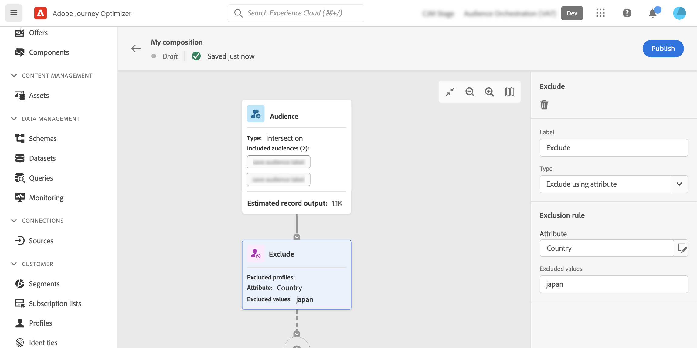

# Lavorare nell’area di lavoro per la composizione {#composition-canvas}

>[!BEGINSHADEBOX]

Cosa troverai in questa documentazione:

* [Introduzione alla composizione dei tipi di pubblico](get-started-audience-orchestration.md)
* [Creare il primo flusso di lavoro per la composizione](create-compositions.md)
* **[Lavorare nell’area di lavoro per la composizione](composition-canvas.md)**
* [Accesso e gestione dei tipi di pubblico](access-audiences.md)

>[!ENDSHADEBOX]

La composizione del pubblico fornisce un’area di lavoro visiva che consente di creare tipi di pubblico e utilizzare varie attività (suddivise, arricchite, ecc.).

I passaggi per comporre un pubblico nell’area di lavoro sono i seguenti:

1. [Definire i tipi di pubblico iniziali](#starting-audience)
1. [Aggiungi una o più attività](#action-activities)
1. [Salvare i risultati in un nuovo pubblico](#save)

## Selezionare il pubblico iniziale {#starting-audience}

Il primo passaggio per creare una composizione consiste nel selezionare uno o più tipi di pubblico esistenti come base della composizione.

1. Seleziona la **[!UICONTROL Pubblico]** quindi fornisci un’etichetta per l’attività.

1. Scegli il pubblico di cui eseguire il targeting:

   * Fai clic sul pulsante **[!UICONTROL Aggiungi pubblico]** per selezionare uno o più tipi di pubblico esistenti,
   * Fai clic sul pulsante **[!UICONTROL Crea regola]** per creare una nuova definizione di segmento utilizzando il pulsante [Servizio di segmentazione](https://experienceleague.adobe.com/docs/experience-platform/segmentation/ui/overview.html).

   

1. Se sono selezionati più tipi di pubblico, specifica in che modo unire i profili di questi tipi di pubblico:

* **[!UICONTROL Union]**: includere tutti i profili dal pubblico selezionato,
* **[!UICONTROL Intersection]**: includere profili comuni a tutti i tipi di pubblico selezionati,
* **[!UICONTROL Escludi sovrapposizione]**: includere profili che appartengono solo a uno dei tipi di pubblico. I profili appartenenti a più di un pubblico non verranno inclusi.

In questo esempio, vogliamo eseguire il targeting di tutti i profili appartenenti al pubblico gold e silver.

Una volta selezionati i tipi di pubblico, il numero stimato di profili viene visualizzato nella parte inferiore dell’attività.

## Aggiungi attività {#action-activities}

Aggiungi le attività dopo aver selezionato il pubblico iniziale per perfezionare la selezione.

A questo scopo, fai clic sul pulsante + nel percorso della composizione, quindi seleziona l’attività desiderata. Viene visualizzato il riquadro a destra, che consente di configurare l’attività appena aggiunta.

Le attività disponibili sono:

* [Pubblico](#audience): includere profili aggiuntivi appartenenti a uno o più tipi di pubblico esistenti,
* [Escludi](#exclude): escludere profili appartenenti a un pubblico esistente o escludere profili basati su attributi specifici,
* [Arricchire](#enrich): arricchire il pubblico con attributi aggiuntivi provenienti dai set di dati Adobe Experience Platform,
* [Classificazione](#rank): classificare i profili in base a un attributo specifico, specificare il numero di profili da mantenere e includerli nella composizione,
* [Divisione](#split): dividi la composizione in più percorsi in base a percentuali casuali o su attributi.

Puoi aggiungere più **[!UICONTROL Pubblico]** e **[!UICONTROL Escludi]** attività necessarie nella composizione. Tuttavia, non è possibile aggiungere attività aggiuntive dopo **[!UICONTROL Classificazione]** e **[!UICONTROL Divisione]** attività .

Puoi rimuovere un’attività dall’area di lavoro in qualsiasi momento facendo clic sul pulsante Elimina nel riquadro a destra.  Se l’attività da eliminare è un elemento padre di altre attività della composizione, viene visualizzato un messaggio che consente di specificare se si desidera eliminare solo l’attività selezionata o tutte le relative attività secondarie.

### Attività Pubblico {#audience}

>[!CONTEXTUALHELP]
>id="ajo_ao_audience"
>title="Attività Pubblico"
>abstract="L’attività Pubblico consente di includere nella composizione profili aggiuntivi appartenenti a un pubblico esistente."

>[!CONTEXTUALHELP]
>id="ajo_ao_merge_types"
>title="Tipi di unione"
>abstract="Specifica come devono essere uniti i profili dei tipi di pubblico selezionati."

La **[!UICONTROL Pubblico]** l’attività ti consente di includere nella composizione profili aggiuntivi appartenenti a un pubblico esistente.

La configurazione di questa attività è identica a quella iniziale [Attività pubblico](#starting-audience).

### Attività di esclusione {#exclude}

>[!CONTEXTUALHELP]
>id="ajo_ao_exclude_type"
>title="Tipo di esclusione"
>abstract="Utilizza il tipo Escludi pubblico per escludere i profili appartenenti a un pubblico esistente. Il tipo Escludi con attributo consente di escludere i profili in base a un attributo specifico."

>[!CONTEXTUALHELP]
>id="ajo_ao_exclude"
>title="Attività di esclusione"
>abstract="L’attività di esclusione consente di escludere i profili dalla composizione selezionando un pubblico esistente o utilizzando una regola."

La **[!UICONTROL Escludi]** l’attività ti consente di escludere i profili dalla composizione. Sono disponibili due tipi di esclusione:

* **[!UICONTROL Escludi pubblico]**: Escludi i profili appartenenti a un pubblico esistente.

   Fai clic sul pulsante **[!UICONTROL Aggiungi pubblico]** quindi seleziona il pubblico da escludere.

   

* **[!UICONTROL Escludi utilizzando l’attributo]**: Escludere i profili in base a un attributo specifico.

   Seleziona l&#39;attributo da cercare e specifica il valore da escludere. In questo esempio, escludiamo dai profili di composizione il cui indirizzo di casa è in Giappone.

   

### Arricchire {#enrich}

>[!CONTEXTUALHELP]
>id="ajo_ao_enrich"
>title="Attività Arricchisci"
>abstract="Utilizza l’attività Arricchisci per escludere i profili appartenenti a un pubblico esistente. Il tipo Escludi con attributo consente di escludere i profili in base a un attributo specifico."

>[!CONTEXTUALHELP]
>id="ajo_ao_enrich_dataset"
>title="Set di dati di arricchimento"
>abstract="Seleziona il set di dati di arricchimento contenente i dati che desideri associare al pubblico."

>[!CONTEXTUALHELP]
>id="ajo_ao_enrich_criteria"
>title="Criteri di arricchimento"
>abstract="Seleziona i campi da utilizzare come chiave di riconciliazione tra il set di dati di origine, ovvero il pubblico, e il set di dati di arricchimento."

>[!CONTEXTUALHELP]
>id="ajo_ao_enrich_attributes"
>title="Attributi di arricchimento"
>abstract="Seleziona uno o più attributi dal set di dati di arricchimento da associare al pubblico. Una volta pubblicata la composizione, questi attributi sono associati al pubblico e possono essere utilizzati nelle campagne per personalizzare le consegne."

La **[!UICONTROL Arricchire]** l’attività ti consente di arricchire il pubblico con attributi aggiuntivi provenienti dai set di dati Adobe Experience Platform. Ad esempio, puoi aggiungere informazioni relative al prodotto acquistato come nome, prezzo o ID produttore e sfruttare queste informazioni per personalizzare le consegne inviate al pubblico.

>[!IMPORTANT]
>
>Per il momento, le etichette del set di dati, a livello di set di dati o di campo, non vengono propagate al pubblico appena creato. Questo può influenzare il controllo di accesso e/o la governance dei dati per il pubblico risultante. Per questo motivo, utilizza solo i dati di test per la composizione dei tipi di pubblico.

Per configurare l’attività, segui questi passaggi:

1. Seleziona la **[!UICONTROL Set di dati di arricchimento]** contenente i dati che desideri associare al pubblico.

1. In **[!UICONTROL Criteri di arricchimento]** seleziona i campi da utilizzare come chiave di riconciliazione tra il set di dati sorgente, ad esempio il pubblico, e il set di dati di arricchimento. In questo esempio, utilizziamo l’ID del prodotto acquistato come chiave di riconciliazione.

1. Fai clic sul pulsante **[!UICONTROL Aggiungi attributi]** quindi seleziona uno o più attributi dal set di dati di arricchimento da associare al pubblico.

   

Una volta pubblicata la composizione, gli attributi selezionati sono associati al pubblico e possono essere utilizzati nelle campagne per personalizzare le consegne.

### Attività di classifica {#rank}

>[!CONTEXTUALHELP]
>id="ajo_ao_ranking"
>title="Attività di classifica"
>abstract="L’attività Classificazione consente di classificare i profili in base a un attributo specifico e di includerli nella composizione. Ad esempio, puoi includere i 50 profili con la maggiore quantità di punti fedeltà."

>[!CONTEXTUALHELP]
>id="ajo_ao_rank_profilelimit_text"
>title="Aggiungere un limite di profili"
>abstract="Attiva questa opzione per specificare un numero massimo di profili da includere nella composizione."

La **[!UICONTROL Classificazione]** l’attività ti consente di classificare i profili in base a un attributo specifico e di includerli nella composizione. Ad esempio, puoi includere i 50 profili con la maggiore quantità di punti fedeltà.

1. Seleziona l’attributo da cercare e specifica un ordine di classificazione (crescente o decrescente).

   >[!NOTE]
   >
   >Puoi selezionare gli attributi con i seguenti tipi di dati: numero intero, numeri, breve <!--(other?)-->

1. Attiva/disattiva la **[!UICONTROL Aggiungi limite profilo]** su e specifica un numero massimo di profili da includere nella composizione.

   

### Attività Dividi {#split}

<!-- [!CONTEXTUALHELP]
>id="ajo_ao_control_group_text"
>title="Control Group"
>abstract="Use control groups to isolate a portion of the profiles. This allows you to measure the impact of a marketing activity and make a comparison with the behavior of the rest of the population."-->

>[!CONTEXTUALHELP]
>id="ajo_ao_split"
>title="Attività Dividi"
>abstract="L’attività Dividi consente di dividere la composizione in più percorsi. Quando pubblichi la composizione, viene salvato un pubblico per ogni percorso in Adobe Experience Platform."

>[!CONTEXTUALHELP]
>id="ajo_ao_split_type"
>title="Tipo di divisione"
>abstract="Utilizza il tipo di divisione percentuale per dividere in modo casuale i profili in più percorsi. Il tipo di divisione per attributo consente invece di dividere i profili in base a un attributo specifico."

>[!CONTEXTUALHELP]
>id="ajo_ao_split_otherprofiles_text"
>title="Altri profili"
>abstract="Attiva questa opzione per creare un percorso aggiuntivo con i profili rimanenti che non corrispondono a nessuna delle condizioni specificate negli altri percorsi."

La **[!UICONTROL Divisione]** l’attività ti consente di dividere la composizione in più percorsi.

Questa operazione aggiunge automaticamente una **[!UICONTROL Salva]** attività alla fine di ogni percorso. Quando pubblichi la composizione, viene salvato un pubblico per ogni percorso in Adobe Experience Platform.

Sono disponibili due tipi di operazioni suddivise:

* **[!UICONTROL Divisione percentuale]**: dividi i profili in modo casuale in due o più percorsi. Ad esempio, puoi dividere i profili in 2 percorsi distinti del 50% ciascuno. <!--and add an additional path for control group.-->

   

* **[!UICONTROL Divisione attributo]**: dividere i profili in base a un attributo specifico. In questo esempio, suddividiamo i profili in base alle loro preferenze per il tipo di stanza.

   

   >[!NOTE]
   >
   >La **[!UICONTROL Altri profili]** consente di creare un percorso aggiuntivo con i profili rimanenti che non corrispondono a nessuna delle condizioni specificate negli altri percorsi.

## Salvare i tipi di pubblico {#save}

Configura i tipi di pubblico risultanti che verranno salvati in Adobe Experience Platform.

A questo scopo, seleziona la **[!UICONTROL Save audience]** alla fine di ogni percorso, specifica il nome del nuovo pubblico da creare.

Una volta pronta la composizione, puoi pubblicarla. [Scopri come creare le composizioni](create-compositions.md)
