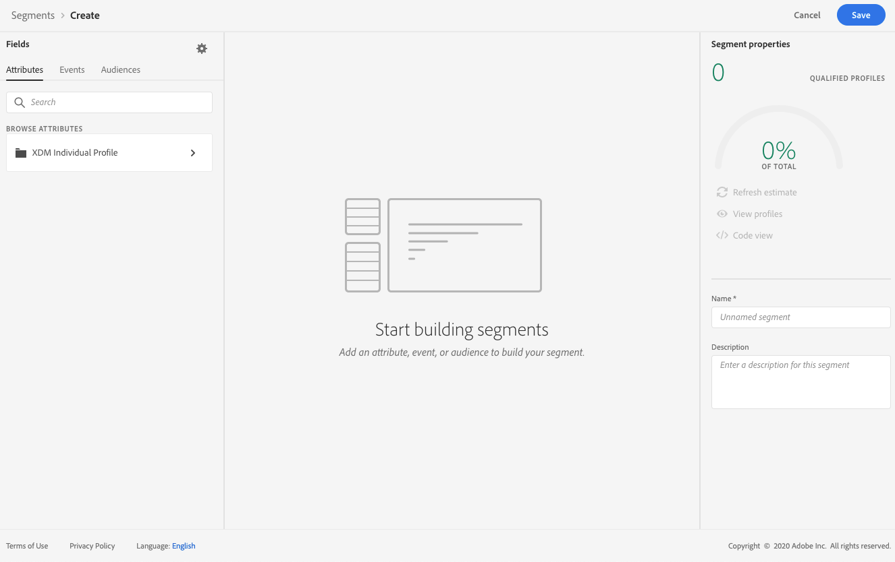
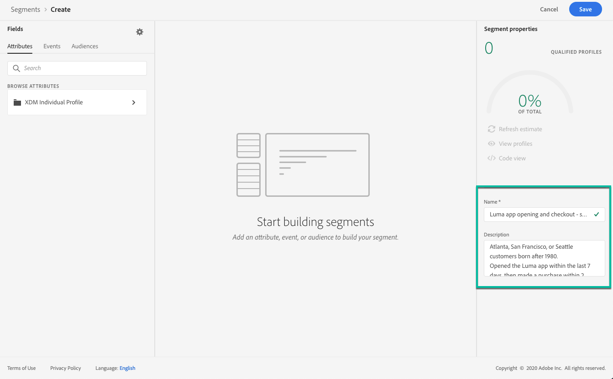

# Creare segmenti {#build-segments}

>[!CONTEXTUALHELP]
>id="ajo_ao_create_rule"
>title="Creare una regola"
>abstract="Il metodo di creazione delle regole di compilazione consente di creare una nuova definizione di segmento utilizzando il servizio di segmentazione di Adobe Experience Platform."

In questo esempio, creeremo un segmento per tutti i clienti che vivono ad Atlanta, San Francisco, o Seattle e sono nati dopo il 1980. Tutti questi clienti avrebbero dovuto aprire l’applicazione Luma entro gli ultimi 7 giorni, quindi effettuare un acquisto entro 2 ore dall’apertura dell’applicazione.

➡️ [Scopri come creare segmenti in questo video](#video-segment)

1. Accedere al **[!UICONTROL Segments]** quindi fai clic sul **[!UICONTROL Create segment]** pulsante .

   

   La schermata di definizione del segmento ti consente di configurare tutti i campi richiesti per definire il segmento. Scopri come configurare i segmenti nel [Documentazione del servizio di segmentazione](https://experienceleague.adobe.com/docs/experience-platform/segmentation/ui/overview.html){target=&quot;_blank&quot;}.

   

1. In **[!UICONTROL Segment properties]** Specifica un nome e una descrizione (facoltativi) per il segmento.

   

1. Trascina e rilascia i campi desiderati dal riquadro di sinistra all’area di lavoro centrale, quindi configurali in base alle tue esigenze.

   >[!NOTE]
   >
   >I campi disponibili nel riquadro a sinistra variano a seconda del modo in cui **Profilo individuale XDM** e **ExperienceEvent XDM** Gli schemi sono stati configurati per la tua organizzazione.  Ulteriori informazioni nel [Documentazione di Experience Data Model (XDM)](https://experienceleague.adobe.com/docs/experience-platform/xdm/home.html){target=&quot;_blank&quot;}.

   

   In questo esempio dobbiamo fare affidamento su **Attributi** e **Eventi** campi per creare il segmento:

   * **Attributi**: profili che vivono ad Atlanta, San Francisco o Seattle nati dopo il 1980

      

   * **Eventi**: i profili che hanno aperto l’applicazione Luma negli ultimi 7 giorni, quindi hanno effettuato un acquisto entro 2 ore dall’apertura dell’applicazione.

      

1. Durante l’aggiunta e la configurazione di nuovi campi nell’area di lavoro, la **[!UICONTROL Segment Properties]** viene aggiornato automaticamente con le informazioni sui profili stimati appartenenti al segmento.

   

1. Una volta pronto il segmento, fai clic su **[!UICONTROL Save]**. Viene visualizzato nell’elenco dei segmenti di Adobe Experience Platform. È disponibile una barra di ricerca per facilitare la ricerca di un segmento specifico nell’elenco.

Il segmento può ora essere utilizzato nei percorsi. Per ulteriori informazioni, consulta [questa sezione](../segment/about-segments.md).

## Video introduttivo{#video-segment}

Scopri come creare segmenti.

>[!VIDEO](https://video.tv.adobe.com/v/334281?quality=12)
