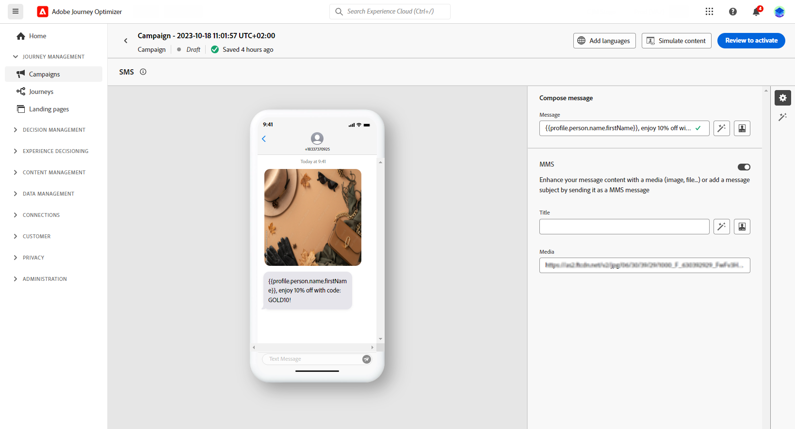

# Creare un messaggio MMS {#create-mms}

## Prerequisiti{#sms-prerequisites}

Prima di creare il messaggio SMS, devi innanzitutto configurare il fornitore SMS con Journey Optimizer. Segui questi passaggi:

* Prima di inviare SMS, devi integrare le impostazioni del provider con Journey Optimizer.

+++ Scopri come creare una nuova credenziale API Sinch MMS.

   1. Nella barra a sinistra, passa a **[!UICONTROL Amministrazione]** > **[!UICONTROL Canali]** e seleziona la **[!UICONTROL Credenziali API]** menu. Fai clic su **[!UICONTROL Crea nuove credenziali API]** pulsante.

      

   1. Configura le credenziali API SMS:

   * Per **[!DNL Sinch MMS]**:

      * **[!UICONTROL Nome]**: scegli un nome per le credenziali API.

      * **[!UICONTROL ID Progetto]**, **[!UICONTROL ID app]** e **[!UICONTROL Token API]**: dal menu API di conversazione, puoi trovare le tue credenziali nel menu App.  [Ulteriori informazioni](https://docs.cc.sinch.com/cloud/service-configuration/en/oxy_ex-1/common/wln1620131604643.html)

     

   1. Clic **[!UICONTROL Invia]** al termine della configurazione delle credenziali API.

  Dopo aver creato e configurato le credenziali API, ora è necessario creare una superficie di canale (ossia un predefinito per messaggi) per i messaggi SMS.

+++

* Al termine, dovrai creare una superficie SMS. Questi passaggi devono essere eseguiti da un amministratore di sistema di Adobe Journey Optimizer.

+++ Scopri come creare la superficie di canale.

   1. Nella barra a sinistra, passa a **[!UICONTROL Amministrazione]** > **[!UICONTROL Canali]** e seleziona **[!UICONTROL Marchio]** > **[!UICONTROL Superfici di canale]**. Fai clic su **[!UICONTROL Crea superficie di canale]** pulsante.

      

   1. Immetti un nome e una descrizione (facoltativa) per la superficie, quindi seleziona il canale SMS.

      

      >[!NOTE]
      >
      > I nomi devono iniziare con una lettera (A-Z). Può contenere solo caratteri alfanumerici. È inoltre possibile utilizzare il carattere di sottolineatura `_`, punto`.` e trattino `-` caratteri.

   1. Definisci il **Impostazioni SMS**.

      

      Per iniziare, seleziona la **[!UICONTROL Tipo di SMS]** che verrà inviato con la superficie: **[!UICONTROL Transazionale]** o **[!UICONTROL Marketing]**.

      * Scegli **Marketing** per gli SMS promozionali: questi messaggi richiedono il consenso degli utenti.
      * Scegli **Transazionale** per messaggi non commerciali come ad esempio la conferma di un ordine, le notifiche di reimpostazione della password o le informazioni di consegna.

      Quando crei un messaggio SMS, devi scegliere una superficie di canale valida che corrisponda alla categoria selezionata per il messaggio.

      >[!CAUTION]
      >
      >**Transazionale** I messaggi SMS possono essere inviati ai profili che hanno annullato l’abbonamento alle comunicazioni di marketing. Questi messaggi possono essere inviati solo in contesti specifici.

   1. Seleziona la **[!UICONTROL Configurazione SMS]** per associarlo alla superficie.

      Per ulteriori informazioni su come configurare l’ambiente per l’invio di messaggi SMS, consulta [questa sezione](#create-api).

   1. Inserisci il **[!UICONTROL Numero mittente]** &#x200B;si desidera utilizzare per le comunicazioni.

   1. Seleziona il **[!UICONTROL Campo di esecuzione SMS]** per selezionare **[!UICONTROL Attributo profilo]** associati ai numeri di telefono dei profili.

   1. Se desideri utilizzare la funzione di abbreviazione URL nei messaggi SMS, seleziona un elemento da **[!UICONTROL Sottodominio]** elenco.

      >[!NOTE]
      >
      >Per poter selezionare un sottodominio, accertati di aver configurato in precedenza almeno un sottodominio SMS. [Scopri come](sms-subdomains.md)

   1. Inserisci il **[!UICONTROL Numero di rinuncia]** si desidera utilizzare per questa superficie. Quando i profili rinunciano a questo numero, puoi comunque inviare loro messaggi da altri numeri con cui stai utilizzando l’invio di messaggi SMS [!DNL Journey Optimizer].

      >[!NOTE]
      >
      >In entrata [!DNL Journey Optimizer], la rinuncia agli SMS non viene più gestita a livello di canale. Ora è specifico per un numero.

   1. Una volta configurati tutti i parametri, fai clic su **[!UICONTROL Invia]** per confermare. Potete anche salvare la superficie di canale come sformo e riprenderne la configurazione in un secondo momento.

      

   1. Una volta creata la superficie di canale, questa viene visualizzata nell’elenco con **[!UICONTROL Elaborazione]** stato.

      >[!NOTE]
      >
      >Se i controlli non hanno esito positivo, ulteriori informazioni sui possibili motivi dell’errore in [questa sezione](#monitor-channel-surfaces).

   1. Quando i controlli hanno esito positivo, la superficie di canale riceve **[!UICONTROL Attivo]** stato. È pronto per essere utilizzato per inviare messaggi.

      

## Creare un messaggio SMS {#create-sms-journey-campaign}

Sfoglia le schede seguenti per scoprire come aggiungere un messaggio SMS in una campagna o in un percorso.

>[!BEGINTABS]

>[!TAB Aggiungere un messaggio SMS a un Percorso]

1. Apri il percorso, quindi trascina e rilascia un’attività SMS dal file **Azioni** nella palette.

   

1. Fornisci informazioni di base sul messaggio (etichetta, descrizione, categoria), quindi scegli la superficie del messaggio da utilizzare.

   

   Per ulteriori informazioni su come configurare un percorso, consulta [questa pagina](../building-journeys/journey-gs.md)

   Il **[!UICONTROL Superficie]** Il campo è precompilato, per impostazione predefinita, con l’ultima superficie utilizzata dall’utente per quel canale.

Ora puoi iniziare a progettare il contenuto del messaggio SMS dalla sezione **[!UICONTROL Modifica contenuto]** pulsante. [Definire il contenuto degli SMS](#sms-content)

>[!TAB Aggiungere un messaggio SMS a una campagna]

1. Crea una nuova campagna pianificata o attivata da API, seleziona **[!UICONTROL SMS]** come azione e scegli il **[!UICONTROL Superficie app]** da utilizzare. [Ulteriori informazioni sulla configurazione degli SMS](sms-configuration.md).

   

1. Fai clic su **[!UICONTROL Crea]**.

1. Dalla sezione **[!UICONTROL Proprietà]** , modifica i **[!UICONTROL Titolo]** e **[!UICONTROL Descrizione]**.

   

1. Fai clic su **[!UICONTROL Seleziona pubblico]** per definire il pubblico di destinazione dall’elenco dei tipi di pubblico di Adobe Experience Platform disponibili. [Ulteriori informazioni](../audience/about-audiences.md).

1. In **[!UICONTROL Spazio dei nomi dell’identità]** , scegli lo spazio dei nomi da utilizzare per identificare i singoli utenti del pubblico selezionato. [Ulteriori informazioni](../event/about-creating.md#select-the-namespace).

   

1. Clic **[!UICONTROL Crea esperimento]** per iniziare a configurare l’esperimento sui contenuti e creare trattamenti per misurarne le prestazioni e identificare l’opzione migliore per il pubblico di destinazione. [Ulteriori informazioni](../campaigns/content-experiment.md)

1. In **[!UICONTROL Tracciamento delle azioni]** , specifica se desideri tenere traccia dei clic sui collegamenti nel messaggio SMS.

1. Le campagne sono progettate per essere eseguite in una data specifica o con una frequenza ricorrente. Scopri come configurare **[!UICONTROL Pianificazione]** della campagna in [questa sezione](../campaigns/create-campaign.md#schedule).

1. Dalla sezione **[!UICONTROL Trigger azione]** scegliere il menu **[!UICONTROL Frequenza]** del messaggio SMS:

   * Una volta
   * Giornaliero
   * Settimanale
   * Mese

Ora puoi iniziare a progettare il contenuto del messaggio SMS dalla sezione **[!UICONTROL Modifica contenuto]** pulsante. [Progettare i contenuti SMS](#sms-content)

>[!ENDTABS]

## Definire il contenuto MMS{#mms-content}

1. Dalla schermata di configurazione del percorso o della campagna, fai clic su **[!UICONTROL Modifica contenuto]** per configurare il contenuto SMS.

1. Fai clic su **[!UICONTROL Messaggio]** per aprire l’editor di espressioni.

   

1. Utilizza l’editor espressioni per definire il contenuto e aggiungere contenuto dinamico. Puoi utilizzare qualsiasi attributo, ad esempio il nome del profilo o la città. Ulteriori informazioni su [personalizzazione](../personalization/personalize.md) e [contenuto dinamico](../personalization/get-started-dynamic-content.md) nell’editor di espressioni.

1. Abilita l’opzione MMS per aggiungere contenuti multimediali al contenuto SMS.

   >[!NOTE]
   >
   > L’opzione MMS è disponibile solo con Sinch. Per creare MMS è necessario creare una credenziale API specifica. [Ulteriori informazioni](sms-configuration.md#create-new-api)

   

1. Aggiungi un **[!UICONTROL Titolo]** ai tuoi contenuti multimediali.

1. Immetti l’URL del file multimediale in **[!UICONTROL Contenuti multimediali]** campo.

   

1. Clic **[!UICONTROL Salva]** e controlla il messaggio nell’anteprima. È possibile utilizzare **[!UICONTROL Simula contenuto]** per visualizzare in anteprima gli URL abbreviati o i contenuti personalizzati.

Ora puoi testare e inviare il messaggio SMS al pubblico. [Ulteriori informazioni](send-sms.md)
Una volta inviato, puoi misurare l’impatto del tuo SMS all’interno dei rapporti della campagna o del Percorso. Per ulteriori informazioni sul reporting, consulta [questa sezione](../reports/campaign-global-report.md#sms-tab).

>[!NOTE]
>
>In conformità agli standard e alle normative del settore, tutti i messaggi SMS di marketing devono consentire ai destinatari di annullare facilmente l’iscrizione alla ricezione di messaggi. A questo scopo, i destinatari di SMS possono rispondere con parole chiave di consenso e rinuncia. [Scopri come gestire la rinuncia](../privacy/opt-out.md#sms-opt-out-management-sms-opt-out-management)

**Argomenti correlati**

* [Visualizzare l’anteprima, testare e inviare il messaggio SMS](send-sms.md)
* [Configurare il canale SMS](sms-configuration.md)
* [Rapporto SMS](../reports/journey-global-report.md#sms-global)
