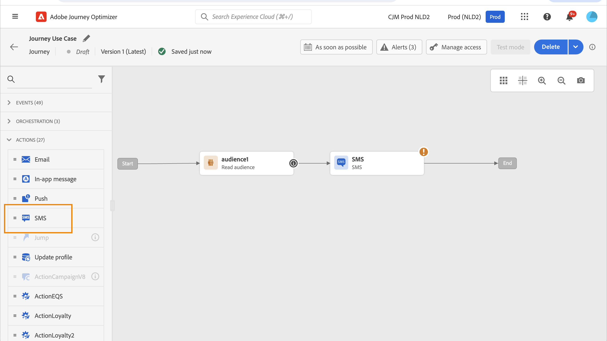
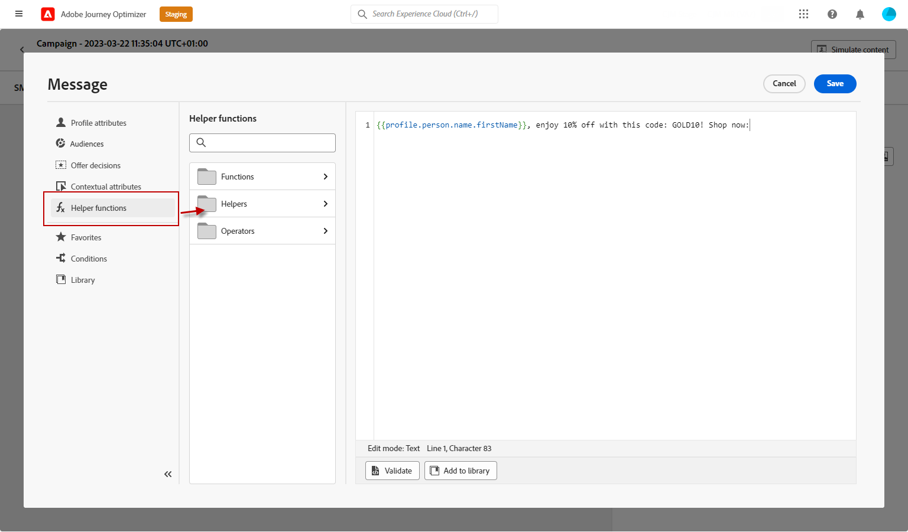

# Creare un messaggio SMS/MMS/RCS {#create-sms}

>[!CONTEXTUALHELP]
>id="ajo_message_sms"
>title="Creare un messaggio SMS"
>abstract="Per creare un messaggio di testo (SMS/MMS/RCS), aggiungi un’azione SMS in un percorso o in una campagna e inizia a personalizzarla con l’editor di personalizzazione."

Con Adobe Journey Optimizer è possibile progettare e inviare messaggi di testo (SMS), di comunicazione avanzata (RCS) e multimediali (MMS). Devi innanzitutto aggiungere un’azione SMS in un percorso o in una campagna e quindi definire il contenuto del messaggio di testo, come descritto di seguito. Adobe Journey Optimizer offre inoltre funzionalità per testare i messaggi di testo prima dell’invio, in modo da poter controllare il rendering, gli attributi di personalizzazione e tutte le altre impostazioni.

>[!NOTE]
>
>In conformità agli standard e alle normative del settore, tutti i messaggi SMS/MMS di marketing devono consentire ai destinatari di annullare facilmente l’iscrizione alla ricezione di messaggi. A questo scopo, i destinatari di SMS possono rispondere con parole chiave di consenso e rinuncia. [Scopri come gestire la rinuncia](../privacy/opt-out.md#sms-opt-out-management-sms-opt-out-management)

## Aggiungi un SMS {#create-sms-journey-campaign}

Sfoglia le schede seguenti per scoprire come aggiungere un messaggio di testo (SMS/MMS/RCS) in una campagna o in un percorso.

>[!BEGINTABS]

>[!TAB Aggiungi un SMS a un Percorso]

1. Apri il percorso, quindi trascina e rilascia un&#39;attività SMS dalla sezione **Azioni** della palette.

   

1. Fornisci informazioni di base sul messaggio (etichetta, descrizione, categoria), quindi scegli la configurazione del messaggio da utilizzare.

   

   Per ulteriori informazioni su come configurare un percorso, fare riferimento a [questa pagina](../building-journeys/journey-gs.md)

   Il campo **[!UICONTROL configuration]** è precompilato, per impostazione predefinita, con l&#39;ultima configurazione utilizzata per quel canale dall&#39;utente.

Puoi iniziare a progettare il contenuto del messaggio SMS dal pulsante **[!UICONTROL Modifica contenuto]**, come descritto di seguito.

>[!TAB Aggiungere un SMS a una campagna]

1. Accedi al menu **[!UICONTROL Campagne]**, quindi fai clic su **[!UICONTROL Crea campagna]**.

1. Seleziona il tipo di campagna da eseguire

   * **Pianificato - Marketing**: esegui la campagna immediatamente o in una data specificata. Le campagne pianificate hanno lo scopo di inviare messaggi di marketing. Vengono configurati ed eseguiti dall’interfaccia utente di.

   * **Attivato da API - Marketing/Transazionale**: esegui la campagna utilizzando una chiamata API. Le campagne attivate da API hanno lo scopo di inviare messaggi di marketing o transazionali, ovvero messaggi inviati in seguito a un’azione eseguita da un individuo: reimpostazione della password, acquisto del carrello, ecc.

1. Dalla sezione **[!UICONTROL Proprietà]**, modifica il **[!UICONTROL Titolo]** e la **[!UICONTROL Descrizione]** della tua campagna.

1. Fai clic sul pulsante **[!UICONTROL Seleziona pubblico]** per definire il pubblico di destinazione dall&#39;elenco dei tipi di pubblico di Adobe Experience Platform disponibili. [Ulteriori informazioni](../audience/about-audiences.md).

1. Nel campo **[!UICONTROL Spazio dei nomi identità]**, scegli lo spazio dei nomi da utilizzare per identificare i singoli utenti del pubblico selezionato. [Ulteriori informazioni](../event/about-creating.md#select-the-namespace).

1. Nella sezione **[!UICONTROL Azioni]**, scegli **[!UICONTROL SMS]** e seleziona o crea una nuova configurazione.

   Ulteriori informazioni sulla configurazione SMS in [questa pagina](sms-configuration.md).

   

1. Fai clic su **[!UICONTROL Crea esperimento]** per iniziare a configurare l&#39;esperimento sui contenuti e creare trattamenti per misurarne le prestazioni e identificare l&#39;opzione migliore per il pubblico di destinazione. [Ulteriori informazioni](../content-management/content-experiment.md)

1. Nella sezione **[!UICONTROL Tracciamento azioni]**, specifica se desideri tenere traccia dei clic sui collegamenti nel messaggio SMS.

1. Le campagne sono progettate per essere eseguite in una data specifica o con una frequenza ricorrente. Scopri come configurare la **[!UICONTROL pianificazione]** della campagna in [questa sezione](../campaigns/create-campaign.md#schedule).

1. Dal menu **[!UICONTROL Trigger azione]**, scegli la **[!UICONTROL Frequenza]** del messaggio SMS:

   * Una volta
   * Giornaliera
   * Settimanale
   * Month

Puoi iniziare a progettare il contenuto del messaggio di testo dal pulsante **[!UICONTROL Modifica contenuto]**, come descritto di seguito.

>[!ENDTABS]

## Definire il contenuto SMS/RCS{#sms-content}

>[!CONTEXTUALHELP]
>id="ajo_message_sms_content"
>title="Definire il contenuto SMS"
>abstract="Personalizza i messaggi di testo (SMS/MMS/RCS) utilizzando l’editor di personalizzazione per definire il contenuto e incorporare elementi dinamici."

>[!AVAILABILITY]
>
>RCS Upscale non è un servizio compatibile con HIPAA e non deve essere utilizzato per raccogliere, memorizzare o elaborare dati personali sensibili, inclusi i dati sanitari consentiti, ad esempio le informazioni sanitarie personali o PHI, che la tua organizzazione potrebbe altrimenti elaborare in Journey Optimizer.

Per configurare il contenuto del messaggio, segui i passaggi indicati di seguito. Le impostazioni per MMS sono descritte in dettaglio in [questa sezione](#mms-content).

1. Dalla schermata di configurazione del percorso o della campagna, fai clic sul pulsante **[!UICONTROL Modifica contenuto]** per configurare il contenuto dell&#39;SMS.

1. Fai clic sul campo **[!UICONTROL Messaggio]** per aprire l&#39;editor di personalizzazione.

   Per la messaggistica RCS con Infobip, Twilio o altri provider di terze parti, incolla il payload JSON richiesto nella [configurazione SMS personalizzata](sms-configuration-custom.md#api-credential).

   

1. Utilizza l’editor di personalizzazione per definire i contenuti, aggiungere personalizzazioni e contenuti dinamici. Puoi utilizzare qualsiasi attributo, ad esempio il nome del profilo o la città. È inoltre possibile definire regole condizionali. Per ulteriori informazioni sulla [personalizzazione](../personalization/personalize.md) e sul [contenuto dinamico](../personalization/get-started-dynamic-content.md) nell&#39;editor di personalizzazione, consulta le pagine seguenti.

1. Dopo aver definito il contenuto, puoi aggiungere URL tracciati al messaggio. A tale scopo, accedere al menu **[!UICONTROL Funzioni helper]** e selezionare **[!UICONTROL Helper]**.

   Per utilizzare la funzione di abbreviazione URL, devi prima configurare un sottodominio che verrà quindi collegato alla configurazione. [Ulteriori informazioni](sms-subdomains.md)

   >[!NOTE]
   >
   > Per accedere e modificare i sottodomini SMS, devi disporre dell&#39;autorizzazione **[!UICONTROL Gestione sottodomini SMS]** nella sandbox di produzione. Ulteriori informazioni sulle autorizzazioni sono disponibili in [questa sezione](../administration/high-low-permissions.md).

   

1. Nel menu **[!UICONTROL Funzioni helper]**, fare clic su **[!UICONTROL Funzione URL]**, quindi selezionare **[!UICONTROL Aggiungi URL]**.

   

   <!--The URL shortening function cannot be used within a fragment. TBC-->

1. Nel campo `originalUrl`, incolla l&#39;URL da ridurre e fai clic su **[!UICONTROL Salva]**.

   >[!CAUTION]
   >
   > La durata degli URL brevi è impostata su 30 giorni. Dopo questo periodo, questi URL brevi non saranno più accessibili e visualizzeranno il messaggio: `404 short-code not found`.

1. Fai clic su **[!UICONTROL Salva]** e controlla il messaggio nell&#39;anteprima. Ora puoi testare e controllare il contenuto del messaggio come descritto in [questa sezione](#sms-mms-test).

## Definire il contenuto MMS{#mms-content}

È possibile migliorare la comunicazione inviando messaggi MMS (Multimedia Message Service), consentendo la condivisione di file multimediali quali video, immagini, clip audio e GIF e altro ancora. Inoltre, MMS consente di inserire nel messaggio fino a 1600 caratteri di testo.

>[!NOTE]
>
> Il canale MMS presenta alcune limitazioni elencate in [questa pagina](../start/guardrails.md#sms-guardrails).

Per creare contenuti MMS, effettua le seguenti operazioni:

1. Creare un SMS come descritto in [questa sezione](#create-sms-journey-campaign).

1. Modifica il contenuto SMS come descritto in [questa sezione](#sms-content).

1. Abilita l’opzione MMS per aggiungere contenuti multimediali al contenuto SMS.

   

1. Aggiungi **[!UICONTROL Titolo]** al file multimediale.

1. Immetti l&#39;URL del file multimediale nel campo **[!UICONTROL File multimediali]**.

   

1. Fai clic su **[!UICONTROL Salva]** e controlla il messaggio nell&#39;anteprima. Ora puoi testare e verificare il contenuto del messaggio come descritto di seguito.

## Testare e inviare i messaggi {#sms-mms-test}

Utilizza il pulsante **[!UICONTROL Simula contenuto]** per visualizzare in anteprima il contenuto dei messaggi di testo, gli URL abbreviati e il contenuto personalizzato.

Dopo aver eseguito i test e convalidato il contenuto, puoi inviare il messaggio di testo al pubblico. Questi passaggi sono descritti in [questa pagina](send-sms.md)

Una volta inviato, puoi misurare l’impatto del tuo SMS all’interno dei rapporti della campagna o del Percorso. Per ulteriori informazioni sul reporting, consulta [questa sezione](../reports/campaign-global-report-cja-sms.md).

**Argomenti correlati**

* [Anteprima, verifica e invio del messaggio di testo](send-sms.md)
* [Configurare il canale SMS](sms-configuration.md)
* [Rapporti SMS/MMS](../reports/journey-global-report-cja-sms.md)
* [Aggiungere un messaggio in un percorso](../building-journeys/journeys-message.md)
* [Aggiungere un messaggio in una campagna](../campaigns/create-campaign.md)
