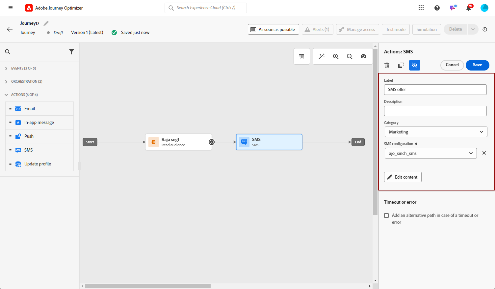
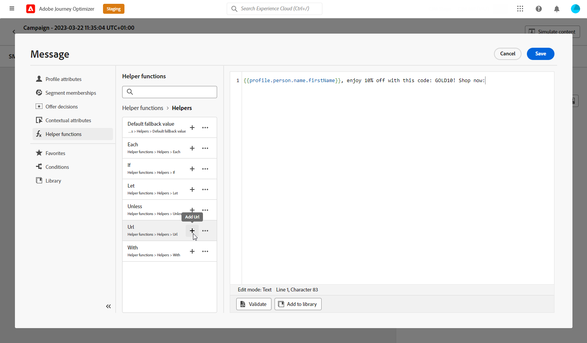
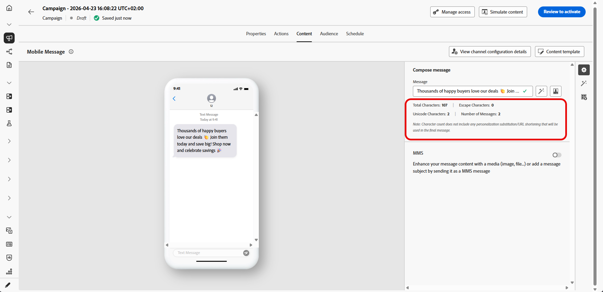
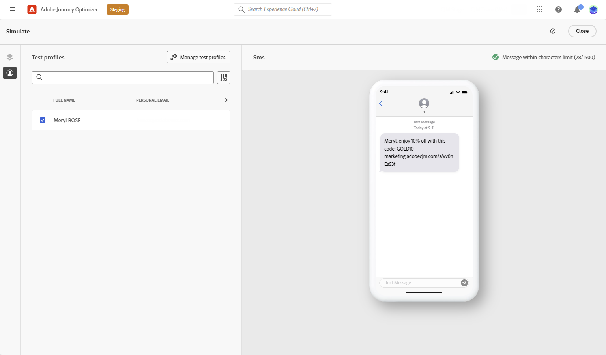

# Creare un messaggio SMS/MMS/RCS {#create-sms}

>[!CONTEXTUALHELP]
>id="ajo_message_sms"
>title="Creare un messaggio SMS"
>abstract="Per creare un messaggio di testo (SMS/MMS/RCS), aggiungi un’azione SMS in un percorso o in una campagna e inizia a personalizzarla con l’editor di personalizzazione."

>[!AVAILABILITY]
>
>RCS non è un servizio compatibile con HIPAA e non deve essere utilizzato per raccogliere, archiviare o elaborare dati personali sensibili, inclusi i dati sulla salute consentiti, ad esempio le informazioni personali sulla salute, che potrebbero essere altrimenti elaborati in Journey Optimizer.

Con Adobe Journey Optimizer è possibile progettare e inviare messaggi di testo (SMS), di comunicazione avanzata (RCS) e multimediali (MMS). Devi innanzitutto aggiungere un’azione SMS in un percorso o in una campagna e quindi definire il contenuto del messaggio di testo, come descritto di seguito. Adobe Journey Optimizer offre inoltre funzionalità per testare i messaggi di testo prima dell’invio, in modo da poter controllare il rendering, gli attributi di personalizzazione e tutte le altre impostazioni.

In conformità agli standard e alle normative del settore, tutti i messaggi SMS/MMS di marketing devono consentire ai destinatari di annullare facilmente l’iscrizione alla ricezione di messaggi. A questo scopo, i destinatari di SMS possono rispondere con parole chiave di consenso e rinuncia. [Scopri come gestire la rinuncia](../privacy/opt-out.md#opt-out-decision-management)

## Aggiungi un SMS {#create-sms-journey-campaign}

Sfoglia le schede seguenti per scoprire come aggiungere un messaggio di testo (SMS/MMS/RCS) in una campagna o in un percorso.

>[!BEGINTABS]

>[!TAB Aggiungi un SMS a un Percorso]

1. Apri il percorso, quindi trascina e rilascia un&#39;attività **[!UICONTROL Action]** dalla sezione **[!UICONTROL Actions]** della palette. Ulteriori informazioni sull&#39;[attività Azione](../building-journeys/journey-action.md).

   >[!IMPORTANT]
   >
   >Le attività dei canali nativi legacy (e-mail, push, SMS, in-app, web, esperienza basata su codice e scheda di contenuto) sono diventate obsolete a partire dalla versione di marzo 2026. I percorsi esistenti che utilizzano queste attività continuano a funzionare senza alcuna modifica e non è richiesta alcuna migrazione.

1. Seleziona **[!UICONTROL SMS]** come tipo di azione.

   

1. Immetti un **[!UICONTROL Label]** per identificare l&#39;azione nell&#39;area di lavoro del percorso.

1. Fai clic sul pulsante **[!UICONTROL Configura azione]**.

1. Sei indirizzato alla scheda **[!UICONTROL Azioni]**. Da lì, seleziona o crea la configurazione SMS da utilizzare. [Ulteriori informazioni](sms-configuration.md)

   

1. Inoltre, puoi applicare le regole di limitazione all&#39;azione SMS selezionando un set di regole nell&#39;elenco a discesa **[!UICONTROL Regole aziendali]**. [Ulteriori informazioni](../conflict-prioritization/channel-capping.md)

1. Seleziona il pulsante **[!UICONTROL Modifica contenuto]** e crea il contenuto come desiderato. [Ulteriori informazioni](#sms-content)

1. Torna all’area di lavoro del percorso. Se necessario, completa il flusso di percorso trascinando altre azioni o eventi. [Ulteriori informazioni](../building-journeys/about-journey-activities.md)

Per ulteriori informazioni su come creare, configurare e pubblicare un percorso, fare riferimento a [questa pagina](../building-journeys/journey-gs.md).

>[!TAB Aggiungere un SMS a una campagna]

1. Accedi al menu **[!UICONTROL Campagne]**, quindi fai clic su **[!UICONTROL Crea campagna]**.

1. Seleziona il tipo di campagna da eseguire

   * **Pianificato - Marketing**: esegui la campagna immediatamente o in una data specificata. Le campagne pianificate hanno lo scopo di inviare messaggi di marketing. Vengono configurati ed eseguiti dall’interfaccia utente di.

   * **Attivato da API - Marketing/Transazionale**: esegui la campagna utilizzando una chiamata API. Le campagne attivate da API hanno lo scopo di inviare messaggi di marketing o transazionali, ovvero messaggi inviati in seguito a un’azione eseguita da un individuo: reimpostazione della password, acquisto del carrello, ecc.

1. Dalla sezione **[!UICONTROL Proprietà]**, modifica il **[!UICONTROL Titolo]** e la **[!UICONTROL Descrizione]** della tua campagna.

1. Fai clic sul pulsante **[!UICONTROL Seleziona pubblico]** per definire il pubblico di destinazione dall&#39;elenco dei tipi di pubblico di Adobe Experience Platform disponibili. [Ulteriori informazioni](../audience/about-audiences.md).

1. Nel campo **[!UICONTROL Spazio dei nomi identità]**, scegli lo spazio dei nomi da utilizzare per identificare i singoli utenti del pubblico selezionato. [Ulteriori informazioni](../event/about-creating.md#select-the-namespace).

1. Nella sezione **[!UICONTROL Azioni]**, scegli **[!UICONTROL SMS]** e seleziona o crea una nuova configurazione.

   Ulteriori informazioni sulla configurazione SMS in [questa pagina](sms-configuration.md).

   

1. Fai clic su **[!UICONTROL Crea esperimento]** per iniziare a configurare l&#39;esperimento sui contenuti e creare trattamenti per misurarne le prestazioni e identificare l&#39;opzione migliore per il pubblico di destinazione. [Ulteriori informazioni](../content-management/content-experiment.md)

1. Nella sezione **[!UICONTROL Tracciamento azioni]**, specifica se desideri tenere traccia dei clic sui collegamenti nel messaggio SMS.

1. Le campagne sono progettate per essere eseguite in una data specifica o con una frequenza ricorrente. Scopri come configurare la **[!UICONTROL pianificazione]** della campagna in [questa sezione](../campaigns/campaign-schedule.md#action-campaign-schedule).

1. Dal menu **[!UICONTROL Trigger azione]**, scegli la **[!UICONTROL Frequenza]** del messaggio SMS:

   * Una volta
   * Giornaliera
   * Settimanale
   * Month

Puoi iniziare a progettare il contenuto del messaggio di testo dal pulsante **[!UICONTROL Modifica contenuto]**, come descritto di seguito.

Per ulteriori informazioni su come creare, configurare e attivare una campagna, consulta [questa pagina](../campaigns/get-started-with-campaigns.md).

>[!ENDTABS]

## Definire il contenuto SMS/RCS{#sms-content}

>[!CONTEXTUALHELP]
>id="ajo_message_sms_content"
>title="Definire il contenuto SMS"
>abstract="Personalizza i messaggi di testo (SMS/MMS/RCS) utilizzando l’editor di personalizzazione per definire il contenuto e incorporare elementi dinamici."


Per configurare il contenuto del messaggio, segui i passaggi indicati di seguito. Le impostazioni per MMS sono descritte in dettaglio in [questa sezione](#mms-content).

1. Dalla schermata di configurazione del percorso o della campagna, fai clic sul pulsante **[!UICONTROL Modifica contenuto]** per configurare il contenuto dell&#39;SMS.

1. Fai clic sul campo **[!UICONTROL Messaggio]** per aprire l&#39;editor di personalizzazione.

   Per la messaggistica RCS con Infobip, Twilio o altri provider di terze parti, incolla il payload JSON richiesto nella [configurazione SMS personalizzata](sms-configuration-custom.md#api-credential).

   

1. Genera messaggi di testo coinvolgenti personalizzati per il tuo pubblico utilizzando [Assistente IA per la generazione di testo](../content-management/generative-text.md).

1. Utilizza l’editor di personalizzazione per definire i contenuti, aggiungere personalizzazioni e contenuti dinamici. Puoi utilizzare qualsiasi attributo, ad esempio il nome del profilo o la città. È inoltre possibile definire regole condizionali. Per ulteriori informazioni sulla [personalizzazione](../personalization/personalize.md) e sul [contenuto dinamico](../personalization/get-started-dynamic-content.md) nell&#39;editor di personalizzazione, consulta le pagine seguenti.

1. Dopo aver definito il contenuto, puoi aggiungere URL tracciati al messaggio. A tale scopo, accedere al menu **[!UICONTROL Funzioni helper]** e selezionare **[!UICONTROL Helper]**.

   

1. Seleziona **[!UICONTROL URL]** e fai clic su **[!UICONTROL Aggiungi URL]**.

   

1. Per ridurre l&#39;URL, incollarlo nel campo `originalUrl` e fare clic su **[!UICONTROL Salva]**.

   >[!CAUTION]
   >
   >Per utilizzare la funzione di abbreviazione URL, devi prima configurare un sottodominio che verrà quindi collegato alla configurazione. [Ulteriori informazioni](sms-subdomains.md)
   >
   > La durata degli URL brevi è impostata su 30 giorni. Dopo questo periodo, questi URL brevi non saranno più accessibili e visualizzeranno il messaggio: `404 short-code not found`.

1. Per aggiungere un deep link che apre una schermata specifica nell&#39;app mobile, utilizza l&#39;helper URL con il tipo `DEEPLINK`. [Ulteriori informazioni sui deep link](../email/deeplinks.md)

   ```
   {{url originalUrl='<<deeplink_url>>' type='DEEPLINK' action='CLICK'}}
   ```

   >[!IMPORTANT]
   >
   >Prima di utilizzare il deep link, assicurati di aver completato i [passaggi di configurazione](../email/deeplinks.md#configuration) corrispondenti in Journey Optimizer e di aver implementato la [gestione del deeplink](../email/deeplinks.md#mobile-implementation) nella tua app mobile. Se non lo hai ancora fatto, il collegamento diretto non indirizzerà gli utenti al contenuto in-app desiderato.
   >
   >Inoltre, assicurati che il tracciamento dei collegamenti sia abilitato nella sezione **[!UICONTROL Azioni]** del percorso o della campagna in modo che l&#39;URL venga riscritto tramite i sistemi Adobe.

1. Utilizza **[!UICONTROL Numero di caratteri]** per monitorare la lunghezza degli SMS durante la composizione del messaggio. Si aggiorna in tempo reale e indica quando il contenuto verrà consegnato in più segmenti.

   

1. Fai clic su **[!UICONTROL Salva]** e verifica il messaggio nell’anteprima. Ora puoi testare e controllare il contenuto del messaggio come descritto in [questa sezione](#sms-mms-test).

## Personalizzare con le decisioni {#decisioning-sms}

Puoi personalizzare e ottimizzare il contenuto dei messaggi SMS con **Decisioning**. Questa funzionalità consente di utilizzare Punteggi di priorità, Formule o Modelli di intelligenza artificiale per selezionare e visualizzare in modo dinamico il contenuto migliore per i clienti.

Per ulteriori informazioni su come creare e utilizzare i criteri di decisione nei messaggi SMS, consulta [questa sezione](../experience-decisioning/create-decision.md).

## Definire il contenuto MMS{#mms-content}

È possibile migliorare la comunicazione inviando messaggi MMS (Multimedia Message Service), consentendo la condivisione di file multimediali quali video, immagini, clip audio e GIF e altro ancora. Inoltre, MMS consente di inserire nel messaggio fino a 1600 caratteri di testo.

>[!NOTE]
>
> Il canale MMS presenta alcune limitazioni elencate in [questa pagina](../start/guardrails.md#sms-guardrails).

Per creare contenuti MMS, effettua le seguenti operazioni:

1. Creare un SMS come descritto in [questa sezione](#create-sms-journey-campaign).

1. Modifica il contenuto SMS come descritto in [questa sezione](#sms-content).

1. Abilita l’opzione MMS per aggiungere contenuti multimediali al contenuto SMS.

   

1. Aggiungi **[!UICONTROL Titolo]** al file multimediale.

1. Immetti l&#39;URL del file multimediale nel campo **[!UICONTROL File multimediali]**.

   

1. Fai clic su **[!UICONTROL Salva]** e verifica il messaggio nell’anteprima. Ora puoi testare e verificare il contenuto del messaggio come descritto di seguito.

## Testare e inviare i messaggi {#sms-mms-test}

Utilizza il pulsante **[!UICONTROL Simula contenuto]** per visualizzare in anteprima il contenuto dei messaggi di testo, gli URL abbreviati e il contenuto personalizzato.



Dopo aver eseguito i test e convalidato il contenuto, puoi inviare il messaggio di testo al pubblico. Questi passaggi sono descritti in [questa pagina](send-sms.md)

Una volta inviato, puoi misurare l’impatto del tuo SMS all’interno dei rapporti della campagna o del Percorso. Per ulteriori informazioni sul reporting, consulta [questa sezione](../reports/campaign-global-report-cja-sms.md).

**Argomenti correlati**

* [Anteprima, verifica e invio del messaggio di testo](send-sms.md)
* [Configurare il canale SMS](sms-configuration.md)
* [Rapporti SMS/MMS](../reports/journey-global-report-cja-sms.md)
* [Aggiungere un messaggio in un percorso](../building-journeys/journey-action.md)
* [Aggiungere un messaggio in una campagna](../campaigns/create-campaign.md)
