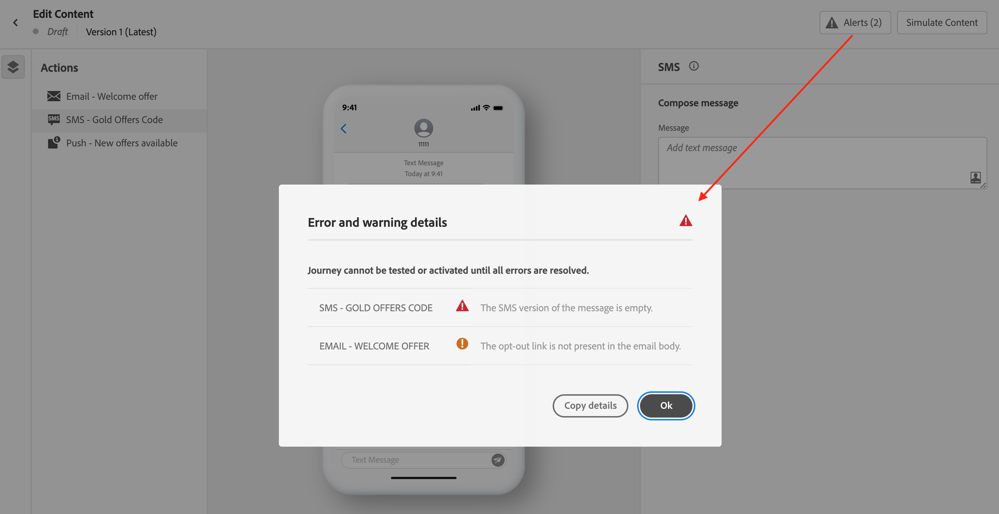

# Invia il messaggio SMS {#send-sms}

## Anteprima del messaggio SMS {#preview-sms}

Una volta definito il contenuto del messaggio, puoi utilizzare i profili di test per visualizzarlo in anteprima e testarlo. Se hai inserito contenuto personalizzato, puoi controllare come questo contenuto viene visualizzato nel messaggio, sfruttando i dati del profilo di test.

1. Fai clic su **[!UICONTROL Simulazione del contenuto]**.

1. Fai clic su **[!UICONTROL Gestire i profili di test]** per aggiungere un profilo di test.

1. Trova il tuo profilo di test con **[!UICONTROL Spazio dei nomi identità]** e **[!UICONTROL Valore identità]** campi. Quindi, fai clic su **[!UICONTROL Aggiungi profilo]**.

   

1. Dopo aver selezionato il profilo di test, puoi chiudere la **[!UICONTROL Aggiungi profilo di test]** finestra.

   

1. Dalla finestra Anteprima e test, i dati del profilo di test vengono utilizzati nel contenuto del messaggio.

   Ad esempio, per questo messaggio SMS, sia il contenuto del messaggio sia personalizzato:

   

## Convalidare l’SMS{#sms-preview}

>[!NOTE]
>
> Per una migliore consegna, è sempre necessario utilizzare i numeri di telefono nei formati supportati dal provider. Ad esempio, Twilio e Sinch supportano solo i numeri di telefono in formato E.164.

È inoltre necessario controllare gli avvisi nella sezione superiore dell’editor.  Alcuni sono semplici avvisi, altri possono impedire l’utilizzo del messaggio. Possono verificarsi due tipi di avvisi:

* **Avvisi** consulta consigli e best practice. Ad esempio, se il messaggio SMS è vuoto, viene visualizzato un messaggio.

* **Errori** impedisce di testare o attivare il percorso purché non siano risolti. Ad esempio, un messaggio ti avviserà che manca l’oggetto.

Quando il messaggio SMS è pronto, completa la configurazione della [percorso](../building-journeys/journey-gs.md) o [campagna](../campaigns/create-campaign.md) per inviarlo.

**Argomenti correlati**

* [Configurare il canale SMS](sms-configuration.md)
* [Rapporto SMS](../reports/journey-global-report.md#sms-global)
* [Creare un messaggio SMS](create-sms.md)
* [Aggiungere un messaggio in un percorso](../building-journeys/journeys-message.md)
