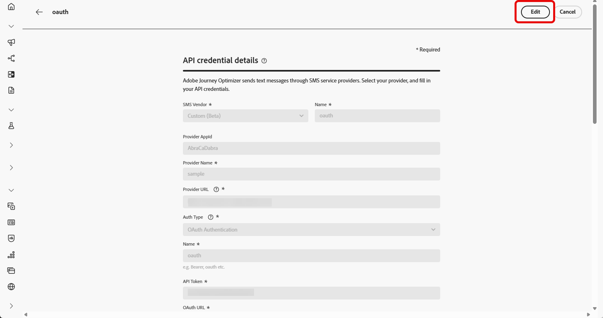

# Configurare un provider personalizzato {#sms-configuration-custom}

>[!CONTEXTUALHELP]
>id="ajo_admin_sms_api_byop_provider_url"
>title="URL del provider"
>abstract="Specifica l’URL dell’API esterna a cui intendi connetterti. Questo URL funge da endpoint per accedere alle funzioni e alle funzionalità dell’API."

>[!CONTEXTUALHELP]
>id="ajo_admin_sms_api_byop_header_parameters"
>title="Parametri per intestazione"
>abstract="Specifica l’etichetta, il tipo e il valore delle intestazioni aggiuntive per consentire la corretta autenticazione, la formattazione del contenuto e una comunicazione API efficace. "

>[!CONTEXTUALHELP]
>id="ajo_admin_sms_api_byop_provider_payload"
>title="Payload del provider"
>abstract="Fornisci il payload richiesto per garantire che vengano inviati i dati corretti per l’elaborazione e la generazione di risposte."

Questa funzione consente di integrare e configurare i provider di messaggistica, offrendo flessibilità oltre le opzioni predefinite (Sinch, Twilio e Infobip). Questo consente di gestire in modo semplice l’authoring, la consegna, il reporting e il consenso sia per i messaggi SMS che per quelli RCS.

Con la configurazione del provider personalizzato, puoi collegare servizi di messaggistica di terze parti direttamente in Journey Optimizer, personalizzare i payload dei messaggi per il contenuto dinamico e gestire le preferenze di consenso/rinuncia per garantire la conformità sia sui canali SMS che RCS.

Per configurare il provider personalizzato, effettua le seguenti operazioni:

1. [Crea credenziali API](#api-credential)
1. [Creare webhook](#webhook)
1. [Crea configurazione canale](sms-configuration-surface.md)
1. [Creare un Percorso o una campagna con un’azione del canale SMS](create-sms.md)

## Creare le credenziali API {#api-credential}

Per inviare messaggi SMS e RCS in Journey Optimizer utilizzando un provider personalizzato non disponibile da Adobe (ad esempio Sinch, Infobip, Twilio), procedi come segue:

1. Nella barra a sinistra, passa a **[!UICONTROL Amministrazione]** `>` **[!UICONTROL Canali]**, seleziona il menu **[!UICONTROL Credenziali API]** in **[!UICONTROL Impostazioni SMS]** e fai clic sul pulsante **[!UICONTROL Crea nuove credenziali API]**.

   

1. Configura le credenziali API SMS, come descritto di seguito:

   * **[!UICONTROL Fornitore SMS]**: personalizzato.

   * **[!UICONTROL Nome]**: immetti un nome per le credenziali API.

   * **[!UICONTROL Provider AppId]**: immetti l&#39;ID applicazione fornito dal provider SMS.

   * **[!UICONTROL Nome provider]**: immetti il nome del provider SMS.

   * **[!UICONTROL URL provider]**: immetti l&#39;URL del provider SMS.

   * **[!UICONTROL Tipo di autenticazione&#x200B;]**: seleziona il tipo di autorizzazione e [completa i campi corrispondenti](#auth-options) in base al metodo di autenticazione scelto.

     

1. Abilitare l&#39;opzione **[!UICONTROL supporto mTLS]**, che garantisce che il client e il server si autentichino a vicenda prima di stabilire una connessione sicura.

   Per utilizzare solo mTLS, selezionare **[!UICONTROL Nessuna autenticazione]** dal menu a discesa **[!UICONTROL Tipo di autenticazione]**, quindi abilitare il supporto **[!UICONTROL mTLS]**.

1. Nella sezione **[!UICONTROL Intestazioni]**, fai clic su **[!UICONTROL Aggiungi nuovo parametro]** per specificare le intestazioni HTTP per il messaggio di richiesta che verrà inviato al servizio esterno.

   I campi di intestazione **Content-Type** e **Charset** sono impostati per impostazione predefinita e non possono essere eliminati.

   

1. Aggiungi il **[!UICONTROL Payload provider]** per convalidare e personalizzare i payload della richiesta.

   Per i messaggi RCS, questo payload viene utilizzato successivamente durante la [progettazione del contenuto](create-sms.md#sms-content).

   >[!NOTE]
   >
   >Durante la configurazione di un provider SMS personalizzato con autenticazione di base o Bearer, è necessario includere il parametro `authOption` nel payload JSON. Inoltre, il payload **Provider** deve fare riferimento alle variabili di modello `{{fromNumber}}`, `{{toNumber}}` e `{{message}}`.

1. Fai clic su **[!UICONTROL Invia]** al termine della configurazione delle credenziali API.

1. Nel menu **[!UICONTROL Credenziali API]**, fai clic sull&#39;icona  per eliminare le credenziali API.

   

1. Per modificare le credenziali esistenti, individuare le credenziali API desiderate e fare clic sull&#39;opzione **[!UICONTROL Modifica]** per apportare le modifiche necessarie.

   

1. Fai clic su **[!UICONTROL Verifica connessione SMS]**, dalle credenziali API esistenti, per verificare le credenziali API SMS inviando un messaggio di esempio a un dispositivo designato.

1. Compila i campi **Numero** e **Messaggio** e fai clic su **[!UICONTROL Verifica connessione]**.

   >[!IMPORTANT]
   >
   >Il messaggio deve essere strutturato in modo da essere allineato al formato di payload del provider.

   

Dopo aver creato e configurato le credenziali API, devi ora impostare [le impostazioni in entrata per il webhook](#webhook) per i messaggi SMS.

### Opzioni di autenticazione per i provider SMS personalizzati {#auth-options}

>[!CONTEXTUALHELP]
>id="ajo_admin_sms_api_byop_auth_type"
>title="Tipo di autenticazione"
>abstract="Specifica il metodo di autenticazione necessario per accedere all’API; in questo modo viene garantita una comunicazione sicura e autorizzata con il servizio esterno."

>[!BEGINTABS]

>[!TAB Chiave API]

Una volta create le credenziali API, completa i campi necessari per l’autenticazione della chiave API:

* **[!UICONTROL Nome]**&#x200B;: immetti un nome per la configurazione della chiave API.
* **[!UICONTROL Token API]**&#x200B;: immetti il token API fornito dal provider SMS.

>[!TAB Autenticazione MAC]

Una volta create le credenziali API, completa i campi richiesti per l’autenticazione MAC:

* **[!UICONTROL Nome]**&#x200B;: immetti un nome per la configurazione dell&#39;autenticazione MAC.
* **[!UICONTROL Token API]**&#x200B;: immetti il token API fornito dal provider SMS.
* **[!UICONTROL Chiave segreta API]**: immetti la chiave segreta API fornita dal provider SMS. Questa chiave viene utilizzata per generare il MAC (Message Authentication Code) per le comunicazioni protette.
* **[!UICONTROL Formato hash di autorizzazione Mac]**: scegliere il formato hash per l&#39;autenticazione MAC.

>[!TAB Autenticazione OAuth]

Una volta create le credenziali API, completa i campi necessari per l’autenticazione OAuth:

* **[!UICONTROL Nome]**&#x200B;: immetti un nome per la configurazione dell&#39;autenticazione OAuth.

* **[!UICONTROL Token API]**&#x200B;: immetti il token API fornito dal provider SMS.

* **[!UICONTROL URL OAuth]**&#x200B;: immetti l&#39;URL per ottenere il token OAuth.

* **[!UICONTROL Corpo OAuth]**&#x200B;: fornisci il corpo della richiesta OAuth in formato JSON, inclusi parametri come `grant_type`, `client_id` e `client_secret`.

>[!TAB Autenticazione JWT]

Una volta create le credenziali API, completa i campi richiesti per l’autenticazione JWT:

* **[!UICONTROL Nome]**&#x200B;: immetti un nome per la configurazione dell&#39;autenticazione JWT.

* **[!UICONTROL Token API]**&#x200B;: immetti il token API fornito dal provider SMS.

* **[!UICONTROL Payload JWT]**&#x200B;: inserisci il payload JSON contenente le attestazioni richieste per JWT, ad esempio emittente, oggetto, pubblico e scadenza.

>[!ENDTABS]

## Creare webhook {#webhook}

>[!BEGINSHADEBOX]

Se non vengono fornite parole chiave di consenso o rinuncia, vengono utilizzati messaggi di consenso standard per rispettare la privacy dell’utente. L&#39;aggiunta di parole chiave personalizzate sostituisce automaticamente le impostazioni predefinite.

**Parole chiave predefinite:**

* **Consenso**: SOTTOSCRIVI, SÌ, RIPRENDI, AVVIA, CONTINUA, RIPRENDI, INIZIA
* **Rinuncia**: INTERROMPI, ESCI, ANNULLA, TERMINA, ANNULLA ISCRIZIONE, NO
* **Guida**: GUIDA

>[!ENDSHADEBOX]

Una volta create correttamente le credenziali API, ora puoi configurare i webhook per acquisire le risposte in entrata e gestire il consenso di consenso e rinuncia e per ricevere i rapporti di consegna, comprese le conferme di lettura, se disponibili.

Durante la configurazione di un webhook, puoi definirne lo scopo in base al tipo di dati che desideri acquisire:

* **[!UICONTROL In entrata]**: utilizza questa opzione se desideri acquisire le risposte al consenso, come i consensi o le rinunce, e raccogliere le preferenze dell&#39;utente.

* **[!UICONTROL Feedback]**: scegli questa opzione per tenere traccia degli eventi di consegna e coinvolgimento, incluse le conferme di lettura e le interazioni degli utenti, per supportare la generazione di rapporti e l&#39;analisi.

>[!BEGINTABS]

>[!TAB In entrata]

1. Nella barra a sinistra, passa a **[!UICONTROL Amministrazione]** `>` **[!UICONTROL Canali]**, seleziona il menu **[!UICONTROL Webhook SMS]** in **[!UICONTROL Impostazioni SMS]** e fai clic sul pulsante **[!UICONTROL Crea webhook]**.

   

1. Configura le impostazioni del webhook come descritto di seguito:

   * **[!UICONTROL Name]**: immetti un nome per il webhook.

   * **[!UICONTROL Seleziona fornitore SMS]**: personalizzato.

   * **[!UICONTROL Tipo]**: in entrata.

   * **[!UICONTROL Credenziali API]**: scegli dall&#39;elenco a discesa [le credenziali API configurate in precedenza](#api-credential).

   * **[!UICONTROL Numero di telefono del mittente &#x200B;]**: immettere il numero di telefono del mittente &#x200B;che si desidera utilizzare per le comunicazioni.

     

1. Fai clic su  per aggiungere le categorie delle parole chiave, quindi configurale come segue:

   * **[!UICONTROL Categoria di parole chiave in entrata]**: scegli le categorie di parole chiave **[!UICONTROL Opt-in]**, **[!UICONTROL Opt-out]**, **[!UICONTROL Guida]** o **[!UICONTROL Predefinito]**.

   * **[!UICONTROL Inserisci una parola chiave]**: immetti le parole chiave predefinite o personalizzate che attiveranno automaticamente il messaggio. Fare clic su  per aggiungere più parole chiave.

   * **[!UICONTROL Messaggio di risposta]**: seleziona dall&#39;elenco a discesa la risposta personalizzata inviata automaticamente.

   

1. Fai clic su **[!UICONTROL Visualizza editor payload]** per convalidare e personalizzare i payload della richiesta.

   Puoi personalizzare dinamicamente il payload utilizzando gli attributi del profilo e garantire che vengano inviati dati accurati per l’elaborazione e la generazione di risposte con l’aiuto di funzioni di assistenza integrate.

1. Fai clic su **[!UICONTROL Invia]** al termine della configurazione del webhook.

1. Nel menu **[!UICONTROL Webhook]**, fai clic sull&#39;icona  per eliminare il tuo webhook.

1. Per modificare la configurazione esistente, individuare il webhook desiderato e fare clic sull&#39;opzione **[!UICONTROL Modifica]** per apportare le modifiche necessarie.

1. Accedi e copia il nuovo **[!UICONTROL URL webhook]** dal **[!UICONTROL webhook]** inviato in precedenza.

   

Dopo aver creato e configurato le impostazioni in entrata per il webhook, è ora necessario creare una [configurazione del canale](sms-configuration-surface.md) per i messaggi SMS.

Una volta configurata, puoi sfruttare tutte le funzionalità di canale predefinite, come l’authoring dei messaggi, la personalizzazione, il tracciamento dei collegamenti e il reporting.

>[!TAB Feedback]

1. Nella barra a sinistra, passa a **[!UICONTROL Amministrazione]** `>` **[!UICONTROL Canali]**, seleziona il menu **[!UICONTROL Webhook SMS]** in **[!UICONTROL Impostazioni SMS]** e fai clic sul pulsante **[!UICONTROL Crea webhook]**.

   

1. Configura le impostazioni del webhook come descritto di seguito:

   * **[!UICONTROL Name]**: immetti un nome per il webhook.

   * **[!UICONTROL Seleziona fornitore SMS]**: personalizzato.

   * **[!UICONTROL Tipo]**: feedback.

   

1. Fai clic su **[!UICONTROL Visualizza editor payload]** per convalidare e personalizzare i payload della richiesta.

   Puoi personalizzare dinamicamente il payload utilizzando gli attributi del profilo e garantire che vengano inviati dati accurati per l’elaborazione e la generazione di risposte con l’aiuto di funzioni di assistenza integrate.

1. Fai clic su **[!UICONTROL Invia]** al termine della configurazione del webhook.

1. Nel menu **[!UICONTROL Webhook]**, fai clic sull&#39;icona  per eliminare il tuo webhook.

1. Per modificare la configurazione esistente, individuare il webhook desiderato e fare clic sull&#39;opzione **[!UICONTROL Modifica]** per apportare le modifiche necessarie.

1. Accedi e copia il nuovo **[!UICONTROL URL webhook]** dal **[!UICONTROL webhook]** inviato in precedenza.

   

Dopo aver creato e configurato le impostazioni in entrata per il webhook, è ora necessario creare una [configurazione del canale](sms-configuration-surface.md) per i messaggi SMS.

Una volta configurata, puoi sfruttare tutte le funzionalità di canale predefinite, come l’authoring dei messaggi, la personalizzazione, il tracciamento dei collegamenti e il reporting.

>[!ENDTABS]

## Video dimostrativo {#video}

>[!VIDEO](https://video.tv.adobe.com/v/3431625)

