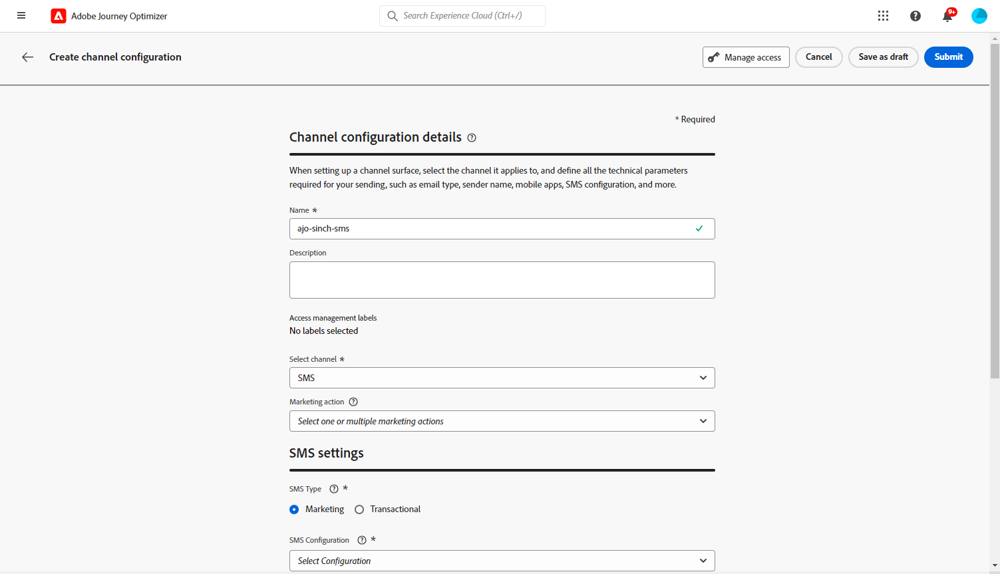

# Configurare il canale SMS {#sms-configuration}

Prima di inviare SMS, devi configurare l’ambiente Adobe Journey Optimizer. Per eseguire questa operazione:

* [Integrare le impostazioni del provider](#create-api) con Journey Optimizer
* [Creare una superficie SMS](#message-preset-sms) (ossia predefinito SMS)

Questi passaggi devono essere eseguiti da un Adobe Journey Optimizer [Amministratore di sistema](../start/path/administrator.md).

## Prerequisiti{#sms-prerequisites}

Adobe Journey Optimizer attualmente si integra con provider di terze parti che offrono servizi di messaggistica di testo indipendenti da Adobe Journey Optimizer. I provider supportati per i messaggi di testo sono: **Sinch**, **Twilio** e **Infobip**.

Prima di configurare il canale SMS, è necessario creare un account con uno di questi provider per ottenere il **Token API** e **ID servizio**, che è necessario configurare la connessione tra Adobe Journey Optimizer e il provider applicabile.

L’utilizzo dei servizi di messaggistica di testo è soggetto a termini e condizioni aggiuntivi da parte del provider applicabile. In qualità di soluzioni di terze parti, Sinch, Twilio e Infobip sono disponibili per gli utenti di Adobe Journey Optimizer tramite un’integrazione. Adobe non controlla e non è responsabile per i prodotti di terze parti. Per qualsiasi problema o richiesta di assistenza relativa ai servizi di SMS, contatta il provider di servizi.

>[!CAUTION]
>
>Per accedere e modificare i sottodomini SMS, devi disporre del **[!UICONTROL Gestire i sottodomini SMS]** autorizzazione per la sandbox di produzione. Ulteriori informazioni sulle autorizzazioni in [questa pagina](../administration/high-low-permissions.md#administration-permissions).
>

## Creare nuove credenziali API {#create-api}

>[!CONTEXTUALHELP]
>id="ajo_admin_sms_api_header"
>title="Configurare il fornitore di SMS con Journey Optimizer"
>abstract="Adobe Journey Optimizer invia messaggi di testo tramite fornitori di servizi SMS. Seleziona il fornitore e compila le credenziali API."

>[!CONTEXTUALHELP]
>id="ajo_admin_mms_api_header"
>title="Configurare il fornitore di MMS con Journey Optimizer"
>abstract="Adobe Journey Optimizer invia contenuti multimediali tramite fornitori di servizi MMS. Seleziona il fornitore e compila le credenziali API."

>[!CONTEXTUALHELP]
>id="ajo_admin_sms_api"
>title="Configurare il fornitore di SMS con Journey Optimizer"
>abstract="Prima di inviare messaggi di testo, è necessario integrare le impostazioni del provider con Journey Optimizer. Al termine, devi creare una superficie SMS. Questi passaggi devono essere eseguiti da un amministratore di sistema di Adobe Journey Optimizer."
>additional-url="https://experienceleague.adobe.com/docs/journey-optimizer/using/sms/sms-configuration.html?lang=it#message-preset-sms" text="Creare una superficie del canale SMS"

>[!CONTEXTUALHELP]
>id="ajo_admin_sms_configuration"
>title="Selezionare la configurazione del fornitore di SMS"
>abstract="Seleziona le credenziali API configurate per il fornitore di SMS."

### Sinch {#sinch-api}

Per configurare Sinch con Journey Optimizer, effettua le seguenti operazioni:

1. Nella barra a sinistra, passa a **[!UICONTROL Amministrazione]** > **[!UICONTROL Canali]** e seleziona la **[!UICONTROL Credenziali API]** menu. Fai clic su **[!UICONTROL Crea nuove credenziali API]** pulsante.

   

1. Configura le credenziali API SMS, come descritto di seguito:

   * **[!UICONTROL Nome]**: scegli un nome per le credenziali API.

   * **[!UICONTROL ID servizio]** e **[!UICONTROL Token API]**: accedi alla pagina API, e trovi le tue credenziali nella scheda SMS. Ulteriori informazioni in [Documentazione di Sinch](https://developers.sinch.com/docs/sms/getting-started/){target="_blank"}.

   * **[!UICONTROL Parole chiave di Opt-in]**: immetti le parole chiave predefinite o personalizzate che attiveranno automaticamente il **[!UICONTROL Messaggio di Opt-in]**. Per più parole chiave, utilizza valori separati da virgola.

   * **[!UICONTROL Messaggio di Opt-in]**: inserisci la risposta personalizzata inviata automaticamente come **[!UICONTROL Messaggio di Opt-in]**.

   * **[!UICONTROL Parole chiave di rinuncia]**: immetti le parole chiave predefinite o personalizzate che attiveranno automaticamente il **[!UICONTROL Messaggio di rinuncia]**. Per più parole chiave, utilizza valori separati da virgola.

   * **[!UICONTROL Messaggio di rinuncia]**: inserisci la risposta personalizzata inviata automaticamente come **[!UICONTROL Messaggio di rinuncia]**.

   * **[!UICONTROL Parole chiave della Guida]**: immetti le parole chiave predefinite o personalizzate che attiveranno automaticamente il **Messaggio di aiuto**. Per più parole chiave, utilizza valori separati da virgola.

   * **[!UICONTROL Messaggio di aiuto]**: inserisci la risposta personalizzata inviata automaticamente come **Messaggio di aiuto**.

   * **[!UICONTROL Parole chiave per doppio consenso]**: immetti le parole chiave che attivano il processo di doppio consenso. Se un profilo utente non esiste, viene creato a conferma avvenuta correttamente. Per più parole chiave, utilizza valori separati da virgola. [Ulteriori informazioni sul doppio consenso SMS](https://video.tv.adobe.com/v/3427129/?learn=on).

   * **[!UICONTROL Doppio messaggio di consenso]**: inserisci la risposta personalizzata inviata automaticamente in risposta alla conferma del doppio consenso.

1. Clic **[!UICONTROL Invia]** al termine della configurazione delle credenziali API.

Dopo aver creato e configurato le credenziali API, ora è necessario creare una superficie di canale (ossia un predefinito per messaggi) per i messaggi SMS.

<!--
### Sinch MMS

For **[!DNL Sinch MMS]**

        * **[!UICONTROL Name]**: choose a name for your API Credential.

        * **[!UICONTROL Project ID]**, **[!UICONTROL App ID]** and **[!UICONTROL API Token]**: from the Conversation API menu, you can find your credentials in the App menu. Learn more in [Sinch Documentation](https://docs.cc.sinch.com/cloud/service-configuration/en/oxy_ex-1/common/wln1620131604643.html){target="_blank"}.
-->

### Twilio {#twilio-api}

Per configurare Twilio con Journey Optimizer, effettua le seguenti operazioni:

1. Nella barra a sinistra, passa a **[!UICONTROL Amministrazione]** > **[!UICONTROL Canali]** e seleziona la **[!UICONTROL Credenziali API]** menu. Fai clic su **[!UICONTROL Crea nuove credenziali API]** pulsante.

   

1. Configura le credenziali API SMS, come descritto di seguito:

   * **[!UICONTROL Nome]**: scegli un nome per le credenziali API.

   * **[!UICONTROL SID account]** e **[!UICONTROL Token di autenticazione]**: accedi a **Informazioni account** per trovare le credenziali.

   * **[!UICONTROL SID messaggio]**: inserisci l’identificatore univoco assegnato a ogni messaggio creato dall’API di Twilio. Ulteriori informazioni in [Documentazione di Twilio](https://support.twilio.com/hc/en-us/articles/223134387-What-is-a-Message-SID-){target="_blank"}.

1. Clic **[!UICONTROL Invia]** al termine della configurazione delle credenziali API.

Dopo aver creato e configurato le credenziali API, ora è necessario creare una superficie di canale (ossia un predefinito per messaggi) per i messaggi SMS.

### Infobip {#infobip-api}

Per configurare Infobip con Journey Optimizer, eseguire la procedura seguente:

1. Nella barra a sinistra, passa a **[!UICONTROL Amministrazione]** > **[!UICONTROL Canali]** e seleziona la **[!UICONTROL Credenziali API]** menu. Fai clic su **[!UICONTROL Crea nuove credenziali API]** pulsante.

   

1. Configura le credenziali API SMS, come descritto di seguito.

   * **[!UICONTROL Nome]**: scegli un nome per le credenziali API.

   * **[!UICONTROL URL di base API]** e **[!UICONTROL Chiave API]**: accedi alla pagina home dell’interfaccia web o alla pagina gestione delle chiavi API per trovare le tue credenziali. Ulteriori informazioni in [Documentazione di Infobip](https://www.infobip.com/docs/api){target="_blank"}.

   * **[!UICONTROL Parole chiave di Opt-in]**: immetti le parole chiave predefinite o personalizzate che attiveranno automaticamente il **[!UICONTROL Messaggio di Opt-in]**. Per più parole chiave, utilizza valori separati da virgola.

   * **[!UICONTROL Messaggio di Opt-in]**: inserisci la risposta personalizzata inviata automaticamente come **[!UICONTROL Messaggio di Opt-in]**.

   * **[!UICONTROL Parole chiave di rinuncia]**: immetti il valore predefinito o le parole chiave che attiveranno automaticamente il **[!UICONTROL Messaggio di rinuncia]**. Per più parole chiave, utilizza valori separati da virgola.

   * **[!UICONTROL Messaggio di rinuncia]**: inserisci la risposta personalizzata inviata automaticamente come **[!UICONTROL Messaggio di rinuncia]**.

   * **[!UICONTROL Parole chiave della Guida]**: immetti le parole chiave predefinite o personalizzate che attiveranno automaticamente il **Messaggio di aiuto**. Per più parole chiave, utilizza valori separati da virgola.

   * **[!UICONTROL Messaggio di aiuto]**: inserisci la risposta personalizzata inviata automaticamente come **Messaggio di aiuto**.

   * **[!UICONTROL Parole chiave per doppio consenso]**: immetti le parole chiave che attivano il processo di doppio consenso. Se un profilo utente non esiste, viene creato a conferma avvenuta correttamente. Per più parole chiave, utilizza valori separati da virgola.

   * **[!UICONTROL Doppio messaggio di consenso]**: inserisci la risposta personalizzata che viene inviata automaticamente in risposta alla conferma del doppio consenso.

   * **[!UICONTROL ID entità principale]**: inserisci l&#39;ID entità principale DLT assegnato.

   * **[!UICONTROL ID modello contenuto]**: immetti l&#39;ID del modello di contenuto DLT registrato.

   * **[!UICONTROL Periodo di validità]**: inserisci il periodo di validità del messaggio in ore. Nel caso in cui i messaggi non possano essere consegnati entro questo intervallo di tempo, il sistema effettuerà ulteriori tentativi per inviarli nuovamente. Il periodo di validità predefinito è impostato su 48 ore.

   * **[!UICONTROL Dati callback]**: inserisci i dati client aggiuntivi che verranno inviati sull’URL di notifica.

1. Clic **[!UICONTROL Invia]** al termine della configurazione delle credenziali API.

Dopo aver creato e configurato le credenziali API, ora è necessario creare una superficie di canale (ossia un predefinito per messaggi) per i messaggi SMS.

## Creare una superficie SMS {#message-preset-sms}

>[!CONTEXTUALHELP]
>id="ajo_admin_surface_sms_type"
>title="Definire la categoria di messaggio"
>abstract="Seleziona il tipo di messaggi utilizzando questa superficie: Marketing per messaggi promozionali, che richiedono il consenso dell’utente; oppure Transazionale per messaggi non commerciali, come la reimpostazione della password."
>additional-url="https://experienceleague.adobe.com/docs/journey-optimizer/using/privacy/consent/opt-out.html?lang=it#sms-opt-out-management" text="Rinuncia nei messaggi di testo di marketing"

Una volta configurato il canale SMS, è necessario creare una superficie di canale per poter inviare messaggi SMS da **[!DNL Journey Optimizer]**.

Per creare una superficie di canale, effettuate le seguenti operazioni:

1. Nella barra a sinistra, passa a **[!UICONTROL Amministrazione]** > **[!UICONTROL Canali]** e seleziona **[!UICONTROL Marchio]** > **[!UICONTROL Superfici di canale]**. Fai clic su **[!UICONTROL Crea superficie di canale]** pulsante.

   

1. Immetti un nome e una descrizione (facoltativa) per la superficie, quindi seleziona il canale SMS.

   

   >[!NOTE]
   >
   > I nomi devono iniziare con una lettera (A-Z). Può contenere solo caratteri alfanumerici. È inoltre possibile utilizzare il carattere di sottolineatura `_`, punto`.` e trattino `-` caratteri.

1. Definisci il **Impostazioni SMS**.

   

   Per iniziare, seleziona la **[!UICONTROL Tipo di SMS]** che verrà inviato con la superficie: **[!UICONTROL Transazionale]** o **[!UICONTROL Marketing]**.

   * Scegli **Marketing** messaggi di testo promozionali: questi messaggi richiedono il consenso dell’utente.
   * Scegli **Transazionale** per messaggi non commerciali come ad esempio la conferma di un ordine, le notifiche di reimpostazione della password o le informazioni di consegna.

   Quando crei un messaggio SMS, devi scegliere una superficie di canale valida che corrisponda alla categoria selezionata per il messaggio.

   >[!CAUTION]
   >
   >**Transazionale** è possibile inviare messaggi ai profili che hanno annullato l’abbonamento alle comunicazioni di marketing. Questi messaggi possono essere inviati solo in contesti specifici.

1. Seleziona la **[!UICONTROL Configurazione SMS]** per associarlo alla superficie.

   Per ulteriori informazioni su come configurare l’ambiente per l’invio di messaggi SMS, consulta [questa sezione](#create-api).

1. Inserisci il **[!UICONTROL Numero mittente]** &#x200B;si desidera utilizzare per le comunicazioni.

1. Seleziona il **[!UICONTROL Campo di esecuzione SMS]** per selezionare **[!UICONTROL Attributo profilo]** associati ai numeri di telefono dei profili.

1. Se desideri utilizzare la funzione di abbreviazione URL nei messaggi SMS, seleziona un elemento da **[!UICONTROL Sottodominio]** elenco.

   >[!NOTE]
   >
   >Per poter selezionare un sottodominio, accertati di aver configurato in precedenza almeno un sottodominio SMS. [Scopri come](sms-subdomains.md)

1. Inserisci il **[!UICONTROL Numero di rinuncia]** si desidera utilizzare per questa superficie. Quando i profili rinunciano a questo numero, puoi comunque inviare loro messaggi da altri numeri con cui stai utilizzando l’invio di messaggi di testo [!DNL Journey Optimizer].

   >[!NOTE]
   >
   >In entrata [!DNL Journey Optimizer], la rinuncia ai messaggi di testo non viene più gestita a livello di canale. Ora è specifico per un numero.

1. Una volta configurati tutti i parametri, fai clic su **[!UICONTROL Invia]** per confermare. Potete anche salvare la superficie di canale come sformo e riprenderne la configurazione in un secondo momento.

   

1. Una volta creata la superficie di canale, questa viene visualizzata nell’elenco con **[!UICONTROL Elaborazione]** stato.

   >[!NOTE]
   >
   >Se i controlli non hanno esito positivo, ulteriori informazioni sui possibili motivi dell’errore in [questa sezione](#monitor-channel-surfaces).

1. Quando i controlli hanno esito positivo, la superficie di canale riceve **[!UICONTROL Attivo]** stato. È pronto per essere utilizzato per inviare messaggi.

   

È ora possibile inviare messaggi di testo con Journey Optimizer.

**Argomenti correlati**

* [Creare un messaggio SMS](create-sms.md)
* [Aggiungere un messaggio in un percorso](../building-journeys/journeys-message.md)
* [Aggiungere un messaggio in una campagna](../campaigns/create-campaign.md)

