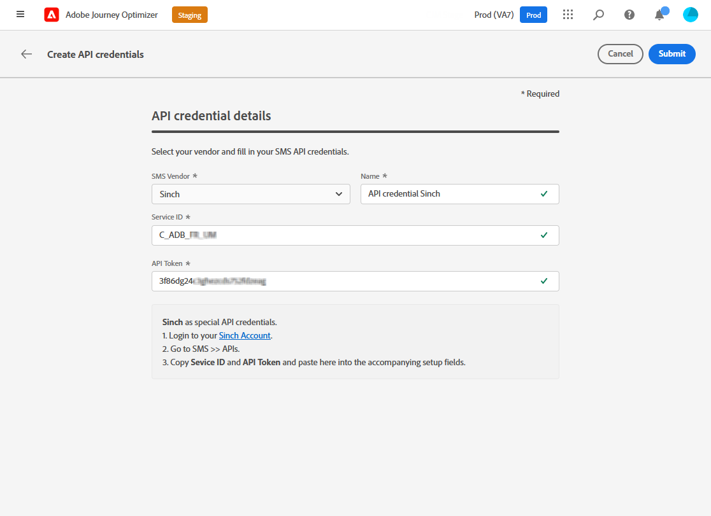

# Configurare il canale SMS {#sms-configuration}

[!DNL Journey Optimizer] consente di creare percorsi e inviare messaggi a un pubblico mirato.

Prima di inviare SMS, configura l’istanza. È necessario [integrare le impostazioni del provider](#create-api) con Journey Optimizer e [creare una superficie SMS](#message-preset-sms) (ossia predefinito SMS). Questi passaggi devono essere eseguiti da un [amministratore di sistema di Adobe Journey Optimizer](../start/path/administrator.md).

## Prerequisiti{#sms-prerequisites}

Adobe Journey Optimizer attualmente si integra con provider di terze parti come Sinch, Twilio e Infobip, che offrono servizi SMS indipendenti da Adobe Journey Optimizer.

Prima di configurare un SMS, è necessario creare un account con uno di questi provider SMS per ricevere il token API e l’ID servizio che ti consentiranno di stabilire la connessione tra Adobe Journey Optimizer e il provider SMS applicabile.

L’utilizzo dei servizi SMS sarà soggetto a termini e condizioni aggiuntivi da parte del provider SMS applicabile. Dato che Sinch e Twilio sono prodotti di terze parti disponibili per gli utenti di Adobe Journey Optimizer tramite un’integrazione, per qualsiasi problema o richiesta relativa ai servizi SMS, gli utenti di Sinch o Twilio dovranno contattare il provider SMS applicabile per assistenza. Adobe non controlla e non è responsabile per i prodotti di terze parti.

>[!CAUTION]
>
>Per accedere e modificare i sottodomini SMS, devi disporre del **[!UICONTROL Gestire i sottodomini SMS]** autorizzazione per la sandbox di produzione.

## Crea nuove credenziali API {#create-api}

>[!CONTEXTUALHELP]
>id="ajo_admin_sms_api_header"
>title="Configurare il fornitore di SMS con Journey Optimizer"
>abstract="Seleziona il fornitore e compila le credenziali API SMS."

>[!CONTEXTUALHELP]
>id="ajo_admin_sms_api"
>title="Configurare il fornitore di SMS con Journey Optimizer"
>abstract="Prima di inviare SMS, devi integrare le impostazioni del provider con Journey Optimizer. Al termine, dovrai creare una superficie SMS. Questi passaggi devono essere eseguiti da un amministratore di sistema di Adobe Journey Optimizer."
>additional-url="https://experienceleague.adobe.com/docs/journey-optimizer/using/sms/sms-configuration.html?lang=it#message-preset-sms" text="Creare una superficie del canale SMS"

>[!CONTEXTUALHELP]
>id="ajo_admin_sms_configuration"
>title="Selezionare la configurazione del fornitore di SMS"
>abstract="Seleziona le credenziali API configurate per il fornitore di SMS."

Per configurare il fornitore di SMS con Journey Optimizer, effettua le seguenti operazioni:

1. Nella barra a sinistra, passa a **[!UICONTROL Amministrazione]** > **[!UICONTROL Canali]** e seleziona la **[!UICONTROL Credenziali API]** menu. Fai clic su **[!UICONTROL Crea nuove credenziali API]** pulsante.

   

1. Configura le credenziali API SMS:

   * Per **[!DNL Sinch]**:

      * **[!UICONTROL Nome]**: scegli un nome per le credenziali API.

      * **[!UICONTROL ID servizio]** e **[!UICONTROL Token API]**: accedi alla pagina API, e trovi le tue credenziali nella scheda SMS.  [Ulteriori informazioni](https://developers.sinch.com/docs/sms/getting-started/)

   * Per **[!DNL Twilio]**:

      * **[!UICONTROL Nome]**: scegli un nome per le credenziali API.

      * **[!UICONTROL SID account]** e **[!UICONTROL Token di autenticazione]**: per trovare le credenziali, accedi al riquadro Informazioni account della pagina Dashboard di Twilio Console.

      * **[!UICONTROL SID messaggio]**: inserisci l’identificatore univoco assegnato a ogni messaggio creato dall’API di Twilio. [Ulteriori informazioni](https://support.twilio.com/hc/en-us/articles/223134387-What-is-a-Message-SID-)

   * Per **[!DNL Infobip]**:

      * **[!UICONTROL Nome]**: scegli un nome per le credenziali API.

      * **[!UICONTROL URL di base API]** e **[!UICONTROL Token API]**: accedi alla pagina home dell’interfaccia web o alla pagina gestione delle chiavi API per trovare le tue credenziali. [Ulteriori informazioni](https://www.infobip.com/docs/api)

   

1. Clic **[!UICONTROL Invia]** al termine della configurazione delle credenziali API.

Dopo aver creato e configurato le credenziali API, ora è necessario creare una superficie di canale (ossia un predefinito per messaggi) per i messaggi SMS.

## Creare una superficie SMS {#message-preset-sms}

>[!CONTEXTUALHELP]
>id="ajo_admin_surface_sms_type"
>title="Definire la categoria di SMS"
>abstract="Seleziona il tipo di messaggi SMS utilizzando questa superficie: Marketing per messaggi SMS promozionali, che richiedono il consenso dell’utente; oppure Transazionale per messaggi SMS non commerciali, come la reimpostazione della password."
>additional-url="https://experienceleague.adobe.com/docs/journey-optimizer/using/privacy/consent/opt-out.html?lang=it#sms-opt-out-management" text="Rinuncia nei messaggi SMS di marketing"

Una volta configurato il canale SMS, è necessario creare una superficie di canale per poter inviare messaggi SMS da **[!DNL Journey Optimizer]**.

Per creare una superficie di canale, effettuate le seguenti operazioni:

1. Nella barra a sinistra, passa a **[!UICONTROL Amministrazione]** > **[!UICONTROL Canali]** e seleziona **[!UICONTROL Marchio]** > **[!UICONTROL Superfici di canale]**. Fai clic su **[!UICONTROL Crea superficie di canale]** pulsante.

   

1. Immetti un nome e una descrizione (facoltativa) per la superficie, quindi seleziona il canale SMS.

   

   >[!NOTE]
   >
   > I nomi devono iniziare con una lettera (A-Z). Può contenere solo caratteri alfanumerici. È inoltre possibile utilizzare il carattere di sottolineatura `_`, punto`.` e trattino `-` caratteri.

1. Definisci il **Impostazioni SMS**.

   

   * Seleziona la **[!UICONTROL Tipo di SMS]** che verrà inviato con la superficie: **[!UICONTROL Transazionale]** o **[!UICONTROL Marketing]**.

      * Scegli **Marketing** per gli SMS promozionali: questi messaggi richiedono il consenso degli utenti.
      * Scegli **Transazionale** per messaggi non commerciali come ad esempio la conferma di un ordine, le notifiche di reimpostazione della password o le informazioni di consegna.

     >[!CAUTION]
     >
     >**Transazionale** I messaggi SMS possono essere inviati ai profili che hanno annullato l’abbonamento alle comunicazioni di marketing. Questi messaggi possono essere inviati solo in contesti specifici.

     Quando crei un messaggio SMS, devi scegliere una superficie di canale valida che corrisponda alla categoria selezionata per il messaggio.

   * Seleziona la **[!UICONTROL Configurazione SMS]** per associarlo alla superficie.

     Per ulteriori informazioni su come configurare l’ambiente per l’invio di messaggi SMS, consulta [questa sezione](#create-api).

   * Inserisci il **[!UICONTROL Numero mittente]** &#x200B;si desidera utilizzare per le comunicazioni.

   * Seleziona il **[!UICONTROL Campo di esecuzione SMS]** per selezionare **[!UICONTROL Attributo profilo]** associati ai numeri di telefono dei profili.

1. Se desideri utilizzare la funzione di abbreviazione URL nei messaggi SMS, seleziona un elemento da **[!UICONTROL Sottodominio]** elenco.

   >[!NOTE]
   >
   >Per poter selezionare un sottodominio, accertati di aver configurato in precedenza almeno un sottodominio SMS. [Scopri come](sms-subdomains.md)

1. Una volta configurati tutti i parametri, fai clic su **[!UICONTROL Invia]** per confermare. Potete anche salvare la superficie di canale come sformo e riprenderne la configurazione in un secondo momento.

   

1. Una volta creata la superficie di canale, questa viene visualizzata nell’elenco con **[!UICONTROL Elaborazione]** stato.

   >[!NOTE]
   >
   >Se i controlli non hanno esito positivo, ulteriori informazioni sui possibili motivi dell’errore in [questa sezione](#monitor-channel-surfaces).

1. Quando i controlli hanno esito positivo, la superficie di canale riceve **[!UICONTROL Attivo]** stato. È pronto per essere utilizzato per inviare messaggi.

   

Ora puoi inviare messaggi SMS con Journey Optimizer.

**Argomenti correlati**

* [Creare un messaggio SMS](create-sms.md)
* [Aggiungere un messaggio in un percorso](../building-journeys/journeys-message.md)
* [Aggiungere un messaggio in una campagna](../campaigns/create-campaign.md)

