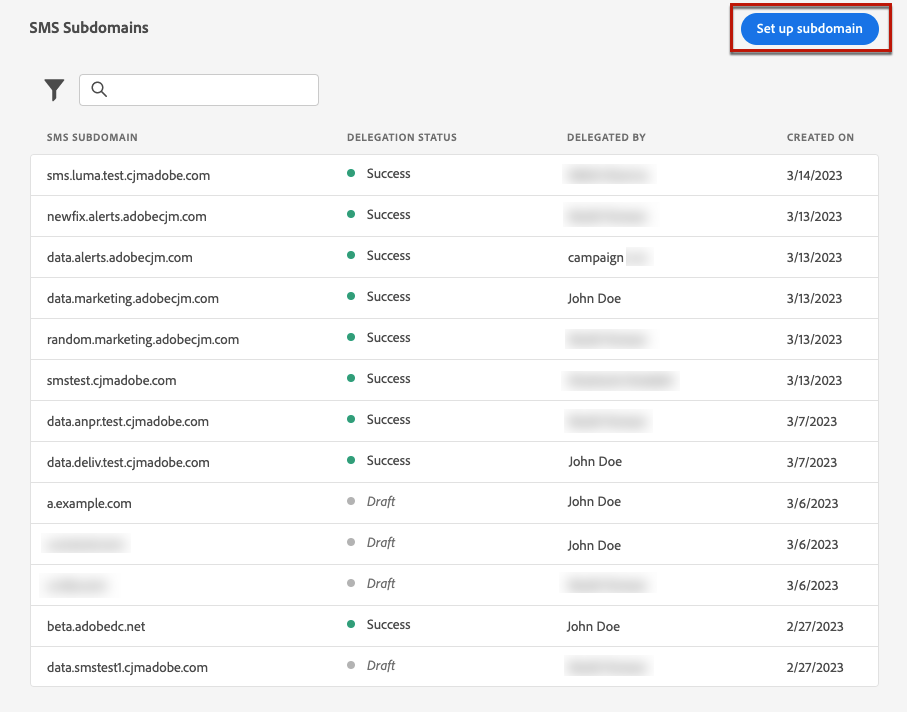
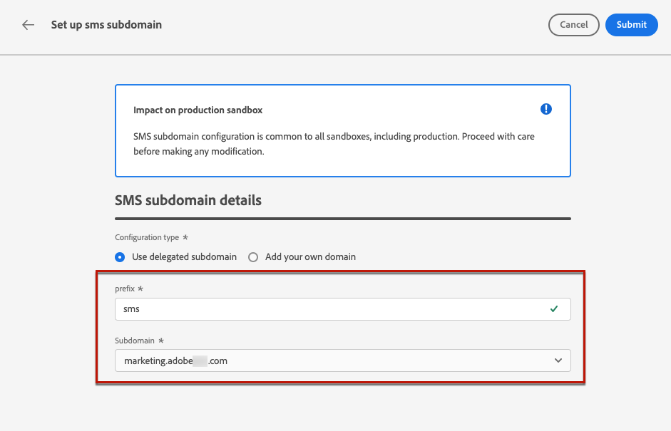
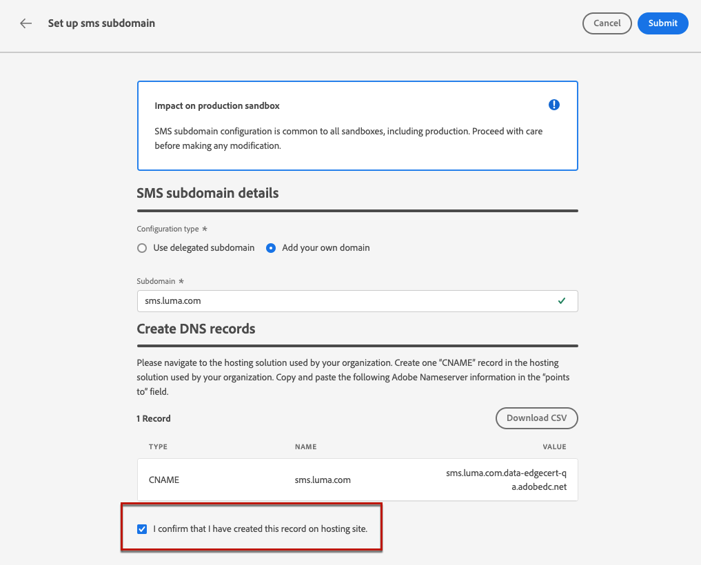

# Configurare i sottodomini SMS {#sms-mms-subdomains}

>[!CONTEXTUALHELP]
>id="ajo_admin_subdomain_sms_header"
>title="Delegare un sottodominio SMS/MMS"
>abstract="Configura il sottodominio per i messaggi di testo (SMS/MMS). Puoi utilizzare un sottodominio già delegato ad Adobe o configurarne un altro."

>[!CONTEXTUALHELP]
>id="ajo_admin_subdomain_sms"
>title="Delegare un sottodominio SMS/MMS"
>abstract="È necessario configurare un sottodominio da utilizzare per i messaggi di testo, che ti servirà per creare una configurazione di SMS. Puoi utilizzare un sottodominio già delegato ad Adobe o configurarne uno nuovo."
>additional-url="https://experienceleague.adobe.com/it/docs/journey-optimizer/using/channels/sms/configure-sms/sms-configuration-surface" text="Creare una configurazione SMS"

>[!CONTEXTUALHELP]
>id="ajo_admin_config_sms_subdomain"
>title="Selezionare un sottodominio SMS/MMS"
>abstract="Per creare una configurazione SMS, accertati di aver configurato in precedenza almeno un sottodominio SMS da selezionare dall’elenco dei nomi del sottodominio."
>additional-url="https://experienceleague.adobe.com/it/docs/journey-optimizer/using/channels/sms/configure-sms/sms-configuration-surface" text="Creare una configurazione SMS"

## Introduzione ai sottodomini SMS {#gs-sms-mms-subdomains}

Per ridurre gli URL aggiunti ai messaggi SMS/MMS, devi impostare il sottodominio che selezionerai quando [creerai una configurazione SMS](sms-configuration.md#message-preset-sms).

Puoi utilizzare un sottodominio già delegato ad Adobe oppure configurare un altro sottodominio. Ulteriori informazioni sulla delega dei sottodomini ad Adobe sono disponibili in [questa sezione](../configuration/delegate-subdomain.md).

La configurazione del sottodominio SMS è **condivisa tra tutti gli ambienti**. Pertanto, qualsiasi modifica a un sottodominio SMS influisce anche su altre sandbox di produzione.

Per accedere e modificare i sottodomini SMS, devi disporre dell&#39;autorizzazione **[!UICONTROL Gestione sottodomini SMS]** nella sandbox di produzione. Ulteriori informazioni sulle autorizzazioni sono disponibili in [questa sezione](../administration/high-low-permissions.md).

## Usa un sottodominio esistente {#sms-use-existing-subdomain}

Per utilizzare un sottodominio già delegato ad Adobe, segui i passaggi seguenti.

1. Passa al menu **[!UICONTROL Amministrazione]** > **[!UICONTROL Canali]** e seleziona **[!UICONTROL Impostazioni SMS]** > **[!UICONTROL Sottodomini SMS]**.

1. Fare clic su **[!UICONTROL Configura sottodominio]**.

   

1. Selezionare **[!UICONTROL Usa sottodominio delegato]** dalla sezione **[!UICONTROL Tipo di configurazione]**.

   

1. Immetti il prefisso che verrà visualizzato nell’URL dell’SMS.

   Sono consentiti solo caratteri alfanumerici e trattini.

   >[!CAUTION]
   >
   >Non utilizzare i prefissi `cdn` o `data` perché sono riservati per uso interno. È inoltre necessario evitare altri prefissi limitati o riservati come `dmarc` o `spf`.

1. Seleziona un sottodominio delegato dall’elenco.

   Non puoi selezionare un sottodominio già utilizzato come sottodominio SMS.

   <!--Capital letters are not allowed in subdomains. TBC by PM-->

   

   <!--Note that you cannot use multiple delegated subdomains of the same parent domain. For example, if 'marketing1.yourcompany.com' is already delegated to Adobe for your SMS messages, you will not be able to use 'marketing2.yourcompany.com'. However, multi-level subdomains being supported for SMS, you may proceed using a subdomain of 'marketing1.yourcompany.com' (such as 'email.marketing1.yourcompany.com'), or a different parent domain.-->

   >[!CAUTION]
   >
   >Se si seleziona un dominio delegato ad Adobe utilizzando il metodo [CNAME](../configuration/delegate-subdomain.md#cname-subdomain-setup), è necessario creare il record DNS nella piattaforma di hosting. Per generare il record DNS, il processo è lo stesso di quando configuri un nuovo sottodominio SMS. Scopri come in [questa sezione](#sms-configure-new-subdomain).

1. Fai clic su **[!UICONTROL Invia]**.

1. Dopo l&#39;invio, il sottodominio viene visualizzato nell&#39;elenco con lo stato **[!UICONTROL Elaborazione]**. Per ulteriori informazioni sugli stati dei sottodomini, consulta [questa sezione](../configuration/delegate-subdomain.md#access-delegated-subdomains).<!--Same statuses?-->

   Prima di poter utilizzare il sottodominio per l&#39;invio di messaggi, è necessario attendere che Adobe esegua i controlli richiesti, che possono richiedere **fino a 4 ore**.<!--Learn more in [this section](delegate-subdomain.md#subdomain-validation).-->

1. Una volta completati i controlli, il sottodominio ottiene lo stato **[!UICONTROL Completato]**. È pronto per essere utilizzato per creare configurazioni del canale SMS.

## Configurare un nuovo sottodominio {#sms-configure-new-subdomain}

>[!CONTEXTUALHELP]
>id="ajo_admin_sms_subdomain_dns"
>title="Generare il record DNS corrispondente"
>abstract="Per configurare un nuovo sottodominio SMS, devi copiare le informazioni del server dei nomi di Adobe visualizzate nell’interfaccia di Journey Optimizer e incollarle nella soluzione di hosting del dominio per generare il record DNS corrispondente. Una volta superati i controlli di verifica, il sottodominio è pronto per essere utilizzato per creare le configurazioni SMS."

Per configurare un nuovo sottodominio, segui i passaggi indicati di seguito.

1. Passa al menu **[!UICONTROL Amministrazione]** > **[!UICONTROL Canali]**, quindi seleziona **[!UICONTROL Impostazioni SMS]** > **[!UICONTROL Sottodomini SMS]**.

1. Fare clic su **[!UICONTROL Configura sottodominio]**.

   

1. Seleziona **[!UICONTROL Aggiungi il tuo dominio]** dalla sezione **[!UICONTROL Tipo di configurazione]**.

   

1. Specifica il sottodominio da delegare.

   >[!CAUTION]
   >
   >* Non puoi utilizzare un sottodominio SMS esistente.
   >
   >* Nei sottodomini non sono consentite lettere maiuscole.

   Non è consentito delegare un sottodominio non valido ad Adobe. Assicurati di immettere un sottodominio valido di proprietà della tua organizzazione, ad esempio marketing.yourcompany.com.

   Sono supportati i sottodomini a più livelli (dello stesso dominio padre). Ad esempio, puoi utilizzare &quot;sms.marketing.yourcompany.com&quot;.

1. Viene visualizzato il record da inserire nei server DNS. Copia questo record o scarica un file CSV, quindi accedi alla soluzione di hosting del tuo dominio per generare il record DNS corrispondente.

1. Assicurati che il record DNS sia stato generato nella soluzione di hosting del dominio. Se tutto è configurato correttamente, seleziona la casella &quot;Confermo...&quot;, quindi fai clic su **[!UICONTROL Invia]**.

   

   Quando configuri un nuovo sottodominio SMS, questo punta sempre a un record CNAME.

1. Una volta inviata la delega del sottodominio, il sottodominio viene visualizzato nell&#39;elenco con lo stato **[!UICONTROL Elaborazione]**. Per ulteriori informazioni sugli stati dei sottodomini, consulta [questa sezione](../configuration/delegate-subdomain.md#access-delegated-subdomains).<!--Same statuses?-->

Prima di utilizzare un sottodominio per l’invio di messaggi SMS, è necessario attendere che Adobe esegua i controlli richiesti, che possono richiedere fino a 4 ore.<!--Learn more in [this section](#subdomain-validation).--> Una volta completati i controlli, il sottodominio ottiene lo stato **[!UICONTROL Completato]**. È pronto per essere utilizzato per creare configurazioni del canale SMS.

Se non riesci a creare il record di convalida nella soluzione di hosting, il sottodominio verrà contrassegnato come **[!UICONTROL Non riuscito]**.

## Guardrail {#guardrails}

Attualmente, l&#39;interfaccia utente [!DNL Journey Optimizer] non supporta l&#39;eliminazione o l&#39;annullamento della delega dei sottodomini SMS una volta configurati.

Tuttavia, durante il test delle funzionalità all&#39;interno di [!DNL Journey Optimizer], potrebbe essere necessario creare un sottodominio SMS. Una volta completato il test, si potrebbero verificare ambienti disordinati con configurazioni non necessarie, in quanto l’interfaccia utente non consente di rimuovere o annullare la delega dei sottodomini SMS.

Di seguito sono riportati alcuni passaggi consigliati e considerazioni:

<!--As an alternative action, create a new SMS subdomain for future use cases and avoid using the existing one if it is no longer needed.-->

* Come best practice, è consigliabile mantenere un ambiente ordinato creando solo i componenti e le configurazioni necessari.
* Nelle situazioni in cui si verifica un impatto aziendale, contatta il rappresentante Adobe, che potrebbe essere in grado di fornire assistenza per la rimozione/rimozione della delega del sottodominio SMS. [Ulteriori informazioni](#undelegate-subdomain)
* Se è necessaria ulteriore assistenza, contatta Adobe per informazioni su come gestire efficacemente l’istanza.

## Annullare la delega di un sottodominio {#undelegate-subdomain}

Se desideri annullare la delega di un sottodominio SMS, rivolgiti al tuo rappresentante Adobe con il sottodominio da annullare la delega.

Se il sottodominio SMS punta a un record CNAME, puoi eliminare il record DNS CNAME creato per il sottodominio SMS dalla soluzione di hosting (ma non eliminare l’eventuale sottodominio e-mail originale).

>[!NOTE]
>
>Un sottodominio SMS può puntare a un record CNAME perché si tratta di un sottodominio [esistente](#sms-use-existing-subdomain) delegato ad Adobe utilizzando il metodo [CNAME](../configuration/delegate-subdomain.md#cname-subdomain-setup) o di un [nuovo sottodominio SMS](#sms-configure-new-subdomain) configurato.

Dopo che la richiesta è gestita da Adobe, il dominio non delegato non viene più visualizzato nella pagina di inventario del sottodominio.
