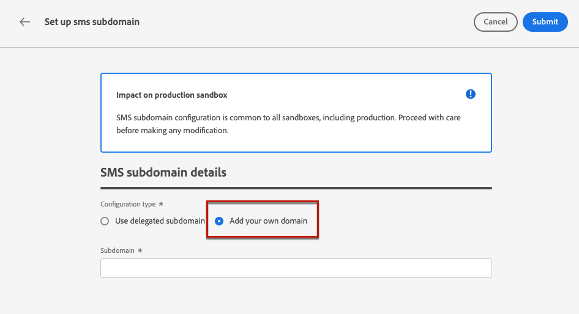

# Configurare i sottodomini SMS {#lp-subdomains}

>[!CONTEXTUALHELP]
>id="ajo_admin_subdomain_sms_header"
>title="Delegare un sottodominio SMS"
>abstract="Devi configurare il sottodominio da utilizzare per gli SMS. Puoi utilizzare un sottodominio già delegato ad Adobe o configurarne un altro."

>[!CONTEXTUALHELP]
>id="ajo_admin_subdomain_sms"
>title="Delegare un sottodominio SMS"
>abstract="Devi configurare un sottodominio da utilizzare per i messaggi SMS, che ti servirà per creare una superficie SMS. Puoi utilizzare un sottodominio già delegato ad Adobe o configurarne uno nuovo."
>additional-url="https://experienceleague.adobe.com/docs/journey-optimizer/using/sms/sms-configuration.html?lang=it#message-preset-sms" text="Creare superfici SMS"

>[!CONTEXTUALHELP]
>id="ajo_admin_config_sms_subdomain"
>title="Selezionare un sottodominio SMS"
>abstract="Per creare una superficie SMS, accertati di aver configurato in precedenza almeno un sottodominio SMS da selezionare dall’elenco dei nomi di sottodominio."
>additional-url="https://experienceleague.adobe.com/docs/journey-optimizer/using/sms/sms-configuration.html?lang=it#message-preset-sms" text="Creare superfici SMS"

Per ridurre gli URL aggiunti ai messaggi SMS, devi impostare il sottodominio da selezionare quando [creazione di una superficie SMS](sms-configuration.md#message-preset-sms).

Puoi utilizzare un sottodominio già delegato ad Adobe oppure configurare un altro sottodominio. Ulteriori informazioni sulla delega dei sottodomini ad Adobe in [questa sezione](../configuration/delegate-subdomain.md).

>[!CAUTION]
>
>La configurazione del sottodominio SMS è comune a tutti gli ambienti. Pertanto:
>
>* Per accedere e modificare i sottodomini SMS, devi disporre dei **[!UICONTROL Gestire i sottodomini SMS]** autorizzazione per la sandbox di produzione.
>
> * Eventuali modifiche a un sottodominio SMS avranno un impatto anche sulle sandbox di produzione.

## Utilizzare un sottodominio esistente {#sms-use-existing-subdomain}

Per utilizzare un sottodominio già delegato ad Adobe, segui i passaggi seguenti.

1. Accedere al **[!UICONTROL Amministrazione]** > **[!UICONTROL Canali]** quindi seleziona **[!UICONTROL Configurazione SMS]** > **[!UICONTROL Sottodomini SMS]**.

   

1. Fai clic su **[!UICONTROL Imposta sottodominio]**.

   

1. Seleziona **[!UICONTROL Usa sottodominio delegato]** dal **[!UICONTROL Tipo di configurazione]** sezione .

   

1. Immetti il prefisso che verrà visualizzato nell’URL SMS.

   >[!NOTE]
   >
   >Sono consentiti solo caratteri alfanumerici e trattini.

1. Seleziona un sottodominio delegato dall’elenco.

   >[!NOTE]
   >
   >Non puoi selezionare un sottodominio già utilizzato come sottodominio SMS.

   <!--Capital letters are not allowed in subdomains. TBC by PM-->

   

   <!--Note that you cannot use multiple delegated subdomains of the same parent domain. For example, if 'marketing1.yourcompany.com' is already delegated to Adobe for your SMS messages, you will not be able to use 'marketing2.yourcompany.com'. However, multi-level subdomains being supported for SMS, you may proceed using a subdomain of 'marketing1.yourcompany.com' (such as 'email.marketing1.yourcompany.com'), or a different parent domain.-->

   >[!CAUTION]
   >
   >Se selezioni un dominio delegato ad Adobe utilizzando [metodo CNAME](../configuration/delegate-subdomain.md#cname-subdomain-delegation), devi creare il record DNS sulla piattaforma di hosting. Per generare il record DNS, il processo è lo stesso di quando configuri un nuovo sottodominio SMS. Scopri come in [questa sezione](#sms-configure-new-subdomain).

1. Fai clic su **[!UICONTROL Invia]**.

1. Dopo l’invio, il sottodominio viene visualizzato nell’elenco con la **[!UICONTROL Elaborazione]** stato. Per ulteriori informazioni sugli stati dei sottodomini, consulta [questa sezione](../configuration/about-subdomain-delegation.md#access-delegated-subdomains).<!--Same statuses?-->

   >[!NOTE]
   >
   >Prima di poter utilizzare quel sottodominio per inviare messaggi, è necessario attendere che Adobe esegua i controlli richiesti, che possono richiedere fino a 4 ore.<!--Learn more in [this section](delegate-subdomain.md#subdomain-validation).-->

1. Una volta eseguiti i controlli, il sottodominio ottiene il **[!UICONTROL Completato]** stato. È pronto per essere utilizzato per creare superfici del canale SMS.

## Configurare un nuovo sottodominio {#sms-configure-new-subdomain}

>[!CONTEXTUALHELP]
>id="ajo_admin_sms_subdomain_dns"
>title="Generare il record DNS corrispondente"
>abstract="Per configurare un nuovo sottodominio SMS, devi copiare le informazioni del server dei nomi di Adobe visualizzate nell’interfaccia di Journey Optimizer e incollarle nella soluzione di hosting del dominio per generare il record DNS corrispondente. Una volta superati i controlli di verifica, il sottodominio è pronto per essere utilizzato per creare le superfici SMS."

Per configurare un nuovo sottodominio, effettua le seguenti operazioni.

1. Accedere al **[!UICONTROL Amministrazione]** > **[!UICONTROL Canali]** quindi seleziona **[!UICONTROL Configurazione SMS]** > **[!UICONTROL Sottodomini SMS]**.

1. Fai clic su **[!UICONTROL Imposta sottodominio]**.

1. Seleziona **[!UICONTROL Aggiungi il tuo dominio]** dal **[!UICONTROL Tipo di configurazione]** sezione .

   

1. Specifica il sottodominio da delegare.

   >[!CAUTION]
   >
   >Non puoi utilizzare un sottodominio SMS esistente.
   >
   >Le lettere maiuscole non sono consentite nei sottodomini.

   Delega di un sottodominio non valido ad Adobe non consentita. Assicurati di inserire un sottodominio valido di proprietà della tua organizzazione, ad esempio marketing.yourcompany.com.

   >[!NOTE]
   >
   >Sono supportati i sottodomini a più livelli (dello stesso dominio padre). Ad esempio, puoi utilizzare &#39;sms.marketing.yourcompany.com&#39;.

1. Viene visualizzato il record da inserire nei server DNS. Copia questo record o scarica un file CSV, quindi accedi alla tua soluzione di hosting del dominio per generare il record DNS corrispondente.

1. Assicurati che il record DNS sia stato generato nella tua soluzione di hosting del dominio. Se tutto è configurato correttamente, seleziona la casella &quot;Confermo...&quot;, quindi fai clic su **[!UICONTROL Invia]**.

   

   >[!NOTE]
   >
   >Quando configuri un nuovo sottodominio SMS, farà sempre riferimento a un record CNAME.

1. Una volta inviata la delega del sottodominio, il sottodominio viene visualizzato nell’elenco con la **[!UICONTROL Elaborazione]** stato. Per ulteriori informazioni sugli stati dei sottodomini, consulta [questa sezione](../configuration/about-subdomain-delegation.md#access-delegated-subdomains).<!--Same statuses?-->

   >[!NOTE]
   >
   >Prima di poter utilizzare quel sottodominio per inviare messaggi SMS, è necessario attendere che Adobe esegua i controlli richiesti, che possono richiedere fino a 4 ore.<!--Learn more in [this section](#subdomain-validation).-->

1. Una volta eseguiti i controlli, il sottodominio ottiene il **[!UICONTROL Completato]** stato. È pronto per essere utilizzato per creare superfici del canale SMS.

   Il sottodominio verrà contrassegnato come **[!UICONTROL Non riuscito]** se non riesci a creare il record di convalida nella soluzione di hosting.
